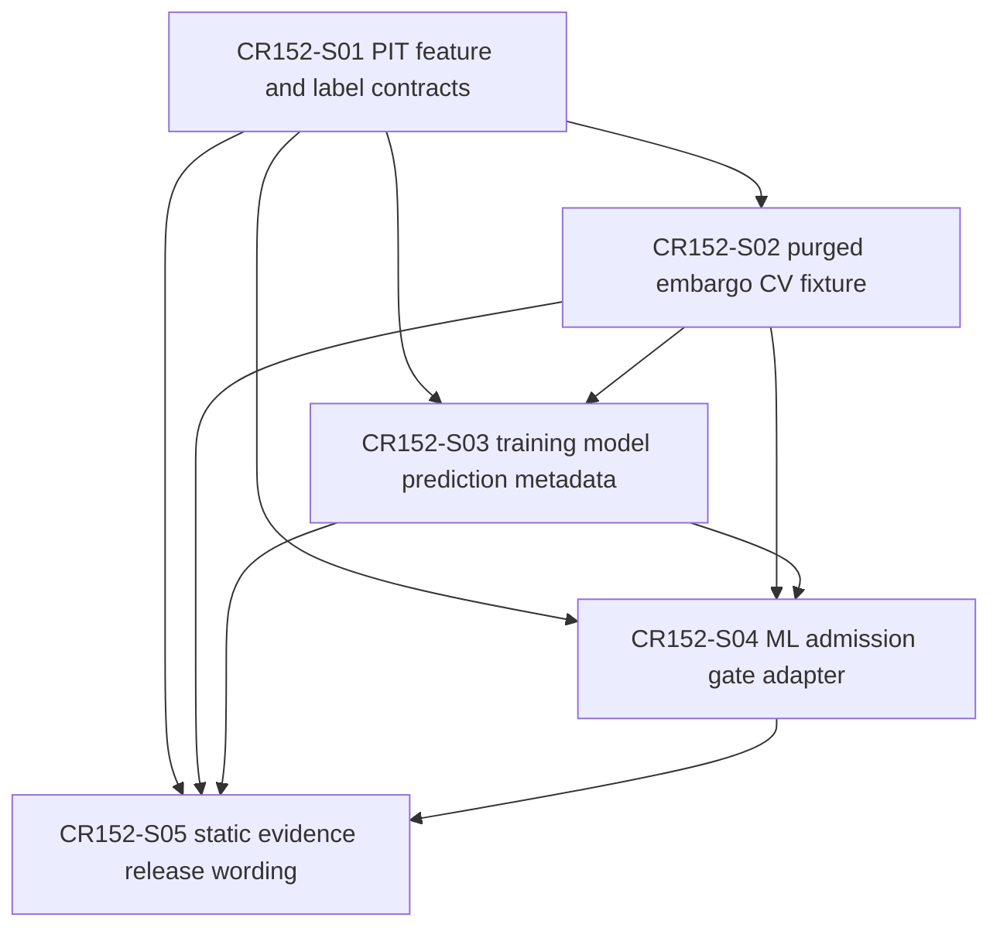

# CR152 Story Backlog

## Scope Boundary

CR152 CP4 only completes Story planning, Feature Design Matrix updates, Story cards, DAG / Wave planning and CP4 automatic precheck. CP5 approval is required before implementation. This CP4 does not authorize source implementation, real training, real data validation, model registry write, feature/label/model/prediction store writes, real lake/NAS/provider/QMT/runtime/simulation/live/trading/broker/credential/external framework/Git remote/catalog pointer operations.

## Story Overview

| Story ID | Title | Owner Feature | LLD Policy | Wave | Depends On | Status |
|---|---|---|---|---|---|---|
| CR152-S01-pit-feature-label-contracts | PIT feature matrix and label policy contracts | FEAT-03 | full-lld | CR152-W1-PIT-LABEL | none | ready-for-verification |
| CR152-S02-purged-embargo-cv-fixture-contract | Purged embargo CV and fixture contract | FEAT-03 | full-lld | CR152-W2-CV-FIXTURE | CR152-S01 | ready-for-verification |
| CR152-S03-training-model-prediction-metadata | Training, model and prediction metadata | FEAT-03 | full-lld | CR152-W3-ARTIFACT-METADATA | CR152-S01, CR152-S02 | ready-for-verification |
| CR152-S04-ml-admission-gate-adapter | ML admission gate adapter | FEAT-03 / FEAT-07 | full-lld | CR152-W4-ML-GATE | CR152-S01, CR152-S02, CR152-S03 | ready-for-verification |
| CR152-S05-static-evidence-release-wording | Static evidence and release wording | FEAT-03 / FEAT-08 | technical-note | CR152-W5-EVIDENCE | CR152-S01, CR152-S02, CR152-S03, CR152-S04 | ready-for-verification |

## Story Details

### CR152-S01 PIT feature matrix and label policy contracts

Freeze the PIT feature matrix, label policy and leakage guard contracts anchored to `ResearchDatasetSpec` and `LeakagePolicy`.

Acceptance criteria:

- Defines local/static metadata contracts for PIT feature matrix and label policy.
- Label policy reserves `fixed_window`, `triple_barrier` and `meta_label` method slots.
- CP5 LLD must resolve the first-wave `triple_barrier` active-method ambiguity; recommended enforcement is `BLOCKED`.
- Leakage fixtures cover feature availability after decision time and invalid label availability.
- No parallel replacement for `ResearchDatasetSpec` or `LeakagePolicy`.

### CR152-S02 Purged embargo CV and fixture contract

Define purged + embargo CV split policy, split audit and deterministic fixture requirements.

Acceptance criteria:

- Defines fold boundaries, purge window, embargo gap, train/validation/test separation and overlap audit.
- Fixture contract includes entity/date, decision_time, feature_available_at, label window, fold boundary, purge window, embargo gap and prediction_timestamp.
- Provides at least one passing fixture case and one leakage/overlap negative case for CP6 tests.
- Does not read real lake, provider, NAS or external framework data.

### CR152-S03 Training, model and prediction metadata

Extend or compose existing `TrainingSnapshotSpec` and `ModelArtifactRef` anchors for ML artifact metadata.

Acceptance criteria:

- Contract delta table maps all new metadata to existing anchors.
- Model artifact metadata remains ref/hash/linkage only and is not registry write.
- Prediction artifact metadata is local/static and does not write a prediction store.
- Forbidden operation counters include registry/store/catalog mutations and must remain zero.
- No model training or artifact binary persistence is authorized.

### CR152-S04 ML admission gate adapter

Define ML-specific admission gate summary and adapter to CR151 four-state status semantics and admission package linkage.

Acceptance criteria:

- Maps ML gate status to `PASS / FAIL / NEEDS_REVIEW / BLOCKED`.
- Admission package linkage records `gate_present`, `gate_required`, `gate_status`, `gate_ref` and blocked reasons.
- Missing mandatory ML evidence returns `BLOCKED`.
- Nonzero forbidden operation counters return `BLOCKED`.
- If adapter field mapping needs architecture deepening, CP5 records meta-se dispatch or inline-fallback approval.

### CR152-S05 Static evidence and release wording

Close process evidence, CP7/CP8 wording and release boundary for CR152.

Acceptance criteria:

- Evidence and release wording state fixture-only contract semantics.
- Release wording does not claim real model performance, production readiness, registry publication, runtime readiness or trading readiness.
- Deferred later-wave items remain explicit.
- CP8 retains no-real-training, no-real-data and no-registry-write limitations.

## Dependency DAG

## File Ownership Summary

| Story | Primary owner | Shared / merge owner | Forbidden |
|---|---|---|---|
| CR152-S01 | `engine/research_production_contracts.py`, `tests/research/test_ml_strategy_e2e_contracts.py` | S01 owns PIT/label contract foundations | real lake/provider/NAS data, external ML framework imports |
| CR152-S02 | `engine/research_production_contracts.py`, `tests/research/test_ml_strategy_e2e_contracts.py` | S02 owns CV split audit after S01 label fields freeze | schema-only fixture that cannot prove purge/embargo |
| CR152-S03 | `engine/training_snapshot_contract.py`, `engine/research_manifest.py`, `tests/research/test_ml_strategy_e2e_contracts.py` | S03 owns metadata linkage and no-registry counters | registry writer, publish/promote/upload/set_current, catalog mutation |
| CR152-S04 | future ML gate companion module, `engine/strategy_admission_package.py`, tests | S04 owns adapter/status/package linkage | treating ML gate PASS as runtime, simulation, live, broker or trading readiness |
| CR152-S05 | `process/returns/*`, `process/evidence/*`, `docs/release/*`, CP7/CP8 artifacts | S05 owns wording/evidence consolidation | claiming real model performance, registry publication or production readiness |

## Not Authorized

- No source implementation before CP5 approval.
- No real model training or hyperparameter search.
- No real data validation.
- No model registry write, publish, promote, upload or set_current.
- No feature store, label store, model store or prediction store write.
- No catalog pointer mutation.
- No `.env`, token, secret, account, session or credential read.
- No real lake, NAS, provider or Git remote access.
- No QMT / MiniQMT / xtquant runtime, broker read/write, account query, market query, submit/cancel, simulation, paper, live or trading.
- No external framework clone, install or run.
