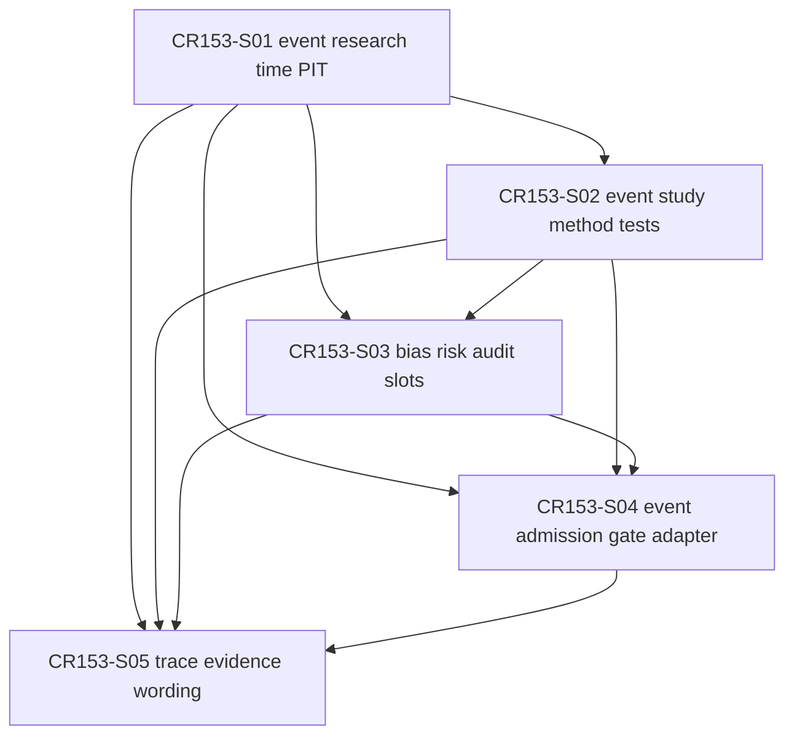

# CR153 Story Backlog

## Scope Boundary

CR153 CP4 only completes Story planning, Feature Design Matrix updates, Story cards, DAG / Wave planning and CP4 automatic precheck. CP5 approval is required before LLD acceptance or implementation. This CP4 does not authorize source implementation, real event feeds, live listeners, real lake/NAS/provider/QMT/runtime/simulation/live/trading/broker/credential/external framework/Git remote/catalog pointer operations, event store writes, model registry writes, real order flow or real data validation.

## Story Overview

| Story ID | Title | Owner Feature | LLD Policy | Wave | Depends On | Status |
|---|---|---|---|---|---|---|
| CR153-S01-event-research-time-pit-contracts | Event research time semantics and PIT revision gate | FEAT-03 | full-lld | CR153-W1-EVENT-PIT | none | lld-ready-for-review |
| CR153-S02-event-study-method-test-slots | Event study method, test family and multiple-testing slots | FEAT-03 | full-lld | CR153-W2-METHOD-TESTS | CR153-S01 | lld-ready-for-review |
| CR153-S03-event-bias-risk-audit-slots | Cluster, endogeneity, CV and universe PIT audit slots | FEAT-03 | full-lld | CR153-W3-BIAS-RISK-SLOTS | CR153-S01, CR153-S02 | lld-ready-for-review |
| CR153-S04-event-admission-gate-adapter | Event admission gate and shared status adapter | FEAT-03 / FEAT-07 | full-lld | CR153-W4-EVENT-GATE | CR153-S01, CR153-S02, CR153-S03 | lld-ready-for-review |
| CR153-S05-event-trace-evidence-wording | Event-to-signal/order-intent trace and static evidence wording | FEAT-03 / FEAT-08 | technical-note | CR153-W5-TRACE-EVIDENCE | CR153-S01, CR153-S02, CR153-S03, CR153-S04 | lld-ready-for-review |

## Story Details

### CR153-S01 Event research time semantics and PIT revision gate

Define `EventResearchSpec`, event identity, event type, entity keys, three-time semantics and event revision/PIT gate anchored to existing research dataset contracts.

Acceptance criteria:

- Defines event identity, event type, entity id, source snapshot refs and revision policy fields.
- Requires `event_occurred_at`, `event_announced_at`, `event_available_at` and `decision_time`, or explicit `n/a_reason` where CP5 allows N/A.
- `event_available_at > decision_time` fails closed and cannot be inferred from occurred or announced time.
- Includes at least one passing fixture and one look-ahead negative fixture.
- Does not read real lake, NAS, provider, credential, catalog current truth or event feed.

### CR153-S02 Event study method, test family and multiple-testing slots

Define event study method evidence, test family slots and EV-GAP-7 multiple testing / data snooping slot.

Acceptance criteria:

- `EventStudyMethodSpec` covers estimation window, event window, normal return model, return horizon and CAR/BHAR/calendar-time slots.
- `EventStudyTestReport` reserves Patell, BMP, generalized sign, rank and bootstrap slots with status, refs, sample count and p-value fields.
- Explicitly includes `multiple_testing_or_data_snooping_slot` with `family_id`, `tested_window_count`, `correction_method`, `adjusted_p_value`, `status`, and `report_ref` or `n/a_reason`.
- Owns only method, test family and multiple-testing / data-snooping fields; it must not define overlap, cluster, endogeneity, event CV or universe PIT audit fields owned by S03.
- Unsupported active algorithms such as White Reality Check, Hansen SPA, Romano-Wolf, PBO or DSR remain slot-only and fail closed or require review per CP5.
- Does not implement full statistics libraries in CR153 first wave.

### CR153-S03 Cluster, endogeneity, CV and universe PIT audit slots

Preserve machine-visible bias and reliability risks without expanding CR153 into full production reliability governance.

Acceptance criteria:

- Defines overlap / cluster report slot with status, refs and `n/a_reason`.
- Defines endogeneity / self-selection treatment slot with status, refs and `n/a_reason`.
- Defines event CV split audit refs for walk-forward / OOS / purged-embargo evidence, but full CV governance stays deferred to CR154.
- Defines `universe_pit_audit` slot for survivorship-free universe evidence, but full survivorship gate stays deferred to CR154.
- Owns only overlap / cluster / endogeneity, event CV and universe PIT audit fields; it must not redefine S02 method, test family or multiple-testing / data-snooping fields.
- Capacity, market impact, regime and reconciliation remain deferred and visible as limitations.

### CR153-S04 Event admission gate and shared status adapter

Define `EventStrategyAdmissionGate`, event-specific fail-closed evaluation and adapter linkage to shared admission status semantics.

Acceptance criteria:

- Maps event gate status to `PASS / FAIL / NEEDS_REVIEW / BLOCKED`.
- Missing mandatory PIT, method, test family, multiple-testing or trace evidence returns `BLOCKED`.
- Nonzero forbidden operation counters return `BLOCKED`.
- `StrategyAdmissionPackage` linkage records event gate presence, requirement, status, refs and blocked reasons.
- Event gate PASS is not runtime, paper, live, broker, real feed or trading readiness.

### CR153-S05 Event-to-signal/order-intent trace and static evidence wording

Close trace metadata and downstream evidence wording while preserving the no-runtime boundary.

Acceptance criteria:

- Defines event -> signal -> target/order-intent trace metadata refs only.
- Trace metadata cannot submit, cancel, query, persist or mutate broker/runtime/order state.
- CP7/CP8 wording states fixture-only contract semantics and no real event feed, no real alpha and no trading readiness.
- Deferred CR154 risks remain explicit.
- Release wording cannot claim event store/catalog/model registry publication or production readiness.
- CP5 technical note must enumerate exact CR153 return/evidence/release wording artifacts or mark each artifact family N/A; broad `process/returns/*`, `process/evidence/*` or `docs/release/*` ownership is not sufficient for implementation.

## Dependency DAG

## File Ownership Summary

| Story | Primary owner | Shared / merge owner | Forbidden |
|---|---|---|---|
| CR153-S01 | `engine/research_production_contracts.py`, `tests/research/test_event_driven_strategy_e2e_contracts.py` | S01 owns event identity, time semantics and PIT/revision foundations | inferring availability time, real lake/provider/NAS/feed reads |
| CR153-S02 | `engine/event_strategy_contracts.py`, `tests/research/test_event_driven_strategy_e2e_contracts.py` | S02 owns only method/test-family/multiple-testing fields after S01 time fields freeze; no bias/CV/universe fields | implementing full Patell/BMP/bootstrap/White/Hansen/PBO/DSR algorithms in first wave; redefining S03-owned fields |
| CR153-S03 | `engine/event_strategy_contracts.py`, `tests/research/test_event_driven_strategy_e2e_contracts.py` | S03 owns only bias/CV/universe PIT audit fields and CR154 deferred refs; no method/test-family fields | silently treating CV/survivorship/capacity as complete; redefining S02-owned fields |
| CR153-S04 | `engine/event_strategy_admission_gate.py`, `engine/strategy_admission_package.py`, tests | S04 owns event gate, adapter and admission package linkage | turning event gate PASS into runtime/trading readiness |
| CR153-S05 | `process/returns/CR153-*.return.json`, `process/evidence/CR153-*.index.json`, `process/checks/CP7-CR153-*.result.*`, `process/checkpoints/CP8-CR153-*.md`, `process/release/RELEASE-CONTEXT-CR153.yaml`, optional `docs/release/RELEASE-NOTES.md` CR153 section only if CP8 requires it | S05 owns trace/evidence wording after S01-S04 design decisions stabilize; CP5 technical note must list exact artifacts or N/A | creating real order flow, event store, catalog, registry or broker operations; broad release-doc ownership without exact CR153 target |

## Not Authorized

- No source implementation before CP5 approval.
- No real event feed, provider fetch or live event listener.
- No event store, catalog pointer, feature store, label store, model registry or prediction store write.
- No real lake/NAS access, sync or write.
- No `.env`, token, secret, account, session or credential read.
- No QMT / MiniQMT / xtquant runtime, broker read/write, account query, market query, submit/cancel, simulation, paper, live or trading.
- No external framework clone, install or run.
- No Git remote write.
- No real data validation, real alpha claim, production readiness claim or trading readiness claim.
