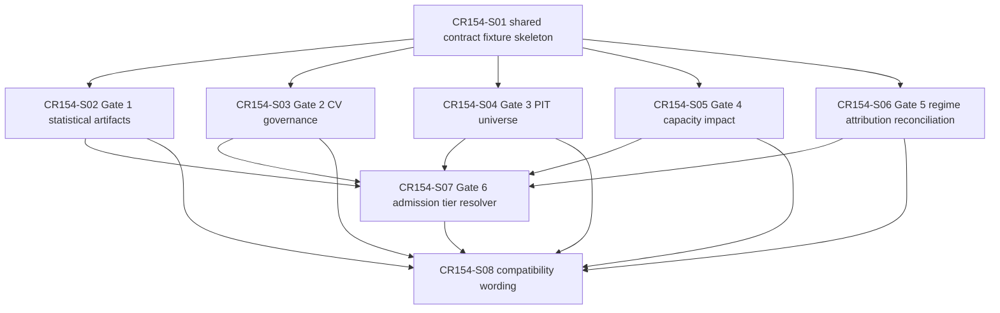

# CR154 Story Backlog

## Scope Boundary

CR154 CP4 only completes Story planning, Feature Design Matrix updates, Story cards, dependency DAG, Wave planning and CP4 automatic precheck. It does not authorize LLD approval, source implementation, test implementation, real lake/NAS/provider/QMT/runtime/simulation/paper/live/trading/broker/credential/feed/order/reconciliation/store/catalog/registry/publish or true release execution.

## Story Overview

| Story ID | Title | Owner Feature | LLD Policy | Wave | Depends On | Status |
|---|---|---|---|---|---|---|
| CR154-S01-shared-gate-contract-fixture-skeleton | Shared gate contract and first runnable fixture skeleton | FEAT-15 | full-lld | CR154-W1-CONTRACT-SKELETON | none | lld-design-required |
| CR154-S02-statistical-artifacts-and-trap-severity | Gate 1 statistical artifacts and trap severity policy | FEAT-15 | full-lld | CR154-W2-GATE-POLICIES | CR154-S01 | lld-design-required |
| CR154-S03-cross-strategy-cv-governance | Gate 2 cross-strategy CV governance | FEAT-15 | full-lld | CR154-W2-GATE-POLICIES | CR154-S01 | lld-design-required |
| CR154-S04-pit-universe-survivorship-gate | Gate 3 PIT universe and survivorship gate | FEAT-15 | full-lld | CR154-W2-GATE-POLICIES | CR154-S01 | lld-design-required |
| CR154-S05-capacity-impact-liquidity-contract | Gate 4 capacity, impact and liquidity contract | FEAT-15 | full-lld | CR154-W2-GATE-POLICIES | CR154-S01 | lld-design-required |
| CR154-S06-regime-attribution-reconciliation-slots | Gate 5 regime, attribution and reconciliation slots | FEAT-15 | full-lld | CR154-W2-GATE-POLICIES | CR154-S01 | lld-design-required |
| CR154-S07-admission-default-policy-tier-resolution | Gate 6 admission default policy tier resolution | FEAT-15 / FEAT-07 | full-lld | CR154-W3-ADMISSION-POLICY | CR154-S02, CR154-S03, CR154-S04, CR154-S05, CR154-S06 | lld-design-required |
| CR154-S08-compatibility-follow-through-wording | Compatibility, follow-through hooks and static evidence wording | FEAT-15 / FEAT-08 | technical-note | CR154-W4-COMPATIBILITY-WORDING | CR154-S02, CR154-S03, CR154-S04, CR154-S05, CR154-S06, CR154-S07 | technical-note-required |

## Story Details

### CR154-S01 Shared gate contract and first runnable fixture skeleton

Define the shared reliability gate summary, artifact refs, status enum, blocked claims, release-blocking reason and first runnable fixture schema.

Acceptance criteria:

- Defines a shared contract shape that can represent `PASS`, `FAIL`, `NEEDS_REVIEW`, `BLOCKED` and artifact-level `n/a-with-reason`.
- Includes first runnable deterministic fixture schema with one PASS case, one missing mandatory evidence case and one forbidden-operation `BLOCKED` case.
- Stores blocked claims, release-blocking reason, gate mode and forbidden-operation counters.
- Provides adapter mapping placeholders for multifactor, ML and event-driven strategies without defining gate-specific evidence policy.
- Does not read real lake/NAS/provider, credentials, runtime, broker, feed, store, catalog or registry.

### CR154-S02 Gate 1 statistical artifacts and trap severity policy

Define the statistical reliability artifact model and backtest trap policy.

Acceptance criteria:

- Defines at least the 12 CP3-required statistical reliability artifacts: multiple-testing correction refs, FDR/BH refs, WRC/SPA refs, PBO/CSCV refs, DSR/deflation refs, trial count/effective trials, OOS split refs, purge/embargo refs, survivorship audit refs, impact/capacity refs, blocked claims and release-blocking reason.
- Defines severity mapping for missing WRC/SPA or equivalent data-snooping correction by release profile and claim type.
- Defines DSR/PBO/trial-count threshold defaults, config ownership or explicit `n/a-with-reason` policy for CP5.
- Defines Gate 3/4 blocked-state propagation into Gate 1 refs, blocked claims and release-blocking reason.
- CP5 LLD must split adapter subtasks by strategy family: multifactor, ML and event-driven.

### CR154-S03 Gate 2 cross-strategy CV governance

Define shared walk-forward / OOS / purged-embargo governance across strategy classes.

Acceptance criteria:

- Defines shared fields for split manifest refs, OOS split refs, purge/embargo refs, fold count, time ordering and leakage status.
- Preserves CR152 ML CV semantics as an adapter input without forcing ML-only interpretation onto multifactor or event-driven strategies.
- Missing OOS or purge/embargo evidence fails closed for release-blocking profiles or produces explicit `n/a-with-reason` where tier policy allows.
- Includes fixtures for passing CV, missing OOS refs, missing purge/embargo refs and strategy-specific n/a cases.

### CR154-S04 Gate 3 PIT universe and survivorship gate

Define the shared survivorship-free / PIT universe gate and CR153 slot lifecycle.

Acceptance criteria:

- Defines PIT universe status, universe source refs, as-of / available-at audit refs, survivorship-free evidence refs and blocked claims.
- Retains CR153 `universe_pit_audit` as a first-wave source slot delegated to CR154 shared gate wording.
- Defines whether CR153-side slot is retained, delegated-to-CR154 or later-deprecated; deletion is forbidden in CR154 first wave.
- Missing or non-PIT universe evidence cannot claim survivorship-free research, production-like readiness or PIT universe support.
- Does not construct, fetch, read or publish real universe data.

### CR154-S05 Gate 4 capacity, impact and liquidity contract

Define ADV participation, capacity dollars, market impact family and liquidity sizing evidence.

Acceptance criteria:

- Defines ADV participation, capacity dollars, liquidity sizing refs, cost-underestimation status and blocked claims.
- Defines `impact_model_family` enum: `square_root`, `almgren_chriss`, `gatheral`, `custom`, `n/a-with-reason`.
- `custom` requires rationale, inputs, validation boundary and release wording limits.
- First wave explicitly states `no_real_tca_claim`; no real execution replay, fills or broker data are used.
- Missing capacity/impact evidence blocks production-like claims or marks allowed n/a/review only where tier policy permits.

### CR154-S06 Gate 5 regime, attribution and reconciliation slots

Define structured slots for regime, attribution and reconciliation without running real runtime or broker reconciliation.

Acceptance criteria:

- Defines regime evidence status, attribution refs, reconciliation refs and `n/a-with-reason` validation.
- Distinguishes slot visibility from real reconciliation capability.
- Missing slot reason is `NEEDS_REVIEW` or `BLOCKED` per tier policy; silent omission is not allowed.
- Release wording cannot imply real paper/live/runtime/broker reconciliation readiness.
- This Story exists explicitly; Gate 5 must not be hidden inside compatibility or release wording work.

### CR154-S07 Gate 6 admission default policy tier resolution

Define the admission tier resolver and release wording linkage.

Acceptance criteria:

- Implements the HLD §8 T0/T1/T2/T3 tier table as a CP5 design contract.
- Defines whether tier resolution is config mapping, function, or hybrid, including per-strategy-class overrides and fallback rules.
- Unknown release profile fails closed until classified.
- Converts gate statuses into opt-in, default-required, release-blocking or not-authorized wording without changing runtime authorization.
- Includes compatibility fixtures for exploratory, admission candidate, production-like and paper/live/trading/runtime profiles.

### CR154-S08 Compatibility, follow-through hooks and static evidence wording

Close compatibility and evidence wording while preserving deferred scope.

Acceptance criteria:

- Preserves CR151/CR152/CR153 compatibility and exact adapter source semantics.
- Records `MF-GAP-2/6/7 deferred to factor-evaluation follow-up CR`.
- Records CP3 REQ anchor preservation or routes product-baseline refresh before implementation if traceability fails.
- ML-only triple-barrier/meta-labeling/feature-importance fields must be explicit `n/a-with-reason` for non-ML strategy adapters.
- Release wording states fixture-only contract semantics and no real data, production, paper/live, broker or trading readiness.

## Dependency DAG

## File Ownership Summary

| Story | Primary owner | Shared / merge owner | Forbidden |
|---|---|---|---|
| CR154-S01 | Future `engine/cross_strategy_reliability_gates.py`, future `tests/research/test_cross_strategy_reliability_gates.py` | S01 owns base schema, status enum, blocked claims and first fixture schema. | Gate-specific policy fields beyond placeholders; real lake/NAS/provider/runtime/broker access. |
| CR154-S02 | Same future module/test, statistical artifact section | S02 owns Gate 1 fields and adapter subtask mapping; merge after S01. | Hiding WRC/SPA/PBO/DSR behind generic trap labels. |
| CR154-S03 | Same future module/test, CV section | S03 owns Gate 2 CV governance only. | Replacing CR152 ML-specific semantics or forcing them onto all strategies. |
| CR154-S04 | Same future module/test, PIT universe section; compatibility refs to `engine/event_strategy_contracts.py` only after CP5 | S04 owns Gate 3 and CR153 slot lifecycle wording. | Deleting CR153 slot; real universe construction or provider/lake reads. |
| CR154-S05 | Same future module/test, capacity/impact section | S05 owns Gate 4 and `impact_model_family` enum. | Real TCA, broker fills, execution replay or empirical impact calibration. |
| CR154-S06 | Same future module/test, regime/attribution/reconciliation section | S06 owns Gate 5 slots. | Runtime or broker reconciliation. |
| CR154-S07 | Future `engine/strategy_admission_package.py` integration and shared module policy resolver | S07 owns tier resolver and release wording mapping after S02-S06 status semantics freeze. | Treating reliability PASS as paper/live/trading readiness. |
| CR154-S08 | CR154 return/evidence/release wording artifacts after CP6/CP7 only | S08 owns exact compatibility and wording targets; CP5 technical note must enumerate exact artifact paths or N/A. | Broad release-doc ownership; real publish or production readiness wording. |

## Not Authorized

- No LLD approval, source implementation or test implementation before later gates.
- No real lake/NAS/provider/QMT/runtime/simulation/paper/live/trading/broker/credential/feed/order/reconciliation/store/catalog/registry/publish or Git remote action.
- No external framework clone, install or run.
- No real data validation, real TCA, real reconciliation, paper/live readiness, broker readiness, trading readiness or true release execution.
