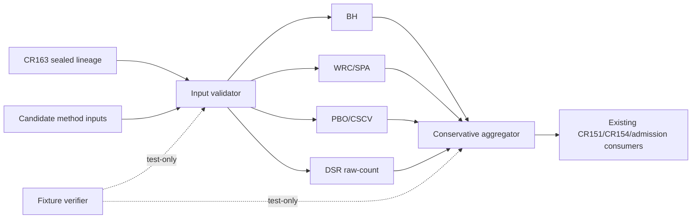

# Dependency Map: CR164 Computable Statistical Evidence

## 修订记录

| 版本 | 日期 | 修订人 | 变更要点 |
|---|---|---|---|
| 0.1 | 2026-07-12 | host-orchestrator inline meta-se-critical | 冻结单向依赖、禁止反向写入和平行 gate。 |

## 允许依赖

| From | To | 类型 | 方向 | 原因 / 验证 |
|---|---|---|---|---|
| CR163 lineage projection | FEAT-164-01 | read | allowed | 提供 sealed family identity/raw count；contract tests |
| candidate statistics/returns | FEAT-164-01 | read | allowed | 方法输入；sufficiency tests |
| FEAT-164-01 | FEAT-164-02/03 | value contract | allowed | 只有 validated envelope 可计算 |
| FEAT-164-02/03 | FEAT-164-04 | evidence refs | allowed | 聚合只消费 typed evidence |
| FEAT-164-04 | CR151/CR154/admission package | projection | allowed | 复用既有 consumers，不创建新 gate |
| FEAT-164-05 | FEAT-164-01..04 | test-only | allowed | fixture/static verification，无 runtime 数据 |

## 禁止依赖

| ID | From | To | 禁止原因 | 替代路径 | 风险 |
|---|---|---|---|---|---|
| FD-164-01 | calculator | CR163 storage/manifest writer | 统计计算不得改 lineage 事实 | 只读 validated projection | post-selection / tamper |
| FD-164-02 | consumer | calculator internals | consumer 不应重算或解释 raw input | 只读 MethodEvidence/Summary | policy 漂移 |
| FD-164-03 | raw trial count | effective trial fields | 非等价概念 | explicit unavailable fields | DSR/effective overclaim |
| FD-164-04 | any method PASS | aggregate PASS shortcut | 违反 no-OR-pass | severity lattice | false admission |
| FD-164-05 | CR164 | parallel admission gate | 重复既有 policy owner | existing consumers | 状态冲突 |
| FD-164-06 | fixture verifier | real data/provider/NAS/broker | 未授权 | synthetic/local fixtures | 权限越界 |

## DAG 与循环风险

循环数目标为 0。consumer → calculator、calculator → lineage writer、aggregator → method evidence rewrite 均禁止。

