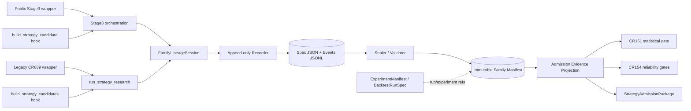

# Dependency Map: Trial Lineage Instrumentation

## 修订记录

| 版本 | 日期 | 修订人 | 变更要点 |
|---|---|---|---|
| 0.1 | 2026-07-11 | meta-se-critical | 初始依赖方向、禁止依赖、文件 ownership 与循环风险。 |

## 1. 依赖关系

| From | To | 类型 | 方向 | 原因 | 验证 |
|---|---|---|---|---|---|
| Stage3 public wrapper | Stage3 orchestration | call/context | allowed | 现有 chain A；透传 family session/config | CPI-001 mapping |
| Stage3 orchestration | FamilyLineageSession | command | allowed | pre-search declare、trial/attempt lifecycle、seal | P01/P02/P03 |
| `build_strategy_candidate` | session command interface | command | allowed | candidate/selection ref hook；不得拥有 storage | CPI-003 mapping |
| legacy wrapper | `run_strategy_research` | call/context | allowed | 现有 chain B；透传 session/config | CPI-002 mapping |
| `run_strategy_research` | FamilyLineageSession | command | allowed | pre-search lifecycle owner at orchestration | P01/P02/P03 |
| `build_strategy_candidates` | session command interface | command | allowed | stable trial/candidate mapping hook | CPI-004 mapping |
| FamilyLineageSession | Recorder | write command | allowed | façade约束合法生命周期 | unit/fixture |
| Recorder | JSON spec / JSONL events | append/create | allowed | lineage core 唯一写 owner | append-only fixture |
| Sealer/Validator | spec/events/prior manifests | read | allowed | 重算 count/hash/ref/chain | P03/R01/T01 |
| Sealer | immutable manifest version | create-only | allowed | seal 新版本 | deterministic fixture |
| Family manifest | ExperimentManifest / BacktestRunSpec | ref/read identity | allowed | run_id/experiment_id/artifact refs 关联 | referential fixture |
| Admission projection | sealed manifest + ValidationResult | read | allowed | 生成 availability/ref/raw count | B02/G01 |
| CR151 / CR154 / admission package | admission projection | consume | allowed | 复用既有 gate/status precedence | integration fixture |

## 2. 禁止依赖

| ID | From | To | 禁止原因 | 替代路径 | 违反风险 |
|---|---|---|---|---|---|
| FD-01 | lineage core | producer candidate types | 核心 contract 必须 producer-neutral | adapter 转 command payload | 新 producer 强耦合、循环 import |
| FD-02 | lineage core | CR151/CR154 policy | 事实生产不能依赖消费政策 | projection adapter | policy 漂移改变历史事实 |
| FD-03 | consumer | recorder/sealed storage write | consumer 不得补造或修复证据 | 返回 typed_unavailable/blocked；另走 supersession | 后验 trial_count、审计失真 |
| FD-04 | producer hook | manifest file write | hook 会绕过 validator/seal | session command | tamper、count 不一致 |
| FD-05 | Family manifest | replace `ExperimentManifest` | family 与单次 run 生命周期不同 | refs 联接 | identity 混淆与历史兼容破坏 |
| FD-06 | CR163 | effective/statistical computation | 超出 raw-input-only ceiling | FU-CR161-002 / 独立 CR | C1 overclaim |
| FD-07 | CP3 design | runtime/data/credential/external write | 未授权 | fixture/static 后续门禁 | 权限越界 |

## 3. Integration Direction Freeze

Hook 到 orchestration 的图边表示同一 chain 内的 instrumentation mapping，不表示 hook 自行拥有 session 或另建 trial。实际实现可由 orchestration 将 recorder/context 参数显式传入 hook，或 hook 返回 candidate 后由 orchestration记录 selection；CP5 LLD 必须选定一种并避免双写。

## 4. 文件 Ownership 建议（CP4 输入，不是正式计划）

| Ownership Group | 预计范围 | Story | 冲突控制 |
|---|---|---|---|
| OWN-LINEAGE-CONTRACT | 新 family lineage public contract/validator module | S01 | S02 开始前 contract freeze |
| OWN-LINEAGE-STORAGE | 新 recorder/canonical/seal module | S02 | 不与 producer/consumer 同文件 |
| OWN-PRODUCER-A | `engine/mature_multifactor_research.py` + public wrapper | S03 | 与 OWN-PRODUCER-B 可并行 |
| OWN-PRODUCER-B | `engine/multifactor_strategy_candidates.py` + legacy wrapper | S03 | 同 Story 内协调，禁止双 agent 同文件 |
| OWN-CONSUMERS | statistical gate / reliability gates / admission package adapters | S04 | 若拆并行 lane，按文件单写 |
| OWN-VERIFICATION | fixtures/tests/evidence | S05 | 等 S01-S04 contract stable |

## 5. 循环风险

| Cycle ID | 涉及对象 | 风险 | 当前处理 |
|---|---|---|---|
| CYCLE-01 | producer ↔ lineage core | core import candidate type，producer 又 import core | eliminated：core 只接收 schema-neutral command |
| CYCLE-02 | consumer ↔ lineage core | core 根据 gate policy生成事实 | eliminated：单向 projection；core 不 import consumer |
| CYCLE-03 | ExperimentManifest ↔ family manifest | 双方互相嵌套完整对象 | eliminated：只存 identity/ref，不嵌套对象 |
| CYCLE-04 | supersession head resolution | cyclic refs | blocked：validator 检测 cycle、重复 version、断链 |

## 6. 前置条件与失败行为

| 阶段 | 前置条件 | 失败行为 |
|---|---|---|
| Declare | mapping included、spec complete、无 trial event | stop producer instrumentation；post-hoc block |
| Record | family declared、entity parent 存在、sequence 合法 | conflict/orphan block；不 overwrite |
| Seal | family terminal/completeness、counts 可重算、refs存在 | 不生成合法 head；返回 blocked result |
| Consume | manifest immutable、validation target hash 匹配、chain合法 | typed_unavailable（无原生记录）或 blocked（无效） |
| Supersede | prior head合法、reason/ref/hash齐全 | block 新 head；旧 head保持不变 |

## 7. Gotchas

- 公共 wrapper 与 engine orchestration 都需 mapping，但 session owner 只能有一个；推荐 orchestration owner、wrapper 透传配置。
- consumer adapter 必须接收 validator 输出而不是“看到文件存在就 present”。
- latest pointer 若未来存在，只能是可重建缓存，不能成为 supersession 真相源。
- 文件 ownership 是 CP4 输入，不是实现授权，也不是正式 `DEVELOPMENT-PLAN`。
