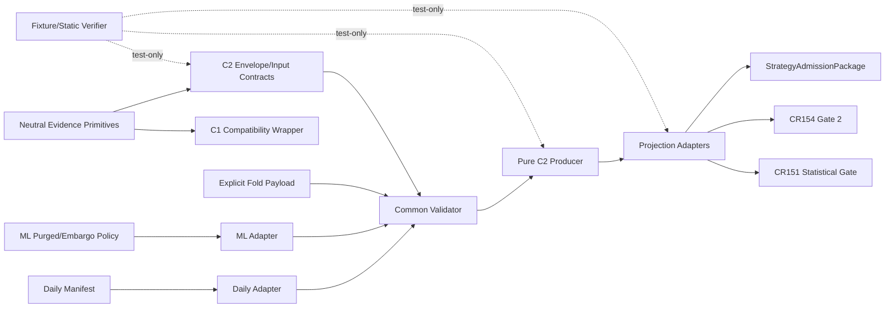

# Dependency Map：CR166 Walk-forward / OOS Evidence

## 修订记录

| 版本 | 日期 | 修订人 | 变更要点 |
|---|---|---|---|
| 0.1 | 2026-07-13 | host-orchestrator inline meta-se-critical | 冻结 neutral primitives、C2 validator/producer、daily/ML adapters、existing consumers 与 test-only verifier 的单向依赖。 |
| 0.2 | 2026-07-13 | host-orchestrator | 回填 CP3 人工批准；允许/禁止依赖与 CP4 文件冲突预警成为正式 Story DAG 和所有权输入。 |

## 允许依赖

| From | To | 依赖类型 | 允许方向 | 原因 | 验证 / 监控 |
|---|---|---|---|---|---|
| FEAT-166-01 neutral primitives | CR164 C1 compatibility wrapper | import/re-export | neutral → C1 wrapper | 保持 C1 public API/default hash domain 不变，消除 C2→C1 错向依赖 | C1 golden hash/API regression |
| Legacy daily split manifest | FEAT-166-02 daily adapter | read/value mapping | source → adapter | 复用现有 folds/purge/embargo refs；缺 validation fields 不推断 | daily compatibility fixture |
| ML purged-embargo policy | FEAT-166-02 ML adapter | read/value mapping | source → adapter | 复用 folds count、label horizon、purge/embargo policy | ML compatibility fixture |
| Explicit fixture/static fold payload | FEAT-166-02 validator | value contract | input → validator | 提供 common 7/7 字段族 | sufficiency/leakage fixtures |
| FEAT-166-01 | FEAT-166-02/03 | schema/value contract | allowed | validator/producer 共享同一 envelope/input/evidence type | contract tests |
| FEAT-166-02 | FEAT-166-03 | validated value | allowed | 只有 validated common input 可计算 | producer precondition test |
| FEAT-166-03 | FEAT-166-04 | evidence ref/hash | allowed | projection 不接收 raw mutable fold payload | tamper/ref tests |
| FEAT-166-04 | CR151 statistical gate | projection | allowed | 填充 legacy fold/pass-rate 兼容面并附同一 C2 ref/reasons | consumer contract test 1/3 |
| FEAT-166-04 | CR154 reliability Gate 2 | projection | allowed | 填充 split/walk-forward/OOS/purge/embargo/leakage fields | consumer contract test 2/3 |
| FEAT-166-04 | StrategyAdmissionPackage | projection | allowed | 附 evidence ref/availability/reasons，保持 worse state | consumer contract test 3/3 |
| FEAT-166-05 | FEAT-166-01..04 | test-only | allowed | fixture/static verification，不拥有生产数据或 gate policy | permission/static scans |

## 禁止依赖

| Forbidden ID | From | To | 禁止原因 | 替代路径 | 违反风险 |
|---|---|---|---|---|---|
| FD-166-01 | C2 contracts/producer | C1 method-specific `StatisticalEvidenceInput`/`MethodEvidence` | C2 不是统计方法 evidence，错向依赖会锁死 C3/C4 扩展 | neutral primitives + C2 component | schema 污染、循环依赖 |
| FD-166-02 | neutral primitives | admission consumer/policy | shared primitive 不能知道 gate policy | projection adapter | 基础层反向耦合 |
| FD-166-03 | producer | CR151/CR154/package internals | producer 不能拥有准入政策或直接改善状态 | typed projection only | 平行 gate、policy drift |
| FD-166-04 | consumer | raw fold input / producer recomputation | consumer 不得改变 fold、分母、阈值或 lineage | 只读 component ref/hash/summary | 结果分叉、不可审计 |
| FD-166-05 | adapter/validator | lake/NAS/provider/calendar resolver/network | 当前只允许显式 fixture/static value，不得解引用 | ref classification + zero-operation counters | 权限越界、真实数据误用 |
| FD-166-06 | event adapter | daily calendar fold 假映射 | event time/window/available-at 语义未冻结 | explicit N/A + future CR | 假覆盖、泄漏 |
| FD-166-07 | unknown/reserved component | mandatory PASS | 未验证 component 不能满足 mandatory evidence | typed_unavailable/blocked decision table | false admission |
| FD-166-08 | CR166 | C3/C4 calculator 或真实 cost/capacity input | 超出 CP2 scope | FU-CR161-004/005 | scope/授权漂移 |
| FD-166-09 | fixture verifier | real data/runtime/broker/trading/publish/remote | CP2/CP3 未授权 | local static fixtures | 安全事故与过度声明 |

## DAG 与循环风险

| Cycle ID | 涉及对象 | 风险 | 当前处理 |
|---|---|---|---|
| CYCLE-166-01 | neutral primitives ↔ C1/C2 | C1 wrapper 回写 neutral policy | eliminated：neutral 只提供 serialization/hash/availability primitive |
| CYCLE-166-02 | producer ↔ consumer | consumer threshold 反向进入 producer contract | eliminated：metric policy 显式输入，consumer 只读 projection |
| CYCLE-166-03 | adapter ↔ legacy source | adapter 修改 legacy manifest/policy | eliminated：immutable/read-only mapping |

目标：生产 DAG cycle=0；test-only 虚线不参与生产依赖拓扑。

## CP4 文件冲突预警（非正式 owner）

| Surface | 潜在并发冲突 | CP4 处理要求 |
|---|---|---|
| neutral primitives 与 `statistical_evidence.py` compatibility wrapper | S01 可能触及既有 C1 文件 | S01 单写；golden hash regression 完成后才能开放下游 |
| common validator 与 producer | schema 同步风险 | S02 完成 contract 后 S03 才进入；禁止并行改同一 owner 文件 |
| 三个 consumer modules | S04 跨三个既有模块 | 独立 Wave；S03 evidence contract freeze 后再改 |
| verification | tests 只读所有 source contracts | S05 最后执行；不得与 source owner 并行写同文件 |
