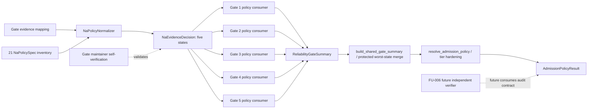
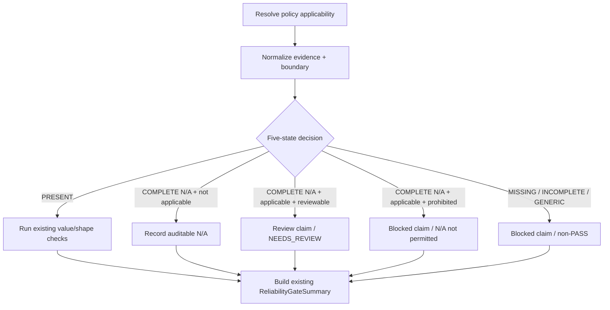

# Canonical Reliability N/A Semantics and Admission Worst-State Hardening HLD

## 修订记录

| 版本 | 日期 | 修订人 | 变更要点 |
|---|---|---|---|
| 0.1 | 2026-07-15 | host-orchestrator inline meta-se-critical | 基于已批准 CP2 的 9 项需求、21/21 policy inventory、15 项 QAC 与 20 个场景形成 CP3 HLD；冻结五态策略候选、Gate 1-5 消费边界、受保护的 bottom-up merge、独立的 admission-tier hardening、公共兼容和 future-verifier 边界。 |
| 0.2 | 2026-07-15 | host-orchestrator inline meta-se-critical | 根据 CP3 深度评审补齐 §5.2 caller/authorization-ref 契约、§6 全量 21-unit 现有 N/A 路径类型与硬化方向（15/5/1）、§8.2 T3 现状保持不变、§11 分组回归义务及 §14 双向爆炸半径；精确化 DQ-COMPLETE-NA，不改变表驱动方案和 claim ceiling。 |
| 0.3 | 2026-07-15 | host-orchestrator inline | 回填 CP3 用户批准并迁入设计归档；表驱动方案、21/21 inventory、15/5/1 分组与 claim ceiling 不变。 |

## 1. 问题定义与目标

### 1.1 现状问题

`engine/cross_strategy_reliability_gates.py` 中多个 Gate 使用“存在 reason 字符串”作为 evidence 可接受性的替代判据。字段级或通用 `na_reason` 可能在 mandatory evidence 缺失时绕过 blocked claim，使 Gate 1-5 产生错误 PASS；之后 `resolve_admission_policy` 只处理部分 BLOCKED/FAIL 情况，又可能把 mandatory `NEEDS_REVIEW` 升为 admission PASS。

现有 `build_shared_gate_summary` / `evaluate_shared_contract` 已按 `BLOCKED > FAIL > NEEDS_REVIEW > PASS` 传播底层状态。CR-170 不把“修复 N/A 逃逸”误写成“重做整个 Gate 6”，而是先保护这段已有正确逻辑，再单独硬化 admission policy。

### 1.2 目标

1. 以固定 `21/21` policy units 覆盖 Gate 1-5 的 mandatory/conditional N/A 判定面。
2. 将 evidence 判定冻结为五种业务语义：`PRESENT`、`MISSING`、`NA_WITH_COMPLETE_BOUNDARY`、`NA_WITH_INCOMPLETE_BOUNDARY`、`GENERIC_REASON_ESCAPE`。
3. 保证 applicable mandatory evidence 处于 missing、generic escape、incomplete boundary 或 unresolved review 时，无条件 PASS 数为 `0`。
4. 保护现有 bottom-up worst-state merge；无失败证据时生产逻辑修改数为 `0`。
5. 在最小公共 admission 边界实现 T0/T1/T2/T3 结果：`NEEDS_REVIEW/BLOCKED/BLOCKED/NOT_AUTHORIZED`。
6. 公共 Gate callable 与结果 schema 非兼容变更为 `0`，CR-168/CR-169 adapter 回归 `2/2 PASS`。

### 1.3 Claim Ceiling

| Claim | 冻结值 |
|---|---|
| gate1_5_na_policy_inventory | `21/21` |
| business_semantics | `5/5` |
| public_api_breaks | `0` |
| current_stage3_runner_integrations | `0` |
| aggregate_orchestration_modifications | `0` |
| cr168_cr169_guard_deletions | `0` |
| independent_verifier_available | `false` |
| stage3_entry_ready | `false` |
| stage3_started | `false` |
| cr155_promoted | `false` |
| real_data_or_runtime_operations | `0` |

## 2. 范围与相邻对象边界

### 2.1 In Scope

- Gate 1-5 的 21-unit inventory、五态判定、稳定 claim/reason 语义与 fixture/static 回归。
- `build_shared_gate_summary` 现有 NEEDS_REVIEW 传播的受保护回归。
- `resolve_admission_policy` 对 mandatory Gate status 与 tier 的最小硬化。
- Gate 1 multiple-testing/FDR masked escape 的字段判定、claim 生成、最终状态三层断言。
- CR-168 C3-only、CR-169 strict joint adapter 的兼容回归。
- BACKLOG、requirement baseline、legacy Stage3 marker 的追溯修订。

### 2.2 Out of Scope

| 相邻对象 | CR-170 不承担 | Owner / 后续入口 |
|---|---|---|
| Current Stage 3 runner | 不接入 canonical Gate，不声明 runner 已受本硬化保护 | 独立 Stage 3 Launch CR |
| C1-C4 aggregate / mature SAP | 不构建 aggregate orchestration，不决定 CR-155 promotion | `FU-CR161-009` |
| CR-168 / CR-169 adapters | 不删除、不简化、不改变其 typed allowlist、denylist 或 postcondition | 后续 FU-009 + ADR 评估 |
| Independent verifier lane | 不实现 verifier agent/lane，不声称验证独立性 | `FU-CR161-006` |
| 真实数据与 runtime | 不读 lake/NAS/provider/credential，不执行 QMT/broker/trading/publish | 独立授权 CR |

### 2.3 用户可用性边界

- 量化研究负责人是间接消费者：依赖无虚假 PASS 的 contract，不直接调用模块。
- 准入策略维护者直接消费 `resolve_admission_policy`。
- 可靠性 Gate 维护者是本 CR 的当前维护与自验证角色。
- 独立验证者仅为 future consumer；CR-170 为其预留可审计 owner/boundary/claim/result contract，但其实际独立执行待 FU-006。

## 3. 架构灰区与候选方案

### 3.1 Architecture Gray Areas

| AGA | 问题 | 推荐 | 备选 | 切换条件 |
|---|---|---|---|---|
| AGA-CR170-01 | 五态业务语义如何进入代码 | 内部表驱动 `NaPolicySpec` + typed decision；Gate 局部消费 | 每个 Gate 手写条件；全局改 `_has_na_reason` | 只有 inventory 无法稳定表驱动时才退回局部条件；不得全局改 bool helper |
| AGA-CR170-02 | 完整结构化 N/A 如何影响 mandatory unit | `NaPolicySpec.complete_na_disposition=reviewable` 的 applicable mandatory unit -> auditable `NEEDS_REVIEW`；`prohibited` unit 继续 BLOCKED；不适用 conditional unit 可记录边界但不制造 PASS | 所有 N/A 一律 BLOCKED；完整 N/A 视同 PRESENT | 只有产品策略改为“禁止全部 N/A”才选全 BLOCKED；禁止把 complete N/A 视同 PRESENT |
| AGA-CR170-03 | Gate 6 两层职责如何切分 | 保留 bottom-up merge；仅硬化 `resolve_admission_policy` tier decision | 重写 merge；把 tier 逻辑下沉到各 Gate | 只有受保护回归失败且证明根因在 merge 才允许修改 merge |
| AGA-CR170-04 | 兼容层和 verifier 如何处理 | 公共签名/schema/adapter 不变；future verifier 消费审计 contract | 本 CR 删除 adapter；本 CR实现 verifier lane | 只有 FU-009 满足四项简化条件并有 ADR 才可删除 adapter；verifier 由 FU-006 |

### 3.2 方案对比

| 方案 | 核心 | 正确性 | 爆炸半径 | 可审计性 | 结论 |
|---|---|---:|---:|---:|---|
| A | 表驱动内部 policy + typed decision + Gate 局部消费 + admission 最小硬化 | 高 | 中低 | 高 | 推荐 |
| B | 21 个调用点分别加 if/claim | 中 | 低 | 中低，易漂移 | 备选 |
| C | 改全局 `_has_na_reason` 布尔语义 | 不稳定 | 高 | 低，无法表达 owner/applicability/tier | 拒绝 |

## 4. 推荐架构



### 4.1 模块职责

| 模块 / 职责 | 输入 | 输出 | 失败行为 | 是否公共 |
|---|---|---|---|---|
| 21-unit policy inventory | Gate、policy key、applicability、owner、boundary rule、baseline path type、hardening direction、complete-N/A disposition | `NaPolicySpec` 集合 | 重复/缺项/方向未标注使 inventory check FAIL | 内部 |
| N/A normalizer/evaluator | evidence mapping + policy + strategy/profile/claims | five-state decision + deterministic reason metadata | unknown/ambiguous -> incomplete/missing，绝不推断 PRESENT | 内部 |
| Gate 1-5 consumers | decision + 现有 evidence | 现有 `ReliabilityGateSummary` | mandatory escape -> claim + non-PASS | 公共 callable 保持 |
| Protected merge | Gate/Artifact status | worst-state summary | 回归失败才可开设计 delta | 现有公共行为 |
| Admission policy | Gate 1-5 summaries + tier/profile | `AdmissionPolicyResult` | missing/NR/blocked 按 tier fail-closed | 现有公共 callable |

### 4.2 文件影响面（CP3 预测，不授权实现）

| 文件 | 允许的未来变更 | 禁止变更 |
|---|---|---|
| `engine/cross_strategy_reliability_gates.py` | 内部 policy/decision、Gate 1-5 消费、admission 最小硬化 | public callable 签名、公开 result schema、现有 merge 无证据重写 |
| `tests/test_cross_strategy_reliability_gates.py` 或现有等价测试 | 21-unit、five-state、Gate1 三层、tier、merge 回归 | 真实数据/runtime 测试 |
| CR-168/CR-169 adapter tests | 仅回归证据 | adapter production 简化或删除 |
| 产品/设计/质量文档 | 追溯、claim ceiling、验证证据 | Stage3/runtime ready overclaim |

## 5. N/A Policy Contract

### 5.1 五态精确定义

| 状态 | 判定 | 对 applicable mandatory unit 的结果 |
|---|---|---|
| `PRESENT` | policy 指定 evidence ref/structured value 存在且通过 shape/identity 校验 | 进入现有业务校验；不自动保证 Gate PASS |
| `MISSING` | evidence 与 N/A boundary 均不存在 | 生成 deterministic missing claim；Gate 非 PASS |
| `NA_WITH_COMPLETE_BOUNDARY` | policy-specific reason + owner + scope + profile 或 authorization ref 完整，且 owner/scope 与 policy 匹配 | `complete_na_disposition=reviewable` 时生成 auditable review claim、Gate 至少 NEEDS_REVIEW；`prohibited` 时保持 BLOCKED；两者均受 tier 限制且不得 PASS |
| `NA_WITH_INCOMPLETE_BOUNDARY` | 有 field-specific reason，但 boundary 字段缺失/不匹配 | 生成 boundary-incomplete claim；Gate 非 PASS |
| `GENERIC_REASON_ESCAPE` | 仅有通用 `na_reason/n_a_reason`，或 reason 被复用于多个 mandatory unit | 生成 generic-escape claim；Gate 非 PASS |

### 5.2 结构化 N/A 输入约定

推荐以 evidence 中可选的 `n_a_boundaries` mapping 承载，不改变 validator 公开签名：

```text
n_a_boundaries[policy_id] = {
  reason, owner, scope, release_profile | authorization_ref
}
```

完整率规则为 `reason=1`、`owner=1`、`scope=1`、`profile_or_authorization=1`，合计 `4/4`；`owner` 必须等于 inventory owner，`scope` 必须精确覆盖 policy id 或 gate+field。旧字段级 `*_na_reason` 只能作为 reason 候选，缺少匹配 boundary 时判为 `NA_WITH_INCOMPLETE_BOUNDARY`。通用 reason 不得补齐任何 unit。

caller 与授权引用契约冻结如下：

| Caller / 字段 | 本 CR 允许的生产者 | 输入责任 | CR-170 evaluator 责任 | 后续边界 |
|---|---|---|---|---|
| `n_a_boundaries` | 当前仅 fixture/test caller | 显式提供 policy-specific boundary；不得复用通用 reason | 只校验和消费，不推断、不补写、不从其他 unit 复制 | aggregate/real-evidence caller 接入由 FU-009 或独立 Stage 3 CR 决定 |
| `authorization_ref` | 当前仅 fixture/test caller 使用静态、非敏感审计 ref | 引用已存在的授权决定；不得放入 credential/token/secret，不得把 ref 本身当授权 | 只做 opaque non-empty/ref-scope 校验；不读取授权系统、不提升权限 | 真实授权引用格式与解析由独立 runtime/data authorization CR 冻结 |

现有 caller 不提供 `n_a_boundaries` 时继续按 `MISSING` 或现有 value validation 处理；CR-170 不要求 current runner、adapter 或 aggregate producer 新增写入。`authorization_ref` 是审计指针，不是授权动作，也不能替代本会话明确授权。

### 5.3 Deterministic reason/claim 规则

语义类别固定为：`missing`、`generic_reason_escape`、`boundary_incomplete`、`complete_na_requires_review`、`complete_na_not_permitted`。精确 reason id 由 LLD 按 `<gate>_<policy>_<category>` 枚举；同一 normalized input 的 claim 顺序按 inventory 顺序稳定，不依赖 mapping 插入顺序。

## 6. 21/21 Policy Inventory

| ID | Gate | Evidence family | 适用性 | Owner | 现有 N/A 路径类型 | 硬化方向 | Complete N/A disposition |
|---|---|---|---|---|---|---|---|
| G1-P01 | Gate 1 | multiple-testing correction | release-blocking profile 或 statistical/performance/production-like claim | Gate 1 statistical owner | reason-only 可绕过 blocked claim | 更严 | reviewable -> NEEDS_REVIEW |
| G1-P02 | Gate 1 | FDR/BH correction | 同 G1-P01 | Gate 1 statistical owner | reason-only 可绕过 blocked claim | 更严 | reviewable -> NEEDS_REVIEW |
| G1-P03 | Gate 1 | WRC/SPA | Gate 1 始终评估；release/claim 决定强度 | Gate 1 statistical owner | 无 N/A；缺失为 NR 或 BLOCKED | 受控放宽 | reviewable -> NEEDS_REVIEW |
| G1-P04 | Gate 1 | PBO/CSCV | release-blocking profile | Gate 1 statistical owner | 无 N/A；适用时缺失为 BLOCKED | 受控放宽 | reviewable -> NEEDS_REVIEW |
| G1-P05 | Gate 1 | DSR/Sharpe/IC deflation | sharpe/ic/performance robustness claim | Gate 1 statistical owner | 无 N/A；适用时缺失为 BLOCKED | 受控放宽 | reviewable -> NEEDS_REVIEW |
| G1-P06 | Gate 1 | raw/effective trial count + provenance | PBO/DSR present 或 release-blocking | Gate 1 statistical owner | 固定 value/provenance validation；另有 approximation NR | 保持不变 | prohibited -> BLOCKED |
| G2-P01 | Gate 2 | split | Gate 2 invoked | Gate 2 CV owner | field/generic reason-only 可绕过 blocked claim | 更严 | reviewable -> NEEDS_REVIEW |
| G2-P02 | Gate 2 | walk-forward | Gate 2 invoked | Gate 2 CV owner | field/generic reason-only 可绕过 blocked claim | 更严 | reviewable -> NEEDS_REVIEW |
| G2-P03 | Gate 2 | OOS | Gate 2 invoked | Gate 2 CV owner | field/generic reason-only 可绕过 blocked claim | 更严 | reviewable -> NEEDS_REVIEW |
| G2-P04 | Gate 2 | purge | overlapping label/event window；non-overlap requires explicit boundary | Gate 2 leakage owner | purge/generic reason-only 可形成 NR ref，但最终 Gate 可 PASS | 更严 | reviewable -> NEEDS_REVIEW |
| G2-P05 | Gate 2 | embargo | overlapping label window | Gate 2 leakage owner | 无 N/A；适用时缺失为 BLOCKED | 受控放宽 | reviewable -> NEEDS_REVIEW |
| G2-P06 | Gate 2 | event-safe gap | overlapping event window | Gate 2 leakage owner | 无 N/A；适用时缺失为 BLOCKED | 受控放宽 | reviewable -> NEEDS_REVIEW |
| G3-P01 | Gate 3 | PIT/survivorship-free universe | Gate 3 invoked | Gate 3 universe owner | generic reason-only 可绕过 blocked claim | 更严 | reviewable -> NEEDS_REVIEW |
| G4-P01 | Gate 4 | impact model family/ref | active family 或 explicit impact N/A | Gate 4 impact owner | 现有 structured N/A 可进入 PASS | 更严 | reviewable -> NEEDS_REVIEW |
| G4-P02 | Gate 4 | ADV participation | Gate 4 invoked | Gate 4 C4 owner | field/generic reason-only 可绕过 blocked claim | 更严 | reviewable -> NEEDS_REVIEW |
| G4-P03 | Gate 4 | capacity dollars | Gate 4 invoked | Gate 4 C4 owner | field/generic reason-only 可绕过 blocked claim | 更严 | reviewable -> NEEDS_REVIEW |
| G4-P04 | Gate 4 | liquidity sizing | Gate 4 invoked | Gate 4 C4 owner | field/generic reason-only 可绕过 blocked claim | 更严 | reviewable -> NEEDS_REVIEW |
| G4-P05 | Gate 4 | cost underestimation status | Gate 4 invoked | Gate 4 C3 owner | status 非 PASS 时 reason-only 可绕过 blocked claim | 更严 | reviewable -> NEEDS_REVIEW |
| G5-P01 | Gate 5 | regime slot | Gate 5 invoked | Gate 5 regime owner | 现有 structured N/A ref 未传播最终 NR，Gate 可 PASS | 更严 | reviewable -> NEEDS_REVIEW |
| G5-P02 | Gate 5 | attribution slot | Gate 5 invoked | Gate 5 attribution owner | 现有 structured N/A ref 未传播最终 NR，Gate 可 PASS | 更严 | reviewable -> NEEDS_REVIEW |
| G5-P03 | Gate 5 | reconciliation slot | Gate 5 invoked | Gate 5 reconciliation owner | 现有 structured N/A ref 未传播最终 NR，Gate 可 PASS | 更严 | reviewable -> NEEDS_REVIEW |

conditional unit 不适用时仍保留 inventory 行；必须有可审计 applicability decision，不从 `21` 的分母删除。

基于当前 canonical 源码的方向分组冻结为：`更严=15`、`受控放宽=5`、`保持不变=1`，合计 `21/21`。其中“受控放宽”只允许 Gate-local 从历史 BLOCKED 降为带 claim 的 `NEEDS_REVIEW`，仍不得产生 PASS，且 T1/T2 会由 admission resolver 继续 BLOCKED；“保持不变”的 G1-P06 不接受 complete N/A 替代 trial-count/value/provenance 校验。

## 7. Gate 1-5 消费流程与失败路径



前置条件与失败行为：

| 前置 | 失败行为 |
|---|---|
| policy id 必须存在于 21-unit inventory | unknown policy -> CP4/CP5 design check FAIL，不在运行时静默新增 |
| strategy/profile/claim context 可归一化 | unknown -> fail-closed，沿用现有 unknown profile/strategy 行为 |
| evidence ref 通过现有 shape/value 校验 | decision 不得用 N/A 覆盖 invalid evidence；进入现有 blocked path |
| boundary owner/scope 精确匹配 | mismatch -> `NA_WITH_INCOMPLETE_BOUNDARY` |

## 8. Gate 6 两层职责与 Admission Tier

### 8.1 受保护的 bottom-up merge

`build_shared_gate_summary` / `evaluate_shared_contract` 保留 `BLOCKED > FAIL > NEEDS_REVIEW > PASS` 传播不变量。先运行 `1/1` 受保护回归；如果通过，相关生产逻辑修改数必须为 `0`。若失败，只能通过新的 design delta/ADR 重新打开该边界。

### 8.2 `resolve_admission_policy` 最小硬化

| Tier | Mode | mandatory Gate NEEDS_REVIEW | 结果 |
|---|---|---|---|
| T0 | `OPT_IN` | 允许继续 fixture/static 诊断，但不得声称 admission PASS | status=`NEEDS_REVIEW` |
| T1 | `DEFAULT_REQUIRED` | 不允许 admission candidate PASS | status=`BLOCKED` |
| T2 | `RELEASE_BLOCKING` | 不允许 release/readiness PASS | status=`BLOCKED` |
| T3 | `NOT_AUTHORIZED` | 不授权 paper/live/trading/runtime | 兼容表示：status=`BLOCKED` + mode=`NOT_AUTHORIZED` |

不新增 `ReliabilityGateStatus.NOT_AUTHORIZED`，避免公开 enum/schema 破坏。T3 的产品语义通过现有 `gate_mode=NOT_AUTHORIZED`、reason 和 wording 表达。

当前 `resolve_admission_policy` 已在进入通用 tier 判定前对 T3 profile 执行 `status=BLOCKED + gate_mode=NOT_AUTHORIZED` 的 early return。本 CR 对该分支的要求是 `1/1` 兼容回归并保持生产逻辑修改数=`0`；“最小硬化”只补 T0/T1/T2 对 mandatory `NEEDS_REVIEW` 的处理，不重写 T3。

### 8.3 调用契约

调用方向保持：Gate validator -> `ReliabilityGateSummary` -> `resolve_admission_policy`。`resolve_admission_policy` 不反向修改 Gate summary，不调用 runner，不触发真实数据。输出仍是现有 `AdmissionPolicyResult`。

## 9. 兼容性与演进治理

1. `validate_gate1_*`、`validate_gate2_*`、`validate_gate3_pit_universe`、`validate_gate4_capacity_impact`、`validate_gate5_slots` 与 `resolve_admission_policy` 的公开签名不变。
2. `ReliabilityGateSummary`、`AdmissionPolicyResult`、`ReliabilityGateStatus` 与 `AdmissionGateMode` schema 不做破坏性变更。
3. `_has_na_reason` 保持 legacy bool helper；21 个 policy unit 不再把它的单一 bool 结果作为 mandatory evidence 的充分条件。
4. CR-168/CR-169 adapter 保留 defense-in-depth。简化必须同时满足：所有 caller 已消费新 contract、删除不降低 fail-closed、全回归 PASS、有独立 ADR。
5. FU-006 future verifier 只消费公开结果与审计元数据；不依赖内部 enum/dataclass 名称。

## 10. 场景模拟

### SIM-CR170-01：Gate 1 masked generic escape

输入：multiple-testing/FDR refs 缺失，仅有通用 `na_reason`，同时 effective trial count 另有 unavailable claim。

期望：字段判定分别为 `GENERIC_REASON_ESCAPE`；生成两个 mandatory claims；最终 Gate status 仍按 worst-state 非 PASS。测试同时断言三层，不能因另一 claim 掩盖前两层。

### SIM-CR170-02：完整结构化 N/A 与 T0/T1

输入分为两个 policy-specific 子例：

1. `complete_na_disposition=reviewable` 的 applicable mandatory unit 无 ref，但 `n_a_boundaries[policy_id]` 具备 4/4 boundary；
2. `complete_na_disposition=prohibited` 的 G1-P06 trial-count/provenance unit 无 ref，即使提供 4/4 boundary 也不得替代 mandatory evidence。

期望：子例 1 的 Gate summary 为 `NEEDS_REVIEW`；T0 admission 仍为 `NEEDS_REVIEW` 且 wording 禁止 PASS；同一 summary 在 T1 为 `BLOCKED`。子例 2 保持 `BLOCKED`，并产生 `complete_na_not_permitted` 可审计 reason；不得把 G1-P06 从固定阻断放宽为 N/A。

### SIM-CR170-03：底层 merge 保护

输入：五个 Gate summary 中一个 NEEDS_REVIEW，其余 PASS。

期望：`build_shared_gate_summary` 传播 NEEDS_REVIEW；生产 merge 修改数为 0；`resolve_admission_policy` 按 tier 处理，不把 T1/T2 升级为 PASS。

### SIM-CR170-04：adapter 回归

输入：CR-168 C3-only unavailable C4 path 与 CR-169 strict joint 7-key path。

期望：两个 adapter 自有 guard 继续工作，canonical hardening 不删除其 allowlist/denylist/postcondition；回归 `2/2 PASS`。

## 11. 测试与验证设计义务

| 层 | 精确目标 | 关键断言 |
|---|---|---|
| Inventory | `21/21`、字段完整率 `100%` | ID 唯一、Gate 分布 6/6/1/5/3；baseline path / direction / disposition 完整；方向分组 15/5/1 |
| Directional regression | 更严/受控放宽/保持 `15/5/1` | 更严组不再 PASS；放宽组仅 BLOCKED->NR 且 tier 不放行；保持组结果不变 |
| Semantic classifier | five states `5/5` | generic reason 满足 mandatory units=`0` |
| Gate 1 masked escape | 三层 `3/3`，路径 `2/2` | decision、claim、final status |
| Gate 2-5 | applicable negative/boundary non-PASS | 无 escape PASS |
| Protected merge | `1/1 PASS` | NEEDS_REVIEW 不升 PASS，生产修改=0 |
| Boundary caller | 当前 writer 类别 `2/2`（fixture/test） | evaluator 不生成 boundary/auth ref；authorization_ref 不含凭据且不提升权限 |
| Admission | T0-T3 `4/4` | NR/BLOCKED/BLOCKED/NOT_AUTHORIZED semantics；T3 现有 early-return 回归 `1/1`、生产 diff=0 |
| Compatibility | public breaks=0，adapter=`2/2 PASS` | signatures/schema/guards unchanged |
| Authorization | forbidden operation counters 全 0 | no real data/runtime/trading/remote write |

SIM-CR170-05 如需模拟“底层 merge 异常升 PASS”，必须使用只注入返回值的 test double；不得依赖或复制 private merge 实现。

## 12. 非功能设计

- 正确性：所有 applicable mandatory negative states 的 unconditional PASS=`0`。
- 确定性：inventory 顺序、decision、claim id、claim ordering 对同一 normalized input 稳定。
- 可审计性：complete N/A 具备 4/4 boundary；每个 claim 可追溯 policy id。
- 兼容性：public schema/signature breaks=`0`。
- 可维护性：21-unit inventory 单点声明，Gate consumer 不重复定义 owner/applicability。
- 安全性：未知 policy/profile/strategy、通用 reason、边界不完整均 fail-closed。

## 13. 安全、权限与数据边界

本 HLD 不授权 lake/provider/NAS/credential 读取，不授权真实研究数据映射、runtime、broker、QMT、simulation、paper/live/trading、catalog/store/registry/publish、Git remote write、Stage 3 启动或 CR-155 promotion。所有验证限定 static/fixture/existing evidence。

## 14. 风险与缓解

| Risk | 状态 | 影响 | 缓解 / 解除条件 |
|---|---|---|---|
| R-CR170-BLAST-RADIUS | OPEN | 15 个 unit 会收紧历史 reason/structured-N/A PASS；5 个 unit 会把适用时历史 BLOCKED 受控放宽为 NR；1 个 unit 必须不变 | 21-unit inventory 显式记录 baseline path/direction/disposition；按 15/5/1 三组回归；放宽组断言 Gate PASS=0、T1/T2 BLOCKED；public break=0 |
| R-CR170-MERGE-REWRITE | CONTROLLED | 误重写已有正确 merge 扩大范围 | 先做 1/1 回归；通过则生产改动=0 |
| R-CR170-TIER-OVERCLAIM | OPEN | T0/T1/T2 语义错位导致 admission PASS | 固定 tier 真值表 4/4；T3 用现有 mode 兼容表达 |
| R-CR170-ADAPTER-COUPLING | OPEN-NONBLOCKING | 双层 guard 长期耦合 | 本 CR 保留；FU-009 满足四条件后用 ADR 评估 |
| R-CR170-VERIFIER-INDEPENDENCE | OPEN-NONBLOCKING | 当前只有维护者自验证 | CP8 显式披露；FU-006 实现前不声明 independent verification |
| R-CR170-RUNNER-GAP | ACCEPTED-FOR-SCOPE | 当前 runner 不消费 canonical，硬化不等于 Stage3 已保护 | `stage3_entry_ready=false`；独立 Stage3 Launch CR 负责接入/授权/revalidation |

## 15. 可观测性与审计

- 运行结果继续通过现有 summary/result 对象表达，不新增 telemetry/runtime service。
- 测试证据必须记录 policy id、five-state decision、claim id、Gate status、tier result 五层中的适用层。
- CP7 报告必须单列：21/21、方向分组 15/5/1、Gate1 三层、caller/auth-ref、merge 1/1、T3 1/1、tier 4/4、adapter 2/2、public breaks=0。
- future verifier 只依赖上述审计面，不读取内部实现对象。

## 16. 回退与失败恢复

| 触发 | 回退目标 | 行为 |
|---|---|---|
| inventory 未达 21/21 | CP3/CP4 设计 | 不创建实现 Story，补 policy spec |
| public API/schema 将破坏 | CP3 架构 | 选择 adapter/internal normalization，禁止直接合并 |
| merge 回归通过却出现 merge 改动 | HLD §8.1 | 删除该改动，恢复现有 merge |
| 合法 complete N/A 被误判 generic | LLD/实现 | 修 policy-specific boundary lookup，不放宽通用 reason |
| 受控放宽 unit 产生 PASS 或穿透 T1/T2 | LLD/实现 | 回退该 unit 到历史 BLOCKED，修复 Gate claim 与 resolver，不以 fixture 便利性放行 |
| G1-P06 complete N/A 替代 trial count/provenance | LLD/实现 | 删除该替代路径，恢复固定 value/provenance validation |
| evaluator 自行生成 boundary/authorization ref | LLD/实现 | 删除合成逻辑；只接受 caller 显式静态输入，真实授权另行立项 |
| 历史测试依赖虚假 PASS | requirement/quality review | 将测试期望迁移为非 PASS；不得以兼容为由保留安全漏洞 |
| CP7 发现新失败无法归因为既有 | story rework | 不通过 CP7，不进入 CP8 |

## 17. 分阶段落地建议（非正式 Story）

| 候选 Outcome | 内容 | 前置 | 产出 | 不授权 |
|---|---|---|---|---|
| O1 | 21-unit inventory + five-state internal contract | CP3 approved | policy/design evidence | production implementation |
| O2 | Gate 1-5 consumer hardening | O1 + CP5 | Gate regression evidence | merge rewrite |
| O3 | protected merge regression + admission tier hardening | O2 | tier evidence | runner/aggregate integration |
| O4 | compatibility/state/quality closure | O2/O3 | adapter/state/claim ceiling evidence | CR155 promotion/Stage3 |

预计正式 Story 数=`4`、候选 Wave 数=`4`；二者仅为 CP3 后 story-planning 输入，必须在 CP4 由 meta-se 正式化并校验 DAG，当前不创建 Story ID。

## 18. ADR 候选与 CP3 决策

| DQ | 推荐方案 | 备选 | 影响 |
|---|---|---|---|
| DQ-CP3-CR170-POLICY-FORM | 表驱动内部 typed decision；不改全局 bool helper | Gate 局部手写；全局 helper | 决定一致性、爆炸半径与 LLD 结构 |
| DQ-CP3-CR170-COMPLETE-NA | policy disposition=reviewable 时 applicable complete N/A -> auditable NR；prohibited（G1-P06）保持 BLOCKED；generic/incomplete 非 PASS | 全 N/A BLOCKED；complete N/A=present | 决定合法 N/A、安全边界与 15/5/1 方向回归 |
| DQ-CP3-CR170-ADMISSION | 保护 merge，只硬化 T0/T1/T2 resolver；T3 现有 BLOCKED+NOT_AUTHORIZED early-return 保持生产 diff=0 | 重写 merge；新增 status enum | 决定 public compatibility 与 tier 正确性 |
| DQ-CP3-CR170-COMPATIBILITY | public API/schema/adapters 不变；FU-006 future verifier、FU-009 后置简化 | 本 CR 删除 adapter/实现 verifier | 决定 CR 范围与后续演进 |

CP3 批准仅解锁 CP4 story-planning 和 CP5 设计证据，不授权代码实现、测试执行、真实数据、Stage3 或远端写入。

## 19. 理论依据与 Gotchas

### 19.1 理论依据

- Fail-safe defaults：mandatory evidence 无法证明满足时不产生 PASS。
- ISO/IEC 25010：正确性、可靠性、兼容性、可维护性与安全性。
- Decision table / boundary-value analysis：五态 × applicability × tier 的可枚举决策面。
- Defense in depth：canonical hardening 与 CR-168/169 adapter guard 并存，直到有证据和 ADR 支持简化。
- Worse-state merge：聚合结果只能保持或降低可信度，不得抹除 NEEDS_REVIEW。

### 19.2 Gotchas

1. `na_reason` 有文本不等于 evidence 存在；通用 reason 不能同时满足多个 mandatory unit。
2. complete N/A 不是 PASS；它只是可审计的 NEEDS_REVIEW 边界。
   对 `complete_na_disposition=prohibited` 的 G1-P06，complete N/A 仍是 BLOCKED，不能替代 trial count/provenance。
3. 不要因为 Gate 6 已有 worst-state merge 就忽略 `resolve_admission_policy` 的升 PASS 路径。
4. 不要因为 canonical 已硬化就删除 CR-168/169 adapter；两者还承担 typed payload 与 postcondition 防护。
5. T3 的 `NOT_AUTHORIZED` 是 gate mode 语义，不要求新增公开 status enum。
6. CP3 文档不得被当成当前 Stage3 runner 已接入 canonical 的证据。
7. `authorization_ref` 只是 caller 显式提供的审计指针；evaluator 不得生成、解析凭据或据此扩大授权。
