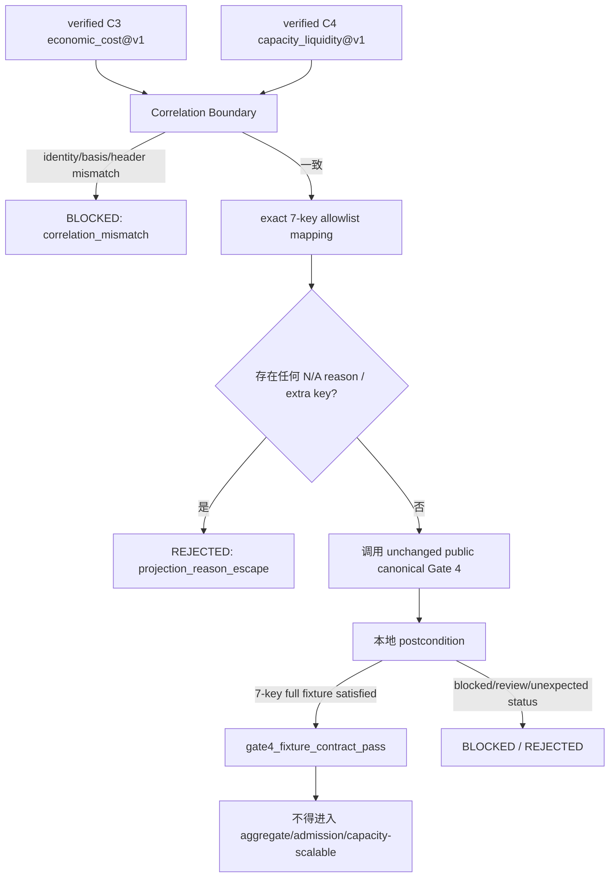

# C4 Capacity / Liquidity / ADV Evidence Producer Foundation — HLD

## 修订记录

| 版本 | 日期 | 修订人 | 变更要点 |
|---|---|---|---|
| 1.0 | 2026-07-14 | host-orchestrator inline meta-se-critical | CR-169 CP3 草案：定义 fixture/static-only C4 contract、最小 C3/C4 correlation header、strict joint Gate 4 fixture adapter、alpha-decay 归属决策和 Stage 2→3 边界；不授权实现。 |
| 1.1 | 2026-07-14 | host-orchestrator inline meta-se-critical | 按 CP3 评审补强：冻结 13 字段 correlation header、公开 Gate 4 callable 名称、Stage 2 7/7 核验失败分流、alpha-decay follow-up 与证据链方法论；回填五项 DQ 批准。 |
| 1.2 | 2026-07-14 | host-orchestrator inline meta-se | CP4 追溯更新：同步 5 个 formal Story、5 个串行 Wave 与 4 个 required Feature；不改变 CP3 架构语义。 |

## 1. 问题定义与目标

### 1.1 当前问题

CR-166/CR-168 已建立 neutral strategy evidence envelope 与 C3 `economic_cost@v1`。C4（capacity/liquidity/ADV）仍为 typed unavailable：现有 Gate 4 的 canonical validator 同时消费 4 个 C3 字段及 3 个 C4 ref。若消费者以 C4 absent 加 N/A reason 的方式直连 canonical validator，当前全局语义存在可能的 permissive N/A 路径；CR-168 已以 C3-only adapter 的 denylist 和 postcondition 将该路径封死，但它只证明“C4 缺失必须 fail-closed”，不能证明 C4 present 的 7 字段 payload 可被安全消费。

因此 CR-169 需要建立可复算的静态 C4 component，并在不改写 canonical Gate 4、不做 aggregate admission 的条件下，提供限定的 joint fixture compatibility 验证。该验证只能说明静态 7 字段合同组合成立，不能说明真实 capacity、真实 ADV、可扩容量或 Stage 3 ready。

### 1.2 目标

| ID | 量化目标 | 验收证据 |
|---|---|---|
| OBJ-01 | 新增 1 个 active C4 typed component：`capacity_liquidity@v1`；active schema version=1 | catalog / schema fixture |
| OBJ-02 | Gate 4 消费的 C4 refs 精确为 3/3：`adv_participation_ref`、`capacity_dollars_ref`、`liquidity_sizing_refs` | joint adapter contract test |
| OBJ-03 | C4 fixture/static 输入 12/12 P0 fail-closed 类别均有 machine reason | validator tests |
| OBJ-04 | 同一规范化 C4 语义输入重复 10 次，仅产生 1 个 component semantic hash | determinism test |
| OBJ-05 | strict joint adapter 只构造 7 个受控 Gate 4 字段；不产生 `*_na_reason`、`na_reason` 或 `n_a_reason` | mapping / denylist tests |
| OBJ-06 | fixture 7 字段全 present 时最多产生 1 个 `gate4_fixture_contract_pass`，且 `aggregate_admission_pass=0`、`capacity_scalable_claim=0` | adapter outcome test |
| OBJ-07 | CR-168 C3-only adapter 的 C4 absent fail-closed 回归=1，canonical Gate 4 修改数=0，aggregate orchestration 修改数=0 | regression / diff guard |
| OBJ-08 | CP8 前产生 1 份 `STAGE2-EXIT-VERIFICATION.result.json`，覆盖 7/7 Stage 2 合同并逐项给出 `PASS/FAIL/BLOCKED` 与 evidence ref；历史 6 项缺口不得由 CR-169 代修 | Stage 2 exit result |

### 1.3 非目标

- 不读取或写入真实 ADV、成交、盘口、订单流、provider、NAS 或数据湖。
- 不估计或校准真实 capacity curve、流动性、alpha decay 或 market impact。
- 不修改 `engine.cross_strategy_reliability_gates` 的 canonical Gate 4，也不依赖其私有 helper。
- 不修改 CR-168 C3-only absent-C4 adapter，不建立 C1–C4 aggregate orchestration，不修改 `StrategyAdmissionPackage`。
- 不将任何 fixture outcome 宣称为 aggregate admission、capacity scalable、real capacity readiness、Stage 3 entry readiness，亦不改变 CR-155 的 BLOCKED / `paper_candidate=false`。

## 2. 约束、假设与缺口

### 2.1 强制约束

| 约束 | 设计响应 |
|---|---|
| fixture/static-only | 只消费显式合成或静态参数；所有真实数据路径为禁止依赖。 |
| neutral envelope 复用 | 在 CR-166 catalog 内激活叶子 component，不创建平行 envelope / registry。 |
| canonical Gate 4 不可变 | 仅调用公开 validator，并在 adapter 本地施加 allowlist、denylist 与 postcondition。 |
| C3/C4 分层 | C3 仍归 CR-168；C4 仅归 CR-169；aggregate 归 FU-007 后续 CR。 |
| Stage 2 与 Stage 3 分离 | `stage2_complete` 只可由 7/7 exit 事实支持，且不蕴含 `stage3_entry_ready`；后者固定为 false。历史 6 项缺口回 CR-157 或新治理 CR，不扩大 CR-169。 |

### 2.2 假设

| 假设 ID | 假设 | 失效行为 |
|---|---|---|
| ASM-01 | CR-166 envelope 的 public catalog / canonical serialization 可供叶子 component 复用 | CP4 前发现契约不兼容时回到 CP3，不建立平行序列化。 |
| ASM-02 | CR-168 C3 component 能提供 Gate 4 所需 4 个受控 C3 字段 | 缺任一字段时 joint adapter BLOCKED，不补造值。 |
| ASM-03 | fixture proxy 只承载 schema / 算术验证价值 | 任何试图外推真实 capacity 的 claim 均 REJECTED。 |
| ASM-04 | Stage 2 其余 6 项合同已有历史 CR 产物 | CP8 必须逐项核验；任一未证实则 Stage 2 exit / `stage2_complete` claim 不成立，并回 CR-157 或新治理 CR；CR-169 仍只按本地 C4 范围判断交付。 |

### 2.3 缺口与处理

| 缺口 ID | 缺口 | 状态 | 处理 | 决策引用 |
|---|---|---|---|---|
| GAP-01 | `alpha-decay` 更接近 C2/OOS 的时间预测衰减还是 C4 容量输入，尚无 owner | RESOLVED，2026-07-14 | C4 v1 不实现；登记 `FU-CR161-008` 作为独立 / C2-adjacent owner 评估候选 | DQ-CP3-CR169-ALPHA / ADR-CR169-004 |
| GAP-02 | global canonical Gate 4 的 N/A 语义需要全局硬化 | OPEN，范围外 | 仅登记 FU-007a 候选；不在 CR-169 修改 | ADR-CR169-006 |
| GAP-03 | Stage 2 7 项退出合同未有一次性总核验 | RESOLVED-AS-CP8-OBLIGATION，2026-07-14 | 输出机器可读 7/7 result；历史 6 项失败回 CR-157 / 新治理 CR，不阻塞 CR-169 本地交付但禁止 Stage 2 complete / entry-ready claim | DQ-CP3-CR169-TRANSITION / ADR-CR169-005 |

## 3. Architecture Gray Areas 与顾问表

| Gray Area | 选项 | 推荐 | 理由 / 切换条件 |
|---|---|---|---|
| AGA-01：C4 方法形态 | A：显式 static proxy + deterministic arithmetic；B：只冻结 schema | A | B 无法证明计算和 consumer 可组合性；若静态 proxy 无法定义可审计限制，再降级 B。 |
| AGA-02：C3/C4 correlation | A：最小 header，身份进入 envelope binding、不进入 component semantic hash；B：将身份放进 component hash | A | A 允许同算术语义跨 package 比较，同时要求 join 时身份 / as-of / basis 完整一致。 |
| AGA-03：Gate 4 consumer | A：本 CR strict joint fixture adapter；B：延后全部 adapter 到 FU-007 | A | C4 交付需有消费兼容证据；adapter 输出仅 fixture contract outcome，非 aggregate。 |
| AGA-04：alpha-decay | A：C4 内实现；B：独立 / C2-adjacent 后续项 | B | Gate 4 无 alpha-decay 消费字段，且其核心语义为时间预测衰减，避免错误预占 C4。 |
| AGA-05：canonical N/A 漏洞 | A：本 CR 改 canonical；B：局部 containment + 后续 FU-007a 提案 | B | CR-169 不能在未单独审计全局消费者前改变 canonical 行为。 |

## 4. 候选架构比较与推荐

| 方案 | 组成 | 优点 | 缺点 / 风险 | 结论 |
|---|---|---|---|---|
| A：静态 C4 + strict joint adapter | C4 component、最小 correlation header、7-key allowlist、canonical read-only call、本地 postcondition | 交付 C4 计算合同并证明安全 consumer compatibility；保留 CR-168 absent-C4 防线 | 需要精确定义 proxy 限制和 adapter outcome | **推荐** |
| B：只做 C4 schema | schema / refs，无 producer 或 adapter | 最小实现量 | 无确定性、无 consumer 证据；C4 foundation 名不副实 | 不推荐 |
| C：修改 canonical Gate 4 | 全局修正 N/A 处理，再构造 C4 | 可一次性处理全局漏洞 | 影响未知消费者；越过 CR-169 范围且需独立 regression | 范围外，登记 FU-007a 候选 |

推荐方案 A 的原则：`capacity_liquidity@v1` 只输出具有明确 synthetic/static provenance 的 typed C4 evidence；joint adapter 是 CR-169 自有的局部桥接，构造严格的 7-key flat payload 并检查 canonical 返回后的合同不变量。`gate4_fixture_contract_pass` 只是“该显式静态 fixture 满足现有 Gate 4 字段合同”的局部结果，绝不传递为 StrategyAdmissionPackage PASS。

## 5. 能力边界与模块职责

| Feature / 模块 | 负责 | 输入 | 输出 | 不负责 |
|---|---|---|---|---|
| FEAT-169-01 C4 Contract & Producer | normalize / validate C4 fixture input、计算 3 类 C4 refs、hash / lineage | 显式 synthetic/static C4 input | `capacity_liquidity@v1` typed component | 真实 ADV / capacity、alpha decay、C3 计算 |
| FEAT-169-02 Correlation Boundary | 校验 C3/C4 的 package identity、basis、currency、calendar、as-of / horizon 的 join 条件 | 两个 verified components 的 envelope bindings | correlated pair 或 ordered BLOCKED reason | 修改任一 component hash 域 |
| FEAT-169-03 Strict Joint Adapter | 精确映射 4 C3 + 3 C4 Gate 4 字段、调用公开 canonical validator、执行 local postcondition | correlated C3+C4 pair | `Gate4FixtureCompatibilityOutcome` | canonical 修改、aggregate、CR-168 adapter 修改 |
| FEAT-169-04 Claim / Exit Guard | 维护 claim ceiling、Stage 2 7/7 exit result、CR-155 blocked regression | component / adapter tests、历史 refs | bounded evidence / exit verification | Stage 3 authorization 或 release |

### 5.1 组件与数据所有权

| 对象 | 唯一 owner | 只读消费者 | 写入规则 |
|---|---|---|---|
| `capacity_liquidity@v1` component | FEAT-169-01 | FEAT-169-02 / 03 | 仅 validated fixture input 可生成。 |
| C3/C4 correlation header schema | existing neutral envelope feature（CR-166） | FEAT-169-01 / 02、CR-168 | CR-169 只消费 / 验证，不创建平行 header registry。 |
| `Gate4FixtureCompatibilityOutcome` | FEAT-169-03 | tests / verification | 不写入 admission package 或 aggregate registry。 |
| `STAGE2-EXIT-VERIFICATION.result.json` | Host Orchestrator / CP8 | release / audit | 必须列出 7 项每项 evidence ref 与 PASS/FAIL。 |

## 6. 核心数据模型与 Hash 分域

### 6.1 C4 input 的语义分组

| 字段族 | required / optional 规则 | 目的 |
|---|---|---|
| identity binding | required envelope refs：manifest/run/strategy/package | 仅供 join / envelope audit，不进入 component semantic hash。 |
| static liquidity basis | required：synthetic ADV / notional / turnover basis、as-of / horizon | 显式计算基础；不得引用真实源。 |
| participation assumptions | required：participation cap、proxy model / version | 生成 `adv_participation_ref`。 |
| capacity assumptions | required：capacity model family、synthetic parameters、currency basis | 生成 `capacity_dollars_ref`。 |
| liquidity sizing assumptions | required：sizing rule / limit、reasoned limitations | 生成 `liquidity_sizing_refs`。 |
| units / calendar | required：currency、price/notional basis、calendar | 防止跨字段错配。 |
| correlation header | required 13-field `C3C4CorrelationHeaderV1` exact match | 保证 C3/C4 只能在同一 declared context 下 join；字段集见 §6.2。 |
| lineage / authorization | required fixture provenance / authorization refs | 无授权或来源不明必须 BLOCKED。 |

### 6.2 correlation header 精确字段集与 hash 分域

`C3C4CorrelationHeaderV1` 精确包含以下 13 个字段；缺少任一字段、额外字段、空白 identity/context ref、时间区间倒置或任一 C3/C4 值不相等都必须在调用 Gate 4 前 `BLOCKED/c3_c4_correlation_mismatch`：

| 分组 | 精确字段 | 来源与约束 |
|---|---|---|
| attachment identity | `manifest_ref`、`run_ref`、`strategy_ref`、`package_ref` | 从 C3/C4 envelope attachment context 构造；只进入 envelope binding，不进入 component semantic hash。 |
| calculation basis | `price_basis`、`notional_basis`、`currency`、`calendar` | 两侧必须逐字段 exact match；这些解释计算结果的字段仍分别进入各 component 的 normalized semantic body，不另对 header 建 hash 域。 |
| temporal context | `as_of`、`horizon_start`、`horizon_end` | 由调用方显式提供的 fixture/static join context 构造；不得从真实数据源推断；`horizon_start <= horizon_end <= as_of`。 |
| audit context | `lineage_context_ref`、`authorization_context_ref` | 是两侧共享的审计上下文引用；各 component 自身的 `lineage_refs` / `provenance_refs` / `authorization_refs` 仍独立校验，不要求组件专属来源列表彼此相等。 |

CR-169 不修改 `economic_cost@v1` schema。joint adapter 通过 C3 已有 attachment identity、C3 component basis/audit refs 与调用方显式 join context 构造 C3 header view；C4 producer 输出等价 C4 header view。任一侧无法无歧义构造完整 13 字段 header 时 fail-closed，不补造默认值。

### 6.3 component 与 envelope hash

```text
C4 component semantic hash
  = canonical_hash(normalized computational C4 body
                   + unit / model version / static limitation semantics)

Envelope hash
  = canonical_hash(envelope identity binding
                   + component semantic hash
                   + lineage / authorization refs)
```

`manifest_ref`、`run_ref`、`strategy_ref`、`package_ref` 不进入 C4 component semantic hash；它们必须进入 envelope binding，并且 joint adapter 必须比较完整 13 字段 header。因此，不同 package identity 不会被 component hash 误用为“相同 subject”，也不会把相同静态算术因 identity 变化而伪装成不同方法。basis / currency / calendar / temporal fields 解释计算语义，仍分别进入各 component normalized semantic body；header 本身不创建第三个 semantic-hash 域。任何 correlation header 不一致都先 BLOCKED，禁止调用 canonical Gate 4。

### 6.4 C4 static proxy 的声明

`synthetic_adv`、participation cap、capacity amount、liquidity sizing rule 均为显式 static assumption。输出必须声明 `real_adv_available=false`、`real_liquidity_available=false`、`capacity_ready=false`。v1 不含 alpha-decay calculator；任何 alpha 字段不得被默认为零或 N/A 后通过。

## 7. 关键流程与异常路径

### 7.1 C4 producer 正常流

```mermaid
flowchart LR
  A[显式 fixture/static C4 输入] --> B[规范化]
  B --> C{12类 P0 校验通过?}
  C -- 否 --> D[typed unavailable / BLOCKED + ordered machine reasons]
  C -- 是 --> E[确定性 static proxy 计算]
  E --> F[capacity_liquidity@v1 + semantic hash]
  F --> G[neutral envelope binding]
```

### 7.2 strict joint adapter 流



### 7.3 Exact payload contract

允许且只允许以下 7 个业务字段（可附内部 trace metadata，但不得传给 canonical validator）：

| 来源 | 字段 |
|---|---|
| C3 | `impact_model_family`、`impact_model_ref`、`cost_underestimation_status`、`no_real_tca_claim` |
| C4 | `adv_participation_ref`、`capacity_dollars_ref`、`liquidity_sizing_refs` |

禁止 `*_na_reason`、`*_n_a_reason`、`na_reason`、`n_a_reason`、任意 C4 absent placeholder、任意 aggregate / admission 字段。adapter 仅依赖公开 callable `engine.cross_strategy_reliability_gates.validate_gate4_capacity_impact`，以 `release_profile="candidate-release"` 调用；精确 Python 参数类型、依赖注入形态和测试 double 机制在 CP5 LLD 冻结。不得在运行时调用 `_has_na_reason` 等私有 helper。

### 7.4 Postcondition

`gate4_fixture_contract_pass` 的必要条件是：7 个字段全 present、C3 `no_real_tca_claim=true`、correlation 成立、no reason escape、canonical public validator 返回 PASS、输出没有 aggregate / capacity scalable claim。若 canonical 返回 PASS 但任一局部前提不成立，结果为 `REJECTED/gate4_fixture_postcondition_violation`。若 canonical 返回 BLOCKED / NEEDS_REVIEW / FAIL，joint adapter 如实返回 BLOCKED，不尝试放宽。

### 7.5 P0 fail-closed 类别

1. 关键 identity / envelope binding 缺失；2. synthetic ADV / turnover / notional basis 缺失；3. participation / capacity / liquidity model 或 version 缺失；4. 非有限值；5. 不可能的负值或 participation 超过声明 cap；6. unit / currency / price-notional basis 跨字段不一致且无显式转换；7. calendar / as-of / horizon 不一致；8. C3/C4 correlation header mismatch；9. lineage / provenance / authorization 缺失或不一致；10. component / envelope canonical hash 篡改；11. C4 ref 不是 typed present；12. N/A reason / extra-key escape 或 canonical postcondition 违反。

## 8. 场景模拟

| 模拟 | 输入 | 预期 | 验证场景 |
|---|---|---|---|
| SIM-CR169-01 正常静态 C4 | daily multifactor synthetic C4，三 refs present | `capacity_liquidity@v1` 可复算；10 次 1 hash；`real_adv_available=false` | SC-CR169-P01 |
| SIM-CR169-02 跨策略类型兼容 | daily / ML package 使用同一 C4 算术 body、各自 envelope identity | component semantic hash 的定义不受 identity 直接污染；任何 cross-subject join 仍需 identity binding 一致 | SC-CR169-P02 |
| SIM-CR169-03 joint 7-key | verified C3+C4 同 header，7 fields full present | local `gate4_fixture_contract_pass=1`；aggregate PASS=0 | SC-CR169-P03 |
| SIM-CR169-04 absent regression | C4 omitted / any C4 reason key inserted to CR-168 path | C3-only adapter fail-closed；不得改变 CR-168 行为 | SC-CR169-B01 / B02 |
| SIM-CR169-05 tamper / mismatch | hash、currency、calendar 或 header 被篡改 | producer 或 correlation boundary BLOCKED；canonical 不被调用 | SC-CR169-B03..B06 |

## 9. NFR 与安全边界

| 类别 | 要求 | 验证 |
|---|---|---|
| Determinism | 10 次相同 normalized input=1 hash；Decimal / canonical serialization 复用 CR-166 规则 | determinism test |
| Auditability | 每一 component / outcome 有 model version、static limitation、lineage、authorization ref、reason code | fixture assertions |
| Fail-closed | 不可用 / 不一致 / reason escape 一律不调用或不接受 canonical PASS | negative tests |
| Isolation | external data / provider / lake / runtime / broker / trading I/O=0 | forbidden import / operation guard |
| Compatibility | canonical Gate 4 和 CR-168 adapter diff=0 | regression / diff guard |
| Claim hygiene | Stage 2 complete 与 Stage 3 entry ready 独立；后者始终 false | CP8 claim review |

## 10. 风险与缓解

| 风险 ID | 风险 | 概率 | 影响 | 缓解 / 触发后动作 | 状态 |
|---|---|---|---|---|---|
| R-CR169-PROXY-VALIDITY | static proxy 被误读为真实 capacity | 中 | 高 | immutable claim ceiling、fixture provenance、禁止 real-ready 词汇 | OPEN-NONBLOCKING |
| R-CR169-GATE4-N-A | canonical N/A 语义可能对其他消费者 permissive | 高 | 高 | local strict adapter；仅登记 FU-007a 提案；不改 canonical | OPEN-NONBLOCKING |
| R-CR169-CORRELATION | C3/C4 被错误跨 context 合并 | 中 | 高 | minimal header exact equality、先 block 后调用 | MITIGATED-BY-DESIGN |
| R-CR169-ALPHA-OWNER | alpha-decay 被误放入 C4 | 中 | 中 | CP3 已决定 B；calculator=0，登记 `FU-CR161-008` | MITIGATED-BY-CP3 |
| R-CR169-VERIFIER-INDEPENDENCE | inline verification independence 不足 | 低 | 中 | FU-006 不前置但 CP8 需披露 | ACCEPTED-WITH-DISCLOSURE |
| R-CR169-STAGE2-OVERCLAIM | 未核验历史 6 项就声明 Stage 2 完成 | 中 | 高 | CP8 7/7 result；失败则 Stage 2 exit claim=false，并回 CR-157 / 新治理 CR；不让 CR-169 越界补救 | MITIGATED-BY-CP8 |

## 11. ADR 候选与决策清单

| Decision ID | 决策 | 推荐 | 备选 | CP3 影响 |
|---|---|---|---|---|
| DQ-CP3-CR169-METHOD | C4 方法形态 | explicit synthetic/static proxy | schema-only | 冻结 C4 producer 边界 |
| DQ-CP3-CR169-HEADER | C3/C4 correlation header 与 hash 分域 | minimal header；identity 仅 envelope binding | identity 进入 component hash | 决定 join 和 fixture 语义 |
| DQ-CP3-CR169-JOINT | Gate 4 consumer 归属 | CR-169 strict joint adapter、局部 outcome | 延后 FU-007 | 决定是否有 C4 consumer evidence |
| DQ-CP3-CR169-ALPHA | alpha-decay 归属 | 不纳入 C4 v1，独立 / C2-adjacent follow-up | C4 v1 内实现 | 决定 C4 contract 的范围 |
| DQ-CP3-CR169-TRANSITION | Stage2→3 claim 与 follow-up | `stage3_entry_ready=false`；CP8 7/7；FU-007a/b 仅提案 | 由 CR169 自动判定 Stage3 ready | 防止范围和授权漂移 |

详见 [companion ADR](ARCHITECTURE-DECISION-CAPACITY-LIQUIDITY-ADV-EVIDENCE-PRODUCER.md)。

## 12. 分阶段落地与交接

| 阶段 | 允许产物 | 退出条件 | 禁止项 |
|---|---|---|---|
| CP3 当前 | HLD、Blueprint、Domain/Dependency Map、ADR、CP3 brief | 用户确认 5 项 DQ | Story / LLD / source / test 实现 |
| CP4/CP5（批准后） | Story plan、LLD、test plan | 所有设计证据通过 CP5 | 真实数据 / runtime |
| CP6/CP7（批准后） | fixture/static implementation / verification | 12 P0、10-run hash、7-key joint contract、CR168 regression | canonical / aggregate / CR155 promotion |
| CP8 | release / claim review、Stage2 7/7 exit result | CR-169 本地 C4 交付满足；7 项均逐项分类。历史 6 项如有缺口则另行路由且 Stage2 claim=false | Stage3 自动启动、越界修补 CR-157 或远端写入 |

FU-007a（canonical N/A hardening）与 FU-007b（aggregate / CR155 regression）只是在后续 tracking 中的非约束性拆分候选。其任何启动均要求独立 CR、CP0 conflict precheck、范围决策和明确用户授权。

## 13. 工作量与后续计划

CP4 已拆分正式 Story 数=`5`、正式 Wave 数=`5`，执行顺序固定为 S01 contract/header → S02 deterministic producer → S03 envelope activation → S04 strict joint adapter → S05 fixture/claim/exit verification。4 个能力单元映射为 4 个 required Feature、12/12 设计三件套；5 个 Story 均为 full-lld。该更新只建立 CP5 设计输入，不授权实现。

## 14. 设计自检

| 维度 | 结论 | 证据 |
|---|---|---|
| 内部一致性 | PASS | hash 分域、join、adapter postcondition 与 claim ceiling 一致。 |
| 量化目标 | PASS | §1.2 八项均为精确数量或布尔值。 |
| 集成契约 | PASS | §5、§7.3–7.4 明确调用方向、输入/输出、降级和禁止同步范围。 |
| 相邻边界 | PASS | §1.3、§5、§12 分开 C3、C4、canonical、aggregate、alpha 与 Stage3。 |
| 前置 / 失败路径 | PASS | §2、§7 给出 block / reject 路径。 |
| 回退可操作性 | PASS | §3 给出选项和切换条件。 |
| 理论依据 | PASS | ISO 25010 可靠性/安全性/可维护性；延续 CR-168 的 evidence-chain 方法：canonical hash determinism、declared denominator / basis、worse-state merge 与 fail-closed。该集合是领域经验 + 可扩展，不声称穷尽。 |
| 遗留问题 | PASS | GAP-01..03 保留 OPEN 状态与处理。 |
| 修订记录 | PASS | 本文头部 §修订记录。 |
| Story / Wave 一致性 | PASS | 5 Stories / 5 serial Waves；与 §12 分阶段落地和 DEVELOPMENT-PLAN 一致。 |
| ADR 对齐 | PASS | §11 与 companion ADR 一一映射。 |
| 官方 / 既有契约 | PASS | 只调用现有 public Gate 4；不推断 / 依赖私有 helper。 |

## 15. Gotchas

1. `gate4_fixture_contract_pass` 不是 aggregate admission PASS；任何将其写入 `StrategyAdmissionPackage` 的实现均为越界。
2. 不要通过 C4 `*_na_reason` 填充缺失字段；C4 present joint path 必须 3 refs 全 present，C4 absent path 必须继续由 CR-168 adapter fail-closed。
3. component semantic hash 不携带 subject identity，不表示不同 subject 可安全 join；join 必须检查 envelope binding。
4. 不要为了修正 canonical Gate 4 的全局 N/A 语义而在 CR-169 修改其 source；这属于未来、独立审计的 FU-007a 候选。
5. `stage2_complete=true` 只有 CP8 的 7/7 result 全部 PASS 后才可声明；历史 6 项有缺口时回 CR-157 / 新治理 CR，CR-169 不越界代修。即使 7/7 PASS，`stage3_entry_ready` 仍必须为 false。

## 16. CP3 确认记录

- CP3 自动预检：`PASS`（15/15）。
- 人工结论：`approved`。
- 确认人：user。
- 确认时间：2026-07-14T18:48:03+08:00。
- 批准范围：接受 METHOD / HEADER / JOINT / ALPHA / TRANSITION 五项推荐方案及本版评审补强；仅解锁 CP4/CP5 设计准备，不授权实现、真实数据、Stage 3、canonical/aggregate 修改、CR-155 promotion 或 Git remote write。
