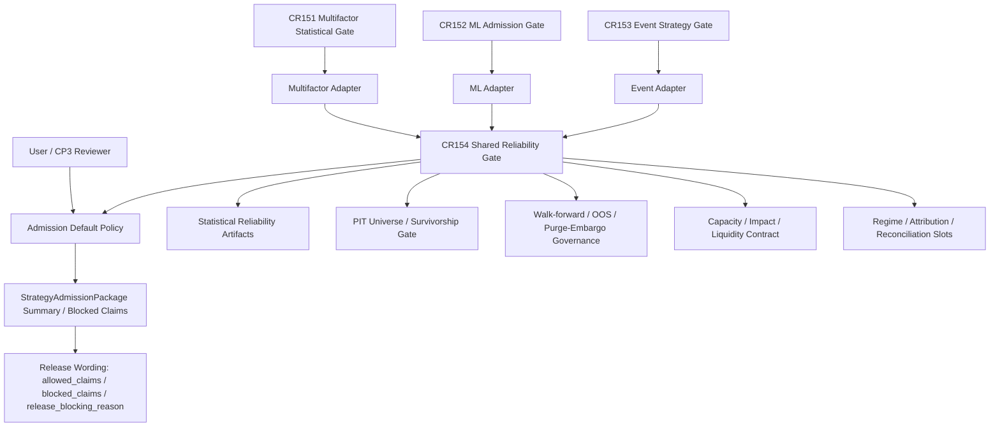

# HLD: CR154 Cross-Strategy Production Reliability Gates

## Revision Record

| Version | Date | Author | Change |
|---|---|---|---|
| 0.1 | 2026-07-03 | meta-se | Initial CP3 draft: Architecture Gray Areas, shared gate architecture, six gates, traceability, admission tier policy, CR153 compatibility lifecycle, impact enum, strategy-specific n/a policy and no-runtime boundary. |
| 0.2 | 2026-07-03 | host-orchestrator | Added non-blocking CP4/CP5 follow-through acceptance hooks for WRC/SPA severity mapping, cross-gate propagation, numeric thresholds, MF-GAP-2/6/7 deferred traceability and REQ anchor preservation. |

## 1. Problem Definition

### Problem Statement

CR151, CR152 and CR153 established local/static/fixture first-wave foundations for multifactor, ML and event-driven strategy admission. They intentionally left several cross-strategy production reliability risks to CR154: backtest traps, walk-forward/OOS governance, PIT universe and survivorship-free evidence, market impact and capacity semantics, regime/attribution/reconciliation slots and admission gate default policy.

The current risk is that a strategy can appear traceable and reproducible while still being statistically unreliable or overclaimed. A metadata chain, hash chain or fixture PASS is not enough if Sharpe/IC, event-study significance or ML performance lacks multiple-testing correction, PBO/CSCV, DSR/deflation, OOS splits, purge/embargo evidence, survivorship audit and capacity/impact blockers.

CR154 therefore designs a shared, local/static/fixture-only reliability gate layer that can be consumed by multifactor, ML and event-driven adapters without authorizing real data, runtime, trading, broker, feed, reconciliation or release operations.

### Value

The user gets a consistent release-blocking language for all three strategy families. Each strategy may keep its specialized evidence, but cross-strategy release wording and blocked claims become machine-visible and auditable. The design prevents fixture/static evidence from being misread as production readiness.

### Goals and Success Criteria

| ID | Goal | Measurable Success Criteria |
|---|---|---|
| G1 | Define shared production reliability gate contract | HLD/ADR define one shared gate surface plus adapter boundaries for multifactor, ML and event-driven strategies. |
| G2 | Preserve statistical reliability artifacts | Contract includes at least 12 artifact classes required by CP3-DC-CR154-001, each with refs or `n/a-with-reason`. |
| G3 | Make admission policy deterministic | HLD contains a tier table with strategy class, release profile, risk level, evidence completeness, gate mode, exceptions, rollback/switch and release wording. |
| G4 | Keep CR153 compatibility | `universe_pit_audit` is retained as first-wave adapter/source ref while CR154 owns shared PIT universe gate semantics. |
| G5 | Avoid real TCA and runtime overclaim | `impact_model_family` is controlled enum and HLD states first wave does not claim real TCA, real execution replay or broker reconciliation. |
| G6 | Keep ML-only methods from blocking non-ML strategies | Triple-barrier/meta-labeling and feature importance are strategy-specific n/a for multifactor and event-driven adapters, not CR154 cross-strategy release blockers. |

### Constraints

| Type | Constraint |
|---|---|
| Workflow | CP2 approved; CP3 pending. No Story decomposition, LLD, implementation or tests before later gates. |
| Authorization | No `.env`, credential, real lake/NAS/provider/QMT/runtime/broker/feed/order/reconciliation/publish or external framework operation. |
| Data | First wave is local/static/fixture contract semantics only; no real data validation, no true TCA, no catalog or registry write. |
| Compatibility | Do not delete CR153 `universe_pit_audit` compatibility semantics in the first wave. |
| Traceability | HLD/ADR must show UC/REQ -> Architecture coverage and state the REQ anchor policy. |

### Non-Goals

| Non-goal | Boundary |
|---|---|
| Real performance proof | Fixture/static PASS does not prove real strategy performance, real alpha or production readiness. |
| Real TCA | Capacity/impact contract does not calibrate market impact from real fills, order book, broker data or execution replay. |
| Real PIT universe construction | PIT universe gate only defines status/refs/blocked claims; it does not build or validate real universe data. |
| Runtime reconciliation | Regime/attribution/reconciliation slots do not run live-vs-offline, broker, account, cash, position or order reconciliation. |
| ML method completion | Triple-barrier/meta-labeling and feature importance remain CR152/follow-up concerns when applicable. |
| Source implementation | This CP3 draft does not define classes/functions or write code/tests. |

### Assumptions

| Assumption | Impact if False |
|---|---|
| CR151/CR152/CR153 admission gates can expose refs into a shared reliability policy without changing their historical release conclusions. | CP5 must add compatibility adapters or keep older callers opt-in. |
| Existing REQ anchors are sufficient for CP3 architecture traceability. | Host should route a product-baseline refresh to add CR154-specific REQ IDs before CP5. |
| Local/static/fixture evidence is sufficient to prove contract semantics. | A separate runtime/data authorization gate is required for empirical proof. |

### Missing Information

| Priority | Missing Information | Treatment |
|---|---|---|
| BLOCKING | None for CP3 design. | N/A |
| REQUIRED-LATER | Exact numeric thresholds for DSR, PBO, capacity participation and release-blocking risk levels. | CP5/Story design should define defaults or config policy. |
| REQUIRED-LATER | Whether product baseline should add CR154-specific REQ IDs. | CP3 decision item; recommended defer unless CP3 reviewer requests. |
| REQUIRED-LATER | Gate-level severity mapping for WRC/SPA and equivalent statistical corrections. | CP5/Story design should map missing evidence to `NEEDS_REVIEW` or `BLOCKED` per release profile. |
| REQUIRED-LATER | Cross-gate artifact propagation rules. | CP5/Story design should define how Gate 3/4 blocked states populate Gate 1 refs and blocked claims. |
| REQUIRED-LATER | MF-GAP-2/6/7 deferred traceability. | CP4/CP5 should state these factor-evaluation gaps remain deferred to factor-evaluation follow-up CR, not CR154 first wave. |
| OPTIONAL | True TCA calibration source and real universe data source. | Deferred to future runtime/data authorization CR. |

## 2. Blueprint Applicability

CR154 touches multiple strategy families and shared release policy, so blueprint analysis is applicable. This delegated CP3 task does not create standalone `BLUEPRINT.md`, `DOMAIN-MAP.md` or `DEPENDENCY-MAP.md`; instead it consumes the current roadmap/remediation plan plus CR151/CR152/CR153 HLD boundaries as the active blueprint baseline.

| Blueprint Dimension | CP3 Judgment | Reason | Follow-up Trigger |
|---|---|---|---|
| Feature boundary | required, satisfied in this HLD | Six gates and adapters define cross-strategy boundaries. | Create formal blueprint files if host-orchestrator requires them before CP3 Decision Brief. |
| Domain map | required, satisfied in §8 and §9 | Gate reports, artifact refs, admission policy and strategy adapters are defined. | Add separate DOMAIN-MAP if Story planning needs broader domain ownership. |
| Dependency map | required, satisfied in §6 and §8 | CR151/CR152/CR153 contribute evidence; CR154 owns shared policy. | Add separate DEPENDENCY-MAP if CP4 planning identifies file ownership conflicts. |

## 3. Architecture Gray Areas and Advisor Discussion

Discussion evidence:

- `process/discussions/CP3-CR154-HLD-DISCUSSION-LOG.md`
- `process/checks/CP3-CR154-DISCUSSION-CHECKPOINT.json`

| Gray Area | Selected Direction | Why It Shapes Architecture |
|---|---|---|
| AGQ-CR154-001 cross-strategy gate shape | Shared contract plus strategy adapters | Determines whether CR154 owns one policy layer or three separate gate families. |
| AGQ-CR154-002 statistical artifacts | Explicit artifact refs model | Prevents CP3-DC-CR154-001 violation by avoiding a plain trap status enum. |
| AGQ-CR154-003 default admission policy | Tier table | Determines release wording and CP5 Story boundaries. |
| AGQ-CR154-004 no-runtime reconciliation | Slots/status/refs only | Preserves security boundary while keeping future integration hooks. |
| AGQ-CR154-005 REQ anchoring | Reuse existing anchors for CP3; add CR154-specific later if needed | Avoids implicit requirements consumption. |
| AGQ-CR154-006 CR153 universe lifecycle | Retain CR153 slot as adapter/source ref; CR154 owns shared PIT gate | Prevents duplicate owner and first-wave compatibility break. |
| AGQ-CR154-007 impact enum and ML-only n/a | Controlled enum and strategy-specific n/a | Avoids free text and false non-ML blockers. |

## 4. Candidate Architecture Options

| Option | Description | Pros | Cons | Fit |
|---|---|---|---|---|
| A. Shared reliability gate contract plus strategy adapters | CR154 owns one reliability policy/gate family; CR151/152/153 feed evidence through adapters. | Highest consistency, clear release wording, supports default policy. | Requires explicit adapter contracts and compatibility rules. | Recommended |
| B. Per-strategy reliability gates | Multifactor, ML and event-driven each define their own reliability gate. | Simple local naming. | Duplicates policy, risks inconsistent release blocking and Story ownership. | Rejected for first wave |
| C. Extend only `StrategyAdmissionPackage` | Add CR154 fields directly to admission package surface. | Single integration point. | Mixes evidence production, policy evaluation and runtime-claim blockers in one object. | Rejected as primary; package should consume summary only |
| D. Documentation-only checklist | Record reliability warnings without a contract. | Lowest effort. | Not machine-verifiable, cannot fail closed, violates CP3 constraints. | Rejected |

### Recommendation

Use Option A: a shared cross-strategy reliability gate contract with strategy-specific adapters.

The shared layer owns the gate status model, statistical artifact refs, PIT universe gate semantics, capacity/impact vocabulary, regime/attribution/reconciliation slots and default admission policy. Strategy-specific adapters own how multifactor, ML and event-driven evidence maps into the shared gate.

### Applicability Matrix

| Dimension | Fit of Recommended Option |
|---|---|
| User goal | Strong: one release-blocking reliability posture across UC-58/59/60. |
| Project maturity | Strong: builds on CR151/152/153 first-wave contracts instead of replacing them. |
| Cognitive burden | Medium: larger contract, but reduces three independent rule sets. |
| Verification condition | Strong for fixture/static semantics; not empirical performance proof. |
| Rollback cost | Moderate: adapters can be disabled or defaulted to opt-in if compatibility breaks. |

## 5. Recommended Architecture Overview



### Core Architectural Style

- Metadata-only and contract-first.
- Fail-closed for mandatory missing evidence.
- Adapter-based strategy specialization.
- No real data/runtime side effects.
- Explicit claim boundary: evidence refs can enable or block wording, but cannot authorize trading or production release.

## 6. Module and Contract Boundaries

| Area | Owner | Responsibility | Inputs | Outputs | Boundary |
|---|---|---|---|---|---|
| Shared reliability gate | CR154 | Aggregate six gates and default policy into a cross-strategy reliability decision. | Adapter summaries, artifact refs, policy tier. | Gate status, blocked claims, release-blocking reason. | Does not compute real performance or run external systems. |
| Multifactor adapter | CR151 contributor | Map CR151 FDR/BH, robust stats, walk-forward/OOS and PBO/DSR evidence into CR154 artifacts. | CR151 statistical gate refs. | Adapter evidence summary. | Does not alter historical CR151 closure. |
| ML adapter | CR152 contributor | Map PIT feature/label, purged/embargo, model artifact, prediction and ML-specific slots. | CR152 ML gate refs. | Adapter evidence summary plus ML-only n/a policy. | Does not train or register models. |
| Event adapter | CR153 contributor | Map event time semantics, event study refs, event CV slots and `universe_pit_audit` source slot. | CR153 event gate refs. | Adapter evidence summary. | Does not run feed/listener/event store. |
| Admission policy evaluator | CR154 | Decide opt-in/default-required/release-blocking based on tier table. | Strategy class, release profile, risk level, evidence completeness. | Gate mode and release wording impact. | No runtime authorization side effects. |
| StrategyAdmissionPackage consumer | Existing admission layer | Consume reliability summary and blocked claims. | Gate summary/ref, release wording. | Package-visible reliability fields. | Statistical/reliability PASS does not imply paper/live/trading readiness. |

## 7. Six Gate Design

### Gate 1: Backtest Trap and Statistical Reliability Gate

Purpose: prevent lookahead, survivorship, data snooping, regime overfit and cost underestimation from being compressed into a single status.

Minimum artifact contract:

| Artifact | Required Semantics | Missing / N/A Policy |
|---|---|---|
| `multiple_testing_correction_refs` | Refs to family definition, tested hypothesis count and correction method. | `BLOCKED` if strategy claims statistical significance and no refs exist. |
| `fdr_bh_refs` | Benjamini-Hochberg or equivalent FDR correction refs. | `n/a-with-reason` only for non-significance-claim release wording. |
| `white_reality_check_or_hansen_spa_refs` | White Reality Check, Hansen SPA or equivalent data-snooping correction refs. | `NEEDS_REVIEW` or `BLOCKED` depending on release profile. |
| `pbo_or_cscv_refs` | PBO/CSCV report or staged approximation refs. | `BLOCKED` for release-blocking profiles; `n/a-with-reason` for exploratory. |
| `dsr_or_sharpe_ic_deflation_refs` | DSR, Sharpe deflation, IC deflation or equivalent selection bias/non-normality refs. | `BLOCKED` if Sharpe/IC-based release claim is made. |
| `trial_count_and_effective_trials` | Raw trial count and effective independent trials, with provenance. | Mandatory for DSR/deflation claims; otherwise n/a reason required. |
| `oos_split_refs` | Train/validation/test, rolling OOS or walk-forward split refs. | Missing OOS split blocks production reliability wording. |
| `purge_embargo_refs` | Purge window and embargo gap refs where labels/windows overlap. | Required for ML; n/a reason allowed for non-overlapping deterministic strategy. |
| `survivorship_audit_refs` | PIT universe or survivorship-free audit refs. | Missing blocks survivorship-free or production-ready claims. |
| `impact_capacity_refs` | Capacity/impact evidence refs from Gate 4. | Missing blocks scalable/capacity wording. |
| `blocked_claims` | Claims prohibited by missing or failed evidence. | Always required; empty list allowed only when evidence proves no blocked claims. |
| `release_blocking_reason` | Human-readable and machine-ref reason for release-blocking state. | Required whenever gate mode is release-blocking. |

### Gate 2: Walk-Forward / OOS / Purged-Embargo Governance

| Field | Semantics |
|---|---|
| `split_policy_ref` | Points to split manifest or strategy-specific split policy. |
| `walk_forward_ref` | Rolling or walk-forward evidence when applicable. |
| `oos_ref` | Out-of-sample evidence and date boundaries. |
| `purge_window` | Label/event overlap purge window, especially for ML/event windows. |
| `embargo_gap` | Embargo period between train/test windows. |
| `split_leakage_status` | `PASS`, `FAIL`, `NEEDS_REVIEW`, `BLOCKED`, `n/a-with-reason`. |

### Gate 3: PIT Universe / Survivorship-Free Gate

| Field | Semantics |
|---|---|
| `universe_mode` | `pit`, `survivorship-free`, `fixed-snapshot`, `unknown`, `n/a-with-reason`. |
| `universe_pit_ref` | Ref to PIT universe audit or source slot. |
| `delisted_inclusion_ref` | Evidence that delisted/ST/removed securities are handled or blocked. |
| `index_member_pit_ref` | PIT index membership refs when benchmark/universe claims depend on index members. |
| `survivorship_bias_status` | Four-state status plus n/a reason. |
| `blocked_claims` | At minimum blocks survivorship-free, full-history or production-ready universe claims if evidence is missing. |

### Gate 4: Capacity / Market Impact / Liquidity Sizing Contract

Controlled enum:

```text
impact_model_family =
  square_root
  almgren_chriss
  gatheral
  custom
  n/a-with-reason
```

| Field | Semantics |
|---|---|
| `adv_participation_ref` | Evidence ref for ADV participation assumption. |
| `capacity_dollars_ref` | Capacity estimate ref or `n/a-with-reason`. |
| `impact_model_family` | Controlled enum above. |
| `impact_model_ref` | Model parameters/config refs; `custom` requires rationale and validation boundary. |
| `liquidity_sizing_status` | Status for liquidity/capacity gate. |
| `cost_underestimation_status` | Whether commission/tax/slippage-only underestimates costs for release profile. |
| `no_real_tca_claim` | Required flag stating first wave is not real TCA. |

`custom` policy: allowed only when `custom_model_name`, `method_rationale`, `input_refs`, `validation_boundary` and `release_wording_limit` exist. It still cannot claim real TCA without separate authorization.

### Gate 5: Regime / Attribution / Reconciliation Slots

| Slot | First-Wave Semantics | Not Authorized |
|---|---|---|
| Regime | `regime_policy_ref`, `regime_split_ref`, status, limitations, n/a reason. | Real regime model training or live regime service. |
| Attribution | `attribution_model_ref`, factor/event/portfolio attribution refs, status, limitations. | Production PnL attribution based on real broker/fill data. |
| Reconciliation | `reconciliation_scope`, `offline_vs_live_ref`, `position_cash_ref`, `break_workflow_ref`, status. | Real broker, account, order, cash, position or live-vs-offline reconciliation. |

### Gate 6: Admission Default Policy

Gate 6 decides whether Gate 1-5 are opt-in, default-required or release-blocking for the strategy package.

## 8. Admission Default Policy Tier Table

| Tier | Strategy Class | Release Profile | Risk Level | Evidence Completeness | Gate Mode | Exception Conditions | Rollback / Switch | Release Wording |
|---|---|---|---|---|---|---|---|---|
| T0 | any | exploratory / research-note | low | partial evidence; blocked claims present | opt-in | Must not claim production, scalable, OOS-proven or survivorship-free readiness. | Switch to T1 when package is used for admission or public release wording. | "Exploratory only; reliability gates incomplete." |
| T1 | multifactor | admission-package / candidate-release | medium | CR151 statistical refs present; PIT/capacity may be incomplete with blocked claims | default-required | Capacity/PIT gaps may be `NEEDS_REVIEW` only if release wording blocks those claims. | Switch to T2 if package requests production-like, paper or simulation readiness wording. | "Admission candidate; missing gates restrict allowed claims." |
| T1 | ML | admission-package / candidate-release | medium-high | PIT feature/label, purge/embargo and trial counts present; ML-only fields may be active or deferred | default-required | Triple-barrier/meta-labeling and feature importance can be deferred if not part of active ML method. | Switch to T2 for model promotion, paper/live or production-like wording. | "ML admission candidate; leakage and split gates required." |
| T1 | event-driven | admission-package / candidate-release | medium-high | Event time semantics and event gate refs present; CR153 universe slot may delegate to CR154 | default-required | Universe PIT may remain adapter/source ref if CR154 gate summary states owner and status. | Switch to T2 for event feed, paper/live or production-like wording. | "Event admission candidate; feed/runtime not authorized." |
| T2 | any | release-readiness / production-like wording / simulation-readiness claim | high | all mandatory Gate 1-4 evidence complete; Gate 5 slots have refs or n/a reasons | release-blocking | Only allowed exception is explicit human risk acceptance that preserves blocked claims and forbids overclaim wording. | Roll back to T1 if evidence cannot be completed locally. | "Release blocked unless mandatory reliability evidence passes or claims are blocked." |
| T3 | any | paper/live/trading/runtime | critical | local/static evidence is insufficient by definition | release-blocking | No exception inside CR154. Requires separate runtime/data/trading authorization CR. | Switch only after new gate approval. | "Not authorized by CR154; runtime/trading release blocked." |

Uncovered release profiles must be represented as `n/a-with-reason` or deferred with owner and trigger. Default behavior for unknown profile is fail-closed to `release-blocking` until classified.

## 9. CR153 `universe_pit_audit` Compatibility Lifecycle

| Lifecycle Step | CR153 Slot Behavior | CR154 Gate Behavior | Owner Boundary | Duplicate Prevention |
|---|---|---|---|---|
| First wave | CR153 keeps `universe_pit_audit` as source/adapter slot. | CR154 defines shared PIT universe gate semantics and status vocabulary. | CR153 owns event-specific source ref; CR154 owns shared gate decision. | Adapter maps CR153 slot into CR154 `universe_pit_ref`; CR153 must not independently release-block on a different PIT policy. |
| Compatibility phase | CR153 may mark slot `delegated-to-CR154` when CR154 summary is present. | CR154 reports status and blocked claims. | CR154 is the policy owner. | Package displays one reliability decision, with CR153 source ref as evidence. |
| Migration phase | Later CR may deprecate CR153-local slot if all event packages consume CR154 gate. | CR154 becomes sole PIT universe policy surface. | Host/Story planning must confirm no CR153 compatibility consumer remains. | Deprecation requires migration evidence; deletion forbidden in CR154 first wave. |
| Conflict handling | If CR153 slot and CR154 gate disagree, CR154 gate result wins for release wording, while CR153 slot is retained as conflicting evidence. | `release_blocking_reason` records conflict. | CR154 owns release wording. | Conflict blocks release-like claims until resolved. |

## 10. Strategy-Specific N/A Policy

| Field / Method | Multifactor | ML | Event-Driven | CR154 Policy |
|---|---|---|---|---|
| Triple-barrier labeling | `n/a-with-reason: ML-specific method, not applicable` | active / deferred / n/a with CR152 owner | `n/a-with-reason: ML-specific method, not applicable` | Not a cross-strategy release blocker for non-ML. |
| Meta-labeling | `n/a-with-reason: ML-specific method, not applicable` | active / deferred / n/a with CR152 owner | `n/a-with-reason: ML-specific method, not applicable` | Remains CR152 or follow-up scope. |
| Feature importance | `n/a-with-reason: ML-specific model diagnostic, not applicable` | active / deferred / n/a with CR152 owner | `n/a-with-reason: ML-specific model diagnostic, not applicable` | Not required for multifactor/event release blocking. |
| Event study test family | `n/a-with-reason: event-specific method, not applicable` | `n/a-with-reason` unless event-derived ML method is active | active / deferred / slot-only | Event-specific; not a multifactor/ML generic blocker. |
| PBO/CSCV, DSR/deflation, trial counts | required when performance/significance claims are made | required | required when event windows/tests are selected | Cross-strategy statistical reliability blocker. |
| Purge/embargo | n/a if no overlapping label/event windows; reason required | required | required when event windows or overlapping samples exist | Cross-strategy governance with strategy-specific applicability. |

## 11. UC / REQ -> Architecture Traceability

### REQ Anchor Policy Decision

CR154 CP3 reuses existing REQ anchors rather than editing `process/REQUIREMENTS.md` in this CP3 design turn. This is explicit, not implicit. The reason is that the current task is HLD/ADR writing after CP2 approval, and product-baseline edits would reopen requirements scope. If CP3 reviewers require CR154-specific REQ IDs, host-orchestrator should route a product-baseline refresh before CP5.

Recommended decision: `CP3-DQ-CR154-REQ-ANCHOR-POLICY` approve reuse of existing anchors for CP3, with follow-up trigger "CP3 changes_requested for dedicated CR154 REQ IDs".

### Traceability Table

| UC / REQ Anchor | Source Need | Architecture Coverage |
|---|---|---|
| UC-58 | Multifactor chain must record factor, backtest, report, admission, blocked claims and overfit risk before simulation/live. | Multifactor adapter, Gate 1, Gate 2, Gate 4 and Gate 6. |
| UC-59 | ML chain must manage feature/label leakage, purged/embargo splits, training snapshot, model artifacts and admission. | ML adapter, Gate 1, Gate 2, Gate 6 and strategy-specific n/a policy. |
| UC-60 | Event strategy must separate event time, available_at, decision_time, event study, replay/admission and no direct orders. | Event adapter, CR153 compatibility, Gate 2, Gate 3, Gate 5 and no-runtime boundary. |
| REQ-077 | Liquidity, capacity and transaction cost sensitivity must block capacity claims when missing. | Gate 4 capacity/impact/liquidity contract. |
| REQ-079 | Robust validation must include rolling walk-forward and slices; single full-sample result is insufficient. | Gate 2 walk-forward/OOS governance. |
| REQ-080 | Reports must output allowed/blocked claims and gate status. | Gate summary and Gate 6 release wording. |
| REQ-089 | PIT/lifecycle/universe cannot be current snapshot disguised as PIT. | Gate 3 PIT universe/survivorship gate. |
| REQ-095 | Missing P0 current truth evidence must enter blocked claims. | Gate 1 and Gate 3 blocked claims and release-blocking reason. |
| REQ-136 | ADV, turnover, liquidity, capacity and impact gaps block capacity/scale-up claims. | Gate 4 impact/capacity contract. |
| REQ-154 | Strategy admission package must include gates, blocked reasons and resolution conditions. | Shared reliability summary consumed by `StrategyAdmissionPackage`. |
| REQ-181 | Admission package does not authorize QMT/simulation/live and must preserve blocked reasons. | Gate 6 plus no-runtime boundary. |
| REQ-225 | ML split cutoff and purge/embargo relation must be frozen in split manifest. | Gate 2 purge/embargo governance. |
| REQ-235 | Decision-time lookahead must block when signal time violates available_at. | Gate 1 lookahead and Gate 2 leakage governance. |
| REQ-246 | Production gates are CP3-level gates with structured blockers. | Six-gate CR154 HLD. |

## 12. Key Flows

### Flow 1: Multifactor Release Gate

1. Multifactor adapter receives CR151 statistical gate refs.
2. Adapter populates multiple-testing, FDR/BH, PBO/CSCV, DSR/deflation, trial count and OOS refs.
3. CR154 Gate 3 checks PIT universe/survivorship refs; missing refs block survivorship-free wording.
4. Gate 4 checks capacity/impact refs and impact model enum; missing data blocks scalable/capacity wording.
5. Gate 6 classifies admission profile. Candidate release defaults to required; production-like wording becomes release-blocking.
6. StrategyAdmissionPackage receives gate summary, blocked claims and release-blocking reason.

### Flow 2: ML Admission with Purge/Embargo Refs

1. ML adapter receives CR152 PIT feature/label, split, training snapshot and model artifact refs.
2. Gate 2 requires purge/embargo refs when label windows overlap.
3. Gate 1 requires trial counts, PBO/CSCV and DSR/deflation for performance claims.
4. Triple-barrier/meta-labeling and feature importance are active only if the ML method uses them; otherwise they remain CR152/follow-up or n/a-with-reason.
5. Unknown release profile fails closed to release-blocking until classified.

### Flow 3: Event-Driven Admission with CR153 Universe Slot

1. Event adapter receives CR153 event time semantics and `universe_pit_audit` source slot.
2. CR153 slot is mapped into CR154 Gate 3 `universe_pit_ref`.
3. If CR153 slot is missing, Gate 3 blocks survivorship-free/PIT claims but does not delete the CR153 slot.
4. Event CV slot delegates complete walk-forward/purged-embargo policy to CR154 Gate 2.
5. Gate 5 reconciliation remains slot/status/ref only; no feed/listener/broker/runtime reconciliation is authorized.

## 13. Non-Functional Design

| NFR | Design |
|---|---|
| Safety | Deny-by-default for runtime, credentials, real data, broker, feed, order, reconciliation and publish operations. |
| Auditability | Every missing artifact becomes `n/a-with-reason`, `blocked_claims` or `release_blocking_reason`; no silent omission. |
| Maintainability | Shared contract owns policy; adapters own strategy evidence mapping. |
| Compatibility | CR151/152/153 historical closures remain unchanged; CR154 adds new gate consumption semantics. |
| Verifiability | CP5/CP7 can use deterministic fixtures to validate status, blocked claims and release wording. |
| Extensibility | Impact model enum supports `custom` with rationale; runtime/TCA upgrades require separate authorization. |

## 14. Risks and Mitigations

| Risk | Severity | Mitigation |
|---|---|---|
| Statistical artifact thinness | BLOCKER | Gate 1 mandates CP3-DC-CR154-001 artifacts with refs or n/a reasons. |
| Runtime overclaim | BLOCKER | No-runtime boundary repeated in HLD/ADR; T3 always release-blocking for runtime/trading. |
| Implicit REQ consumption | HIGH | §11 states REQ anchor policy and follow-up trigger. |
| Admission tier ambiguity | HIGH | §8 tier table is the default policy source. |
| CR153 duplicate universe owner | HIGH | §9 owner boundary delegates policy to CR154 while retaining CR153 source slot. |
| Impact model free text | HIGH | §7 Gate 4 controlled enum. |
| ML-only methods overblocking non-ML | MEDIUM | §10 strategy-specific n/a policy. |

## 15. ADR Candidate Decision Points

| ADR | Decision |
|---|---|
| ADR-CR154-001 | Shared contract plus strategy-specific adapters. |
| ADR-CR154-002 | Statistical reliability artifacts model with explicit refs and n/a policy. |
| ADR-CR154-003 | CR153 `universe_pit_audit` compatibility and CR154 PIT universe ownership. |
| ADR-CR154-004 | Controlled `impact_model_family` enum and no-real-TCA claim. |
| ADR-CR154-005 | Admission default policy tier table. |
| ADR-CR154-006 | No-runtime/no-real-data boundary. |
| ADR-CR154-007 | REQ anchor reuse policy for CP3. |

## 16. Phased Landing Recommendation

This is not Story decomposition. It is a sequencing recommendation for later CP3-approved planning.

| Phase | Design Intent | Exit Signal |
|---|---|---|
| Phase A | Contract and adapter skeleton: shared gate summary, artifact refs, adapter mapping. | Deterministic fixture can represent PASS/FAIL/NEEDS_REVIEW/BLOCKED and blocked claims. |
| Phase B | Gate-specific evidence policies: statistical artifacts, OOS/purge/embargo, PIT universe, impact enum. | Mandatory missing evidence fails closed or produces n/a-with-reason. |
| Phase C | Admission policy and release wording linkage. | Tier table drives opt-in/default-required/release-blocking output. |
| Phase D | Compatibility and follow-up hooks. | CR153 slot lifecycle, CR152 ML-only policy and follow-up triggers are visible in evidence. |

## 17. Feature-Level Implementation Design Triggers

If CP3 is approved, CR154 likely requires feature-level implementation design for:

| Feature | Trigger | Required Output Later |
|---|---|---|
| Shared reliability gate contract | cross-module-contract, data-model, shared-story-boundary | Feature DESIGN / TEST-PLAN / TASKS. |
| Statistical artifact model | data-model, release-blocking policy | Feature DESIGN / TEST-PLAN / TASKS. |
| Admission default policy | permission/release policy, rollback | Feature DESIGN / TEST-PLAN / TASKS. |
| CR153 universe compatibility adapter | cross-CR compatibility and owner boundary | Feature DESIGN or technical note depending CP4 scope. |
| Capacity/impact enum | controlled vocabulary and no-TCA claim | Feature DESIGN or technical note. |

Expected later `lld_policy`: shared gate, statistical artifact model and admission policy should be `full-lld`; adapter-only or wording-only stories may be `technical-note`; pure documentation updates may be `waived` only with reason.

## 18. Content Deferred to Feature Design

The HLD intentionally does not specify class names, field-level serialization, validators, error codes, fixture file names or test implementation. These must be handled later in Feature DESIGN/LLD after CP3 approval.

Deferred details:

- Exact typed schema and enum serialization.
- Threshold defaults for `PBO`, `DSR`, trial count and capacity participation.
- Adapter mapping signatures.
- Fixture matrix and failure-path test cases.
- Backward compatibility field names in `StrategyAdmissionPackage`.
- Release wording rendering details.

### CP4 / CP5 Follow-through Acceptance Hooks

The following items are non-blocking for CP3 approval because CP3 defines contract shape, architecture boundary and reviewable decisions. They are blocking inputs for CP4/CP5 planning quality: Story planning and Feature design must either implement them as acceptance criteria or explicitly defer them with owner, trigger and release wording impact.

| Follow-through ID | Required Later Treatment | Why It Is Not CP3 Blocking | CP4 / CP5 Acceptance Hook |
|---|---|---|---|
| FT-CR154-CP5-001-WRC-SPA-SEVERITY | Define severity mapping for missing `white_reality_check_or_hansen_spa_refs` and equivalent data-snooping corrections by release profile and claim type. | HLD §7 already requires the artifact and HLD §8 defines the tier model; exact mapping is implementation-design detail. | Feature design must map exploratory / admission candidate / production-like profiles to `n/a-with-reason`, `NEEDS_REVIEW` or `BLOCKED`. |
| FT-CR154-CP5-002-CROSS-GATE-PROPAGATION | Define propagation rules between Gate 1 refs and Gate 3 / Gate 4 statuses, for example Gate 3 `BLOCKED` must populate Gate 1 `survivorship_audit_refs` or blocked claims. | CP3 establishes gate ownership and refs; propagation mechanics depend on schema and evaluator design. | Story acceptance must include fixture cases for Gate 3/4 blocked states propagating into Gate 1 artifact refs, blocked claims and release-blocking reason. |
| FT-CR154-CP5-003-NUMERIC-THRESHOLDS | Define defaults or config policy for DSR/PBO thresholds, capacity participation limits and risk-level defaults. | HLD §1 marks numeric thresholds as `REQUIRED-LATER`; calibration values are not architectural in this first wave. | Feature design must provide defaults, config ownership or explicit `n/a-with-reason` policy before implementation. |
| FT-CR154-CP5-004-MF-GAP-2-6-7-DEFERRED | Preserve traceability that MF-GAP-2, MF-GAP-6 and MF-GAP-7 are deferred to factor-evaluation follow-up CR, not CR154 first-wave scope. | These gaps are factor evaluation completeness concerns rather than cross-strategy reliability gate contracts. | CP4/CP5 acceptance mapping must include "MF-GAP-2/6/7 deferred to factor-evaluation follow-up CR" to prevent accidental scope expansion or false omission. |
| FT-CR154-CP5-005-REQ-ANCHOR-PRESERVATION | Preserve HLD §11 UC/REQ mapping if CR154-specific REQ IDs are not added before CP5. | CP3 traceability is concrete enough for HLD approval; product-baseline refresh is optional unless CP3 review requests it. | CP4/CP5 artifacts must carry the same UC/REQ mapping or route a product-baseline refresh before Story implementation. |

## 19. Rough Effort Estimate

| Work Area | Rough Size |
|---|---|
| Shared gate and artifact contract design | M |
| Three adapters | M |
| Admission policy integration | M |
| Fixture/static validation | M |
| Documentation/release wording | S |

Expected implementation after later gates: 4-6 focused Stories, depending whether CP4 splits adapter compatibility separately. This HLD does not create Stories.

## 20. Open Issues for CP3 Human Gate

| ID | Type | Question | Recommendation | Alternative | Impact |
|---|---|---|---|---|---|
| CP3-DQ-CR154-SHARED-CONTRACT | architecture | Approve one shared reliability gate contract plus adapters? | Approve. | Per-strategy gates. | Module boundaries and maintainability. |
| CP3-DQ-CR154-REQ-ANCHOR-POLICY | architecture | Reuse existing REQ anchors for CP3 or require CR154-specific REQ update before CP5? | Reuse now; add later if requested. | Product-baseline refresh now. | Traceability vs process churn. |
| CP3-DQ-CR154-NO-RUNTIME | security | Confirm CP3 does not authorize real data/runtime/broker/reconciliation/publish. | Confirm no-runtime boundary. | Separate runtime authorization CR. | Prevents overclaim and unsafe execution. |
| CP3-DQ-CR154-DEFAULT-POLICY | architecture | Approve the tier table as the default gate policy? | Approve tier table. | Keep all opt-in or all release-blocking. | Release wording and compatibility. |

## 21. HLD Self-Review

| Check | Status | Evidence |
|---|---|---|
| Problem definition completed before HLD | PASS | §1. |
| Architecture Gray Areas recorded before HLD | PASS | §3 and discussion log/checkpoint. |
| At least 2 candidate architectures compared | PASS | §4 has 4 options. |
| Blueprint applicability assessed | PASS | §2. |
| UC/REQ traceability included | PASS | §11. |
| Statistical reliability artifact minimum list covered | PASS | §7 Gate 1. |
| Admission default policy tier table included | PASS | §8. |
| CR153 universe slot lifecycle included | PASS | §9. |
| Impact model controlled enum included | PASS | §7 Gate 4. |
| ML-only n/a policy included | PASS | §10. |
| No Story/LLD/implementation/test/runtime work performed | PASS | This document is CP3 design-only. |
