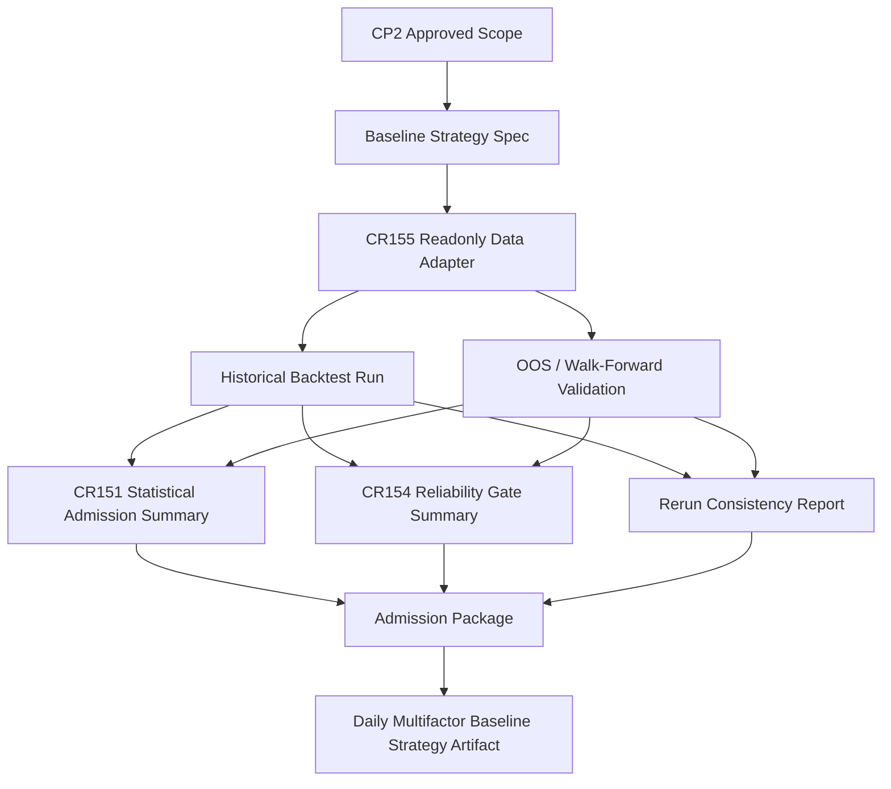

# HLD: CR155 Daily Multifactor Baseline Strategy Artifact

## Revision Record

| Version | Date | Author | Change |
|---|---|---|---|
| 0.1 | 2026-07-04 | host-orchestrator | Initial CP3 draft covering architecture gray areas, candidate options, recommended artifact contract plus readonly validation pipeline, module boundaries, traceability, scenario simulation, risks and CP3 decision items. |
| 0.2 | 2026-07-04 | host-orchestrator | CP3 approved by user; standalone artifact contract, readonly validation pipeline, rerun policy and no-runtime/no-write boundary confirmed for CP4 Story planning. |

## 1. Problem Definition

CR148 closed the unified backtest / experiment foundation. CR151 closed the local/static/fixture multifactor statistical admission capability. CR154 closed the local/static/fixture cross-strategy reliability gate foundation. What is still missing is a concrete, inspectable daily multifactor baseline strategy artifact that ties those foundations into one auditable baseline strategy instance.

CR155 must not create an optimal strategy claim. It must create a simple, non-optimal, daily multifactor baseline artifact with explicit strategy identity, factor selection, signal construction, portfolio policy, historical backtest, OOS/walk-forward validation, statistical admission result, cross-strategy reliability result, admission package, rerun consistency and claim boundary.

## 2. Goals and Success Criteria

| ID | Goal | Measurable Success Criteria |
|---|---|---|
| G1 | Define one concrete baseline strategy artifact | CP3 defines required artifact fields: `strategy_id`, universe ref, factor spec refs, signal spec, portfolio policy, rebalance policy, cost/slippage policy, backtest refs, OOS/walk-forward refs, admission refs, report refs and evidence refs. |
| G2 | Keep baseline non-optimal and non-promissory | HLD and ADR explicitly state the baseline is a simple reference strategy, not alpha promise, paper/live readiness or production deployment claim. |
| G3 | Use CP2-approved readonly data boundary | Design isolates CR155-scoped local governed lake/current truth readonly from lake writes, catalog pointer mutation, NAS/provider/credential/runtime/trading/broker actions. |
| G4 | Make admission auditable | Admission package includes `paper_candidate=true|false`, reasons, blockers, risk refs and gate statuses. |
| G5 | Require deterministic rerun evidence | Two reruns compare return, drawdown, turnover, cost, capacity/liquidity summary and gate status, with diff reason if not identical. |
| G6 | Reuse foundations, avoid parallel framework | Design consumes CR148/CR151/CR154 contracts rather than replacing them. |

## 3. Non-Goals

| Non-goal | Boundary |
|---|---|
| Optimized strategy discovery | CR155 uses a simple baseline factor combination; optimizer or model search belongs to future CRs. |
| Trading or paper readiness | `paper_candidate` is a research admission field only; it is not a QMT/paper/live authorization. |
| Lake mutation | No lake write, catalog pointer mutation, feature store, label store, model registry, prediction store or publish. |
| External framework execution | No Qlib/Backtrader/vectorbt/other external framework clone/install/run. |
| Broker/runtime integration | No QMT/MiniQMT/xtquant/gateway/runtime/simulation/live/trading/broker action. |

## 4. Architecture Gray Areas

| Gray Area | Options Considered | Selected Direction | Why It Shapes Architecture |
|---|---|---|---|
| AGQ-CR155-001 artifact ownership | One standalone artifact vs report-only output vs extend admission package | Standalone strategy artifact consumed by admission package | Determines whether downstream can audit a stable strategy object instead of a report bundle. |
| AGQ-CR155-002 readonly data boundary | Fixture-only vs CP2-approved governed lake readonly vs runtime/lake integration | CP2-approved local governed lake/current truth readonly only | Determines validation pipeline, evidence wording and forbidden operations. |
| AGQ-CR155-003 baseline factor construction | Handpicked simple factors vs optimizer/model search vs external framework recipe | Simple deterministic factor set with explicit refs and no optimality claim | Prevents overfitting and makes reruns auditable. |
| AGQ-CR155-004 admission semantics | Single PASS/FAIL vs separate statistical + reliability + package decision | Separate gate summaries plus admission package decision | Keeps CR151/CR154 evidence visible and avoids collapsing reasons. |
| AGQ-CR155-005 rerun consistency | Optional rerun vs mandatory exact/diff-tolerant comparison | Mandatory two-rerun comparison with documented diff policy | Controls reproducibility and admission reliability. |

### Advisor Table

| Option | Pros | Cons | Impact Surface | Recommendation | Assumptions / When to switch |
|---|---|---|---|---|---|
| A. Artifact contract plus readonly validation pipeline | Concrete artifact, stable audit surface, uses CP2-approved data boundary, supports rerun evidence | Requires several contracts and CP5 story split | artifact, data, validation, security, release wording | Recommended | Switch only if CP3 rejects governed lake readonly or demands fixture-only first wave. |
| B. Report-pack-only baseline | Faster, fewer new objects | Weak auditability; strategy identity and policy may be implicit | reports, admission package, traceability | Not recommended | Use only for exploratory notebooks outside CR155 artifact scope. |
| C. Extend only `StrategyAdmissionPackage` | Single integration point | Mixes strategy definition, validation evidence and admission decision | admission, compatibility, ownership | Not recommended as primary | Package should consume artifact summary, not own full strategy definition. |
| D. External framework recipe | Familiar model for factor backtests | Violates no external framework run/default dependency boundary | dependency, runtime, licensing, validation | Rejected | Separate Spike required. |

## 5. Recommended Architecture

Use Option A: a standalone daily multifactor baseline strategy artifact plus a readonly validation pipeline.

## 6. Module Responsibilities

| Module / Concept | Responsibility | Inputs | Outputs | Boundary |
|---|---|---|---|---|
| Baseline Strategy Spec | Defines strategy identity, universe, factor refs, signal, portfolio and rebalance policy. | CP2 scope, UC-58, roadmap. | `DailyMultifactorBaselineStrategyArtifact` core fields. | No optimizer or external framework object as truth. |
| Readonly Data Adapter | Reads CP2-approved local governed lake/current truth snapshot for CR155 validation. | Snapshot refs, universe refs, date range. | Readonly panel inputs and provenance refs. | No write, no catalog pointer mutation, no NAS/provider/credential read. |
| Backtest/OOS Validator | Runs historical backtest and OOS/walk-forward validation through existing foundations. | Strategy spec, readonly inputs, cost/slippage policy. | Backtest refs, metrics, split refs. | No runtime/paper/live/trading. |
| Admission Gate Composer | Combines CR151 statistical status and CR154 reliability status. | Gate refs and summaries. | `pass` / `fail` / `needs_review`, reasons. | Does not hide component failure reasons. |
| Admission Package Builder | Emits package with `paper_candidate`, blockers, risks and claim boundary. | Artifact summary, gates, rerun report. | Admission package ref. | `paper_candidate` is not broker/paper authorization. |
| Rerun Consistency Checker | Compares two reruns of core metrics and explains differences. | Two run refs. | Consistency report and diff status. | No hidden tolerance; policy must be explicit in CP5. |

## 7. Data and Authorization Design

| Surface | CP3 Design |
|---|---|
| Allowed data access | Later CR155 work may perform local governed lake/current truth readonly for historical backtest, OOS/walk-forward and rerun consistency. |
| Forbidden data access | No lake write, no catalog pointer mutation, no NAS/provider sync/fetch/restore, no credential or `.env` read. |
| Runtime boundary | No QMT/MiniQMT/xtquant/gateway/runtime/simulation/paper/live/trading/broker. |
| Evidence wording | All reports must state data source is readonly local governed snapshot/current truth and does not imply production readiness. |
| Fail-closed rule | If readonly provenance or snapshot identity is missing, admission must be `needs_review` or `fail`; it cannot be `paper_candidate=true`. |

## 8. Candidate Artifact Contract

| Field | Required | Semantics |
|---|---|---|
| `strategy_id` | yes | Stable id for the baseline artifact, e.g. `daily_multifactor_baseline_v1`. |
| `strategy_kind` | yes | `multifactor_daily_baseline`. |
| `universe_ref` | yes | Universe definition and PIT/survivorship boundary ref. |
| `factor_spec_refs` | yes | Selected simple factors and versions. |
| `signal_spec` | yes | Factor normalization, combination and direction policy. |
| `portfolio_policy` | yes | Weighting, constraints, benchmark and exposure policy. |
| `rebalance_policy` | yes | Daily or scheduled rebalance rule and calendar boundary. |
| `cost_slippage_policy_ref` | yes | Commission/slippage/tax/impact proxy refs. |
| `backtest_refs` | yes | Historical run spec, metrics and report refs. |
| `oos_walk_forward_refs` | yes | Split policy, OOS periods, purge/embargo if applicable. |
| `statistical_admission_ref` | yes | CR151-compatible status and reasons. |
| `reliability_gate_ref` | yes | CR154-compatible status and reasons. |
| `rerun_consistency_ref` | yes | Two-rerun metrics diff report. |
| `admission_package_ref` | yes | Package with `paper_candidate` and claim boundary. |
| `blocked_claims` | yes | Claims not allowed by current evidence. |

## 9. Use Case to Architecture Traceability

| Source | Need | Architecture Coverage |
|---|---|---|
| UC-58 | Multifactor research to admission metadata chain | Baseline Strategy Spec, Backtest/OOS Validator, Admission Package Builder. |
| UC-25 | Multifactor portfolio construction boundary | `signal_spec`, `portfolio_policy`, no optimizer default. |
| UC-27 | StrategyAdmissionPackage refs and blocked claims | Admission Gate Composer and Package Builder. |
| Roadmap Phase 3 | At least one daily multifactor baseline full backtest and report pack | Backtest/OOS Validator and artifact contract. |
| CR151 | Statistical admission gate | `statistical_admission_ref`. |
| CR154 | Reliability gates | `reliability_gate_ref` and blocked claims. |

## 10. Scenario Simulation

| Scenario | Flow | Expected Result |
|---|---|---|
| S1 normal baseline build | Spec -> readonly data -> backtest -> OOS -> gates -> rerun -> package | Artifact created with `paper_candidate` set by gates; no runtime/trading authorization. |
| S2 missing readonly provenance | Spec -> data adapter lacks snapshot/current truth ref | Validation fails closed; admission is `needs_review` or `fail`. |
| S3 rerun metrics drift | Two reruns differ beyond CP5 policy | Consistency report records diff; package cannot silently pass. |

## 11. HLD Split Check

| Signal | Judgment |
|---|---|
| Core product count | One core product: daily multifactor baseline strategy artifact. |
| Story count estimate | Likely 4-5 stories; keep one HLD. |
| ADR clusters | One cluster around artifact/read-only/admission/rerun boundaries. |
| Decision | No split required. |

## 12. Risks

| Risk | Severity | Mitigation |
|---|---|---|
| Baseline artifact is overclaimed as optimal or tradable | HIGH | `blocked_claims`, non-goal wording and admission package claim boundary. |
| Readonly data approval is misread as write/runtime approval | HIGH | Dedicated readonly adapter boundary and forbidden counters. |
| Rerun differences are hand-waved | MEDIUM | Rerun consistency report with explicit diff policy. |
| Artifact duplicates existing contracts | MEDIUM | Reuse CR148/CR151/CR154 refs and keep package as consumer. |

## 13. CP3 Decision Items

| Decision ID | Type | Recommended Decision | Alternatives | Impact / Risk | Rollback / Switch |
|---|---|---|---|---|---|
| CP3-DQ-CR155-ARTIFACT-CONTRACT | architecture | Approve standalone artifact contract plus admission package consumer relationship. | Report-pack-only; admission-package-only. | Determines auditability and Story boundaries. | If too broad, keep artifact shell and defer optional fields. |
| CP3-DQ-CR155-READONLY-PIPELINE | architecture | Approve isolated readonly validation pipeline with no write/runtime bridge. | Fixture-only first wave; direct lake integration. | Controls data boundary and implementation risks. | Switch to fixture-only if CP5 cannot prove readonly provenance safely. |
| CP3-DQ-CR155-RERUN-POLICY | implementation | Require two-rerun consistency evidence and explicit diff treatment. | Single rerun; manual explanation only. | Affects CP7 determinism and admission trust. | CP5 may define tolerances per metric. |
| CP3-DQ-CR155-NO-RUNTIME | security | Confirm CP3 does not authorize Story, LLD, implementation, lake write, NAS/provider/credential/runtime/trading/broker/publish. | Open separate runtime/data authorization CR. | Prevents scope creep and unsafe claims. | Future runtime/data CR with explicit human gate. |

## 14. Self Review

| Check | Result |
|---|---|
| At least two candidate options compared | PASS |
| Architecture Gray Areas recorded | PASS |
| Recommended option and switch conditions stated | PASS |
| Use case traceability included | PASS |
| Scenario simulation included | PASS |
| HLD split check completed | PASS |
| No implementation details below CP3 level | PASS |
