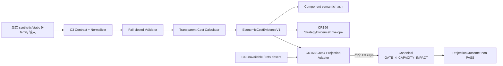

# 高层设计：Economic Cost / Slippage / Impact Computable Evidence Producer Foundation

## 修订记录

| 版本 | 日期 | 修订人 | 变更要点 |
|---|---|---|---|
| 1.0 | 2026-07-14 | host-orchestrator inline meta-se-critical | 基于 CR168 CP2 approved 基线形成 companion HLD；冻结 C3 typed component、static square-root approximation、C3/C4 owner table、hash domain、Gate4 adapter-local containment 和全局遗留路由。 |
| 1.1 | 2026-07-14 | host-orchestrator inline meta-se-critical | 吸收 CP3 深度评审：明确 component/envelope 两级 identity 绑定，固化 participation proxy、舍入点、minor unit 与 Gate4 release profile，拆分 postcondition reason code，并补齐 test double、schema/C4 演进及 registry 治理。 |
| 1.2 | 2026-07-14 | host-orchestrator inline fallback | 按 CR131 design-surface 规则移入 archive 后更新同批 companion source paths；正文技术语义不变。 |

## 1. 问题定义

### 1.1 问题陈述

CR166 已交付方法中立的 strategy evidence envelope，并把 `economic_cost` 留为 reserved slot；但仓库没有一个能把显式静态成本输入转化为可审计 C3 component 的 producer。现有 `GATE_4_CAPACITY_IMPACT` 同时消费 C3 成本/impact 与 C4 capacity/liquidity 字段，而且 canonical validator 对“C4 ref 缺失但存在字段级或通用 N/A reason”的输入可能不产生 blocked claim。若 C3 projection 直接透传这种 reason key，在 C4 尚未建设时存在 Gate4 虚假 PASS 风险。

### 1.2 核心价值

- 把 fee、tax、spread、slippage 和透明 impact approximation 从口头假设变成确定性、可重算、可 hash 的 typed evidence。
- 复用现有 neutral envelope，避免平行 registry/gate/准入合同。
- 在不修改 canonical Gate4 的前提下，让 CR168 自己的唯一 projection 路径对 C4 unavailable 保持 fail-closed。
- 给后续 C4 和 aggregate integration 留出明确 owner 与重访点，不把 fixture 误述为真实 TCA、capacity readiness 或 Stage3 启动。

### 1.3 目标与量化标准

| 优先级 | 目标 | 精确度量 |
|---|---|---:|
| P0 | 单一 C3 typed contract | component/schema `1/1`，9/9 字段族规则 |
| P0 | 输入与算术 fail-closed | 10/10 负向类别，false PASS `0` |
| P0 | 确定性 identity | 同一规范化输入 10 次得到 1 component hash |
| P0 | Gate4 compatibility safety | projection `1`；8/8 forbidden keys 拒绝；escape canonical calls `0`；C4 unavailable Gate4/capacity/aggregate PASS `0` |
| P0 | 不越界 | canonical Gate4/aggregate 修改 `0/0`；C4 calculator `0`；真实数据/TCA/runtime 操作各 `0` |
| P1 | 策略类型兼容 | fixture 族 `2/2`；event producer `0` |

### 1.4 约束

| 类型 | 约束 |
|---|---|
| 架构 | 复用 `engine.strategy_evidence` public canonical/envelope；不创建平行 envelope、dynamic registry 或 gate |
| 方法 | 只使用调用者显式给出的 synthetic/static 参数；不估计或校准真实市场参数 |
| 集成 | Gate4 是 C3+C4 联合门禁；CR168 只提供四个 C3 字段，C4 refs absent |
| 安全 | 零 credential/provider/lake/NAS/runtime/broker/trading/catalog/store/registry/publish/remote write |
| 工作流 | CP3 未批准前不拆 Story、不写 LLD、不实现、不运行验证 |

### 1.5 非目标

- 真实订单/成交/盘口/订单流/ADV/流动性读取，真实 TCA 或 market-impact calibration。
- `almgren_chriss`、`gatheral`、`custom` 的 v1 计算实现。
- C4 capacity/liquidity/ADV/alpha-decay calculator。
- canonical Gate4 全局语义修改、C1-C4 aggregate orchestration、StrategyAdmissionPackage 最终集成。
- event-specific economic-cost producer、Stage3 启动、runtime/production readiness。
- CR155 unblock、promotion 或 regression-pass reinterpretation。

### 1.6 关键假设与缺失信息

| 优先级 | 项目 | 当前处理 | 失效行为 |
|---|---|---|---|
| REQUIRED | static square-root approximation 足以证明第一版透明 impact contract | 作为推荐 DQ-CP3-CR168-METHOD | 需要其他 family 时新 schema version / 后续 CR，不在 v1 暗增 |
| REQUIRED | CR168 是新增 Gate4 caller 的唯一 owner | adapter-only call surface + 后续静态检查 | 出现其他 caller 时停止并重访 FU-007/global hardening |
| REQUIRED | capability registry reference 必须有可审计 disposition；当前项目没有 registry | 以 `capability_registry_ref=N/A` + reason + 既有 feature/module refs 满足治理证据；不新建 registry | 缺失 disposition 则阻断 CP4；若治理要求真实 registry，独立 CR |

## 2. Architecture Gray Areas 与方案形成

**讨论日志**：`process/discussions/CP3-CR168-HLD-DISCUSSION-LOG.md`
**恢复点**：`process/checks/CP3-CR168-DISCUSSION-CHECKPOINT.json`

### 2.1 Architecture Gray Areas

| AGA | 关键问题 | 为什么影响架构 | 影响面 | 状态 |
|---|---|---|---|---|
| AGA-CR168-01 | C3 component、envelope 与 Gate4 projection 如何分层？ | 决定是否重复合同、是否污染 neutral 层、是否能安全回退 | module / integration / validation | approved，DQ-ARCH |
| AGA-CR168-02 | v1 支持哪些 impact family？ | 决定参数 schema、算术、claim ceiling 和测试爆炸面 | method / data / risk | approved，DQ-METHOD |
| AGA-CR168-03 | C3/C4 header 与 hash identity 冻结到何种程度？ | 过少会迁移，过多会预占 C4；identity 域不清会破坏跨策略 fixture | contract / ownership / follow-up | approved with A1 revision，DQ-HEADER |
| AGA-CR168-04 | Gate4 N/A reason 逃逸在何处整改？ | 局部 adapter、canonical 全局修改或延期会改变风险与范围 | security / integration / scope | approved，DQ-GUARD |
| AGA-CR168-05 | custom required_evidence 与缺失 capability registry 如何处理？ | 影响 CP4 前 scope/authz check，但不应引入新治理系统 | process / traceability | approved，DQ-GLOBAL |

### 2.2 Advisor Table

| Option | Pros | Cons | Impact Surface | Recommendation | When to switch |
|---|---|---|---|---|---|
| A. C3 module + neutral envelope + guarded projection | 复用现有合同；局部封堵风险；可验证真实 consumer compatibility | 多一个小 adapter 和 pre/post guard | module/integration/security/test | 推荐 | 局部 guard 无法满足 B01/B02 时回退 B |
| B. Component-only，projection 延后 FU-007 | 最小耦合；完全避开 Gate4 当前语义 | CR168 无法证明 consumer compatibility | scope/test/follow-up | 备选 | 方案 A 需要改 canonical/aggregate 时采用 |
| C. 直接修改 canonical Gate4 | 一处修复可能覆盖所有 caller | 扩大 CR、改变历史语义、需要全量 consumer regression | global contract/high risk | 不推荐/未授权 | 未来出现 direct caller 或 FU-007 进入 aggregate 时独立审批 |

### 2.3 方案形成输入

| 来源 | 事实/意见 | 处理 |
|---|---|---|
| CP2 approved | fixture/static C3、shared header、1 projection、2 fixture、claim ceiling | adopted |
| canonical code review | absent C4 ref + N/A reason 可能不 blocked | adopted as adapter-local threat model |
| CR166 neutral envelope | stable header、static catalog、canonical domains | adopted/reused |
| Feature Gate4 contract | canonical families 与 C3/C4 joint fields | square_root active subset adopted；global change deferred |
| 用户 no-subagent | meta-se-critical 以内联方式执行 | transparent inline-fallback，model_verified=false |

### 2.4 Deferred Architecture Ideas

| ID | 内容 | 延后原因 | 重启条件 |
|---|---|---|---|
| DAI-CR168-01 | canonical Gate4 全局 hardening | 不是完成 CR168 局部 projection 所必需，且会改变已有 caller 语义 | FU-007、direct caller 或独立安全审计 |
| DAI-CR168-02 | C4 producer | 输入/方法/授权不同 | FU-CR161-005 独立启动 |
| DAI-CR168-03 | multi-family calibrated impact models | 无真实校准与独立方法审批 | 新方法/数据 CR |
| DAI-CR168-04 | capability registry | 当前项目没有 registry，CR168 不应顺手创建 | 项目级治理需求独立批准 |

## 3. 候选方案与选择

### 3.1 方案 A：分层 C3 + guarded projection（推荐）

```text
Explicit fixture/static input
  -> normalize + validate
  -> transparent deterministic computation
  -> EconomicCostEvidenceV1 + component semantic hash
  -> existing StrategyEvidenceEnvelope
  -> guarded C3-to-Gate4 projection
  -> canonical Gate4 returns BLOCKED because C4 refs are absent
```

优点：满足全部 CP2 目标；neutral envelope 保持方法中立；Gate4 风险被限制在 CR168 owner 内；回退时可以删除 projection 而保留 component。缺点：adapter 必须维护严格 allowlist、8-key denylist和 postcondition。

### 3.2 方案 B：Component-only

只生产并 attach C3 component，不调用 Gate4。优点是实现面更小；缺点是 QAC projection=1 和 B01/B02 无法在本 CR 兑现，需要重开 CP2 采用备选范围。

### 3.3 方案 C：Canonical 全局修改

修改 Gate4 使 C4 的 N/A reason 永远不能替代 ref，或增加 availability-aware typed input。长期可能更干净，但需要识别所有 callers、迁移历史 N/A 语义、补 aggregate regression；不属于本 CR 授权。

### 3.4 推荐结论

选择方案 A。切换到 B 的唯一条件是：CP4/CP5 证明无法在 canonical changes=0、aggregate changes=0 的前提下实现 adapter-only fail-closed。方案 C 只能由后续正式 CR 决策。

## 4. 推荐架构总览

### 4.1 复杂度判定

| 维度 | 事实 | 结论 |
|---|---|---|
| 需求规模 | 9 REQ、15 QAC、17 scenarios | standard |
| 公共合同 | neutral envelope + joint Gate4 | architecture-major |
| 安全风险 | reason escape 可能虚假 PASS | critical review required |
| 外部依赖 | 0 | 可局部实现 |
| Story | CP3 后必须拆分，当前 0 | CP4 required |

### 4.2 模块职责

| 模块 | 职责 | 输入 | 输出 | 失败/降级 |
|---|---|---|---|---|
| C3 Contract/Normalizer | 9-family schema、Decimal/unit/basis normalization、auth refs 检查 | EconomicCostEvidenceInput | normalized input 或 issues | missing→typed_unavailable；conflict→blocked |
| C3 Calculator | fee/tax/spread/slippage/square-root impact、total、gross-to-net | normalized input | CostBreakdown | 不可重算/越界 blocked |
| C3 Producer | outcome/reason/lineage/limitations/hash | normalized input + breakdown | EconomicCostEvidenceV1 | status fail-closed |
| Neutral Envelope Integration | catalog descriptor、inventory/envelope hash | C3 evidence | StrategyEvidenceEnvelope | unknown/hash mismatch blocked |
| Gate4 Projection Adapter | strict payload 构建、8-key guard、canonical 调用、postcondition | present C3 + C4 unavailable marker | C3Gate4ProjectionOutcome | pre-call reject / post-call unexpected-pass block |

### 4.3 架构图



不允许的边：Gate4→C3、neutral envelope→C3 method、CR168→C4 calculator、projection→aggregate、CR168→真实数据/runtime。

### 4.4 适用性矩阵

| 维度 | 当前判断 | 推荐方案适配 | 不适配信号 | 切换条件 |
|---|---|---|---|---|
| 用户目标 | 先建立可计算、可审计合同，不追求真实 TCA | static square-root + explicit limitations | 用户要求真实市场准确度 | 独立 real-data/method CR |
| 项目成熟度 | neutral envelope 已有，C3 尚 reserved | 叶子扩展而非重建基础层 | envelope public API 无法兼容 | 停止 catalog activation，先修复兼容 |
| 认知负担 | Gate4 C3/C4 语义易混淆 | owner table + adapter-local threat model | C3/C4 字段继续混用 | 回退 component-only / 重开 CP2 |
| 验证条件 | 只有 fixture/static、无真实数据授权 | 10/10 + 2/2 + pre/post observable counters | 需要真实 ADV/quotes/fills 才能验证 | 后续 C4/TCA CR |
| 回退成本 | component 可独立保留，projection 可拆除 | 分层设计提供局部回退 | canonical 反向依赖 C3 | 阻止实现并修正 dependency |

### 4.5 方法论来源

本设计的输入充分性和失败路径采用领域合同分析 + fail-closed 安全设计；数值风险表使用 FMEA 风格的“触发—影响—检测—阻断”；场景分类继承 ISTQB 正向/负向/边界/权限/回归分类；架构选择遵循最小权限与单一事实源原则。这些是领域经验与项目既有合同的可扩展集合，不声明为所有经济成本模型的穷尽方法论。

## 5. C3 输入与输出合同

### 5.1 九字段族

| # | 字段族 | Required | Optional / structured N/A | Authorization / validation |
|---:|---|---|---|---|
| 1 | manifest/run/strategy identity | manifest_ref、run_ref、strategy_ref | package_ref | refs 非空、identity 一致、零解引用 |
| 2 | gross/pre-cost performance basis | gross_return_rate 或 gross_pnl + performance_notional | 不能 N/A | unit/basis 一致 |
| 3 | trade/position-change/turnover/notional | traded_notional、buy/sell split、turnover 或 position delta summary | 不适用字段可省略但需满足一种完备 basis | total 与 split 可重算 |
| 4 | commission/fee assumption | model/version、rate/fixed rule | 零费用只允许显式 0 + rationale | 非负、单位明确 |
| 5 | tax/levy assumption | model/version、sell-side rule | 显式 0 + jurisdiction rationale | 方向/日历一致 |
| 6 | spread/slippage assumption | spread rate、slippage rate、basis | 任一为 0 需显式 | 非负、notional basis 一致 |
| 7 | impact + underestimation | family/model/version、coefficient、static reference、limitations | structured N/A 允许但 component typed_unavailable、不得投影 | v1 present 仅 square_root；no-real-TCA |
| 8 | unit/currency/calendar/price/notional basis | currency、minor unit、calendar、rate unit、price/notional basis | conversion declaration 可选 | 跨字段混用无 conversion 则 blocked |
| 9 | lineage/provenance/authorization | source refs、synthetic/static declaration、authorization refs | 无 | 缺失 unavailable；矛盾/伪造 blocked |

### 5.2 数值合同

- 语义数值使用 `Decimal`，canonical form 为不含指数歧义的十进制字符串；禁止把 binary float 直接作为 semantic input。
- rate 规范化为 fraction；金额规范化为声明 currency；中间 decimal context 精度 `28`，最终金额按 `currency_minor_unit` 使用 `ROUND_HALF_EVEN`。
- `currency` 与正数 `currency_minor_unit` 均为必填数值合同；缺失、非有限或非正 minor unit 直接 blocked，不允许默认币种或默认精度。
- negative cost 默认禁止；只有明确、策略允许且可解释的 rebate 类字段才可单独建模，本 CR v1 不启用 rebate，因此 negative cost 数为 `0`。rebate 进入任何后续版本前必须另起 method CR。
- fee/tax/spread/slippage/impact 五个分项在 precision=28 的 Decimal context 中保留未按 minor unit 量化的 canonical 中间值；先对五个未量化值求和，再只对 `total_cost` 使用 `currency_minor_unit` + `ROUND_HALF_EVEN` 量化；`net_pnl` 由 `gross_pnl - total_cost` 计算后按同一 minor unit 量化。不得逐分项先舍入再求和。
- `net_return` 由量化后的 `net_pnl` 与显式 performance basis 计算，并以 precision=28 canonical Decimal 表示；展示层舍入不得进入 semantic hash。
- total 与 gross-to-net 的允许差异为最终 currency minor unit 的 `1` 个 quantization unit；超过即 blocked。

### 5.3 v1 Impact 方法

推荐只支持 active `square_root`：

```text
participation_proxy = traded_notional / static_reference_notional
impact_rate = impact_coefficient * sqrt(participation_proxy)
impact_cost = traded_notional * impact_rate
```

约束：`traded_notional >= 0`、`static_reference_notional > 0`、`impact_coefficient >= 0`、所有参数显式、lineage 标记 synthetic/static。`participation_proxy` 的合法域为有限非负值 `[0, +∞)`；`proxy > 1` 合法，只表示交易 notional 大于显式 static reference，不得解释为 ADV participation、capacity 或真实流动性结论。负值、NaN、Infinity 或不可计算才 blocked。`static_reference_notional` 不是 ADV/capacity。`almgren_chriss`、`gatheral`、`custom` 在 v1 为 unsupported/deferred；`n/a-with-reason` 可作为 input availability 表达，但不能形成 present C3，也不能进入 Gate4 projection。

### 5.4 输出合同

EconomicCostEvidenceV1 至少包含：

- component type=`economic_cost`，schema=`v1`；
- normalized cost/basis semantic summary；subject/package identity 只进入 envelope attach context，不进入 component body/hash；
- itemized cost、total、gross/net reconciliation；
- impact family/model ref/assumption summary；
- availability/outcome、reason codes；
- `cost_underestimation_status`、`no_real_tca_claim=true`、limitations；
- lineage/provenance/authorization refs；
- component semantic input hash、component semantic hash；subject/package identity 由 envelope canonical hash 独立绑定。

## 6. Hash 与 Envelope 契约

| Domain | 常量 | 输入域 | 不包含 |
|---|---|---|---|
| component semantic input | `quant-lab.economic-cost-input.v1` | 字段族 2-8 的规范化成本/单位语义，以及字段族 9 中的模型/假设 lineage、synthetic/static declaration 与 component limitations | manifest/run/strategy/package identity、package/run provenance/auth、current time、路径状态、环境变量 |
| component | `quant-lab.economic-cost-component.v1` | schema/version + component semantic input hash + breakdown + availability/reasons/limitations | envelope subject/package identity、package/run provenance/auth |
| inventory | 既有 `quant-lab.strategy-evidence-inventory.v1` | ordered component descriptors | 具体 component 正文 |
| envelope | 既有 `quant-lab.strategy-evidence-envelope.v1` | subject/components/provenance/auth/limitations | runtime state |

九字段族全部参与输入充分性与授权校验，但字段族 1 的 `manifest_ref/run_ref/strategy_ref/package_ref` 是 attachment identity，不进入 component semantic input/hash；它与 package/run provenance/auth 由既有 neutral envelope canonical hash 绑定。daily 与 ML fixture 在字段族 2-9 的 component semantic projection 完全相同、但 strategy/package subject 不同时，必须得到同一 component semantic hash；完整 envelope hash 必须因 subject identity 不同而不同。任何身份篡改由 envelope hash 校验阻断，任何成本语义篡改由 component hash 校验阻断。

## 7. Gate4 Projection Integration Contract

### 7.1 调用合同

| 项 | 冻结值 |
|---|---|
| Caller | 后续 C3 compatibility path，唯一入口为 CR168 projection adapter |
| Timing | C3 component 验证为 present 且已 attach/可 attach neutral envelope 后；aggregate 前 |
| Input | typed EconomicCostEvidenceV1、C4 availability marker、固定 `release_profile="candidate-release"`、zero operation counts |
| Output | ProjectionOutcome + canonical Gate4 summary；不写 store/registry/package |
| Downstream | 只用于兼容性证据；FU-007 才决定 aggregate consumption |
| Fallback | precondition 失败直接 BLOCKED/REJECTED，不调用 canonical |
| Caller sync | CR168 新 call site=1；canonical/aggregate source modifications=0 |

### 7.2 Strict payload builder

adapter 只从 typed component 新建如下四字段 mapping：

```text
impact_model_family
impact_model_ref
cost_underestimation_status
no_real_tca_claim
```

三个 C4 ref key 不写入；任何其他上游 mapping 不透传。对 serialized component 或显式 override 面执行精确 8-key presence denylist。禁止键集合见 Domain Map §6。adapter 调用 canonical 时 `release_profile` 精确固定为 `"candidate-release"`，调用方不得覆盖；因此 C4 missing 的 canonical 结果必须为 BLOCKED，而不是 non-candidate profile 的 NEEDS_REVIEW。

### 7.3 Pre-call decision table

| 条件 | canonical 调用 | Projection result |
|---|---:|---|
| C3 present + square_root + C4 unavailable + 无 forbidden key | 1 | 进入 postcondition |
| C3 typed_unavailable/N/A/blocked | 0 | BLOCKED |
| C4 present 或携带 C4 refs | 0 | REJECTED_OUT_OF_SCOPE |
| 8 个 key 任一存在 | 0 | BLOCKED `gate4_reason_escape_rejected` |
| operation count 任一非 0 | 0 | BLOCKED `external_operation_forbidden` |
| unsupported impact family | 0 | BLOCKED/UNAVAILABLE |

### 7.4 Postcondition

在 C4 unavailable 上下文，canonical result 必须 `status=BLOCKED` 且包含三个 C4 missing blocked claims。若 canonical 返回 PASS，adapter 返回 `BLOCKED` / `gate4_unexpected_pass`；若 canonical 虽非 PASS 但缺失任一预期 C4 missing claim，adapter 返回 `BLOCKED` / `gate4_postcondition_violation`。两类结果均不暴露 canonical status，不调用 aggregate。

### 7.5 为什么不依赖 `_has_na_reason`

`_has_na_reason` 是 canonical 模块私有 helper，其当前行为正是风险来源之一。CR168 只把它的 8 个候选 key 作为设计时 threat model 固化到自己的公开 constant/test contract，不在运行时 import、调用或反射读取该 helper。canonical 后续重构不会静默改变 adapter 的拒绝集合。

## 8. 失败路径与恢复

| Failure | 分类 | 行为 | 恢复/解锁条件 |
|---|---|---|---|
| 必需输入缺失 | typed_unavailable | 生成 unavailable evidence 或 validation result；不计算/投影 | 提供完整显式输入重新构建 |
| 非有限/负值/basis/算术冲突 | blocked | machine-readable reason；不生成 present | 修正输入，旧对象不可原地提升 |
| lineage/auth 缺失 | unavailable/blocked | 缺失 unavailable，矛盾 blocked | 新 authorization/provenance ref |
| hash tamper | blocked | component/envelope 不可消费 | 从 canonical input 重建 |
| reason escape | blocked | canonical_invoked=false | 删除 forbidden key；不得改 canonical 放行 |
| safe absent unexpected PASS | blocked/internal contract error `gate4_unexpected_pass` | PASS 不外传、aggregate 不调用 | 回退 component-only、重开 CP2 或独立 global remediation CR |
| safe absent 缺失预期 C4 claims | blocked/internal contract error `gate4_postcondition_violation` | canonical 非 PASS 也不视为满足合同 | 修复 adapter contract/test 或启动 global remediation |
| capability registry missing | REQUIRED disposition：N/A-with-reason | `capability_registry_ref=N/A` + reason + existing feature/module refs | 缺 disposition 阻断 CP4；项目级 registry 独立治理 |
| unknown required_evidence kind | CP3 disposition | formal CR 在 CP3 approved 后映射到 `rerun_consistency` + `admission_package`；细粒度 labels 留在 CP result commitments | CP4 前 status-sync/scope check |

## 9. Use Case → Architecture Traceability

| Use Case / Requirement | 支撑模块 | 关键流程 | 失败路径 | 计划验证 |
|---|---|---|---|---|
| UC-58-CR168 / REQ-001 | producer + neutral envelope | FLOW-01/02 | catalog/hash mismatch | P01/P02/N10 |
| REQ-002/003 | normalizer + calculator | 9-family + method | missing/nonfinite/basis/arithmetic | N01..N08 |
| REQ-004/005 | validator + hash domains | fail-closed/canonical | tamper/authorization | N01..N10 |
| REQ-006 | projection adapter | pre/post guard | B01/B02 | 8/8 denylist、canonical call counts、non-PASS |
| REQ-007 | fixture attach | same component semantics | strategy-specific drift | P02/E01 |
| REQ-008/009 | auth/claim guard | zero operations + no aggregate | CR155 promotion/overclaim | A01/G01 |

## 10. 关键场景模拟

| SIM | 输入 | 执行路径 | 预期 | 结果 |
|---|---|---|---|---|
| SIM-CR168-01 Daily happy path | 完整 daily synthetic，square_root static params | normalize→compute→component→envelope | present C3、算术可重算、1 hash | PASS（设计模拟） |
| SIM-CR168-02 ML compatibility | daily 与 ML 的字段族 2-9 component semantic projection 相同，strategy/package subject 不同 | same producer→不同 envelope | component semantic hash 相同；full envelope hash 必须不同 | PASS（设计模拟） |
| SIM-CR168-03 C4 unavailable safe path | present C3 + C4 typed_unavailable marker | adapter 构四字段→canonical | 三个 C4 missing，Gate4 非 PASS | PASS（设计模拟） |
| SIM-CR168-04 Generic N/A escape | mapping 含 `na_reason` | adapter precheck | BLOCKED，canonical calls=0 | PASS（设计模拟） |
| SIM-CR168-05 Canonical unexpected result | 使用 canonical test double 分别返回 PASS、以及缺少预期 C4 claims 的非 PASS | postcondition | 分别转 `gate4_unexpected_pass` / `gate4_postcondition_violation`；aggregate calls=0 | PASS（设计模拟） |

SIM-CR168-05 的 test double 只替换 public validator callable 并返回受控的 public result value；它不得 import、复制或模拟 `_has_na_reason` 等 canonical 私有实现，也不得改变 production adapter 的依赖方向。真实 canonical safe-absent integration 仍由 SIM-CR168-03 覆盖。

## 11. NFR、安全与可维护性

| NFR | 设计措施 | 度量 |
|---|---|---:|
| 可审计性 | 显式 assumptions/formula/basis/lineage/limitations | present 算术重算一致率 100% |
| 确定性 | Decimal + explicit domains + stable ordering | 10 runs→1 component hash |
| 安全性 | typed input、zero I/O、strict allowlist、8-key denylist | forbidden operations 0；escape canonical calls 0 |
| 可演进性 | shared header/exclusive owner、single active v1 | parallel abstractions 0；C4 calculations 0 |
| 兼容性 | public envelope API；canonical source unchanged | C1/C2 regression 0；canonical changes 0 |
| 可测试性 | 17 scenario 映射、pre/post observable counts | 17/17 planned；B01/B02 2/2 |

### 安全边界

本设计只处理内存/调用者提供的静态值，不读取路径、环境变量、credential 或外部 refs，不连接 provider/lake/NAS/runtime/broker，不写 store/catalog/registry，不执行 publish/deploy/Git remote write。`approve CP3` 也只会授权进入 Story planning 和设计证据阶段，不授权实现；实现仍需 CP5。

## 12. 风险、回退与演进

| Risk | 控制 | 剩余风险 | 回退 |
|---|---|---|---|
| R-CR168-GATE4-C3-C4-SEMANTIC | adapter-local pre/post guard | 其他 direct caller 未被保护 | FU-007/global remediation |
| R-CR168-COST-UNDERSTATEMENT | square_root-only、PASS table、limitations | static assumption 不代表真实市场 | no-real-TCA claim；独立方法 CR |
| R-CR168-UNIT-CURRENCY-BASIS | Decimal/unit/conversion/reconciliation | 多币种真实 FX 未实现 | v1 单一 normalized currency；真实 FX deferred |
| R-CR168-TRUE-TCA-OVERCLAIM | wording/field/claim ceiling | 文档误读 | CP7/CP8 negative claim checks |
| R-CR168-CR155-PROMOTION | C4 missing + aggregate=0 | 后续集成错误提升 | FU-007 regression + CP8 claim check |
| R-CR168-VERIFIER-INDEPENDENCE | 显式登记 | inline QA 缺独立视角 | CP8 必须披露，FU-006 |

### 演进治理

- `economic_cost@v1` 的字段、active family、canonical domains 与舍入规则在批准后不可静默变更。新增 active impact family、改变算术或启用 rebate 必须通过独立 method CR 发布新的 schema version（默认 `economic_cost@v2`）；v1 保持可重算与可验证。
- CR168 adapter 只实现 C3 present + C4 unavailable 的 compatibility path，不预先设计 C4 present payload。`FU-CR161-005` 完成 C4 producer 时，由该正式 CR 决定扩展为 C3+C4 adapter 还是新增 C4-owned projection，并负责兼容/迁移证据。
- `FU-CR161-007` 继续拥有 canonical 全局 N/A 语义复核、C1-C4 aggregate orchestration 与 CR155 综合 regression；不得从 CR168 的局部 adapter 推断全局修复。

### 回退分级

1. 方法/输入问题：回到 C3 input contract，保持 projection 未调用。
2. envelope 兼容问题：保留 C3 value contract，停止 catalog activation，修复 neutral compatibility。
3. projection 无法局部保证：切换 component-only 备选并重开 CP2；不得修改 canonical 偷渡。
4. 出现 global direct caller：停止 FU-007/aggregate，另起或扩大经批准的 global Gate4 remediation CR。

## 13. 实施阶段建议（不等于 Story 拆解）

| Phase | 目标 | 退出条件 | 当前授权 |
|---|---|---|---|
| P1 Contract | public value/schema/domain/catalog design | component/schema/header owner 冻结 | CP3 仅设计 |
| P2 Validation/Compute | 10-class validator + deterministic square-root computation | 算术/availability/reason table 可实现 | CP5 后才可实现 |
| P3 Envelope/Projection | attach + guarded Gate4 compatibility | B01/B02、canonical changes=0 | CP5 后才可实现 |
| P4 Fixture/Verification | daily/ML + negative/security/regression | QAC 15/15、full suite attribution | CP6/CP7 |
| P5 Delivery | docs/quality、release/claim ceiling | CP8 user decision | CP8 |

正式 Story 数、依赖、Wave、file ownership 和 LLD policy 由 CP3 批准后的 story-planning/CP4 决定；本 HLD 不提前创建 Story ID。

## 14. CP3 决策清单

| Decision | 推荐 | 影响 |
|---|---|---|
| DQ-CP3-CR168-ARCH | 方案 A：分层 C3 + neutral envelope + guarded adapter | 冻结模块方向和 component-only 回退 |
| DQ-CP3-CR168-METHOD | v1 active impact family 仅 static `square_root`；其他 deferred；impact N/A 不进入 present projection | 控制方法复杂度与 claim |
| DQ-CP3-CR168-HEADER | 最小 shared header + exclusive owner table；identity 由 envelope hash 绑定、成本语义由 component hash 绑定 | 防止 C4 预占、消除 multi-strategy hash 歧义并保持身份防篡改 |
| DQ-CP3-CR168-GUARD | strict allowlist + exact 8-key presence denylist + pre/post guard + adapter-only calls | 封堵第二节评审发现的虚假 PASS 路径 |
| DQ-CP3-CR168-GLOBAL | global canonical 语义复核 deferred FU-007；direct caller 前重访 | 明确本 CR 整改边界和后续治理 |

## 15. Gotchas

- 不要把“Gate4 在 CR168 路径不 PASS”写成“canonical Gate4 已修复”。
- 不要在 adapter 测试中锁死 canonical permissive behavior；只锁死 adapter 的安全输出与调用计数。
- 不要把 attachment identity 放进 component semantic hash，也不要把它排除在完整 envelope hash 之外；两级 hash 分别绑定成本语义和 subject/package identity。
- 不要把 `n/a-with-reason` impact component 当作 present C3；v1 present projection 只接受 square_root。
- 不要从 `static_reference_notional` 推导 capacity、ADV participation 或 liquidity sizing。
- 不要把 `cost_underestimation_status=PASS` 解释为真实成本足够准确。
- 不要把 `participation_proxy > 1` 误判为无效或解释为 capacity；只有非有限或负值无效。
- CP3 已批准只解锁 CP4/CP5 设计证据；CP5 未批准前仍不得创建 source/test 实现或运行实现验证。
