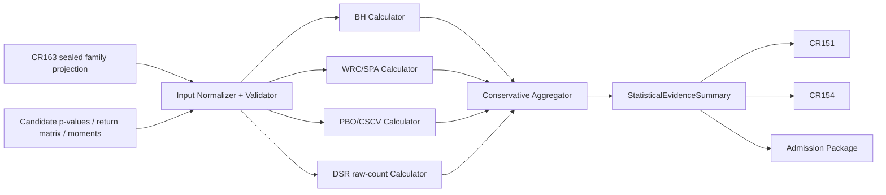

# 高层设计（HLD）：CR164 Multiple-Testing / PBO / DSR Computable Evidence

## 修订记录

| 版本 | 日期 | 修订人 | 变更要点 |
|---|---|---|---|
| 0.1 | 2026-07-12 | host-orchestrator inline meta-se-critical | 冻结四方法架构、输入与 evidence contract、fixed-window stationary bootstrap、raw-count DSR、disagreement lattice、consumer 集成及五 Story 输入。 |
| 0.2 | 2026-07-12 | host-orchestrator | 回填 CP3 用户批准 DQ-001..004；允许进入 CP4/CP5 设计，不授权实现。 |

## 1. 问题定义、目标与边界

CR161 已建立统计 evidence 的 typed availability/claim ceiling，CR163 已提供 sealed experiment-family lineage 与 raw trial count，但系统仍缺少可复跑的 BH、WRC/SPA、PBO/CSCV、DSR producer。CR164 要在不改变 family 事实、不伪造 effective trial count、不创建平行 admission gate 的前提下，形成可独立验证的 computable evidence。

### 量化成功标准

| 目标 | 度量 |
|---|---|
| 方法输入完整性 | selected-method required-input coverage=100% |
| lineage 绑定 | family/ref/hash/raw-count binding=100%；count difference=0 |
| fail-closed | 枚举 negative fixtures 命中率=100% |
| 确定性 | 同 fixture 10 runs → 1 summary hash |
| 证据完整性 | orphan method refs=0 |
| consumer 集成 | UC-58 + UC-59 compatibility + UC-60 compatibility=3/3 |
| 回归与权限 | CR155=1/1 blocked；每项 forbidden operation=0；overclaim=0 |

### 非目标与相邻对象边界

- CR163 lineage owns family membership/ref/hash/raw count；CR164 只读，不能补写、缩小或修复 lineage。
- `anomaly_multiple_testing.py` 的现有 normal-approximation BH helper 是可复用候选，不自动成为 CR164 provenance-complete producer；其 `bonferroni OR BH` 语义不能直接等同最终 no-OR-pass admission。
- CR151/CR154/admission package 继续拥有 threshold/policy/overall admission；CR164 只产 typed evidence/projection。
- effective-trial estimator、real ML/event adapters、历史/真实研究重算、runtime/data/provider/NAS/broker/trading 均不在范围。
- CP3 只批准设计；CP5 前不实现源代码或测试。

### 关键假设与缺失信息

当前无 blocking 缺失信息。精确统计公式版本、field types、文件 owner 和 fixture 样本由 Feature design/LLD 在本 HLD 约束内细化；不得改变 CP2 minima、claim ceiling 或授权边界。

## 2. Architecture Gray Areas 与 advisor input

| AGA | 问题 | 架构影响 | canonical refs | 推荐 |
|---|---|---|---|---|
| AGA-164-01 | 单体、独立 calculator 或插件 registry | 模块 owner、测试隔离、未来扩展 | REQ-001/003/007 | envelope + 四个 pure calculators |
| AGA-164-02 | WRC/SPA block length 自动还是固定 | 确定性、方法 provenance、实现复杂度 | DO-CR164-002 | fixed_window MVP |
| AGA-164-03 | DSR raw/effective count 如何表达 | schema 与 claim overreach | REQ-008 / DO-001 | 强制 raw mode + effective unavailable |
| AGA-164-04 | 方法冲突如何聚合 | admission correctness 与 reason codes | REQ-006 / DO-003 | conservative severity lattice |

| Option | Pros | Cons | Impact Surface | Recommendation | Assumptions / When to switch |
|---|---|---|---|---|---|
| Method-neutral envelope + pure calculators | contract 单一、方法可独测、无 runtime registry | 需显式四方法 adapter | schema/modules/tests/consumers | 推荐 | 方法集合固定；扩展显著时评审 registry |
| 单体 calculator | 文件少 | 强耦合、难隔离失败与 provenance | maintainability/verification | 不推荐 | 仅一次性原型才可考虑 |
| Dynamic plugin registry | 扩展强 | 引入发现、版本和安全表面 | runtime/security/deploy | 暂缓 | 第三方方法或多包扩展出现时 |
| Fixed-window stationary bootstrap | 参数显式、10-run 可复跑、易审计 | 使用者需选择 window | WRC/SPA/config/tests/docs | 推荐 | 当前 fixture/static；自动 selector 被独立验证后切换 |
| Automatic block selector | 少一个手工参数 | 需冻结具体算法/版本，边界复杂 | statistical correctness | 后续候选 | 新 ADR + reference fixtures + independent CP7 |
| Severity lattice | 完全符合 no-OR-pass、reason 清晰 | unavailable 会保守阻断 claim | consumer/policy | 推荐 | CP2 claim ceiling 不变 |
| OR/多数票 | 表面可用率高 | 可由一个 PASS 覆盖关键失败 | admission risk | 禁止 | 只有产品范围重开 CP2 才能讨论 |

方案形成输入来自 CP2 4/4 已确认 SGQ、9 项 requirements、13 个场景与现有 source contracts。因用户禁止子 Agent，本轮没有伪造 reviewer lanes；Host Orchestrator 以内联 meta-se-critical 形成设计，正式架构取舍全部进入 CP3 人工门。

Deferred：automatic block selector、effective-trial estimator、real ML/event adapters、real research recomputation；各自需新的可验证设计/授权条件。

## 3. 候选架构方案对比

### A（推荐）：Typed Evidence Pipeline

先建立 sealed-identity-bound input envelope；四个 pure calculator 独立输出统一 MethodEvidence；单一 conservative aggregator 生成 summary；adapters 投影到既有 consumers。

### B：Single Admission Calculator

一个模块完成输入解析、四方法计算与最终判定。代码入口较少，但任何方法变化都会影响整体，难证明 per-method unavailable/reason/provenance，且容易把计算与 admission policy 混合。

### C：Plugin Registry + Artifact Store

方法通过 registry 动态发现并写统一 store。扩展性最好，但当前仅四个固定方法，增加 runtime discovery、version compatibility、storage migration 与权限面。

| 维度 | A Typed pipeline | B Monolith | C Plugin/store |
|---|---|---|---|
| CP2 意图匹配 | 高 | 中 | 高 |
| fail-closed 可证明性 | 高 | 中 | 高 |
| per-method provenance | 高 | 中 | 高 |
| 实现/部署复杂度 | 中 | 中 | 高 |
| 当前授权适配 | 高 | 高 | 低 |
| 推荐 | 是 | 否 | 暂缓 |

## 4. 推荐架构与拆分判定

复杂度为 `complex`：9 requirements、13 scenarios、四种方法、三 consumer surfaces 和五个 outcome candidates。HLD 拆分检查结论为保持单份：所有部分共享同一 input envelope、evidence status model、claim ceiling 和 aggregator；五 Story 强依赖，拆分会造成双向 schema/ADR 引用。Blueprint/Domain/Dependency 是同一核心产物的配套视图。

## 5. 公共 Contract Freeze

### StatisticalEvidenceInput

必须含 schema/version、family ref/hash、raw trial count、candidate ids 和 membership hash；按 method 可选携带 p-values、aligned return matrix/benchmark、CSCV inputs、Sharpe/sample/skew/kurtosis。Normalizer 不推断缺失 family、不删除候选、不读取生产数据。

### MethodEvidence

| 字段组 | 必需内容 |
|---|---|
| identity | schema_version、method、evidence_id/ref、input_hash、config_hash |
| availability | `pass/fail/typed_unavailable/blocked`、reason_codes |
| lineage | family_ref/hash、raw_trial_count、candidate_count/membership hash |
| method config | alpha/null/benchmark 或 split/bootstrap/DSR mode，按方法完整记录 |
| result | 有限、定义域内的 p/q/PBO/DSR 与 policy decision |
| provenance | calculator/schema version、seed、replications、block window、split ids 等 |
| limitation | effective-count unavailable、fixture/static、非 runtime/admission authorization |

### WRC/SPA

MVP 固定 `stationary_bootstrap + fixed_window`。`block_length` 必须为正整数；seed、replication count、benchmark/null、aligned return matrix identity 全部入 config/input hash。automatic selector 是 deferred，不得通过默认参数暗中启用。

### PBO/CSCV

至少 4 candidate、至少 4 valid combinatorial splits；每个 split train/test 非空，split identity 稳定，ranking/loss definition 明确。invalid/duplicate/leaky split 为 blocked；数量不足且无冲突为 typed_unavailable。

### DSR

强制 `dsr_input_method=raw_trial_count`，raw count 至少 2，sample_length≥30，finite Sharpe/skew/kurtosis/returns，variance>0。`effective_trial_count`、ref、method 为空且 availability typed_unavailable。raw-count DSR present 不等于 effective-count claim 或 overall admission-ready。

### Aggregation decision table

| Mandatory evidence states | Final claim state | Reason |
|---|---|---|
| 任一 BLOCKED | BLOCKED | `method_disagreement_conservative_block` + child reasons |
| 无 BLOCKED，任一 FAIL | FAIL | `method_policy_failed` |
| 无 BLOCKED/FAIL，任一 TYPED_UNAVAILABLE | TYPED_UNAVAILABLE | `mandatory_method_unavailable` |
| 全部 PASS 且 refs/hash 完整 | PASS | `all_mandatory_methods_passed` |
| evidence ref orphan/missing | BLOCKED | `method_evidence_ref_missing` |

claim-specific mandatory set 必须写入 summary，不能用动态“可用方法集合”缩小分母。

## 6. 模块职责与集成契约

| 模块 | 职责 | 输入 → 输出 | 失败/降级 | 调用方改动 |
|---|---|---|---|---|
| Input contracts/validator | normalization、identity/count/membership/sufficiency | lineage + payload → validated input/status | absent unavailable；conflict blocked | producers/fixtures 提供显式 method inputs |
| BH calculator | BH q-values/policy | p-values → MethodEvidence | invalid p blocked；不足 unavailable | 不直接复用旧 helper 的 OR-pass summary |
| WRC/SPA calculator | corrected resampling result | aligned returns/config → MethodEvidence | config/shape conflict blocked | 显式 window/seed/benchmark |
| PBO/CSCV calculator | split/rank/PBO | CSCV input → MethodEvidence | invalid/leaky split blocked | 稳定 split ids |
| DSR calculator | raw-count mode DSR | moments/raw lineage → MethodEvidence | effective stays unavailable | 禁止 raw→effective alias |
| Aggregator | worst-state merge、summary hash | four evidence refs → Summary | orphan/block/fail/unavailable | consumers 只读 summary projection |
| Consumer adapters | 3/3 projections | Summary → existing contracts | 不能改善现有更差状态 | UC-58 real integration；59/60 compatibility-only |

调用顺序固定：lineage validation → input validation → method calculators → evidence validation → aggregate → consumer projection。任何失败不允许绕过到 consumer。

## 7. Use Case → Architecture Traceability

| Use Case / Req | 架构组件 | 失败路径 | 验证 |
|---|---|---|---|
| UC-58 / REQ-001..005 | input + four calculators | minima、NaN/Inf、hash/count mismatch fail closed | P01/N01/B01/F01 |
| UC-58 / REQ-006..008 | aggregator + DSR ceiling | disagreement、effective required、orphan refs blocked/unavailable | disagreement/non-alias fixtures |
| UC-59/60 / REQ-007/009 | compatibility projections | missing same sealed inputs fail closed | 3/3 projection |
| REQ-009 | verifier/authorization | CR155 cannot upgrade；forbidden operations remain zero | regression/permission fixtures |

Coverage：9/9 requirements、13/13 scenarios、10/10 QAC architecture mappings。

## 8. 关键场景模拟

| ID | 场景 | 执行路径 | 预期 | 结果 |
|---|---|---|---|---|
| SIM-164-01 | complete sealed family + all inputs | validate→4 calculators→aggregate→3 projections | four PASS evidence and claim PASS only when mandatory set all PASS | PASS |
| SIM-164-02 | BH PASS、PBO FAIL | calculators→lattice | final FAIL；BH 不覆盖 PBO | PASS |
| SIM-164-03 | DSR raw evidence present but consumer requires effective count | DSR→summary→CR154 | DSR method evidence 可 present；effective claim remains typed_unavailable/blocked per consumer | PASS |
| SIM-164-04 | family hash/count mismatch or NaN | input validator | BLOCKED before calculator/consumer | PASS |
| SIM-164-05 | same fixture rerun 10 times | canonical config/input/evidence/summary | 1 summary hash；orphan refs 0 | PASS |
| SIM-164-06 | CR155 or ML/event lacking inputs | compatibility projection | CR155 blocked；ML/event fail closed，不创建 adapter output | PASS |

## 9. 非功能设计

| 特征 | 目标 | 手段 | 验证 |
|---|---|---|---|
| Correctness | domain/count/split rules 100% | typed validation + pure functions | positive/negative/boundary fixtures |
| Determinism | 10→1 hash | explicit seed/window/split ids + canonical serialization | repeated fixture |
| Integrity | mismatch/orphan=0 | refs/hash/membership binding | tamper/orphan tests |
| Security | forbidden operations each 0 | no runtime/data/network adapters | static authorization test |
| Maintainability | DAG cycle=0；one owner per object | calculator/envelope/aggregator separation | dependency check |
| Compatibility | consumer projections 3/3 | thin adapters to existing contracts | contract tests |

## 10. 风险、回退与切换

| Risk | 影响 | 应对 | 触发/回退 |
|---|---|---|---|
| R-METHOD-DRIFT | 方法名相同但参数/公式漂移 | schema/calculator/config version + golden fixture | hash/version mismatch 阻断 |
| R-BOOTSTRAP | window 选择造成结果敏感 | fixed explicit window + provenance | 需 automatic 时新 ADR/验证 |
| R-PBO-LEAK | split 重叠/后验选择 | stable CSCV split contract | invalid split blocked |
| R-DSR-ALIAS | raw 冒充 effective | schema hard separation | 任一 alias CP7 FAIL |
| R-OR-PASS | 单方法覆盖失败 | severity lattice | scope 修改必须回 CP2 |
| R-LEGACY-BH | 旧 helper normal approximation/OR semantics 被误用 | adapter 明确 provenance/不直接复用 final flag | 不满足 contract 则新实现/隔离 |
| R-RUNTIME | 设计演变成真实批次 | authorization counters | 任一非 0 BLOCKED |

Rollback（未来实现后）：停止 CR164 projection，既有 consumers 回到 typed_unavailable/blocked；不修改或删除 CR163 lineage，也不将旧 evidence 解释为 effective-count proof。

## 11. 五 Story CP4 输入与落地顺序

| Story | Outcome | 依赖 | lld_policy | 完成准则 |
|---|---|---|---|---|
| S01 | contract + input/evidence validator | 无 | full-lld | schema/status/reasons/minima/count binding freeze |
| S02 | BH + WRC/SPA | S01 | full-lld | fixed-window stationary bootstrap + provenance |
| S03 | PBO/CSCV + DSR | S01 | full-lld | valid split contract + raw/effective non-alias |
| S04 | aggregator + existing consumers | S01-S03 | full-lld | decision table + 3/3 projection + no new gate |
| S05 | independent verification | S01-S04 | full-lld | QAC 10/10、13/13、CR155、permission zero |

建议 Wave 数=4：W1 S01；W2 S02/S03 并行（文件 owner 不重叠）；W3 S04；W4 S05。Story=5、Wave=4，和 Blueprint 一致。正式文件路径与 owner 由 CP4 冻结。

## 12. ADR、适用性与自审

ADR 见 `ARCHITECTURE-DECISION-MULTIPLE-TESTING-PBO-DSR-EVIDENCE.md`。推荐方案适用于固定四方法、repo-local Python、fixture/static 验证与既有 consumer contracts；若出现第三方方法、automatic selector、并发 artifact service、effective estimator 或真实数据运行，必须新 CR/ADR 并重新确认权限。

设计自审：内部一致性 PASS；量化目标 10/10；集成契约覆盖方向/时机/输入/输出/后续/降级/调用方修改；失败路径与 decision table 明确；理论框架分别来自 BH FDR、stationary bootstrap/WRC-SPA、CSCV/PBO、DSR，具体公式版本需在 LLD 与测试引用原始方法来源；Gotchas 已落实为风险 R-BOOTSTRAP/R-DSR-ALIAS/R-OR-PASS/R-LEGACY-BH。无 waiver，无 blocking open item，待 CP3 四项人工决策。

### 理论来源与实现边界

- Stationary bootstrap：Politis & Romano (1994), DOI `10.1080/01621459.1994.10476870`。该论文支持 resampling 方法来源，不自动决定本项目 block-length selector；因此 MVP 仍冻结显式 fixed window。
- White Reality Check：White (2000), DOI `10.1111/1468-0262.00152`；SPA：Hansen (2005), DOI `10.1198/073500105000000063`。
- DSR：Bailey & López de Prado, *The Deflated Sharpe Ratio* (2014 working-paper version)。
- CSCV/PBO 与 BH 的精确公式、tail/benchmark/ranking 方向、finite-sample convention 和 golden values 必须在 S02/S03 LLD 中逐项引用 primary source；HLD 不以方法名称代替算法规范。
