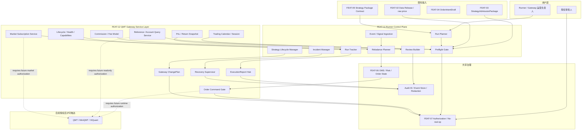

# 高层设计（HLD）：Runner / QMT Gateway Operational Control Plane

> 本 HLD 基于 `process/USE-CASES.md` v1.16 confirmed baseline。本文只冻结 solution-design、功能边界、能力地图、模块职责、关键流程、风险和 ADR 候选；CP3 approve 不自动授权 runtime、QMT / MiniQMT / XtQuant、凭据、账户、行情、订单读取、submit/cancel、simulation/live、NAS、provider/lake/catalog 或 Git remote 写入。后续如确有验证必要，必须按动作范围走独立 `runtime_authorization` gate。

## 修订记录

| 版本 | 日期 | 修订人 | 变更要点 |
|---|---|---|---|
| 1.0 | 2026-06-24 | host-orchestrator | 初版 HLD，收敛 CR138 Architecture Gray Areas，推荐独立 Runner Control Plane + QMT Gateway Service Layer，补齐边界、能力、领域对象、关键流程、NFR、风险、ADR 和 CP3 决策项 |
| 1.1 | 2026-06-24 | host-orchestrator | 根据用户 CP3 反馈修订：长期 HLD 采用功能域命名；Gateway P0 收敛为 REST-only；runtime policy 改为按需授权；补齐交易日历、佣金 / 费用模型和收益 / PnL 查询能力 |

## 1. 问题定义

### 1.1 问题陈述

CR133..CR137 已把 offline strategy runner core 做到 RunSpec、RunResult、evidence index、artifact bundle、bundle validation 和 run registry，但这些仍是离线小切片。用户已经明确纠偏：Runner / QMT Gateway 的 use-case 必须描述真实运营中如何运行、观察、暂停、恢复、复盘和变更策略，而不是继续只写 bundle / registry / validation 规格。若后续直接在 offline runner 上堆 runtime 或让 Gateway 承担策略逻辑，会造成 Runner 直连 xtquant、Gateway 过度业务化、授权门禁混乱、订单 / 行情 / 审计不可分和真实交易误授权风险。

### 1.2 核心价值

本设计把运营层拆成两个独立但通过稳定合同衔接的产物：

- Runner Control Plane：面向运营负责人，负责策略运行计划、盘前确认、执行跟踪、事件/信号接入、组合再平衡、盘中总览、run 证据查询、盘后复盘、异常恢复和策略生命周期变更。
- QMT Gateway Service Layer：面向 QMT / MiniQMT / XtQuant 触达，负责启动、健康、capabilities、会话、只读查询、行情订阅、订单动作入口、回报流、降级恢复、审计、配置变更和协议面。

### 1.3 目标

| 优先级 | 目标 | 度量方式 |
|---|---|---|
| P0 | 覆盖 CR138 新增运营 use-case | UC-33..UC-50 在 §6 traceability 中覆盖率为 18/18 |
| P0 | Runner / Gateway 边界不混淆 | HLD、BLUEPRINT、DEPENDENCY-MAP 中至少列出 5 条禁止依赖；Runner 直接 xtquant 触达次数目标为 0 |
| P0 | 建立按需授权 runtime 边界 | HLD、CP3 review、context 中声明 `cp3_runtime_auto_authorized=false`；后续 readonly / market / account / order 验证必须有独立授权记录 |
| P0 | 形成可拆 Story 的能力地图 | Runner、Gateway、Safety、OMS/Audit 至少 4 个能力组；预计 Story 8 个，Wave 4 个 |
| P1 | 吸收外部研究报告经验 | lite / BulletTrade / EasyXT / quant-qmt-proxy / qmt-bridge 的关键经验均映射到模块或风险，覆盖 5/5 |
| P1 | 支撑故障恢复与审计 | 至少定义 RunState、GatewayHealth、OrderIntent、ExecutionReport、AuditRecord、ChangePlan 6 类核心对象 |

### 1.4 成功标准

- [ ] UC-33..UC-50 全部映射到模块、关键流程、失败路径和验证方式。
- [ ] Runner 只产生 RunPlan、RunnerCommand、OrderIntentDraft / OrderIntent、RunEvidence、ReviewSummary，不导入或直接调用 QMT / MiniQMT / XtQuant。
- [ ] Gateway 只执行服务生命周期、capabilities、session、query、subscription、order adapter、execution report、recovery、audit、change plan，不决定策略信号、目标组合或调仓逻辑。
- [ ] 任何 account / quote / order / submit / cancel / simulation / live 真实执行都需要独立 runtime_authorization gate；缺授权时输出 blocked，不返回伪成功；确有必要验证时可按 action scope、运行窗口、脱敏和回滚条件单独授权。
- [ ] HLD 至少包含 4 个 Architecture Gray Areas、2 个以上候选方案、3 个关键场景模拟、7 个 ADR 候选和 5 个 CP3 待决策项。

### 1.5 约束

| 类型 | 约束内容 |
|---|---|
| 产品 | CR138 是 operational use-case 到 solution-design 的桥，不交付具体策略、不进入实现、不重写 UC-01..UC-32。 |
| 平台 | QMT / MiniQMT / XtQuant 仍位于 Windows 交易节点；Linux / WSL 研究节点不得直接导入 xtquant。 |
| 安全 | 不读取 `.env`、token、账号、资金、持仓、委托、成交、session、cookie、私钥或原始日志。 |
| 运行 | 本 CP3 不启动 gateway、不绑定端口、不连接 QMT、不订阅行情、不查询账户、不下单撤单；后续验证如需要运行，只能通过独立授权门禁按需打开最小动作集合。 |
| 数据 | Market data lake、research archive、broker lake、Runner evidence 和 Gateway audit 必须分属不同事实域。 |
| 门控 | CP3 approve 只允许进入 Story planning；CP5 前不得实现；真实运行另起 runtime_authorization gate。 |

### 1.6 非目标（Out of Scope）

- 不把 CR138 HLD 写成真实 QMT gateway 实现设计或服务启动手册。
- 不修改 `trading/strategy_runner/*`、`pyproject.toml`、`uv.lock`、安装脚本或测试代码。
- 不把 QMT terminal target、MiniQMT runner target 或 offline runner core 合并成一个 runtime。
- 不做外部项目 clone / install / run / 源码迁移；两份研究报告作为静态输入。
- 不支持多券商、多柜台、FIX、mTLS、多实例主备或机构级审计落地；这些作为后续 CR。

### 1.7 关键假设

- `process/USE-CASES.md` v1.16 已由用户 approve，可作为 CP3 HLD 输入。
- CR020 / CR019 的只读 gateway 和 C/S bridge 历史设计可作为架构来源，但 CR138 不继承其 runtime 授权。
- CR046 的 FEAT-09 仍负责策略包和双目标交付框架；CR138 只定义运营控制面和 Gateway 服务层。
- 外部研究报告的结论以“设计启发”形式使用，不作为当前项目已验证能力。

### 1.8 缺失信息

| 优先级 | 缺失信息 | 影响范围 | 决策所需时限 |
|---|---|---|---|
| REQUIRED | 首轮 Story 是否同时覆盖 Runner 和 Gateway，还是拆为 Runner-only / Gateway-only | CP4 Story Map、Wave、文件 owner | CP3 人工确认 |
| REQUIRED | Gateway 北向协议 P0 是否 REST-only，实时推送和 SDK 协议后置 | Gateway HLD、测试策略 | CP3 人工确认 |
| REQUIRED | Runner 与 Gateway 共享事件模型是否使用统一 Audit ID / Event ID | 追踪、审计、故障恢复 | CP3 人工确认 |
| REQUIRED | 交易日历、佣金 / 费用模型、收益 / PnL 查询如何分配本地参考数据和账户只读授权 | Gateway query service、Runner preflight、复盘 | CP3 人工确认 |
| OPTIONAL | 外部源码是否需要 clone 到临时目录做 Spike | 进一步事实核查 | HLD 评审后 |

## 2. 架构灰区与方案形成记录

**CP3 讨论日志**：`process/discussions/CP3-HLD-DISCUSSION-LOG.md`  
**CP3 讨论恢复点**：`process/checks/CP3-DISCUSSION-CHECKPOINT.json`

### 2.1 Architecture Gray Areas

| 灰区 ID | 关键问题 | 为什么会影响架构 | 影响面 | canonical refs | 状态 |
|---|---|---|---|---|---|
| AGA-138-01 | Runner Control Plane 是否独立于 offline runner core？ | 决定后续是运营控制面，还是继续离线 artifact 小能力。 | Feature、模块、测试、Story | UC-33..UC-43、CR137 handoff | resolved |
| AGA-138-02 | QMT Gateway 是只读接口、target，还是服务化运行层？ | 决定是否覆盖 service lifecycle、subscriptions、execution reports、recovery、audit。 | Gateway 模块、协议、安全 | UC-44..UC-50、UC-16/17 | resolved |
| AGA-138-03 | Runner 与 Gateway 如何交互？ | 直接 xtquant 调用会破坏授权；纯文件交换不能支撑盘中事件。 | 接口、失败路径、审计 | UC-35..UC-49、HLD-QMT-TRADING | resolved |
| AGA-138-04 | CP3 approval 与后续按需 runtime 授权如何区分？ | 影响安全和门禁语义；CP3 approval 不得变成 blanket runtime 授权，但后续必要验证不能被永久封死。 | 安全、发布、验证声明 | 用户 CP3 反馈、DQ-CP2-CR138-03 | resolved |
| AGA-138-06 | Gateway P0 是否需要 WebSocket / gRPC / FIX？ | 协议选择会直接影响服务复杂度、fixture 形态、客户端 SDK 和实时性承诺。 | Gateway 模块、测试、运维、文档 | 用户 CP3 反馈 | resolved |
| AGA-138-05 | 单份 HLD 还是拆分 HLD？ | 两个产物可拆，但共享事件、授权、审计，过早拆会重复 ADR。 | 文档、Story、评审 | HLD 拆分原则 | resolved-with-risk |

### 2.2 Advisor Table

| Option | Pros | Cons | Impact Surface | Recommendation | Assumptions / When to switch |
|---|---|---|---|---|---|
| A. 独立 Runner Control Plane + QMT Gateway Service Layer | 边界清晰；Runner 不直连 xtquant；Gateway 不决定策略；能覆盖 UC-33..50 | 需要更多领域对象和 Story | Feature / Domain / Dependency / HLD / ADR | 推荐 | 若后续只做 offline reporting，可缩小为 Runner-only。 |
| B. 扩展 offline `strategy-runner-core` 直接接 Gateway / xtquant | 表面复用多 | 混淆 offline artifacts 与 online operations；安全风险高 | 源码、测试、安全 | 不推荐 | 仅在用户缩回 offline-only 范围时切换。 |
| C. Gateway 同时调度策略和交易 | 单机 PoC 简单 | Gateway 业务化，策略生命周期不可测试 | 架构、维护 | 不推荐 | 仅在采用完整交易平台替代 Runner 时重评估。 |
| D. 只做只读 Gateway + Runner 观察面 | 风险最低 | UC-47/48 订单回报和恢复建模不足 | 范围、测试 | 条件备选 | 用户要求缩小范围时切换。 |

### 2.3 方案形成输入与事后审查区分

| 类型 | 来源 | 影响的 HLD 章节 | 处理结果 | 说明 |
|---|---|---|---|---|
| 方案形成输入 | lane-product | §1、§6、§7、§15 | adopted | use-case 必须覆盖运营路径，不回到 RunSpec 小切片。 |
| 方案形成输入 | lane-architecture | §3、§4、§8、§9、§14 | adopted | Runner / Gateway / OMS / FEAT-09 分层。 |
| 方案形成输入 | lane-quality | §12、§13、§18 | adopted | CP3 不自动授权、后续按需授权、失败路径和验证声明边界。 |
| 方案形成输入 | lane-docs | §1、§9、§17 | adopted | 显式说明与历史 HLD / Feature 的关系。 |
| HLD 后评审意见 | CP3 review | 待用户确认 | pending | 不倒填为前置讨论。 |

## 3. 候选架构方案对比

### 方案 A：独立 Runner Control Plane + QMT Gateway Service Layer

| 维度 | 评估 |
|---|---|
| 核心思路 | Runner 作为策略运营控制面；Gateway 作为受控 QMT 服务层；二者通过命令、事件、授权记录、幂等键和审计 ID 衔接。 |
| 优点 | 覆盖 UC-33..UC-50；职责清晰；安全门控可分层；吸收外部报告中的 runtime / guard / recovery / protocol 经验。 |
| 缺点 | 设计复杂度高；需要 Story planning 拆分；首轮不能直接运行。 |
| 复杂度 | high |
| 实施成本 | 预计 8 个 Story、4 个 Wave，CP5 后分批实现。 |
| 可扩展性 | 可扩展到只读、simulation、live、gRPC、FIX、多实例，但必须逐项授权。 |
| 风险 | 过度设计和 runtime 误授权；通过 deny-default 和分阶段落地控制。 |
| 适用前提 | 用户接受先冻结运营控制面和 Gateway 服务层；CP3 不直接执行 runtime，但后续可按需走授权门禁做验证。 |

### 方案 B：offline runner core 扩展为 runtime runner

| 维度 | 评估 |
|---|---|
| 核心思路 | 在现有 `strategy-runner-core` 增加 Gateway client、事件跟踪和运行态视图。 |
| 优点 | 短期文件少，复用现有 artifact / registry。 |
| 缺点 | 把 offline artifact bundle 与 online operation 混在一起；容易把 registry pass 误当 runtime pass。 |
| 复杂度 | medium |
| 实施成本 | 看似低，但后续安全和测试返工高。 |
| 可扩展性 | 低到中；难以独立扩展 Gateway。 |
| 风险 | Runner 直连 QMT、策略层绕过 OMS / risk / Gateway。 |
| 适用前提 | CR138 缩小为 offline-only reporting。 |

### 方案 C：Gateway-centered strategy scheduler

| 维度 | 评估 |
|---|---|
| 核心思路 | Gateway 既接 QMT，也调度策略、维护组合和运行计划。 |
| 优点 | 单机 PoC 直观。 |
| 缺点 | Gateway 承担策略逻辑，违背 CP2 边界；后续测试和审计不可分。 |
| 复杂度 | high |
| 实施成本 | 初始高，长期维护高。 |
| 可扩展性 | 中；容易变成不可分巨型服务。 |
| 风险 | 策略逻辑与底层 QMT 会话耦合，故障影响面大。 |
| 适用前提 | 未来明确采购或建设完整交易平台。 |

### 3.4 方案对比矩阵

| 维度 | 方案 A | 方案 B | 方案 C |
|---|---|---|---|
| 用户场景覆盖 | 18/18 | 9/18 | 14/18 |
| Runner / Gateway 边界 | 清晰 | 模糊 | 模糊 |
| 安全授权隔离 | 强 | 弱 | 中 |
| 外部报告经验吸收 | 高 | 中 | 中 |
| Story 可拆分性 | 高 | 中 | 低 |
| 首轮实现速度 | 中 | 高 | 低 |
| 长期维护 | 高 | 中低 | 中低 |

**推荐方案**：方案 A。

## 4. 推荐方案总览

**复杂度模式**：`complex`

| 判定维度 | 依据 | 结论 |
|---|---|---|
| 需求规模 | 18 个新增 UC + 12 个旧 UC 约束来源 | complex |
| 角色数量 | P-05、P-07、P-08、P-09 均涉及 | complex |
| 状态流转 | Run、Gateway、Order、Subscription、Recovery、ChangePlan 多状态机 | complex |
| 平台适配 | Linux / WSL research + Windows QMT node | complex |
| Story 拆解 | 预计 8 Story / 4 Wave | complex |

**系统核心思路**：Runner Control Plane 只处理“策略运营意图和可观察性”；QMT Gateway Service Layer 只处理“受控触达 QMT 的服务生命周期和适配”。OMS / Risk / Authorization 作为共享治理边界，防止 Runner 或 Gateway 单独升级为真实交易权限。

**关键架构风格**：分层架构 + 事件驱动 + adapter boundary + fail-closed authorization gate。

**核心能力边界**：

- 做：run plan、preflight、event/signal ingestion、rebalance planning、run tracking、evidence query、review、incident recovery、strategy lifecycle、gateway health/capabilities、session/query/subscription/order report/recovery/audit/change plan。
- 不做：真实 QMT 运行、凭据读取、账户 / 行情 / 订单真实查询、下单撤单、真实 broker lake 写入、provider/lake/catalog 写入、源码实现。

**产物形态**：

- 新增 Feature：FEAT-11 Runner Control Plane、FEAT-12 QMT Gateway Service Layer。
- 共享治理：FEAT-07 Safety / Authorization、FEAT-06 OMS / Risk / Broker Lake、FEAT-08 Runbook。
- 首轮预计 Story：8 个；Wave：4 个。

## 5. 适用性矩阵

| 适用性维度 | 当前项目判断 | 推荐方案如何适配 | 不适配信号 | When to switch |
|---|---|---|---|---|
| 用户目标 | 从离线 runner 小能力转向真实运营 baseline | 用 Runner/Gateway 双层承接运营路径 | 用户只要 artifact reporting | 切到方案 B 的缩小版 |
| 项目成熟度 | 已有研究、数据湖、QMT foundation、offline runner、策略包合同 | 复用旧对象作为输入，不覆盖历史基线 | 旧 HLD / ADR 与新 HLD 冲突 | 回退到 CR138 CP2 baseline 重评 |
| 认知负担 | 用户需要知道怎么运行、怎么看、怎么停、怎么恢复 | 按活动簇组织功能和 Story | HLD 被读成运行手册 | 文档中强化 design-only / no-runtime |
| 验证条件 | 本轮只做静态 / 文档 / fixture 级验证 | 明确 CP3 不跑 runtime；后续 CP5/CP7 可按需申请最小 runtime authorization | 用户要求真实验证 | 发起 runtime_authorization gate，限定动作、窗口、脱敏和回滚 |
| 回退成本 | 不改源码，回退为文档层撤销 | CR 专属 HLD + 蓝图增量可回滚 | 已进入实现 | 停止 CP5，回退 CP3 |

### 优化 / 牺牲 / 切换条件

| 方案选择 | 优化了什么 | 牺牲了什么 | 接受理由 | 切换条件 |
|---|---|---|---|---|
| 方案 A | 边界、安全、可验证性、长期演进 | 首轮设计复杂度、Story 数 | CR138 触及运行治理和真实交易误授权风险，复杂度值得显式化 | 用户缩小到 Runner-only 或 Gateway-only |

## 6. Use Case → Architecture Traceability

| Use Case | 支撑模块 / 组件 | 关键流程 | 异常 / 失败路径 | 验证方式 | 备注 |
|---|---|---|---|---|---|
| UC-33 | Run Planner、Strategy Admission Reader | FLOW-R1 | admission missing -> blocked | HLD trace + future fixture | 继承 UC-15 / UC-32 |
| UC-34 | Preflight Gate、Authorization View、GatewayHealth Reader | FLOW-R2 | gate fail -> blocked / manual review | static scenario | 不授权真实查询 |
| UC-35 | Run Tracker、Event Store、ExecutionReport Consumer | FLOW-R3 | report missing / stale -> degraded | event replay fixture | 消费 Gateway 事件 |
| UC-36 | Event Trigger Router | FLOW-R4 | duplicate event -> idempotent skip | fixture | 不直接下单 |
| UC-37 | Signal Ingestion、Idempotency Service | FLOW-R4 | invalid signal -> reject | fixture | 参考 lite 信号入口 |
| UC-38 | Rebalance Planner、OrderIntent Draft Builder | FLOW-R5 | target/current mismatch -> manual review | fixture | 参考 BulletTrade portfolio |
| UC-39 | Ops Dashboard / CLI Summary | FLOW-R6 | stale heartbeat -> degraded | docs + future test | P0 可先 CLI |
| UC-40 | Evidence Query、Audit Linker | FLOW-R7 | raw sensitive data request -> redacted / blocked | docs guardrail | 不复制原始日志 |
| UC-41 | Review Builder、Issue / CR Router | FLOW-R8 | unresolved incident -> follow-up item | review fixture | 盘后闭环 |
| UC-42 | Incident Manager、Recovery Plan | FLOW-R9 | unknown order state -> manual takeover | scenario simulation | 参考 WAL / guard |
| UC-43 | Strategy Lifecycle Manager | FLOW-R10 | rollback target missing -> blocked | static validation | 发布 / 暂停 / 回滚 |
| UC-44 | Gateway Lifecycle、Health、Capabilities | FLOW-G1 | session unavailable -> blocked | static + future mock | health 不等于授权 |
| UC-45 | Reference / Account Query Service、Read Scope Gate | FLOW-G2 | account scope no auth -> blocked；calendar local source missing -> unavailable | docs + future fixture | 交易日历可本地参考；账户、佣金、收益查询需授权 |
| UC-46 | Subscription Manager、Market Cache | FLOW-G3 | subscription fail -> degraded / recover | event replay fixture | P0 通过 REST 管理订阅和拉取事件；实时推送后置 |
| UC-47 | Order Gateway、OMS / Risk Adapter、ExecutionReport Hub | FLOW-G4 | no auth / risk fail -> hard reject | static scenario | 不提交真实订单 |
| UC-48 | GatewayRecovery Supervisor | FLOW-G5 | QMT state damaged -> unavailable / manual restart | scenario simulation | qmt-bridge 风险 |
| UC-49 | Audit Search、Trace Correlator | FLOW-G6 | sensitive field -> redacted | docs guardrail | request_id/run_id 贯通 |
| UC-50 | ChangePlan、Compatibility Check、Rollback Plan | FLOW-G7 | no rollback -> reject change | static validation | 配置不含凭据 |

## 7. 关键场景模拟

| 模拟 ID | 场景 | 输入 / 前置条件 | 推荐架构执行路径 | 预期输出 | 失败 / 回退路径 | 结果 |
|---|---|---|---|---|---|---|
| SIM-138-01 | UC-33/34 多因子盘前运行 | StrategyAdmissionPackage、data release、target portfolio draft、no runtime auth | Run Planner -> Preflight Gate -> GatewayHealth Reader(blocked/no-auth) -> RunPlan | run_plan=ready_for_manual_review，runtime_actions=0 | admission 缺失或 health 不可读则 blocked | PASS |
| SIM-138-02 | UC-37/47 外部信号到订单意图 | signal event、strategy_id、idempotency_key、risk profile | Signal Ingestion -> Idempotency -> OrderIntent Builder -> OMS/Risk -> Gateway Order Gate(no-auth) | intent_draft / hard_reject(no authorization)，adapter_calls=0 | 重复信号 skip；risk fail hard block | PASS |
| SIM-138-03 | UC-46/48 行情订阅异常恢复 | subscription_id、symbols、GatewayHealth=degraded | Subscription Manager -> GatewayRecovery -> AuditRecord -> Runner degraded view | degraded_reason、recovery_plan、no resubscribe without auth | xtdata 崩溃则 unavailable + manual restart | PASS |
| SIM-138-04 | UC-42/49 未确认订单恢复 | run_id、order_intent_id、last_execution_report stale | Run Tracker -> Gateway audit query -> OMS unknown state -> Incident Manager | manual_takeover_required、audit_refs | 不自动重发订单，不解除 kill switch | PASS |

## 8. 系统架构图

## 9. 高层模块与职责划分

| 模块名称 | 类型 | 职责 | 输入 | 输出 | 依赖 |
|---|---|---|---|---|---|
| Run Planner | Service | 生成策略运行计划、运行窗口和候选动作 | strategy package、admission、data release | RunPlan | FEAT-09、FEAT-03、FEAT-02 |
| Preflight Gate | Service | 盘前检查 data/admission/auth/gateway readiness | RunPlan、GatewayHealth、AuthorizationRecord | PreflightResult | FEAT-07、FEAT-12 |
| Event / Signal Ingestion | Service | 接收事件或信号，校验幂等和 schema | signal/event | RunnerCommand | FEAT-11 |
| Rebalance Planner | Service | 计算目标组合与当前组合差异，生成 order intent draft | target/current portfolio | OrderIntentDraft | FEAT-04、FEAT-06 |
| Run Tracker | Service | 跟踪 run、orders、events、gateway 状态 | execution reports、health events | RunState、OpsSummary | FEAT-12、FEAT-06 |
| Evidence Query | Service | 查询单次 run 证据和审计链 | run_id、request_id | redacted evidence summary | FEAT-07、FEAT-12 |
| Review Builder | Service | 生成盘后复盘、issue 和 CR 候选 | RunState、AuditRecord | ReviewSummary | FEAT-08 |
| Incident Manager | Service | 异常识别、暂停、恢复、人工接管 | health、orders、events | IncidentRecord、RecoveryPlan | FEAT-06、FEAT-12 |
| Strategy Lifecycle Manager | Service | 策略参数、版本、发布、暂停、下线、回滚计划 | change request | StrategyChangePlan | FEAT-09、FEAT-07 |
| Gateway Lifecycle / Health | Service | 启动前检查、capabilities、session readiness、心跳 | config、runtime auth | GatewayHealth | FEAT-12 |
| Reference / Account Query Service | Gateway service | 交易日历、交易时段、账户摘要、持仓、订单、成交、佣金 / 费用模型、收益 / PnL 快照的统一查询入口 | query request、scope、authorization_ref | redacted query result / blocked / unavailable | FEAT-07 |
| Trading Calendar / Session Service | Gateway service | 提供交易日历、交易日、交易时段、节假日、盘前 / 盘中 / 盘后窗口；优先本地参考数据，必要时读取 QMT / vendor 日历 | date range、market、source preference | TradingCalendar、TradingWindow | FEAT-02、FEAT-07 |
| Commission / Fee Model Service | Gateway service | 查询或配置佣金、印花税、过户费、最低收费、滑点 / 费用估算；QMT 不可靠或不可得时以配置化 FeeSchedule 为事实源 | account scope、instrument type、fee schedule | CommissionSchedule、CostEstimate | FEAT-06、FEAT-07 |
| PnL / Return Snapshot Service | Gateway service | 查询账户级、策略级或 run 级收益快照；账户级必须授权并脱敏，run 级可由本地 evidence / fills 计算 | account scope、run_id、period | PnLSnapshot、ReturnSummary | FEAT-06、FEAT-11、FEAT-07 |
| Market Subscription Service | Gateway service | 订阅注册、缓存、回补、事件查询和状态拉取；P0 不承诺 WebSocket 推送 | subscription request | QuoteEvent / BarEvent / degraded | FEAT-12 |
| Order Command Gate | Gateway service | place/cancel 命令入口，执行 auth/risk/idempotency gate | OrderIntent、risk decision | OrderAck / hard reject | FEAT-06、FEAT-07 |
| ExecutionReport Hub | Gateway service | 订单回报和成交事件标准化广播 | broker callbacks | ExecutionReport | FEAT-06 |
| Recovery Supervisor | Gateway service | 连接异常、xtdata 崩溃、订阅失效后的降级恢复 | health timeline | RecoveryPlan | FEAT-12 |
| Gateway ChangePlan | Gateway service | 升级、回滚、配置变更 dry-run 和兼容性检查 | config diff | ChangePlan | FEAT-07、FEAT-08 |

**模块边界规则**：

- Runner 不导入 xtquant、不持有 QMT session、不发真实 query/order。
- Gateway 不读取策略源代码、不决定目标组合、不生成策略信号。
- OMS / Risk 是 order intent 到 adapter 的唯一治理层；Gateway command gate 不绕过 Risk。
- AuthorizationRecord 是所有账户只读、行情订阅、订单动作、账户收益、佣金查询等敏感动作的前置；CP3 approval 不生成 AuthorizationRecord，但后续验证可以按需申请最小授权。

## 10. 技术选型与理由

| 选型类别 | 选择 | 备选方案 | 选择理由 | 风险 |
|---|---|---|---|---|
| 架构风格 | 分层 + 事件驱动 + adapter boundary | 单体 runner；gateway-centered | 支撑运营、恢复、审计和授权隔离 | Story 数增加 |
| Runner 内核参考 | BulletTrade runtime/context + lite WAL/recovery + EasyXT 场景清单 | 单一项目照搬 | 三者分别覆盖事件、恢复、策略样例 | 需要自有合同归一化 |
| Gateway 参考 | quant-qmt-proxy 协议分层 + qmt-bridge 生命周期 / 串行化经验 | 直接采用某仓库 | 吸收服务边界和运行风险，不继承其完整协议面 | 当前不验证源码 |
| 北向协议 P0 | REST-only | REST + SSE / WebSocket；gRPC-first；FIX | REST 已覆盖同步查询、命令提交、订阅管理、事件拉取、审计查询和人工控制台；实时推送没有 P0 必要性 | 若出现亚秒级推送、UI 自动刷新或外部 SDK 强需求，另起协议 CR |
| 数据模型 | Pydantic/JSON schema 设计 | ad hoc dict；Protobuf-first | 便于 schema validation、fixture 和 REST contract | 实现阶段需版本治理 |
| 运行状态 | 本地事件/审计 store 设计，真实 broker lake 后置 | 只靠日志 | 可追踪 request_id/run_id/order_id | 当前不落真实 broker facts |
| 安全 | 按需 AuthorizationRecord + scope + no-real-op counters | health/capabilities 即授权；blanket deny | 既防止误运行，也允许必要验证走受控授权 | 增加人工门成本 |

## 11. 关键流程

### FLOW-R1：多因子日常调仓运行计划

1. 用户选择 strategy package / strategy version / data release / target date。
2. Run Planner 读取 StrategyAdmissionPackage 和 StrategyCoreContract 摘要。
3. Preflight Gate 检查 data release、admission、strategy status、authorization scope 和 GatewayHealth。
4. 若缺 runtime authorization，输出 `ready_for_manual_review` 或 `blocked_no_runtime_authorization`，不触达 Gateway runtime。
5. 写 RunPlan 和审计 ID。

### FLOW-R4：事件 / 信号接入到订单意图

1. Event / Signal Ingestion 接收外部信号或事件。
2. 校验 schema、strategy_id、idempotency_key、trading window。
3. Rebalance Planner 结合目标组合和当前状态生成 OrderIntentDraft。
4. OMS / Risk 对 intent 做 hard gate。
5. Gateway Order Command Gate 在无授权时返回 hard reject；有后续授权时才进入 adapter。

### FLOW-G3：行情订阅和恢复

1. Runner 或运维发起订阅请求。
2. Gateway 校验 scope、symbols、period、capabilities 和授权。
3. Subscription Manager 建立或复用底层订阅，写 SubscriptionRecord。
4. xtdata / gateway 异常时进入 degraded，暂停依赖行情的新动作。
5. Recovery Supervisor 恢复订阅、写 AuditRecord；P0 由 Runner 通过 REST 拉取 degraded / recovered event，实时推送作为后续增强。

### FLOW-G2：交易日历、佣金和收益查询

1. Runner 或运维发起 `query_type=calendar|commission|pnl|account|position|order|fill` 的查询请求。
2. Query Service 按 query_type 分流：交易日历优先读取本地参考日历；佣金优先读取配置化 FeeSchedule；收益 / PnL 可读取 run evidence 或账户只读快照。
3. 若请求触达账户、资金、持仓、成交、佣金账户配置或账户级收益，必须先校验 AuthorizationRecord、scope、运行窗口、脱敏策略和审计 ID。
4. 若 QMT / broker 不支持佣金或收益查询，返回 `unavailable_with_reason`，不得伪造真实 broker 结果；可提供基于 FeeSchedule 和本地成交证据的估算结果，并标注 `source=estimated`。
5. 输出 TradingCalendar、CommissionSchedule、CostEstimate、PnLSnapshot 或 redacted ReadonlyQueryResult；Runner 只消费摘要和引用，不保存敏感原文。

### FLOW-G5：连接异常后的降级与人工接管

1. Health 检测到 QMT unavailable、xtdata crash、execution report stale 或 heartbeat fail。
2. GatewayHealth 转为 DEGRADED / UNAVAILABLE。
3. Order Command Gate 阻断新交易动作；OMS 标记未确认订单进入 manual_review。
4. Recovery Supervisor 输出恢复计划；Incident Manager 生成人工接管项。
5. 未确认订单不得自动重发；kill switch 不自动解除。

## 12. 非功能需求设计

| 质量特征 | 设计目标 | 实现手段 | 验证方式 |
|---|---|---|---|
| 安全性 | 未授权真实操作计数为 0 | AuthorizationRecord、scope、no-real-op counters、deny-default | static guardrail、docs guardrail |
| 可靠性 | QMT 不可用时 fail fast / degraded，不悬挂 | GatewayHealth、Recovery Supervisor、timeout、cooldown | fault injection fixture |
| 一致性 | 每个 signal / intent / report 可幂等追踪 | idempotency_key、request_id、run_id、order_intent_id | event replay fixture |
| 可观察性 | 运营可按 run / request / order / subscription 查链路 | AuditRecord、Trace Correlator、redaction | audit query tests |
| 可维护性 | Runner / Gateway / OMS / Safety 分层职责稳定 | Feature boundary、Dependency Map、ADR | design review |
| 可扩展性 | REST-only P0，SSE/WebSocket/gRPC/FIX 后置 | protocol adapter boundary | future CR |
| 可回退性 | 策略和 Gateway 变更必须有 rollback plan | ChangePlan、StrategyChangePlan | static validation |

## 13. 主要风险与应对

| 风险 ID | 风险描述 | 概率 | 影响 | 应对策略 | 触发信号 |
|---|---|---|---|---|---|
| R-138-01 | CP3 HLD 被误读为 blanket runtime authorization | 中 | 高 | 所有产物写明 `cp3_runtime_auto_authorized=false`，后续验证必须按需授权 | 用户要求运行 / 查询 / 下单 |
| R-138-02 | Runner 与 offline strategy-runner-core 边界混淆 | 中 | 中 | FEAT-11 只消费 offline artifacts，不覆盖 CR128 authority | Story 要改 `trading/strategy_runner/*` |
| R-138-03 | Gateway 与 CR020 readonly gateway / CR046 target 混淆 | 中 | 中 | HLD §9 显式边界，新增 FEAT-12 | Gateway Story 只写 query_positions |
| R-138-04 | xtdata 并发和 QMT 状态损坏被低估 | 高 | 高 | 设计串行化、单 worker、独立调度器、degraded / unavailable | 订阅或查询异常 |
| R-138-05 | 订单回报乱序 / 恢复重复下单 | 中 | 高 | OMS 状态机、幂等键、manual_review、禁止自动重发 | stale report / unknown order |
| R-138-06 | HLD 未拆分导致 CP4 过大 | 中 | 中 | CP3 决策项 DQ-CP3-CR138-04 接受风险；CP4 按 Feature 拆 Story | Story > 8 或文件 owner 冲突 |

## 14. ADR 候选决策点

| ADR ID | 决策问题 | 建议决定 | 约束此决策的因素 |
|---|---|---|---|
| ADR-CR138-001 | Runner Control Plane 是否独立于 offline runner core | 新增 FEAT-11；只消费 offline artifacts 和 strategy package 输入 | UC-33..43、CR137 handoff |
| ADR-CR138-002 | Gateway 是否作为独立 service layer | 新增 FEAT-12；覆盖 lifecycle / protocol / query / subscription / order report / recovery / audit / change | UC-44..50、研究报告 |
| ADR-CR138-003 | Runner / Gateway 交互契约 | 使用 domain commands/events、idempotency key、authorization_ref、audit_id；禁止 Runner 直连 xtquant | 安全与审计 |
| ADR-CR138-004 | 北向协议 P0 | REST-only；SSE/WebSocket、gRPC 和 FIX 后置 | 用户 CP3 反馈、quant-qmt-proxy / qmt-bridge 对比 |
| ADR-CR138-005 | runtime 授权 | CP3 approval 不自动授权；后续必要验证按 action scope 走 runtime_authorization gate | 用户 CP3 反馈、CR138 authz policy |
| ADR-CR138-006 | Gateway 查询服务范围 | 交易日历、佣金 / 费用模型、收益 / PnL 查询归入 FEAT-12 Query Service，并区分本地参考数据和账户只读授权 | 用户 CP3 反馈、UC-34/41/45 |
| ADR-CR138-007 | HLD 拆分 | 当前单份 umbrella HLD，CP4 按 FEAT-11 / FEAT-12 / FEAT-07 / FEAT-06 拆 Story | HLD 拆分原则 |

## 15. 分阶段落地建议

| 阶段 | 交付物 | 里程碑标志 | 前提条件 |
|---|---|---|---|
| CP3 | HLD、Blueprint/Domain/Dependency 增量、ADR 候选、CP3 review | 用户 approve CP3 | 本文和自动预检 PASS |
| CP4 | Story Backlog + Development Plan | 8 Story / 4 Wave，DAG 无环 | CP3 approve |
| CP5 | FEAT-11 / FEAT-12 / shared safety LLD | 全量设计证据通过 | CP4 PASS |
| CP6/CP7 | 默认 fixture / mock / static / docs 层实现验证；必要时按需申请 runtime 验证 | 未授权动作 no-real-op counters 仍为 0；已授权动作有授权记录 | CP5 approve；runtime 需单独授权 |
| 后续 runtime authorization | calendar / readonly / commission / pnl / market / order / simulation 分项授权 | 用户给出动作集合、运行窗口、账户脱敏、回滚和审计范围 | 独立 runtime_authorization gate |

## 16. 工作量粗估

| 类别 | Story 数 | 预计 Wave 数 | 粗估工作量 |
|---|---:|---:|---|
| Runner Control Plane | 3 | W1-W3 | L |
| QMT Gateway Service Layer | 3 | W1-W3 | L |
| Shared Safety / OMS / Audit contracts | 1 | W1 | M |
| Docs / Runbook / CP7 guardrails | 1 | W4 | M |
| **合计** | **8** | **4** | **L/XL** |

## 17. 待确认问题

| 问题 ID | 问题描述 | 优先级 | 影响范围 | 负责人 | 目标答复时间 |
|---|---|---|---|---|---|
| DQ-CP3-CR138-01 | 是否批准方案 A：独立 Runner Control Plane + QMT Gateway Service Layer | BLOCKING | HLD、CP4 Story | 用户 | CP3 |
| DQ-CP3-CR138-02 | 是否接受 REST-only 为 Gateway P0，SSE/WebSocket、gRPC、FIX 后置 | REQUIRED | Gateway Story /协议 | 用户 | CP3 |
| DQ-CP3-CR138-03 | 是否确认 CP3 approval 不自动授权，但后续必要验证可按需申请 runtime_authorization | BLOCKING | 安全门禁 | 用户 | CP3 |
| DQ-CP3-CR138-04 | 是否接受本轮单份 umbrella HLD，CP4 再按 Runner/Gateway/Safety/OMS 拆 Story | REQUIRED | HLD 拆分风险 | 用户 | CP3 |
| DQ-CP3-CR138-05 | 是否确认交易日历、佣金 / 费用模型、收益 / PnL 查询进入 FEAT-12 Query Service，并按本地参考 / 账户只读授权分层 | REQUIRED | Gateway query service、Runner preflight、盘后复盘 | 用户 | CP3 |

## 18. HLD 自审记录

| 自审项 | 结果 | 证据 / 说明 |
|---|---|---|
| Architecture Gray Areas 已前置处理 | PASS | `process/discussions/CP3-HLD-DISCUSSION-LOG.md` |
| Advisor table 已影响推荐方案 | PASS | §2.2、§3、§4 |
| 适用性矩阵完整 | PASS | §5 |
| Use Case → Architecture Traceability 完整 | PASS | §6 覆盖 UC-33..UC-50 18/18 |
| 关键场景模拟通过 | PASS | §7 四个模拟均 PASS |
| 优化 / 牺牲 / 切换条件明确 | PASS | §5 |
| HLD / ADR / Risk / NFR 内部一致 | PASS | §12、§13、§14 |
| HLD 拆分原则已应用 | PASS_WITH_RISK | §2.1 AGA-138-05；单份 umbrella HLD，CP4 拆 Story |

## CP3 确认记录

**CP3 自动预检结果**：`process/checks/CP3-CR138-HLD-CONSISTENCY.md`  
**CP3 人工 checklist**：`process/checkpoints/CP3-CR138-RUNNER-QMT-HLD-REVIEW.md`

**确认状态**：approved

**审核意见**：用户回复 `approve`，接受 DQ-CP3-CR138-01..05 推荐方案；CP3 approval 不自动授权 runtime，后续必要验证需单独 runtime_authorization gate。

**确认人**：user
**确认时间**：2026-06-24T15:30:00+08:00
