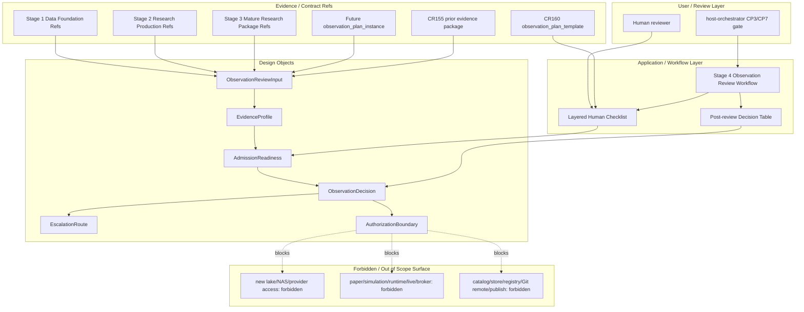

# HLD: CR160 Stage 4 Observation Review Workflow

## 修订记录

| 版本 | 日期 | 修订人 | 变更要点 |
|---|---|---|---|
| 1.0 | 2026-07-08 | meta-se | 初版：定义 Stage 4 observation review workflow、layered checklist、fail-closed decision table、observation plan template、CR155 blocked seed classification、Stage 5 handoff boundary 和 CP3 自审。 |

## 1. 问题定义

### 问题陈述

CR157 已经让 Stage 3 mature research package 要求 `observation_plan_ref`，但没有定义 Stage 4 应如何审查 observation readiness，也没有定义 `stage4_observation_gate_approved` 的语义。没有这个 Stage 4 合同，后续研究样本可能被误读为 observation candidate、paper candidate、simulation ready 或 runtime authorized，尤其是像 CR155 这种“真实 lake readonly validation 已存在但 admission failed”的样本。

CR160 只补齐 Stage 4 review/gate 设计证据。它不实现 checker，不改代码，不新增真实 lake/NAS/provider/broker/catalog/git remote/publish 操作，也不授权 paper、simulation、live 或 runtime。

### 核心价值

CR160 给 Stage 1 -> Stage 2 -> Stage 3 -> Stage 4 -> Stage 5 建立一个可审查的人工决策边界：先用 layered checklist 审核数据基础、研究生产、研究机准入和授权/no-overclaim 控制，再用 post-review decision table 把输入分类为 `observation_candidate`、`needs_remediation`、`needs_real_data_validation`、`blocked_admission_failed`、`authorization_blocked` 或 `not_reviewable`。这避免 blocked artifact 被提升到 observation 或 paper/simulation。

### 目标

| 优先级 | 目标 | 度量方式 |
|---|---|---|
| P0 | 定义 Stage 4 review workflow | HLD 覆盖 `ObservationReviewInput -> EvidenceProfile -> AdmissionReadiness -> ObservationDecision -> EscalationRoute -> AuthorizationBoundary` 6 个设计对象。 |
| P0 | 定义 layered human checklist | `OBSERVATION-REVIEW-CHECKLIST.md` 至少包含 Stage 1、Stage 2、Stage 3、cross-cutting authorization/no-overclaim 4 个层级。 |
| P0 | 阻断 contract-only overclaim | decision table 中 `contract_only` lane 的 `paper_candidate`、`simulation_ready`、`runtime_authorized` 100% 固定为 false。 |
| P0 | 固化 CR155 fail-closed 种子分类 | `CR160-CR155-SEED-CLASSIFICATION.md` 明确 `BLOCKED/FAIL/paper_candidate=false/rerun_consistency=PASS -> blocked_admission_failed`。 |
| P1 | 区分 template 与 future instance | HLD 明确 CR160 产出 `observation_plan_template`，future Stage 3 产出 `observation_plan_instance`，Stage 4 审查 instance 对 template 的符合性。 |
| P1 | 定义 observation time model | template 覆盖 observation period、checkpoint frequency、tracking metrics、exit criteria、remediation triggers、pause triggers 6 类字段。 |
| P2 | 为 Stage 5 留出非授权视图 | Stage 5 handoff 只输出 `PaperSimulationAdmissionView` 的 admission view，不声明 simulation/paper/runtime 授权。 |

### 成功标准

- [ ] 6 个 Stage 4 design objects 全部在 HLD 中定义，且每个对象都有输入、输出、失败路径。
- [ ] Checklist 覆盖 4 个层级，每个层级至少 5 个人工审查项，并给出 PASS / NEEDS_REVIEW / FAIL / N/A 的解释。
- [ ] Decision table 至少覆盖 `contract_only`、`real_data_validated`、`runtime_authorized`、`unknown` 4 条 evidence lane。
- [ ] `contract_only` lane 中 0 条路径能输出 `paper_candidate=true`、`simulation_ready=true` 或 `runtime_authorized=true`。
- [ ] CR155 被分类为 `blocked_admission_failed`，不是 observation candidate，且不触发 paper/simulation/runtime route。
- [ ] CP3 result JSON 使用本地 checkpoint-manager schema 可接受的 `checkpoint=CP3` result shape。

### 约束

| 类型 | 约束内容 |
|---|---|
| 阶段 | 当前仅 CP3 solution-design；CP4/CP5/CP6 在 CR160 design-only route 中为 N/A；设计产物作为 CP7 verification inputs。 |
| 权限 | 不读取 credential，不访问 provider/broker，不运行 runtime/paper/simulation/live，不做 lake/NAS/catalog/store/registry/Git remote/publish 操作。 |
| 证据 | 可引用既有 CR155 evidence package；不得把引用既有证据解释为新 real lake authorization。 |
| 语义 | Checklist 是人工 review tool；decision table 是 post-review classification；automatic checker 为后续 CR 候选。 |
| 安全 | contract-only 结论只能是低等级 review conclusion，不能输出 paper/simulation/runtime readiness。 |

### 非目标

- 不实现 `engine/observation_review.py`、schema、validator、CLI 或自动 checker。
- 不拆 Story，不写 LLD，不生成 CP4/CP5/CP6 开发计划。
- 不修改 `REQUIREMENTS.md` 或 `USE-CASES.md`。
- 不对任何策略做 remediation、rerun、paper simulation、live run 或 runtime smoke。
- 不新增真实 lake/NAS/provider 读取，不写 catalog/store/registry，不推送 Git remote，不发布 release。
- 不把 CR155 变成 observation candidate 或 paper/simulation candidate。

### 关键假设

| 假设 | 如果不成立的影响 | 回退 / 重访条件 |
|---|---|---|
| Stage 4 当前先以人工 checklist 和 decision table 关闭语义缺口。 | 若用户要求机器自动检查，则本 HLD 只能作为 checker 的需求输入。 | 新 CR 授权 schema/checker implementation。 |
| Future Stage 3 能生成 observation_plan_instance。 | 若 Stage 3 只提供 template ref，Stage 4 必须 fail-closed 到 `not_reviewable` 或 `needs_remediation`。 | Stage 3 package 合同修订。 |
| Stage 5 需要 admission view 但不在 CR160 授权 paper/simulation。 | 若 CP3 被误读为 Stage 5 授权，会出现 runtime authorization leak。 | CP3 gate 必须显示 non-authorization wording。 |

### 缺失信息

| 优先级 | 缺失信息 | 影响范围 | 当前处理 |
|---|---|---|---|
| BLOCKING | 无 | 无 | CP2 已批准 scope 和关键决策。 |
| REQUIRED | Future Stage 3 observation_plan_instance 的真实 schema | 影响自动 checker 和 future implementation | CR160 只定义 template contract 和 review relation，不实现 schema。 |
| OPTIONAL | Stage 5 paper/simulation gate 的正式字段名 | 影响后续 Stage 5 integration | 本 HLD 使用 `PaperSimulationAdmissionView` 作为非授权 handoff view。 |

## 2. 蓝图适用性判定

CR160 跨 Stage 1/2/3/4/5 做 review traceability，但不新增长期 Feature / Epic 边界，不改变数据归属，不改变 module dependency direction，也不新增 implementation Story。因此本轮不新增 `BLUEPRINT.md`、`DOMAIN-MAP.md` 或 `DEPENDENCY-MAP.md`。

| 产物 | 判定 | 理由 | 后续触发条件 |
|---|---|---|---|
| `docs/design/BLUEPRINT.md` | not-applicable for CR160 CP3 | CR160 是 Stage 4 review workflow 设计，不重划 Feature 能力地图。 | 若后续 CR 实现 reusable observation review engine 或 multi-strategy gate platform。 |
| `docs/design/DOMAIN-MAP.md` | not-applicable for CR160 CP3 | 本 HLD 定义 review objects，但不改变既有 Stage 1/2/3 domain ownership。 | 若 future checker 引入持久化状态、review record schema 或 gate ledger object。 |
| `docs/design/DEPENDENCY-MAP.md` | not-applicable for CR160 CP3 | 本轮无 code dependency 或 module edge 变更。 | 若 checker/CLI/agent integration 被授权。 |

## 3. 架构灰区与方案形成记录

**CP3 讨论日志**：`process/discussions/CP3-CR160-HLD-DISCUSSION-LOG.md`

**CP3 讨论恢复点**：`process/checks/CP3-CR160-DISCUSSION-CHECKPOINT.json`

### Architecture Gray Areas

| 灰区 ID | 关键问题 | 为什么会影响架构 | 影响面 | 推荐讨论顺序 | canonical refs | 状态 |
|---|---|---|---|---|---|---|
| AGA-CR160-01 | Stage 4 是否接受 contract-only artifacts？ | 决定 review input lane 和最高可输出结论；若放宽会导致 overclaim。 | 范围 / 安全 / 验证 / Stage 5 handoff | 1 | CP2 `DQ-CP2-CR160-EVIDENCE-PROFILE` | selected: accept but cap to low-grade fail-closed conclusions |
| AGA-CR160-02 | CR155 existing real-data evidence 能否作为 seed？ | 决定是否可用真实历史证据做 fail-closed sample，同时不授权新 lake access。 | 证据 / 权限 / 文档 / 风险 | 2 | CP2 `DQ-CP2-CR160-CR155-SEED-CLASSIFICATION`；CR155 evidence package | selected: existing evidence consumption only |
| AGA-CR160-03 | `observation_plan_ref` 指向 template 还是 instance？ | 决定 Stage 3/Stage 4 contract boundary；template 和 instance 混淆会让 missing plan 被误判 PASS。 | 模块边界 / 状态流 / 验证 / 文档 | 3 | CP3-FOCUS-CR160-006 | selected: CR160 defines template, future Stage 3 produces instance |
| AGA-CR160-04 | Review 是 manual、automatic 还是 mixed？ | 决定当前 CR 是否需要 checker implementation；越界会触发 CP4/CP5/CP6。 | 范围 / 交付 / 验证 / 权限 | 4 | CP3-FOCUS-CR160-008 | selected: manual checklist plus post-review decision table |

### Advisor Table

| Option | Pros | Cons | Impact Surface | Recommendation | Assumptions / When to switch |
|---|---|---|---|---|---|
| A. Manual layered review + fail-closed decision table | 最小关闭 Stage 4 语义缺口；不新增代码；可直接 CP3 评审；authorization boundary 清晰。 | 后续人工执行成本高；一致性依赖 reviewer discipline。 | docs/design, docs/quality, CP3 precheck, Stage 5 handoff wording | Recommended | 适用于 design-only CR。若重复 review 出现不一致或需要批量审查，切换到 checker CR。 |
| B. Automatic checker now | 可机器化执行 checklist；减少人工差异。 | 需要 schema、code、tests、CP4/CP5/CP6；超出 CP2 approved deliverable shape。 | engine, tests, Story plan, runtime safety review | Not recommended for CR160 | 仅在用户授权 implementation CR 且提供 instance schema 时切换。 |
| C. Stage 5 combined admission gate | 一次性把 Stage 4 observation 和 Stage 5 paper/simulation gate 接起来。 | 容易把 Stage 4 review approval 误读为 paper/simulation/runtime authorization。 | Stage 5 semantics, runtime risk, authorization | Rejected for CR160 | 仅在独立 Stage 5 CR 明确授权 paper/simulation gate design 时考虑。 |
| D. Contract-only exclusion | 最保守，所有 contract-only input 都不可 review。 | 不能审查 early-stage artifacts，也无法给出 remediation route。 | Product workflow, review throughput | Governance fallback | 若 contract-only artifacts 被持续误用为 readiness claims，则切换到 exclusion。 |

### 方案形成输入与事后审查区分

| 类型 | 来源 | 影响的 HLD 章节 | 处理结果 | 说明 |
|---|---|---|---|---|
| 方案形成输入 | CP2 approved decisions | §4, §7, §9, §13 | adopted | 双 lane evidence profile、CR155 blocked seed、design-only deliverable 和 non-authorization boundary 均直接进入推荐方案。 |
| 方案形成输入 | CP3 attention items | §8, §10, §14 | adopted | Stage 1/2/3/cross-cutting checklist layering 和 template/instance 区分成为 HLD 主体。 |
| 方案形成输入 | Framework contract snippet | §6, §8 | adopted | Stage 3 已要求 `observation_plan_ref` 和 blocked forbidden claims；CR160 补 Stage 4 review semantics。 |
| HLD 后评审意见 | Future CP3 manual gate | TBD | pending | Host-orchestrator 发起 CP3 后记录，不倒填为方案形成输入。 |

### Deferred Architecture Ideas

| ID | 想法 / 风险 / 扩展方向 | 来源 | 延后原因 | 触发切换或重启条件 |
|---|---|---|---|---|
| DAI-CR160-01 | Observation review automatic checker | CP3-FOCUS-CR160-008 | 当前 CR 是 design-only，checker 需要 Story/LLD/code/test。 | 用户授权 follow-up CR。 |
| DAI-CR160-02 | Persistent observation review ledger | Architecture lane | 需要 storage/schema ownership，不属于当前 HLD。 | 多 reviewer 或 audit trail 需要机器 ledger。 |
| DAI-CR160-03 | Stage 5 paper/simulation authorization design | Authorization lane | Stage 5 gate 需要单独 runtime/simulation authorization。 | Stage 5 CR 或 explicit paper/simulation design gate。 |
| DAI-CR160-04 | Data-lake governance remediation workflow | Quality lane | 涉及 lake/NAS/catalog policy 和 possible data operations。 | 独立 data governance CR。 |

## 4. 候选架构方案对比

### 方案 A：Manual Layered Review + Fail-Closed Decision Table

**核心思路**：Stage 4 由人工 reviewer 使用 layered checklist 审查 Stage 1/2/3/cross-cutting evidence，再用 post-review decision table 输出 classification 和 escalation route。

| 维度 | 评估 |
|---|---|
| 优点 | 最小范围；不越过 design-only；对 contract-only 和 CR155 blocked case fail-closed；能服务 CP7 verification。 |
| 缺点 | 不自动执行；人工一致性需要 checklist 纪律。 |
| 复杂度 | standard-lite |
| 实施成本 | 文档与 checkpoint 产物，无 code/story 成本。 |
| 可扩展性 | 可作为 future checker/schema 的需求基线。 |
| 风险 | reviewer 可能误读 `ready_with_risk` 或 Stage 5 view；通过 no-overclaim table 和 authorization boundary 控制。 |
| 适用前提 | 当前 CR 保持 design-only；没有新 runtime/data authorization。 |

### 方案 B：Automatic Checker Implementation

**核心思路**：定义并实现 observation review schema/checker，直接机器化判定 Stage 4 readiness。

| 维度 | 评估 |
|---|---|
| 优点 | 一致性更强，可批量审查。 |
| 缺点 | 需要 code/tests/story route；缺 future instance schema；超出 CP2 approved deliverable shape。 |
| 复杂度 | medium-high |
| 实施成本 | 需要 CP4/CP5/CP6 和 implementation CR。 |
| 可扩展性 | 高，但需要长期维护 schema compatibility。 |
| 风险 | 在字段不稳定时固化错误语义。 |
| 适用前提 | 用户明确授权 checker CR，并接受 implementation gate。 |

### 方案 C：Stage 4 + Stage 5 Combined Gate

**核心思路**：把 Stage 4 observation review 和 Stage 5 paper/simulation admission 合并成一个 gate。

| 维度 | 评估 |
|---|---|
| 优点 | Handoff 简化。 |
| 缺点 | 混淆 review approval 与 paper/simulation/runtime authorization；不符合 CP2 boundary。 |
| 复杂度 | high |
| 实施成本 | 需要 Stage 5 gate design 和 runtime risk review。 |
| 可扩展性 | 低，授权边界难维护。 |
| 风险 | 最大风险是输出 `simulation_ready=true` 或 `runtime_authorized=true` 的 overclaim。 |
| 适用前提 | Stage 5 已获独立授权且有完整 gate policy。 |

### 方案对比矩阵

| 维度 | 方案 A | 方案 B | 方案 C |
|---|---|---|---|
| 匹配 CP2 design-only | high | low | low |
| 阻断 overclaim | high | medium | low |
| 可验证性 | medium-high | high | medium |
| 当前交付成本 | low | high | high |
| Stage 5 授权安全 | high | high if carefully designed | low |
| 推荐度 | selected | deferred | rejected |

**推荐方案**：方案 A。它在不扩大授权的前提下关闭 Stage 4 语义缺口，并把 future checker 和 Stage 5 gate 留作独立 CR。

## 5. 推荐方案总览

**复杂度模式**：`standard-lite`

| 判定维度 | 依据 | 结论 |
|---|---|---|
| 需求规模 | 1 个 Stage 4 workflow，6 个 design objects，1 份 checklist，1 个 seed classification。 | standard-lite |
| 角色数量 | Human reviewer + host-orchestrator CP3/CP7 消费方。 | low-medium |
| 状态流转 | review input -> profile -> readiness -> decision -> escalation -> boundary。 | medium |
| 平台适配 | 文档和 CP result，不涉及 runtime platform。 | low |
| Story 拆解 | 不拆 Story。 | N/A |

**系统核心思路**：

Stage 4 不接管 Stage 3 研究生产，也不授权 Stage 5 runtime。它只做人工 observation review：收集 refs-only evidence、识别 evidence lane、审查 observation_plan_instance 是否符合 CR160 template、计算 admission readiness，然后输出 fail-closed classification 和 escalation route。

**关键架构风格**：contract-first governance workflow + human checklist + fail-closed decision table。

**核心能力边界**：

- 做：定义 Stage 4 input contract、review checklist、decision classification、authorization boundary、CR155 blocked sample。
- 不做：checker implementation、runtime/data operation、paper/simulation/live/trading authorization、Story planning。

**关键依赖**：

- CP2 CR160 scope result：决定 design-only route 和 accepted decisions。
- Stage 3 framework contract：提供 `Stage3MatureResearchPackage.observation_plan_ref` 和 forbidden claim guard。
- CR155 evidence package：作为 `blocked_admission_failed` seed sample。

**产物形态**：

- HLD：1 份。
- Manual review checklist：1 份。
- Seed classification evidence：1 份。
- Discussion log/checkpoint：2 份。
- CP3 result JSON：1 份。
- Agent / Skill / code / Story：0。

## 6. 高层模块与职责划分

| 设计对象 | 责任 | 输入契约 | 输出契约 | 失败 / 降级 |
|---|---|---|---|---|
| `ObservationReviewInput` | 聚合 Stage 1/2/3 evidence refs 和 proposed observation plan ref。 | Stage 1 data refs, Stage 2 package refs, Stage 3 research package refs, observation_plan_instance ref if present。 | Normalized review input with evidence_refs and declared lane. | Missing required Stage 3 package or plan instance -> `not_reviewable` or `needs_remediation`。 |
| `EvidenceProfile` | 判定 evidence lane 和 claim ceiling。 | Evidence refs, evidence provenance, authorization counters, validation status。 | `contract_only`, `real_data_validated`, `runtime_authorized`, or `unknown` plus allowed_claims ceiling。 | Unknown or contradictory evidence -> fail-closed to `unknown`。 |
| `AdmissionReadiness` | 把 checklist outcome 转成 readiness summary。 | Checklist stage outcomes and blocker list。 | `ready_for_observation_review`, `ready_with_risk_review`, `blocked_admission_failed`, `not_reviewable`。 | Any Stage 3 admission FAIL/BLOCKED -> blocked unless a specific remediation route is selected。 |
| `ObservationDecision` | Post-review classification。 | EvidenceProfile + AdmissionReadiness + authorization boundary。 | classification, paper_candidate=false, simulation_ready=false, runtime_authorized=false unless separately authorized. | Contract-only cannot exceed low-grade review outcome。 |
| `EscalationRoute` | 指向后续处理路径。 | Decision classification and blockers。 | strategy_remediation, real_data_validation, paper_authorization, runtime_authorization, data_lake_governance, or no_action。 | No route may execute work without separate CR/gate。 |
| `AuthorizationBoundary` | 固定 non-authorization wording。 | CP2 accepted decisions and authz policy refs。 | Explicit denied operations and allowed evidence consumption statement。 | Any attempted runtime/data/publish claim -> CP3/CP7 blocker。 |

## 7. Observation Plan Template Contract

### Template vs Instance

| 对象 | Producer | Reviewer | 生命周期 | 必须包含 | 缺失时行为 |
|---|---|---|---|---|---|
| `observation_plan_template` | CR160 HLD / checklist | CP3 reviewer, future Stage 3/4 designers | Stable design template | time model, metrics, checkpoint cadence, exit criteria, remediation/pause triggers, authorization wording | CR160 CP3 cannot pass if template missing these fields。 |
| `observation_plan_instance` | Future Stage 3 mature research package producer | Stage 4 human reviewer | Per strategy / per package artifact | strategy-specific values satisfying template | Stage 4 decision must fail-closed to `not_reviewable` or `needs_remediation`。 |

`observation_plan_ref` in future Stage 3 packages must point to an instance, not merely this HLD template. The Stage 4 reviewer checks instance compliance against the CR160 template; compliance is not inferred from the existence of a ref alone.

### Observation Plan Template Fields

| Field | Required | Review expectation | Fail-closed behavior |
|---|---|---|---|
| `strategy_id` | yes | Matches Stage 3 package `strategy_id`. | Mismatch -> `not_reviewable`。 |
| `observation_period` | yes | Calendar or trading-day span, start/end rules, minimum duration. | Missing -> `needs_remediation`。 |
| `checkpoint_frequency` | yes | Review cadence such as daily/weekly/per rebalance, with responsible reviewer. | Missing -> `needs_remediation`。 |
| `tracking_metrics` | yes | At least return, drawdown, turnover/cost, exposure/drift, data quality, risk limit, and blocked claim metrics. | Missing core metrics -> `needs_remediation`。 |
| `exit_criteria` | yes | Conditions to graduate, continue observation, fail, or escalate. | Missing -> cannot become observation candidate。 |
| `remediation_triggers` | yes | Metrics or evidence gaps that send strategy back to remediation. | Missing -> `needs_remediation`。 |
| `pause_triggers` | yes | Conditions requiring pause before further observation. | Missing -> `needs_remediation`。 |
| `authorization_boundary` | yes | Explicitly states observation is not paper/simulation/runtime authorization. | Missing -> `authorization_blocked`。 |
| `evidence_refs` | yes | Links to Stage 1/2/3 artifacts and unavailable/blocked reasons. | Missing critical refs -> `not_reviewable`。 |

### Default Time Model

| Component | Default design value | Notes |
|---|---|---|
| Observation period | Minimum 20 trading days or 4 weekly checkpoints, whichever is longer, unless future CP3/Stage 4 gate sets a stricter value. | Design default only; no runtime scheduling is authorized. |
| Checkpoint frequency | At each rebalance and at least weekly. | Human review cadence; not an automated job. |
| Required metrics | net/ gross return, max drawdown, turnover/cost, exposure concentration, universe coverage, data quality gaps, factor drift, risk/capacity flags, blocked claims, unavailable evidence. | Metrics are reviewed from existing/ref-provided evidence. |
| Exit criteria | All P0 blockers closed, no forbidden claim, observation metrics inside policy bounds for the period, remediation/pause triggers inactive, Stage 5 authorization still separate. | Exit from observation review is not paper/simulation authorization. |
| Remediation triggers | Admission package FAIL/BLOCKED, negative economics after costs, OOS blocked, missing plan fields, missing PIT/lineage refs, unresolved typed_unavailable on critical path. | Route to strategy remediation or real-data validation, not paper/simulation. |
| Pause triggers | Evidence contradiction, authorization ambiguity, data quality incident, forbidden claim, runtime/provider/broker credential access request, catalog/store mutation request. | Route to host-orchestrator decision; no execution. |

## 8. Pipeline Traceability: Stage 1 -> Stage 5

| Pipeline stage | Stage 4 review requirement | Review outcome if missing or failed |
|---|---|---|
| Stage 1 Data Foundation | `ResearchDatasetSpec.universe`, `leakage_policy`, `output_snapshot_id`, `lineage_refs`, PIT gate, `BacktestRunSpec`. | Missing PIT/leakage/snapshot lineage -> `needs_real_data_validation` or `data_lake_governance` route; no observation candidate. |
| Stage 2 Research Production | `Stage2MaturePackageRefSet.factor_spec_refs`, `factor_run_spec_refs`, `factor_panel_ref`, `evaluation_report_refs`, `research_evidence_index`, `typed_unavailable`, `blocked_reasons`. | Critical typed unavailable or blocked reasons unresolved -> `needs_remediation`; contract-only ceiling applies. |
| Stage 3 Research Machine | `Stage3MatureResearchPackage.run_manifest`, `input_refs`, `evidence_refs`, `research_evidence_index`, `admission_package_ref`, `observation_plan_ref`, `blocked_claims`, `unlock_conditions`, `blocked_reasons`. | Admission FAIL/BLOCKED or missing observation instance -> `blocked_admission_failed` or `not_reviewable`; no promotion. |
| Stage 4 Observation Review | `ObservationReviewInput`, `EvidenceProfile`, `AdmissionReadiness`, `ObservationDecision`, `EscalationRoute`, `AuthorizationBoundary`. | Produces classification and route only. |
| Stage 5 Paper/Simulation | `PaperSimulationAdmissionView.overall_admission`, `simulation_candidate`, `not_simulation_auth`, `validation`. | CR160 may provide a view; it never authorizes paper/simulation/runtime. |

## 9. Decision Table

### Evidence Profile Ceiling

| EvidenceProfile | Allowed review conclusion ceiling | `paper_candidate` | `simulation_ready` | `runtime_authorized` | Required wording |
|---|---|---:|---:|---:|---|
| `contract_only` | low-grade review only: `not_reviewable`, `needs_remediation`, or `authorization_blocked` | false | false | false | Contract evidence cannot claim real-data validation or readiness. |
| `real_data_validated` | may become `observation_candidate` only if Stage 3 admission passes and plan instance complies | false unless separate Stage 5 paper gate | false unless separate Stage 5 simulation gate | false | Real data evidence is still not runtime authorization. |
| `runtime_authorized` | out of scope for CR160; must be rejected or routed to runtime authorization gate | false | false | false under CR160 | Runtime auth cannot be inferred; separate gate required. |
| `unknown` | `not_reviewable` or `authorization_blocked` | false | false | false | Unknown evidence fails closed. |

### Post-Review Classification

| Inputs | Required checklist state | Classification | EscalationRoute | Stage 5 view | Notes |
|---|---|---|---|---|---|
| Stage 3 admission PASS, real-data evidence valid, plan instance compliant, no forbidden claims | Stage 1/2/3/cross-cutting PASS or accepted non-blocking review item | `observation_candidate` | no_action or future paper_authorization request | `overall_admission=observation_review_passed`, `simulation_candidate=false`, `not_simulation_auth=true` | Still not paper/simulation/runtime authorized. |
| Stage 3 admission PASS, contract-only evidence | Checklist may pass contract fields only | `needs_real_data_validation` | real_data_validation | `overall_admission=not_admitted`, `simulation_candidate=false`, `not_simulation_auth=true` | Contract-only ceiling blocks candidate promotion. |
| Stage 3 admission BLOCKED or statistical gate FAIL | Any Stage 3 blocker | `blocked_admission_failed` | strategy_remediation | `overall_admission=blocked`, `simulation_candidate=false`, `not_simulation_auth=true` | CR155 maps here. |
| Missing or non-compliant observation_plan_instance | Template compliance FAIL | `not_reviewable` or `needs_remediation` | strategy_remediation | `overall_admission=not_reviewable`, `simulation_candidate=false`, `not_simulation_auth=true` | Existence of template does not satisfy instance requirement. |
| Any forbidden claim or authorization ambiguity | Cross-cutting authorization FAIL | `authorization_blocked` | runtime_authorization or host decision | `overall_admission=blocked`, `simulation_candidate=false`, `not_simulation_auth=true` | Must not continue until separate authorization gate. |
| PIT/lineage/data quality foundation incomplete | Stage 1 FAIL | `needs_real_data_validation` or `data_lake_governance` | real_data_validation or data_lake_governance | `overall_admission=not_admitted`, `simulation_candidate=false`, `not_simulation_auth=true` | No new lake action is authorized by classification. |

## 10. Use Case -> Architecture Traceability

| Use Case / goal | 支撑对象 | 关键流程 | 异常 / 失败路径 | 验证方式 | 备注 |
|---|---|---|---|---|---|
| UC-58 multifactor strategy E2E | ObservationReviewInput, EvidenceProfile, ObservationDecision | Collect Stage 1/2/3 refs -> checklist -> decision table -> Stage 5 view | Missing Stage 3 admission package or forbidden claim -> fail-closed | CP7 design verification of HLD/checklist/seed sample | No runtime operation. |
| DF-CR157-003 Stage 4 observation review workflow | observation_plan_template, AdmissionReadiness, EscalationRoute | Review plan instance compliance -> classify readiness -> route remediation/validation/authorization | Missing instance -> not_reviewable | Checklist manual review and CP3 result JSON | CR160 closes semantic gap only. |
| CR155 blocked seed classification | EvidenceProfile, AdmissionReadiness | Prior CR155 evidence -> real_data_validated but admission FAIL -> blocked_admission_failed | Any attempt to mark observation candidate -> CP3/CP7 fail | `CR160-CR155-SEED-CLASSIFICATION.md` | Existing evidence consumption only. |

## 11. 关键场景模拟

| 模拟 ID | 场景 | 输入 / 前置条件 | 推荐架构执行路径 | 预期输出 | 失败 / 回退路径 | 结果 |
|---|---|---|---|---|---|---|
| SIM-CR160-01 | Contract-only early artifact is reviewed | Stage 2/3 contract refs exist but no real-data validated evidence and no plan instance | EvidenceProfile=`contract_only` -> checklist marks evidence ceiling -> decision table | `needs_real_data_validation`, all readiness booleans false | If reviewer sets `paper_candidate=true`, CP3/CP7 fails as overclaim | PASS |
| SIM-CR160-02 | CR155 seed package is reviewed | Existing CR155 package: `BLOCKED`, statistical gate `FAIL`, `paper_candidate=false`, rerun consistency `PASS` | EvidenceProfile=`real_data_validated` for prior readonly evidence -> AdmissionReadiness detects Stage 3 fail -> ObservationDecision | `blocked_admission_failed`, route=`strategy_remediation`, not observation candidate | If classified as observation candidate, fail self-check | PASS |
| SIM-CR160-03 | Future Stage 3 candidate has real-data evidence and compliant plan | Stage 1/2/3 PASS, observation_plan_instance satisfies template, no forbidden claims | Checklist PASS -> AdmissionReadiness ready -> decision table | `observation_candidate`, Stage 5 view says not simulation auth | Separate Stage 5 paper/simulation authorization still required | PASS |
| SIM-CR160-04 | Observation plan ref points only to CR160 template | Stage 3 package has `observation_plan_ref` but it points to template not instance | Template/instance check fails | `not_reviewable` or `needs_remediation` | Stage 3 producer must create instance | PASS |

## 12. 系统架构图

## 13. 关键流程

### Flow 1: Human Observation Review

1. Reviewer receives `ObservationReviewInput` containing Stage 1/2/3 refs, evidence profile hints, and future `observation_plan_instance`.
2. Reviewer applies `docs/quality/OBSERVATION-REVIEW-CHECKLIST.md` across Stage 1, Stage 2, Stage 3, and cross-cutting controls.
3. Reviewer records per-layer outcome: PASS, NEEDS_REVIEW, FAIL, or N/A with reason.
4. Reviewer maps outcomes into `AdmissionReadiness`.
5. Reviewer applies decision table to produce `ObservationDecision`.
6. Host-orchestrator consumes classification and creates only the appropriate follow-up route candidate; it does not execute that route without a separate gate.

### Flow 2: CR155 Seed Classification

1. Input is the existing CR155 evidence package.
2. EvidenceProfile recognizes prior real-data readonly validation evidence, but AuthorizationBoundary states no new data access is authorized.
3. AdmissionReadiness reads `package_status=BLOCKED`, `statistical_admission=FAIL`, `paper_candidate=false`, `rerun_consistency=PASS`.
4. ObservationDecision returns `blocked_admission_failed`.
5. EscalationRoute is `strategy_remediation`; no observation, paper, simulation or runtime route is opened.

### Flow 3: Stage 5 Handoff View

1. ObservationDecision can produce a Stage 5 view only as a non-authorization summary.
2. `simulation_candidate` remains false in CR160 outputs.
3. `not_simulation_auth` remains true for every CR160 classification.
4. Separate Stage 5 CP / CR is required before any paper/simulation/runtime action.

## 14. 非功能需求设计

| NFR | Design response | Verification input |
|---|---|---|
| Safety / authorization | Deny-by-default for runtime, paper, simulation, live, broker, credential, provider, NAS, lake, catalog/store/registry, Git remote, publish. | HLD §9, §13 and checklist cross-cutting section. |
| Traceability | Every decision must cite Stage 1/2/3 refs or explicit missing evidence. | Checklist evidence ref column and seed classification. |
| Maintainability | Template separates stable required fields from future instance values. | HLD §7. |
| Auditability | Discussion log and checkpoint separate pre-HLD advisor input from future CP3 review. | `process/discussions/CP3-CR160-HLD-DISCUSSION-LOG.md`. |
| Extensibility | Automatic checker, ledger and Stage 5 gate are deferred with switch conditions. | Deferred ideas table. |
| No-overclaim | Claim ceiling table prevents contract-only or blocked artifacts from readiness booleans. | Decision table and CP3 result item. |

## 15. 主要风险与应对

| 风险 ID | 风险 | 影响 | 应对 | 状态 |
|---|---|---|---|---|
| R-CR160-READY-WITH-RISK-MISREAD | `ready_with_risk` 被读成 observation or simulation readiness。 | Overclaim and unsafe routing。 | Avoid readiness booleans; use classification + route; Stage 5 view keeps `not_simulation_auth=true`。 | open, controlled by wording |
| R-CR160-CR155-BLOCKED-ARTIFACT-PROMOTION | CR155 被误升为 observation candidate。 | Wrong gate outcome。 | Seed classification file maps CR155 to `blocked_admission_failed` only。 | open, controlled by seed sample |
| R-CR160-RUNTIME-AUTHORIZATION-LEAK | CP3 approve 被误读为 runtime/paper/simulation authorization。 | Forbidden operation risk。 | Explicit non-authorization in frontmatter, HLD, checklist and CP3 result。 | open, controlled by CP3 brief |
| R-CR160-GATE-PROFILE-NAME-MISMATCH | Evidence lane/profile names drift across docs. | Reviewer confusion。 | HLD standardizes `contract_only`, `real_data_validated`, `runtime_authorized`, `unknown`。 | open, controlled by checkpoint |

## 16. ADR 候选决策点

| ADR ID | 决策类型 | 推荐方案 | 备选方案 | 优劣 / 影响 | 回退 / 切换条件 |
|---|---|---|---|---|---|
| ADR-CR160-001 | Review mechanism | Manual layered checklist + post-review table | Automatic checker now | 推荐方案最小且不越权；checker 更一致但需要 implementation CR。 | 需要批量审查或人工差异过高时新 CR。 |
| ADR-CR160-002 | Evidence lane ceiling | Accept contract-only but cap to fail-closed conclusions | Exclude contract-only entirely | 推荐方案能给 remediation route；排除更安全但价值低。 | 若 contract-only 持续被 overclaim，切换到 exclusion。 |
| ADR-CR160-003 | Observation plan semantics | Template in CR160, future instance in Stage 3 | Treat `observation_plan_ref` as template ref | 推荐方案避免 instance 缺失被误判 PASS。 | 若 Stage 3 contract changes, revisit template/instance relation。 |
| ADR-CR160-004 | CR155 classification | `blocked_admission_failed` | observation candidate with risk | 推荐方案符合 BLOCKED/FAIL/paper_candidate=false；备选不安全。 | Only new evidence and admission PASS in separate CR could change classification。 |
| ADR-CR160-005 | Stage 5 boundary | Non-authorization view only | Combined Stage 4/5 authorization | 推荐方案防止 runtime leak；combined gate requires separate Stage 5 authorization。 | Stage 5 CR approved。 |

## 17. 分阶段落地建议

| Phase | Scope | Outputs | Gate |
|---|---|---|---|
| CR160 CP3 | Design Stage 4 review workflow, checklist, seed classification, discussion checkpoint, CP3 precheck. | Current HLD outputs. | CP3 human gate by host-orchestrator. |
| CR160 CP7 | Verify design completeness, no-overclaim wording, checklist testability, CR155 fail-closed classification. | Verification report by meta-qa / host route. | CP7 design verification. |
| Follow-up CR A | Implement observation review checker, if authorized. | Schema, code, tests, CP4/CP5/CP6 artifacts. | New CP2/CP3/CP5 as applicable. |
| Follow-up CR B | Stage 5 paper/simulation admission gate design. | Stage 5 HLD and authorization policy. | Separate human gate. |

## 18. Feature 级实现设计触发条件

CR160 CP3 does not trigger Feature design, Story planning, LLD, implementation, tests, or automatic checker work.

| Feature / future area | Current status | Trigger reason if future CR authorizes | Target outputs |
|---|---|---|---|
| Observation review checker | deferred | external-interface, data-model, authorization, shared-story-boundary | `docs/features/observation-review/DESIGN.md`, TEST-PLAN, TASKS |
| Observation review ledger | deferred | audit persistence, rollback, migration | Feature design and storage contract |
| Stage 5 paper/simulation gate | deferred | security, permission, runtime authorization | Separate HLD/ADR and gate checklist |

`lld_policy` for current CR160 deliverables is `waived` because there are no implementation Stories. Any future implementation CR must revisit this and likely require `full-lld`.

## 19. 下沉到后续 Feature 设计的内容

The following are deliberately not specified at class/function/schema level in this HLD:

- Machine-readable observation review schema.
- Automatic checker API, CLI and result serialization.
- Persistent observation review ledger or database model.
- Stage 5 paper/simulation authorization schema.
- Runtime, provider, broker, catalog/store or lake integration.

Each item requires a follow-up CR with explicit authorization and CP4/CP5/CP6 planning.

## 20. 工作量粗估

| Work item | Current CR160 output? | Estimate |
|---|---:|---|
| HLD and advisor discussion | yes | 1 design slice |
| Manual review checklist | yes | 1 quality design slice |
| CR155 seed classification | yes | 1 evidence classification slice |
| CP3 precheck result | yes | 1 checkpoint slice |
| Story decomposition / implementation | no | 0 for CR160 |

## 21. 待确认问题

| ID | 问题 | 状态 | 影响 | 建议 CP3 决策 |
|---|---|---|---|---|
| CP3-DQ-CR160-001 | 是否接受 manual layered review + fail-closed decision table 作为 CR160 Stage 4 推荐方案？ | OPEN for CP3 gate | 决定是否可进入 CP7 design verification。 | Approve recommended option A。 |
| CP3-DQ-CR160-002 | 是否确认 CR160 `observation_plan_template` 与 future Stage 3 `observation_plan_instance` 的边界？ | OPEN for CP3 gate | 决定 future Stage 3 package compliance relation。 | Approve template/instance split。 |
| CP3-DQ-CR160-003 | 是否确认 contract-only lane 永远不能输出 paper/simulation/runtime readiness？ | OPEN for CP3 gate | 防止 overclaim。 | Approve fail-closed ceiling。 |
| CP3-DQ-CR160-004 | 是否确认 CR155 只能作为 `blocked_admission_failed` sample？ | OPEN for CP3 gate | 防止 blocked artifact promotion。 | Approve CR155 classification。 |
| CP3-DQ-CR160-005 | 是否确认 CR160 approve 不授权 Stage 5 paper/simulation/runtime operations？ | OPEN for CP3 gate | 防止 authorization leak。 | Approve non-authorization boundary。 |

## 22. HLD 自审记录

| 检查项 | 状态 | 证据 |
|---|---|---|
| Problem definition before HLD | PASS | §1 |
| Blueprint applicability assessed | PASS | §2, N/A reasons recorded |
| Architecture Gray Areas before HLD | PASS | §3 and discussion log/checkpoint |
| At least 2 candidate architectures | PASS | §4 contains 3 options |
| Recommended option and switch conditions | PASS | §3, §4, §16 |
| Stage 1/2/3/4/5 traceability | PASS | §8 |
| Checklist layered across required stages | PASS | `docs/quality/OBSERVATION-REVIEW-CHECKLIST.md` |
| Template vs instance distinction | PASS | §7 |
| Observation period/frequency/metrics/exit/remediation/pause triggers | PASS | §7 |
| Human checklist and post-review table, no checker | PASS | §3, §9, §17 |
| Contract-only cannot overclaim | PASS | §9 |
| CR155 blocked_admission_failed | PASS | §11 and seed classification file |
| No code/runtime/data operation authorized | PASS | frontmatter, §1, §13, §14 |
| Story planning not produced | PASS | §17, §18 |

