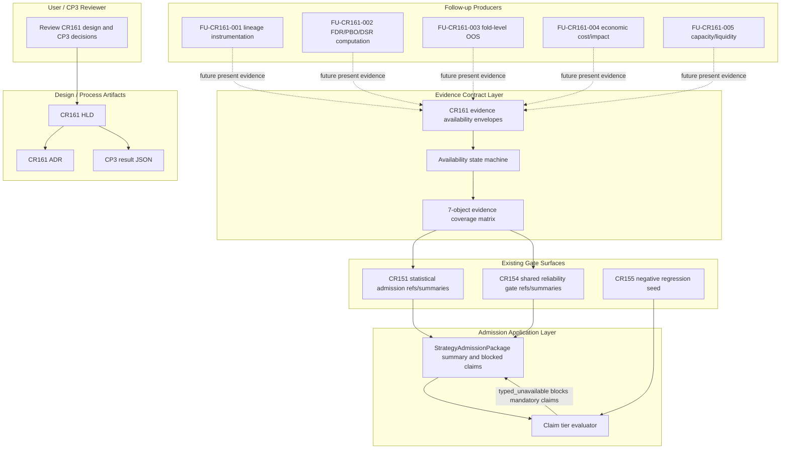
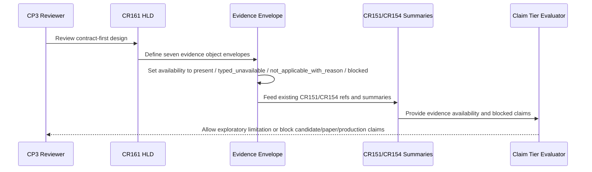
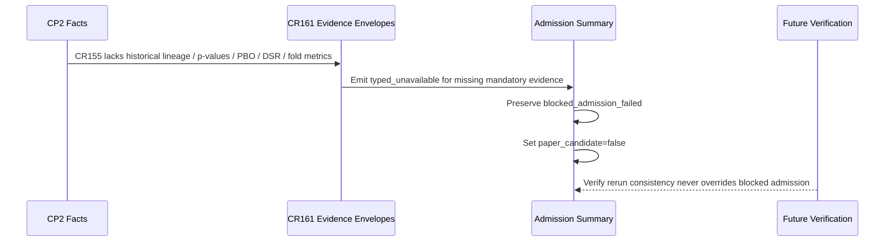
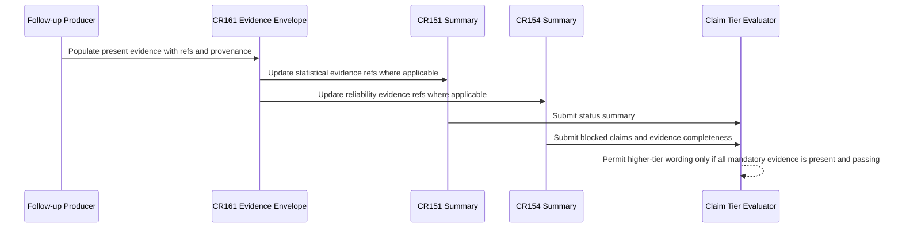

# HLD: CR161 Strategy Admission Evidence Pipeline Hardening

## Revision Record

| Version | Date | Author | Change |
|---|---|---|---|
| 0.1 | 2026-07-09 | meta-se | Initial CP3 draft for contract-first evidence availability semantics, 7-object evidence coverage, CR151/CR154 integration, CR155 negative regression and follow-up split. |

## 1. Problem Definition

### Problem Statement

CR151 and CR154 established statistical admission and cross-strategy reliability gate surfaces, but the current strategy admission chain can still overclaim when required evidence is missing. The critical gap is not another gate family; it is a reliable evidence availability contract that distinguishes computable evidence from explicitly unavailable evidence and fails closed when trial lineage, multiple-testing evidence, data-snooping evidence, overfit-risk evidence, walk-forward/OOS evidence, economic cost evidence or capacity/liquidity evidence is absent.

CR161 therefore hardens the admission evidence pipeline at CP3 by defining typed evidence envelopes and claim-tier effects. The current slice is explicitly design-only and contract-first. It delivers `typed_unavailable` fail-closed contract semantics, not computable FDR/PBO/DSR, not fold-level OOS computation, not real TCA, and not capacity implementation.

### Core Value

The user gets a strategy admission design that prevents missing evidence from being silently interpreted as evidence success. Historical CR155 remains a blocked negative regression sample, and future CR151/CR154 consumers get a consistent way to expose missing evidence through existing evidence refs and summaries.

### Goals

| Priority | Goal | Measurable Success Criteria |
|---|---|---|
| P0 | Define the 7-object evidence availability model | HLD includes one explicit matrix covering `ExperimentFamilyManifest`, `MultipleTestingEvidence`, `DataSnoopingEvidence`, `OverfitRiskEvidence`, `WalkForwardEvidence`, `EconomicCostEvidence` and `CapacityLiquidityEvidence` with all required CP3 columns. |
| P0 | Make missing mandatory evidence fail closed | Claim-tier table states that mandatory `typed_unavailable` blocks statistical significance, robustness, `paper_candidate` and `production_like` claims. |
| P0 | Integrate through CR151/CR154 | HLD and ADR state that CR161 extends CR151/CR154 evidence refs/summaries and does not create a parallel admission gate family. |
| P0 | Preserve CR155 as negative regression only | CR155 expected outcome is still `blocked_admission_failed` and `paper_candidate=false`; CR161 does not reconstruct missing historical C1/C2 facts. |
| P0 | Maintain authorization boundary | Current slice changes design artifacts only; it performs 0 source/test implementation, 0 runtime calls, 0 credential reads, 0 real lake/NAS/provider accesses and 0 external framework/Git remote/publish operations. |
| P1 | Define follow-up split | Follow-up candidates `FU-CR161-001` through `FU-CR161-005` are explicitly named with switch conditions. |

### Success Criteria

- [ ] The CP3 HLD contains the required 7-object evidence matrix with the 10 required columns.
- [ ] The availability state machine has exactly these stable statuses: `present`, `typed_unavailable`, `not_applicable_with_reason`, `blocked`.
- [ ] The claim-tier decision table covers `exploratory`, `candidate`, `paper_candidate` and `production_like`.
- [ ] `typed_unavailable` may allow only clearly labeled low-grade exploratory documentation; it blocks statistical significance, robustness, `paper_candidate` and `production_like` claims.
- [ ] The design states that CR161 current slice is not FDR/PBO/DSR computation, fold-level OOS computation, real TCA or capacity implementation.
- [ ] The ADR includes at least one executable alternative for each CP3 decision and rollback/switch conditions.
- [ ] The CP3 result JSON concludes `PASS` and routes to `CP3_HUMAN_GATE`.

### Constraints

| Type | Constraint |
|---|---|
| Workflow | CP2 is approved; CP3 may produce design artifacts only. CP4/CP5/CP6 remain conditional and are not entered by this task. |
| Authorization | No source/test implementation, research-engine instrumentation, simulation/paper/live/trading runtime, QMT/MiniQMT/xtquant/gateway runtime, broker operation, credential or `.env` read, new real lake read, real lake write, NAS read/write/sync/metadata normalization, provider fetch, catalog/store/registry/model/prediction write, external framework clone/install/run, Git remote write or publish. |
| Integration | Reuse CR151/CR154 evidence refs and summaries; no parallel CR161 gate family. |
| Historical evidence | Do not infer, reconstruct or backfill CR155 historical trial lineage, p-values, PBO/DSR or fold-level metrics. |
| Truthfulness | Current CP3 slice is contract-first and design-only. Any computable evidence or runtime/data proof requires later approval. |

### Non-Goals

- No implementation of FDR, WRC/SPA, PBO/CSCV, DSR or Sharpe/IC deflation computation.
- No research-engine trial-lineage instrumentation in the current slice.
- No fold-level OOS or walk-forward metric computation.
- No real transaction cost analysis, broker fill replay, order book impact modeling or real TCA calibration.
- No capacity curve, ADV sizing, alpha decay or liquidity implementation.
- No CR155 remediation, strategy optimization or historical C1/C2 reconstruction.
- No new admission gate family, no new runtime framework and no Story decomposition in this CP3 task.

### Key Assumptions

| Assumption | Impact if False |
|---|---|
| CR151 statistical admission and CR154 shared reliability gates remain the correct integration surfaces. | Return to CP3 and choose a broader shared admission architecture before CP4/CP5. |
| `typed_unavailable` is acceptable as a truthful first-slice contract state. | If rejected, CR161 must switch to compute-first implementation and re-route through CP4/CP5/CP6. |
| CR155 is useful as a negative regression only. | If CR155 evidence is required as positive proof, CP2 scope must be reopened because historical facts cannot be reconstructed safely. |
| Design-only verification can prove wording and contract consistency. | If empirical proof is required, a new runtime/data authorization CR is required. |

### Missing Information

| Priority | Missing Information | Impact | Treatment |
|---|---|---|---|
| BLOCKING | None for CP3 design. | N/A | N/A |
| REQUIRED-LATER | Exact schemas and field-level validation for each evidence object. | CP4/CP5 if implementation is later authorized. | Defer to Feature/Story design or follow-up CR. |
| REQUIRED-LATER | Thresholds for FDR, PBO, DSR, OOS degradation, cost underestimation and capacity constraints. | Computable evidence implementation. | Defer to `FU-CR161-002` through `FU-CR161-005`. |
| REQUIRED-LATER | Research-engine source of experiment family/trial lineage for future runs. | Automatic production of `ExperimentFamilyManifest`. | Defer to `FU-CR161-001`. |

## 2. Blueprint Applicability

CR161 touches cross-strategy admission semantics, evidence objects and dependency direction between CR151, CR154 and future research-engine instrumentation. Blueprint concerns are therefore applicable, but standalone `BLUEPRINT.md`, `DOMAIN-MAP.md` and `DEPENDENCY-MAP.md` are not produced in this CP3-only task because the approved route is design-only, `requires_story_decomposition=false`, and the user explicitly requested only the five CP3 design/check artifacts.

| Blueprint Artifact | CP3 Judgment | Reason | Impact | Follow-up Trigger |
|---|---|---|---|---|
| `docs/design/BLUEPRINT.md` | waived-for-current-slice | No new Feature/Epic implementation boundary is authorized; the current boundary is an HLD-contained evidence contract overlay. | CP3 can proceed because no Story/file ownership plan is generated. | Create/refresh before any CP4/CP5 implementation route or if CP3 reviewer requires standalone feature map. |
| `docs/design/DOMAIN-MAP.md` | waived-for-current-slice | Domain objects are fully enumerated in the 7-object matrix and availability state machine in this HLD. | Domain ownership is explicit enough for CP3 decision. | Create/refresh when object schemas, producers and persistence paths are implemented. |
| `docs/design/DEPENDENCY-MAP.md` | waived-for-current-slice | Dependency direction is fixed here: future producers feed CR151/CR154 refs/summaries; consumers do not call CR161 as a separate gate. | Prevents a parallel gate family without producing CP4 artifacts. | Create/refresh if Story planning identifies file ownership or adapter conflicts. |

## 3. Architecture Gray Areas and Advisor Discussion

Discussion evidence:

- `process/discussions/CP3-CR161-HLD-DISCUSSION-LOG.md`
- `process/checks/CP3-CR161-DISCUSSION-CHECKPOINT.json`

The CP3 design uses the CP2-approved decisions and the current user hard requirements as the selected architecture input. No reviewer lane is presented as having been separately spawned in this turn.

### Architecture Gray Areas

| Gray Area ID | Key Question | Why It Shapes Architecture | Impact Surface | Selected Direction | Status |
|---|---|---|---|---|---|
| AGA-CR161-001 | Should Wave 1 be contract-first or compute-first? | Determines whether CP3 can stay design-only or must route to research-engine instrumentation and computation. | Scope, authorization, data, verification, follow-up plan | Contract-first evidence availability overlay; missing lineage becomes `typed_unavailable`. | selected |
| AGA-CR161-002 | What is the ceiling for `typed_unavailable`? | Determines whether missing mandatory evidence blocks or merely warns. | Admission policy, claim wording, CR155 regression, release risk | Fail closed for mandatory evidence; exploratory wording only when explicitly labeled. | selected |
| AGA-CR161-003 | Where should CR161 integrate? | Determines whether there is a new gate family or an extension of CR151/CR154. | Module boundary, dependency direction, maintainability | Extend CR151/CR154 refs and summaries; no parallel gate. | selected |
| AGA-CR161-004 | How should CR155 be used? | Determines whether historical gaps are treated honestly or reconstructed. | Verification, historical evidence, no-overclaim policy | Negative regression only: preserve blocked admission and `paper_candidate=false`. | selected |
| AGA-CR161-005 | Which analytical capabilities are deferred? | Determines whether HLD promises computation or only typed unavailable semantics. | Scope, follow-up tracking, user expectation | FDR/PBO/DSR computation, fold OOS, real TCA and capacity are follow-ups. | selected |

### Advisor Table

| Option | Pros | Cons | Impact Surface | Recommendation | Assumptions / When to switch |
|---|---|---|---|---|---|
| A. Contract-first evidence availability overlay integrated through CR151/CR154 | Smallest authorized slice; truthful about unavailable evidence; protects claim wording; preserves existing gate family. | Does not compute missing analytics; requires follow-up CRs for real evidence producers. | Scope, admission semantics, evidence refs, CP7/CP8 wording | Recommended | Assumes user accepts fail-closed missing evidence as current value. Switch if user requires computable metrics now. |
| B. Compute-first evidence implementation | Produces actual FDR/PBO/DSR/OOS/cost/capacity values when inputs exist. | Requires source/test implementation, research-engine instrumentation, data assumptions and CP4/CP5/CP6 route; not currently authorized. | Code, tests, data, research engine, validation, runtime risk | Not recommended for current slice | Switch only after explicit CP3/CP5 route change and implementation authorization. |
| C. Parallel CR161 admission gate family | Keeps CR161 self-contained. | Duplicates CR151/CR154, creates conflicting gate statuses and long-term maintenance burden. | Module boundary, user cognition, release wording | Rejected | Consider only if CR151/CR154 are formally deprecated by a later architecture decision. |
| D. Documentation-only checklist | Fastest to write and easy to review. | Not machine-verifiable; cannot enforce fail-closed semantics; missing evidence can still be overclaimed. | Documentation, validation, claim control | Rejected | Useful only as a human companion summary after the contract exists. |

### Formation Input vs Post-HLD Review

| Type | Source | HLD Sections Affected | Treatment | Notes |
|---|---|---|---|---|
| Formation input | CP2 approved decisions | Sections 1, 4, 7, 11, 13 | adopted | Contract-first, fail-closed, CR155 negative regression and no-runtime boundary are fixed inputs. |
| Formation input | CR151/CR154 summaries and design refs | Sections 4, 8, 9, 11 | adopted | CR161 extends existing refs/summaries and does not define a parallel gate. |
| Formation input | Current user hard requirements | Sections 7, 12, 14, 15 | adopted | Required 7-object matrix and FU list are explicit. |
| Post-HLD review | CP3 human gate | Section 19 | pending | Host-orchestrator will launch CP3 human gate after this artifact set. |

### Deferred Architecture Ideas

| ID | Idea | Deferred Reason | Trigger |
|---|---|---|---|
| DAI-CR161-001 | Automatic experiment family/trial lineage capture | Requires research-engine instrumentation and source/test changes. | `FU-CR161-001` or explicit implementation route. |
| DAI-CR161-002 | Computable multiple-testing, PBO and DSR evidence | Requires algorithm implementation and input data contracts. | `FU-CR161-002`. |
| DAI-CR161-003 | Fold-level OOS/walk-forward evidence computation | Requires split/fold metrics producers and validation fixtures. | `FU-CR161-003`. |
| DAI-CR161-004 | Cost/impact implementation | Requires model and data assumptions; real TCA is not authorized. | `FU-CR161-004`. |
| DAI-CR161-005 | Capacity/liquidity sizing and alpha decay | Requires capacity model, liquidity inputs and strategy sizing policy. | `FU-CR161-005`. |

## 4. Candidate Architecture Options

### Option A: Contract-First Evidence Availability Overlay

Core idea: define typed evidence envelopes, availability statuses and claim-tier effects for the seven evidence objects. Future producers may populate `present` evidence, but current CR161 first slice can truthfully emit `typed_unavailable` and force downstream CR151/CR154 admission summaries to fail closed.

| Dimension | Assessment |
|---|---|
| Pros | Fits CP2 approval; no runtime/data/code authorization; makes missing evidence auditable; preserves CR151/154 gate surfaces. |
| Cons | Does not calculate FDR/PBO/DSR/OOS/cost/capacity values. |
| Complexity | medium |
| Cost | CP3 design only now; later implementation split if authorized. |
| Scalability | high; future producers can fill the same object contracts. |
| Risk | Contract may be mistaken for computed proof unless wording and claim-tier table are strict. |
| Applicability | Current approved slice. |

### Option B: Compute-First Pipeline

Core idea: immediately implement research-engine lineage capture and analytical computations for multiple testing, data snooping, PBO/DSR, OOS folds, cost impact and capacity.

| Dimension | Assessment |
|---|---|
| Pros | Moves directly toward computable proof. |
| Cons | Violates current no-implementation/no-runtime/no-new-data boundary; too broad for CP3 design-only route. |
| Complexity | high |
| Cost | CP4/CP5/CP6 and multiple follow-up Stories required. |
| Scalability | high if done later with proper instrumentation. |
| Risk | Could silently fabricate or infer historical evidence, especially for CR155. |
| Applicability | Future CR or route change only. |

### Option C: Parallel CR161 Gate Family

Core idea: create a new CR161-specific gate and status independent of CR151/CR154.

| Dimension | Assessment |
|---|---|
| Pros | Self-contained naming. |
| Cons | Duplicates existing gate concepts and creates conflicting release wording. |
| Complexity | medium |
| Cost | Additional adapters and reconciliation policy. |
| Scalability | low |
| Risk | Long-term status drift and user confusion. |
| Applicability | Rejected unless CR151/154 are deprecated. |

### Option Comparison Matrix

| Dimension | Option A | Option B | Option C |
|---|---|---|---|
| Matches CP2 scope | strong | weak | medium |
| Fail-closed missing evidence | strong | strong if implemented | medium |
| Truthfulness about unavailable facts | strong | risky for historical gaps | medium |
| Uses CR151/CR154 | strong | medium | weak |
| Implementation authorization required now | no | yes | likely |
| Maintenance cost | medium-low | high | high |
| CR155 negative regression safety | strong | weak unless carefully constrained | medium |

Recommendation: Option A.

## 5. Recommended Architecture Overview

Complexity mode: `standard`.

| Dimension | Basis | Judgment |
|---|---|---|
| Requirement scale | Seven evidence objects plus claim-tier policy and follow-up split. | standard |
| User/consumer count | CR151, CR154, CR155 negative regression and future strategy admission packages. | standard |
| State flow | Four-state evidence availability plus claim-tier effects. | standard |
| Platform adaptation | Design-only docs and CP result JSON. | simple |
| Story decomposition | Not authorized in this slice. | N/A |

Core architectural style: layered metadata contract with fail-closed admission semantics.

The recommended architecture adds a CR161 evidence availability layer upstream of existing admission/reliability summaries. It does not own a separate pass/fail gate. Evidence producers supply object envelopes; CR151 and CR154 summaries consume the envelopes as refs/statuses; `StrategyAdmissionPackage` and release wording consume CR151/CR154 summaries and blocked claims.

Core capability boundary:

| Does | Does Not Do |
|---|---|
| Defines seven evidence object purposes and availability semantics. | Does not compute FDR/PBO/DSR or WRC/SPA. |
| Defines `typed_unavailable` fail-closed effects by claim tier. | Does not compute fold-level OOS metrics. |
| Defines integration through CR151/CR154 refs and summaries. | Does not run real data, provider, NAS, broker or external frameworks. |
| Defines CR155 negative regression expectation. | Does not repair CR155 or infer missing historical evidence. |
| Defines follow-up candidates. | Does not create CP4/CP5/CP6 Story plans in this task. |

## 6. Applicability Matrix

| Applicability Dimension | Current Project Judgment | Recommended Option Fit | Misfit Signal | When to Switch |
|---|---|---|---|---|
| User goal | Prevent overclaim when evidence is missing. | Strong: missing evidence becomes typed and fail-closed. | User wants actual analytics rather than contract semantics. | Switch to Option B via explicit implementation route. |
| Project maturity | CR151/CR154 gate surfaces exist and are closed with risk. | Strong: extends their refs/summaries. | CR151/154 are deprecated or incompatible. | Reopen architecture and decide a replacement gate family. |
| Cognitive burden | Users need a clear distinction between missing evidence and failed evidence. | Medium-strong: four states and claim tiers are explicit. | Users confuse `typed_unavailable` with evidence success. | Tighten release wording and UI/summary display before implementation. |
| Verification condition | CP3 can verify design consistency only. | Strong for design; not empirical proof. | Reviewer requires computed evidence. | Route to CP4/CP5/CP6 and follow-up computation CRs. |
| Rollback cost | Low because no code/test/runtime changes are made. | Strong. | Standalone blueprint or implementation artifacts are required. | Generate blueprint/Story artifacts after CP3 approval and explicit route change. |

### Optimization, Sacrifice and Switch Conditions

| Choice | Optimizes | Sacrifices | Acceptance Reason | Switch Condition |
|---|---|---|---|---|
| Contract-first overlay | Scope control, auditability, claim safety, no-runtime compliance. | Immediate computable evidence. | CP2 explicitly approved this first slice. | User authorizes compute-first route. |
| CR151/CR154 integration | Consistent admission vocabulary and lower maintenance. | CR161 cannot be reviewed as a standalone gate. | Avoids parallel gate family. | CR151/154 replacement is approved. |
| CR155 negative regression only | Historical truthfulness and safe regression. | Positive proof from CR155. | Missing historical lineage cannot be safely reconstructed. | A future source of historical facts is independently verified and approved. |

## 7. Evidence Availability State Machine

| Status | Meaning | Allowed Use | Fail-Closed Effect |
|---|---|---|---|
| `present` | Evidence object is available with refs, producer identity and enough fields for the consuming claim tier. | May support the claim tier if thresholds/policies also pass. | None by itself. |
| `typed_unavailable` | Evidence is known to be unavailable, with object type, missing reason and producer/follow-up ref. | May appear in exploratory documentation only with explicit limitation wording. | Blocks mandatory evidence claims and any higher claim tier depending on the object. |
| `not_applicable_with_reason` | Evidence object is not required for this strategy/claim tier, with a reason. | Allowed only when the reason is machine-visible and the claim tier does not depend on the object. | Blocks if the reason is absent, generic or conflicts with the claim. |
| `blocked` | Evidence is invalid, contradictory, unauthorized or explicitly failed. | No positive claim; must surface blocked reason. | Blocks all dependent claim tiers and routes to rework or follow-up. |

Availability envelope minimum fields for later implementation:

| Field | Semantics |
|---|---|
| `object_type` | One of the seven CR161 evidence objects. |
| `availability_status` | One of `present`, `typed_unavailable`, `not_applicable_with_reason`, `blocked`. |
| `producer_ref` | Current or future producer identity; may be `typed_unavailable_contract` in current slice. |
| `evidence_refs` | Existing CR151/CR154 refs/summaries or future evidence file refs. |
| `missing_reason` | Required for `typed_unavailable`, `not_applicable_with_reason` and `blocked`. |
| `mandatory_for_claim_tiers` | Claim tiers blocked when this object is absent. |
| `follow_up_ref` | `FU-CR161-001`..`FU-CR161-005` when implementation is deferred. |
| `blocked_claims` | Machine-visible claim wording that must not be emitted. |

## 8. Seven-Object Evidence Coverage Matrix

| Evidence Object | Purpose | Producer | Consumer | Mandatory For Claim Tiers | Availability Status | Fail-Closed Effect | Current Slice Delivery | Follow-up Ref | CR151/CR154 Integration Mode | CR155 Negative Regression Expectation |
|---|---|---|---|---|---|---|---|---|---|---|
| `ExperimentFamilyManifest` | Defines experiment family, trial count, parameter/search lineage and effective-trials provenance. | Future research-engine lineage instrumentation; current slice defines typed envelope only. | CR151 statistical admission refs; CR154 statistical artifact refs; admission package summary. | `candidate` when statistical significance is claimed; always `paper_candidate`; always `production_like`. | Historical/current first slice may be `typed_unavailable`; future runs may be `present`; invalid lineage is `blocked`. | Blocks statistical significance, multiple-testing correction, DSR/deflation, `paper_candidate` and `production_like` claims. | Contract semantics and `typed_unavailable` fail-closed behavior only; no instrumentation and no historical inference. | `FU-CR161-001` | Populate CR151 trial/effective-trial evidence refs and CR154 statistical artifact summaries; no CR161 gate status. | Expected `typed_unavailable`; CR155 remains `blocked_admission_failed` and `paper_candidate=false`; do not reconstruct lineage. |
| `MultipleTestingEvidence` | Captures hypothesis family, raw/adjusted p-values, FDR/BH or equivalent multiple-testing correction. | Future statistical evidence computation; current slice defines typed envelope only. | CR151 multiple-testing/FDR refs; CR154 backtest trap statistical artifacts. | `candidate` for significance claims; `paper_candidate`; `production_like`. | Current slice may be `typed_unavailable`; future computation may be `present`; contradictory correction is `blocked`. | Blocks claims of statistically significant alpha/factor/event edge and blocks paper/production promotion. | Contract and missing-evidence semantics only; no FDR or p-value computation. | `FU-CR161-002` | Extends CR151 multiple-testing evidence refs and CR154 `multiple_testing_correction_refs`/`fdr_bh_refs`. | Expected `typed_unavailable`; blocked status must not be softened by CR155 rerun consistency. |
| `DataSnoopingEvidence` | Captures White Reality Check, Hansen SPA or equivalent data-snooping/search correction evidence. | Future statistical evidence computation; current slice defines typed envelope only. | CR151 statistical gate and CR154 backtest trap/reliability summaries. | `candidate` when research-search robustness is claimed; `paper_candidate`; `production_like`. | Current slice may be `typed_unavailable`; future computation may be `present`; invalid method is `blocked`. | Blocks data-snooping-adjusted significance, robust strategy discovery claims and production-like reliability wording. | Contract and fail-closed semantics only; no WRC/SPA computation. | `FU-CR161-002` | Extends CR151 data-snooping refs if present and CR154 WRC/SPA artifact refs. | Expected `typed_unavailable`; CR155 stays blocked and cannot be used as proof of data-snooping correction. |
| `OverfitRiskEvidence` | Captures PBO/CSCV, DSR or equivalent selection-bias and overfit-risk evidence. | Future overfit-risk computation; current slice defines typed envelope only. | CR151 PBO/DSR refs; CR154 PBO/CSCV and deflation refs. | `candidate` for robustness claims; `paper_candidate`; `production_like`. | Current slice may be `typed_unavailable`; future computation may be `present`; failed/high overfit risk is `blocked`. | Blocks robustness, paper candidate, production-like and scalable strategy claims. | Contract semantics only; no PBO/CSCV, DSR or Sharpe/IC deflation computation. | `FU-CR161-002` | Extends CR151 overfit-risk gate refs and CR154 `pbo_or_cscv_refs` / `dsr_or_sharpe_ic_deflation_refs`. | Expected `typed_unavailable`; CR155 remains blocked and `paper_candidate=false`. |
| `WalkForwardEvidence` | Captures walk-forward/OOS split policy, fold-level metrics, purge/embargo refs and leakage status. | Future walk-forward/OOS evidence producer; current slice defines typed envelope only. | CR151 walk-forward/OOS refs; CR154 OOS/purge-embargo governance summaries. | `candidate` for OOS robustness claims; `paper_candidate`; `production_like`. | Current slice may be `typed_unavailable`; `not_applicable_with_reason` only for explicitly non-windowed exploratory cases; leakage is `blocked`. | Blocks OOS robustness, paper candidate and production-like claims. | Contract semantics only; no fold-level OOS computation or split metric production. | `FU-CR161-003` | Extends CR151 walk-forward refs and CR154 `oos_split_refs`, `purge_embargo_refs` and leakage summaries. | Expected `typed_unavailable` if fold metrics are missing; no reconstruction from CR155 package. |
| `EconomicCostEvidence` | Captures commission/tax/slippage assumptions, impact approximation boundary and cost-underestimation evidence. | Future cost/impact evidence producer; current slice defines typed envelope only. | CR154 capacity/impact gate and admission package blocked claims; CR151 may consume summary refs where statistical claims depend on net returns. | `candidate` for net-return claims; `paper_candidate`; `production_like`; any scalable/economic viability claim. | Current slice may be `typed_unavailable`; `not_applicable_with_reason` allowed only for non-economic exploratory notes; invalid cost model is `blocked`. | Blocks net alpha, economic viability, paper candidate, production-like, impact-aware and cost-adjusted claims. | Contract semantics only; no real TCA, no impact calibration and no cost model implementation. | `FU-CR161-004` | Extends CR154 impact/cost refs and blocked claims; CR151 consumes only refs/summaries, not a new gate. | Expected `typed_unavailable` for real TCA/impact; CR155 cannot be promoted on rerun consistency. |
| `CapacityLiquidityEvidence` | Captures capacity curve, ADV participation, liquidity sizing, alpha decay and capacity-adjusted return evidence. | Future capacity/liquidity evidence producer; current slice defines typed envelope only. | CR154 capacity/liquidity sizing summaries; admission package blocked claims. | `paper_candidate` when capacity is claimed; always `production_like`; `candidate` for scalable-capacity wording. | Current slice may be `typed_unavailable`; `not_applicable_with_reason` allowed only when no capacity/scalability claim is made; failed capacity is `blocked`. | Blocks scalable, capacity-aware, production-like and paper candidate claims that imply deployable capital. | Contract semantics only; no capacity implementation, no alpha decay model and no liquidity sizing computation. | `FU-CR161-005` | Extends CR154 capacity/liquidity refs and claim blockers; no separate CR161 gate. | Expected `typed_unavailable`; CR155 remains a blocked negative sample. |

## 9. Claim Tier Decision Table

| Claim Tier | Allowed Evidence States | `typed_unavailable` Effect | Minimum Wording | Blocked Wording |
|---|---|---|---|---|
| `exploratory` | `present`, `typed_unavailable`, `not_applicable_with_reason` if explicitly labeled. | Allowed only as low-grade exploratory documentation with visible limitation and follow-up ref. | "Exploratory note; required evidence is unavailable." | "Statistically significant", "robust", "paper candidate", "production ready", "capacity-aware". |
| `candidate` | `present` for every mandatory object behind the candidate claim; `not_applicable_with_reason` only if the claim does not depend on the object. | Blocks candidate claims that imply statistical significance, robustness, net-return viability, OOS robustness or scalability. | "Candidate pending evidence completion" only when no positive reliability claim is made. | "Passed statistical admission", "robust OOS", "economic viable" if required evidence is missing. |
| `paper_candidate` | `present` for all seven objects unless a strict `not_applicable_with_reason` is valid for the strategy and claim. | Always blocks `paper_candidate`. | N/A when mandatory evidence is typed unavailable. | "Paper candidate", "ready for paper", "admission passed". |
| `production_like` | `present` for all applicable mandatory objects plus separate runtime/data authorization outside CR161. | Always blocks `production_like`. | N/A under current slice. | "Production-ready", "live-ready", "runtime-ready", "capacity-ready", "real TCA proven". |

Policy rule: `typed_unavailable` is not neutral. It is a truthful fail-closed state. It may preserve an exploratory note, but it cannot be used as proof or as a warning-only bypass for mandatory claim tiers.

## 10. System Architecture Diagram

## 11. High-Level Modules and Responsibilities

| Module / Contract Area | Type | Responsibility | Inputs | Outputs | Dependencies |
|---|---|---|---|---|---|
| CR161 evidence availability envelope | Contract | Represent each required evidence object's availability truthfully. | Future evidence producers or current `typed_unavailable` reason. | Object availability, missing reason, refs, follow-up ref, blocked claims. | CR151/CR154 evidence refs. |
| Availability state machine | Policy | Normalize `present`, `typed_unavailable`, `not_applicable_with_reason`, `blocked`. | Evidence envelope. | Consistent availability status and fail-closed effect. | Claim tier policy. |
| Claim tier evaluator | Policy | Decide what claims can be made from available evidence. | Availability states and claim tier. | Allowed/blocked claim wording. | CR151/CR154 summaries and admission package. |
| CR151 integration adapter | Boundary | Consume CR161 evidence as statistical admission refs/summaries. | 7-object envelopes relevant to statistical claims. | Existing CR151 summary fields or refs. | CR151 HLD/ADR. |
| CR154 integration adapter | Boundary | Consume CR161 evidence as shared reliability gate artifacts. | 7-object envelopes. | Existing CR154 reliability summaries and blocked claims. | CR154 HLD/ADR. |
| CR155 negative regression profile | Verification boundary | Preserve historical blocked classification without fabricating missing evidence. | CR155 known blocked status and missing-evidence facts from CP2. | Expected blocked result and `paper_candidate=false`. | CP2 context and CR155 packaged evidence ref, without re-reading real data. |

## 12. Technical Choices and Rationale

| Choice Category | Selected Choice | Alternatives | Rationale | Risk |
|---|---|---|---|---|
| Architecture style | Contract-first metadata overlay | Compute-first pipeline; parallel gate family | Fits CP2 and avoids unauthorized implementation. | Future implementation must not reinterpret contract as proof. |
| Integration surface | CR151/CR154 evidence refs/summaries | New CR161 gate family | Reuses closed foundations and prevents policy drift. | Requires clear adapter mapping later. |
| Availability statuses | Four-state availability model | Binary present/missing; existing PASS/FAIL only | Differentiates missing, not applicable and blocked. | More state vocabulary for reviewers. |
| Verification stance | Design consistency plus later CP7 evidence review | Runtime/data proof now | Current slice is no-runtime/no-data. | Does not prove empirical performance. |
| Follow-up model | Five named FU candidates | One large follow-up; no tracking | Keeps deferred analytics explicit and reviewable. | Follow-ups must be promoted via CR before implementation. |

## 13. Key Flows

### Main Flow: Current Slice Contract Evaluation

### Negative Regression Flow: CR155

### Future Flow: Follow-up Producer Supplies Present Evidence

## 14. Non-Functional Design

| Quality Attribute | Design Target | Design Means | Verification Method |
|---|---|---|---|
| Reliability | 100% missing mandatory evidence has deterministic blocked claim effect. | Four-state availability model and claim-tier table. | CP3 consistency check; future CP7 fixture checks if implementation route is approved. |
| Safety / Authorization | 0 unauthorized runtime/data/credential operations in current slice. | Design-only artifacts and explicit not-authorized list. | CP3 result items and later human gate review. |
| Maintainability | One evidence availability model feeds CR151/CR154 instead of parallel gates. | Integration through refs/summaries. | HLD/ADR internal consistency check. |
| Traceability | Every evidence object has producer, consumer, follow-up and CR155 expectation. | Seven-object matrix. | CP3 matrix completeness check. |
| Truthfulness | Static contract semantics never imply computed proof. | Repeated wording boundary and claim table. | CP3 review and CP8 release wording later. |
| Extensibility | Future producers can change status from `typed_unavailable` to `present`. | Follow-up refs and envelope fields. | Follow-up CR design review. |

## 15. Risks and Mitigations

| Risk ID | Risk Description | Probability | Impact | Mitigation | Trigger Signal |
|---|---|---|---|---|---|
| R-CR161-TRIAL-LINEAGE-SOURCE | Trial lineage source is unavailable for historical and current runs. | high | high | Current slice uses `typed_unavailable`; `FU-CR161-001` handles future instrumentation. | Any claim depends on trial count/effective trials. |
| R-CR161-CR155-HISTORICAL-EVIDENCE-GAP | CR155 may be treated as positive evidence despite missing historical facts. | medium | high | Preserve CR155 only as blocked negative regression. | Attempt to infer p-values, lineage, PBO/DSR or folds from CR155. |
| R-CR161-STATIC-CONTRACT-MISREAD-AS-COMPUTED-PROOF | Readers may treat object contracts as computed analytics. | medium | high | HLD, ADR and claim table state current slice is not computation. | Release wording says FDR/PBO/DSR/OOS/TCA/capacity is proven. |
| R-CR161-RESEARCH-ENGINE-INSTRUMENTATION-SCOPE-CREEP | Follow-up instrumentation could leak into current CP3 task. | medium | medium | No CP4/CP5/CP6 route in current task; named follow-up only. | Source/test files or research-engine tasks appear in current slice. |
| R-CR161-RUNTIME-AUTHORIZATION-LEAK | Design could be misused to authorize data/runtime operations. | low | high | Explicit not-authorized boundary and CP3 result check. | Any `.env`, lake, NAS, provider, broker, external framework, remote write or publish action requested. |

## 16. ADR Candidate Decisions

| ADR ID | Decision Question | Recommended Decision | Main Alternatives |
|---|---|---|---|
| ADR-CR161-001 | Should CR161 be contract-first or compute-first? | Contract-first evidence availability overlay. | Compute-first implementation; documentation-only. |
| ADR-CR161-002 | How should `typed_unavailable` affect admission? | Mandatory missing evidence fails closed by claim tier. | Warning-only; manual waiver; all-blocked. |
| ADR-CR161-003 | Where does CR161 integrate? | Through CR151/CR154 evidence refs/summaries. | Parallel CR161 gate family; direct package-only fields. |
| ADR-CR161-004 | How is CR155 used? | Negative regression only. | Historical reconstruction; omit CR155; remediation target. |
| ADR-CR161-005 | Which analytics are follow-ups? | Split `FU-CR161-001`..`005`. | One large implementation CR; include all now. |
| ADR-CR161-006 | What authorization boundary applies? | Design-only, no runtime/data/implementation. | Runtime/data validation or implementation route. |

## 17. Phased Delivery Recommendation

| Phase | Deliverables | Milestone Signal | Preconditions |
|---|---|---|---|
| Current CP3 slice | HLD, ADR, discussion log, discussion checkpoint, CP3 result JSON. | CP3 auto precheck PASS and host-orchestrator can launch CP3 human gate. | CP2 approved. |
| Conditional design planning | Standalone blueprint/feature matrix/Story plan only if CP3 or user reroutes to implementation. | CP4 applicability explicitly changed from conditional to applicable. | CP3 approved plus implementation route. |
| Follow-up instrumentation | `FU-CR161-001` research-engine trial lineage instrumentation. | Future runs can produce `ExperimentFamilyManifest=present`. | Separate CR/approval. |
| Follow-up analytics | `FU-CR161-002` through `FU-CR161-005` computational producers. | Evidence objects can be `present` with computed refs. | Separate CR/approval and validation scope. |
| Final release/readiness | CP7/CP8 design or implementation verification, depending on route. | Claims and follow-up tracking are ready for final acceptance. | CP3 human gate and any later gates. |

## 18. Feature-Level Implementation Design Triggers

Current CP3 task does not generate `FEATURE-DESIGN-MATRIX.md`, feature designs, Story cards or LLDs. If CP3 later approves an implementation route, feature-level implementation design is required for all evidence-producing features because they involve cross-module contracts, data model semantics, admission policy, negative regression expectations and follow-up boundaries.

| Feature / Area | Implementation Design Need | Trigger Reasons | Target Output if Rerouted | Blocking Status |
|---|---|---|---|---|
| Evidence availability envelope and status validation | required if implemented | cross-module-contract, data-model, rollback, shared-story-boundary | `docs/features/strategy-admission-evidence/DESIGN.md`, `TEST-PLAN.md`, `TASKS.md` | blocked until CP3/CP5 route approval |
| CR151/CR154 integration adapters | required if implemented | cross-module-contract, external-interface within repo, rollback | same feature design set or adapter-specific design | blocked until CP3/CP5 route approval |
| CR155 negative regression fixture | required if implemented | regression, security/claim boundary | same feature design set | blocked until CP3/CP5 route approval |
| Follow-up evidence producers | required in follow-up CRs | data-model, computation, migration/rollback, validation | follow-up-specific feature designs | deferred |

Suggested later `lld_policy` if route changes:

| Area | Suggested `lld_policy.required_level` | Rationale |
|---|---|---|
| Envelope/status model | `full-lld` | Shared contract and fail-closed semantics. |
| CR151/CR154 adapters | `full-lld` | Cross-module integration and backward compatibility. |
| CR155 regression checks | `technical-note` or `full-lld` depending on implementation scope | Negative regression is narrow but high-signal. |
| Documentation-only wording updates | `technical-note` | Low implementation complexity if no code changes. |

## 19. Follow-up Candidates

| Follow-up ID | Title | Scope | When to Activate | Current Status |
|---|---|---|---|---|
| `FU-CR161-001` | Research-engine trial lineage instrumentation | Capture experiment family, trial count, parameter search lineage and effective trials for future runs. | Need automatic `ExperimentFamilyManifest=present`. | candidate |
| `FU-CR161-002` | Multiple testing / PBO / DSR computable evidence implementation | Compute or stage FDR/BH, WRC/SPA, PBO/CSCV, DSR/deflation evidence. | Need `MultipleTestingEvidence`, `DataSnoopingEvidence` or `OverfitRiskEvidence=present`. | candidate |
| `FU-CR161-003` | Walk-forward fold-level metrics and OOS evidence computation | Produce fold-level OOS, split, purge and embargo metrics. | Need `WalkForwardEvidence=present`. | candidate |
| `FU-CR161-004` | Economic cost / impact approximation implementation | Implement cost-underestimation and impact approximation evidence without claiming real TCA unless separately authorized. | Need `EconomicCostEvidence=present`. | candidate |
| `FU-CR161-005` | Capacity / liquidity sizing and alpha decay implementation | Implement capacity curve, liquidity sizing, ADV participation and alpha decay evidence. | Need `CapacityLiquidityEvidence=present`. | candidate |

## 20. Work Estimate

| Category | Story Count | Wave Count | Rough Effort | Current CP3 Action |
|---|---:|---:|---|---|
| CP3 design artifacts | 0 | 0 | S | Complete in current task. |
| Standalone blueprint/story planning | TBD | TBD | M | Not authorized; conditional later. |
| Evidence envelope implementation | TBD | TBD | M | Deferred. |
| Computable analytics producers | TBD | TBD | L/XL | Follow-up CRs. |
| Runtime/data proof | TBD | TBD | XL | Not authorized. |

The HLD deliberately reports 0 Story count and 0 Wave count for the current slice, matching the route plan where CP4/CP5/CP6 are conditional.

## 21. Pending Questions

| Question ID | Question | Priority | Impact | Owner | Target |
|---|---|---|---|---|---|
| Q-CR161-001 | Does CP3 approve contract-first evidence availability overlay as the recommended option? | BLOCKING for CP3 approval | Determines whether CP4/CP5 remain N/A or are rerouted. | user / host-orchestrator | CP3 human gate |
| Q-CR161-002 | Should any follow-up candidate be immediately promoted after CP3? | REQUIRED-LATER | Determines future CR routing. | user / host-orchestrator | After CP3 approval |
| Q-CR161-003 | Are standalone blueprint/domain/dependency docs required before any future implementation route? | REQUIRED-LATER | Affects CP4 readiness. | host-orchestrator / user | Before CP4 if rerouted |

## 22. HLD Self-Review

| Self-Review Item | Result | Evidence / Notes |
|---|---|---|
| Problem definition complete before HLD | PASS | Section 1 covers problem, value, goals, success criteria, constraints, non-goals, assumptions and missing info. |
| Blueprint applicability evaluated | PASS | Section 2 records current-slice waiver and follow-up triggers for standalone artifacts. |
| Architecture Gray Areas handled before recommendation | PASS | Section 3 and discussion artifacts record selected options from CP2/user requirements. |
| Advisor table affected recommendation | PASS | Section 3 selects Option A and rejects compute-first/parallel gate/documentation-only. |
| At least two candidate architectures compared | PASS | Section 4 compares three options. |
| Seven-object evidence matrix complete | PASS | Section 8 includes all seven objects and all required columns. |
| Current slice truthfulness explicit | PASS | Sections 1, 5, 8, 12 and 14 state no computable FDR/PBO/DSR, fold-level OOS, real TCA or capacity implementation. |
| CR151/CR154 integration explicit | PASS | Sections 8, 10, 11 and ADR candidates specify refs/summaries and no parallel gate. |
| CR155 negative regression preserved | PASS | Sections 8 and 13 preserve `blocked_admission_failed` and `paper_candidate=false`. |
| Use Case traceability complete | PASS | Section 23 covers UC-58/59/60 and CR155 regression. |
| Scenario simulation passes | PASS | Section 24 has no failed simulation. |
| HLD / ADR / Risk / NFR internally consistent | PASS | Risks and ADR candidates align with no-runtime and fail-closed policy. |

## 23. Use Case to Architecture Traceability

| Use Case / Scenario | Supporting Component | Key Flow | Failure Path | Verification Method | Notes |
|---|---|---|---|---|---|
| UC-58 multifactor strategy E2E | CR151 adapter plus CR161 evidence envelopes | Multifactor statistical refs consume availability status and blocked claims. | Missing trial lineage or multiple-testing evidence becomes `typed_unavailable` and blocks higher claims. | CP3 design review; future CP7 fixture if implemented. | No new multifactor runtime. |
| UC-59 machine-learning strategy E2E | CR154 shared reliability summaries plus CR161 availability status | ML-specific evidence maps to existing reliability refs and claim tiers. | Missing OOS, purge/embargo, overfit or capacity evidence blocks paper/production wording. | CP3 design review; future CP7 fixture if implemented. | No model training or registry write. |
| UC-60 event-driven strategy E2E | CR154 shared reliability summaries plus CR161 availability status | Event strategy evidence maps to shared reliability refs and blocked claims. | Missing event OOS/data-snooping/cost/capacity evidence blocks claims. | CP3 design review; future CP7 fixture if implemented. | No event feed/listener/runtime. |
| CR155 negative regression | CR155 negative regression profile | Missing evidence is typed unavailable; admission remains blocked. | Any attempt to promote CR155 due to rerun consistency must fail. | CP3 design review; future CP7 regression if implemented. | No historical reconstruction. |

## 24. Key Scenario Simulation

| Simulation ID | Scenario | Input / Preconditions | Recommended Architecture Path | Expected Output | Failure / Rollback Path | Result |
|---|---|---|---|---|---|---|
| SIM-CR161-001 | Trial lineage missing for a strategy claiming statistical significance | `ExperimentFamilyManifest=typed_unavailable` | Envelope -> CR151/CR154 refs -> claim evaluator | Blocks statistical significance, `paper_candidate` and `production_like`; exploratory limitation allowed only if labeled. | If user wants significance claim, activate `FU-CR161-001` and `FU-CR161-002`. | PASS |
| SIM-CR161-002 | CR155 has rerun consistency but lacks C1/C2 historical evidence | CR155 known blocked sample; missing p-values/trial lineage/PBO/DSR/fold metrics | CR155 profile -> typed unavailable states -> admission summary | Preserve `blocked_admission_failed`; keep `paper_candidate=false`. | If evidence facts conflict, stop and reopen CP2 criteria. | PASS |
| SIM-CR161-003 | Strategy asks for production-like capacity wording without capacity evidence | `CapacityLiquidityEvidence=typed_unavailable` | Envelope -> CR154 capacity refs -> claim evaluator | Blocks capacity-aware, scalable and production-like wording. | Activate `FU-CR161-005` after explicit approval. | PASS |
| SIM-CR161-004 | Economic net-return wording without impact/cost evidence | `EconomicCostEvidence=typed_unavailable` | Envelope -> CR154 impact/cost refs -> blocked claims | Blocks net economic viability and real TCA wording. | Activate `FU-CR161-004`; real TCA still requires separate authorization. | PASS |

## 25. CP3 Confirmation Record

CP3 automatic result: `process/checks/CP3-CR161-STRATEGY-ADMISSION-EVIDENCE-PIPELINE-HARDENING-HLD-CONSISTENCY.result.json`

CP3 human checkpoint: to be created/launched by host-orchestrator.

Confirmation status: pending.
