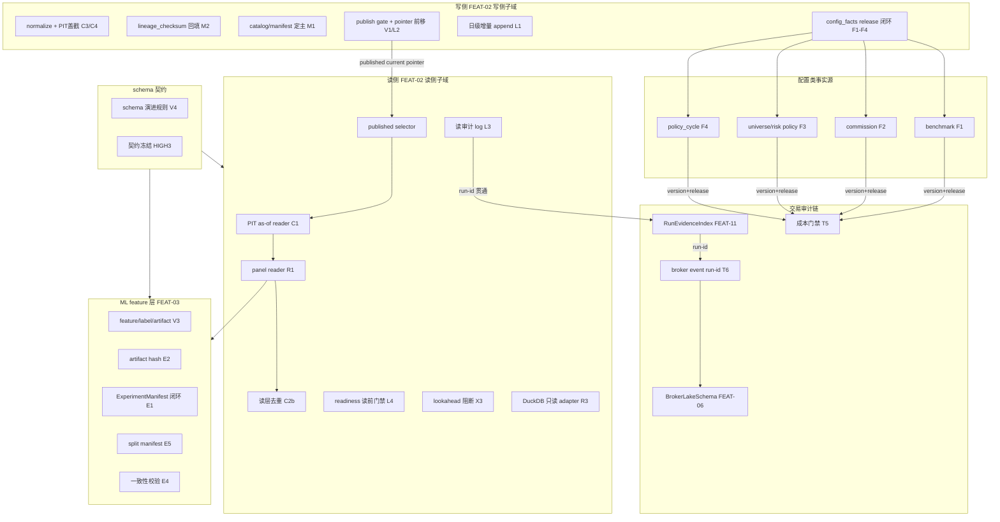

# HLD — Strategy Data Foundation（CR-139 companion HLD）

> 本 HLD 是 CR-139「Strategy Data Foundation」parent CR 的 companion HLD，按评审 D2 决策新开，命名「Strategy Data Foundation」。它收口 `process/HLD-DATA-LAKE.md`（CR-018，从未过 CP3、与实现漂移）的范围，按**写侧/读侧分离**结构组织（AGA-1 推荐方案 A1，CP3 已确认 2026-06-28T17:30:00+08:00）。覆盖市场数据湖写侧 + 读侧 + 研究数据集/因子面板 + ML feature/label/artifact + run evidence + broker facts + 交易审计链 + 配置类事实源全数据底座，支撑多因子 + ML 策略从信息收集→回测→模拟盘→实盘全流程可信/可复现/可审计。

## 修订记录

| 版本 | 日期 | 修订人 | 变更要点 |
|---|---|---|---|
| 0.1 | 2026-06-28 | meta-se | CR-139 CP3 首版 companion HLD：写侧/读侧分离结构；四组门禁落 CP3 门禁（D7）；Wave1 基线门（REQ-247）；既有合同闭环边界（d2 14 项标注既有代码位置，不重复设计）；D1-D8 决策落地；V4 schema 冻结前置模拟盘前（HIGH3）；14+ 章节齐全 + Gotchas；AGA-1/3/5 推荐方案 CP3 已确认 A1/C1/E1。 |
| 0.2 | 2026-06-28 | host-orchestrator | CP3 approved，AGA-1/3/5 确认 A1/C1/E1，pending-cp3 → confirmed-cp3。 |

---

## 1. 问题定义

### 1.1 问题陈述

数据湖模块当前是"已验证的小窗口市场数据链路"：catalog 登记了 17 个 dataset，但 `published` 全为 false、`lineage_checksum` 17/17 缺失、prices 下堆积 38 个 run_id 分区、`read_canonical` glob-concat 全量分区导致 `(symbol,trade_date)` 可能重复、ML 实验绕过 lake 走 `--data-dir`/`load_local_frames`、candidate/gold/published 三层全空、DuckDB 只读护栏已写但 adapter 空。无法支撑多因子 + ML 策略从信息收集→回测→模拟盘→实盘全流程可信/可复现/可审计。

### 1.2 价值

把数据湖推进为**策略生产数据底座**，使四阶段全流程满足四组门禁集（数据/研究/ML/交易生产），消除前视偏差、重复污染、版本漂移、训练-实盘不一致、审计断链、配置归因不可复现等失真源。

### 1.3 目标（量化）

| 目标 ID | 目标 | 量化成功标准 |
|---|---|---|
| G-1 | 读侧四道 P0 防线 | PIT as-of reader 对"未来财报"用例读不到（0 条泄漏）；`(symbol,trade_date)` 在读层去重后唯一（重复键=0）；catalog current pointer 指向已发布 release（validate pass 自动前移次数=0）；panel reader 输出多表 as-of 宽表且只含 published 数据（未发布行=0） |
| G-2 | ML 不旁路 | ML 实验脚本 `--data-dir`/`load_local_frames` 旁路调用次数=0；feature/label/artifact 100% 带版本 + schema + lineage |
| G-3 | run-id 全程贯通 | 信号→数据→执行审计链同 run-id 贯通率=100%；断链标注断点（伪造贯通次数=0） |
| G-4 | 配置类事实源版本化 | benchmark/commission/universe·risk policy/政策周期 4 类配置 100% 带 version + effective_from + release_id；缺版本复现声明阻断次数=100% |
| G-5 | schema 契约模拟盘前冻结 | 模拟盘启动前 SchemaContractFreeze.status=frozen；reader 兼容回退覆盖率=100% schema 变更类型 |
| G-6 | 整改可归因 | T8 清册覆盖 17→N dataset 全量；T7 黄金值快照整改前后差异 100% 归因到"结构修复"或"历史数据变化"二者之一 |
| G-7 | 既有合同闭环 | d2 14 项既有合同 100% 接通闭环（不重复设计）；d1 6 项纯新建 100% full-lld |

### 1.4 约束

- 四组门禁集为 CP3 必过门禁（D7/REQ-246）。
- Wave1 任何结构性变更必须在 T8 清册→T7 黄金值→C2a 重复画像之后执行（REQ-247）；物理分区迁移/候选压缩后置到基线冻结之后。
- V4 schema 契约冻结必须前置到模拟盘前（评审 HIGH3，Wave2）。
- 既有合同闭环非新建（REQ-249）：d2 14 项不重复设计，走集成闭环 LLD。
- DuckDB 只读引擎，parquet 仍是存储（D4）；ML feature 层 lake `features/` 子层带版本，保留切换独立 store 条件（D5/DEF-139-01）。
- 不授权 runtime/NAS/QMT/trading/provider-lake-catalog 写入/物理分区迁移/Git remote write（REQ-248）。

### 1.5 非目标

- 不重命名存量 run_id（D3：新数据规范化 + 旧数据下次重跑替换）。
- 不把 DuckDB 设为主存储或持久事实源。
- 不在本 HLD 拆 Story / 写 LLD / 实现代码（HLD 锁，规则 2）。
- 不修改 USE-CASES/REQUIREMENTS（CP2 已定稿）；不修改 feature DESIGN 三件套（CP5 后 meta-dev）。
- 不修改 HLD-DATA-LAKE.md 正文（仅标注 superseded-in-scope）。

### 1.6 关键假设

- 当前为日频离线研究 + 模拟盘场景，无在线特征 serving（支撑 AGA-3 C1）。
- catalog 单文件可承载 17→N dataset（支撑 AGA-2 B1）。
- 四类配置的版本化语义可用 `version + effective_from + release_id` 统一表达（支撑 AGA-5 E1）。
- D8a/D8b 已在 CP2 正式确认（CR-139 v0.2，用户 2026-06-28T16:05:00+08:00 approve）。

### 1.7 缺失信息

- AGA-1/AGA-3/AGA-5 三项架构走向决策已由 host-orchestrator live 用户确认采纳推荐 A1/C1/E1（2026-06-28T17:30:00+08:00 CP3 approved），状态 confirmed-cp3。

---

## 2. 候选架构方案对比

| 维度 | 方案 S1：写侧/读侧分离 companion HLD（推荐） | 方案 S2：扩 HLD-DATA-LAKE 不分读写 | 方案 S3：读侧拆独立 FEAT-02R + 独立 HLD |
|---|---|---|---|
| 核心思路 | 同属 FEAT-02，HLD 分写侧章 + 读侧章；写侧 normalize/publish/lineage，读侧 PIT/panel/dedup/selector/audit | 在 HLD-DATA-LAKE 上扩范围，不分读写章 | 读侧拆独立 Feature + 独立 HLD |
| 优点 | 边界清晰、不增 Feature、与既有蓝图最小冲突、可回退 | Feature 数不增 | 边界最清 |
| 缺点 | FEAT-02 内部需明确读写子域文件所有权 | 读侧语义与写侧重叠难收口、与 D2 冲突 | 增 Feature、与 FEAT-03 panel reader 消费重叠 |
| 复杂度 | 中 | 低（但隐性高） | 高 |
| 扩展性 | 高 | 中 | 高 |
| 风险 | CP5 读写文件所有权冲突 | 范围收口失败 | 蓝图复杂度上升 |
| 适用前提 | D2 写侧/读侧分离决策 | 不适用（与 D2 冲突） | A1 出现读写冲突时 |
| 推荐 | **推荐（A1，CP3 已确认）** | 不推荐 | 备选 fallback |

---

## 3. 蓝图承接

承接 `docs/design/BLUEPRINT.md` v1.13 CR-139 增量：

- **Feature 边界**：FEAT-02（写侧 + 读侧子域）、FEAT-03（ML feature 层）、FEAT-06（交易审计链）、FEAT-11（run evidence）、FEAT-12（commission 配置层）、FEAT-14（universe·risk policy 配置层）。
- **数据归属**：写侧 PublishedRelease/CatalogCurrentPointer/LineageChecksum/IncrementalAppendPlan/ConfigFactRelease；读侧 PITAsOfReader/PanelReader/ReadAuditLog/ReadinessGate/DuckDBReadOnlyAdapter；ML feature 层 FeatureArtifact/FeatureVersionSchema/LabelArtifact/ModelArtifactHash/SplitManifest；交易审计链 BrokerLakeAuditChain/BrokerEventRunIdLink/RunEvidenceRunIdLink；配置类事实源 BenchmarkFactSource/CommissionFactSource/UniversePolicyFactSource/RiskPolicyFactSource/PolicyCycleFactSource/PITUniverseConstituentChain。
- **依赖方向**（DOMAIN-MAP v1.12 / DEPENDENCY-MAP v1.12）：reader → published current pointer（非 raw）、ML → panel reader（非旁路）、broker facts/RunEvidenceIndex → 数据 run-id 贯通、配置类事实源 → release 闭环（复用 V1 pointer 语义）；禁止反向（FD-46..53）。
- **跨 Feature 流程**：FLOW-20..25。

---

## 4. 架构灰区与方案形成记录

详见 `process/discussions/CP3-HLD-DISCUSSION-LOG.md` 与 `process/checks/CP3-DISCUSSION-CHECKPOINT.json`。6 个灰区：

| 灰区 | 推荐方案 | 状态 |
|---|---|---|
| AGA-1 写侧/读侧分离边界 | A1 分层同属 FEAT-02 + HLD 分读写章 | **confirmed-cp3**（CP3 已确认 A1/C1/E1） |
| AGA-2 published pointer 与 catalog 主从 | B1 catalog 为主（既定 REQ-208） | 既定 |
| AGA-3 ML feature 层归属与切换条件 | C1 lake features/ 子层 + DEF-139-01 | **confirmed-cp3**（CP3 已确认 A1/C1/E1） |
| AGA-4 run-id 贯通与读审计 | D1 reader 读审计 + run-id 贯通（既定 REQ-233/242） | 既定 |
| AGA-5 配置类事实源版本化机制 | E1 复用 V1 pointer 语义 + config_facts 子目录 | **confirmed-cp3**（CP3 已确认 A1/C1/E1） |
| AGA-6 schema 演进与契约冻结 | F1 演进规则 + 兼容回退 + 模拟盘前冻结（既定 HIGH3） | 既定 |

> 三项决策已由 host-orchestrator live 用户确认采纳推荐 A1/C1/E1（2026-06-28T17:30:00+08:00 CP3 approved），状态 confirmed-cp3。回退条件保留：CP5 读写冲突频繁 → 升级 A3；feature 规模/在线 serving → 切换 C2 另起 CR；policy_cycle 语义差异过大 → 该类独立。

---

## 5. 推荐方案总览

**策略生产数据底座，写侧/读侧分离**：

- **写侧**（FEAT-02 写侧子域）：normalize（PIT 盖戳 available_at）、写入去重（C4）、lineage_checksum 回填（M2）、publish/pointer 前移（V1/L2）、日级增量 append（L1）、events schema 修复（C3）、catalog/manifest 定主（M1）、配置类事实源 release 闭环（F1）、schema 演进规则（V4 写侧）。
- **读侧**（FEAT-02 读侧子域）：PIT as-of reader（C1）、统一 panel reader（R1）、读层去重（C2b）、published selector、读审计 log（L3）、readiness 读前门禁（L4）、decision_time lookahead 阻断（X3）、DuckDB 只读 adapter（R3）、列裁剪/谓词下推（R4）、replay（L5）。
- **ML feature 层**（FEAT-03）：feature/label/artifact 持久化层（V3，lake `features/` 子层带版本）、ExperimentManifest 闭环（E1）、模型 artifact hash（E2）、label 泄漏统一 gate（E3）、离线/在线一致性（E4）、split manifest 冻结（E5）、ML 接入 lake 废除旁路（R2）。
- **交易审计链**（FEAT-06/11）：BrokerLakeSchema 闭环实盘写 + 审计链（T4）、run-id 贯通（T6）、读审计 log run-id 关联（L3）、成本前置门禁（T5）。
- **配置类事实源**（FEAT-02/12/14/03）：benchmark/commission/universe·risk policy/政策周期 4 类版本化 + release 闭环（F1-F4），复用 V1 published pointer 语义，物理存储独立 `config_facts/` 子目录。
- **schema 契约**（FEAT-02/03）：schema 演进规则 + reader 兼容回退 + 模拟盘前冻结（V4）。
- **跨源时点一致性**（FEAT-02/14）：复权因子 PIT 校验（X1）、跨源交易日历/时区（X2）、PIT universe 成分链（X4）。

**关键架构风格**：分层（写侧/读侧/ML/审计/配置）+ 发布门禁单一入口（publish gate）+ run-id 单向贯通 + 版本化事实源 + 读侧安全门禁链。

**适用条件**：日频离线研究 + 模拟盘场景；无在线特征 serving；D8a/D8b 已确认。

---

## 6. 适用性矩阵

| 维度 | 适用性 | 说明 |
|---|---|---|
| 用户目标 | 高度适用 | 直接服务可信/可复现/可审计三大目标 |
| 项目成熟度 | 适用 | 数据湖已有 17 dataset + 既有合同，整改为闭环非新建 |
| 认知负担 | 中 | 写侧/读侧分离 + 四组门禁需文档支撑，但分层清晰 |
| 验证条件 | 适用 | 四道 P0 防线可量化验证（泄漏=0/重复=0/未发布=0） |
| 回退成本 | 低 | A1 不增 Feature，CP5 读写冲突可升级 A3；既有合同闭环保留既有代码 |

---

## 7. Use Case → Architecture Traceability

| UC | persona | 阶段 | 支撑整改项（REQ） | 架构落点 |
|---|---|---|---|---|
| UC-51 | P-04 | 信息收集 | T8(213)/T7(212) | 写侧清册 + 黄金值基线；Wave1 基线门（REQ-247） |
| UC-52 | P-03/P-04 | 回测 | C1(204)/C2(205)/V1(232)/R1(214)/C3(206)/C4(207)/M1(208)/M2(209)/N1(201) | 读侧四道 P0 防线 + 写侧 normalize/lineage |
| UC-53 | P-03 | 回测→ML | R2(215)/V3(219)/E1(221)/E2(222)/E3(223)/E4(224)/E5(225)/R3(216) | ML feature 层 + ML 接入 lake + DuckDB 只读 |
| UC-54 | P-07/P-04 | 模拟盘 | L1(243)/L2(244)/L4(234)/V2(218) | 写侧日级增量 + pointer 前移 + 读前门禁 |
| UC-55 | P-06/P-05 | 实盘可审计 | L3(233)/T6(242)/T4(240)/T5(241)/L5(245) | 读审计 + run-id 贯通 + broker facts 审计链 + 成本前置 |
| UC-56 | P-03/P-04 | 配置层 | F1(236)/F2(237)/F3(238)/F4(239) | 配置类事实源版本化 + release 闭环 |
| UC-57 | P-04/P-06 | 实盘契约 | V4(220)/X1(229)/X2(230)/X3(235)/X4(231)/N2(202)/N3(203)/M3(210)/M4(211)/R4(217)/T1(228)/T2(226)/T3(227) | schema 冻结 + 跨源时点一致性 + 测试回归 |

---

## 8. 关键场景模拟

### SIM-139-01：多因子回测因子收益可疑（UC-52）

P-03 跑多因子回测发现某因子在财报发布日前就有显著收益，怀疑前视。系统先输出 38 分区重复画像（C2a），P-04 建立 published pointer 确定性（V1），P-03 用 PIT as-of reader 读财报按 `available_at <= as_of` 过滤，构造"未来财报"断言读不到（C1），调 panel reader 多表 as-of join（R1），读层去重按 source_run_id 取最新（C2b）。四道防线全过 → 可疑收益被定位为前视/重复/版本之一并消除。异常路径：events schema 全 null → 写入侧修复类型推断（C3）；catalog/manifest 冲突 → catalog 为主（M1）+ lineage 回填（M2）。

### SIM-139-02：ML 训练-实盘特征偏差（UC-53）

P-03 上线后发现实盘特征与训练特征对不上（训练走 `--data-dir` 旁路，实盘读 lake）。系统废除旁路，ML 接入 `read_panel_as_of`（R2）；建 lake `features/` 子层带版本（V3）；模型 artifact 带 hash 引用 dataset snapshot（E2）；ExperimentManifest 闭环 published release（E1）；split cutoff 冻结入 ExperimentManifest（E5）；label 泄漏统一 gate（E3）；离线/在线一致性校验，不一致阻断（E4）。全量加载撑不住 → DuckDB 只读 adapter（R3，D4 只读）。成功路径：ML 读同一可信 panel、模型可按 snapshot 复现、训练-实盘一致。

### SIM-139-03：实盘复盘异常成交全程审计链（UC-55）

P-06 复盘异常成交，需从信号回溯到数据→执行。系统 reader 落读审计 log 并与 RunEvidenceIndex 同 run-id 贯通（L3）；数据 run-id 贯穿 RunEvidenceIndex 和 broker event（T6）；BrokerLakeSchema 接通实盘写 + 订单/成交/持仓审计链（T4）；CommissionSchedule 前置成本门禁（T5）；复盘用 replay 按 published as_of 重放单日快照（L5）。P-06 用同一条 run-id 从异常成交回溯到数据版本、订单、成交、对账，定位根因。异常路径：run-id 断链 → 标注断点，不伪造贯通。

---

## 9. 系统架构图

---

## 10. 高层模块与职责划分

| 模块 | 子域 | 职责 | Owner | 关键文件 |
|---|---|---|---|---|
| 写侧 | normalize/publish/lineage | 规范写入、PIT 盖戳、去重、lineage、publish、增量 | FEAT-02 写侧 | `market_data/normalization.py`、`publish.py:605`、`incremental.py:248`、`catalog.py`、`manifest.py`、`lake_layout.py` |
| 读侧 | PIT/panel/dedup/selector/audit | PIT as-of、panel join、去重、published selector、读审计、门禁 | FEAT-02 读侧 | `market_data/readers.py:2728 read_dataset`、新增 `read_panel_as_of`、`readiness.py:462`、`duckdb_query.py`、`replay.py:215` |
| ML feature 层 | feature/label/artifact | 持久化、版本化、hash 闭环、一致性 | FEAT-03 | 新增 `features/` 子层、`engine/research_manifest.py:152`、`engine/strategy_admission_package.py:127`、`engine/factor_model_validation.py`、`engine/factor_robustness.py:53` |
| 交易审计链 | broker facts/run evidence | 实盘写、审计链、run-id 贯通、成本前置 | FEAT-06/11/12 | `trading/broker_lake.py`、`trading/strategy_runner/evidence_index.py:19`、`trading/qmt_gateway_contracts.py:997` |
| 配置类事实源 | benchmark/commission/policy | 版本化、release 闭环 | FEAT-02/12/14/03 | `market_data/benchmarks.py:99/114`、`engine/mature_multifactor_framework.py:228`、`config/policy_cycles.yaml` |
| schema 契约 | 演进/冻结 | 演进规则、兼容回退、模拟盘前冻结 | FEAT-02/03 | `engine/contracts.py`、`market_data/readers.py` |

---

## 11. 技术选型与理由

| 选型 | 决策 | 理由 |
|---|---|---|
| DuckDB | 只读查询引擎，parquet 仍是存储（D4） | 护栏已就位，避免持久事实源分叉；CP3/CP5 批准才引入依赖 |
| ML feature 层 | lake `features/` 子层带版本（D5） | 与 release 闭环天然一致、不引入新依赖；保留切换独立 store 条件（DEF-139-01） |
| 配置类事实源版本化 | 复用 V1 published pointer 语义 + 独立 config_facts 子目录（AGA-5 E1） | 机制统一、减分叉；物理存储独立避免与 canonical 混淆 |
| catalog/manifest | catalog 为主、manifest 为派生（M1） | 单一真相源、与 publish gate 语义一致 |
| run-id 贯通 | 数据 run-id 单向贯穿 reader→RunEvidenceIndex→broker event | 满足可审计目标；消费方只读不反向 |
| schema 契约 | 演进规则 + reader 兼容回退 + 模拟盘前冻结（V4 HIGH3） | 实盘契约稳定、reader 不崩 |

---

## 12. 关键流程

### 12.1 写侧 publish 闭环（V1/L2/M1/M2）

normalize（PIT 盖戳 + 去重 C4）→ lineage_checksum 回填（M2）→ catalog/manifest 定主（M1）→ publish gate → catalog current pointer 前移（V1/L2）。validate pass 不自动前移；reader 只消费 published current truth。**门禁**：publish gate 是 current pointer 唯一入口（RULE-02/54）。

### 12.2 读侧四道 P0 防线（C1/C2/V1/R1，CP3 必过 D7）

reader → published selector（只读 published）→ PIT as-of reader（`available_at <= as_of`）→ panel reader（多表 as-of join）→ 读层去重（source_run_id 取最新）。**四道防线**：PIT 强制、去重唯一、冻结快照、多表 as-of join。任一失败 blocked。

### 12.3 Wave1 基线门（REQ-247，CP2 用户追加约束）

T8 清册 → T7 黄金值基线 → C2a 重复画像 → **基线冻结门** → V1 pointer → C1 PIT → R1 panel → C2b 读层去重 → N1 物理迁移后置。结构性变更前基线必须已冻结；结构性变更后必须能对 T7 黄金值归因。

### 12.4 run-id 贯通审计链（L3/T6）

reader 读审计 log（L3）→ run-id 关联 RunEvidenceIndex（FEAT-11）→ run-id 贯穿 broker event（T6）→ BrokerLakeSchema 审计链（T4）。断链标注断点，不伪造贯通。

### 12.5 配置类事实源 release 闭环（F1-F4）

benchmark/commission/universe·risk policy/政策周期 → 版本化（version + effective_from）→ config_facts release（复用 V1 pointer 语义）→ current pointer → 消费方。缺版本阻断复现声明。

### 12.6 schema 契约模拟盘前冻结（V4 HIGH3）

schema 变更 → SchemaEvolutionRule 分级（兼容/破坏）→ reader 兼容回退 → 模拟盘前 SchemaContractFreeze.status=frozen。未冻结不得进模拟盘。

---

## 13. 非功能需求设计

| NFR | 设计 |
|---|---|
| 性能 | DuckDB 只读 adapter 解决 pandas concat 全量加载（R3）；列裁剪/谓词下推（R4）；读层去重按 source_run_id 取最新避免 glob 全量 |
| 可扩展性 | catalog 分片（若单文件瓶颈，AGA-2 B1 切换条件）；feature 层可切换独立 store（DEF-139-01） |
| 可用性 | 读前 readiness 门禁阻断旧/缺数据；publish gate 可回滚（rollback_target） |
| 安全 | 不授权 runtime/NAS/QMT/trading/物理分区迁移/Git remote write（REQ-248）；DuckDB 只读不写持久事实源；broker lake 外置脱敏 |
| 可维护性 | 写侧/读侧分离清晰；既有合同闭环不重复设计（d2）；schema 演进规则可维护 |
| 可审计性 | run-id 全程贯通；读审计 log；lineage_checksum；catalog triggered_by_cr + run_lineage（M4） |

---

## 14. 主要风险与应对

| 风险 ID | 风险 | 应对 |
|---|---|---|
| R-1 | 45 项整改范围广，CP3/CP4/CP5 工作量大 | 按 Wave 分批；MVP 聚焦 Wave1 P0 四道防线 |
| R-2 | 既有合同闭环（d2）误判为新建导致重复设计 | REQ-249 约束 + §0 核验 + d2 项标注既有代码位置 |
| R-3 | AGA-1/3/5 三项架构走向决策已 CP3 确认（A1/C1/E1） | CP3 已确认 A1/C1/E1（2026-06-28T17:30:00+08:00），风险关闭；回退条件保留 |
| R-4 | DuckDB 引入依赖需 CP3/CP5 批准 | D4 只读引擎定位；CP2 不修改 pyproject.toml |
| R-5 | Wave1 结构性变更污染基线归因 | REQ-247 基线门；N1 物理迁移后置 |
| R-6 | run-id 贯通跨 4 Feature 契约复杂 | T6 owner = FEAT-02 写侧生成，消费方只读；断链标注不伪造 |
| R-7 | schema 演进兼容回退维护成本 | V4 分级演进；若成本过高收紧为冻结不演进（AGA-6 F2） |
| R-8 | HLD-DATA-LAKE superseded-in-scope 边界模糊 | 本 HLD 显式收口其范围；既有 (a) 6 项消费其契约不重复设计 |

---

## 15. ADR 候选决策点

详见 `process/docs/design/ARCHITECTURE-DECISION-STRATEGY-DATA-FOUNDATION.md`。核心 ADR：D1 新开 parent CR / D2 companion HLD / D3 不重命名 / D4 DuckDB 只读 / D5 lake features 子层附条件 / D6 强制基准 / D7 四组门禁 CP3 必过 / D8a d1 纳入 / D8b d2 纳入不重复设计 + Wave1 基线门（REQ-247）+ V4 模拟盘前冻结（HIGH3）+ AGA-1/3/5 confirmed-cp3 (A1/C1/E1)。

---

## 16. 分阶段落地建议

承接 CR-139 §6 Wave 路线：

- **Wave1（P0，解锁回测）**：T8 清册 → T7 黄金值 → C2a 画像 → 基线冻结门 → V1 pointer → C1 PIT → R1 panel → C2b 读层去重 → N1 后置。
- **Wave2（P1，解锁 ML+模拟盘）**：V4 schema 冻结 → R2 ML 接入 → V3 feature 层 + E1/E2/E5 → R3 DuckDB → L1/L2 增量 → E3/E4 泄漏 + 一致性 → F1/F2/F3 配置层 → T4/T5/T6 审计链 → X1/X2/X3/X4 一致性 → L3/L4 读审计 + 门禁 → T2/T3 测试 → N1/C3/M1 收尾。
- **Wave3（P2）**：L5 replay、R4 延迟优化、T1、M3/M4、F4。

---

## 17. Feature 级实现设计触发条件

| Feature | 是否需要 implementation-design | 触发原因 | 目标产物 |
|---|---|---|---|
| FEAT-02（写侧+读侧） | required（CP5 后） | 数据模型、publish gate、跨模块契约、DuckDB 事实边界、读写子域文件所有权 | `docs/features/market-data-lake/DESIGN.md`（重写，CP5 后 meta-dev） |
| FEAT-03（ML feature 层） | required（CP5 后） | feature schema、artifact hash、跨模块契约、离线/在线一致性 | `docs/features/factor-research-loop/DESIGN.md`（增量） |
| FEAT-06（交易审计链） | required（CP5 后） | broker lake 实盘写、审计链、run-id 贯通 | `docs/features/qmt-trading-governance/DESIGN.md`（增量） |

每个 Story 的 `lld_policy`：d1 纯新建 = full-lld；d2 既有合同闭环 = technical-note；a 已设计未实现 = technical-note（消费既有 HLD 契约）；c 范围扩展 = full-lld；b 设计过期 = full-lld（C2 结构性）/ technical-note（命名整理类）。详见 FEATURE-DESIGN-MATRIX v1.12。

---

## 18. 下沉到 Feature 设计的内容

下列不在本 HLD 展开，由 `docs/features/<feature>/DESIGN.md`（CP5 后 meta-dev）承接：

- 读侧 reader 的具体接口签名、错误码、失败策略（C1/R1/C2b/L3/L4/X3）。
- ML feature 层的 schema 字段字典、计算 spec、版本兼容规则（V3/E1-E5）。
- broker lake 审计链的事件 schema、脱敏策略、retention（T4/T6）。
- 配置类事实源每类的具体 version 字段、effective_from 语义、release 触发（F1-F4）。
- schema 演进规则的具体分级标准、reader 兼容回退实现（V4）。
- DuckDB adapter 的查询边界、谓词下推实现（R3/R4）。

---

## 19. 工作量粗估

| Wave | 整改项数 | Story 量级（粗估） | 备注 |
|---|---|---|---|
| Wave1 P0 | T8/T7/C2a/V1/C1/R1/C2b + N1 后置（8 项） | 7-9 Story | 四道 P0 防线 + 基线门 |
| Wave2 P1 | V4/R2/V3+E1E2E5/R3/L1L2/E3E4/F1F2F3/T4T5T6/X1-X4/L3L4/T2T3/N1C3M1（约 30 项） | 18-24 Story | ML + 模拟盘 + 审计链 + 配置层 |
| Wave3 P2 | L5/R4/T1/M3M4/F4（约 7 项） | 5-7 Story | 实盘运维 |
| 合计 | 45 项 | 约 30-40 Story | 与 §16 分阶段一一对应 |

---

## 20. 待确认问题

| 问题 ID | 问题 | 状态 |
|---|---|---|
| O-1 | AGA-1 写侧/读侧分离边界（A1 vs A3） | RESOLVED，confirmed-cp3 (A1/C1/E1, 2026-06-28T17:30:00+08:00) |
| O-2 | AGA-3 ML feature 层归属与切换条件（C1 vs C2） | RESOLVED，confirmed-cp3 (A1/C1/E1, 2026-06-28T17:30:00+08:00) |
| O-3 | AGA-5 配置类事实源版本化机制（E1 vs E2） | RESOLVED，confirmed-cp3 (A1/C1/E1, 2026-06-28T17:30:00+08:00) |
| O-4 | DuckDB 依赖引入时机 | RESOLVED 2026-06-28（D4 只读，CP3/CP5 批准） |
| O-5 | D8a/D8b 纳入口径 | RESOLVED 2026-06-28T16:05:00+08:00（CP2 用户 approve） |

---

## 21. HLD 自审记录

| 检查项 | 结果 | 证据 |
|---|---|---|
| 14+ 章节齐全 + Gotchas | PASS | §1-21 + §Gotchas |
| 写侧/读侧分离结构 | PASS | §5/§9/§10（AGA-1 A1，CP3 已确认） |
| 四组门禁落 CP3 门禁（D7） | PASS | §12.2 + §1.3 G-1 |
| Wave1 基线门（REQ-247） | PASS | §12.3 |
| 既有合同闭环边界（d2 14 项标注既有位置） | PASS | §10 + §0 核验 |
| ADR 回写（D1-D8 + Wave1 + V4） | PASS | §15 + ADR 文件 |
| 目标量化（规则 2） | PASS | §1.3 G-1..G-7 |
| Use Case → Architecture Traceability | PASS | §7 |
| 场景模拟 ≥2-3 | PASS | §8 SIM-139-01..03 |
| 不授权范围声明 | PASS | §1.4 + REQ-248 |
| AGA 推荐方案 CP3 已确认 A1/C1/E1 | PASS | §4/§20 O-1..O-3 |
| Story 数/Wave 数与分阶段对应（规则 11） | PASS | §16/§19 |

---

## Gotchas（规则 9）

> 实质性 Gotchas，非占位。

1. **"validate pass ≠ published current truth" 是反复踩的坑**：handoff 明确 `read_dataset` 已有 published 门禁（`readers.py:2778`），但 candidate/gold/published 三层全空 + 17/17 `published=false`。CP5 LLD 必须强调 validate pass 自动前移 current pointer 是非法转换（SM-27），否则调参偷看未来防线形同虚设。Reader 任何"读 candidate 当 truth"的路径都是 FD-47 违规。

2. **d2 既有合同闭环不是"新建"，但也不是"不用动"**：14 项 d2 整改的合同真实存在（§0 核验），但都是"dry-run only / 部分支持 / 分散存在 / 缺版本化"。LLD 若按"新建"设计会重复造轮子（RISK R-2），若按"已存在不用动"会漏掉闭环/版本化/前置门禁的实际工作。必须按"接通闭环 + 版本化扩展 + 前置门禁"路由 technical-note LLD，并引用既有代码位置。

3. **Wave1 顺序不可调（REQ-247 是 CP2 用户追加约束，非建议）**：结构性变更（V1/C1/R1/C2b/N1）必须在 T8→T7→C2a 之后。若 CP5 Story 调度把 V1 pointer 排在 T7 黄金值之前，整改后差异无法归因"结构修复 vs 历史数据变化"——这是 D6 强制基准的核心目的。N1 物理分区迁移明确后置到基线冻结之后，CP3 不授权物理分区迁移。

4. **ML 旁路（`--data-dir`/`load_local_frames`）是 FD-48 硬禁止，但废除旁路要先有可信读路径**：R2（废除旁路）依赖 R1（panel reader）+ V3（feature 层）就位。若 CP5 把 R2 排在 R1/V3 之前，ML 会无路可走。依赖顺序：R1 → V3 → R2。

5. **run-id 贯通（T6）跨 4 Feature，owner 是 FEAT-02 写侧生成，消费方只读**：常见坑是把 run-id 贯通的"设计"摊给 FEAT-06 或 FEAT-11，导致生成侧与消费侧 schema 不一致。run-id 必须由 FEAT-02 写侧在 publish 时生成并写入 lineage，FEAT-11/06 只读消费并关联（FD-51 禁止断链静默成功）。

6. **DuckDB 是只读引擎，不是存储（D4）**：护栏已写但 adapter 空。CP5 引入依赖时，任何 `.duckdb` 持久事实源、DuckDB 写 lake、DuckDB 替代 catalog/manifest 都是 FD-49 违规。parquet 仍是存储，DuckDB 只读查询。

7. **schema 契约冻结是模拟盘前必过（HIGH3），不是实盘运维尾部**：评审明确把 V4 从 Wave3 移入 Wave2。若 CP5 把 V4 排到模拟盘之后，runner 读湖会因 schema 变更崩。SchemaContractFreeze.status=frozen 是模拟盘启动前置（SM-31）。

8. **配置类事实源复用 V1 pointer 语义（AGA-5 E1），但物理存储独立 config_facts 子目录**：常见坑是把配置版本化混入 market data canonical，导致配置变更被数据 publish 节奏卡死，或数据 publish 触发不必要的配置 release。config_facts 独立子目录 + 复用 pointer 语义是平衡点；policy_cycle（F4 P2）若周期语义差异大可局部独立。

9. **HLD-DATA-LAKE 是 superseded-in-scope，不是废弃**：(a) 6 项（C1/R3/R4/V1/M2/T1）的契约仍消费 HLD-DATA-LAKE §5/§14/§17，不重复设计。但范围收口到本 companion HLD。CP5 LLD 引用 HLD-DATA-LAKE 时以本 HLD 范围为准。

10. **AGA-1/3/5 三项决策已 CP3 确认 A1/C1/E1**：本 HLD 以 A1/C1/E1 推进，CP3 已确认（2026-06-28T17:30:00+08:00 approved）。回退条件保留：若后续 CP5 出现读写文件所有权冲突频繁 → 升级 A3；feature 规模/在线 serving → 切换 C2 另起 CR；policy_cycle 语义差异过大 → 该类独立。切换时需回退刷新 BLUEPRINT/DOMAIN-MAP/DEPENDENCY-MAP/FEATURE-DESIGN-MATRIX + 本 HLD 对应章节。
