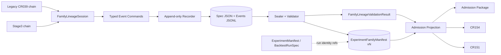

# 高层设计（HLD）：CR163 Trial Lineage Instrumentation

## 修订记录

| 版本 | 日期 | 修订人 | 变更要点 |
|---|---|---|---|
| 0.1 | 2026-07-11 | meta-se-critical | 初始 CP3 HLD；冻结候选方案、公共对象、session/event API、JSON/JSONL、状态/count、seal/supersession、producer/consumer 集成与五 Story 输入。 |

## 1. 问题定义

现有研究链能生成候选和单次 run `ExperimentManifest`，但 experiment-family trial lineage 仍由调用方在研究后手工提供 count，无法证明 family 在搜索前声明、失败/取消/排除 trial 未被删减、retry 与 seed 未混计，也无法为 CR151/CR154/admission package 合法提供 `ExperimentFamilyManifest=present`。CR163 建立未来原生 research run 的 raw lineage 事实源，不计算多重检验或 effective trial count。

### 目标与量化成功标准

| 优先级 | 目标 | 度量 |
|---|---|---|
| P0 | pre-search lifecycle | 2/2 producer chains 在首 trial 前 declare；post-hoc fixture 100% blocked |
| P0 | complete append-only lineage | orphan trial=0，orphan selection=0；failed/cancelled/excluded retention=100% |
| P0 | count correctness | raw count 等于 distinct stable trial ids；seed A/B=2 trials；1 trial 3 attempts 仍 raw=1 |
| P0 | deterministic integrity | 同 fixture seal 10 次 hash distinct count=1；sealed in-place mutation=0 |
| P0 | inventory coverage | CPI-CR163-001..004 mapping=4/4，2 条 deduplicated chains=2/2 |
| P0 | availability ceiling | positive present 100%；uninstrumented typed_unavailable 100%；invalid/tampered blocked 100% |
| P0 | scope safety | effective available claims=0，C1 computed claims=0，forbidden operation counters=0 |
| P0 | negative regression | CR155 blocked 1/1，historical backfill count=0 |

### 约束

- `ExperimentManifest` 继续表示一个 run；family lineage 是独立 lifecycle，通过 `run_id`、`experiment_id`、artifact refs 连接。
- 本地、确定、可 diff 的 JSON/JSONL；无 DB、MLflow、外部 registry 或共享 runtime。
- sealed immutable；修正只能 supersession，旧 ref/hash/version 永久可验证。
- 只接入既有 CR151/CR154/admission package，不新建 gate family。
- CP3 仅设计，不授权 source/tests、真实数据/runtime、credential、外部写入、统计计算、历史回填、release/publish。

### 非目标与相邻职责

- `ExperimentManifest`：单次 run 配置与报告，不拥有 family membership。
- CR151 statistical gate：计算/评估统计证据；CR163 只提供 raw count/ref，不改变其 threshold/policy。
- CR154 reliability gates：消费 count/evidence summary；CR163 不计算 effective count。
- admission package：聚合最差状态；不得写 lineage 或放宽 runtime authorization。
- FU-CR161-002：未来 multiple testing / effective trial / PBO/DSR；不在 CR163。
- 历史 CR155 reconstruction、real ML/event runner、lake/NAS/provider/broker/trading 均不在范围。

### 缺失信息

无阻断缺失信息。公共对象、存储、API 与 integration 由本 HLD提出为 CP3 decision items；批准前不实施。

## 2. 架构灰区与方案形成记录

| AGA | 问题 | 为什么改变架构 | 影响面 | 选择 |
|---|---|---|---|---|
| AGA-CR163-01 | event-command vs lifecycle-session | 决定 producer 接入负担、审计粒度和 hook 防绕过 | 模块/API/验证 | session façade + internal event commands |
| AGA-CR163-02 | snapshot vs JSONL vs DB | 决定 append-only、并发、恢复和部署成本 | storage/integrity/maintenance | immutable spec JSON + append-only events JSONL + manifest JSON |
| AGA-CR163-03 | canonical seal 与 supersession head | 决定 hash 跨运行一致性和 tamper/recovery | security/validation | restricted canonical JSON + SHA-256；chain 是真相，latest 仅可重建缓存 |
| AGA-CR163-04 | legacy manual count | 决定是否仍允许 post-hoc bypass | integration/risk | reconciliation-only；不能生成 present |

### Advisor Table

| Option | Pros | Cons | Impact Surface | Recommendation | Assumptions / When to switch |
|---|---|---|---|---|---|
| Session façade + event commands | producer 调用清晰；内部保留逐事件审计；容易 enforce ordering | 需同时维护 façade 与 command schema | API、2 chains、tests、docs | 推荐 | 单进程/本地 recorder；跨语言时可公开 command transport |
| Pure event-command API | 最透明、易重放 | 每个 producer 负责状态协调，容易漏 command | producer maintenance、failure paths | 条件推荐 | producer 数显著增加或引入消息系统 |
| Session snapshot only | 接入最少 | 不能可靠证明失败/retry 历史，容易后验删减 | integrity、audit | 不推荐 | 仅能用于非审计 exploratory，不满足本 CR |
| Local JSON/JSONL | 无服务依赖、diff友好、确定性强 | 多进程并发能力有限 | storage/deploy/rollback | 推荐 | 单机顺序写；并发 writer 出现时重启 storage ADR |
| SQLite/registry | transaction/concurrency 更强 | 增加 schema migration/runtime/shared owner | deploy/security/maintenance | 暂缓 | 多进程并发或 family 规模使 JSONL 原子追加不足 |

方案形成输入来自 CP2 已确认的 4 个 SGQ、CR161 contract-first/typed-unavailable baseline、产品 12 个 P0 场景与现有源码契约。未调度额外 advisor lane，不伪造多角色意见。HLD 后评审意见仍为 pending。

Deferred：effective-trial/statistical producer、historical backfill、real ML/event runner、DB/registry backend；分别仅在独立 CR、方法与权限批准后重启。

## 3. 候选架构方案对比

### 方案 A（推荐）：Local Lifecycle Ledger

Producer orchestration 持有 `FamilyLineageSession`；façade 将 declare/trial/attempt/selection/seal 转为 typed event commands。Recorder create-only spec、append-only JSONL；Sealer/Validator 规范化重放后生成 immutable manifest 与 validation projection。

### 方案 B：Pure Event Command + Functional Fold

Producer 直接提交所有命令，validator 纯函数 fold 事件生成 manifest。审计最纯，但两个既有 producer 要理解完整状态机，漏写/顺序错风险更高。

### 方案 C：SQLite Lifecycle Registry

通过 transaction tables 保存 family/trial/attempt/selection 与 versions。适合并发和大规模查询，但引入 DB migration、transaction runtime 与更重运维，不符合当前最小本地约束。

| 维度 | A Local session+JSONL | B Pure commands+JSONL | C SQLite registry |
|---|---|---|---|
| 用户意图匹配 | 高 | 高 | 高 |
| producer 接入复杂度 | 中 | 高 | 高 |
| append-only 审计 | 高 | 高 | 高 |
| 本地确定性 | 高 | 高 | 中-高 |
| 并发扩展 | 低-中 | 低-中 | 高 |
| 部署/回滚成本 | 低 | 低 | 高 |
| 当前授权适配 | 高 | 高 | 低-中 |
| 推荐 | 是 | 备选 | 暂缓 |

选择 A。切换到 B：需要跨语言/transport-neutral public commands；切换到 C：出现多个并发 writer、需要事务性索引查询，且新 CR 批准 storage/runtime/migration。

## 4. 推荐方案总览与 HLD 拆分判定

复杂度为 `complex`：8 个 P0 requirements、12 个 P0 scenarios、两个 producer chain、六对象、多状态与三个 consumer surface。虽然覆盖 producer、storage、consumer，但它们共同围绕唯一核心产物 `ExperimentFamilyManifest` 与同一 lineage model，五 Story 强依赖，ADR 高度共享，拆分会制造双向 contract 引用。因此保持单份 HLD；Blueprint/Domain/Dependency 为配套视图而非独立 HLD。



## 5. 公共 Contract Freeze

最终持久化对象名：`ExperimentFamilySpec`、`ExperimentTrial`、`TrialAttempt`、`TrialSelection`、`ExperimentFamilyManifest`、`FamilyLineageValidationResult`。应用 façade：`FamilyLineageSession`。

### Producer contract

| 项 | 冻结语义 |
|---|---|
| 调用方向 | public wrapper 透传 config/context；producer orchestration 创建/接收 session；hook 通过 session 或返回后由 orchestration 记录，不得双写 |
| 调用时机 | declaration 严格早于 first trial；attempt start/terminal 与实际 lifecycle 同序；selection 在候选 decision 时；seal 在 family 结束后 |
| 触发 | candidate-producing search；CPI-001..004 四 mapping |
| 输入 | producer_chain_id、FamilySpec、run/experiment ids、normalized parameters、seed、attempt ordinal、terminal/selection reason、artifact refs |
| 输出 | event receipt、manifest ref/hash、raw count、validation result |
| 后续 | validated projection 进入 existing consumers |
| 降级 | 未 instrumented=typed_unavailable；post-hoc/incomplete/conflict=blocked；不得 fallback 手填 present |
| 调用方修改 | 两个 wrapper/orchestration 传 session/context；两个 hook 建立 selection/trial mapping；同链共享 family/trial identity |

### Recorder command semantics

Commands 至少覆盖 `DeclareFamily`、`DeclareTrial`、`StartAttempt`、`FinishAttempt`、`FinalizeTrial`、`RecordSelection`、`RequestSeal`、`AppendCorrection`、`RequestSupersedingSeal`。每个 command 有 `event_id/family_id/sequence/schema_version/payload`。同 event id + 相同 canonical payload 返回相同 receipt；不同 payload 返回 `identity_content_conflict` 并阻断 seal。Recorder 不接受 delete/update。

### Consumer projection contract

| 字段 | present | typed_unavailable | blocked |
|---|---|---|---|
| availability | present | typed_unavailable | blocked |
| lineage_ref/hash | sealed ref/hash | empty | offending/evidence ref where safe |
| raw_trial_count | validated positive integer | absent | recomputed/declared mismatch detail |
| effective_trial_count availability | typed_unavailable | typed_unavailable | typed_unavailable |
| effective ref/method | empty | empty | empty |
| validation_status | pass | unavailable_reason | blocked + machine codes |
| C1 | raw-input-ready only | input-blocked | input-blocked |

CR151 的现有 `trial_count` 若仍存在，只能由 projection 的 validated raw count 填充。外部手填值没有 sealed ref 时不能 present；若与 projection 冲突则 blocked。CR154 的 `trial_count_and_effective_trials` 不能在 CR163 被伪填 effective value；其现有“effective>=1”政策仍会使统计 claims fail closed。Admission package 只 attach summary/refs并应用最差状态，不改变 runtime flags。

## 6. Lifecycle, Count and State Semantics

- Family：absent → declared → recording → sealed；旧 sealed head 在合法新 head 创建后标记 superseded。任何 correction 追加到新 version，不改旧版本。
- Trial：declared → active → succeeded/failed/cancelled/excluded；或 declared → never_started/excluded。所有 declared trial 计 raw count。
- Attempt：declared → running → succeeded/failed/cancelled；retry 创建新 attempt ordinal。
- Selection：append-only selected/rejected/excluded decision；selection 不改变 membership/count。
- `raw_trial_count=count(distinct stable_trial_id)`；trial id 由 family + normalized parameters + seed 决定。wrapper/hook 层次、attempt、duplicate delivery 不增加 raw count。
- duplicate id 相同 payload 幂等；相同 id 不同 payload blocked。
- active attempt、orphan entity、missing terminal reason、missing mapping、count mismatch 均使 seal validation blocked。

## 7. Storage, Canonical Seal and Supersession

逻辑 layout（精确 repo path 由 CP5 LLD 冻结）：

```text
<lineage-root>/<family-id>/
  spec.json                         # create-only canonical spec
  events.jsonl                      # append-only canonical events
  manifests/family-manifest-v0001.json
  validations/family-manifest-v0001.validation.json
  manifests/family-manifest-v0002.json
  validations/family-manifest-v0002.validation.json
```

Canonical profile：UTF-8 JSON、递归 key 排序、无多余空白、禁止 NaN/Infinity、schema 指定 decimal normalization、JSONL 按 `(sequence,event_id)` 排序并 LF 结束。SHA-256 domain 包含 schema/spec/events/family/version/prior ref+hash；排除 path/mtime/current clock/sealed_at/validation/hash itself。Manifest 写入采用 create-exclusive + temp/atomic replace 到新版本路径；已存在 path 内容不一致即 tamper/conflict，不能覆盖。

Supersession：vN 必须引用 prior合法 head ref/hash和 correction reason；validator 检查版本单调、无断链/循环、每一 prior hash 可复算。consumer 默认解析最新合法未撤销 head，但 head pointer（若实现）仅为可重建缓存，chain 仍是真相。

## 8. Use Case → Architecture Traceability

| Use Case / Req | 支撑组件 | 关键流程 | 异常路径 | 验证 |
|---|---|---|---|---|
| UC-58-CR163 / REQ-001 | Session + Spec | pre-search declare | post-hoc blocked | P01/N01 |
| REQ-002 | Recorder + event identities | trial/attempt/selection append | orphan/conflict blocked | P02/N02/F01 |
| REQ-003 | Validator fold | distinct trial recount | mismatch blocked | B01/F01 |
| REQ-004 | Canonicalizer/Sealer/Resolver | seal + supersede | tamper/chain block | P03/R01/T01 |
| REQ-005 | Producer adapters | 2 chains/4 mappings | mapping gap block/unavailable | P01 |
| REQ-006 | Admission projection | existing gate attach | unavailable/blocked; C1 ceiling | P03/B02/G01 |
| REQ-007 | Validator | 6 integrity classes | machine reasons/evidence refs | N01/N02/R01/T01 |
| REQ-008 | authorization guard / fixtures | static-only validation | forbidden counter nonzero blocked | A01/G01 |

12 个场景均映射：P01, P02, P03, N01, N02, B01, B02, F01, R01, T01, A01, G01；12/12，无缺口。

## 9. 关键场景模拟

| 模拟 | 输入 | 执行路径 | 预期 | 失败/回退 | 结果 |
|---|---|---|---|---|---|
| SIM-01 happy path | chain A/B native session；complete trials/selections | declare→record→validate→seal→projection→existing gates | 4/4 mapping；manifest present；raw count exact；effective unavailable；C1 non-computable | 任一 check fail 不 present | PASS |
| SIM-02 retry/seed/failure | seed A trial 3 attempts；seed B trial；failed/cancelled/excluded | recorder append→validator distinct ids | raw trials按 identities；attempts独立；所有 terminal保留 | orphan/active/no reason block seal | PASS |
| SIM-03 tamper + recovery | sealed v1 被修改；另追加 correction建 v2 | hash mismatch→blocked；从原合法 v1追加 correction→v2 supersedes | tampered artifact不 present；v1 hash保留；合法 v2成为 head | 禁止覆盖 v1；broken/cyclic chain block | PASS |
| SIM-04 CR155 regression | 既有历史 refs，无 native family ledger | projection detects uninstrumented historical path | typed_unavailable lineage；admission stays blocked；paper_candidate=false | 禁止从 artifacts 推断 count/family | PASS |
| SIM-05 manual count conflict | caller传 trial_count，无 sealed ref或与 manifest不一致 | projection reconciliation | 无 ref=typed_unavailable；mismatch=blocked | 不接受 legacy count 为 present | PASS |

## 10. 模块职责

| 模块 | 职责 | 输入 | 输出 | 不负责 |
|---|---|---|---|---|
| Family contracts | 六对象、enums、blocked reason codes | typed payload | JSON-safe immutable values | I/O、producer policy |
| Session façade | enforce lifecycle order、构造 commands | producer calls | receipts/seal result | 长期真相 owner |
| Recorder | create spec、append events、identity idempotency | commands | receipts/log refs | validation/admission |
| Canonicalizer/Sealer | canonical bytes、hash、new immutable manifest | spec/events/prior head | manifest | 修改旧版本 |
| Validator/Resolver | completeness/ref/count/hash/chain/tamper、latest合法 head | artifact refs | ValidationResult/projection input | 修复数据 |
| Producer adapters | CPI-001..004 映射 | existing chain lifecycle | commands/refs | core storage/schema |
| Admission adapter | validation→existing evidence envelope | manifest + result | availability/ref/count/blocked reasons | new gate/effective stats |

## 11. 非功能设计

| 质量特征 | 目标 | 手段 | 验证 |
|---|---|---|---|
| Integrity | orphan/count mismatch=0 | typed parent refs + full fold | fixtures |
| Determinism | 10 seals=1 hash | canonical JSON + domain-separated SHA-256 | repeated seal |
| Reliability | 5 negative fixture classes 5/5 blocked | fail-closed validator | N01/N02/count/tamper/chain |
| Security | forbidden counters=0 | no runtime/data adapters；deny-default I/O boundary | A01 static counter |
| Maintainability | one truth owner；100% valid supersession chain | module direction + immutable versions | dependency/static checks |
| Compatibility | 4/4 mapping；no new gate | adapters at existing entrypoints/consumers | contract tests |

## 12. 风险矩阵

| Risk | 概率 | 影响 | 应对 | 触发信号 |
|---|---|---|---|---|
| R-POSTHOC | 中 | 高 | pre-search sequence + no manual-present | first trial precedes declaration |
| R-SHRINKAGE | 中 | 高 | all declared terminal trials count | selection changes membership/count |
| R-DOUBLE-COUNT | 中 | 高 | stable trial id；wrapper/hook same chain | count follows calls/attempts |
| R-SEAL-TAMPER | 低-中 | 高 | immutable version + recompute full chain | existing file hash changes |
| R-CANONICAL-DRIFT | 中 | 高 | schema-versioned canonical profile/golden fixtures | platform hash differs |
| R-INTEGRATION-OVERCLAIM | 中 | 高 | validator projection only；effective unavailable | raw copied to effective/C1 computed |
| R-ENTRY-GAP | 中 | 高 | frozen 4/4 mapping denominator | included mapping absent |
| R-BACKFILL | 中 | 高 | native provenance required；CR155 regression | historical artifacts become present |
| R-CONCURRENCY | 低当前 | 中 | single writer/create-exclusive；switch ADR | concurrent writer conflict rate >0 |

## 13. 五 Story CP4 输入与落地顺序

| Story | Outcome | 依赖 | 推荐 lld_policy | 完成准则 |
|---|---|---|---|---|
| S01 | contracts + validator | 无 | full-lld | 六对象/state/error/projection freeze |
| S02 | recorder + seal + supersession | S01 | full-lld | deterministic/append-only/recovery |
| S03 | 2 chains / CPI-001..004 | S01,S02 | full-lld | 4/4 mapping且无双计数 |
| S04 | existing consumer integration | S01,S02 | full-lld | no new gate；legacy count fail-closed |
| S05 | integrity/recovery/CR155 verification | S01-S04 | technical-note→必要时full-lld | 12/12 P0 + permission zero |

Story 数=5，建议 Wave 数=4（W1 S01；W2 S02；W3 S03/S04；W4 S05），与 Blueprint 一致。S03 是一个 Story，必须覆盖两个 producer chains 和全部 4 mappings。

## 14. Rollout / Rollback

Rollout（后续门禁批准后）：contract/validator → recorder/seal → producer adapters 与 consumer adapter → full fixture/regression。任一阶段不将未 instrumented 历史路径升级为 present。

Rollback：producer adapter 可停止发出新 commands，consumer projection 回到 typed_unavailable；已写 append-only events 与 sealed versions不删除、不改写。若新 schema 有缺陷，发布新 schema/version + superseding manifest；不得回滚覆盖旧 hash。实现、migration、真实 runtime 均需后续 CP5/授权。

## 15. Decision Items

| ID | 推荐 | 备选 | 影响 / 切换 |
|---|---|---|---|
| DQ-CP3-CR163-001 | session façade + internal commands | pure commands；snapshot | producer/API；跨语言时切 pure commands |
| DQ-CP3-CR163-002 | local canonical JSON/JSONL + SHA-256 immutable versions | snapshot；SQLite/registry | storage/integrity；并发需求时新 CR |
| DQ-CP3-CR163-003 | manual count reconciliation-only | accept present；ignore | bypass risk；仅独立 inferred-backfill policy 可扩展 |
| DQ-CP3-CR163-004 | approve contract/integration/story inputs within design-only boundary | request changes；pause | 后续 CP4/CP5；任何 runtime/data 扩权立即 stop |

## 16. Gotchas

- 不要让 `FamilyLineageSession` 隐藏失败事件：façade 必须逐 command append，不能只在 close 时写最终 snapshot。
- 不要把 candidate 数当 trial 数；一个 trial 可无候选，一个 hook 可返回多个 candidates，identity 仍由预先 declared trial 决定。
- `sealed_at` 不是 hash 输入，否则相同内容无法产生相同 hash；但它可以作为不参与 seal 的审计 metadata。
- 原子 rename 只能用于创建一个新 immutable version，不能用于“安全地”替换旧 sealed version。
- validator 的 PASS 必须绑定 target ref+hash；复用旧 validation 检查新文件会形成 TOCTOU 漏洞。
- existing gate status 必须取更差值；lineage present 不能把原本 blocked 的 statistical/reliability/package 状态提升。
- `not_applicable_with_reason` 只用于产品明确排除的路径，不得用来绕过 included P0 mapping。

## 17. 自审

- 内部一致性：对象、状态、flow、ADR、Story 与 rollback 一致。
- 目标量化：所有 P0 success criteria 有精确数量/比例。
- 集成契约：调用方向、时机、触发、输入、输出、后续、降级、调用方修改均显式。
- 前置/失败：declare/record/seal/consume/supersede 全覆盖。
- Traceability：8/8 requirements、12/12 scenarios、5/5 Story outcomes。
- Authorization：无 source/test/plan/Story/LLD/quality/release/runtime/data/credential/Git remote 修改。

