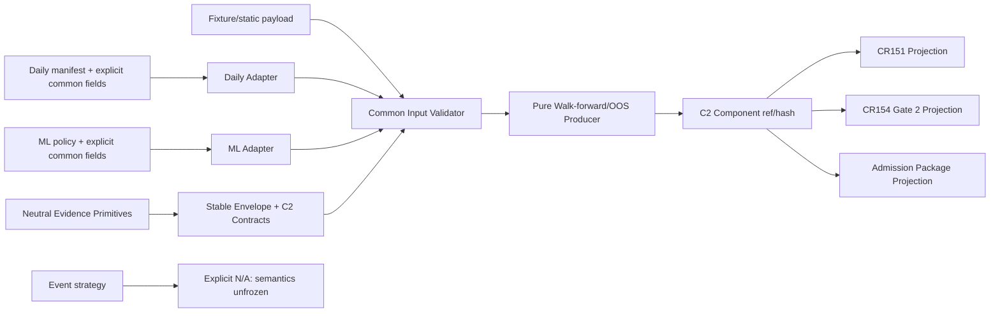

# 高层设计（HLD）：CR166 Walk-forward / OOS Computable Evidence Producer

## 修订记录

| 版本 | 日期 | 修订人 | 变更要点 |
|---|---|---|---|
| 0.1 | 2026-07-13 | host-orchestrator inline meta-se-critical | 冻结 neutral envelope、fold/leakage/lineage 语义、daily/ML compatibility、pure C2 producer、三个 existing consumer projection、event N/A、Stage ceiling 与五个 CP4 outcome 输入。 |
| 0.2 | 2026-07-13 | host-orchestrator | 回填 CP3 人工批准；四项推荐决策转为已确认架构，正式解锁 CP4 Story/Feature/DAG 与 CP5 设计证据准备，但不授权实现。 |

## 1. 问题定义、目标与边界

### 1.1 问题陈述

CR151 已有 `WalkForwardValidationPlan` 和 pass-rate 消费逻辑，CR154 Gate 2 已要求 split、walk-forward、OOS、purge/embargo refs，CR155 daily artifact 已有较薄的 split manifest，CR158 的 ML contract 已有 `MLPurgedEmbargoCVPolicy`。这些都是消费者或输入片段：仓库仍没有一个通用、可重算、lineage-bound、能识别时间泄漏并输出 fold-level reason 的 C2 evidence producer。

CR166 要填补“消费者已存在、生产者不存在”的架构缺口。它只接收显式 fixture/static values 和 opaque refs，不连接数据湖、不运行真实研究、不灌入真实 fold/OOS 数据。交付结果是 Stage 2 已完成合同基础上的 Stage 2→Stage 3 桥接增强，不是 Stage 3 启动或真实 OOS 证明。

### 1.2 核心价值

研究员与准入审查者可以区分四件事：输入是否充分、时间/泄漏边界是否可信、fold 结果是否通过显式 policy、证据是否可确定性复跑。既有门禁收到同一个 C2 ref/hash/availability/reason，不再需要从零散 fold 字典猜测证据状态。

### 1.3 量化目标与成功标准

| ID | 目标 | 可度量成功标准 |
|---|---|---|
| G-166-01 | 完整输入合同 | fold manifest、split policy、时间边界、purge/embargo、metrics、lineage refs、authorization metadata 7/7 字段族均有 schema 与 validation result。 |
| G-166-02 | P0 fail-closed | 缺 fold、时间逆序/非法 overlap、purge 缺失、embargo 不足、metric 缺失/非有限、lineage 缺失/冲突、未授权 ref、hash mismatch 共 8/8 类有阻断结果与非空 reason。 |
| G-166-03 | 时间/泄漏边界 | 时间、purge、embargo 3/3 negative classes 为 blocked；embargo one-below blocked、exact-boundary eligible。 |
| G-166-04 | fold/metric 充分性 | 缺 fold、缺 metric、NaN、Inf 4/4 不产生 present/PASS；present evidence 非有限值数=0。 |
| G-166-05 | lineage 完整性 | missing lineage 100% typed_unavailable；ref/hash/membership contradiction 100% blocked；orphan refs=0。 |
| G-166-06 | 确定性 | 同一 normalized fixture 运行 10 次，component/envelope hash distinct count=1；tampered old-hash fixture 100% blocked。 |
| G-166-07 | 可重算结果 | present evidence 的 declared fold count、passed fold count、pass rate 与 fold-level reasons 可由 evidence 100% 重算且差异=0。 |
| G-166-08 | 扩展兼容 | active C2 component=1；C3/C4 calculators=0；mandatory unknown component 100% blocked，optional unknown 对 PASS 贡献=0。 |
| G-166-09 | consumer 集成 | CR151、CR154、StrategyAdmissionPackage projection=3/3，三者使用相同 C2 ref/hash/availability/reasons。 |
| G-166-10 | strategy compatibility | daily multifactor + ML purged/embargo fixture families=2/2；event applicability decision=1/1，event producer/fixture=0。 |
| G-166-11 | 权限与 Stage ceiling | external ref dereference=0；所有 forbidden operation counters=0；Stage2 complete=true；Stage3 started/runtime-authorized/real-evidence-available=false。 |
| G-166-12 | 回归归因 | CR166 新代码路径引入失败=0；若触及 CR165 已重基线 14 项历史失败，CP7 对触发路径、归因和非 CR166 回归理由逐项记录率=100%。 |

以上 12 项与 `QAC-CR166-01..12` 一一对应，不以 fixture PASS 代替真实策略可靠性。

### 1.4 约束

| 类型 | 约束内容 |
|---|---|
| 架构 | 新 producer 不得创建平行 gate；CR151、CR154、StrategyAdmissionPackage 继续拥有各自 policy。 |
| 数据 | 只接受显式 fixture/static values 与 opaque refs；不得 dereference 真实 lake/NAS/provider/runtime refs。 |
| 技术 | Python/stdlib/project stack；确定性 canonical JSON + explicit-domain SHA-256；不引入外部 framework 或动态 plugin runtime。 |
| 工作流 | CP3 批准前不形成正式 Story/DAG；CP5 批准前不修改源代码或测试；CP8 仍需人工确认。 |
| 声明 | availability/outcome 与 runtime/Stage readiness 分离；present/pass 也不等于真实 OOS、paper/live 或 trading readiness。 |

### 1.5 非目标与相邻对象边界

- C1 BH/WRC-SPA/PBO-CSCV/DSR 由 CR164 拥有；CR166 不重算、不聚合这些统计方法。
- C3 economic cost/impact 与 C4 capacity/liquidity/alpha-decay 只获得 envelope 扩展兼容；本 CR calculator 数均为 0，不定义真实市场输入。
- CR151/CR154/admission package 是消费者和 policy owner；CR166 不创建新 gate，不决定整体 admission。
- CR155 split manifest 是 daily adapter 输入，不是通用 C2 evidence；CR155 historical artifact 不回填，仍必须 blocked / `paper_candidate=false`。
- `MLPurgedEmbargoCVPolicy` 是 ML policy 输入，不包含实际 train/validation/OOS fold boundaries；缺显式 folds 时不能生产 present C2。
- `EventTimeSemantics` 只描述 occurred/available/decision time，不定义 event fold/window；event-specific producer 在本 CR 为 N/A，不交付空壳。
- 真实 fold/OOS ingestion、历史重算、交易日历/session resolver、数据湖、provider、runtime、broker/trading、deploy/publish 均不在范围。

### 1.6 关键假设与缺失信息

| 类型 | 内容 | 若不成立的处理 |
|---|---|---|
| 假设 | C1 canonical public API/hash 可以通过 neutral primitive + compatibility wrapper 100% 保持。 | golden regression 不通过即保留旧 wrapper，暂停 shared primitive migration。 |
| 假设 | daily/ML fixture 能显式提供 common fold bounds、metrics 与 lineage，而不是要求 adapter 推断。 | 对应 evidence 为 typed_unavailable，不放宽 schema。 |
| 假设 | consumer 可通过薄 projection 接收 C2 ref/reasons，不需转移 policy ownership。 | 回 CP3 修订 adapter，不新建 gate。 |
| REQUIRED-LATER | 精确 class/function/file owner、metric threshold defaults、golden fixtures。 | CP4/CP5 冻结；不得改变本 HLD 的状态、分母、权限或 Stage ceiling。 |
| OPTIONAL | 真实 calendar/session、event window 与 C3/C4 输入合同。 | 独立 CR；不阻塞 CP3。 |

当前无 CP3 blocking 缺失信息。

## 2. 架构灰区与方案形成记录

讨论日志：`process/discussions/CP3-CR166-HLD-DISCUSSION-LOG.md`
讨论恢复点：`process/checks/CP3-CR166-DISCUSSION-CHECKPOINT.json`

| AGA | 问题 | 推荐方向 | 影响面 | 状态 |
|---|---|---|---|---|
| AGA-166-01 | C2 如何复用 canonical primitives 而不依赖 C1 method contract | neutral primitives + C1 compatibility wrapper | schema/dependency/regression | recommended |
| AGA-166-02 | C3/C4 extension 如何兼容但不引入 runtime registry | stable header + static versioned catalog | extensibility/security | recommended |
| AGA-166-03 | 时间、purge/embargo 与分母如何可审计 | half-open bounds + explicit minima/applied values + declared denominator | correctness/leakage | recommended |
| AGA-166-04 | event 是否进入 producer | explicit N/A，等待 event semantics 独立设计 | scope/claim ceiling | recommended |
| AGA-166-05 | C2 如何接入门禁 | pure producer + three thin projections | ownership/compatibility | recommended |

方案形成输入为 CP2 已批准的 9 requirements、11 scenarios、12 QAC，当前六个 source contracts，以及经 read-expansion 授权读取的 CR151/154/155/164 历史设计。枚举框架来自项目既有合同与领域经验，并明确可扩展，不声明覆盖所有 walk-forward 变体。

## 3. 候选架构方案对比

### 方案 A（推荐）：Neutral Envelope + Pure Producer + Thin Projections

建立 method-neutral canonical/envelope primitive；daily/ML adapter 输出 common input；validator 先阻断 sufficiency、temporal/leakage、lineage 与 authorization 问题；pure producer 生成 C2 component；三个 adapter 投影到 existing consumers。

### 方案 B：原地扩展 `WalkForwardValidationPlan`

把 fold schema、lineage、hash 和 producer 逻辑全部塞入 CR151 consumer DTO。短期文件较少，但 consumer 反向拥有 producer 数据，C2 与 statistical gate 紧耦合，C3/C4 extension 和 ML/daily mapping 难以复用。

### 方案 C：Dynamic Plugin Registry + Artifact Store

component 动态发现、持久化并由 store 分发。未来扩展性最大，但当前只有一个 active C2 component，引入 discovery、schema migration、storage、security、deploy 与 runtime 权限面，超出最简范围。

| 维度 | A Neutral pipeline | B Extend CR151 DTO | C Plugin/store |
|---|---|---|---|
| CP2 scope 匹配 | 高 | 中 | 低 |
| fail-closed 可证明性 | 高 | 中 | 高 |
| 现有 consumer ownership | 保持 | 混合 | 保持但新增 store owner |
| C3/C4 compatibility | 高 | 低 | 高 |
| 当前实现/权限复杂度 | 中 | 低→高 | 高 |
| 确定性与审计 | 高 | 中 | 中（需额外 runtime 治理） |
| 推荐 | 是 | 否 | deferred |

## 4. 推荐方案总览与拆分判定

**复杂度模式**：`complex`。理由是 9 requirements、11 scenarios、12 QAC、7 个输入字段族、8 类 fail-closed、2 个 P0 adapter family、3 个 existing consumers 和 1 个公共兼容迁移面。

HLD 保持一份：核心产品只有一个 C2 producer foundation，所有候选共享同一 envelope、fold schema、availability/outcome、canonical hash 与 authorization boundary。建议后续 5 个 outcome、5 个串行安全 Wave；与 Blueprint 数量一致。正式 Story/DAG 仍由 CP4 形成。

蓝图适用性结论为 `required`。本 HLD 已消费项目级 `docs/design/BLUEPRINT.md` 的 Stage 2/Stage 3 路线与 FEAT-03/13/14 边界、`DOMAIN-MAP.md` 的 StrategyAdmissionPackage/ClaimBoundary/no-real-operation 语义，以及 `DEPENDENCY-MAP.md` 的 research→admission 单向依赖；CR166 的精确增量由三份 `*-WALK-FORWARD-OOS-EVIDENCE.md` companion 文档承载。当前不改写项目级 current-index，是为了保持 CR-specific delta 的单写和后续归档策略；这不是 N/A 或 waiver。

## 5. 公共 Contract Freeze

### 5.1 Neutral primitives 与兼容边界

推荐新增 method-neutral primitive surface（候选文件名由 CP4 冻结）：

- canonical JSON 只接受 JSON-safe finite values，map key 排序，set/tuple 在 schema 规定下稳定化；
- domain hash 必须显式传入，输出 `sha256:<hex>`；
- `EvidenceAvailability` 表达 `present / typed_unavailable / not_applicable_with_reason / blocked`；
- C1 保留自己的 `EvidenceStatus` 与 method evidence，不把 C2 outcome 塞入 C1 enum；
- C1 现有 `canonical_json_bytes`、`canonical_hash` 名称、默认 statistical domain 和 golden hash 全部兼容。

### 5.2 Stable envelope header

| 字段组 | 必需内容 |
|---|---|
| identity | envelope schema/version、evidence kind、subject ref、producer/schema version |
| components | ordered canonical descriptors：type、component schema version、required、ref、hash、availability |
| provenance | validation mode、source kind、lineage ref/hash、created-by logical producer version；不记录真实 credential/runtime |
| authorization | fixture/static mode、opaque-ref policy、operation counters |
| integrity | component inventory hash、envelope hash、limitations、reason codes |

`component_ref` 是由 type/version/hash 派生的 content-addressed logical identity，不证明文件、数据库或 artifact store 已持久化。producer 不写磁盘；调用方只有在后续 Story 与授权明确后才能决定本地 evidence persistence，当前 fixture/static 验证可只使用 immutable value/serialized dict。

component catalog 为静态显式表：`walk_forward_oos@v1` active；`economic_cost` 与 `capacity_liquidity` reserved。unknown mandatory blocked；optional unknown 可 round-trip 保存但语义贡献为 0。

### 5.3 Common C2 input

| 字段族 | 最小字段 | 充分性规则 |
|---|---|---|
| fold manifest | manifest id/ref/hash、declared fold count、ordered unique fold ids | missing/empty/count mismatch fail-closed |
| split policy | strategy kind、mode、window policy、policy ref/version | 未知 mode 或缺 ref fail-closed |
| temporal bounds | 每 fold train/validation/OOS start/end，ISO-8601 `[start,end)` | fold 内顺序合法，cutoff 单调 |
| purge/embargo | unit、overlap applicability、label horizon、required/applied values、ref | overlap 时 purge mandatory；applied 不低于 required |
| metrics | mandatory metric definitions + finite fold values | missing/NaN/Inf 不得 present |
| lineage | lineage ref/hash、fold membership hash、split/metric source refs+hashes | missing unavailable；mismatch/tamper blocked |
| authorization | validation mode、ref classification、operation counters | 未授权 external ref 不解引用并 blocked |

### 5.4 Fold evidence 与 aggregate

每个 fold 输出 fold id、input/source refs、metric decisions、fold outcome、reason codes。present aggregate 输出：

- declared fold count 与 observed/validated count；
- passed fold count；
- `pass_rate = passed_declared_folds / declared_fold_count`；
- optional stability/degradation summary 只能基于显式 policy，缺 policy 不得推断；
- input/config/component hash、limitations、availability/outcome、reason codes。

missing 或 invalid fold 不能从 denominator 删除；当输入不足时 aggregate availability 非 present，`pass_rate=null`，同时显示 declared/observed difference。

### 5.5 Availability / outcome / unknown decision table

| 条件 | Component | Consumer ceiling |
|---|---|---|
| required facts absent, no contradiction | typed_unavailable | mandatory claim blocked |
| contradiction, illegal temporal/numeric value, tamper, unauthorized ref | blocked | all projections blocked/worse-only |
| complete, threshold not met | present + fail | no other PASS may improve it |
| complete, explicit review policy | present + needs_review | consumer may preserve or worsen per existing tier |
| complete, all mandatory fold decisions pass | present + pass | eligible only; not overall admission/runtime readiness |
| event semantics unfrozen | not_applicable_with_reason | compatibility acknowledged; no C2 coverage claim |
| mandatory unknown/reserved component | blocked/typed_unavailable respectively | cannot satisfy mandatory evidence |

## 6. Adapter 与 Existing Consumer 集成契约

### 6.1 Input adapters

| Adapter | 调用方向 / 时机 / 触发 | 输入 | 输出 | 后续衔接 | 降级与同步修改面 |
|---|---|---|---|---|---|
| Daily adapter | daily fixture builder → adapter；common validation 前；显式 daily C2 请求触发 | `WalkForwardSplitManifest` + validation bounds + metric policy/values + lineage/authorization | common C2 input 或 typed issues | Common Validator | legacy manifest 不改 owner；缺 validation/lineage 不推断，typed_unavailable |
| ML adapter | ML fixture builder → adapter；common validation 前；ML C2 compatibility 请求触发 | `MLPurgedEmbargoCVPolicy` + actual fold bounds + metrics + lineage/authorization | common C2 input 或 typed issues | Common Validator | policy folds count/label horizon/purge/embargo 必须一致；不训练模型、不访问 registry |
| Event applicability | event compatibility check → applicability evaluator；CP3/CP7 触发 | `EventTimeSemantics` 的现有 contract fact | structured N/A with owner/trigger | future CR only | 不创建 common folds、不访问 feed；未来 adapter 需独立设计 |

### 6.2 Consumer projections

| Consumer | 调用方向 / 时机 / 触发 | 输入契约 | 输出契约 | 后续衔接 | 降级策略 | 调用方同步修改范围 |
|---|---|---|---|---|---|---|
| CR151 statistical gate | validated C2 → projection；component 完成后；statistical gate build 触发 | same ref/hash/availability/outcome/reasons + fold summary | legacy `WalkForwardValidationPlan` compatible fields + evidence identity | existing `_walk_forward_pass_rate` / threshold gate | unavailable/blocked 不生成虚假 fold metrics；worse-only | 增加 evidence identity/reason 读取，保留 threshold policy owner |
| CR154 Gate 2 | validated C2 → projection；reliability evaluation 前 | split/walk-forward/OOS refs、purge/embargo、leakage status、same identity | Gate 2 existing mapping | shared reliability policy | N/A 仅按 strategy applicability；missing/blocked 保守传播 | 接收 C2 ref/hash/reason，不重算 folds |
| StrategyAdmissionPackage | validated C2 → attach；package build 前 | same identity + availability/outcome + limitations | package evidence ref/blocked reasons | overall admission package | 绝不把 statistical/C2 PASS 转成 runtime authorization；保持更差状态 | 追加或复用 evidence refs/reasons，`paper_candidate` worse-only |

集成覆盖必须为 3/3。producer 永远不直接调用 gate evaluator，也不根据 consumer threshold 回写 evidence。

## 7. Use Case / Requirement → Architecture Traceability

| Source | 架构 owner | 关键流程 | 失败路径 | 验证 |
|---|---|---|---|---|
| UC-58-CR166 / REQ-001 | FEAT-01/02 | envelope→adapter→validator | 7 字段族任一缺失 unavailable/blocked | P01/P02/N01 |
| REQ-002 | FEAT-02 | temporal + purge/embargo validation | N02/N03/N04 全 blocked | QAC-05 |
| REQ-003 | FEAT-02/03 | metric validation→declared denominator | missing/NaN/Inf/null pass rate | N01/N05 |
| REQ-004 | FEAT-02 | lineage binding | missing unavailable；mismatch blocked；orphan=0 | N06 |
| REQ-005 | FEAT-01/03 | canonical input/config/component/envelope hash | mismatch/tamper blocked；10→1 | P01/H01 |
| REQ-006 | FEAT-01 | static catalog/unknown table | C3/C4=0；unknown no-PASS | H01 |
| REQ-007 | FEAT-04 | three projections | mismatch/worse-state preservation | P01 + CR155 regression |
| REQ-008 | FEAT-02/05 | daily/ML adapters + event applicability | event N/A, no empty producer | P02/E01 |
| REQ-009 | FEAT-02/05 | ref classification + counters + Stage claims | dereference=0；forbidden=0 | A01 + CP8 wording |

覆盖：9/9 requirements、11/11 CR166 scenarios、12/12 QAC 均有 owner 与验证入口。

## 8. 关键场景模拟

| SIM | 场景 | 推荐架构执行路径 | 预期输出 | 结果 |
|---|---|---|---|---|
| SIM-166-01 | 完整 daily fixture | daily adapter→validator→producer→3 projections | present component；10→1 hash；projection 3/3 | PASS |
| SIM-166-02 | 完整 ML policy + explicit folds | ML adapter→policy/fold consistency→producer | same envelope semantics；无 training/runtime | PASS |
| SIM-166-03 | empty/missing fold | validator | typed_unavailable/blocked；pass_rate null；无 inflated denominator | PASS |
| SIM-166-04 | reversed/overlapping bounds | temporal validator | blocked + fold/boundary reason | PASS |
| SIM-166-05 | overlap + purge missing | leakage validator | blocked；无 OOS projection PASS | PASS |
| SIM-166-06 | embargo one-below/exact | policy validator | one-below blocked；exact eligible | PASS |
| SIM-166-07 | metric missing/NaN/Inf | metric validator | 3/3 fail-closed；present non-finite=0 | PASS |
| SIM-166-08 | lineage missing/mismatch | lineage validator | missing unavailable；mismatch blocked；orphan=0 | PASS |
| SIM-166-09 | unauthorized external ref | authorization precheck | zero dereference + blocked reason | PASS |
| SIM-166-10 | component reorder/tamper | canonicalizer/self-validator | equivalent same hash；tamper blocked；unknown no-PASS | PASS |
| SIM-166-11 | event request | applicability evaluator | explicit N/A；event producer=0；feed access=0 | PASS |

## 9. 高层模块与职责

| 模块 | 类型 | 职责 | 输入 | 输出 | 依赖 |
|---|---|---|---|---|---|
| Neutral evidence primitives | Contract utility | canonical bytes/domain hash、availability、component descriptor | JSON-safe value/schema domain | deterministic bytes/hash | stdlib only |
| C2 input/evidence contracts | Domain contract | stable envelope、fold/policy/metric/lineage/evidence types | explicit values/refs | immutable typed values | neutral primitives |
| Daily/ML adapters | Adapter | legacy contract → common input | daily manifest / ML policy + companion fields | normalized input/issues | existing source contracts |
| Common validator | Pure validator | sufficiency/temporal/leakage/metric/lineage/auth | common input | validated input or issues | C2 contracts |
| C2 producer | Pure calculator | fold decisions、aggregate、hash、provenance | validated input | C2 component/envelope | validator + neutral primitives |
| Projection adapters | Adapter | same component → 3 existing surfaces | component ref/hash/status/reasons | consumer mappings | existing consumers |
| Fixture/static verifier | Test-only | 8 classes、2 families、event N/A、10-run、CR155、permission | local fixtures | evidence/results | all public contracts |

候选代码路径只是 CP4/CP5 输入；本 CP3 不冻结具体类名或写入源码。

## 10. 关键流程与失败行为

### 主流程

1. 调用方显式构造 daily 或 ML common input；所有 refs 保持 opaque。
2. adapter 只映射已给事实，不补造 validation bounds、metric、lineage 或 authorization。
3. validator 按 authorization→identity/sufficiency→temporal→purge/embargo→metric→lineage 顺序运行。
4. unavailable/blocked 直接生成 typed result，禁止进入 present producer 路径。
5. producer 对 validated input 重算 fold decisions、declared denominator、pass rate 与 hashes。
6. evidence self-validation 通过后，三个 projection 复用同一 identity；任一 mismatch blocked。
7. existing consumers 按自身 policy 做整体判断；producer 不回写 policy。

### 前置校验与失败路径

| 阶段 | 前置条件 | 失败行为 | 回退 |
|---|---|---|---|
| Adapter | source contract + explicit companion fields | missing→typed_unavailable；contradiction→blocked | 补齐 fixture facts 后重试 |
| Validator | common schema parseable | illegal/tamper/unauthorized→blocked | 不允许隐式修复；修正输入 |
| Producer | validation status=validated | 其他状态拒绝计算；non-finite/zero denominator blocked | 返回 typed result，不抛出外部操作 |
| Projection | component self-validation/hash PASS | projection blocked，3 consumers 均不得提升 | 修复 evidence/adapter；不绕过 gate |
| Verification | local fixture/static environment | external access attempt 或 false PASS→CP7 FAIL | 回 CP6/设计澄清 |

## 11. 非功能设计

| 质量特征 | 量化目标 | 实现手段 | 验证方式 |
|---|---|---|---|
| Correctness | 8/8 fail-closed；9/9 REQ；11/11 SCN | typed validation + explicit decision tables | positive/negative/boundary fixtures |
| Determinism | 10 runs → 1 component/envelope hash | canonical normalization + explicit domains | repeated fixture |
| Integrity | orphan refs=0；tamper acceptance=0 | ref/hash/membership binding + self-validation | tamper/orphan tests |
| Performance | validator/producer 外部 I/O calls=0；单次遍历上界为 `O(folds × mandatory_metrics)`，不做隐藏二次组合搜索 | one-pass normalization/validation/aggregation | instrumented call/iteration counters |
| Reliability | 8/8 invalid classes 返回 typed result，未处理异常导致的 silent PASS=0 | total validation boundary + immutable results | exception/negative fixtures |
| Safety | external dereference=0；forbidden counters=0 | opaque refs + no resolver/I/O | static scan + operation counters |
| Observability | fail-closed result reason-code coverage=100%；每个 blocked/unavailable fold 可定位 fold id/field | structured issue/reason list + operation counters | reason completeness assertions |
| Compatibility | consumer=3/3；daily/ML=2/2；C1 golden compatibility=100% | thin adapters + wrapper/re-export | contract/golden regression |
| Maintainability | production DAG cycles=0；每对象单一 owner | layered dependency map | DAG/file-owner check |
| Extensibility | C3/C4 calculators=0；unknown PASS contribution=0 | static versioned catalog | catalog/unknown fixtures |
| Claim safety | Stage flags 4/4 精确；CR155 blocked=1/1 | explicit limitations + worse-state merge | regression/release wording audit |

## 12. 主要风险、Gotchas 与应对

| Risk ID | 风险 / 常见误用 | 概率 | 影响 | 应对 | 触发 / 回退 |
|---|---|---|---|---|---|
| R-166-C1-HASH | 抽取 canonical primitive 改变 C1 byte/hash | 中 | 高 | 旧 API/default domain wrapper + golden fixture | 任一差异即阻断迁移 |
| R-166-DENOMINATOR | 删除坏 fold 后 pass rate 虚高 | 中 | 高 | declared denominator；missing fold 使 evidence 非 present | observed≠declared 时 null pass rate/blocked |
| R-166-PURGE | 把一个 purge ref 当作“已充分” | 中 | 高 | required/applied/unit/ref 全显式 | 任一缺失或不足 blocked |
| R-166-BOUNDARY | 把相邻 end/start 相等误判 overlap，或把真实 overlap 当合法 | 中 | 高 | `[start,end)` + policy-based purge，不用字符串比较代替语义 | 真实 calendar 需求另起设计 |
| R-166-ML | 误以为 `MLPurgedEmbargoCVPolicy` 已含实际 folds | 中 | 高 | adapter 要求 actual fold bounds/count binding | 缺 folds typed_unavailable |
| R-166-EVENT | 为满足覆盖率创建 event 空壳 | 中 | 高 | explicit N/A + producer count=0 | 独立 event semantics CR 后切换 |
| R-166-UNKNOWN | optional unknown component 被算作 PASS | 低 | 高 | preserve-only/no semantic contribution | mandatory unknown blocked |
| R-166-CONSUMER | C2 PASS 被误读为 overall admission/runtime readiness | 中 | 高 | worse-state merge + limitations + Stage flags | 任一提升 CR155/Stage3 为 CP7 FAIL |
| R-166-REF | opaque external ref 被 validator 顺手读取 | 低 | 高 | zero-dereference adapter；ref classification before any resolver | counter 非 0 立即 blocked |
| R-166-BASELINE | CR165 14 项历史失败被错误归因 | 中 | 中 | CP7 逐项触发/归因记录 | CR166 新路径 failure 必须为 0 |

## 13. ADR 与适用性

ADR 见 `process/archive/design-cr-docs/ARCHITECTURE-DECISION-WALK-FORWARD-OOS-EVIDENCE.md`。推荐方案适用于 repo-local、fixture/static、显式 fold values、两个策略兼容族与三个既有 consumers。以下条件出现时必须切换或重开设计：真实数据/session resolver、event fold semantics、C3/C4 calculator、第三方 component registry、artifact service、runtime/trading authorization。

### 13.1 适用性矩阵

| 适用性维度 | 当前项目判断 | 推荐方案如何适配 | 不适配信号 | When to switch |
|---|---|---|---|---|
| 用户目标 | 先补 C2 可计算链，不启动 Stage 3 | 显式 input→validator→producer→3 consumers，严格 claim ceiling | 用户要求真实 OOS/收益结论 | 独立 Stage 3 data/runtime CR |
| 项目成熟度 | C1 producer 与 C2 consumers 已有，C2 producer 缺失 | neutral envelope 复用现有基础，保留既有 policy owner | existing consumer 无法兼容 ref/reason | 回 CP3 修订 adapter，不建平行 gate |
| 认知负担 | 多套 status、fold/policy 容易混淆 | availability/outcome 分离、decision table 与 declared denominator | 使用者持续把 present 当 PASS/Stage3 | 收紧 projection/display；不放宽内部 contract |
| 验证条件 | 只有 local fixture/static 与历史 regression | pure functions、2 fixture families、8 negative classes、10-run | 需要 calendar/session/real-data empirical proof | 新授权后增加 resolver/real-data verification |
| 回退成本 | neutral primitive 可能触及 C1 compatibility | wrapper/re-export + golden hash，producer/adapters 可单独停用 | C1 API/hash 任一变化 | 保留旧 C1 implementation，停止 shared migration |

| 方案选择 | 优化 | 牺牲 | 接受理由 | 切换条件 |
|---|---|---|---|---|
| Neutral pipeline | owner clarity、determinism、future compatibility、testability | 多一个 neutral contract 与 compatibility regression | 公共 C2/C3/C4 envelope 不能归属于 C1 statistical module | C1 compatibility 无法保持时先 wrapper，不强迁移 |
| Explicit policy values | auditability、fail-closed | 输入更冗长，不自动推断 | 当前无真实 calendar/data 授权，推断不可验证 | Stage3 resolver 经独立批准 |
| Event N/A | claim safety | 暂无 event C2 coverage | 现有 event contract 不足以定义 fold | event semantics/reference fixtures 冻结 |
| Static catalog | 最小安全/维护面 | 无动态扩展 | 当前 active component 仅 1 | 第三方/跨包 component 需求被批准 |

## 14. 五个 CP4 输入与分阶段落地建议

| Candidate | Outcome | 依赖 | 建议 Wave | CP4/CP5 完成准则 |
|---|---|---|---|---|
| CR166-S01 | neutral envelope/input/evidence contract + C1 compatibility | 无 | W1 | API/hash compatibility、catalog/status/unknown table freeze |
| CR166-S02 | temporal/leakage/sufficiency validator + daily/ML adapter | S01 | W2 | 7/7 fields、3/3 leakage、2/2 adapters、no inference |
| CR166-S03 | deterministic producer/aggregation | S01-S02 | W3 | fold reasons、declared denominator、10→1 hash |
| CR166-S04 | existing consumers + CR155 regression | S01-S03 | W4 | projection 3/3、worse-only、CR155 blocked 1/1 |
| CR166-S05 | independent verification outcome | S01-S04 | W5 | 8/8、12/12、permission zero、regression attribution |

Story 候选数=5，Wave 数=5。S04 完成 source integration 后，S05 才在独立 W5 执行验证；CP4 不得把有依赖的 S04/S05 放入同一并行 Wave，也不得把文档中的 Story/Wave 计数写成矛盾。

### 14.1 Feature 级实现设计触发条件

| Feature | 触发条件 | CP4/CP5 必需产物 | 推荐设计等级 |
|---|---|---|---|
| FEAT-166-01 Neutral envelope & contracts | public contract、cross-module compatibility、hash migration | `FEATURE-DESIGN-MATRIX` + Feature DESIGN/TEST-PLAN/TASKS + Story LLD | required / full-lld |
| FEAT-166-02 Fold validator & adapters | leakage/PIT risk、data model、daily/ML cross-contract | Feature DESIGN/TEST-PLAN/TASKS + Story LLD | required / full-lld |
| FEAT-166-03 C2 producer | computation、determinism、aggregation semantics | Feature DESIGN/TEST-PLAN/TASKS + Story LLD | required / full-lld |
| FEAT-166-04 Existing-consumer projections | three-module integration、backward compatibility、claim policy | Feature DESIGN/TEST-PLAN/TASKS + Story LLD | required / full-lld |
| FEAT-166-05 Fixture/static verification | security boundary、QAC、historical regression attribution | Feature TEST-PLAN/TASKS + Story LLD；是否独立 DESIGN 由矩阵判定 | required test design / full-lld |

CP4 必须生成或增量更新 `docs/design/FEATURE-DESIGN-MATRIX.md`；上表任何 `required` 项没有完整 Feature 设计或显式、可重访的 waived 证据时，不得进入 CP5。

## 15. 待 CP3 人工决策

| Decision ID | 类型 | 问题 | 推荐 | 备选 | 影响 / 风险 | 回退 / 切换 |
|---|---|---|---|---|---|---|
| DQ-CP3-CR166-001 | architecture | 是否批准 neutral primitives、C1 compatibility、stable envelope 与 static catalog？ | 批准 ADR-001/002 | C2 直接依赖 C1；复制；dynamic registry | 公共 schema、C1 regression、C3/C4 compatibility | C1 golden 不一致时暂停抽取 |
| DQ-CP3-CR166-002 | architecture | 是否批准 half-open fold、显式 purge/embargo、availability/outcome 分离与 declared denominator？ | 批准 ADR-003..006 | 只做字段非空；隐式日期推断；过滤坏 fold | 决定 8 类 P0 是否真正 fail-closed | 真实 calendar/session 另起 Stage3 设计 |
| DQ-CP3-CR166-003 | architecture | 是否批准 3 existing projections 与 event explicit N/A？ | 批准 ADR-007/008 | 新 gate；event 空壳/日历折算 | 决定 consumer ownership 与假覆盖风险 | event 语义独立冻结后新 CR |
| DQ-CP3-CR166-004 | security | 是否批准五个 CP4 outcome 输入并保持 zero-dereference、design-only 与 Stage ceiling？ | 批准 ADR-009/010 | 修改或暂停 | 只解锁 CP4/CP5 设计，不授权实现/真实运行 | 任何权限扩张立即停止请求人工授权 |

## 16. HLD 自审记录

| 自审项 | 结果 | 证据 / 说明 |
|---|---|---|
| Architecture Gray Areas 已前置处理 | PASS | discussion log + checkpoint；5/5 gray areas |
| 至少两种候选方案比较 | PASS | §3 共 3 方案 |
| Blueprint/Domain/Dependency 适用且完整 | PASS | 三份 companion design docs |
| 适用性矩阵完整 | PASS | §13.1 覆盖用户目标、成熟度、认知负担、验证条件、回退成本 |
| Feature 实现设计触发明确 | PASS | §14.1；五个 Feature 均有 CP4/CP5 产物要求 |
| 内部一致性 | PASS | ADR、Risk、NFR、模块、流程均采用 neutral/pure/worse-only/event-N/A |
| 量化目标 | PASS | 12/12 exact criteria；无“尽可能/不少于”不可验收措辞 |
| 集成契约显式 | PASS | §6 覆盖方向、时机、触发、输入、输出、后续、降级、同步修改 |
| 相邻对象边界 | PASS | §1.5 区分 C1/C2/C3/C4、consumer、daily/ML/event |
| 前置校验与失败路径 | PASS | §10 阶段表 |
| Use Case / Req traceability | PASS | §7：9/9 requirements、11/11 scenarios、12/12 QAC |
| 场景模拟 | PASS | §8：11/11 simulations PASS |
| Story/Wave 粗估一致 | PASS | 5 candidates、5 Waves；S05 对 S04 串行依赖明确 |
| Gotchas 实质性 | PASS | §12 共 10 项 |
| 无 Story/LLD/code/test/runtime 越界 | PASS | 本轮仅 CP3 design artifacts |

## CP3 确认记录

**CP3 自动预检结果**：`process/checks/CP3-CR166-WALK-FORWARD-OOS-EVIDENCE-HLD-CONSISTENCY.result.json`
**CP3 人工 checklist**：`process/checkpoints/CP3-CR166-WALK-FORWARD-OOS-EVIDENCE-HLD-REVIEW.md`

**确认状态**：已批准

**审核意见**：四项推荐架构全部批准；继续推进至 CP5 人工门禁。批准不扩大 fixture/static、zero-dereference、no-runtime 与 Stage claim ceiling。

**确认人**：user

**确认时间**：2026-07-13T12:11:57+08:00
