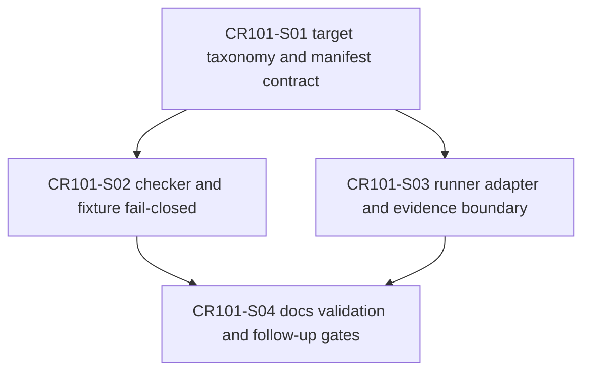

# CP4 CR101 Story DAG and Parallel Safety 检查结果

## Entry Criteria

| 条目 | 状态 | 证据 | 说明 |
|---|---|---|---|
| CP3 HLD 已批准 | PASS | `process/checkpoints/CP3-CR101-CROSS-PLATFORM-STRATEGY-DELIVERY-HLD-REVIEW.md` | 用户回复“批准”。 |
| Story 计划存在 | PASS | `process/STORY-BACKLOG-CR101.md`、`process/DEVELOPMENT-PLAN-CR101.yaml` | 4 个 Story 已生成。 |
| 依赖信息存在 | PASS | 本文件 DAG、Development Plan | 依赖和 Wave 已列明。 |

## Checklist

| # | 检查项 | 状态 | 证据 | 处理意见 |
|---|---|---|---|---|
| 1 | Story 覆盖需求 | PASS | S01-S04 | 覆盖 target taxonomy、manifest/checker/fixture、adapter/evidence、docs/gates。 |
| 2 | Story 粒度合理 | PASS | `process/STORY-BACKLOG-CR101.md` | 每个 Story 可独立设计和验证。 |
| 3 | AC 明确 | PASS | Story cards | 每个 Story 均有可验证 AC。 |
| 4 | INVEST 基本满足 | PASS | Story cards | 均可协商、可测试、可拆分。 |
| 5 | 依赖关系完整 | PASS | DAG | S01 -> S02/S03 -> S04。 |
| 6 | 依赖类型明确 | PASS | Development Plan | S01 是 contract 依赖；S02/S03 存在 shared schema / tests 协调。 |
| 7 | DAG 无环 | PASS | Mermaid DAG | 无回边。 |
| 8 | 关键路径识别 | PASS | Waves | W1 contract 是关键路径。 |
| 9 | 文件所有权明确 | PASS | Story backlog 文件所有权表 | primary/shared/forbidden 已列出。 |
| 10 | 并行计划合理 | PASS | W2 | S02/S03 可并行设计；实现时需按 shared contract merge owner 协调。 |
| 11 | Wave 不是硬门 | PASS | Development Plan | 实际推进仍以 CP5、依赖和文件冲突为准。 |
| 12 | QA 策略同步 | PASS | Story cards / LLD | 离线测试范围和 forbidden runtime 均已写明。 |

## DAG

## 文件 Owner / Merge Order

| Story | Primary 文件 | Shared 文件 | Merge 顺序 |
|---|---|---|---|
| S01 | `trading/strategy_runner/package_loader.py` | schema constants、tests | 1 |
| S02 | `trading/strategy_runner/package_exchange.py`、`tests/test_cr100_package_exchange.py` | fixtures | 2 |
| S03 | `trading/strategy_runner/adapters.py`、`evidence.py`、`readonly_gateway.py` | CR091 / CR098 tests | 3 |
| S04 | docs / process CR101 artifacts | follow-up tracking | 4 |

## 不授权边界

CP4 只确认 Story / DAG / 文件所有权，不授权实现，不授权 NAS、凭据、QMT/MiniQMT/XtQuant/gateway runtime、simulation/live、交易或 publish。

## Exit Criteria

| 条目 | 状态 | 证据 | 说明 |
|---|---|---|---|
| DAG 校验通过 | PASS | 本文件 DAG | 无循环。 |
| 文件冲突可控 | PASS | 文件 Owner / Merge Order | S01 contract 先行，S02/S03 实现时协调 shared tests。 |
| 首批队列可计算 | PASS | `CR101-W1-CONTRACT` | S01 首批 LLD / dev gate 可计算。 |
| CP5 汇总就绪 | PASS | CP5 checkpoint 路径 | CP4 摘要将汇入 CP5 Decision Brief。 |

## Deliverables

| 交付物 | 路径 | 状态 | 说明 |
|---|---|---|---|
| Story backlog | `process/STORY-BACKLOG-CR101.md` | PASS | 已生成。 |
| Development plan | `process/DEVELOPMENT-PLAN-CR101.yaml` | PASS | 已生成。 |
| Story cards | `process/stories/CR101-S0*.md` | PASS | 4 个 Story 已生成。 |
| CP4 自动预检 | `process/checks/CP4-CR101-STORY-DAG-PARALLEL-SAFETY.md` | PASS | 本文件。 |

## 结论

- 结论：`PASS`
- 阻断项：0
- 豁免项：0
- 下一步：进入 CP5 全量 LLD 可实现性预检与人工审查；CP5 批准前不得实现。
