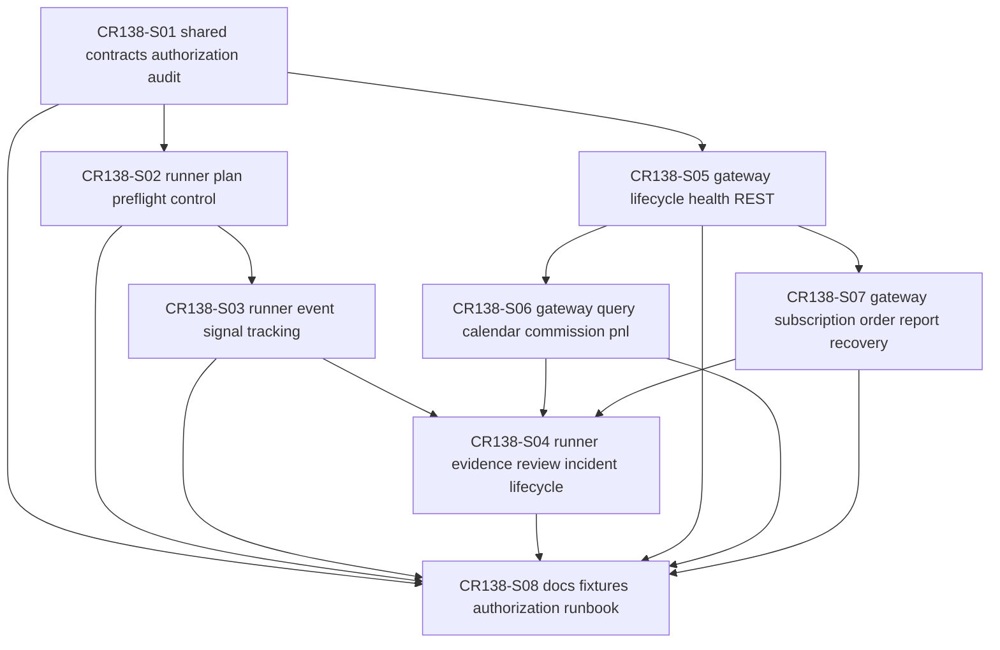

# CP4 CR138 Story DAG and Parallel Safety

## Entry Criteria

| 条件 | 状态 | 证据 |
|---|---|---|
| CP3 HLD / ADR 已人工批准 | PASS | `process/checkpoints/CP3-CR138-RUNNER-QMT-HLD-REVIEW.md` |
| HLD / ADR 已改为功能命名，不再以 CR 命名主设计文档 | PASS | `process/docs/design/HLD-RUNNER-QMT-OPERATIONAL-CONTROL-PLANE.md`、`process/docs/design/ARCHITECTURE-DECISION-RUNNER-QMT-OPERATIONAL-CONTROL-PLANE.md` |
| Gateway P0 协议面已收敛为 REST-only，SSE / WebSocket / gRPC / FIX 后置 | PASS | HLD / ADR、FEAT-12 设计 |
| 交易日历、佣金 / 费用模型、收益 / PnL 查询纳入设计 | PASS | `process/docs/features/qmt-gateway-service-layer/DESIGN.md`、`process/STORY-BACKLOG-CR138.md` S06 |
| CR138 hygiene guardrail 已完成且不阻塞 CP4 | PASS | `process/checks/CR138-PROCESS-ARTIFACT-HYGIENE-GUARDRAIL-2026-06-24.md` |
| 当前阶段不授权 runtime / QMT / 凭据 / 交易 / NAS / provider / lake / catalog / Git remote | PASS | CR138 正式 CR、Development Plan authorization boundary |

## Checklist

| # | 检查项 | 结果 | 证据 / 说明 |
|---:|---|---|---|
| 1 | Story 来源可追溯到 CP3 HLD、ADR 和 FEAT-11 / FEAT-12 | PASS | 8 个 Story 均映射到 HLD 模块、ADR 和 Feature Design Matrix |
| 2 | Story ID 唯一且命名稳定 | PASS | `CR138-S01` 至 `CR138-S08` 无重复 |
| 3 | Story 粒度可被单一 LLD 消费 | PASS | 每个 Story 均设为 `full-lld`，有明确 primary files 和 dev gate |
| 4 | DAG 无环 | PASS | S01 -> S02/S05 -> S03/S06/S07 -> S04/S08，未发现回边 |
| 5 | 所有依赖引用有效 | PASS | 依赖节点均在 CR138 Story 集合内 |
| 6 | Wave 顺序与依赖一致 | PASS | W1 contracts、W2 control shell、W3 operational flows、W4 review/docs |
| 7 | 并行 LLD 风险已约束 | PASS | `max_parallel_lld=3`，共享文件由 merge owner 收敛 |
| 8 | 并行开发风险已约束 | PASS | CP5 前 implementation_allowed=false；CP5 后同文件按 merge order 串行 |
| 9 | shared file ownership 明确 | PASS | `runner_control_plane.py` 与 `qmt_gateway_service.py` 均指定上游 skeleton owner |
| 10 | 不授权范围显式写入计划 | PASS | Development Plan `authorization_boundary` 覆盖 runtime、凭据、交易、NAS、provider/lake/catalog、Git remote |
| 11 | REST-only P0 没有新增多协议接口 Story | PASS | S05 只冻结 REST route / lifecycle；SSE / WebSocket / gRPC / FIX 不进入 P0 |
| 12 | 查询服务覆盖用户反馈项 | PASS | S06 覆盖 TradingCalendar、TradingWindow、CommissionSchedule、CostEstimate、PnLSnapshot、ReturnSummary |
| 13 | 订单写入与行情订阅未被误授权 | PASS | S07 要求 market_readonly / submit_cancel runtime_authorization；缺授权 hard_rejected |
| 14 | 文档 / fixture / CP7 guardrail 已纳入 Story | PASS | S08 独立覆盖 docs、fixture、no-real-operation counters 和 authorization runbook |
| 15 | CP5 前置输入可枚举 | PASS | Feature Design Matrix、Feature docs、Story Backlog、Development Plan、Story cards 均已列出 |
| 16 | 自动预检可进入下一门禁 | PASS | 阻断项 0；下一步为全量 LLD 设计证据与 CP5 人工确认 |
| 17 | Follow-up CR 覆盖审计不改变 DAG | PASS | `process/checks/CR138-FOLLOW-UP-CR-COVERAGE-AUDIT-2026-06-24.md` 将 CR137 offline batch run 吸收进 S02/S03；未新增 Story、Wave 或依赖边 |

## Story DAG

## Wave / Parallel Safety

| Wave | Stories | LLD 并行 | CP5 后开发并行 | 风险控制 |
|---|---|---|---|---|
| CR138-W1-SHARED-CONTRACTS | S01 | 否 | 否 | S01 是共享 contract owner，先冻结字段、状态、授权、审计。 |
| CR138-W2-CONTROL-SHELL | S02, S05 | 是 | 可并行 | Runner 与 Gateway 文件面分离；都依赖 S01。 |
| CR138-W3-OPERATIONAL-FLOWS | S03, S06, S07 | 是 | 限制并行 | S03 消费 S02 RunPlanBatch 并输出 BatchOpsSummary；S06/S07 共享 `qmt_gateway_service.py`，S05 为 skeleton owner；实现阶段按 S06 后 S07 或单一 gateway merge owner 串行合并。 |
| CR138-W4-REVIEW-DOCS-GUARDRAILS | S04, S08 | 是 | 可并行 | S04 依赖 Runner/Gateway operational flows；S08 只做 docs / fixture / guardrail 收口，不授权 runtime。 |

## File Ownership

| 文件 / 区域 | Primary owner | 后续约束 |
|---|---|---|
| `trading/runner_control_contracts.py` | CR138-S01 | 后续 Story 只能扩展已冻结合同，不得绕过 authorization / audit 字段。 |
| `trading/qmt_gateway_contracts.py` | CR138-S01 | Gateway query、subscription、order report 均消费该合同。 |
| `trading/runner_control_plane.py` | CR138-S02 | S03/S04 追加流程前必须继承 S02 RunPlan / PreflightResult / RunnerCommand。 |
| `trading/qmt_gateway_service.py` | CR138-S05 | S06/S07 不得并发改写 route skeleton；实现阶段由 Gateway merge owner 串行收敛。 |
| `trading/qmt_gateway_gates.py` | CR138-S07 | submit/cancel、market subscription、order report recovery hard-reject 逻辑归 S07。 |
| `docs/` 与 `process/docs/quality/*CR138*` | CR138-S08 | 文档不得把 CP4/CP5/CP6/CP7 或 health pass 写成 runtime 授权。 |

## No-Authorization Boundary

本 CP4 自动预检没有执行、授权或暗示以下动作：

- QMT / MiniQMT / XtQuant / gateway runtime 启动、连接、安装、端口绑定。
- `.env`、token、secret、账号、资金、持仓、委托、成交、session、cookie 或原始日志读取。
- 真实账户 / 行情 / 订单 / 成交查询，真实行情订阅。
- submit、cancel、buy、sell、simulation、live。
- NAS 访问、挂载、列取、读取、复制、写入、发布或删除。
- provider fetch、lake write、catalog publish、current pointer 修改。
- Git remote write、push、tag 或发布动作。

后续如需要验证真实查询或运行，必须新建或复用明确的 `runtime_authorization` gate，并逐项限定 action scope、运行窗口、脱敏、回滚和审计范围。

## Deliverables

| 产物 | 状态 |
|---|---|
| `process/docs/design/FEATURE-DESIGN-MATRIX.md` | updated, ready-for-cp5-review |
| `process/docs/features/runner-control-plane/DESIGN.md` | generated |
| `process/docs/features/runner-control-plane/TEST-PLAN.md` | generated |
| `process/docs/features/runner-control-plane/TASKS.md` | generated |
| `process/docs/features/qmt-gateway-service-layer/DESIGN.md` | generated |
| `process/docs/features/qmt-gateway-service-layer/TEST-PLAN.md` | generated |
| `process/docs/features/qmt-gateway-service-layer/TASKS.md` | generated |
| `process/STORY-BACKLOG-CR138.md` | generated |
| `process/STORY-STATUS-CR138.md` | generated |
| `process/DEVELOPMENT-PLAN-CR138.yaml` | generated |
| `process/stories/CR138-S01..S08-*.md` | generated |

## Exit Criteria

| 条件 | 状态 | 说明 |
|---|---|---|
| Story Backlog 已生成 | PASS | 8 个 Story / 4 个 Wave |
| Development Plan 已生成 | PASS | DAG、Wave、并行策略、merge order、验证计划已写入 |
| Feature Design Matrix 已更新 | PASS | FEAT-11 / FEAT-12 和 CR138 Story downstream contract 已写入 |
| CP4 自动检查完成 | PASS | 阻断项 0、豁免项 0 |
| Follow-up CR 覆盖审计完成 | PASS | CR137 offline batch run 已并入 S02/S03；真实 runtime / NAS / trading 写入仍为后续 scoped gate |
| 可进入 CP5 前 LLD 设计证据阶段 | PASS_WITH_BOUNDARY | 只允许起草 LLD 和 CP5 自动预检；不得实现或运行真实系统 |

## 结论

CP4 自动预检结论：`PASS`。

CR138 可进入下一步全量 LLD 设计证据准备，批次为 `CR138-RUNNER-QMT-OPERATIONAL-CONTROL-BATCH-A`。CP5 人工确认前，全部 Story 仍保持 `lld-ready-for-review`，不得标记为 `dev-ready`，不得执行实现、runtime、QMT、凭据、交易、NAS、provider/lake/catalog 或 Git remote 写入。
