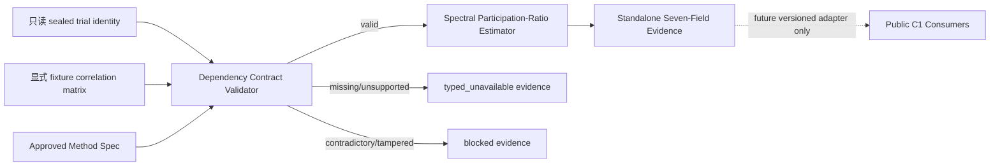
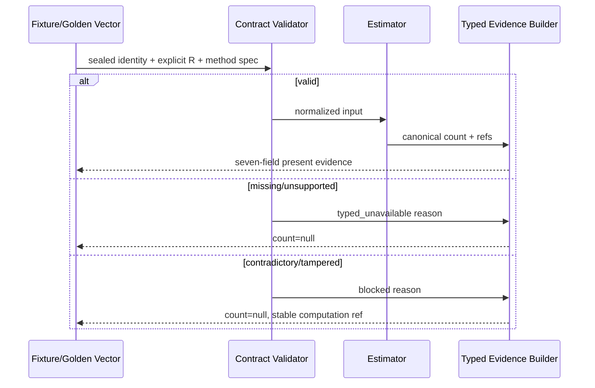

# 高层设计（HLD）：Effective-Trial Offline Methodology

> 本文是 CR-173 companion HLD，不覆盖 `docs/design/HLD.md` current index。它只设计 strategy-agnostic、synthetic/fixture-only estimator。CP4 已通过；S01/S02 LLD v1.2 与 S03 LLD v1.3 均为 `ready-for-review/confirmed=false`，且已同步 Round-2 整改。本文 1.2 回写 operation-class 主选并等待 Round-3 独立复核，不实现代码，不执行真实数据或 runtime 操作。

## 修订记录

| 版本 | 日期 | 修订人 | 变更要点 |
|---|---|---|---|
| 1.0 | 2026-07-16 | meta-se-critical | 完成 Architecture Gray Areas、候选方法、estimand/有效域/可识别性/偏差边界、C1 100% inventory 与 estimator-only split；对应 ADR-CR173-001..005。 |
| 1.1 | 2026-07-16 | meta-se-critical | 处理 CP5 Round-1 F-001..004：冻结 stable content-addressed computation ref + 外置 append-only attempt audit；唯一化 F03/F04；拆分 public 新代码零集成计数与 12/12 只读回归；刷新 CP4/CP5 时点。 |
| 1.2 | 2026-07-16 | meta-se-critical | 处理 CP5 Round-2 F-R2-002/003：冻结非 public deny-default operation classes `9/9` 与 public 双 lane 六项指标的非重复计数边界；刷新 S01/S02 LLD v1.2、S03 LLD v1.3 已同步 R2 整改并待 R3 独立复核的时点。 |

## 1. 问题定义

### 1.1 问题陈述与核心价值

当前 `raw_trial_count` 只表达尝试次数，不表达试验间相关性；把它复制到 effective 字段会制造虚假独立性。现有 `typed_unavailable` 虽然诚实，却不能提供离线、可审计的改善路径。CR-173 要在不接触真实策略、真实数据或 runtime 的条件下，为显式给定的 sealed-trial 二阶依赖矩阵定义一个 non-alias、确定、可追溯的 effective dimension，并对不满足有效域的输入 fail-closed。

### 1.2 量化目标与成功标准

| 优先级 | 目标 | 度量 |
|---|---|---|
| P0 | 冻结可识别 estimand 与完整输入合同 | 输入类别 required/valid/missing 行为覆盖 `100%`；方法/版本/hash/假设/切换条件 `5/5` |
| P0 | 阻止 raw alias 与 overclaim | copy/rename/default/fallback=`0`；FWER/DSR/admission calibration claim=`0` |
| P0 | 冻结 standalone typed evidence | 七个顶层字段 `7/7`；present 时 count∈`[1,n]`；非 present 时 count=null |
| P0 | 证明设计可确定验证 | golden classes `6/6`，未来每类 repeats `3/3`，每个合法组 canonical result/hash=`1` |
| P0 | 保护公共 C1 contract | production inventory `8/8`；`cr173_new_code_public_dependency_edges/calls/public_production_diff/public_writes=0/0/0/0`；CP7 read-only regression inventory=`12/12`、existing expected edits=`0` |
| P0 | 保留授权与 claim ceiling | 非 public deny-default operation classes=`9/9` 且各 counter=`0`；public 六项指标独立计数；CR172 auto-resume=`0` |

### 1.3 约束与非目标

| 类型 | 约束 |
|---|---|
| 方法 | v1 只消费上游显式提供、与 sealed trial IDs 对齐的 correlation matrix；CR-173 不估计该矩阵 |
| 数值 | 输出为 canonical JSON number，范围 `[1,n]`，最多 12 位小数，round-half-even；hash 使用 versioned canonical serialization domain |
| 证据 | 七字段 standalone evidence；status 是含 `state + reason_code` 的结构化顶层字段 |
| 安全 | synthetic/fixture/golden-vector only；不读取环境、credential、provider、lake、NAS 或历史目录 |
| 集成 | current public C1 types/adapters 只读；projection 分类为跨 owner、跨域、非兼容并拆分 |

非目标包括：真实 correlation 估计及采样稳定性、具体策略身份、C1 runtime activation、DSR/FWER/tail-copula 校准、C2-C4、aggregate/CR155/admission、publish/deploy、Story/Epic/DAG/Wave、Feature implementation design、LLD、源码和测试实现。

### 1.4 关键假设与缺失信息

| ID | 假设 / 缺失信息 | 当前处理 | 状态 / 重访条件 |
|---|---|---|---|
| A-001 | 上游能提供 sealed trial IDs 与显式 correlation matrix | v1 fixture 中声明为 exact；estimator 不估计 | RESOLVED for offline fixtures；真实 activation 必须重证 |
| A-002 | 二阶 effective dimension 足以服务当前离线方法目标 | 限定 claim 为 spectral participation ratio | CP3-DQ-001；若要求 alpha/tail calibration 转 Spike |
| A-003 | canonical decimal contract 可提供跨重复稳定结果 | 冻结 12 位、half-even、versioned hash domain | RESOLVED at HLD；CP5/CP7 验证 |
| A-004 | public projection 可在当前 CR 局部兼容加入 | 源码 inventory 证明不成立 | RESOLVED-SPLIT；CP3-DQ-002 |

阻断缺失信息：`0`。真实矩阵的采样误差、稳定性与 producer owner 不是 CR-173 缺失项，而是 future activation 的显式前置；在其未证明时只能 typed_unavailable。

## 2. Architecture Gray Areas 与方案形成记录

讨论日志：`process/discussions/CP3-CR173-HLD-DISCUSSION-LOG.md`
讨论恢复点：`process/checks/CP3-CR173-DISCUSSION-CHECKPOINT.json`

### 2.1 Gray Areas

| 灰区 | 问题 | 为什么改变架构 | 影响面 | canonical refs | 结论 |
|---|---|---|---|---|---|
| AGA-CR173-01 | effective count 是二阶有效维度还是 alpha-specific error-rate equivalent？ | 决定输入、数值算法、claim 与验证成本 | method/data/validation/docs | REQ-001/002/006、SC-P01/D01 | 选二阶谱 participation ratio；alpha-specific 延后 Spike |
| AGA-CR173-02 | correlation matrix 是 estimator 输入还是 estimator 负责估计？ | 后者会引入真实数据、采样误差与 producer owner | scope/authz/owner | REQ-005/008、SC-B01/A01 | 只消费上游 sealed matrix；本 CR 不估计 |
| AGA-CR173-03 | 七字段如何同时表达失败 reason 且保持 7 个顶层字段？ | 决定 schema 可审计性与兼容性 | data/consumer | REQ-003/004、SC-N01 | status 为结构化 `{state, reason_code}` |
| AGA-CR173-04 | public C1 projection 是否能局部添加？ | 决定 HLD 是否跨 owner、是否 breaking | integration/rollback | REQ-007、DO-002 | 非兼容；拆后续 CR，本 HLD estimator-only |

### 2.2 Advisor table-first

| Option | Pros | Cons | Impact Surface | Recommendation | Assumptions / When to switch |
|---|---|---|---|---|---|
| A. `spectral_participation_ratio` + estimator-only | 显式公式、无随机积分、边界严格、可用 exact fixtures 验证、与策略身份无关 | 只描述二阶有效维度，不是 tail/FWER/DSR 校准 | method/schema/fixtures/docs | 推荐 | sealed PSD matrix 可显式提供；如业务要求 alpha/tail claim，切 B/Spike |
| B. Gaussian-copula alpha-specific Šidák equivalent | 更贴近给定 alpha 的 family-wise error 等价 | 需要方向/尾部/copula 假设与数值积分；一个 alpha 一个结果；确定性和偏差审计更重 | method/numerics/validation/consumer | 条件备选，不纳入 v1 | 只有未来用例明确需要 alpha-specific FWER，且 tail/copula 可识别时 |
| C. 保持全量 typed_unavailable，先 methodology Spike | 零错误选型风险，权限最小 | 无法交付 offline estimator 价值 | schedule/scope | 治理备选 | A 的输入域或 claim ceiling不能被 CP3 接受时立即切换 |
| D. estimator + 直接修改 public C1 | 一轮交付 consumer value | 跨 4 个 owner 域、legacy int/4-field 与七字段非兼容、回滚半径大 | lineage/statistics/Gate1/admission/tests | 不推荐，必须拆 | 仅后续 CR 有 versioned migration、owner approval、全量回归时重启 |

### 2.3 Advisor 输入来源

| 视角 | 来源 | 影响章节 | 处理 |
|---|---|---|---|
| lane-product | 已批准 CP2 DQ-001..008、UC 旅程 | §1/3/5/7 | 采用 non-alias、strategy-agnostic、no-auto-resume |
| lane-architecture | meta-se-critical 对公式、边界与源码 call paths 的审计 | §3/4/8/10 | 采用 pure estimator，并拆 public projection |
| lane-quality | SC-CR173 八场景、TEST-MATRIX、failure semantics | §6/7/11/12 | 冻结 6×3、status reason、append-only recovery |
| lane-docs-check | 七字段命名、legacy aliases、claim wording | §5/10/13 | 明示 standalone≠public C1，禁止 FWER/DSR 误读 |

没有伪造独立 reviewer agent 意见；上述是 HLD 形成时使用的已批准产品、架构与质量检查视角。正式 CP3 后评审由 Host Orchestrator 发起。

## 3. 候选方法策略

### 3.1 方案 A：谱 participation ratio（推荐）

对 `n×n` sealed-trial correlation matrix `R`，定义：

`n_eff = (tr R)^2 / tr(R²) = n² / Σᵢⱼ Rᵢⱼ²`。

| 维度 | 结论 |
|---|---|
| estimand | 在显式二阶 dependency representation 下的独立维度等价量 |
| 输入 | sealed identity、ordered trial IDs、显式 canonical PSD correlation matrix、method spec |
| 可识别性 | 给定完整有效 `R` 后是单值确定函数；不存在参数拟合或随机种子 |
| 输出域 | PSD correlation matrix 下 `1≤n_eff≤n`；独立=n，完全相关=1，singleton=1 |
| 数值策略 | 分母直接由 canonical decimals 的平方和计算，不依赖特征值排序；最终 12 位 half-even |
| 复杂度 | 中：输入矩阵验证是主要成本，计算本身为确定性二次遍历（这里只是架构级说明） |
| 风险 | 二阶相关不足以表达 tail dependence；真实 `R` 的采样误差不在本 CR 证明 |

### 3.2 方案 B：alpha-specific Gaussian-copula equivalent

对固定 `α` 和 Gaussian copula `R`，用联合超越概率得到 `FWER_R(α)`，再定义满足独立 Šidák 关系的 `n_eff(α)`。它对 multiple-testing claim 更贴近，但依赖 copula、单/双尾、阈值和数值积分误差；输出不再是单一、alpha-free 的 count。因此不适合 CR-173 当前 strategy-agnostic fixture contract。

### 3.3 适用性对比

| 维度 | A participation ratio | B alpha-specific copula | C Spike-only |
|---|---|---|---|
| 当前输入可识别 | PASS：显式 R 即可 | FAIL：缺 tail/copula/alpha contract | PASS（不产出 count） |
| 确定性 | 高，无随机积分 | 中，依赖数值积分 tolerance | 高 |
| claim 匹配 | 二阶 effective dimension | alpha-specific FWER | 无方法 claim |
| fixture 6×3 | 直接覆盖 | 需额外数值基准 | 只能验证 unavailable |
| 维护/认知成本 | 中 | 高 | 低 |
| 推荐 | 是 | 后续 Spike 候选 | 仅回退 |

### 3.4 理论依据与适用边界

Participation ratio 以特征谱一、二阶矩之比度量 effective dimensionality；Gao 等的原始研究以该量解释“有多少维度实质参与”而非名义矩阵秩，公式与本文 `（Σλ）²/Σλ²` 相同（[Gao et al., *A theory of multineuronal dimensionality, dynamics and measurement*, DOI 10.1101/214262](https://doi.org/10.1101/214262)）。本文借用的是这种 effective-dimensionality 语义。

作为 multiple-testing 方向的对照，Li 与 Ji 针对相关检验提出基于相关矩阵 eigenvalues 的 effective independent tests 方法，并以多重检验阈值为目标（[Li & Ji, *Heredity* 95, 221–227, DOI 10.1038/sj.hdy.6800717](https://doi.org/10.1038/sj.hdy.6800717)）。CR-173 没有选择或实现 Li–Ji 方法，也不宣称 participation ratio 具有 Li–Ji、Šidák 或其他 FWER calibration；若用户价值升级为 error-rate calibrated effective tests，必须转 methodology Spike，重新冻结 null distribution、tail、alpha 与验证基准。

## 4. DO-CR173-CP3-001 证明

### 4.1 Estimand 与输入映射

| 输入类别 | 映射到公式 / 证据 | required | 无效行为 |
|---|---|---:|---|
| sealed family ref/hash | `effective_trial_input_lineage_ref` 与 input hash domain | 是 | missing=unavailable；mismatch/tamper=blocked |
| raw trial count `n` | 矩阵维度、`tr(R)=n`、输出上界 | 是 | `<1` unavailable；与 IDs/matrix 矛盾 blocked |
| ordered unique trial IDs | 矩阵 labels 与 canonical order | 是 | missing/unsupported unavailable；duplicate/mismatch blocked |
| explicit correlation matrix raw tokens | canonical decimal parser 输入 | 是 | 任一 non-canonical token（含 `NaN`/`Inf`/exponent/负零）唯一映射 F03 unavailable；不得进入 exact matrix domain validator |
| successfully parsed finite exact-rational matrix `R` | `ΣRᵢⱼ²` 与 matrix domain validator | 是 | shape/symmetry/diag/range/PSD 失败唯一映射 F04 unavailable；hash/label contradiction blocked |
| representation/source mode | v1=`sealed_trial_correlation_matrix` + `declared_exact` fixture | 是 | empirical/other representation unavailable |
| method ID/version/hash | formula、rounding、serialization | 是 | missing unavailable；mismatch blocked |
| canonicalization | 输入 token≤12 decimals、exact-rational PSD、输出≤12 decimals、half-even、versioned domain | 是 | missing unavailable；version mismatch blocked |

### 4.2 有效域与可识别性

有效域 `D`：`n≥1`；矩阵 n×n、有限、对称、单位对角、元素在 `[-1,1]`、PSD；labels 与 sealed trial IDs 完全一致；source 为 repository synthetic/fixture/golden-vector `declared_exact`；method spec/hash 一致。每个 matrix token 必须是最多 12 位小数、无 exponent 的 canonical decimal，并解析为精确 base-10 rational，禁止转 binary float。PSD 判定唯一冻结为：按 canonical trial-ID 顺序执行 deterministic lexicographic symmetric-pivot、fraction-free `LDLᵀ` exact-rational 分解；负 pivot 判非 PSD；零 pivot 若仍有非零 residual coupling 判非 PSD，否则继续。不存在 tolerance。若未来需要容差 PSD、超过 12 位输入或 empirical floating matrix，v1 返回 `typed_unavailable`，只能升级 method version 或转 methodology Spike。

结构/定义域不满足但 provenance 自洽时为 `typed_unavailable`；input hash、label、sealed count 或“已通过 PSD”声明与 exact check 矛盾时为 `blocked`。`R∈D` 时公式分母 `tr(R²)>0`，输出唯一。

设 `R` 的特征值为非负 `λ₁..λₙ`，且 `Σλᵢ=tr(R)=n`。由 Cauchy–Schwarz，`Σλᵢ²≥(Σλᵢ)²/n=n`，同时 `Σλᵢ²≤(Σλᵢ)²=n²`，故 `1≤n²/Σλᵢ²≤n`。因此输出有严格边界；公式由 `R` 唯一决定，DO-001 的 point estimand 可识别。

### 4.3 假设与偏差边界

| 假设 / 偏差源 | v1 边界 | 处理 |
|---|---|---|
| 二阶表示充分性 | 只声称 spectral effective dimension，不声称 FWER、DSR、tail calibration | 文档与 status limitation 固化；越界 claim=blocked |
| matrix sampling error | CR-173 不估计 `R`；fixture `declared_exact` 仅用于方法验证 | empirical `R` 在 future activation 未给误差/稳定性证据前 unavailable |
| perturbation sensitivity | 若未来有 `||E||F≤ε`，令 `S=||R||F²`、`Δ=2||R||Fε+ε²`；当 `Δ<S`，`|n_eff(R+E)-n_eff(R)|≤n²Δ/[S(S-Δ)]` | 作为 future activation 接受误差证据的最低数学边界；不在本 CR 计算真实 ε |
| higher-order/tail dependency | 不被 correlation matrix 识别 | 需要 alpha/tail use case 时转 methodology Spike/方案 B |
| numeric drift | canonical decimal、直接平方和、12 位 half-even、versioned hash domain | 6×3 repeats；排序漂移=0 |

结论：`DO-CR173-CP3-001=PASS`，限于上述 estimand 和有效域。无需当前转 Spike；触发条件已冻结，触发后必须保持 typed_unavailable。

## 5. 推荐架构总览与 typed evidence

### 5.1 高层组件

| 组件 | 职责 | 输入 | 输出 | 不负责 |
|---|---|---|---|---|
| Dependency Contract Validator | 校验 identity、矩阵域、source、method hash | explicit envelope | normalized input / typed failure | 估计 correlation matrix |
| Method Registry Contract | 冻结 ID/version/hash/formula/numeric grammar | approved ADR | immutable method spec | runtime registry/publish |
| Estimator Core | 计算 participation ratio | normalized valid input | canonical count + computation identity | FWER/DSR/admission |
| Typed Evidence Builder | 生成七个顶层字段、reason 与 stable computation identity | canonical attempt basis + estimator outcome | standalone evidence | public C1 write；接收逐执行 audit ref |
| Computation Attempt Audit Builder | 为每次 repository-local verification execution 生成外置 append-only audit | stable computation ref、evidence hash、verification run/case/ordinal、parent/supersedes ref | `ComputationAttemptAudit` | 成为第八字段、改变 evidence hash、持久化生产 audit store |
| Golden Vector Contract | 冻结 6 类输入/预期与 3 次重复 | synthetic fixtures | verification oracle | 真实 data validation |

### 5.2 输出、舍入与 canonical serialization

- `effective_trial_count`：JSON number；present 时 `1≤x≤n`；最多 12 个小数位；round-half-even；禁止 exponent、NaN/Inf、负零、前导零和非必要尾零。整数只允许一种 token（例如 `1`，不允许同值 `1.0`）。
- 计算全程保留 exact rational `q=n²/ΣRᵢⱼ²`。先对未舍入 `q` 执行 `[1,n]` invariant 检查；违反视为 `blocked`。然后只在 evidence 边界量化一次到 12 位 half-even，再次检查量化结果仍在 `[1,n]`；若越界同样 `blocked`，不得 clamp。
- numeric token 由 rational 的整数 coefficient/scale 直接渲染，绝不经过 `Decimal→float` 或通用浮点 JSON encoder。canonical serializer 按排序键生成 UTF-8 JSON，并把已验证 numeric token 原样嵌入；hash 输入因此只有一个字节表示。
- canonical bytes domain：`quant-lab.effective-trial-evidence.spectral-participation-ratio.v1`；method hash 覆盖公式、输入 decimal grammar、F03/F04 唯一映射与 precedence、exact-rational PSD 规则、输出范围、精度、舍入、numeric-token renderer、attempt-basis v1 schema、stable computation-ref derivation、status reason enum 和 serialization 规则。
- `effective_trial_computation_ref` 是 stable content-addressed identity：同一 canonical attempt basis + method marker + outcome 只能产生 1 个 ref。它不是逐执行 attempt ID；包括 F01-F08 在内都必须可稳定生成。
- 同一 normalized input + method hash 必须产生同一 count、stable computation ref 与 canonical evidence hash；3/3 repeats 只允许 1 个结果/ref/hash。每次执行另生成 1 个外置 `attempt_audit_ref`，3 次重复应有 3 个 audit refs；audit 不进入七字段或 evidence hash。

七个顶层字段及 null/reason 规则以 Domain Map 的表为准。status 内嵌 `state` 与 `reason_code`，不会增加第八个顶层字段。

### 5.3 Stable computation identity 与外置 attempt audit

`EffectiveTrialAttemptBasisV1` 是 computation identity 的唯一 canonical basis，固定字段如下；所有键始终存在，缺失组件用显式 absent marker，不靠省略键表达：

| 字段 | 内容 | F01-F08 作用 |
|---|---|---|
| `basis_schema` | `quant-lab.effective-trial-attempt-basis.v1` | versioned hash domain；未知版本→F03 |
| `validation_stage` | `construction|token_parse|method|integrity|matrix_domain|evidence` | 固定失败发生层；防止 F03/F04 混用 |
| `presence_bitmap` | identity/envelope/method 三个布尔位 | F01/F02/F05 缺失依据 |
| `component_snapshot_digests` | identity、dependency raw-token tree、method、attempted-evidence 的 restricted canonical UTF-8 digest 或 absent marker | F01-F08 均可在不引入时钟/随机数/strategy/真实数据的情况下内容寻址；F03 保留非法字符串 token 的安全 digest |
| `validated_refs` | validation-bound input lineage ref、approved method hash；不可验证时为 null marker | F04/F06/F07/F08 链接已验证片段，不合成 ref |
| `primary_failure_id` | `none|F01..F08` | 与唯一 precedence 结果一致；F03=解析前、F04=有限 exact rational 解析后 |
| `outcome` | state、reason code、canonical count token/null | computation identity 的结果部分 |

`effective_trial_computation_ref = sha256("quant-lab.effective-trial-computation.v1" || canonical(EffectiveTrialAttemptBasisV1))`。canonical basis 禁止包含 verification run ref、case ID、repeat/attempt ordinal、时钟、worker、随机数或 `attempt_audit_ref`，从而保证 3/3 稳定。

外置 `ComputationAttemptAudit` 的 schema owner 是 methodology owner；当前写入/生命周期 owner 仅为 S03 repository-local verification harness。字段固定为 `attempt_audit_ref`、`verification_run_ref`、`synthetic_case_id`、`attempt_ordinal`、`effective_trial_computation_ref`、`canonical_evidence_hash`、`state`、`reason_code`、`parent_attempt_audit_ref`、`supersedes_attempt_audit_ref` 和不含敏感/raw payload 的 `diagnostic_codes`。`attempt_audit_ref` 由 audit domain + 显式 verification run ref + synthetic case ID + ordinal + computation ref + evidence hash + parent/supersedes markers 内容寻址；同一 run/case 内不得复用。

当前 persistence=`N/A`、retention=`N/A`：只允许 repository-local verification evidence 中的 immutable/in-memory append-only collection 模拟与断言，不创建 production store、catalog、pointer 或 audit writer。未来持久化必须由独立 CR 指定 owner、retention、migration 和授权。

恢复时，failure attempt A 的 stable computation ref/evidence hash/audit A 全部保留；修正 input 或 method version 后 canonical basis 改变，生成 computation ref/evidence hash/audit B，并由 B 的 parent/supersedes 指向 A。禁止原地覆盖 A。相同未修正输入的重复执行保持同一 computation ref/evidence hash，只新增外置 audit ref。

## 6. 适用性矩阵与优化/牺牲

| 维度 | 当前判断 | 推荐方案适配 | 不适配信号 | When to switch |
|---|---|---|---|---|
| 用户目标 | 需要 non-alias offline 方法基础 | 可给确定 effective dimension | 需要 alpha-specific error-rate | 转方案 B Spike |
| 项目成熟度 | public C1 已有多 owner legacy contracts | estimator standalone 降低 blast radius | owner 已批准 versioned migration | 启动 projection CR |
| 认知负担 | 七字段 + method limitation 可审计 | 公式简洁、边界直观 | 用户把值当真实 FWER/DSR | 保持 unavailable并改进契约/文档 |
| 验证条件 | repository fixture/static | 6×3 无外部依赖 | 只有 empirical matrix | future activation 先证明稳定性 |
| 回退成本 | standalone artifact 可停止生产 | current C1 不受影响 | 已出现 dual positive truth | block并回退 public adapter |

| 选择 | 优化 | 牺牲 | 接受理由 | 切换条件 |
|---|---|---|---|---|
| participation-ratio estimator-only | 可识别性、确定性、最小权限、低回滚半径 | 不立即让 public C1 computable；不提供 FWER calibration | 公共 contract 当前明确非兼容 | future projection CR 或 methodology Spike 的条件满足 |

## 7. Use Case → Architecture Traceability

| Use Case / Requirement | 支撑组件 | 流程 | 失败路径 | 验证方式 |
|---|---|---|---|---|
| UC-CR173 / REQ-001 | validator + estimator | sealed identity/matrix→count | raw alias检测→blocked | SC-P01 |
| UC-CR173 / REQ-002 | input contract + method spec | 100% inventory→approved spec | 类别/规则缺失→CP3 blocked | SC-Q01 |
| UC-CR173 / REQ-003/004 | typed evidence builder | attempt→7 fields | missing unavailable；tamper blocked；new version recovery | SC-F01/N01 |
| UC-CR173 / REQ-005 | validator | synthetic case IDs only | strategy inference/real source→blocked by authorization | SC-B01 |
| UC-CR173 / REQ-006 | golden contract | 6 classes×3 repeats | drift/hash mismatch→blocked | SC-D01 |
| UC-CR173 / REQ-007 | projection boundary | standalone evidence→stop at boundary | public mismatch→split，current C1 unavailable | SC-C01、DO-002 |
| UC-CR173 / REQ-008 | authorization guard | CP gates→offline only | runtime/auto-resume attempt→blocked | SC-A01 |

## 8. 关键场景模拟

| 模拟 | 输入 | 执行路径 | 预期输出 | 失败 / 回退 | 结果 |
|---|---|---|---|---|---|
| SIM-01 independent | n=4，`R=I₄`，sealed labels/hash一致 | validate→`16/4`→serialize | count=4；7/7 present；raw provenance 与 effective provenance 独立 | 任一 ref 缺失→unavailable | PASS |
| SIM-02 positive correlation | n=4，equicorrelation `ρ=0.5` | denominator=`4+12×0.25=7`→`16/7` | canonical count=`2.285714285714`；范围内且不等 raw | serialization/method hash mismatch→blocked | PASS |
| SIM-03 invalid + public boundary | matrix token=`"NaN"`，或 standalone evidence尝试进入 legacy FamilyEvidenceProjection | token parser 固定 F03；public adapter boundary stop | count=null/unavailable；stable failure computation ref；legacy consumer继续 typed_unavailable | 不回退 raw；projection转后续 CR | PASS |

另外三类 golden oracle：fully correlated n=4→1；singleton→1；provenance/hash mismatch→blocked。实现期每类须 3/3 repeats，本 HLD 未运行实现测试。

## 9. 关键流程与失败/回退决策表

| 触发 / 意图 | 分类 | 动作 | 回退目标 | 恢复条件 |
|---|---|---|---|---|
| missing matrix/method/ref | insufficient | typed_unavailable，count=null，生成 stable failure computation ref + 外置 audit | 保持 estimator unavailable | 补齐输入后生成新 basis/ref；旧 audit 保留 |
| non-canonical token（含 NaN/Inf/exponent/负零）或 unsupported representation | F03 token/representation | typed_unavailable；不得进入 matrix validator | 不调用 estimator | 提供 canonical finite decimal token |
| 已解析为有限 exact rational 后 shape/symmetry/diag/range/PSD 失败 | F04 matrix-domain | typed_unavailable；禁止 tolerance/clamp | 不调用 estimator | 提供 v1 valid matrix |
| label/count/hash contradiction、tamper | integrity | blocked | 阻断当前 evidence | 新的 validation-bound input + 新版本 |
| raw copy/default path | safety violation | blocked | 删除 alias，保持 unavailable | 证明独立 method/provenance |
| 需要 alpha/tail/FWER claim | method mismatch | 停止当前 claim，转 methodology Spike | DQ-001 方案 C/B | 新 use case + copula/tail/alpha contract |
| 尝试写 current public C1 | contract mismatch | 禁止写入，创建 follow-up candidate | estimator-only | future CR owner approval + versioned migration |
| 用户要求修改 estimand | requirement change | 回 requirement-clarification / CR 增量 | CP2 | 更新 UC/REQ/SC 后重新 CP2 |

## 10. DO-CR173-CP3-002：公共 C1 集成契约

仓库级定义/调用/字段断言扫描已覆盖生产路径 `8/8`、回归与 authorization 路径 `12/12`；详细清单见 Dependency Map。关键事实：

1. `FamilyEvidenceProjection.effective_trial_count` 是 `int|None`，而 participation ratio 合法输出通常是小数。
2. current public surface 使用 4-field aliases：availability/count/ref/method；批准 schema 是 7 个顶层字段，并把一个 `effective_ref` 拆成 input lineage 与 computation refs，新增 method version/hash，status 语义也不同。
3. `FamilyLineageValidationResult.__post_init__` 和 `consume_family_lineage_projection` 明确禁止正向 effective count；仅添加字段不能绕过 invariant。
4. `project_summary`、Gate-1 artifact projection、DSR 和 admission package 都硬编码 unavailable/limitations；Gate 1 还无条件追加 effective-unavailable blocker。
5. 这些对象分别属于 lineage、statistical evidence、reliability gate、admission package owner，且 CR155 regression 要求 worst-state 不能被改善。

因此 touch classification=`cross-owner + cross-domain + non-compatible`，`DO-CR173-CP3-002=PASS_BY_SPLIT`：CR-173 public C1 write surface=`0`，保留 standalone evidence；后续 projection CR 必须定义 versioned public type、trust binding、旧/新迁移、无 dual truth、Gate1 blocker解除条件、DSR consumer disposition、admission worst-state 与 12/12 回归集。

计数作用域冻结为两条互不混用的 lane：

- CR173 新代码集成 lane：`cr173_new_code_public_dependency_edges=0`、`cr173_new_code_public_calls=0`、`public_production_diff=0`、`public_writes=0`。
- CP7 只读验证 lane：`cp7_read_only_public_regression_inventory=12/12`、`existing_expected_edits=0`。既有回归执行时发生的 current public type/adapter/gate 调用只属于 read-only verification lane，不计入 CR173 新代码 public-call counter；任一 production write、expected relaxation 或新 dependency edge 仍 fail-closed。

非 public deny-default operation inventory 独立于上述 public 六项指标，固定为 `NP-01..09=9/9`：credential、real data、lake/NAS、provider/network、catalog/store/pointer、strategy runtime、QMT/trading、publish/deploy、Git remote。每类有且只有一个 owner counter，目标均为 `0`；同一 guard/probe 不得复用为两个 operation class，也不得把 public read-only regression call 计入这九类或把九类任一项计入 public 六项指标。

### 集成契约（当前与未来）

| 要素 | CR-173 estimator-only | future projection CR |
|---|---|---|
| 调用方→被调用方 | fixture harness→validator→estimator→builder | trusted evidence→versioned C1 adapter→3 consumer surfaces |
| 时机 | CP5 后 fixture-only | 独立 CP2/3/5 后 |
| 输入 | sealed identity + explicit R + method spec | 7-field evidence + validation binding + public schema version |
| 输出 | standalone present/unavailable/blocked evidence | versioned Family/summary/Gate1/package projection |
| 降级 | fail-closed；raw fallback=0 | 迁移未完成时旧 consumer继续 unavailable |
| 同步面 | 当前公共调用方修改=0 | 8 production + 12 regression/authorization paths |

## 11. 非功能设计

| 质量特征 | 目标 | 设计承载 | 验证 |
|---|---|---|---|
| 正确性 | `1≤n_eff≤n`；alias=0 | PSD domain + formula proof | 6 golden classes |
| 确定性 | 同输入/method 3/3只产生1 result/hash | canonical decimal + direct square sum + one rounding | repeat/hash assertion |
| 可追溯性 | present 7/7；orphan refs=0 | method/input/computation refs | schema/ref negative cases |
| 可靠性 | 8 类失败不产 present | structured status/reason + append-only recovery | failure fixtures |
| 安全/权限 | 非 public deny-default operation classes `9/9` 各 counter=0，且不与 public 六项指标重复 | explicit input only；无 I/O dependency；单一 class owner | authorization inventory/counters |
| 兼容性 | current public C1 行为不变 | estimator-only split | existing regressions保持 |
| 可维护性 | method semantics可版本化 | spec hash覆盖formula/numeric/schema | version/hash mismatch negative |

## 12. 风险矩阵

| 风险 | 概率 | 影响 | 应对 | 触发信号 | 状态 |
|---|---|---|---|---|---|
| R-CR173-RAW-EFFECTIVE-ALIAS | 中 | 高 | independent provenance + no fallback | method/ref 与 raw 同源或默认 | controlled by design |
| R-CR173-METHOD-NONDETERMINISM | 低 | 高 | decimal canonicalization、direct sum、3/3 | 同组多 result/hash | controlled by design |
| R-CR173-CONSUMER-OVERCLAIM | 中 | 高 | standalone≠public C1；split | Gate1/admission状态被改善 | controlled by split |
| R-CR173-STRATEGY-COUPLING | 低 | 中 | synthetic IDs；不估计真实 R | strategy fields/inference出现 | controlled |
| R-CR173-SCOPE-ESCAPE | 低 | 高 | no I/O/runtime/public writes | provider/lake/runtime import/operation | controlled |
| R-CR173-SECOND-ORDER-MODEL-BIAS | 中 | 高 | claim ceiling + future Spike trigger | 用户要求tail/FWER等价 | residual, explicit |
| R-CR173-PUBLIC-MIGRATION | 高 | 高 | 后续 CR + versioned adapter + owner approval | 试图在本 CR 直接改 4→7 fields | deferred |

## 13. ADR 决策点

| ADR | 决策 | 结论 |
|---|---|---|
| ADR-CR173-001 | estimand/method | `spectral_participation_ratio`，二阶 effective dimension |
| ADR-CR173-002 | input owner | 只消费 sealed correlation matrix，不在 CR-173 估计 |
| ADR-CR173-003 | typed evidence/numeric/identity | 七字段，stable content-addressed computation ref，外置 attempt audit，number `[1,n]`，12 位 half-even，versioned canonical bytes |
| ADR-CR173-004 | public C1 boundary | cross-owner/domain/non-compatible，projection 拆后续 CR |
| ADR-CR173-005 | failure/recovery | F03/F04 分层；missing/insufficient unavailable；contradictory/tampered blocked；外置 append-only audit recovery |

## 14. HLD split assessment

| 判定信号 | 结果 | 处理 |
|---|---|---|
| 核心产物 >1 | 原 CP2 scope 含 estimator + public projection | 触发 split |
| 职责跨层/owner | methodology 与 lineage/statistics/reliability/admission | 触发 split |
| ADR 分簇 | method ADR 与 public migration ADR 可独立 | 触发 split |
| 独立交付 | estimator 可 standalone 验证，projection 可延后 | 触发 split |

结论：本文已经收缩为单一 estimator 核心产物。public projection 未获独立 CR 授权，因此不创建一份假装可执行的 companion HLD；只保留未来 HLD 输入清单和 CP3 DQ-002。Host 若在 CP3 批准 split，应把 projection 登记为 follow-up candidate；不得在 CR-173 Story/LLD 中回填。

## 15. 分阶段落地建议（不构成 Story/Wave）

| 阶段 | 交付 | 入口 | 里程碑 |
|---|---|---|---|
| CP3 | 本 companion Blueprint/HLD/ADR 与 split 决策 | CP2 approved | 方法和边界可人工确认 |
| CP4/CP5 | Feature/Story 规划已完成；S01/S02 LLD v1.2、S03 LLD v1.3 已同步 Round-2 整改，等待 Round-3 独立复核 | CP3/CP4 approved | R3 required=0 后才可发起 CP5 |
| CP6/CP7 | fixture-only estimator 与验证 | CP5 approved | 6/6×3/3、7/7、forbidden ops=0 |
| CP8 | offline method readiness 终验 | CP7通过 | 最高 `offline_method_ready`；public C1仍 unavailable |
| future CR | public C1 versioned projection | 独立 intake/owner/gates | 8+12 call paths migration 与回归完成 |

历史快照：HLD 1.0 在 CP3 时 Story/Feature/LLD 数为 `0`。当前 authoritative freshness 为 Feature=`1`、Story=`3`、Wave=`3`、LLD files=`3`；S01/S02 LLD 为 v1.2，S03 LLD 为 v1.3，三份均为 `ready-for-review/confirmed=false` 且已同步 Round-2 整改。本 1.2 完成 operation-class/freshness 权威回写并等待 Round-3 独立复核；`design_evidence_confirmed/lld_confirmed` 仍为 false。public C1 projection Feature/Story/Task 继续为 `0/0/0`。

## 16. 待人工决策与开放 DQ

| DQ | 类型 | 推荐 | 备选 | 回退/切换 | 状态 |
|---|---|---|---|---|---|
| DQ-CR173-CP3-001 | architecture/methodology | 批准 participation-ratio estimator 与限定 claim | 转 methodology Spike并保持 unavailable | alpha/tail/FWER需求或 sealed matrix不可得 | RESOLVED-APPROVED 2026-07-16 |
| DQ-CR173-CP3-002 | architecture/scope | 批准 estimator-only split，projection转 follow-up | 暂停 CR-173 全部推进 | 后续 owner+versioned migration+regression满足 | RESOLVED-APPROVED 2026-07-16 |

非阻断开放项：`O-CR173-001` future activation 的 empirical matrix 误差/稳定性证据；`O-CR173-002` future projection 的 schema migration/version negotiation。两者均有重访门，不阻断 estimator-only CP3。

## 17. HLD 自审与 Gotchas

| 自审项 | 结果 | 证据 |
|---|---|---|
| Architecture Gray Areas 前置 | PASS | §2 + discussion log/checkpoint |
| advisor table影响推荐 | PASS | §2.2→§3/10/14 |
| 至少两个真实候选 | PASS | participation ratio vs alpha-specific copula；另有 Spike治理备选 |
| DO-001 | PASS | §4 estimand/input/domain/proof/assumption/bias boundary |
| DO-002 | PASS_BY_SPLIT | §10、Dependency Map 8/8+12/12 |
| 适用性/优化/牺牲 | PASS | §6 |
| trace与3场景模拟 | PASS | §7/8 |
| 失败/回退决策表 | PASS | §9 |
| HLD split | PASS | §14 estimator-only |
| HLD/ADR/Risk/NFR一致 | PASS | §11-13 与 ADR companion |
| blocker | PASS | 0 |

Gotchas：

- “可识别”只表示给定有效 `R` 后 `n_eff` 唯一；不表示真实 `R` 已被无偏估计。
- fully correlated 与 singleton 都得到 1 是方法边界，不允许据此宣称所有 tail events 等价。
- output 是可能带小数的 number；把它塞进 current `int|None` FamilyEvidenceProjection 是 breaking change。
- 现有 4-field aliases 与新 7-field schema 不能双写为两个 positive truth；必须 versioned migration。
- CP3 自动预检 PASS 不等于人工批准，也不授权 Story、代码、fixture execution 或公共 contract 修改。
