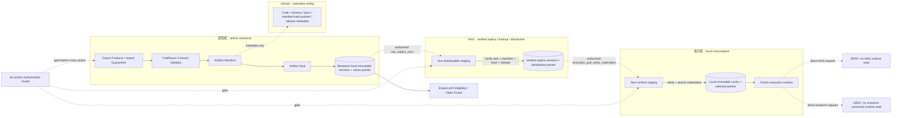
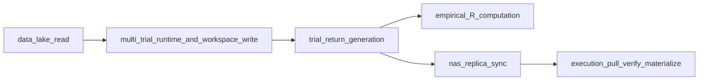

# 高层设计（HLD）：Trial-Return 与跨机部署合同

> 本文只冻结 CR-172 PATH-I 的 trial-return instrumentation、artifact identity、manifest/seal、verified replica、immutable materialization、六类逐动作授权、empirical-R disposition 和最小 SignalBatch 边界。本文不是实现、运行授权、真实数据证据或 Stage 3 activation 声明。

## 修订记录

| 版本 | 日期 | 修订人 | 变更要点 |
|---|---|---|---|
| 1.0 | 2026-07-17 | meta-se-critical | 初始 CR-specific HLD；覆盖 §1～§20，冻结 REQ-CR172-009～015 `7/7`、4 个架构灰区、3 套候选、5 个场景模拟、manifest/seal/replica/materialization/authorization/rollback 边界。 |
| 1.1 | 2026-07-18 | meta-se-critical | CP3 review correction R1：冻结 `ReturnDefinitionV1`、producer feasibility 设计义务与授权执行资格 DAG；其中 producer feasibility 结论已由 v1.2 的 source audit 安全收窄为 current runner hook/diff=`0/0`。 |
| 1.2 | 2026-07-18 | meta-se-critical | CP5 LLD review R1 架构整改：§3/§9.4/§11.2 将本 CR 收窄为 contract、fixture producer port、seal/replica/materialization 与 zero-op guard，现有 mature runner 修改=`0`；§10.1 将现有 `net_forward_return` 定类为 `forward_label_proxy@v1` 并禁止进入 trial-return/empirical-R；§10.2 冻结唯一 original seal digest/verifier 合同；§10.4 冻结 fixture/real typed binding；§11.2/§11.8 增加 `partial_lineage_blocked_audit`，原子 lineage 能力转独立 owner CR。 |
| 1.3 | 2026-07-18 | meta-se-critical | CP5 LLD review R2 最小整改：§10.4 将当前 `approved_ledger` 固定为 authorized/eligible 双 false 并新增稳定 reason；§10.2/§11.4 允许 S04 复用唯一 verifier-library，但数据必须来自 S03 selected replica；删除 `evidence_kind` 第二真相；§6/§11.6 将 REQ-013 明确为 `contract_ready/runtime_enforcement_deferred` 并绑定 future native-producer path-enforcement 前置。 |
| 1.4 | 2026-07-18 | meta-se-critical | CP5 LLD review R3 上层合同最小整改：§10.2/§11.4 删除 S03 verifier facade 备选，唯一冻结 S04 从 S03 current selected-replica read contract 取数并直接调用 S02 唯一 verifier-library；schema、hash domain、Story DAG、file owner、测试计数、授权与 claim ceiling 均不变。 |

## 1. 问题定义

### 1.1 问题陈述

当前仓库没有可作为 empirical dependency matrix 上游的独立 per-trial portfolio return series。CR-163 只保存 experiment family/trial metadata 与 artifact refs，现有 `layered_returns.csv` 是因子分层 forward returns，CR-173 v1 消费的是已声明的 dependency matrix R；三者都不能被重标为 trial-return source。与此同时，未来真实研究需要跨研究机、NAS、执行机稳定追踪 artifact，但不能把 NAS 变成 runtime working canonical，也不能让主机绝对路径进入 lineage identity。

### 1.2 核心价值

用一条可审计、fail-closed、可逐动作授权的 sealed artifact chain，把“未来真实 trial-return 如何成为合格 source”与“当前没有真实 source/授权”的事实同时表达清楚，使后续 PATH-C/A 能在不越权、不伪造 empirical evidence 的前提下选择 native instrumentation、external import 或 `typed_unavailable` 降级。

### 1.3 目标

| 优先级 | 目标 | 度量方式 |
|---|---|---|
| P0 | 冻结 trial-return source/object、schema、manifest 与 seal 合同 | REQ-009 语义字段 `9/9`；wrong-kind/source absent/identity mismatch/unsealed 拒绝率 `100%` |
| P0 | 冻结 research-local canonical → NAS verified replica → execution local immutable cache | 四组件 `4/4`；logical URI + hash `100%`；partial/stale/hash mismatch/direct-NAS 接受数 `0` |
| P0 | 冻结六类逐动作授权与撤销边界 | 动作 `6/6`、判定点 `6/6`；隐含授权 `0`；当前授权/执行 `0/6` |
| P0 | 冻结 declared-exact/empirical/typed-unavailable/BLOCKED 声明合同 | 分类 `1/1`；pre-v2 positive effective count=`0`；`c1_computable=false` |
| P0 | 冻结 SignalBatch 最小边界且阻止 scope inflation | approved contract slots `8/8`；额外 mandatory slot=`0`；详细 exchange 模块/Story/实现=`0/0/0` |
| P1 | 保留新路径与 legacy 审计兼容 | 新默认合同 `1/1`；legacy write/move/rename/rewrite=`0/0/0/0` |

### 1.4 成功标准

- [ ] REQ-CR172-009～015 架构追踪 `7/7`，UC-58-CR172 覆盖 `1/1`。
- [ ] normal seal/replicate/materialize、stale/hash mismatch、empirical v2/typed-unavailable 至少 `3/3` 场景模拟通过；本文实际为 `6/6`，其中包含“runtime 自身获批但 data-lake read 未获批”的执行资格负例 `1/1`。
- [ ] trial-return payload、manifest、seal、replica receipt、materialization receipt、authorization record 和 claim disposition 的 owner 均唯一。
- [ ] 允许依赖无环；research-local canonical 不依赖 NAS，execution runtime 不依赖 NAS 或 research machine。
- [ ] CP3 真实目录、lake/NAS、runtime、R、signal、交易、部署和 Git remote 操作计数全部为 `0`。

### 1.5 约束

| 类型 | 约束内容 |
|---|---|
| 阶段 | CP3 design-only；不创建 Story、LLD、source、test、fixture 或运行目录。 |
| 数据 | 不读写真实 lake/NAS，不生成 trial-return，不计算 R，不 materialize。 |
| 权限 | 六类真实动作必须逐项授权；当前 `0/6`。 |
| Identity | canonical identity 只能是 stable logical URI + content SHA-256；绝对挂载路径只属于 deployment mapping。 |
| Runtime | NAS 不是 working canonical；execution runtime 只消费本地 immutable cache。 |
| Signal | 只保留 approved `8/8` contract slots；mailbox/state/ack/replay/exchange/intraday 全部 deferred。 |
| Claim ceiling | `stage3_entry_ready=false`、`c1_computable=false`、`real_data_authorized=false`、`multi_trial_runtime_authorized=false`、`signal_transport_authorized=false`。 |

### 1.6 非目标（Out of Scope）与相邻对象边界

| 相邻对象 / 能力 | 本 HLD 不负责 | 正确衔接 |
|---|---|---|
| CR-163 ExperimentFamily lineage | 不把 metadata/ref 变为 return payload，也不修改其状态机 | 未来只让 lineage 引用 sealed trial-return logical identity |
| CR-173 offline methodology | 不设计 sampling-error methodology v2，不实现 estimator/public C1 projection | positive empirical claim 前由 `FU-CR173-001` 承接；DQ-003 降级可继续 |
| Signal exchange | 不设计 mailbox path、状态机、ack、idempotency/replay、consumer 或 intraday | `DF-CR172-SIGNAL-BATCH-EXCHANGE` / `DF-CR172-INTRADAY-REALTIME-SIGNAL` |
| Runner implementation | 不修改 default research root，不创建 multi-trial runner，不写 workspace，也不修改 `engine/mature_multifactor_research.py` | 真实 native multi-trial period-return producer/instrumentation 由独立 runtime-high-risk 前置 CR 承接；本 CR 只提供 fixture producer port |
| Migration | 不 move/rename/recanonicalize/rewrite legacy artifact | 独立 migration CR，需 inventory/hash/rollback/授权 |
| Trading / release | 不生成信号、订单，不连接 QMT，不 publish/deploy | 独立 runtime/trading/release gate |

### 1.7 关键假设

- 未来 producer 或 import gateway 能提供完整 family/run/trial identity、ordered observations、return basis 和 source lineage；否则回退 `typed_unavailable`。
- SHA-256 与 canonical manifest serialization 可在未来 repository-local fixture 中确定性复算；当前不实现。
- NAS 和 execution 路径只作为 deployment mapping，且每次操作都由独立 authorization envelope 覆盖。

### 1.8 缺失信息

| 优先级 | 缺失信息 | 影响范围 | 处理 |
|---|---|---|---|
| REQUIRED | CP3 是否接受 ARCH-A、严格 seal 顺序、六判定点和四态 claim guard | 后续 CP4/CP5 设计输入 | 形成 4 个可枚举 Decision Brief 项；不阻断 HLD 草案 |
| RESOLVED | `simple_return`、`net_return`、`gross_return`、`nav` 的 canonical schema 归属和演进权责 | TrialReturnPayloadV1 schema identity / 下游可比性 | 由 CP3 architecture owner 通过 `ADR-CR172-I-010` 冻结；v1 恰好两列，CP5 不得静默扩列 |
| RESOLVED-CP5-R1 | 当前仓库是否存在可识别的 native multi-trial period-return producer | CP5 scope / PATH-C/A prerequisite | 结论为不存在；`DO-CR172-CP5-001` 关闭为 current runner hook=`0`、current runner diff=`0`。未来 runtime-high-risk 前置 CR 必须具备真实区间端点、持仓/权重、成本与 non-overlap 语义后才可选择插桩点 |
| OPTIONAL | manifest/seal 的具体 JSON canonicalization 库 | CP5 | 只冻结确定性、hash domain 和输入输出，不选实现库 |

## 2. 架构灰区与方案形成记录

**CP3 讨论日志**：`process/discussions/CP3-CR172-PATH-I-HLD-DISCUSSION-LOG.md`  
**CP3 讨论恢复点**：`process/checks/CP3-CR172-PATH-I-DISCUSSION-CHECKPOINT.json`

### 2.1 Architecture Gray Areas

| 灰区 ID | 关键问题 | 影响面 | 推荐 | 状态 |
|---|---|---|---|---|
| AGA-CR172-I-01 | native/import/absent source 与 manifest/seal 顺序 | source / schema / lineage / rollback | native-first，import/absent 为切换 | resolved-for-draft |
| AGA-CR172-I-02 | canonical/replica/cache 拓扑 | storage / identity / reliability / security | 三段隔离链 | resolved-for-draft |
| AGA-CR172-I-03 | 六动作判定与撤销 | authorization / audit / rollback | 六 envelope + 六判定点 | resolved-for-draft |
| AGA-CR172-I-04 | empirical classification 与 v2 前置 | methodology / claim / release | 四态；v2 只阻断 positive claim | resolved-for-draft |

### 2.2 方案形成输入与事后审查区分

| 类型 | 来源 | 影响章节 | 处理结果 | 说明 |
|---|---|---|---|---|
| 方案形成输入 | lane-product 分析视角 | §3/§5/§6 | adopted | 保留未来真实 overfit 评估价值，同时允许 typed_unavailable |
| 方案形成输入 | lane-architecture 分析视角 | §8～§11 | adopted | 单一 canonical、logical identity、严格 manifest/seal/replica/materialization 顺序 |
| 方案形成输入 | lane-quality 分析视角 | §7/§12/§13 | adopted | stale/partial/hash/alignment/auth failure 全部 fail-closed |
| 方案形成输入 | lane-docs-check 分析视角 | §1/§19/§20 | adopted | 明确“设计合同不等于已实现/已授权/已验证真实运行” |
| HLD 后评审意见 | CP3 人工 review | 全文 | approved-after-correction-r1 | 三项整改 `3/3 PASS` 后由用户批准；不得倒填为前置讨论 |

### 2.3 Deferred Architecture Ideas

| ID | 延后项 | 延后原因 | 重启条件 |
|---|---|---|---|
| DAI-CR172-I-01 | 低频 SignalBatch detailed exchange | 当前只批准 8-slot boundary | 激活 `DF-CR172-SIGNAL-BATCH-EXCHANGE` 并新走 CP2/CP3 |
| DAI-CR172-I-02 | intraday realtime signal transport | 超出四组件基础拓扑和当前授权 | 明确低延迟需求并激活独立 CR |
| DAI-CR172-I-03 | Empirical methodology v2 | 属于方法学 owner，不是 PATH-I instrumentation 实现 | positive available count/C1 claim 前完成 `FU-CR173-001` |
| DAI-CR172-I-04 | 外部 R / return import | 需要独立 provenance/security contract | native producer 不可行且用户选择 import-first |
| DAI-CR172-I-05 | legacy migration | 会改变历史路径和 identity 映射 | 独立 migration CR 具备 inventory/hash/rollback/授权 |

## 3. 候选架构方案对比

### 3.1 方案 A：Native Sealed Artifact Pipeline（推荐）

目标态由未来独立 runtime-high-risk CR 的 native multi-trial producer 在研究机本地输出 per-trial payload；经 contract validation、manifest、seal 后成为 local active canonical；随后分别经授权复制到 NAS verified replica，再经独立授权拉取、校验、原子物化为 execution local immutable cache。当前 CR 只实现同一合同的 repository fixture producer port，不修改任何现有研究 runner。

### 3.2 方案 B：Import-first Sealed Artifact Pipeline

外部预计算 return series 先进入 research-local quarantine；只有通过独立 import/provenance contract 才进入与 A 相同的 manifest/seal/replica/materialization 链。该方案不允许把外部绝对路径或供应方声明直接当 canonical identity。

### 3.3 方案 C：Contract-only / Distribution Blocked

source absent、owner/授权/校验能力缺失时，只保留 schema/identity/claim 合同；不创建 replica，不 materialize，不计算 empirical R，输出 `typed_unavailable` 或 `BLOCKED`。

### 3.4 方案对比矩阵

| 维度 | ARCH-A | ARCH-B | ARCH-C |
|---|---|---|---|
| 用户价值 | 高：保留 native lineage 和 future positive path | 中高：可接外部 source | 低：只有诚实降级 |
| 实现复杂度 | 高 | 高（额外 import provenance） | 低 |
| 可验证性 | 高：全链 fixture 可分层 | 中高：外部 provenance 增加变量 | 高：只验证 deny/typed-unavailable |
| 维护成本 | 中高 | 高 | 低 |
| 安全 / 权限 | 六动作分权可控 | 增加外部输入面 | 最小风险 |
| 回退成本 | pointer-only，保留旧 sealed version | quarantine + pointer-only | 无运行回退 |
| REQ-009～015 | `7/7` | `7/7`（需 future import CR） | `6/7` 完整，跨机价值降级 |

**推荐方案**：目标态保持 ARCH-A，但当前交付切片固定为 ARCH-C-compatible contract/fixture implementation。真实 native producer 必须先完成独立 runtime-high-risk CR；该前置未完成、provenance/owner/授权/v2 任一不足时持续 `typed_unavailable` 或 `BLOCKED`，不得把现有 forward-label proxy 提升为 trial-return。NAS runtime canonical、direct-NAS runtime read、GitHub 数据面扩大不属于候选。

## 4. 推荐方案总览

### 4.1 复杂度模式

| 判定维度 | 依据 | 结论 |
|---|---|---|
| 需求规模 | 7 个 P0 REQ，跨数据、权限、部署、方法和兼容 | complex |
| 角色数量 | 研究负责人、研究员、方法学 owner、数据授权 owner、独立验证负责人 | complex |
| 状态流转 | payload→validated→manifested→sealed→replicated→materialized，多失败分支 | complex |
| 平台适配 | 研究机、NAS、执行机、GitHub 4 组件 | complex |
| 安全边界 | 6 个独立真实动作、默认 deny | complex |

### 4.2 核心思路

使用“不可变 artifact + 可变指针”的分层管道：payload、manifest、seal、replica receipt、materialization receipt 一经生成即不可变；只有在前一阶段全部校验通过且对应 action authorization 有效时，才原子推进本层 pointer。跨机器 identity 永远使用 logical URI + payload content SHA-256，host path 仅作为部署映射。

### 4.3 核心能力边界

- 做：冻结 source/schema、manifest/seal、identity、replica/materialization verification、六动作 gate、R disposition、legacy 路径与 SignalBatch 8-slot boundary。
- 不做：生成任何真实 payload/R/signal，不创建路径，不运行 producer，不传输或交易。

### 4.4 产物形态

| 产物类别 | CP3 数量 | 说明 |
|---|---:|---|
| CR-specific HLD / ADR | `1 / 1` | 设计文档 |
| 新 runtime service / daemon | `0` | 禁止提前实现 |
| Signal exchange module / state machine | `0 / 0` | deferred |
| Story / Wave / LLD | `0 / 0 / 0` | CP3 设计阶段实际计数；批准后只允许进入 CP4/CP5 设计准备，仍不得实现 |
| 真实运行 artifact | `0` | 无 lake/NAS/runtime 操作 |

## 5. 适用性矩阵

| 适用性维度 | 当前判断 | ARCH-A 如何适配 | 不适配信号 | When to switch |
|---|---|---|---|---|
| 用户目标 | 未来需真实 multiple-testing/overfit evidence | 先冻结 fixture-verifiable contract；真实 native producer 独立高风险落地 | 缺少真实 period-return 语义或原子 lineage owner 能力 | 当前保持 C-compatible；未来前置 CR 完成后才进入 A，外部 provenance 完整时可评估 B |
| 项目成熟度 | 当前只有单次研究和 declared-exact estimator | 先合同/fixture，后独立 runtime gate | 被误写为现有能力 | 立即切 C 并纠正文档 |
| 认知负担 | 需解释 canonical/replica/cache 与六动作 | 固定对象名、状态和 owner；不以物理路径代 identity | pointer/版本/owner 语义漂移 | CP5 前拆 Feature design，不改 HLD 核心原则 |
| 验证条件 | 当前只允许 static/fixture | 每段都有输入、输出、fail-closed receipt | 需要真实 NAS 才能验证合同 | 回退 fixture-only；真实验证另授权 |
| 回退成本 | 不得改写 sealed artifact | pointer-only rollback，partial object 不可发布 | 实现依赖覆盖写或共享盘 | BLOCKED，回 CP5 设计澄清 |

### 5.1 优化 / 牺牲 / 切换条件

| 方案选择 | 优化了什么 | 牺牲了什么 | 接受理由 | 切换条件 |
|---|---|---|---|---|
| ARCH-A | lineage、跨机身份、故障隔离、逐动作撤销、可验证性 | 合同数量、staging/receipt 复杂度 | runtime-high-risk 链路必须可归因、可回滚 | native 不可行→B；任一安全前置缺失→C |

## 6. Use Case / Requirement → Architecture Traceability

| Requirement / Use Case | 支撑模块 / 合同 | 关键流程 | 异常 / 失败路径 | 验证方式 | 覆盖 |
|---|---|---|---|---|---:|
| UC-58-CR172 | 全部 PATH-I 组件 | §11 全链 | 缺 source/授权/v2 时降级；完整性冲突 BLOCKED | §7 五场景 + TEST-MATRIX | `1/1` |
| REQ-CR172-009 | M-I01 TrialReturnContract、M-I02 ManifestSeal | FLOW-I01 | wrong-kind、missing、identity mismatch、unsealed 拒绝 | SC-I01/N02/N04 | `1/1` |
| REQ-CR172-010 | M-I03 ReplicaVerifier、M-I04 Materializer | FLOW-I02/I03 | stale/partial/hash mismatch 不推进 pointer；direct-NAS 禁止 | SC-I02/N03/B02/B03/F02 | `1/1` |
| REQ-CR172-011 | M-I05 ActionAuthorizationGuard | FLOW-I00 | partial approval 无并集；过期/撤销立即 deny | SC-A02/Q02 | `1/1` |
| REQ-CR172-012 | 四组件 ownership、Dependency Map | FLOW-I02/I03 | GitHub forbidden payload、execution direct-NAS 拒绝 | SC-I02/N05/A02/S01 | `1/1` |
| REQ-CR172-013 | M-I07 RunPathContract | FLOW-I05 | 本 CR 仅 `contract_ready`；runtime default switch/enforcement=`deferred` | SC-G02 contract fixture + future native-producer enforcement | contract=`1/1`；runtime=`0/1 deferred` |
| REQ-CR172-014 | M-I06 EmpiricalEligibilityGuard | FLOW-I04 | declared-exact 冒充、alignment/repair/auth/v2 缺失 fail-closed | SC-N02/N04/Q02/C02 | `1/1` |
| REQ-CR172-015 | `SignalBatchBoundaryV1`（contract facet，非 exchange module） | FLOW-I06 boundary-only | 8-slot 缺失/畸形拒绝；detailed/intraday 路由 deferred | SC-S01～S06 | `1/1` |

## 7. 关键场景模拟

> 以下是设计走查，不是实际 lake/NAS/runtime 执行；真实操作计数保持 `0`。

| 模拟 ID | 场景 | 输入 / 前置条件 | 推荐架构执行路径 | 预期输出 | 失败 / 回退路径 | 结果 |
|---|---|---|---|---|---|---|
| SIM-CR172-I-01 | normal seal→replicate→materialize | hypothetical valid payload；六动作在各自未来窗口独立获批；明确 expected release | payload validate → manifest hash → seal → local pointer → NAS staging verify → replica pointer → execution staging verify → atomic cache pointer | identity 始终为 logical URI+content hash；三个 immutable receipt 可追踪 | 任一 gate/校验失败不推进本层 pointer；保留上一 verified version | PASS |
| SIM-CR172-I-02 | replica stale/partial/hash mismatch | NAS candidate 与 approved manifest/hash/release 任一不一致 | ReplicaVerifier 在 distributable pointer 前比较 release/manifest/seal/content hash | replica=`BLOCKED`，distribution/materialization=`0`，research canonical 不变 | 隔离 partial；重新复制需新的有效 sync authorization；不得 direct-NAS | PASS |
| SIM-CR172-I-03 | empirical positive claim 与降级 | sealed refs 缺 FU-CR173-001 v2 或 computation authorization | EmpiricalEligibilityGuard 检查 classification、8 类 provenance、alignment、v2、auth | `typed_unavailable`，available count=`0`，`c1_computable=false`；PATH-C/A 设计可选降级继续 | hash/alignment/tamper/unauthorized repair 归 `BLOCKED`；不得重标 declared_exact | PASS |
| SIM-CR172-I-04 | partial action authorization | 只批准 hypothetical `data_lake_read`，其他 5 项 deny | 每个操作在自己的 enforcement point 查询独立 envelope | 仅该 action 可表示为 allowed；runtime/generation/R/sync/pull 均不执行；direct-NAS deny | 授权中途撤销时不推进 pointer，partial staging non-runtime | PASS |
| SIM-CR172-I-05 | SignalBatch scope containment | 提出 EOD batch 与 detailed ack/replay/intraday 请求 | 只校验 8 approved slots；detailed request 进入 deferred routing | slots=`8/8`，extra mandatory=`0`；exchange/state/ack/replay/intraday implementation=`0` | detailed→DF-SIGNAL-BATCH；intraday→DF-INTRADAY；不创建正式 CR | PASS |
| SIM-CR172-I-06 | runtime authorization 无 data-lake 前置 | `multi_trial_runtime_and_workspace_write=approved`，但相同 scope revision/hash、release/run/family context 的 `data_lake_read=deny/missing/expired` | ActionAuthorizationGuard 先校验 runtime 自身 envelope，再校验执行资格 DAG 的直接前置和上下文一致性 | `eligible_to_execute=false`；runner launch=`0`、workspace create/write=`0`、pointer advance=`0` | 保留独立批准记录但不产生权限并集；待 data-lake read 独立获批且上下文完全匹配后重新判定 | PASS |

## 8. 系统架构图

依赖方向是单向的：research canonical 不依赖 NAS；NAS replica 不拥有 canonical authority；execution runtime 不依赖 NAS/research；GitHub 不在 payload data plane。

## 9. 高层模块、Feature 与数据归属

### 9.1 Feature 边界

| Feature ID | 职责 | 非职责 | 拥有对象 | 只读对象 |
|---|---|---|---|---|
| FEAT-CR172-I01 Trial Return Artifact | source contract、payload schema、fixture producer port、manifest/seal、verified seal digest、research canonical selection | 现有 runner 修改、multi-trial runtime、R 计算、NAS/执行写 | TrialReturnPayloadV1、TrialReturnManifestV1、ArtifactSealV1、SealedTrialReturnBundleV1、VerifiedTrialReturnBundleV1、ResearchCanonicalSelectionV1 | future producer lineage refs、authorization decision |
| FEAT-CR172-I02 Replica & Materialization | deployment mapping、replica verify receipt、materialization receipt、pointer 原子推进 | 拥有/改写 research canonical、runtime direct-NAS | ReplicaVerificationReceiptV1、MaterializationReceiptV1 | sealed artifact、authorization decision、expected release |
| FEAT-CR172-I03 Authorization & Claim Governance | 六动作授权 schema/decision、empirical disposition、claim ceiling、SignalBatch boundary contract | 生成 return/R/signal、exchange/ack/replay/trading | ActionAuthorizationRecordV1、ActionDecisionV1、EmpiricalRDispositionV1、SignalBatchBoundaryV1 | artifact/receipt refs |

### 9.2 模块职责

| 模块 | 职责 | 输入 | 输出 | 依赖 |
|---|---|---|---|---|
| M-I01 TrialReturnContract | 校验 object kind、schema、identity、ordered observations、return basis、lineage | future payload candidate | validated/unavailable/blocked result | M-I05 auth decision |
| M-I02 ManifestSeal | 构造 manifest body/hash，产生唯一 canonical seal digest，经 verifier 验证后才允许 fixture selection | validated payload + lineage + expected identity | immutable manifest/seal + verified bundle + canonical selection | M-I01、M-I05 |
| M-I03 ReplicaVerifier | 校验 NAS staging 的 seal/manifest/content/release/freshness | sealed bundle + expected release | replica receipt + optional pointer advance | M-I05 |
| M-I04 Materializer | 拉取到 non-runtime staging，三重校验后原子物化 cache | verified replica + expected release | materialization receipt + local cache selection | M-I03、M-I05 |
| M-I05 ActionAuthorizationGuard | 对六种 action 逐次 deny-default 判定，不做权限并集 | action request + `FEAT-CR172-I03` policy input / authorization envelope | allow/deny + evidence ref | FEAT-CR172-I03 Authorization & Claim Governance |
| M-I06 EmpiricalEligibilityGuard | 分类 R、校验 provenance/alignment/v2/auth、输出四态 disposition | sealed trial refs / declared matrix refs | disposition；绝不直接输出 R | M-I05、FU-CR173-001 status |
| M-I07 RunPathContract | 解析新 run semantic root，保持 legacy read-only audit | run intent / legacy ref | deployment mapping decision | M-I05（future write） |

SignalBatch 只有 `SignalBatchBoundaryV1` value-object contract，不设 exchange module、mailbox module、状态机或 consumer；相关模块数量=`0`。

### 9.3 四组件 ownership

| 组件 | 持有 / 可写（未来需授权） | 只读 / 消费 | 明确禁止 |
|---|---|---|---|
| 研究机 | checkout/uv/runtime workspace；local data/research；trial returns active canonical；manifest/seal | approved data release 与 source lineage | 把 NAS 当 canonical；未授权 runtime/generation/sync |
| NAS | verified replicas、backup、distribution receipts；5 个隔离 zone 的治理合同 | sealed bundle metadata | runtime working canonical、未验证/partial 进入 distribution pointer |
| 执行机 | local staging、verified immutable cache、future local signal/trading archive | approved package + local cache | direct-NAS/research runtime read；研究 artifact 反写 canonical |
| GitHub | code/schema/docs/manifest/hash/pointer/release metadata | 短摘要和 refs | real datasets/returns、credential、account/order payload、large artifact |

### 9.4 CP5 source disposition 与未来 producer 前置

`DO-CR172-CP5-001` 在 CP5 LLD review R1 后按安全收窄路线闭环：

1. 当前仓库可识别的 native multi-trial portfolio-period-return producer=`0`；现有 mature runner 修改、调用与 hook 声明=`0/0/0`。
2. 现有 `net_forward_return` 只可标记为 `forward_label_proxy@v1`，进入 `TrialReturnPayloadV1`、canonical selection、empirical-R 的接受数=`0/0/0`。
3. 本 CR 的 production scope 仅包含 pure contract、repository fixture producer port、canonical seal/verifier、replica/materialization 与 zero-op guard；source/file owner inventory=`100%/100%`。
4. fixture producer port 的调用方向、触发、输入、输出、衔接、降级和 origin/target binding=`7/7` 明确；它不接入现有 runner 或 lineage store。
5. 未来真实 producer/instrumentation 必须独立走 runtime-high-risk CR，至少冻结 observation interval 的 start/end、逐期持仓/权重、交易成本、return basis、窗口 non-overlap/alignment 与 atomic lineage/correction 能力；前置不足时 source 保持 `typed_unavailable`。
6. 未来 producer CR 才能重新执行 source-touch、单一 writer、授权顺序、失败回退和 integration point 评审；不得继承本 CR 的 fixture decision 或真实动作授权。

## 10. 技术合同与选型理由

### 10.1 TrialReturnPayloadV1

| 项 | 冻结值 | 约束 |
|---|---|---|
| object kind | `trial_portfolio_return_series@v1` | 不接受 layered returns、metadata/ref、scalar metric 或 dependency matrix |
| physical payload | Parquet（路径合同已批准为 `portfolio_returns.parquet`） | 具体库/压缩参数留 CP5；raw bytes 参与 content SHA-256 |
| column 1 | `timestamp` | UTC normalized timestamp，non-null、strictly increasing、unique；跨 trial empirical 计算必须共同窗口/对齐 |
| column 2 | `simple_return` | finite numeric，non-null、非 NaN/Inf、`>= -1.0`；不得隐式 fill/repair |
| return basis | manifest `return_basis` | 至少区分 simple net/gross 语义；所有 trial 必须一致，未知则 unavailable |

#### ReturnDefinitionV1 归属与演进

- CP3 architecture owner 对 `ReturnDefinitionV1` 的业务语义、canonical schema identity 和版本演进规则负责；决定记录为 `ADR-CR172-I-010`。
- `trial_portfolio_return_series@v1` canonical payload 必须**恰好**包含 `timestamp`、`simple_return` 两个必填列；`net_return`、`gross_return`、`nav` 均不是 v1 canonical 列，CP5 不得静默增加或用别名替换 `simple_return`。
- `simple_return` 的 net/gross 含义必须由 manifest `return_basis` 显式声明；unknown、跨 trial 不一致或语义冲突时为 unavailable/BLOCKED，不得靠列名猜测。
- CP5 只拥有 validation/serialization library、Parquet 编码、压缩与 repository-local fixture 的实现选择权，不拥有 canonical 字段增删或语义重定义权。
- 增加 `net_return`、`gross_return`、`nav` 或重定义任何 canonical return 字段，必须先有 versioned return-definition ADR 和 schema version bump；若改变 owner、真实运行授权、跨 trial 可比性或 empirical-R 统计语义，则拆独立后续 CR。
- 现有 mature multifactor 输出中的 `turnover.next_rebalance_date/net_forward_return` 定类为 `forward_label_proxy@v1`：label horizon 与 rebalance step 可不同且观测可重叠，因此不是可识别的 portfolio period return。它进入 `trial_portfolio_return_series@v1`、empirical-R 或 effective-count 的接受数=`0/0/0`。
- 真实 `simple_return` producer 必须显式给出 observation 区间起止、逐期持仓/权重、交易成本、return basis 与 non-overlap/alignment 语义；缺一项即 `typed_unavailable`，语义冲突即 `BLOCKED`。

### 10.2 TrialReturnManifestV1 与 ArtifactSealV1

Manifest 必填语义：`object_kind`、`schema_version`、`family_id`、`run_id`、`trial_id`、`logical_uri`、`return_basis`、`source_lineage_refs`、`row_count`、`observation_window`、`content_sha256`、`producer_contract_version`、`release_id`、`created_at`、`seal_status`。`manifest_sha256` 对 canonicalized manifest body 计算，hash domain 不包含自身和可变 pointer。

Seal 必须包含：`seal_version`、`logical_uri`、`content_sha256`、`manifest_sha256`、`release_id`、`sealed_at`、`producer_contract_version` 和 authorization/evidence refs（只存 refs，不存凭据）。seal 是独立 immutable record；replica/materialization 只能验证原 seal，不得重新 seal 或改变 identity。

唯一 public digest 合同为 `canonical_artifact_seal_sha256(seal) = "sha256:" + lower_hex(SHA256(canonical_artifact_seal_bytes(seal)))`。`verify_sealed_trial_return_bundle(bundle, selection)` 必须返回 `VerifiedTrialReturnBundleV1`，其中 `original_seal_sha256` 只能取上述同一 canonical bytes 的 verifier 结果。S03 精确消费 `SealedTrialReturnBundleV1`、`ResearchCanonicalSelectionV1`、`VerifiedTrialReturnBundleV1`、`ActionDecisionV1`、`ActionScopeContextV1` 与该 verifier；不得自行 reopen path、重新 canonicalize 或计算第二套 digest。

S04 的 payload 数据来源仍只能是 S03 current selected-replica read contract。execution staging port 必须返回精确 `SealedTrialReturnBundleV1 + ResearchCanonicalSelectionV1`；S04 必须直接依赖并调用 S02 唯一 verifier-library 完成 bytes-level 原 seal 复验。S03 verifier facade 允许项=`0`；S03 新增 digest/verifier facade/data bypass=`0/0/0`；S04 direct S02 verifier=`1`。该库依赖不得绕过 S03 selection 取数，secondary canonicalizer/digest/re-seal=`0/0/0`。

### 10.3 Identity 与 path mapping

| 层 | 合同 |
|---|---|
| canonical identity | `research://experiment-families/{family_id}/runs/{run_id}/trials/{trial_id}/returns/v1/portfolio_returns.parquet` + `content_sha256` |
| research mapping | `${QUANT_LAB_RESEARCH_RUNS_ROOT}/experiment-families/{family_id}/runs/{run_id}/trials/{trial_id}/returns/v1/portfolio_returns.parquet` |
| NAS mapping | `${NAS_RESEARCH_SYNC_ROOT}/runs/experiment-families/{family_id}/runs/{run_id}/trials/{trial_id}/returns/v1/portfolio_returns.parquet` |
| execution mapping | `${EXECUTION_RESEARCH_CACHE_ROOT}/experiment-families/{family_id}/runs/{run_id}/trials/{trial_id}/returns/v1/portfolio_returns.parquet` |
| rule | 路径只进 deployment mapping；绝对路径进入 identity/hash 的次数=`0` |

### 10.4 六类 ActionAuthorizationRecordV1

每个 action record 必须独立包含：`authorization_id`、`action_kind`、`owner`、`scope_revision`、`scope_sha256`、`allowed_logical_paths`、`denied_logical_paths`、`valid_from`、`expires_at`、`revoked_at`、`approval_ref`、`evidence_ref`。缺字段、过期、撤销、scope/hash 不匹配或 path 未命中 allowlist 时 deny。

不得改变上述 12-field record。派生 `ActionDecisionV1` 必须增加 `decision_origin=repository_fixture|approved_ledger`，`ActionScopeContextV1` 必须增加 `target_kind=repository_fixture|real_operation`。`repository_fixture` origin 只允许绑定 `repository_fixture` target、`fixture://` logical URI 与 repository-owned fixture/in-memory port；它与 `real_operation` target 的接受数=`0`。当前 v1 对任何 `approved_ledger` 输入固定返回 `authorized=false`、`eligible_to_execute=false`、reason=`APPROVED_LEDGER_ADAPTER_UNAVAILABLE`；caller 自报枚举和自构 12-field record 都不能解锁真实 action。可信 issuer/envelope/adapter 只能由未来独立 runtime-high-risk CR 引入。`evidence_kind` 字段/别名/第二 provenance 真相=`0`。

| action_kind | 强制判定点 |
|---|---|
| `data_lake_read` | dereference 任何真实 data release / dataset 前 |
| `multi_trial_runtime_and_workspace_write` | 启动 runner、创建/写 runtime workspace 前 |
| `trial_return_generation` | 写入第一个 payload byte 或生成 artifact candidate 前 |
| `empirical_R_computation` | 读取 sealed trial refs 进入 R estimator 前 |
| `nas_replica_sync` | 创建 NAS staging、写/推进 replica pointer 前 |
| `execution_pull_verify_materialize` | 读取 NAS payload、创建 execution staging、推进 cache pointer 前 |

#### 授权独立与执行资格依赖 DAG

六份 authorization record 可以独立审批、到期和撤销；独立性不等于任一 action 可脱离其上游单独执行。执行资格按以下 DAG 判定，箭头表示“直接前置 artifact/eligibility”，不表示合并审批：

| action_kind | 本动作独立授权 | 执行时必须验证的直接前置 | 上下文 / provenance 要求 | 不满足时 |
|---|---:|---|---|---|
| `data_lake_read` | 必须 | 无上游 action；仍须命中批准 release/dataset/path | scope revision/hash 与 approved data release 一致 | deny，不 dereference |
| `multi_trial_runtime_and_workspace_write` | 必须 | 有效 `data_lake_read` | 两份 record 必须绑定相同 scope revision/hash、release/run/family context | `eligible_to_execute=false`；runner/workspace/pointer=`0/0/0` |
| `trial_return_generation` | 必须 | eligible multi-trial runtime | generation context 与 runtime/read chain 完全一致 | 不写第一个 payload byte |
| `empirical_R_computation` | 必须 | sealed trial-return generation provenance | ordered sealed refs、same family/run/window、generation eligibility evidence；计算时若不再 dereference lake，不要求 read authorization 同时保持活动，但历史生成链必须可验证 | typed_unavailable/BLOCKED，不进入 estimator |
| `nas_replica_sync` | 必须 | sealed trial-return generation artifact | 原 seal、manifest、logical URI、content hash、release 与 sync scope 一致 | 不创建 NAS staging、不推进 distribution pointer |
| `execution_pull_verify_materialize` | 必须 | verified NAS replica receipt | expected release、manifest/seal/hash 与 pull scope 一致 | 不读 NAS payload、不创建 execution staging、不推进 cache pointer |

每一行都必须同时满足“本动作独立授权 + 直接前置 + 上下文/provenance”。批准记录可独立存在，但 `partial authorization` 的可执行权限并集始终为 `0`。

### 10.5 SignalBatchBoundaryV1

mandatory contract slots 精确为：`schema_version`、`batch_id`、`strategy_id`、`strategy_package_hash`、`content_sha256`、`signature/key_id`、`valid_from/valid_until`、`sequence_no`。第 6、7 项保持 CP2 批准的复合 slot；嵌套/拆列、编码和传输 schema 留 deferred CR。额外 mandatory slot=`0`。credential、account secret、broker order command 接受数=`0`。

## 11. 关键流程与回滚边界

### 11.1 FLOW-I00：逐动作授权

请求必须携带单一 `action_kind` 和 scope/hash；guard 先判定本动作 envelope，再按 §10.4 DAG 判定直接前置、scope revision/hash、release/run/family context 和 sealed provenance。guard 只返回该 action 的 authorization decision 与 `eligible_to_execute`，不继承、不合并其他批准。`authorization=allow` 但直接前置缺失时，`eligible_to_execute=false`。mid-operation revoke/expiry 发生时，本层不得推进 pointer；partial staging 标记 non-distributable/non-runtime，后续清理由新的有效授权覆盖。

### 11.2 FLOW-I01：payload → manifest → seal → local canonical

1. 当前 CR 只由 repository fixture producer port 提供 payload bytes 与 fixture identity；不读取现有 runner output、不调用 lineage store、不写真实 research root。
2. M-I01 校验 object kind、两列 schema、identity、time order、numeric domain、return basis、lineage refs 和 origin/target binding。
3. 计算 payload `content_sha256`；构造 manifest body 并计算 `manifest_sha256`。
4. 只有全部校验 PASS 才生成 `ArtifactSealV1`，并由 `verify_sealed_trial_return_bundle` 返回唯一 `VerifiedTrialReturnBundleV1`/`original_seal_sha256`；unsealed/unverified object 永不进入 selection/replica。
5. repository fixture selection 只能推进到 fixture/in-memory selection；真实 research canonical selection advance=`0`。未来真实 producer 必须在独立 CR 重证 generation authorization 与原子 lineage 能力。
6. 若未来 append-only lineage 在 finish/finalize/selection 中出现 partial success，已追加事件不可擦除、不得调用 `fail()` 伪装回滚；必须输出 machine-readable `partial_lineage_blocked_audit`，canonical selection advance=`0`。批次原子性、outbox 或 correction/supersession 由独立 lineage-owner 前置 CR 承接。

### 11.3 FLOW-I02：local canonical → NAS verified replica

1. 在 `nas_replica_sync` authorization 有效时，把 sealed bundle 写到 NAS non-distributable staging。
2. 比较 expected release、logical URI、content hash、manifest hash、seal 和 freshness；任何 partial/stale/unversioned/mismatch 均 BLOCKED。
3. 校验成功才写 ReplicaVerificationReceiptV1 并原子推进 distribution pointer；不修改 research canonical。

### 11.4 FLOW-I03：NAS replica → execution local immutable cache

1. S04 只能从 S03 current selected-replica read contract 拉取到 execution non-runtime staging；不得直接按 S02/research path 选取数据。
2. staging port 返回精确 sealed bundle + selection；S04 必须直接调用 S02 唯一 verifier-library 对 payload/manifest/original seal bytes 做 `4/4` 校验，不得以 receipt metadata 替代 bytes，也不得创建第二 digest；S03 verifier facade 允许项=`0`。
3. 对 approved release、manifest、seal、content hash 全部 PASS 后才原子物化 immutable cache 并写 receipt；tampered seal bytes 时 seal=false、pointer advance=0。

### 11.5 FLOW-I04：empirical R disposition

| 判定 | 结果 |
|---|---|
| 显式 fixture/golden matrix，无真实 trial-return provenance | `declared_exact`；不得支持 empirical claim |
| source/授权/v2 任一尚未提供，但无完整性冲突 | `typed_unavailable`；可继续降级设计，`c1_computable=false` |
| sealed same-family/run refs、ordered trials、共同 window、alignment/missing policy、method v2+hash、有效域/PSD repair policy、独立验证、R-compute auth 全部满足 | `empirical` eligible；是否计算仍由未来授权/实现决定 |
| hash/identity/window/alignment 冲突、篡改、未授权 repair 或越权请求 | `BLOCKED`；不得自动修复或降级成 declared_exact |

### 11.6 FLOW-I05：新路径与 legacy

新单次研究目标合同为 `${QUANT_LAB_RESEARCH_RUNS_ROOT}/multifactor-strategy-research/{run_id}/`；本 CR 只交付 `RunPathDecisionV1` 和 fixture contract，状态=`contract_ready/runtime_enforcement_deferred`。现有 runner diff/default switch/runtime path enforcement=`0/0/0`，不得在 CP8 宣称 REQ-013 runtime delivered。future native-producer runtime-high-risk 前置必须包含 path-enforcement 子前置：在 launch/workspace first side effect 前消费 `RunPathDecisionV1`，证明 new default=`1`、legacy write=`0`。历史 `/home/hyde/data/quant-lab/research/runs/stage3_mature_multifactor/{run_id}/` 继续只读审计。

### 11.7 FLOW-I06：Signal boundary only

默认执行机本地生成信号，跨机传输=`0`。PATH-I 只验证 8-slot boundary 的完整/畸形/禁带字段语义；任何 path/state/ack/idempotency/replay/exchange/consumer/intraday 请求都返回 deferred route，不生成当前模块或 Story。

### 11.8 回滚矩阵

| 失败点 | 不得发生 | 回滚 / 恢复 |
|---|---|---|
| payload/manifest/seal validation fail | local canonical pointer 前移 | 保留上一 selection；candidate unavailable/BLOCKED |
| append-only lineage partial success | 擦除已追加事件、用 `fail()` 伪装回滚、推进 trial-return canonical selection | 输出 `partial_lineage_blocked_audit`；selection advance=`0`；转独立 lineage-owner 原子性/correction CR |
| NAS sync 中断或 mismatch | distribution pointer 前移 | partial staging non-distributable；重新授权后重传/复验 |
| execution pull 中断或 mismatch | cache pointer 前移、runtime 读取 staging | 保留上一 local cache selection；重新拉取/复验 |
| authorization revoke/expire | 新 action 或 pointer commit | 当前层停止；不删除 immutable prior evidence；清理另需授权 |
| empirical alignment/v2 fail | available count 或 C1 true | typed_unavailable 或 BLOCKED；不得 repair/relabel |
| new path compatibility fail | 回写 legacy 默认或迁移历史 | 停止新 run；另起 compatibility/migration CR |

## 12. 非功能需求设计

| 质量特征 | 量化目标 | 设计承载 | 验证方式 |
|---|---|---|---|
| 完整性 | stale/partial/unversioned/hash mismatch 接受=`0`；唯一 seal digest 可复算=`100%`；secondary digest=`0` | immutable artifact + manifest/seal/verifier/receipt | fixture contract |
| 原子性 | partial staging pointer advance=`0` | staging + verify + atomic pointer | failure injection fixture |
| 安全性 | unauthorized action=`0/6`；GitHub forbidden payload=`0`；direct-NAS runtime read=`0` | six-action guard + data ceiling | static/permission fixtures |
| 执行资格 | runtime 无同 scope data-lake 前置时启动=`0`；partial authorization 权限并集=`0` | action prerequisite DAG + context equality | negative authorization fixture |
| 可靠性 | NAS 故障不改变 research canonical=`100%`；execution 失败保留上一 cache=`100%` | 单向依赖、pointer-only rollback | recovery simulation |
| 可审计性 | action decision/manifest/seal/replica/materialization refs coverage=`6/6` action + `5/5` lifecycle stages | typed receipts + refs-only evidence | traceability check |
| 可维护性 | 数据 owner 冲突=`0`；依赖环=`0`；绝对路径进入 identity=`0` | Blueprint/Domain/Dependency Map | static review |
| 兼容性 | legacy write/move/rename/rewrite=`0/0/0/0`；历史审计引用保留=`100%` | new semantic root + legacy read-only | boundary fixture |
| 性能 | CP3 runtime performance claim=`N/A` | 未实现、未运行；未来 CP5 需为 payload/hash streaming 建立可测目标 | CP5 重新判定，不能在 CP3 伪造数值 |

## 13. 主要风险与应对

| 风险 ID | 风险描述 | 概率 | 影响 | 应对策略 | 触发信号 |
|---|---|---|---|---|---|
| R-CR172-TRIAL-RETURN-SOURCE-ABSENT | 当前无真实 per-trial series | 高 | 高 | ARCH-A 合同；缺 source 回 C typed_unavailable | wrong-kind/source missing |
| R-CR172-PATH-IDENTITY-DRIFT | host path 或 pointer 被当 identity | 中 | 高 | logical URI+hash；path mapping 不进 identity | same payload across hosts identity 不一致 |
| R-CR172-SYNC-REPLICA-STALE | stale/partial/hash mismatch 被分发 | 中 | 高 | expected release + 4-layer verify + atomic pointer | receipt/hash/release 不一致 |
| R-CR172-RUNTIME-AUTHORIZATION-GAP | 一次批准隐含其他动作 | 中 | 高 | 6 envelope、6 enforcement points、no union | partial approval 触发未批准 action |
| R-CR172-RETURN-DEFINITION-DRIFT | CP5 静默增加 net/gross/nav 或重定义 simple_return，导致跨 trial 语义失配 | 中 | 高 | ADR-010 固定 v1 两列；字段变化需 versioned ADR + schema bump | schema 不是恰好两列或 return_basis 不一致 |
| R-CR172-FORWARD-LABEL-PROXY-ALIAS | overlapping forward label 被误作 portfolio period return | 高 | 高 | 明确 `forward_label_proxy@v1` 禁入；真实 producer 独立 runtime-high-risk CR | proxy 进入 payload/R/effective-count |
| R-CR172-PARTIAL-LINEAGE-OVERCLAIM | append-only partial success 被伪装为 rollback | 中 | 高 | `partial_lineage_blocked_audit`；selection advance=0；原子 lineage 独立 CR | 调用 fail 试图擦除已追加事件 |
| R-CR172-FIXTURE-AUTHORIZATION-ESCAPE | fixture allow 被传给真实 target | 中 | 高 | decision origin + target kind typed binding | fixture+real accepted > 0 |
| R-CR172-REAL-R-DOMAIN-MISMATCH | declared matrix 或 pre-v2 empirical 产生正向 claim | 高 | 高 | 四态 guard；FU 条件前置；DQ-003 降级 | available count/C1 true 前 v2 缺失 |
| R-CR172-SIGNAL-TRANSFER-AMBIGUITY | 8-slot boundary 被扩张为 exchange | 中 | 高 | detailed module/Story/implementation=`0`；deferred routing | 出现 path/state/ack/replay/intraday 设计 |
| R-CR172-NAS-CANONICALITY-CONFLICT | NAS 被当 runtime canonical | 低 | 高 | Dependency Map forbidden edge；runtime local-only | execution direct NAS read |
| R-CR172-LEGACY-REWRITE | 新默认切换诱发历史迁移 | 中 | 高 | legacy read-only；migration 独立 CR | move/rename/manifest rewrite 请求 |

## 14. ADR 决策点

| ADR ID | 决策 | HLD 章节 |
|---|---|---|
| ADR-CR172-I-001 | native sealed artifact pipeline 为目标态，import/absent 为条件回退 | §3 |
| ADR-CR172-I-002 | identity=logical URI+content hash，absolute path=deployment only | §10.3 |
| ADR-CR172-I-003 | research-local canonical→NAS replica→execution cache；禁止 direct-NAS runtime | §8/§11 |
| ADR-CR172-I-004 | validate→manifest→seal→pointer→replica→materialize 严格顺序 | §10.2/§11 |
| ADR-CR172-I-005 | 六动作六判定点，当前 `0/6` | §10.4/§11.1 |
| ADR-CR172-I-006 | empirical 四态、FU 条件前置、DQ-003 降级 | §11.5 |
| ADR-CR172-I-007 | new semantic path；legacy read-only/no migration | §11.6 |
| ADR-CR172-I-008 | SignalBatch exact 8-slot boundary；detailed exchange/intraday deferred | §10.5/§11.7 |
| ADR-CR172-I-009 | immutable versions + pointer-only rollback；partial staging 永不 runtime/distributable | §11.8 |
| ADR-CR172-I-010 | `ReturnDefinitionV1` 由 CP3 architecture owner 冻结；v1 恰好两列，字段演进必须 versioned ADR + schema bump | §10.1 |
| ADR-CR172-I-011 | 当前切片 fixture-only；真实 producer/原子 lineage 分属独立 runtime-high-risk/lineage-owner 前置 CR | §9.4/§11.2 |

## 15. 分阶段落地建议

| 阶段 | 交付物 | 里程碑 | 前提条件 |
|---|---|---|---|
| CP3 | 本 HLD、ADR、蓝图三件套、discussion/result | `path_i_hld_review_ready=true` | CP2 7/7 approved |
| CP4/CP5（当前） | Feature/Story/LLD R2；闭环 fixture binding、seal verifier、partial-lineage audit 与 source zero-diff | repository-local pure contract/fixture 范围获人工确认；current runner/lineage diff=`0/0` | CP3 approved；真实动作仍 `0/6`；真实 producer 与原子 lineage 各自独立前置 CR |
| CP6/CP7（未来） | code/test/fixture 与 static/zero-op evidence | contract/negative/recovery fixtures 通过；真实动作执行 `0/6` | CP5 approved |
| CP8（未来） | release/readiness 文档 | 最高 `path_i_design_ready=true` | CP7 通过；五项高阶 flag 仍 false |

## 16. 工作量与 Story 一致性

| 类别 | 当前 Story 数 | 当前 Wave 数 | 说明 |
|---|---:|---:|---|
| Trial-return / seal | 0 | 0 | CP3 不创建 Story；CP3 通过后由 CP4 判定 |
| Replica / materialization | 0 | 0 | 同上 |
| Authorization / claim guard | 0 | 0 | 同上 |
| Signal detailed exchange / intraday | 0 | 0 | deferred，不进入当前计划 |
| **合计** | **0** | **0** | 与 §15 CP3 阶段一致；非未来工作量估算 |

## 17. 待确认问题

| 问题 ID | 问题 | 类型 | 推荐 | 备选 | 状态 |
|---|---|---|---|---|---|
| CP3-DQ-CR172-I-01 | ARCH-A 是否作为目标态？ | architecture | native sealed pipeline | import-first / typed_unavailable | RESOLVED-user-approved-2026-07-18 |
| CP3-DQ-CR172-I-02 | 是否确认严格 seal/replica/materialization 顺序和 pointer-only rollback？ | architecture | 确认 | distribution blocked | RESOLVED-user-approved-2026-07-18 |
| CP3-DQ-CR172-I-03 | 是否确认六 envelope/六判定点与 mid-operation revoke 规则？ | security | 确认；当前全 deny | permanent fixture-only | RESOLVED-user-approved-2026-07-18 |
| CP3-DQ-CR172-I-04 | 是否确认 empirical 四态/v2 条件前置与 signal 8-slot ceiling？ | risk_acceptance | 确认 | declared-exact-only/local-signal-only | RESOLVED-user-approved-2026-07-18 |

## 18. HLD 自审记录

| 自审项 | 结果 | 证据 / 说明 |
|---|---|---|
| Architecture Gray Areas 已前置处理 | PASS | discussion log AGA `4/4` |
| Advisor table 已影响推荐方案 | PASS | ARCH-A/B/C 与 §3/§5/§11 |
| 至少两套真实候选 | PASS | ARCH-A、ARCH-B；ARCH-C 为安全回退 |
| HLD 拆分判定 | PASS | 单 HLD；SignalBatch 无独立模块/Story/成功路径 |
| 适用性矩阵完整 | PASS | §5 |
| Use Case / Requirement traceability | PASS | UC `1/1`、REQ `7/7` |
| 关键场景模拟 | PASS | §7 `6/6`；包含 runtime-own-auth/no-data-read 负例 `1/1` |
| CP3 review correction R1 + CP5 safety correction | PASS | ReturnDefinition、授权 DAG 保留；producer feasibility 收窄为 existing runner/lineage diff=`0/0`，fixture/seal/partial-lineage 合同补齐 |
| manifest/seal/replica/materialization/授权/回滚 | PASS | §10～§11 |
| HLD / ADR / Risk / NFR 内部一致 | PASS | §12～§14；ADR companion |
| Claim ceiling | PASS | 五项 false；真实动作 `0/6` |
| Signal scope containment | PASS | 8/8 slots；detailed module/Story/implementation=0 |

## 19. Gotchas

- “有 manifest”不等于 sealed；未生成并复算 seal 的对象不得进入 canonical、replica 或 cache pointer。
- “NAS 上有同名文件”不等于 verified replica；必须匹配 expected release、logical URI、manifest hash、content hash 与原 seal。
- “pull 成功”不等于可供 runtime；只有原子物化和 receipt 完成后的本地 immutable cache 才可被未来 runtime 选择。
- logical URI 不是绝对路径别名；不得把 mount path 放入 lineage identity 或借路径优先级提升 stale replica。
- “runtime authorization 已批准”不等于 runner 可启动；没有同 scope/read context 的有效 `data_lake_read` 时，执行资格仍为 false。
- `simple_return` 是 v1 唯一 canonical return 列；不得在 CP5 以“更完整”为由静默加入 net/gross/nav 或创建双真相。
- `forward_label_proxy@v1` 不是 portfolio period return；即使 seal/hash 正确也不得进入 empirical-R。
- fixture allow 不是缩小版真实授权；origin/target 不匹配必须在 first side effect 前 deny。
- `approved_ledger` 只是当前 schema 枚举，不是可用 adapter；v1 必须双 false，caller 自报不能解锁。
- S04 可复用 S02 verifier library，但不能绕过 S03 selected replica 获取 payload。
- RunPath contract PASS 不等于 runtime default 已切换；REQ-013 的 runtime enforcement 仍是 future native-producer 前置。
- append-only partial lineage 不能靠 `fail()` 回滚；只能留下 machine-readable BLOCKED audit 并停止 selection。
- `typed_unavailable` 是诚实的前置不足，不是失败伪装；hash/alignment/tamper/unauthorized repair 必须 `BLOCKED`。
- `FU-CR173-001` 只硬阻断 positive empirical effective count/C1，不得被误写为阻断 DQ-003 降级设计。
- SignalBatch 的 `signature/key_id` 与 `valid_from/valid_until` 是 CP2 批准的复合 contract slots；物理嵌套/拆列属于 deferred，不得在本 HLD顺手设计 exchange schema。
- CP3 PASS 只表示可供人工评审，不表示任何实现、授权、运行、发布或交易已发生。

## 20. CP3 确认记录

**CP3 自动预检结果**：`process/checks/CP3-CR172-PATH-I-HLD-CONSISTENCY.result.json`  
**CP3 人工 checklist**：由 host-orchestrator 生成，本 agent 不写人工 checkpoint。

**确认状态**：已批准（整改 R1 后）

**审核意见**：原 4 项 CP3 推荐获接受；CP5 R1 进一步证明当前仓库没有合格 native period-return producer，故本 CR 已安全收窄为 contract/fixture，并将真实 producer/原子 lineage 转独立前置。该修订不新增实现或真实操作授权。

**确认人**：user

**确认时间**：2026-07-18T10:10:02+08:00
