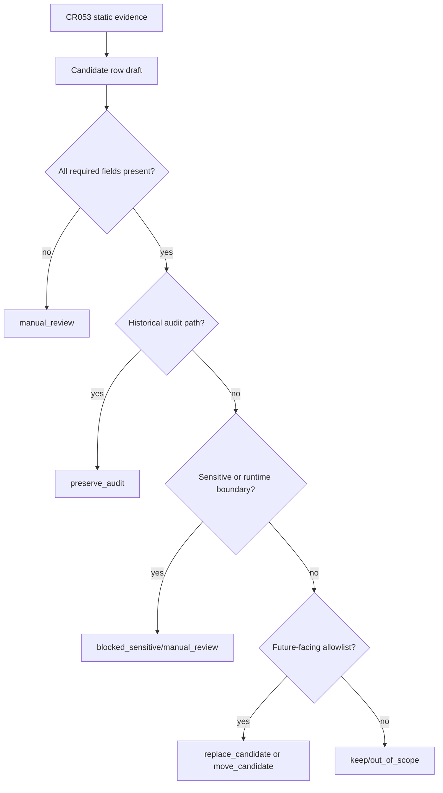

# LLD: CR058-S02 — Candidate List and Owner Classification Gate

> 本 LLD 只定义 CR058 candidate list 合同与人工复核门禁，不生成真实候选清单，不执行 `move` / `rename` / `delete` / bulk rewrite。

## 0. 上游设计依据

| 来源 | 路径 / ID | 被本 LLD 消费的内容 |
|---|---|---|
| Formal CR | `process/changes/CR-058-REPO-LOCAL-MECHANICAL-MIGRATION-RELAYOUT-GATE-2026-06-14.md` | CR058 范围、五维影响分析、不授权项、LLD 批次门禁。 |
| HLD | `docs/design/HLD-CR058-REPO-LOCAL-MECHANICAL-MIGRATION-RELAYOUT-GATE.md` | Candidate List Gate 模块、allowlist-first 架构、成功标准 SC-CR058-03。 |
| ADR | `docs/design/ARCHITECTURE-DECISION-CR058.md` | ADR-CR058-002 candidate / preserve-audit 策略；ADR-CR058-004 当前批次不新增 mover 脚本。 |
| Feature Matrix | `docs/design/FEATURE-DESIGN-MATRIX-CR058.md` | `CR058-S02` 的 `required_level=full-lld` 与 `dev_gate`。 |
| CR053 Inventory | `docs/release/MIGRATION-INVENTORY-CR053.md` | `path_pattern`、`owner`、`artifact_class`、`move_action`、`risk`、`verification_rule`、`forbidden_content_result` 字段来源。 |
| CR053 Path References | `docs/release/PATH-REFERENCES-CR053.md` | `classification`、`proposed_action`、manual-review / preserve-audit / mechanical-candidate 分类。 |

## 1. Goal

创建 CR058 candidate list 合同，定义 repo-local relayout / rewrite 候选项必须具备的字段、分类、owner、风险和验证规则，并将任何缺字段、敏感、历史审计或 out-of-scope 对象 fail-closed 到 `manual_review` / `preserve_audit` / `blocked_sensitive`，不执行真实动作。

## 2. Requirements（Functional / Non-Functional）

### 2.1 Functional

- 定义 candidate list 的必填字段集合，字段覆盖率目标为 100%。
- 定义 `classification` 与 `proposed_action` 的枚举值和允许转换关系。
- 将 README / USER-MANUAL / future-facing docs 与历史 process evidence 分开处理。
- 明确 `pyproject.toml` package name、import path、module rename 默认 out-of-scope。
- 明确 `MARKET_DATA_LAKE_ROOT` 引用默认 `keep`，不得替换。
- 明确 QMT / trading docs 默认 `manual-review`，不得机械替换 C/S 边界名。

### 2.2 Non-Functional

- 安全：禁止读取 `.env`、token、password、cookie、session、private key、账户凭据或未脱敏交易事实。
- 可审计：每个 candidate 必须回链到 CR053 inventory/path reference 来源或人工新增理由。
- 可回滚：任何 `replace_candidate` / `move_candidate` 必须标记 `rollback_ref_required=true`。
- 确定性：只允许 exact path family / exact reference family，不使用模糊匹配作为执行依据。
- no-op：本 Story 不生成脚本、不执行路径扫描、不读取 untracked data、不执行 rewrite。

## 3. 模块拆分与职责

| 模块 / 文件组 | 职责 | 说明 |
|---|---|---|
| Candidate Schema Contract | 定义 candidate list 字段和枚举 | 本 LLD 只定义 schema；后续 CP6 可生成 Markdown / YAML 清单但仍 no-op。 |
| Source Mapping Rules | 将 CR053 inventory / path references 映射为 CR058 candidate 分类 | 只消费已存在静态文档，不重新扫描仓库。 |
| Owner Classification Rules | 定义 owner、risk、verification_rule 必填策略 | owner 缺失时 `manual_review`，不得执行。 |
| Action Guard | 阻止 `execute_move` / `execute_rewrite` 出现在 candidate list | proposed_action 只能是候选或保留语义。 |
| Sensitive Boundary Guard | 将敏感或未检查运行时内容置为 blocked/manual review | 不读取正文，不做凭据探测。 |

## 4. 代码结构与文件影响范围

| 动作 | 文件路径 | 变更内容 |
|---|---|---|
| 创建 | `process/stories/CR058-S02-candidate-list-and-owner-classification-gate-LLD.md` | 本 LLD。 |
| 后续创建 | `docs/release/CR058-CANDIDATE-LIST.md` | 后续 CP6 可创建 no-op candidate list 文档；当前不创建。 |
| 后续修改 | `process/checks/CP5-CR058-S02-candidate-list-and-owner-classification-gate-LLD-IMPLEMENTABILITY.md` | CP5 预检消费本 LLD 后标记 PASS。 |
| 不修改 | `README.md` / `docs/USER-MANUAL.md` / `pyproject.toml` / source code | 本 Story 不做真实 rewrite / relayout。 |

## 5. 数据模型与持久化设计

| 对象 / 字段 | 类型 | 约束 | 说明 |
|---|---|---|---|
| `candidate_id` | string | required, unique | 格式建议 `CR058-CAND-###`。 |
| `path_pattern` | string | required | repo-relative exact path 或路径族，不允许真实 NAS 路径。 |
| `reference_family` | enum | required | `project_identity` / `legacy_alias` / `runtime_config` / `historical_audit` / `trading_boundary` / `data_lake_boundary` / `other`。 |
| `context_kind` | enum | required | `user_doc` / `release_doc` / `design_doc` / `process_evidence` / `runtime_config` / `source_code` / `test_fixture` / `report_pointer`。 |
| `classification` | enum | required | `mechanical-candidate` / `manual-review` / `preserve-audit` / `blocked_sensitive` / `keep` / `out-of-scope`。 |
| `proposed_action` | enum | required | `keep` / `replace_candidate` / `move_candidate` / `manual_review` / `preserve_audit` / `blocked_sensitive` / `out_of_scope`。 |
| `owner` | string | required | 缺失时 candidate 不得执行。 |
| `risk` | enum | required | `low` / `medium` / `high` / `blocked`。 |
| `verification_rule` | string | required | 后续 CP7 或人工复核入口。 |
| `rollback_ref_required` | boolean | required | `replace_candidate` / `move_candidate` 必须为 `true`。 |
| `source_evidence` | string | required | CR053 文档路径、章节或人工新增记录。 |

无新增运行时持久化；后续 candidate list 作为 Git 内 Markdown / YAML 过程证据保存，不写数据库、不写 data lake。

## 6. API / Interface 设计

| 接口 / 入口 | 输入 | 输出 | 调用方 | 说明 |
|---|---|---|---|---|
| Candidate List Markdown Contract | CR053 inventory/path refs、人工补充候选 | `docs/release/CR058-CANDIDATE-LIST.md` | host-orchestrator / meta-dev 后续 CP6 | 后续可创建静态清单；不执行动作。 |
| Candidate Row Validation | candidate row | PASS / FAIL reason | CP5 / CP7 静态检查 | 字段缺失、非法枚举、`execute_move` 出现时 FAIL。 |
| Owner Review Queue | owner 缺失或 manual-review row | review queue | host-orchestrator | 只进入人工复核，不执行。 |

## 7. 核心处理流程

1. 读取 CR053 inventory/path reference 静态文档中的路径族和分类。
2. 只把 `README.md`、`docs/USER-MANUAL.md`、future-facing release/user docs 或人工明确新增项纳入 candidate 输入。
3. 为每行 candidate 填写 `candidate_id`、`path_pattern`、`reference_family`、`context_kind`、`classification`、`proposed_action`、`owner`、`risk`、`verification_rule`、`rollback_ref_required`、`source_evidence`。
4. 若 path 属于 `process/**`、checkpoint、handoff、历史 Story / LLD / DEV-LOG，则转为 `preserve-audit`。
5. 若 path / reference 命中敏感边界或未检查运行时内容，则转为 `blocked_sensitive` 或 `manual-review`。
6. 若 proposed_action 为真实执行语义，则 fail-closed，禁止进入清单。

## 8. 技术设计细节

- 关键规则：候选必须 allowlist-first；任何未明确允许路径不得成为 `replace_candidate` / `move_candidate`。
- 依赖复用：复用 CR053 静态 `MIGRATION-INVENTORY` 和 `PATH-REFERENCES` 分类，不重新扫描文件系统。
- 兼容性处理：`local_backtest` 可作为 legacy alias 历史事实保留；future-facing 文档可列为候选，但必须保留 legacy alias 兼容段。
- 图示类型选择：流程图；候选分类存在多分支 fail-closed 路径。
- 禁止枚举：candidate list 不允许出现 `execute_move`、`execute_rewrite`、`delete_now`、`rename_now`。

## 9. 安全与性能设计

| 维度 | 设计措施 | 验证方式 |
|---|---|---|
| 安全 | 不读取凭据、`.env`、untracked data、NAS、data lake 或交易事实。 | 静态审查不授权项；检查清单不得包含敏感正文。 |
| 审计 | 每行 candidate 必须有 source_evidence 和 owner。 | 字段覆盖率检查。 |
| 性能 | 当前只处理静态文档与候选 schema，无大规模扫描。 | 无运行时性能风险；后续清单行数可人工审查。 |

## 10. 测试设计

| 测试场景 | 前置条件 | 操作 | 预期结果 | 验证方式 |
|---|---|---|---|---|
| Candidate 字段完整性 | candidate list 存在 | 检查 required 字段 | 字段覆盖率 100% | 静态表格 / YAML parse 检查 |
| 非法 action fail-closed | candidate 包含 `execute_move` | 执行静态检查 | FAIL，不允许进入执行 | grep / schema check |
| 历史证据 preserve-audit | candidate path 为 `process/checkpoints/**` | 分类检查 | `classification=preserve-audit` | 静态审查 |
| 敏感边界阻断 | candidate path 含 `.env` / token / key | 分类检查 | `blocked_sensitive` 或 excluded | 静态审查，不读取正文 |
| `MARKET_DATA_LAKE_ROOT` 引用 | candidate reference 为 lake root | 分类检查 | `keep` | 静态审查 |
| QMT / trading docs | candidate context 为 trading boundary | 分类检查 | `manual-review` | owner review |

## 11. 实施步骤

| TASK-ID | 动作 | 目标文件 | 详细描述 | 对应测试 |
|---|---|---|---|---|
| TASK-CR058-S02-01 | 创建 | `process/stories/CR058-S02-candidate-list-and-owner-classification-gate-LLD.md` | 写入 full-lld。 | LLD 章节检查 |
| TASK-CR058-S02-02 | 后续创建 | `docs/release/CR058-CANDIDATE-LIST.md` | 仅在 CP5 通过后创建 no-op candidate list。 | Candidate 字段完整性 |
| TASK-CR058-S02-03 | 后续检查 | `process/checks/CP5-CR058-S02-candidate-list-and-owner-classification-gate-LLD-IMPLEMENTABILITY.md` | 标记 LLD implementability。 | CP5 auto check |

## 12. 风险、难点与预研建议

### 12.1 实现灰区与取舍记录

| Clarification ID | 问题 | 选项与推荐 | 决策 / 答案 | 影响面 | 证据 | 重访条件 |
|---|---|---|---|---|---|---|
| LCQ-CR058-S02-01 | 是否允许 repo-wide rewrite 作为 candidate 默认策略？ | 推荐 allowlist-first；备选 repo-wide rewrite。 | 用户已接受推荐口径：allowlist-first。 | 文件 owner / 审计 / 安全 | 当前对话“接受，继续推进”；CP2/CP3 DQ。 | 用户明确要求全仓替换时重访。 |

| 风险 / 难点 | 影响 | 缓解措施 / 预研建议 |
|---|---|---|
| 候选范围遗漏 | future-facing docs 未完全收敛 | 允许后续人工新增 candidate，并重新过 CP5。 |
| owner 缺失 | 无法确认语义 | 缺 owner 时 `manual_review`，不得执行。 |
| 候选与 preserve-audit 冲突 | 可能破坏审计 | preserve-audit 优先。 |

### OPEN / Spike 跟踪

| ID | 类型（OPEN / Spike） | 问题 | 下一动作 | 责任方 |
|---|---|---|---|---|
| N/A | OPEN | 无阻断 OPEN。 | N/A | N/A |

## 13. 回滚与发布策略

- 发布方式：当前仅提交设计证据，不发布运行产物。
- 回滚触发条件：candidate list schema 被用户 reject 或发现越权执行语义。
- 回滚动作：删除或修订 CR058 candidate list 设计文档；不需要文件系统迁移回滚，因为本 Story 不执行真实动作。

## 14. Definition of Done

- [x] 14 个章节全部填写完成
- [x] 文件影响范围、接口、测试与实施步骤可直接指导后续 no-op candidate list 实现
- [x] 实现灰区与取舍记录已回填
- [x] `confirmed=false` 时不进入实现
- [x] OPEN / Spike 已清点
- [ ] 人工确认意见已收敛

## 人工确认区

**CP5 — Story 设计证据可实现性门**

| # | 检查项 | 状态 | 证据 |
|---|---|---|---|
| 1 | LLD 覆盖 AC | 待检查 | 第 2 / 10 / 14 节 |
| 2 | 与 HLD / ADR 一致 | 待检查 | 第 3 / 8 / 12 节 |
| 3 | 文件影响范围明确 | 待检查 | 第 4 / 11 节 |
| 4 | 接口契约完整 | 待检查 | 第 6 节 |
| 5 | 测试与 dev_gate 可计算 | 待检查 | 第 10 / 14 节 |
| 6 | clarification queue 已收敛 | 待检查 | 第 12.1 节 |

**人工审查结果回填**：

- 结论：`pending`
- 审查人：
- 审查时间：
- 修改意见：
- 风险接受项：
