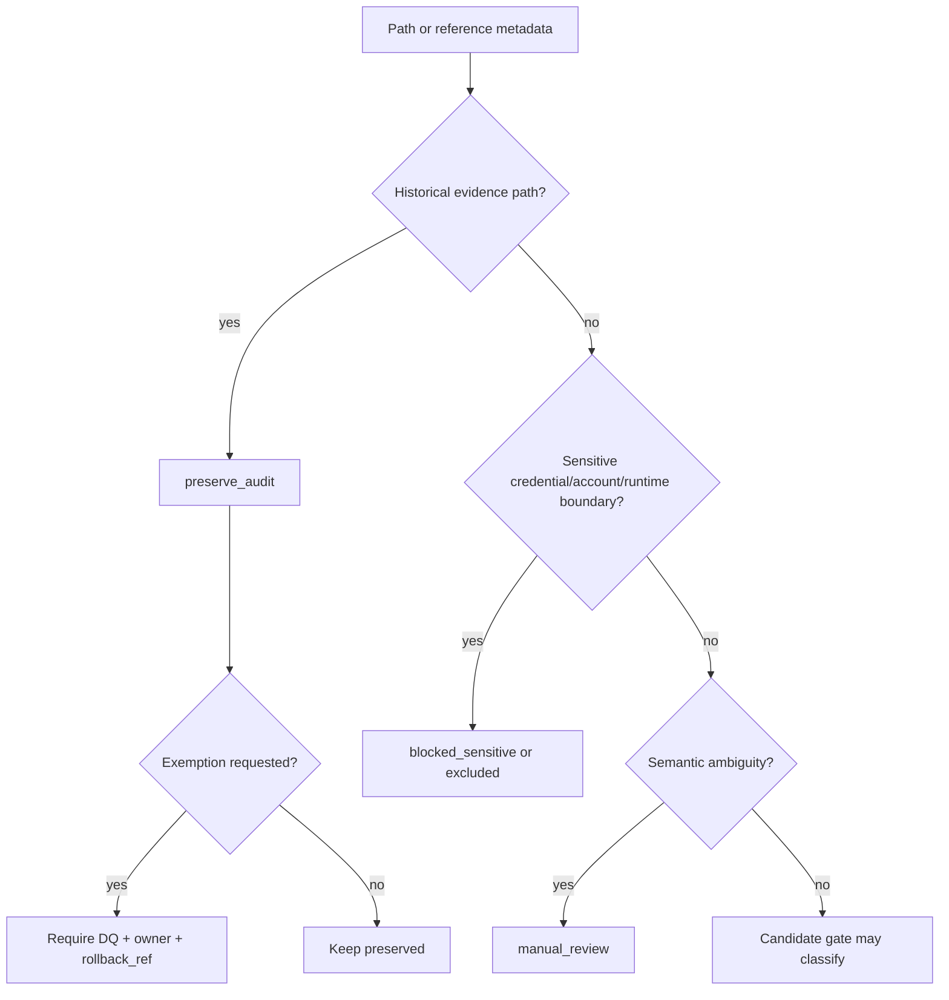

# LLD: CR058-S03 — Preserve-audit Allowlist and Sensitive Filter Gate

> 本 LLD 只定义历史审计保护与敏感输入过滤门禁，不改写历史文件，不读取敏感正文。

## 0. 上游设计依据

| 来源 | 路径 / ID | 被本 LLD 消费的内容 |
|---|---|---|
| Formal CR | `process/changes/CR-058-REPO-LOCAL-MECHANICAL-MIGRATION-RELAYOUT-GATE-2026-06-14.md` | preserve-audit、敏感边界、不授权项。 |
| HLD | `docs/design/HLD-CR058-REPO-LOCAL-MECHANICAL-MIGRATION-RELAYOUT-GATE.md` | Preserve-audit Gate 和 Sensitive Boundary Guard。 |
| ADR | `docs/design/ARCHITECTURE-DECISION-CR058.md` | ADR-CR058-002 preserve-audit 优先于机械替换。 |
| Feature Matrix | `docs/design/FEATURE-DESIGN-MATRIX-CR058.md` | `CR058-S03` 的 `required_level=full-lld`。 |
| CR053 Path References | `docs/release/PATH-REFERENCES-CR053.md` | preserve-audit 规则、blocked_sensitive 分类、manual-review 规则。 |
| CR053 Release Context | `process/release/RELEASE-CONTEXT-CR053.yaml` | 不授权凭据读取、NAS/lake/runtime/git remote 操作。 |

## 1. Goal

创建 CR058 preserve-audit allowlist 与 sensitive filter 的设计合同，确保历史过程证据默认不被机械改写，敏感路径或运行时内容不进入 candidate list 或 rewrite 输入。

## 2. Requirements（Functional / Non-Functional）

### 2.1 Functional

- 定义默认 preserve-audit allowlist 路径族。
- 定义允许从 preserve-audit 移出的单项豁免字段。
- 定义 sensitive filter 的路径名、引用名和内容边界。
- 明确敏感过滤只按路径 / 引用元数据分类，不读取正文。
- 明确 manual-review 与 blocked_sensitive 的处理差异。

### 2.2 Non-Functional

- 审计完整性：历史 CP、handoff、Story、LLD、implementation evidence 保留当时语境。
- 安全：不读取、打印、记录凭据正文或未脱敏账户/交易事实。
- 可追溯：任何 allowlist 豁免必须有 path、owner、reason、risk、rollback_ref。
- 最小权限：不执行 filesystem scan、NAS scan、data lake scan、untracked data scan。

## 3. 模块拆分与职责

| 模块 / 文件组 | 职责 | 说明 |
|---|---|---|
| Preserve-audit Allowlist | 定义默认不可机械替换路径族 | `process/**` 和历史证据优先保护。 |
| Exemption Contract | 定义单项移出 allowlist 的必填字段 | 无豁免记录时不得移出。 |
| Sensitive Filter | 定义敏感边界元数据匹配规则 | 只看路径 / 引用，不读正文。 |
| Manual Review Queue | 接收语义不明但不一定敏感的对象 | QMT docs、trading docs、security-boundary governance docs 默认 manual-review。 |
| Blocked Sensitive Guard | 阻断凭据、账户、未脱敏交易事实 | blocked_sensitive 不进入执行。 |

## 4. 代码结构与文件影响范围

| 动作 | 文件路径 | 变更内容 |
|---|---|---|
| 创建 | `process/stories/CR058-S03-preserve-audit-allowlist-and-sensitive-filter-gate-LLD.md` | 本 LLD。 |
| 后续创建 | `docs/release/CR058-PRESERVE-AUDIT-ALLOWLIST.md` | 后续 CP6 可创建 no-op allowlist 文档；当前不创建。 |
| 后续修改 | `process/checks/CP5-CR058-S03-preserve-audit-allowlist-and-sensitive-filter-gate-LLD-IMPLEMENTABILITY.md` | CP5 预检消费本 LLD 后标记 PASS。 |
| 不修改 | `process/**` historical evidence | 不重写历史审计证据。 |
| 不读取 | `.env` / token / password / private key / account data | 不读取敏感正文。 |

## 5. 数据模型与持久化设计

| 对象 / 字段 | 类型 | 约束 | 说明 |
|---|---|---|---|
| `allowlist_id` | string | required | 格式建议 `PAG-CR058-###`。 |
| `path_pattern` | string | required | 默认 preserve-audit 路径族。 |
| `reason` | string | required | 为什么保留历史语境。 |
| `allowed_action` | enum | required | 固定为 `preserve_audit` / `manual_review`。 |
| `exemption_allowed` | boolean | required | 是否允许单项豁免。 |
| `exemption_required_fields` | list | required if exemption | `path`、`owner`、`reason`、`risk`、`rollback_ref`、`approval_decision_id`。 |
| `sensitive_rule_id` | string | required | 格式建议 `SFG-CR058-###`。 |
| `match_surface` | enum | required | `path_metadata` / `reference_metadata`，禁止 `file_content`。 |
| `filter_result` | enum | required | `blocked_sensitive` / `manual_review` / `excluded`。 |

无新增运行时持久化；后续 allowlist / filter 仅作为 Git 内静态文档。

## 6. API / Interface 设计

| 接口 / 入口 | 输入 | 输出 | 调用方 | 说明 |
|---|---|---|---|---|
| Preserve-audit Row Contract | path_pattern、reason、owner | allowlist row | CP5 / CP7 静态验证 | 每行证明为什么保留。 |
| Exemption Review Contract | path、owner、reason、risk、rollback_ref、decision_id | exemption row | host-orchestrator | 单项移出 allowlist 的唯一入口。 |
| Sensitive Filter Contract | path/reference metadata | filter_result | candidate list gate | 不读取正文，只分类。 |

## 7. 核心处理流程

1. 将 `process/checkpoints/**`、`process/checks/**`、`process/handoffs/**`、`process/stories/**` historical non-CR058、`process/context/**` historical capsules、`process/changes/CR-*.md` historical CR、`DEV-LOG.md` historical entries、legacy `checkpoints/**` 标记为 preserve-audit。
2. 对明确 legacy alias 说明段落标记 `keep` 或 `preserve-audit`。
3. 对 QMT / trading / security-boundary 语义不明文档标记 `manual_review`，不机械替换。
4. 对 `.env`、token、password、private key、cookie、session、账户、资金、持仓、委托、成交、untracked data、外置 lake / NAS 正文标记 `blocked_sensitive` 或 `excluded`。
5. 若用户要求单项豁免，必须生成 DQ，记录 path、owner、reason、risk、rollback_ref。

## 8. 技术设计细节

- preserve-audit 优先级高于 mechanical-candidate。
- sensitive filter 不允许打开文件正文判断，只使用路径 / 引用元数据。
- `security-boundary` 这类治理文档路径名不等同于凭据；默认 `manual_review` 而不是读取正文。
- 单项豁免必须进入 CP5 / 后续 DQ，不允许在实现中临时决定。
- 图示类型选择：流程图；存在多层 fail-closed 分支。

## 9. 安全与性能设计

| 维度 | 设计措施 | 验证方式 |
|---|---|---|
| 安全 | 禁止读取敏感正文，敏感分类仅基于元数据。 | 检查 LLD / candidate list 不含敏感正文。 |
| 审计 | 默认保护历史过程证据。 | allowlist 覆盖 8 类默认路径族。 |
| 性能 | 不扫描文件树或 NAS，仅处理静态清单。 | 无运行时扫描。 |

## 10. 测试设计

| 测试场景 | 前置条件 | 操作 | 预期结果 | 验证方式 |
|---|---|---|---|---|
| 默认历史证据保护 | 输入 `process/checkpoints/**` | 分类 | `preserve_audit` | 静态审查 |
| Handoff 保护 | 输入 `process/handoffs/**` | 分类 | `preserve_audit` | 静态审查 |
| Story 历史保护 | 输入 historical `process/stories/**` | 分类 | `preserve_audit` | 静态审查 |
| 敏感路径阻断 | 输入 `.env` / token / key metadata | 分类 | `blocked_sensitive` / `excluded` | 静态审查，不读正文 |
| QMT docs 语义不明 | 输入 QMT / trading docs | 分类 | `manual_review` | owner review |
| 单项豁免缺字段 | exemption 缺 owner / rollback_ref | 检查 | FAIL | schema / checklist |

## 11. 实施步骤

| TASK-ID | 动作 | 目标文件 | 详细描述 | 对应测试 |
|---|---|---|---|---|
| TASK-CR058-S03-01 | 创建 | `process/stories/CR058-S03-preserve-audit-allowlist-and-sensitive-filter-gate-LLD.md` | 写入 full-lld。 | LLD 章节检查 |
| TASK-CR058-S03-02 | 后续创建 | `docs/release/CR058-PRESERVE-AUDIT-ALLOWLIST.md` | 仅在 CP5 通过后创建 no-op allowlist 文档。 | 默认历史证据保护 |
| TASK-CR058-S03-03 | 后续检查 | `process/checks/CP5-CR058-S03-preserve-audit-allowlist-and-sensitive-filter-gate-LLD-IMPLEMENTABILITY.md` | 标记 LLD implementability。 | CP5 auto check |

## 12. 风险、难点与预研建议

### 12.1 实现灰区与取舍记录

| Clarification ID | 问题 | 选项与推荐 | 决策 / 答案 | 影响面 | 证据 | 重访条件 |
|---|---|---|---|---|---|---|
| LCQ-CR058-S03-01 | 是否默认保护历史审计证据？ | 推荐 preserve-audit-by-default；备选批量改写。 | 用户已接受推荐口径。 | 审计 / 文档 / 跨 Story 契约 | 当前对话“接受，继续推进”；CP2/CP3/CP5 DQ。 | 用户明确列出单项豁免时重访。 |

| 风险 / 难点 | 影响 | 缓解措施 / 预研建议 |
|---|---|---|
| 历史文档长期保留 legacy alias | 命名不完全统一 | 明确 legacy alias 是 historical fact。 |
| 敏感路径误判 | 可能漏掉高风险输入 | 敏感-looking path 默认 manual_review / blocked。 |
| 单项豁免滥用 | 破坏审计链 | 豁免必须 DQ + owner + rollback_ref。 |

### OPEN / Spike 跟踪

| ID | 类型（OPEN / Spike） | 问题 | 下一动作 | 责任方 |
|---|---|---|---|---|
| N/A | OPEN | 无阻断 OPEN。 | N/A | N/A |

## 13. 回滚与发布策略

- 发布方式：当前仅提交设计证据。
- 回滚触发条件：allowlist 规则被用户 reject，或发现敏感过滤边界不足。
- 回滚动作：修订 allowlist / filter 设计；不需要真实迁移回滚，因为本 Story 不执行真实动作。

## 14. Definition of Done

- [x] 14 个章节全部填写完成
- [x] 文件影响范围、接口、测试与实施步骤可直接指导后续 no-op allowlist 实现
- [x] 实现灰区与取舍记录已回填
- [x] `confirmed=false` 时不进入实现
- [x] OPEN / Spike 已清点
- [ ] 人工确认意见已收敛

## 人工确认区

**CP5 — Story 设计证据可实现性门**

| # | 检查项 | 状态 | 证据 |
|---|---|---|---|
| 1 | LLD 覆盖 AC | 待检查 | 第 2 / 10 / 14 节 |
| 2 | 与 HLD / ADR 一致 | 待检查 | 第 3 / 8 / 12 节 |
| 3 | 文件影响范围明确 | 待检查 | 第 4 / 11 节 |
| 4 | 接口契约完整 | 待检查 | 第 6 节 |
| 5 | 测试与 dev_gate 可计算 | 待检查 | 第 10 / 14 节 |
| 6 | clarification queue 已收敛 | 待检查 | 第 12.1 节 |

**人工审查结果回填**：

- 结论：`pending`
- 审查人：
- 审查时间：
- 修改意见：
- 风险接受项：
