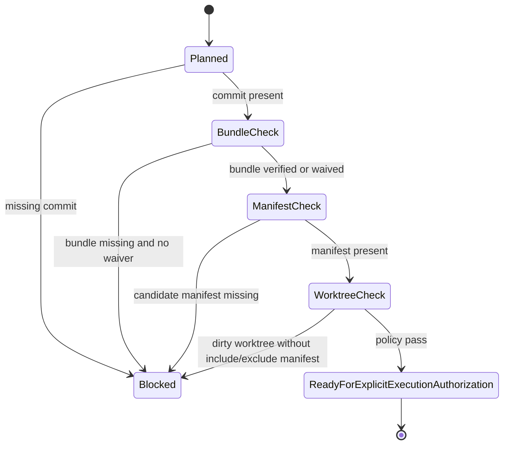

# LLD: CR058-S04 — Rollback Ref and Preflight Evidence Gate

> 本 LLD 只定义 rollback_ref 与 preflight evidence 合同，不创建 commit、不创建 bundle、不执行 git reset / checkout / push / tag / remote rename / history rewrite。

## 0. 上游设计依据

| 来源 | 路径 / ID | 被本 LLD 消费的内容 |
|---|---|---|
| Formal CR | `process/changes/CR-058-REPO-LOCAL-MECHANICAL-MIGRATION-RELAYOUT-GATE-2026-06-14.md` | rollback_to、rollback_ref gate、禁止真实执行。 |
| HLD | `docs/design/HLD-CR058-REPO-LOCAL-MECHANICAL-MIGRATION-RELAYOUT-GATE.md` | Rollback Ref Gate 模块、成功标准 SC-CR058-05。 |
| ADR | `docs/design/ARCHITECTURE-DECISION-CR058.md` | ADR-CR058-003 rollback_ref 三件套。 |
| Feature Matrix | `docs/design/FEATURE-DESIGN-MATRIX-CR058.md` | `CR058-S04` 的 `required_level=full-lld`。 |
| CR053 Migration Plan | `docs/release/MIGRATION-PLAN-CR053.md` | `pre_cr058_commit`、`pre_cr058_git_bundle`、`pre_reference_rewrite_manifest`、restore rehearsal 边界。 |
| CR053 Release Context | `process/release/RELEASE-CONTEXT-CR053.yaml` | CR053 不授权真实 git remote / migration 操作。 |

## 1. Goal

创建 CR058 rollback_ref 与 preflight evidence gate，定义后续真实 repo-local move / rewrite 前必须满足的本地 commit、git bundle、candidate manifest、reference rewrite manifest、failure manifest 和 dirty worktree policy。当前不执行任何 Git 或文件迁移动作。

## 2. Requirements（Functional / Non-Functional）

### 2.1 Functional

- 定义 `pre_cr058_commit` 必填语义和证明方式。
- 定义 `pre_cr058_git_bundle` 必填语义和用户豁免条件。
- 定义 `candidate_manifest_hash` 与 `pre_reference_rewrite_manifest` 的字段。
- 定义 `failure_manifest_schema`，保证失败可记录、可回退、可审计。
- 定义 dirty worktree policy，避免覆盖用户未纳入计划的修改。
- 缺任一硬门时设置 `execute_allowed=false`。

### 2.2 Non-Functional

- 可回滚：真实执行前必须可定位 pre-change checkpoint。
- 可审计：每个真实候选动作必须回链 candidate row 和 rollback_ref。
- 安全：禁止 destructive Git 命令和 remote 操作。
- 最小执行：当前只设计 gate，不执行 bundle、commit、reset、checkout、push。

## 3. 模块拆分与职责

| 模块 / 文件组 | 职责 | 说明 |
|---|---|---|
| Rollback Ref Contract | 定义 rollback_ref 类型、必填时间、证明方式 | 本 LLD 只定义合同。 |
| Candidate Manifest Contract | 定义 candidate manifest 与 hash | 依赖 S02 candidate list。 |
| Reference Rewrite Manifest Contract | 定义每个 rewrite 候选与 source/target/rollback 的映射 | 依赖 S02 / S03。 |
| Failure Manifest Contract | 定义失败记录字段 | 后续执行失败时使用。 |
| Dirty Worktree Policy | 定义执行前工作树状态检查要求 | 当前不执行 git status 之外的真实操作。 |
| Authorization Guard | 阻断 destructive / remote Git 操作 | git push/tag/remote/history rewrite 不授权。 |

## 4. 代码结构与文件影响范围

| 动作 | 文件路径 | 变更内容 |
|---|---|---|
| 创建 | `process/stories/CR058-S04-rollback-ref-and-preflight-evidence-gate-LLD.md` | 本 LLD。 |
| 后续创建 | `docs/release/CR058-ROLLBACK-GATE.md` | 后续 CP6 可创建 no-op rollback gate 文档；当前不创建。 |
| 后续修改 | `process/checks/CP5-CR058-S04-rollback-ref-and-preflight-evidence-gate-LLD-IMPLEMENTABILITY.md` | CP5 预检消费本 LLD 后标记 PASS。 |
| 不执行 | Git commit / bundle / reset / checkout / push / tag / remote rename | 当前 Story 明确不执行。 |
| 不修改 | repo 文件路径 / README / docs / source code | 本 Story 不做真实 relayout。 |

## 5. 数据模型与持久化设计

| 对象 / 字段 | 类型 | 约束 | 说明 |
|---|---|---|---|
| `rollback_ref_id` | string | required | `pre_cr058_commit` / `pre_cr058_git_bundle` / `pre_reference_rewrite_manifest`。 |
| `required_before` | enum | required | `any_real_move_or_rewrite` / `bulk_reference_rewrite` / `package_exchange`。 |
| `evidence_type` | enum | required | `commit_hash` / `git_bundle_verify` / `manifest_hash` / `risk_acceptance`。 |
| `evidence_path` | string | required when available | 后续证据路径；当前可为 `planned`。 |
| `status` | enum | required | `planned` / `present` / `verified` / `waived_by_user` / `missing`。 |
| `execute_allowed` | boolean | required | 任一 required ref missing 时为 `false`。 |
| `candidate_manifest_hash` | string | required before execution | 后续 candidate list 的 hash。 |
| `failure_manifest_field.path` | string | required | 失败对象路径。 |
| `failure_manifest_field.action` | enum | required | `move` / `rewrite` / `rename` / `delete`，当前不执行。 |
| `failure_manifest_field.reason` | string | required | 失败原因。 |
| `failure_manifest_field.rollback_ref` | string | required | 对应 rollback ref。 |
| `dirty_worktree_policy` | enum | required | `clean_required` / `explicit_include_exclude_manifest_required`。 |

无新增运行时持久化；后续证据作为 Git 内 Markdown / YAML 文档保存。

## 6. API / Interface 设计

| 接口 / 入口 | 输入 | 输出 | 调用方 | 说明 |
|---|---|---|---|---|
| Rollback Ref Checklist | rollback ref rows | PASS / BLOCKED | CP5 / CP7 / future execution gate | 缺 required ref 则 blocked。 |
| Candidate Manifest Hash Contract | candidate list | manifest hash | future execution gate | 当前只定义，不计算。 |
| Failure Manifest Contract | failed action metadata | failure row | future execution gate | 当前只定义 schema。 |
| Dirty Worktree Policy | git status summary / include-exclude manifest | PASS / BLOCKED | future execution gate | 不允许覆盖未纳入计划的用户改动。 |

## 7. 核心处理流程

1. 后续若用户授权真实执行，先检查 `pre_cr058_commit` 是否存在。
2. 检查 `pre_cr058_git_bundle` 是否 verified；若用户豁免，必须有 risk_acceptance DQ。
3. 检查 candidate manifest 是否存在且 hash 已记录。
4. 若执行 reference rewrite，检查 `pre_reference_rewrite_manifest` 是否存在。
5. 检查 dirty worktree policy：干净工作树或明确 include/exclude manifest。
6. 任一硬门缺失时设置 `execute_allowed=false`，不得执行真实动作。

## 8. 技术设计细节

- `pre_cr058_commit` 是真实执行前硬门，不代表本 Story 要创建 commit。
- `pre_cr058_git_bundle` 可被用户显式豁免，但必须记录 risk_acceptance；默认不豁免。
- `pre_reference_rewrite_manifest` 必须逐行回链到 candidate row。
- dirty worktree policy 默认 `clean_required`；若存在用户未提交改动，必须有 include/exclude manifest。
- 禁止执行 `git reset --hard`、`git checkout --`、history rewrite、remote rename、push、tag。
- 图示类型选择：状态图；rollback gate 有明确状态转移和 blocked 分支。

## 9. 安全与性能设计

| 维度 | 设计措施 | 验证方式 |
|---|---|---|
| 安全 | 不执行 destructive Git / remote / file move 操作。 | 检查命令记录和不授权项。 |
| 审计 | rollback ref、manifest hash、failure manifest 均可回链。 | 静态文档字段检查。 |
| 性能 | 当前无运行时执行；后续 manifest/hash 成本与候选行数线性相关。 | 后续候选清单规模审查。 |

## 10. 测试设计

| 测试场景 | 前置条件 | 操作 | 预期结果 | 验证方式 |
|---|---|---|---|---|
| 缺 commit 阻断 | rollback checklist 缺 `pre_cr058_commit` | 检查 gate | `execute_allowed=false` | 静态检查 |
| 缺 bundle 阻断 | bundle missing, no waiver | 检查 gate | BLOCKED | 静态检查 |
| bundle 豁免 | bundle missing, risk_acceptance present | 检查 gate | 可进入下一门，但风险记录存在 | DQ 审查 |
| 缺 candidate manifest | commit / bundle 已满足 | 检查 manifest | BLOCKED | 静态检查 |
| dirty worktree | 工作树非干净且无 include/exclude manifest | 检查 policy | BLOCKED | 静态检查 |
| 禁止 remote 操作 | gate 文档出现 push/tag/remote rename execution | 检查 | FAIL | grep / review |

## 11. 实施步骤

| TASK-ID | 动作 | 目标文件 | 详细描述 | 对应测试 |
|---|---|---|---|---|
| TASK-CR058-S04-01 | 创建 | `process/stories/CR058-S04-rollback-ref-and-preflight-evidence-gate-LLD.md` | 写入 full-lld。 | LLD 章节检查 |
| TASK-CR058-S04-02 | 后续创建 | `docs/release/CR058-ROLLBACK-GATE.md` | 仅在 CP5 通过后创建 no-op rollback gate 文档。 | 缺 commit / bundle / manifest 阻断 |
| TASK-CR058-S04-03 | 后续检查 | `process/checks/CP5-CR058-S04-rollback-ref-and-preflight-evidence-gate-LLD-IMPLEMENTABILITY.md` | 标记 LLD implementability。 | CP5 auto check |

## 12. 风险、难点与预研建议

### 12.1 实现灰区与取舍记录

| Clarification ID | 问题 | 选项与推荐 | 决策 / 答案 | 影响面 | 证据 | 重访条件 |
|---|---|---|---|---|---|---|
| LCQ-CR058-S04-01 | rollback_ref 是否必须包含 commit + bundle + manifest？ | 推荐三件套；备选 commit-only / planned-only。 | 用户已接受推荐口径。 | 回滚 / 安全 / 文件 owner | 当前对话“接受，继续推进”；CP3/CP5 DQ。 | 用户显式豁免 bundle 时重访。 |

| 风险 / 难点 | 影响 | 缓解措施 / 预研建议 |
|---|---|---|
| 误把 rollback plan 当执行授权 | 可能触发未授权 move / rewrite | 所有文档写明 no-op；真实执行另行授权。 |
| bundle 缺失 | 执行不可回退 | 默认 blocked，除非用户 risk_acceptance。 |
| dirty worktree 覆盖用户改动 | 丢失未纳入计划的修改 | clean_required 或 include/exclude manifest。 |

### OPEN / Spike 跟踪

| ID | 类型（OPEN / Spike） | 问题 | 下一动作 | 责任方 |
|---|---|---|---|---|
| N/A | OPEN | 无阻断 OPEN。 | N/A | N/A |

## 13. 回滚与发布策略

- 发布方式：当前仅提交设计证据。
- 回滚触发条件：rollback_ref gate 被用户 reject，或发现执行前置证据不足。
- 回滚动作：修订 rollback gate 设计；不需要真实迁移回滚，因为本 Story 不执行真实动作。

## 14. Definition of Done

- [x] 14 个章节全部填写完成
- [x] 文件影响范围、接口、测试与实施步骤可直接指导后续 no-op rollback gate 实现
- [x] 实现灰区与取舍记录已回填
- [x] `confirmed=false` 时不进入实现
- [x] OPEN / Spike 已清点
- [ ] 人工确认意见已收敛

## 人工确认区

**CP5 — Story 设计证据可实现性门**

| # | 检查项 | 状态 | 证据 |
|---|---|---|---|
| 1 | LLD 覆盖 AC | 待检查 | 第 2 / 10 / 14 节 |
| 2 | 与 HLD / ADR 一致 | 待检查 | 第 3 / 8 / 12 节 |
| 3 | 文件影响范围明确 | 待检查 | 第 4 / 11 节 |
| 4 | 接口契约完整 | 待检查 | 第 6 节 |
| 5 | 测试与 dev_gate 可计算 | 待检查 | 第 10 / 14 节 |
| 6 | clarification queue 已收敛 | 待检查 | 第 12.1 节 |

**人工审查结果回填**：

- 结论：`pending`
- 审查人：
- 审查时间：
- 修改意见：
- 风险接受项：
