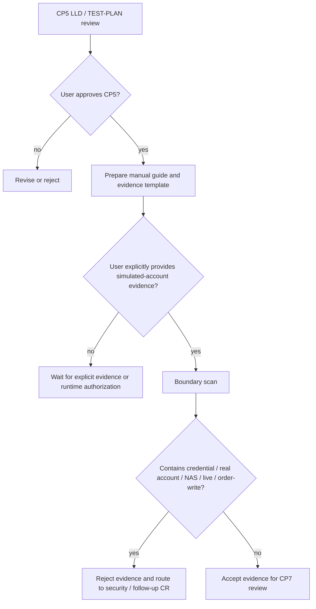

# LLD: CR092 — Real QMT Readonly Runtime Smoke Readiness

本文档是 CR092 CP5 的 Story 级设计证据。它只定义 readiness、manual guide、authorization brief 和 evidence review 合同；不实现、不启动、不连接、不安装或运行 QMT / MiniQMT / XtQuant / gateway / runner。

## 0. 上游设计依据

| 来源 | 路径 / ID | 被本 LLD 消费的内容 |
|---|---|---|
| CR | `process/changes/CR-092-REAL-QMT-READONLY-RUNTIME-SMOKE-DESIGN-GATE-2026-06-18.md` | CR092 范围、fast-lane 升级原因、LLD 批次门禁和不授权范围。 |
| CP2 | `process/checkpoints/CP2-CR092-READONLY-RUNTIME-SMOKE-SCOPE-REVIEW.md` | 用户批准 CR092 是 design gate，不授权 runtime、NAS、凭据、账户原文或交易写。 |
| CP3 HLD | `docs/qmt/CR092-REAL-QMT-READONLY-RUNTIME-SMOKE-HLD.md` | 采用人工逐 run 只读 smoke 设计门禁；模拟账户证据读取边界；NAS / order-write / ledger hygiene 独立分流。 |
| CP3 Checkpoint | `process/checkpoints/CP3-CR092-READONLY-RUNTIME-SMOKE-HLD-REVIEW.md` | 用户接受 DQ-CP3-CR092-01..04，允许进入 CP5 LLD / TEST-PLAN / readiness。 |
| CR091 | `docs/qmt/CR091-QMT-STRATEGY-RUNNER-HLD.md` | 离线 runner、fake readonly gateway 和 redacted evidence 模型背景，仅作参考，不重开 CR091。 |
| CR089 | `process/changes/CR-089-QMT-INTERFACE-VALIDATION-GATE-2026-06-17.md` | 历史只读 scope 和风险边界，仅作参考；CR089 保持 blocked-readiness-approved，不自动启动。 |

## 1. Goal

创建 CR092 的 CP5 readiness 设计证据，冻结真实只读 runtime smoke 的授权 brief、manual guide、模拟账户 evidence 合同、敏感字段拒收规则、测试计划和失败回退。完成后只允许进入后续实现 / 验证准备讨论；不代表已授权真实运行。

## 2. Requirements（Functional / Non-Functional）

### 2.1 Functional

- FR-CR092-01：定义 `Authorization Brief`，覆盖 `run_id`、`account_mode`、scope、执行主体、有效期、证据输入、禁止动作和失败回退。
- FR-CR092-02：定义 `Manual Readonly Smoke Guide`，只描述用户本地执行步骤和证据回填格式；Codex 不执行命令。
- FR-CR092-03：定义 `Simulated Account Evidence Contract`，允许读取用户明确提供的模拟账户测试证据，拒收凭据、真实账户、NAS 路径和未指定日志。
- FR-CR092-04：定义 `Evidence Review`，检查 health / capabilities / query_positions 结果、redaction 状态和 forbidden counters。
- FR-CR092-05：定义 follow-up classifier，把 NAS、order-write 和 ledger hygiene 分流到 CR091-FU-02..04。

### 2.2 Non-Functional

- NFR-CR092-01：安全边界 fail closed；任一凭据、真实账户、NAS、submit/cancel、simulation/live 或 provider/lake/publish 信号出现即停止当前 CR092 readiness。
- NFR-CR092-02：所有 evidence 必须包含 `account_mode=simulated` 或明确标记为脱敏摘要；缺失时不可进入 CP7。
- NFR-CR092-03：每个后续 smoke run 必须有唯一 `run_id`，并能回链到用户授权、证据文件和审查结果。
- NFR-CR092-04：CP5 approve 只确认 LLD / TEST-PLAN / readiness，不授权运行。

## 3. 模块拆分与职责

| 模块 / 文件组 | 职责 | 说明 |
|---|---|---|
| Authorization Brief | 冻结逐 run 授权字段和禁止动作 | 作为 CP5 后续执行前置，不替代运行授权。 |
| Manual Readonly Smoke Guide | 定义用户本地执行步骤和证据提交方式 | Codex 不执行命令，不读取凭据。 |
| Simulated Account Evidence Contract | 定义可读取字段、拒收字段和证据结构 | 允许用户明确提供的模拟账户证据；拒收真实账户和凭据。 |
| Evidence Review | 审查 evidence 完整性、敏感字段和 forbidden counters | 进入 CP7 前的验证输入。 |
| Follow-up Classifier | 将 NAS / order-write / ledger hygiene 分流 | 当前 CR092 不合并 FU-02..04。 |

## 4. 代码结构与文件影响范围

| 动作 | 文件路径 | 变更内容 |
|---|---|---|
| 创建 | `process/stories/CR092-REAL-QMT-READONLY-RUNTIME-SMOKE-LLD.md` | 本 LLD，定义 CP5 readiness 设计证据。 |
| 创建 | `docs/qmt/CR092-REAL-QMT-READONLY-RUNTIME-SMOKE-TEST-PLAN.md` | scoped TEST-PLAN，定义静态 / 人工 / evidence review 验证策略。 |
| 创建 | `process/context/CP5-CR092-READINESS-CONTEXT.yaml` | CP5 context capsule，作为默认读取入口。 |
| 创建 | `process/checks/CP5-CR092-READONLY-RUNTIME-SMOKE-READINESS.md` | CP5 自动预检结果。 |
| 创建 | `process/checkpoints/CP5-CR092-READONLY-RUNTIME-SMOKE-READINESS.md` | CP5 人工审查稿和 Decision Brief。 |
| 创建 | `process/checks/CP5-CR092-HUMAN-GATE-LAUNCH-MESSAGE.md` | CP5 human-gate 发起消息。 |
| 修改 | `process/STATE.md` | 同步 CP3 approved、CP5 pending gate 和 history。 |
| 修改 | `process/changes/CR-INDEX.yaml` | 同步 CR092 当前门禁。 |
| 修改 | `process/changes/CR-092-REAL-QMT-READONLY-RUNTIME-SMOKE-DESIGN-GATE-2026-06-18.md` | 同步文档处理决策和审批状态。 |

## 5. 数据模型与持久化设计

不新增业务持久化表或运行时数据库。CP5 只定义 evidence 文件合同。

| 对象 / 字段 | 类型 | 约束 | 说明 |
|---|---|---|---|
| `run_id` | string | 必填，唯一 | 后续逐 run 授权和 evidence 回链主键。 |
| `account_mode` | enum | 必填；`simulated` / `redacted_summary` | 当前只接受 `simulated` 或脱敏摘要。 |
| `scope` | list[string] | 必填；仅 `health`、`capabilities`、`query_positions_readonly` | 不允许 NAS、submit/cancel、simulation/live。 |
| `evidence_source` | string | 用户明确提供路径或粘贴内容引用 | 未明确提供的日志不读取。 |
| `health_status` | enum | `PASS` / `FAIL` / `N/A` | QMT / gateway health 的用户回填结果。 |
| `capabilities_status` | enum | `PASS` / `FAIL` / `N/A` | capabilities 只读检查结果。 |
| `query_positions_status` | enum | `PASS` / `FAIL` / `N/A` | 模拟账户持仓只读路径结果。 |
| `redaction_status` | enum | `PASS` / `FAIL` | 敏感字段扫描状态。 |
| `forbidden_counters` | map | 所有 forbidden action 计数必须为 0 | 包含 NAS、credential、real_account、submit/cancel、simulation/live、provider/lake/publish。 |

## 6. API / Interface 设计

| 接口 / 入口 | 输入 | 输出 | 调用方 | 说明 |
|---|---|---|---|---|
| Authorization Brief | CP5 决策、scope、account_mode | approved / changes_requested / rejected | 用户 / host-orchestrator | 只冻结设计和后续准备，不授权运行。 |
| Manual Guide | approved scope、run_id、forbidden list | 用户本地执行说明 | 用户 | Codex 不执行命令。 |
| Evidence Intake | 用户明确提供的模拟账户证据 | accepted / rejected / needs-redaction | host-orchestrator / meta-qa | 只读用户给出的路径或内容；越界即拒收。 |
| Follow-up Classifier | 用户请求文本 / evidence hints | CR091-FU-02..04 或 CR092 | host-orchestrator | NAS / order-write / ledger hygiene 独立分流。 |

## 7. 核心处理流程

1. CP5 approve 前：只审查 LLD、TEST-PLAN、readiness，不执行 runtime。
2. CP5 approve 后：可准备 manual guide / evidence template / static checker，但仍不自动运行真实环境。
3. 用户后续若提供模拟账户证据路径或内容：先扫描边界信号，再决定是否读取。
4. 若发现凭据、真实账户、NAS、submit/cancel、simulation/live 或 provider/lake/publish 信号：停止读取并路由到安全门禁或 follow-up CR。
5. 若用户请求真实运行：必须另起逐 run runtime authorization，不从 CP5 自动继承。



## 8. 技术设计细节

- 关键规则：`account_mode=simulated` 是读取模拟账户证据的必要条件；缺失时只能按脱敏摘要处理。
- 依赖选择与复用点：复用 CR091 evidence model 的 redaction / forbidden counters 思路；不复用 CR089 的 NAS package exchange 语义。
- 兼容性处理：用户可粘贴 evidence，也可给出本地项目路径；NAS 路径、凭据路径、真实账户路径一律拒收。
- 图示类型选择：使用流程图，因为核心是授权 / evidence intake / follow-up 分流。

## 9. 安全与性能设计

| 维度 | 设计措施 | 验证方式 |
|---|---|---|
| 安全 | 明确禁止 `.env`、凭据、真实账户、NAS、submit/cancel、simulation/live、provider/lake/publish | CP5 checklist、CP7 evidence review、敏感字段扫描 |
| 安全 | 只读取用户明确提供的模拟账户测试证据 | evidence source 记录、account_mode 检查 |
| 性能 | CP5 不做 runtime 性能验证 | N/A；后续 runtime smoke 另行授权 |
| 可恢复性 | evidence rejected 时不修改 runtime 状态 | CP7 / issue routing 记录 |

## 10. 测试设计

| 测试场景 | 前置条件 | 操作 | 预期结果 | 验证方式 |
|---|---|---|---|---|
| T-CR092-01 CP5 文档完整性 | LLD / TEST-PLAN / context / checkpoint 已生成 | 执行静态审查 | 14 章节、测试计划、门禁消息完整 | CP5 自动预检 |
| T-CR092-02 模拟账户 evidence 接受 | 用户明确提供 `account_mode=simulated` 证据 | 审查 evidence 字段 | accepted 或进入 CP7 review | TEST-PLAN 字段矩阵 |
| T-CR092-03 凭据拒收 | evidence 含 credential / token / `.env` | 触发边界检查 | rejected，停止读取 | 敏感字段扫描 |
| T-CR092-04 NAS 分流 | 请求含 NAS pull / publish / path | follow-up classifier | 路由 CR091-FU-02 | CP5 决策项 |
| T-CR092-05 order-write 分流 | 请求含 submit / cancel / buy / sell | follow-up classifier | 路由 CR091-FU-03 | CP5 决策项 |
| T-CR092-06 runtime 未授权 | 用户未提供逐 run runtime authorization | 尝试推进执行 | blocked_runtime_not_authorized | CP5 / CP7 precheck |

## 11. 实施步骤

| TASK-ID | 动作 | 目标文件 | 详细描述 | 对应测试 |
|---|---|---|---|---|
| TASK-CR092-01 | 创建 | `process/stories/CR092-REAL-QMT-READONLY-RUNTIME-SMOKE-LLD.md` | 写入本 LLD，冻结 readiness 合同。 | T-CR092-01 |
| TASK-CR092-02 | 创建 | `docs/qmt/CR092-REAL-QMT-READONLY-RUNTIME-SMOKE-TEST-PLAN.md` | 写入 scoped TEST-PLAN。 | T-CR092-01..06 |
| TASK-CR092-03 | 创建 | `process/context/CP5-CR092-READINESS-CONTEXT.yaml` | 写入 CP5 context capsule。 | T-CR092-01 |
| TASK-CR092-04 | 创建 | `process/checks/CP5-CR092-READONLY-RUNTIME-SMOKE-READINESS.md` | 写入 CP5 自动预检。 | T-CR092-01 |
| TASK-CR092-05 | 创建 | `process/checkpoints/CP5-CR092-READONLY-RUNTIME-SMOKE-READINESS.md` | 写入 CP5 人工审查稿。 | T-CR092-01 |
| TASK-CR092-06 | 创建 | `process/checks/CP5-CR092-HUMAN-GATE-LAUNCH-MESSAGE.md` | 写入 CP5 human-gate 发起消息。 | T-CR092-01 |

## 12. 风险、难点与预研建议

### 12.1 实现灰区与取舍记录

| Clarification ID | 问题 | 选项与推荐 | 决策 / 答案 | 影响面 | 证据 | 重访条件 |
|---|---|---|---|---|---|---|
| LCQ-CR092-01 | 模拟账户证据是否可读 | 推荐：可读取用户明确提供的模拟账户测试证据；备选：仅脱敏 summary；不推荐：真实账户原文 | 用户已在 CP3 接受修订后的 DQ-CP3-CR092-02 | 安全 / 测试 / evidence | `process/checkpoints/CP3-CR092-READONLY-RUNTIME-SMOKE-HLD-REVIEW.md` | 用户要求读取真实账户、凭据、NAS 或未指定日志 |
| LCQ-CR092-02 | NAS 是否参与当前 CR092 | 推荐：不参与，保留 CR091-FU-02；备选：合并 NAS；不推荐：隐式读取 NAS | 用户已在 CP3 接受 DQ-CP3-CR092-04 | follow-up / 安全 | CP3 审查结果 | 用户启动 CR091-FU-02 |

| 风险 / 难点 | 影响 | 缓解措施 / 预研建议 |
|---|---|---|
| 模拟账户 evidence 混入真实账户或凭据 | 高 | 字段白名单 + 拒收规则 + 用户重新脱敏。 |
| CP5 approve 被误读为运行授权 | 高 | CP5 Decision Brief 和 launch message 明确不授权 runtime。 |
| NAS 路径混入 evidence | 中 | follow-up classifier 路由到 CR091-FU-02。 |
| CR019 / CR025 旧账继续导致 cr-tracking exit 1 | 中 | 记录为 CR091-FU-04，不阻塞 CR092 CP5。 |

### OPEN / Spike 跟踪

| ID | 类型（OPEN / Spike） | 问题 | 下一动作 | 责任方 |
|---|---|---|---|---|
| O-CR092-01 | OPEN | 交易主机具体执行方式、脚本名、输出目录尚未冻结 | CP5 approve 后仅可准备 manual guide；真实运行需逐 run 授权 | host-orchestrator / user |
| O-CR092-02 | OPEN | 是否需要自动 checker 脚本 | CP5 后按用户授权决定；当前不实现 | host-orchestrator |

## 13. 回滚与发布策略

- 发布方式：当前不发布 runtime 代码；只发布 / 交付 process 与 docs 设计证据。
- 回滚触发条件：CP5 rejected、用户要求撤回模拟账户证据读取授权、或 evidence 边界被发现不充分。
- 回滚动作：回退到 CP3 approved / CP5 redesign；保留 CR092 active；不修改 CR091 / CR089 状态。

## 14. Definition of Done

- [x] 14 个章节全部填写完成
- [x] 文件影响范围、接口、测试与实施步骤可直接指导 CP5 readiness
- [x] 实现灰区与取舍记录已回填 CP3 用户答案
- [x] `confirmed=false` 时不进入实现
- [x] OPEN / Spike 已清点
- [x] CP5 自动预检通过
- [x] CP5 人工确认结论为 approved

## 人工确认区

**CP5 — CR092 设计证据可实现性门**

用户确认本 LLD / TEST-PLAN / readiness 后，仍不授权真实运行。真实 QMT / MiniQMT / XtQuant / gateway / runner startup、NAS、凭据、真实账户、submit/cancel、simulation/live、provider/lake/publish 都需要独立授权或后续 CR。

**CP5 checklist 摘要**：

| # | 检查项 | 状态 | 证据 |
|---|---|---|---|
| 1 | LLD 覆盖 AC | 待检查 | 第 2 / 10 / 14 节 |
| 2 | 与 HLD / ADR 一致 | 待检查 | 第 0 / 8 / 12 节 |
| 3 | 文件影响范围明确 | 待检查 | 第 4 / 11 节 |
| 4 | 接口契约完整 | 待检查 | 第 6 节 |
| 5 | 测试与 dev_gate 可计算 | 待检查 | 第 10 / 14 节 |
| 6 | clarification queue 已收敛 | 待检查 | 第 12.1 节 |

**人工确认回复**：

请直接回复以下任一整行：

```text
approve
修改: <具体修改点>
reject
```

**人工审查结果回填**：

- 结论：`approved`
- 审查人：user
- 审查时间：2026-06-18T16:55:00+08:00
- 修改意见：无
- 风险接受项：真实 runtime readiness 仍未被证明，后续需 CP7 evidence review 或独立 runtime authorization。
