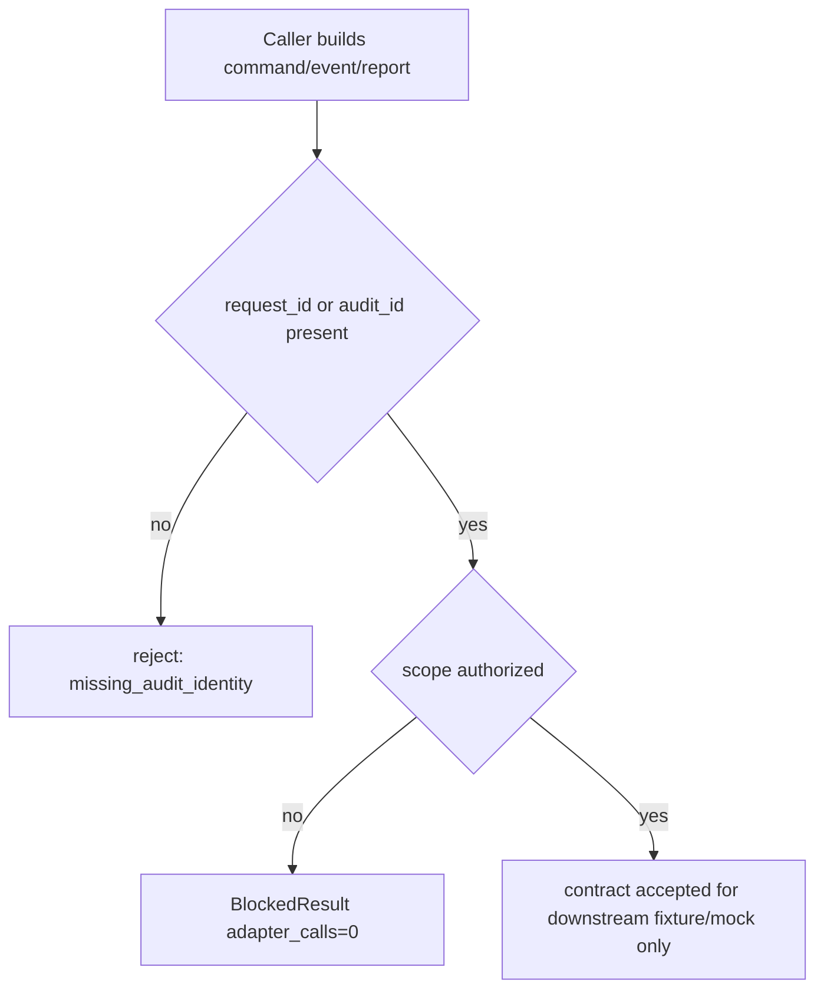

# LLD: CR138-S01 — Shared Contracts, Authorization, and Audit Boundary

## 0. 上游设计依据

| 来源 | 路径 / ID | 被本 LLD 消费的内容 |
|---|---|---|
| HLD | `process/docs/design/HLD-RUNNER-QMT-OPERATIONAL-CONTROL-PLANE.md` | Runner / Gateway 独立分层、REST-only P0、按需 runtime_authorization |
| ADR | `process/docs/design/ARCHITECTURE-DECISION-RUNNER-QMT-OPERATIONAL-CONTROL-PLANE.md` | Runner 不直连 QMT、Gateway health 不等于授权、审计必填 |
| Feature Matrix | `process/docs/design/FEATURE-DESIGN-MATRIX.md` | CR138-S01 为 full-lld；FEAT-11 / FEAT-12 共享合同前置 |
| Feature DESIGN | FEAT-11 / FEAT-12 / FEAT-07 / FEAT-06 | RunPlan / GatewayCommand / AuthorizationRecord / AuditRecord / OMS 边界 |

## 1. Goal

创建共享合同设计，冻结 RunnerCommand、GatewayCommand、GatewayEvent、ExecutionReport、AuthorizationRecord、AuditRecord、request_id、audit_id、idempotency_key 和 no-real-operation counters 的最小字段与失败语义。

## 2. Requirements（Functional / Non-Functional）

### 2.1 Functional

- FR-01：所有跨 Runner / Gateway / OMS / Safety 的命令、事件和报告必须携带 `request_id` 或 `audit_id`。
- FR-02：缺少 runtime、account、market、order、submit/cancel scope 时返回 blocked / hard_rejected，不允许 fallback 到真实 adapter。
- FR-03：Gateway health / capability 只能表达服务可见性，不提升为账户、行情、订单或交易授权。
- FR-04：Runner 侧合同不得导入 `xtquant`，不得读取 `.env` 或真实账户信息。

### 2.2 Non-Functional

- 安全：敏感字段默认 redacted；redaction failure 必须 blocked。
- 可维护性：合同字段集中在 `runner_control_contracts.py` 与 `qmt_gateway_contracts.py`，下游 Story 不重复定义枚举。
- 可观测性：所有拒绝路径输出 `blocked_reason`、`scope_required`、`audit_id`。

## 3. 模块拆分与职责

| 模块 / 文件组 | 职责 | 说明 |
|---|---|---|
| `trading/runner_control_contracts.py` | Runner 控制面合同 | RunPlan、PreflightResult、RunnerCommand、RunState、RunEvidence |
| `trading/qmt_gateway_contracts.py` | Gateway 服务层合同 | GatewayHealth、CapabilitySnapshot、TradingSession、GatewayCommand、GatewayEvent、ExecutionReport |
| `trading/qmt_gateway_gates.py` | 授权结果与 hard-reject 结果 | 后续 S07 扩展；本 Story 只冻结数据结构 |
| `tests/test_cr138_shared_contracts_authorization_audit.py` | 静态 / fixture 合同测试 | 后续实现时验证字段、枚举、fail-closed |

## 4. 代码结构与文件影响范围

| 动作 | 文件路径 | 变更内容 |
|---|---|---|
| 创建 | `trading/runner_control_contracts.py` | 定义 Runner contract dataclass / enum / typed result |
| 创建 / 修改 | `trading/qmt_gateway_contracts.py` | 扩展 Gateway contract，不触发 runtime |
| 创建 | `tests/test_cr138_shared_contracts_authorization_audit.py` | 合同字段、枚举、redaction、forbidden import 静态测试 |
| 不修改 | `.env`、QMT SDK、runtime launcher | CP5 前禁止 |

## 5. 数据模型与持久化设计

| 对象 / 字段 | 类型 | 约束 | 说明 |
|---|---|---|---|
| `AuthorizationRecord` | dataclass | `scope`, `status`, `authorization_ref`, `expires_at`, `redaction_status` 必填 | 不保存 secret，只保存引用 |
| `AuditRecord` | dataclass | `audit_id`, `request_id`, `actor`, `action`, `scope`, `result` 必填 | 可写入后续 evidence index；本 Story 不实现持久化 |
| `NoRealOperationCounters` | dataclass | runtime/account/market/order/submit/cancel/NAS/provider/lake/catalog/git 计数 | fixture 验证默认 0 |
| `BlockedResult` | dataclass | `blocked_reason`, `scope_required`, `adapter_calls=0` | 所有授权失败共享 |

无新增持久化变更；只设计内存合同和后续 evidence ref。

## 6. API / Interface 设计

| 接口 / 入口 | 输入 | 输出 | 调用方 | 说明 |
|---|---|---|---|---|
| `require_scope` | scope、AuthorizationRecord | pass / BlockedResult | S02/S05/S06/S07 | 统一 fail-closed |
| `new_audit_record` | actor、action、scope、request_id | AuditRecord | Runner / Gateway | 不含 secret |
| `mark_no_real_operation` | operation key | NoRealOperationCounters | CP7 guardrail | 记录设计级 counter |
| `validate_contract_ids` | command / event / report | validation result | tests | 保证 request_id/audit_id 存在 |

## 7. 核心处理流程

## 8. 技术设计细节

- 关键规则：`adapter_calls` 在未授权路径必须为 0；health/capability 不参与 scope pass。
- 依赖复用：复用已有 `qmt_auth.py` / `qmt_redaction.py` 概念，但不读取凭据。
- 兼容性：字段命名保留 CR020 readonly gateway 的 `request_id`、scope、redaction 语义。
- 图示类型：流程图，覆盖授权失败路径。

## 9. 安全与性能设计

| 维度 | 设计措施 | 验证方式 |
|---|---|---|
| 安全 | secret/account/raw payload 不进入合同；只保存 redacted refs | 静态扫描字段名和 fixture |
| 性能 | dataclass / enum 级轻量对象，无 I/O | 单元测试无网络 / 无文件系统外部读取 |
| 审计 | audit_id/request_id 必填 | contract validation test |

## 10. 测试设计

| 测试场景 | 前置条件 | 操作 | 预期结果 | 验证方式 |
|---|---|---|---|---|
| 合同字段覆盖 | 无 | 构造 command/event/report | 5 类对象字段齐全 | `pytest tests/test_cr138_shared_contracts_authorization_audit.py` |
| 缺 scope | AuthorizationRecord missing | 调用 `require_scope` | blocked，adapter_calls=0 | fixture |
| health 不升级授权 | GatewayHealth healthy | 调用 order scope | hard_rejected | fixture |
| forbidden import | Runner contract 文件存在 | 静态扫描 | `xtquant` count=0 | regex test |

## 11. 实施步骤

| TASK-ID | 动作 | 目标文件 | 详细描述 | 对应测试 |
|---|---|---|---|---|
| CR138-S01-T01 | 创建 | `trading/runner_control_contracts.py` | 写 Runner contract 和 shared blocked result | 合同字段覆盖 |
| CR138-S01-T02 | 创建 / 修改 | `trading/qmt_gateway_contracts.py` | 写 Gateway contract 与 audit identity | 合同字段覆盖 |
| CR138-S01-T03 | 创建 | `tests/test_cr138_shared_contracts_authorization_audit.py` | 覆盖 scope、audit、forbidden import | 全部测试 |

## 12. 风险、难点与预研建议

### 12.1 实现灰区与取舍记录

| Clarification ID | 问题 | 选项与推荐 | 决策 / 答案 | 影响面 | 证据 | 重访条件 |
|---|---|---|---|---|---|---|
| LCQ-CR138-S01-01 | CP5 是否授权真实 runtime 验证 | 推荐：不授权，仅保留 scoped runtime_authorization 路径 | 已由 CP3 / CP4 边界确定 | 安全 / 测试 / 文档 | CR138 CP3 / CP4 | 用户后续明确授权时重访 |

| 风险 / 难点 | 影响 | 缓解措施 / 预研建议 |
|---|---|---|
| 下游 Story 重复定义字段 | 合同漂移 | S01 作为 merge owner；S02/S05 后续只扩展不重定义 |
| health 被误读为授权 | 误触发真实查询或订单 | CP5 / CP7 文档和测试中固定 hard-reject |

### OPEN / Spike 跟踪

| ID | 类型 | 问题 | 下一动作 | 责任方 |
|---|---|---|---|---|
| N/A | N/A | 无阻断 OPEN / Spike | N/A | N/A |

## 13. 回滚与发布策略

- 发布方式：CP5 approved 后进入受控实现；合同变更先落地并由下游 Story 消费。
- 回滚触发条件：字段导致 S02/S05 设计无法消费，或安全测试发现 scope pass 语义错误。
- 回滚动作：恢复到 CP4 Story Backlog 的最小字段集，重新提交 S01 LLD。

## 14. Definition of Done

- [x] 14 个章节全部填写完成。
- [x] 文件影响范围、接口、测试与实施步骤可直接指导编码。
- [x] clarification item 已收敛；无阻断 OPEN。
- [x] `confirmed=false`，CP5 前不进入实现。
- [x] 不授权 runtime / QMT / 凭据 / 交易 / NAS / provider / lake / catalog / Git remote。

## 人工确认区

**CP5 checklist 摘要**：本 LLD 覆盖 S01 AC、HLD / ADR / Feature refs、文件 owner、接口、测试、no-real-operation 和 rollback。用户统一确认 CR138 batch 后仍需按 Wave、依赖和文件所有权进入实现。
