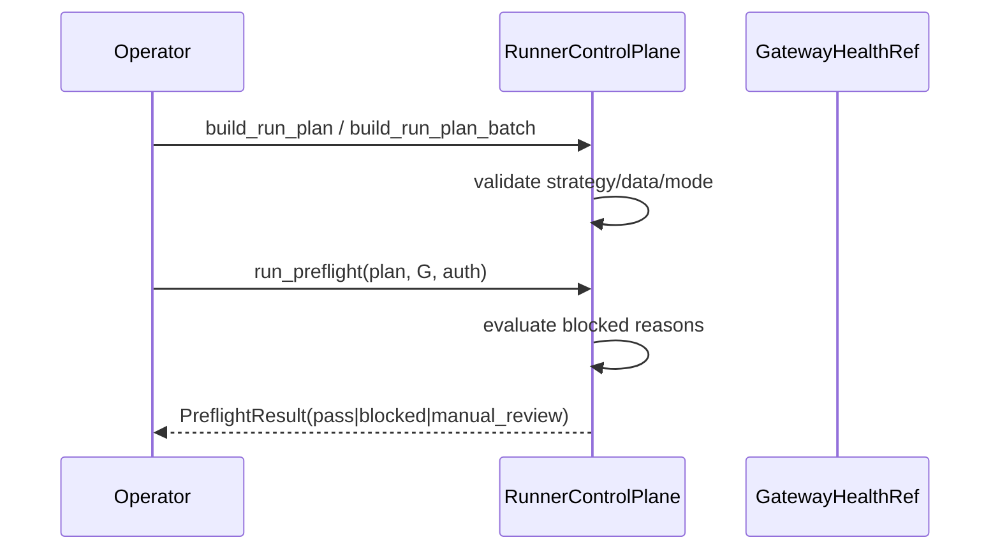

# LLD: CR138-S02 — Runner Run Plan, Preflight, and Command Control

## 0. 上游设计依据

| 来源 | 路径 / ID | 被本 LLD 消费的内容 |
|---|---|---|
| HLD / ADR | `process/docs/design/HLD-RUNNER-QMT-OPERATIONAL-CONTROL-PLANE.md` / ADR-CR138-001/003/005 | Runner 控制面与 Gateway 服务层分离；Runner 不直连 QMT |
| Feature DESIGN | `process/docs/features/runner-control-plane/DESIGN.md` | RunPlan、PreflightResult、RunnerCommand、blocked reason |
| CP4 | `process/DEVELOPMENT-PLAN-CR138.yaml` | S02 owns `runner_control_plane.py` skeleton |
| Follow-up audit | `process/checks/CR138-FOLLOW-UP-CR-COVERAGE-AUDIT-2026-06-24.md` | CR137 offline batch run recommendation is absorbed into S02/S03 as local batch planning |
| 上游 Story | `CR138-S01-...-LLD.md` | AuthorizationRecord、AuditRecord、BlockedResult |

## 1. Goal

设计 Runner 控制壳：从策略与日期构建 RunPlan / RunPlanBatch，执行盘前 Preflight，并接受幂等 RunnerCommand；缺授权或依赖不可用时只产生 blocked / manual_review，不触达 QMT。

## 2. Requirements（Functional / Non-Functional）

### 2.1 Functional

- FR-01：RunPlan 表达 `strategy_id`、`strategy_version`、`data_release_ref`、`target_date`、`mode_request`、`authorization_ref`。
- FR-02：RunPlanBatch 表达 `batch_id`、多个 RunPlan ref、批量执行策略和失败聚合策略，用于吸收 CR137 后续 offline batch run 计划。
- FR-03：Preflight 检查 strategy admission、data release、gateway health、authorization、risk prerequisites，并能对 batch 输出 per-run 与 aggregate blocked reason。
- FR-04：RunnerCommand 支持 start / pause / resume / stop / manual_takeover / dry_run_review。
- FR-05：无授权、gateway stale、data missing 时 `adapter_calls=0`。

### 2.2 Non-Functional

- 幂等：`command_id` + `idempotency_key` 去重。
- 可观测：每次 preflight 输出 blocked reason 和 audit_id。
- 安全：Runner 不导入 `xtquant`，不读取 `.env`。

## 3. 模块拆分与职责

| 模块 / 文件组 | 职责 | 说明 |
|---|---|---|
| `trading/runner_control_plane.py` | RunnerControlPlane 服务、RunPlan builder、preflight、command handler | 本 Story skeleton owner |
| `trading/runner_control_cli.py` | 后续 CLI 入口 | 只包装 fixture / local contract，不运行真实系统 |
| `trading/strategy_runner/*` | 只读消费 offline run registry / artifact bundle | 不覆盖 offline authority |
| `trading/qmt_gateway_contracts.py` | 只读消费 GatewayHealth | health 不等于授权 |

## 4. 代码结构与文件影响范围

| 动作 | 文件路径 | 变更内容 |
|---|---|---|
| 创建 | `trading/runner_control_plane.py` | `RunnerControlPlane`, `build_run_plan`, `run_preflight`, `submit_runner_command` |
| 创建 | `trading/runner_control_cli.py` | plan/preflight/command 的本地 CLI skeleton |
| 创建 | `tests/test_cr138_runner_plan_preflight_control.py` | preflight happy / blocked / idempotent tests |

## 5. 数据模型与持久化设计

| 对象 / 字段 | 类型 | 约束 | 说明 |
|---|---|---|---|
| `RunPlan` | dataclass | `run_id`, `strategy_id`, `target_date`, `mode_request` 必填 | 不启动 runtime |
| `RunPlanBatch` | dataclass | `batch_id`, `plans[]`, `batch_policy`, `aggregate_status` | 本地 batch plan；不自动运行 |
| `PreflightResult` | dataclass | `status`, `blocked_reasons`, `gateway_health_ref`, `auth_status` | `pass` 也不等于交易授权 |
| `BatchPreflightResult` | dataclass | `batch_id`, `per_run_results[]`, `aggregate_blocked_reasons` | 任一 run blocked 不得自动绕过 |
| `RunnerCommandResult` | dataclass | accepted / duplicate / blocked / rejected | 未授权 adapter_calls=0 |

无新增持久化；后续 S04 可把 redacted result 写入 evidence index。

## 6. API / Interface 设计

| 接口 / 入口 | 输入 | 输出 | 调用方 | 说明 |
|---|---|---|---|---|
| `build_run_plan(request)` | strategy/date/data release/mode | RunPlan | operator / scheduler | 纯本地 |
| `build_run_plan_batch(requests)` | 多个 run plan request | RunPlanBatch | operator / scheduler | 只组装本地计划 |
| `run_preflight(plan, gateway_health, auth)` | RunPlan + refs | PreflightResult | operator / CI fixture | 不连接 Gateway |
| `run_batch_preflight(batch, gateway_health, auth)` | RunPlanBatch + refs | BatchPreflightResult | operator / CI fixture | 聚合 blocked reason，不自动执行 |
| `submit_runner_command(command)` | RunnerCommand | RunnerCommandResult | CLI / future API | 幂等、fail-closed |
| CLI `runner-control preflight` | run spec / batch spec | redacted summary | operator | 不读 secret |

## 7. 核心处理流程

## 8. 技术设计细节

- blocked reason 枚举：`strategy_missing`、`data_release_missing`、`gateway_unavailable`、`authorization_missing`、`risk_gate_blocked`。
- Preflight `pass` 只代表可进入人工 review / fixture command，不代表 runtime ready。
- 幂等表在本 Story 可用内存集合；持久化幂等后续另行设计。
- 兼容 offline runner：只读 `strategy_runner` 结果引用，不修改 run registry。
- Batch plan 只复用 CR137 run registry / bundle refs 作为本地索引输入；不得把 batch preflight pass 解释为真实 runtime 批量执行授权。

## 9. 安全与性能设计

| 维度 | 设计措施 | 验证方式 |
|---|---|---|
| 安全 | no `.env` read；no `xtquant` import；scope fail-closed | 静态测试 |
| 性能 | preflight O(依赖项数量)，无网络 | fixture 测试耗时稳定 |
| 审计 | command/preflight 均有 audit_id | 单测断言 |

## 10. 测试设计

| 测试场景 | 前置条件 | 操作 | 预期结果 | 验证方式 |
|---|---|---|---|---|
| 构建 RunPlan | 合法输入 | build_run_plan | 字段齐全 | unit |
| 构建 RunPlanBatch | 多个合法输入 | build_run_plan_batch | batch_id / plans / aggregate_status 字段齐全 | unit |
| 缺授权 preflight | auth missing | run_preflight | blocked, adapter_calls=0 | unit |
| batch partial blocked | batch 中一个 run 缺授权 | run_batch_preflight | aggregate blocked, adapter_calls=0 | unit |
| gateway stale | health stale | run_preflight | manual_review | unit |
| 重复 command | same idempotency key | submit twice | duplicate | unit |
| forbidden imports | 文件存在 | static scan | `xtquant` count=0 | unit |

## 11. 实施步骤

| TASK-ID | 动作 | 目标文件 | 详细描述 | 对应测试 |
|---|---|---|---|---|
| CR138-S02-T01 | 创建 | `trading/runner_control_plane.py` | 实现 RunPlan / RunPlanBatch / Preflight / command skeleton | RunPlan / preflight tests |
| CR138-S02-T02 | 创建 | `trading/runner_control_cli.py` | 暴露本地 plan/preflight/batch preflight/command CLI | CLI fixture |
| CR138-S02-T03 | 创建 | `tests/test_cr138_runner_plan_preflight_control.py` | 覆盖 blocked、manual_review、duplicate | 全部 |

## 12. 风险、难点与预研建议

### 12.1 实现灰区与取舍记录

| Clarification ID | 问题 | 选项与推荐 | 决策 / 答案 | 影响面 | 证据 | 重访条件 |
|---|---|---|---|---|---|---|
| LCQ-CR138-S02-01 | preflight pass 是否自动运行 | 推荐：不自动运行，仅进入人工 review / CP6 fixture | 已由 no-runtime 边界确定 | 安全 / CLI | CP4 check | 用户授权 runtime 时重访 |
| LCQ-CR138-S02-02 | CR137 后续 offline batch run 是否单独开 CR | 推荐：不单独开 CR；吸收为 S02 本地 RunPlanBatch / batch preflight | 本次 follow-up audit 收敛 | Runner 控制面 / Story plan | CR138-FOLLOW-UP-CR-COVERAGE-AUDIT | 需要真实 runtime batch execution 时另起 gate |

| 风险 / 难点 | 影响 | 缓解措施 / 预研建议 |
|---|---|---|
| preflight 误读为交易授权 | 真实操作风险 | 文档和返回字段使用 `preflight_ready`，不使用 `runtime_ready` |

### OPEN / Spike 跟踪

| ID | 类型 | 问题 | 下一动作 | 责任方 |
|---|---|---|---|---|
| N/A | N/A | 无阻断 OPEN / Spike | N/A | N/A |

## 13. 回滚与发布策略

- 发布方式：S01 合同先合并后，S02 引入 Runner shell；S03/S04 后续扩展。
- 回滚触发条件：Runner shell 绕过 Gateway / auth contract 或字段不兼容。
- 回滚动作：移除 S02 shell，保留 S01 合同，回退 CP5 重新设计。

## 14. Definition of Done

- [x] 14 节完整。
- [x] RunPlan / RunPlanBatch / PreflightResult / RunnerCommand 接口可测试。
- [x] 明确 CP5 前不实现、不运行、不授权。
- [x] 无阻断 OPEN / Spike。

## 人工确认区

本 LLD 待 `CP5-CR138-RUNNER-QMT-OPERATIONAL-CONTROL-LLD-BATCH.md` 统一确认；`approve` 只确认设计证据，不授权真实 runtime。
