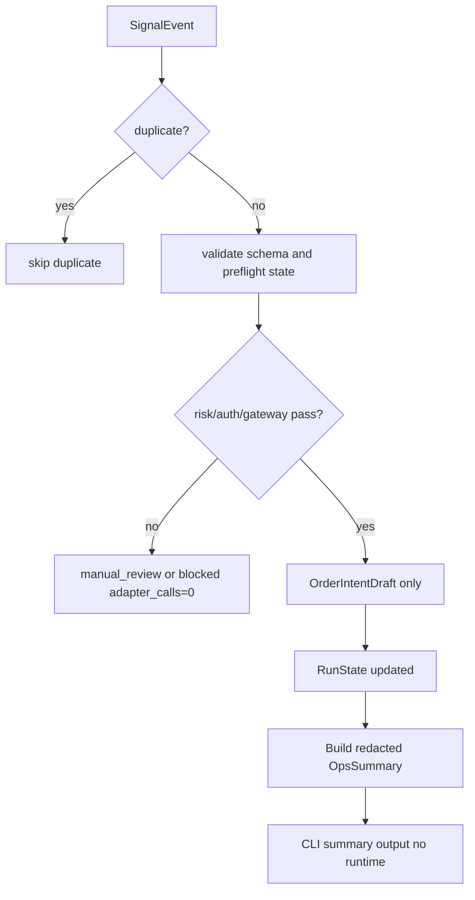

# LLD: CR138-S03 — Runner Event, Signal, Rebalance, Run Tracking, and Ops Summary

## 0. 上游设计依据

| 来源 | 路径 / ID | 被本 LLD 消费的内容 |
|---|---|---|
| S01 / S02 LLD | shared contracts、RunPlan / Preflight | command identity、authorization、preflight gate |
| HLD §6 / §9 | UC-39、Run Tracker -> OpsSummary | Ops Dashboard / CLI Summary 纳入 S03 P0 |
| FEAT-11 | `process/docs/features/runner-control-plane/DESIGN.md` | event ingestion、rebalance intent、RunState |
| FEAT-06 | `process/docs/features/qmt-trading-governance/DESIGN.md` | OMS / risk / kill switch 边界 |
| CP4 | `process/DEVELOPMENT-PLAN-CR138.yaml` | S03 depends on S01/S02；owns Runner flow expansion |
| Follow-up audit | `process/checks/CR138-FOLLOW-UP-CR-COVERAGE-AUDIT-2026-06-24.md` | CR137 offline batch run recommendation is absorbed into S02/S03 |

## 1. Goal

设计 Runner 事件 / 信号接入、幂等处理、再平衡计划、RunState tracking 和 Runner P0 Ops Summary / CLI Summary；产物只生成 OrderIntentDraft / manual_review / redacted summary，不提交真实订单。

## 2. Requirements（Functional / Non-Functional）

### 2.1 Functional

- FR-01：支持 event_id / idempotency_key 去重。
- FR-02：支持 signal_event -> rebalance_candidate -> risk_result -> OrderIntentDraft。
- FR-03：risk fail、auth missing、gateway degraded 时不生成可提交 GatewayCommand。
- FR-04：RunState 表达 running / degraded / paused / manual_takeover / blocked。
- FR-05：提供 P0 `OpsSummary` / CLI summary view，展示 run state、gateway status、latest report state、blocked reasons 和 no-real-operation counters。
- FR-06：提供 batch ops summary，基于 S02 `RunPlanBatch` / 本地 run registry refs 汇总 planned / blocked / manual_review / completed_local 状态。

### 2.2 Non-Functional

- 可靠性：重复事件 deterministic skip。
- 安全：OrderIntentDraft 不等于订单；submit/cancel 始终 false。
- 可观测性：每个状态迁移带 audit_id。
- 可用性：CLI summary 为 fixture / local state 渲染，不依赖真实 Gateway runtime。

## 3. 模块拆分与职责

| 模块 / 文件组 | 职责 | 说明 |
|---|---|---|
| `trading/runner_control_plane.py` | event ingestion、rebalance builder、RunState updater | 基于 S02 shell 扩展 |
| `trading/runner_control_cli.py` | OpsSummary / CLI rendering | 基于 S02 CLI shell 扩展，不启动 runtime |
| `trading/oms.py` | OrderIntentDraft 数据结构消费点 | 本 Story 不实现真实 OMS |
| `trading/pretrade_risk.py` | risk gate result 输入 | fixture / mock only |
| `tests/test_cr138_runner_event_signal_rebalance_tracking.py` | 幂等、风险失败、状态迁移、CLI summary 测试 | no submit/cancel |

## 4. 代码结构与文件影响范围

| 动作 | 文件路径 | 变更内容 |
|---|---|---|
| 修改 | `trading/runner_control_plane.py` | 增加 `ingest_signal_event`, `build_rebalance_intent`, `update_run_state`, `build_ops_summary` |
| 修改 | `trading/runner_control_cli.py` | 增加 `status` / `summary` fixture-only 渲染入口；不得触发 Gateway runtime |
| 修改 / 创建 | `trading/oms.py` | 仅定义/消费 OrderIntentDraft 合同，禁止 submit |
| 修改 / 创建 | `trading/pretrade_risk.py` | risk result 合同；真实风控后置 |
| 创建 | `tests/test_cr138_runner_event_signal_rebalance_tracking.py` | 幂等和 no-order-write fixture |

## 5. 数据模型与持久化设计

| 对象 / 字段 | 类型 | 约束 | 说明 |
|---|---|---|---|
| `SignalEvent` | dataclass | event_id、schema_version、payload_ref、audit_id | payload_ref 不含原始敏感内容 |
| `RebalancePlan` | dataclass | target_summary、current_summary_ref、risk_status | 仅计划，不下单 |
| `OrderIntentDraft` | dataclass | intent_id、side、qty_policy、blocked_reason | 不含 broker order ref |
| `RunState` | dataclass | state、last_event_at、incident_refs、gateway_status | 可被 S04 复盘消费 |
| `OpsSummary` | dataclass | run_id、state、gateway_status、latest_report_state、blocked_reasons、no_real_operation_counters | redacted CLI / dashboard view |
| `BatchOpsSummary` | dataclass | batch_id、run_count、status_counts、blocked_run_refs、latest_local_registry_ref、no_real_operation_counters | 本地 batch summary，不查询 broker |

无新增持久化；后续 S04 写 evidence refs。

## 6. API / Interface 设计

| 接口 / 入口 | 输入 | 输出 | 调用方 | 说明 |
|---|---|---|---|---|
| `ingest_signal_event(event)` | SignalEvent | accepted / duplicate / rejected | event router | schema / idempotency |
| `build_rebalance_intent(run_id)` | RunState + portfolio refs | OrderIntentDraft / manual_review | operator | 不提交订单 |
| `update_run_state(report)` | GatewayEvent / ExecutionReport | RunState | Gateway event pull | unknown -> manual_takeover |
| `build_ops_summary(run_id)` | RunState + redacted refs | OpsSummary | CLI / docs / S04 | 不读取账户 / 行情 / 原始日志 |
| `build_batch_ops_summary(batch_id)` | RunPlanBatch + local RunState / registry refs | BatchOpsSummary | CLI / docs / S04 | 不读取账户 / 行情 / 原始日志 |
| `render_ops_summary(summary)` | OpsSummary | text / table | CLI | 本地渲染，不触发网络 / runtime |

## 7. 核心处理流程

## 8. 技术设计细节

- 幂等 key：`event_id` 优先，缺失时使用 `idempotency_key`；都缺失则 rejected。
- 状态迁移：`planned -> running` 只在 fixture/approved command 下表达，不证明 runtime。
- Gateway report unknown/stale 强制 `manual_takeover`。
- `OrderIntentDraft` 不允许携带 submit endpoint 或 broker order ref。
- `OpsSummary` 只从本地 `RunState`、redacted `ExecutionReport` refs 和 no-real-operation counters 渲染；不得主动查询账户、行情、订单或 Gateway runtime。
- `BatchOpsSummary` 只从 S02 batch plan、本地 `RunState` 和 CR137 registry refs 聚合；不得打开 bundle 原始 payload、不得复制 target portfolio / order intents / raw evidence。
- CLI summary 输出字段固定为 `run_id/state/gateway_status/latest_report_state/blocked_reasons/next_manual_action/no_real_operation_counters`，避免把未授权字段展示为 broker truth。

## 9. 安全与性能设计

| 维度 | 设计措施 | 验证方式 |
|---|---|---|
| 安全 | submit/cancel hard false；GatewayCommand 不生成 | no-order-write test |
| 性能 | idempotency 内存集合 O(1)；事件处理无 I/O | unit |
| 可靠性 | unknown report -> manual takeover | fixture |
| 可观测性 | CLI summary 只读本地状态和 redacted refs | summary snapshot test |

## 10. 测试设计

| 测试场景 | 前置条件 | 操作 | 预期结果 | 验证方式 |
|---|---|---|---|---|
| 重复事件 | same event_id | ingest twice | duplicate / skip | unit |
| risk fail | risk blocked | build_rebalance_intent | manual_review, no GatewayCommand | unit |
| gateway degraded | degraded health | update/run | RunState.degraded | unit |
| stale report | stale ExecutionReport | update_run_state | manual_takeover | unit |
| ops summary | RunState + blocked reasons | build/render summary | 输出 redacted table，runtime_calls=0 | unit |
| batch ops summary | RunPlanBatch + local registry refs | build_batch_ops_summary | 输出 batch redacted table，runtime_calls=0 | unit |

## 11. 实施步骤

| TASK-ID | 动作 | 目标文件 | 详细描述 | 对应测试 |
|---|---|---|---|---|
| CR138-S03-T01 | 修改 | `trading/runner_control_plane.py` | 增加 event / rebalance / RunState 方法 | 重复事件 / state |
| CR138-S03-T02 | 修改 | `trading/runner_control_cli.py` | 增加 fixture-only ops summary / batch summary rendering | ops summary |
| CR138-S03-T03 | 修改 | `trading/oms.py` | 增加 OrderIntentDraft 合同 | no-order-write |
| CR138-S03-T04 | 创建 | `tests/test_cr138_runner_event_signal_rebalance_tracking.py` | 失败路径和 summary fixture | 全部 |

## 12. 风险、难点与预研建议

### 12.1 实现灰区与取舍记录

| Clarification ID | 问题 | 选项与推荐 | 决策 / 答案 | 影响面 | 证据 | 重访条件 |
|---|---|---|---|---|---|---|
| LCQ-CR138-S03-01 | 是否直接产生可提交订单 | 推荐：只产生 OrderIntentDraft | CP3/CP4 no-trading | 安全 / OMS | ADR / CP4 | order_write CR 启动时重访 |
| LCQ-CR138-S03-02 | Ops Dashboard / CLI Summary 是否需要独立 Story | 推荐：不新增 Story，纳入 S03 P0；只做本地 redacted CLI summary | 用户 CP5 前反馈已确认 | Runner P0 可用性 / 文件 owner | 当前 LLD v1.1 | 若后续需要交互式 dashboard 或实时刷新，再拆独立 Story |
| LCQ-CR138-S03-03 | CR137 后续 offline batch run 是否需要单独 Story | 推荐：不新增 Story，S02 负责 RunPlanBatch，S03 负责 BatchOpsSummary | 本次 follow-up audit 收敛 | Runner P0 批量运营视图 | CR138-FOLLOW-UP-CR-COVERAGE-AUDIT | 需要真实 runtime batch execution 时另起 gate |

| 风险 / 难点 | 影响 | 缓解措施 / 预研建议 |
|---|---|---|
| 信号 payload 泄露敏感数据 | 日志风险 | 只保存 payload_ref 和 redacted summary |
| RunState 被当作 broker truth | 误导复盘 | 字段命名使用 `gateway_status_ref` / `report_state` |
| CLI summary 被误读为真实账户视图 | 授权风险 | 标题和字段显式标记 `fixture/local/redacted`，账户 / 行情 / 订单真实查询仍需 runtime gate |

### OPEN / Spike 跟踪

| ID | 类型 | 问题 | 下一动作 | 责任方 |
|---|---|---|---|---|
| N/A | N/A | 无阻断 OPEN / Spike | N/A | N/A |

## 13. 回滚与发布策略

- 发布方式：S02 shell 后扩展事件/状态/ops summary；S04 消费 RunState 和 OpsSummary refs。
- 回滚触发条件：任何实现路径生成真实 order submit/cancel。
- 回滚动作：禁用 S03 event handler，保留 S02 preflight。

## 14. Definition of Done

- [x] 事件、幂等、rebalance draft、RunState、OpsSummary / CLI Summary、BatchOpsSummary、失败路径已覆盖。
- [x] 测试入口与接口配对。
- [x] CP5 前不实现、不运行、不授权交易。

## 人工确认区

本 LLD 待 CR138 CP5 批次统一确认；确认后仍需按 S01/S02 依赖和文件 owner 执行。
