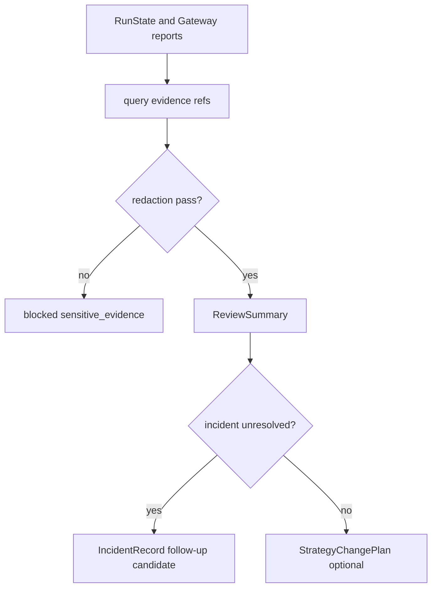

# LLD: CR138-S04 — Runner Evidence, Review, Incident, and Lifecycle Change

## 0. 上游设计依据

| 来源 | 路径 / ID | 被本 LLD 消费的内容 |
|---|---|---|
| S02/S03/S06/S07 | upstream LLD | RunPlan、RunState、Gateway query、ExecutionReport |
| FEAT-11 | Runner Control Plane DESIGN | RunEvidence、ReviewSummary、StrategyChangePlan |
| FEAT-07 | runtime authorization safety | redaction / no raw logs |
| CP4 | Development Plan | S04 W4，依赖 operational flows |

## 1. Goal

设计 Runner 证据、盘后复盘、异常事件、恢复计划和策略变更计划；所有输出只包含 redacted summary 和 evidence refs，不复制 raw log 或账户敏感事实。

## 2. Requirements（Functional / Non-Functional）

### 2.1 Functional

- FR-01：RunEvidence 输出 run_id、audit_ids、evidence_refs、redaction_status。
- FR-02：ReviewSummary 回链 run_id、trade_date、metrics_summary、incidents、follow_up_candidates。
- FR-03：IncidentRecord 支持 manual_takeover / recovery / unresolved。
- FR-04：StrategyChangePlan 必须包含 rollback_target；缺失 blocked。

### 2.2 Non-Functional

- 合规：raw log、token、account id 不进入文档或 evidence body。
- 可追溯：review -> incident -> follow-up CR candidate 可追踪。
- 可回滚：策略变更必须有 rollback target。

## 3. 模块拆分与职责

| 模块 / 文件组 | 职责 | 说明 |
|---|---|---|
| `trading/runner_control_plane.py` | evidence query、review summary、incident/change plan builder | 基于 S02/S03 |
| `trading/strategy_runner/evidence_index.py` | evidence ref 读取 / summary | 只读消费，不复制全文 |
| `docs/` | 后续 runbook 片段 | S08 汇总 |
| `tests/test_cr138_runner_evidence_review_incident_lifecycle.py` | redaction / rollback / incident 测试 | fixture-only |

## 4. 代码结构与文件影响范围

| 动作 | 文件路径 | 变更内容 |
|---|---|---|
| 修改 | `trading/runner_control_plane.py` | 增加 `query_run_evidence`, `build_review_summary`, `record_incident`, `propose_strategy_change` |
| 修改 | `trading/strategy_runner/evidence_index.py` | 增加 redacted summary accessor；禁止 raw copy |
| 创建 | `tests/test_cr138_runner_evidence_review_incident_lifecycle.py` | 复盘、incident、rollback target 测试 |

## 5. 数据模型与持久化设计

| 对象 / 字段 | 类型 | 约束 | 说明 |
|---|---|---|---|
| `RunEvidence` | dataclass | evidence_refs、audit_ids、redaction_status | 不含 raw body |
| `ReviewSummary` | dataclass | metrics_summary、incidents、follow_up_candidates | 来源必须可追溯 |
| `IncidentRecord` | dataclass | severity、state、recovery_plan_ref | unresolved 保留 |
| `StrategyChangePlan` | dataclass | change_type、diff_ref、rollback_target | rollback_target missing -> blocked |

无新增外部持久化；可写入后续 versioned report / evidence index。

## 6. API / Interface 设计

| 接口 / 入口 | 输入 | 输出 | 调用方 | 说明 |
|---|---|---|---|---|
| `query_run_evidence(run_id)` | run_id/request_id | RunEvidence | operator / review | redacted refs only |
| `build_review_summary(run_id, period)` | evidence refs | ReviewSummary | scheduler / operator | no raw logs |
| `record_incident(run_id, event)` | incident event | IncidentRecord | Runner | manual_takeover / recovery |
| `propose_strategy_change(diff, rollback)` | diff refs | StrategyChangePlan | operator | rollback target required |

## 7. 核心处理流程

## 8. 技术设计细节

- `evidence_refs` 是路径或 id，不复制内容。
- `metrics_summary` 只允许 aggregate / redacted values；账户级 PnL 需 S06 授权结果。
- `StrategyChangePlan` 不直接发布策略，只创建后续 follow-up candidate。
- Incident severity 建议枚举：info / warning / high / critical。

## 9. 安全与性能设计

| 维度 | 设计措施 | 验证方式 |
|---|---|---|
| 安全 | raw log copy count=0；rollback target required | tests |
| 性能 | evidence summary 只读索引，不读取大文件 | fixture |
| 可观测 | incident 和 review 均有 audit_id | unit |

## 10. 测试设计

| 测试场景 | 前置条件 | 操作 | 预期结果 | 验证方式 |
|---|---|---|---|---|
| evidence redaction pass | redacted refs | query | RunEvidence.indexed | unit |
| raw evidence request | raw ref | query | blocked | unit |
| incident unresolved | manual takeover event | record/build review | follow_up_candidate | unit |
| missing rollback | change diff only | propose | blocked | unit |

## 11. 实施步骤

| TASK-ID | 动作 | 目标文件 | 详细描述 | 对应测试 |
|---|---|---|---|---|
| CR138-S04-T01 | 修改 | `trading/runner_control_plane.py` | 增加 evidence/review/incident/change plan 方法 | evidence/review tests |
| CR138-S04-T02 | 修改 | `trading/strategy_runner/evidence_index.py` | 增加 redacted summary accessor | raw copy blocked |
| CR138-S04-T03 | 创建 | `tests/test_cr138_runner_evidence_review_incident_lifecycle.py` | 覆盖 redaction/rollback/incident | 全部 |

## 12. 风险、难点与预研建议

### 12.1 实现灰区与取舍记录

| Clarification ID | 问题 | 选项与推荐 | 决策 / 答案 | 影响面 | 证据 | 重访条件 |
|---|---|---|---|---|---|---|
| LCQ-CR138-S04-01 | review 是否可读取账户级 PnL | 推荐：只消费 S06 redacted / authorized result | no-runtime / no-account-read | 安全 / docs | CP4 / S06 LLD | account_readonly 授权后重访 |

| 风险 / 难点 | 影响 | 缓解措施 / 预研建议 |
|---|---|---|
| 复盘文档泄露敏感字段 | 合规风险 | 只输出 refs / redacted summary；测试字段黑名单 |

### OPEN / Spike 跟踪

| ID | 类型 | 问题 | 下一动作 | 责任方 |
|---|---|---|---|---|
| N/A | N/A | 无阻断 OPEN / Spike | N/A | N/A |

## 13. 回滚与发布策略

- 发布方式：依赖 S02/S03/S06/S07 后实现；可最后合并。
- 回滚触发条件：发现 raw log copy 或 change plan 无 rollback target。
- 回滚动作：禁用 review/change API，保留 RunState。

## 14. Definition of Done

- [x] redaction、review、incident、rollback、测试与 DoD 明确。
- [x] 无阻断 OPEN。
- [x] CP5 前不实现、不授权真实账户或日志读取。

## 人工确认区

本 LLD 待 CR138 CP5 批次统一确认；确认不授权读取真实账户、raw logs 或执行策略发布。
