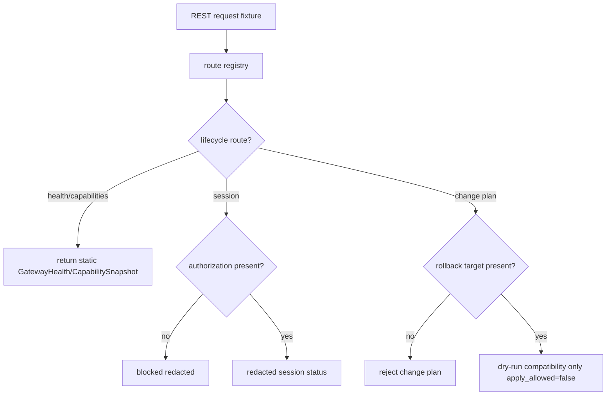

# LLD: CR138-S05 — Gateway Lifecycle, Health, Capabilities, REST Contract, and Change Plan

## 0. 上游设计依据

| 来源 | 路径 / ID | 被本 LLD 消费的内容 |
|---|---|---|
| HLD / ADR | `process/docs/design/HLD-RUNNER-QMT-OPERATIONAL-CONTROL-PLANE.md` / ADR-CR138-002/004/005 | Gateway 服务层、REST-only P0、health 不等于授权、Gateway ChangePlan |
| FEAT-12 | `process/docs/features/qmt-gateway-service-layer/DESIGN.md` | GatewayHealth、CapabilitySnapshot、TradingSession、REST endpoint group、ChangePlan |
| S01 LLD | shared contracts | AuthorizationRecord / AuditRecord |
| CP4 | `process/DEVELOPMENT-PLAN-CR138.yaml` | S05 owns `qmt_gateway_service.py` skeleton |

## 1. Goal

设计 Gateway 服务层 lifecycle、health、capabilities、session status、REST-only P0 route registry 和 Gateway ChangePlan dry-run；默认只支持 static / fixture / mock，不启动真实 Gateway、不绑定端口、不连接 QMT，不执行真实 apply / restart。

## 2. Requirements（Functional / Non-Functional）

### 2.1 Functional

- FR-01：定义 `/health`、`/capabilities`、`/session/status`、query/subscription/order/recovery/audit/change route groups。
- FR-02：CapabilitySnapshot 表达 REST-only P0，SSE / WebSocket / gRPC / FIX 均 later-gated。
- FR-03：GatewayHealth pass 不授权 account / market / order / submit/cancel。
- FR-04：session account label 必须脱敏，缺授权返回 blocked / unavailable。
- FR-05：Gateway ChangePlan 支持 config diff dry-run、compatibility check 和 rollback plan required；不得执行真实 apply / restart。

### 2.2 Non-Functional

- 安全：不读取 `.env`，不保存 secret。
- 可扩展：route registry 可被 S06/S07 增量扩展。
- 可靠性：degraded / cooldown / unavailable 状态可表达。
- 可回退性：任何 gateway config change 必须有 rollback target，否则 rejected。

## 3. 模块拆分与职责

| 模块 / 文件组 | 职责 | 说明 |
|---|---|---|
| `trading/qmt_gateway_service.py` | REST route registry、health/capability/session handlers | 本 Story skeleton owner |
| `trading/qmt_gateway_config.py` | non-secret config / compatibility / change plan | 不含凭据；只 dry-run |
| `trading/qmt_gateway_contracts.py` | GatewayHealth / CapabilitySnapshot | S01/S05 共享 |
| `tests/test_cr138_gateway_lifecycle_health_rest_contract.py` | REST registry / health auth boundary / change plan tests | 不启动端口 |

## 4. 代码结构与文件影响范围

| 动作 | 文件路径 | 变更内容 |
|---|---|---|
| 创建 / 修改 | `trading/qmt_gateway_service.py` | GatewayService class、route registry、health/capability/session fixture handlers |
| 创建 / 修改 | `trading/qmt_gateway_config.py` | GatewayConfig、protocol policy、ChangePlan、rollback config skeleton |
| 创建 | `tests/test_cr138_gateway_lifecycle_health_rest_contract.py` | REST-only route、change dry-run 和 no-port-bind 测试 |

## 5. 数据模型与持久化设计

| 对象 / 字段 | 类型 | 约束 | 说明 |
|---|---|---|---|
| `GatewayHealth` | dataclass | status、last_heartbeat、degraded_reason、capabilities_ref | health 不等于授权 |
| `CapabilitySnapshot` | dataclass | protocols、query_scopes、market_scopes、order_scopes | P0 protocols=`REST` |
| `TradingSession` | dataclass | session_state、account_label、scope、expires_at | account_label redacted |
| `GatewayConfig` | dataclass | host_label、protocol_policy、feature_flags | 无 secret |
| `GatewayChangePlan` | dataclass | change_id、config_diff_ref、compatibility_status、rollback_target、apply_allowed=false | dry-run only |

无新增持久化；config 只允许 non-secret fields。

## 6. API / Interface 设计

| 接口 / 入口 | 输入 | 输出 | 调用方 | 说明 |
|---|---|---|---|---|
| `get_health()` | request_id | GatewayHealth | Runner / operator | 不触发 QMT |
| `get_capabilities()` | request_id | CapabilitySnapshot | Runner / docs | REST-only |
| `get_session_status()` | request_id / auth ref | TradingSession / blocked | operator | 不读取凭据 |
| `register_route_group(group)` | group spec | route registry | S06/S07 | CP5 后扩展 |
| `build_gateway_change_plan(diff)` | non-secret config diff | GatewayChangePlan / rejected | operator / S08 runbook | rollback target required |
| `validate_gateway_change_plan(plan)` | GatewayChangePlan | dry-run pass/fail | CP6/CP7 | 不执行 apply / restart |

## 7. 核心处理流程

## 8. 技术设计细节

- REST-only P0 是 route registry policy，不等于启动 FastAPI / socket。
- `GatewayService` 实现可先是纯函数 / in-process handler，避免 CP6 无意启动端口。
- `protocols` 明确列出 deferred：SSE、WebSocket、gRPC、FIX。
- `get_session_status` 不读取真实 `.env`，只消费 injected `AuthorizationRecord` / fixture。
- `GatewayChangePlan.apply_allowed` 固定为 `false`；本 Story 只校验 diff、compatibility 和 rollback target。
- ChangePlan 不包含 secret value，只允许 redacted key / config ref / feature flag diff。

## 9. 安全与性能设计

| 维度 | 设计措施 | 验证方式 |
|---|---|---|
| 安全 | no port bind、no env read、no QMT connect | static / monkeypatch tests |
| 性能 | health/capability O(1) | unit |
| 兼容 | route group enum 支持后续 S06/S07 扩展 | registry test |
| 可回退 | change plan 无 rollback target 必须 rejected | dry-run test |

## 10. 测试设计

| 测试场景 | 前置条件 | 操作 | 预期结果 | 验证方式 |
|---|---|---|---|---|
| REST-only registry | default config | get_capabilities | protocols only REST | unit |
| health no auth | no runtime | get_health | returns health but account scope blocked | unit |
| session no auth | missing auth | get_session_status | blocked, no credential read | unit |
| change plan dry-run | config diff + rollback | validate plan | dry-run pass, apply_allowed=false | unit |
| change plan no rollback | config diff only | build plan | rejected | unit |
| no port bind | service instantiated | inspect side effects | no socket bind | monkeypatch |

## 11. 实施步骤

| TASK-ID | 动作 | 目标文件 | 详细描述 | 对应测试 |
|---|---|---|---|---|
| CR138-S05-T01 | 创建 / 修改 | `trading/qmt_gateway_service.py` | 写 in-process GatewayService route registry | REST registry |
| CR138-S05-T02 | 创建 / 修改 | `trading/qmt_gateway_config.py` | 写 non-secret config 和 GatewayChangePlan dry-run 合同 | no secret / change plan |
| CR138-S05-T03 | 创建 | `tests/test_cr138_gateway_lifecycle_health_rest_contract.py` | health/capability/session/change-plan/no-port tests | 全部 |

## 12. 风险、难点与预研建议

### 12.1 实现灰区与取舍记录

| Clarification ID | 问题 | 选项与推荐 | 决策 / 答案 | 影响面 | 证据 | 重访条件 |
|---|---|---|---|---|---|---|
| LCQ-CR138-S05-01 | CP6 是否可启动本地 HTTP server | 推荐：不启动，先做 in-process handler | no-runtime | 测试 / 安全 | CP4 | 用户授权 runtime / port bind 时重访 |
| LCQ-CR138-S05-02 | Gateway ChangePlan 是否作为当前批次实现范围 | 推荐：纳入 S05 P0，但仅支持 dry-run / compatibility / rollback plan，不执行 apply | 用户 CP5 前反馈确认 1/2/3 后续需要实现 | Gateway change / 回滚 | 当前 LLD v1.1 | 需要真实 apply / restart 时另起 runtime_authorization gate |

| 风险 / 难点 | 影响 | 缓解措施 / 预研建议 |
|---|---|---|
| endpoint 可见被误解为可调用真实 QMT | 误授权 | route result 必带 `runtime_authorized=false` |
| ChangePlan 被误解为真实配置发布 | 运行风险 | `apply_allowed=false` 固化在模型和测试中；S08 runbook 写明真实 apply 需授权 |

### OPEN / Spike 跟踪

| ID | 类型 | 问题 | 下一动作 | 责任方 |
|---|---|---|---|---|
| N/A | N/A | 无阻断 OPEN / Spike | N/A | N/A |

## 13. 回滚与发布策略

- 发布方式：S05 skeleton 和 ChangePlan dry-run 先合并，S06/S07 基于 route group 扩展。
- 回滚触发条件：发现端口绑定、QMT import 或凭据读取路径。
- 回滚动作：禁用 GatewayService runtime wrapper，保留 contracts。

## 14. Definition of Done

- [x] REST-only、health/capability/session、route registry、ChangePlan dry-run、测试和 no-runtime 边界完整。
- [x] 无阻断 OPEN。
- [x] CP5 前不实现、不启动、不连接。

## 人工确认区

本 LLD 待 CR138 CP5 批次统一确认；确认不授权 gateway start、port bind 或 QMT connection。
