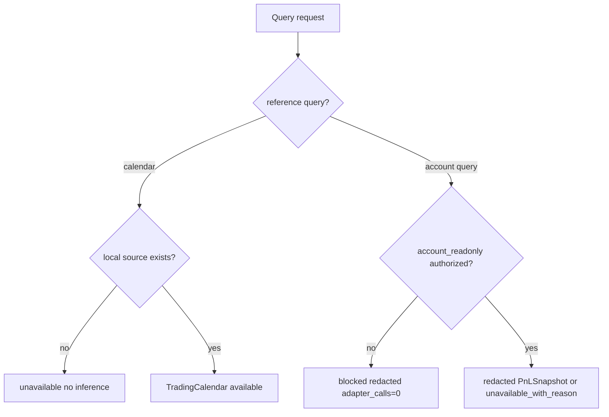

# LLD: CR138-S06 — Gateway Query Service for Calendar, Commission, and PnL

## 0. 上游设计依据

| 来源 | 路径 / ID | 被本 LLD 消费的内容 |
|---|---|---|
| FEAT-12 | Gateway Service Layer DESIGN | TradingCalendar、CommissionSchedule、PnLSnapshot、ReturnSummary |
| FEAT-07 / FEAT-06 | runtime authorization / trading governance | account_readonly、broker facts、redaction |
| S01 / S05 LLD | shared contract / REST route shell | AuthorizationRecord、GatewayService registry |
| 用户 CP3 反馈 | CR138 discussion / checkpoint | 明确纳入交易日历、佣金查询、收益查询 |

## 1. Goal

设计 Gateway query service，覆盖本地交易日历、交易窗口、佣金 / 费用模型、收益 / PnL 摘要；账户级结果必须经过 account_readonly 授权并脱敏，缺支持时返回 unavailable_with_reason。

## 2. Requirements（Functional / Non-Functional）

### 2.1 Functional

- FR-01：TradingCalendar 优先本地参考数据，缺失时 unavailable，不推断交易日。
- FR-02：CommissionSchedule source 必须为 configured / broker_confirmed / estimated / unavailable。
- FR-03：PnLSnapshot / funds / positions / orders / fills 类账户级查询无 account_readonly 时 blocked。
- FR-04：QMT 不支持对应查询时返回 unavailable_with_reason，不伪造 broker facts。

### 2.2 Non-Functional

- 可审计：每个 query result 包含 source、freshness、authorization_ref、redaction_status。
- 安全：账户字段 redacted，raw broker payload 不入库。
- 可测试：calendar local / missing、estimated commission、account blocked 均有 fixture。

## 3. 模块拆分与职责

| 模块 / 文件组 | 职责 | 说明 |
|---|---|---|
| `trading/qmt_gateway_service.py` | query route handlers | 基于 S05 route registry |
| `trading/reconciliation.py` | PnL / ReturnSummary 合同消费点 | 只消费 redacted / estimated summary |
| `trading/oms.py` | CostEstimate / commission refs | 不提交订单 |
| `tests/test_cr138_gateway_query_calendar_commission_pnl.py` | calendar / fee / PnL auth tests | no real account |

## 4. 代码结构与文件影响范围

| 动作 | 文件路径 | 变更内容 |
|---|---|---|
| 修改 | `trading/qmt_gateway_service.py` | 增加 query handlers：calendar、commission、cost、pnl、return |
| 修改 / 创建 | `trading/reconciliation.py` | PnLSnapshot / ReturnSummary redacted contract |
| 修改 | `trading/oms.py` | CostEstimate 输入输出合同 |
| 创建 | `tests/test_cr138_gateway_query_calendar_commission_pnl.py` | query 授权和 source tests |

## 5. 数据模型与持久化设计

| 对象 / 字段 | 类型 | 约束 | 说明 |
|---|---|---|---|
| `TradingCalendar` | dataclass | market、date_range、trading_days、source、freshness | local missing -> unavailable |
| `CommissionSchedule` | dataclass | instrument_type、rate、min_fee、source | broker_confirmed 需授权 |
| `CostEstimate` | dataclass | order_intent_ref、estimated_fee、source | 不构成成交成本事实 |
| `PnLSnapshot` | dataclass | period、realized/unrealized summary、source、redaction_status | account_readonly required |
| `ReturnSummary` | dataclass | period、return_pct、source | estimated / unavailable allowed |

无新增持久化；只输出 redacted result 或 unavailable reason。

## 6. API / Interface 设计

| 接口 / 入口 | 输入 | 输出 | 调用方 | 说明 |
|---|---|---|---|---|
| `query_trading_calendar(market, dates)` | local ref | TradingCalendar / unavailable | Runner preflight | 不推断 |
| `query_commission_schedule(account_ref, instrument)` | auth/config | CommissionSchedule | preflight / OMS | source required |
| `estimate_cost(order_intent)` | draft + schedule | CostEstimate | S03/S07 | no broker call |
| `query_pnl_snapshot(period, auth)` | account_readonly auth | PnLSnapshot / blocked | review | redacted |
| `query_return_summary(period)` | PnL/ref data | ReturnSummary | S04 | source tagged |

## 7. 核心处理流程

## 8. 技术设计细节

- `broker_confirmed` 不允许由 configured / estimated 自动升级。
- calendar source 可为 local reference；vendor / QMT calendar 需后续 source gate。
- PnL 和 funds / positions / orders / fills 都归 account_readonly，不因 health pass 放开。
- QMT unsupported 使用 `unavailable_with_reason(code="unsupported_by_adapter")`。

## 9. 安全与性能设计

| 维度 | 设计措施 | 验证方式 |
|---|---|---|
| 安全 | account_readonly gate；redaction required | blocked / redaction tests |
| 性能 | local calendar query 无网络 | unit |
| 来源可信 | source enum required | field assertions |

## 10. 测试设计

| 测试场景 | 前置条件 | 操作 | 预期结果 | 验证方式 |
|---|---|---|---|---|
| calendar local available | fixture calendar | query | available | unit |
| calendar missing | no fixture | query | unavailable, no inference | unit |
| commission estimated | config only | query | source=estimated/configured | unit |
| PnL no auth | missing account_readonly | query | blocked adapter_calls=0 | unit |
| unsupported QMT | authorized fixture unsupported | query | unavailable_with_reason | unit |

## 11. 实施步骤

| TASK-ID | 动作 | 目标文件 | 详细描述 | 对应测试 |
|---|---|---|---|---|
| CR138-S06-T01 | 修改 | `trading/qmt_gateway_service.py` | query handlers and result mapping | calendar / PnL tests |
| CR138-S06-T02 | 修改 | `trading/reconciliation.py` | PnLSnapshot / ReturnSummary contract | redaction tests |
| CR138-S06-T03 | 创建 | `tests/test_cr138_gateway_query_calendar_commission_pnl.py` | 覆盖 source/auth/unavailable | 全部 |

## 12. 风险、难点与预研建议

### 12.1 实现灰区与取舍记录

| Clarification ID | 问题 | 选项与推荐 | 决策 / 答案 | 影响面 | 证据 | 重访条件 |
|---|---|---|---|---|---|---|
| LCQ-CR138-S06-01 | 是否允许 broker confirmed 佣金 / PnL fixture | 推荐：可用 fixture 表达 shape，但 source 不得写 broker_confirmed，除非授权 | no account auth | 测试 / 文档 | CP3 feedback | account_readonly 授权后重访 |

| 风险 / 难点 | 影响 | 缓解措施 / 预研建议 |
|---|---|---|
| estimated 被误读为券商确认 | 复盘误导 | source 字段必填；文档固定说明 |

### OPEN / Spike 跟踪

| ID | 类型 | 问题 | 下一动作 | 责任方 |
|---|---|---|---|---|
| N/A | N/A | 无阻断 OPEN / Spike | N/A | N/A |

## 13. 回滚与发布策略

- 发布方式：S05 skeleton 后扩展 query group；S04 消费 redacted summaries。
- 回滚触发条件：账户级查询绕过授权或伪造 broker facts。
- 回滚动作：禁用 account query handlers，保留 local calendar / configured fee。

## 14. Definition of Done

- [x] calendar、commission、cost、PnL、return 接口与测试配对。
- [x] source / auth / redaction / unavailable 语义清晰。
- [x] CP5 前不实现、不读取真实账户。

## 人工确认区

本 LLD 待 CR138 CP5 批次统一确认；确认不授权真实账户、行情、订单或 broker facts 查询。
