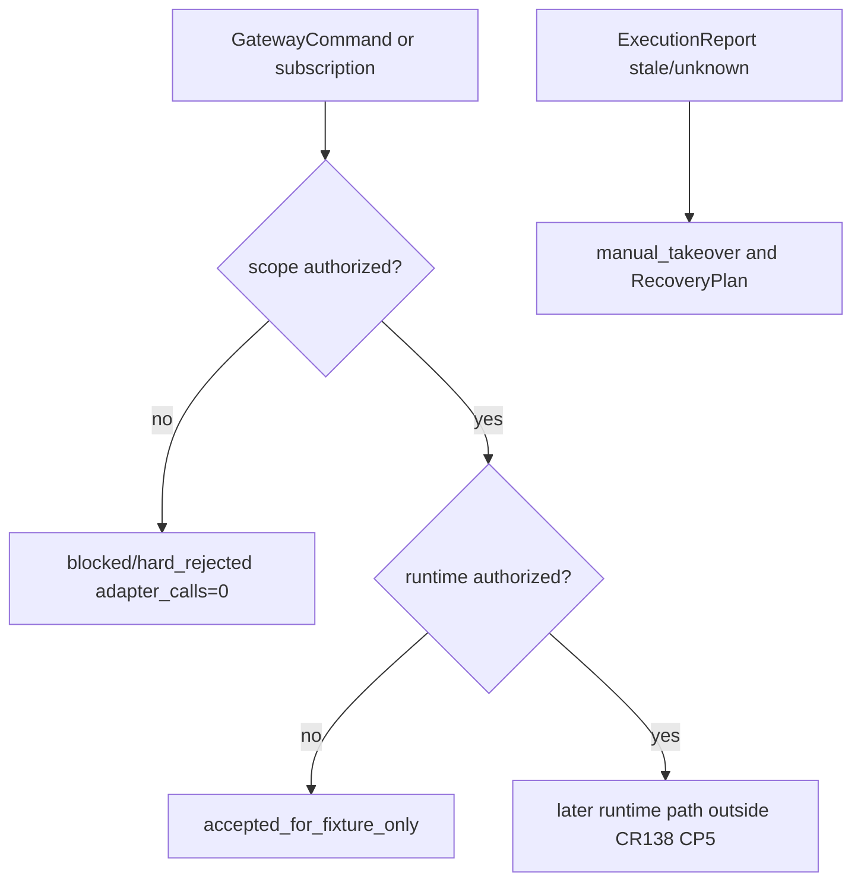

# LLD: CR138-S07 — Gateway Subscription, Order Report, and Recovery Boundary

## 0. 上游设计依据

| 来源 | 路径 / ID | 被本 LLD 消费的内容 |
|---|---|---|
| FEAT-12 | Gateway Service Layer DESIGN | MarketSubscription、GatewayCommand、ExecutionReport、RecoveryPlan |
| FEAT-06 | Trading governance | OMS / kill switch / order write boundary |
| S01 / S05 LLD | shared auth / REST route shell | hard reject、GatewayService route registry |
| CP4 | Development Plan | S07 shares `qmt_gateway_service.py` after S05, merge after S06 or owner sequencing |

## 1. Goal

设计 market subscription、GatewayCommand hard-reject、ExecutionReport 消费和 RecoveryPlan；market_readonly / submit_cancel 未授权时 adapter_calls=0，不自动重发订单，不解除 kill switch。

## 2. Requirements（Functional / Non-Functional）

### 2.1 Functional

- FR-01：market_readonly 未授权时 subscription blocked。
- FR-02：submit/cancel 未授权时 GatewayCommand hard_rejected，adapter_calls=0。
- FR-03：ExecutionReport 支持 ack / partial / filled / canceled / rejected / unknown / stale。
- FR-04：Gateway degraded / unavailable 时 Runner 不自动重发订单，不自动解除 kill switch。

### 2.2 Non-Functional

- 幂等：GatewayCommand 通过 idempotency_key 去重。
- 安全：order_write、simulation、live scope 分离。
- 可恢复：RecoveryPlan 只给出 manual action / cooldown，不执行 runtime。

## 3. 模块拆分与职责

| 模块 / 文件组 | 职责 | 说明 |
|---|---|---|
| `trading/qmt_gateway_service.py` | subscription/order/recovery route group | 基于 S05 skeleton |
| `trading/qmt_gateway_gates.py` | scope gate / hard-reject logic | S07 primary |
| `trading/kill_switch.py` | kill switch state ref | 不自动解除 |
| `trading/oms.py` | GatewayCommand / ExecutionReport refs | no submit |
| `tests/test_cr138_gateway_subscription_order_report_recovery.py` | auth blocked / report / recovery tests | fixture-only |

## 4. 代码结构与文件影响范围

| 动作 | 文件路径 | 变更内容 |
|---|---|---|
| 修改 | `trading/qmt_gateway_service.py` | subscription / order / recovery handlers |
| 创建 / 修改 | `trading/qmt_gateway_gates.py` | market_readonly / order_write / submit_cancel gates |
| 修改 | `trading/kill_switch.py` | RecoveryPlan 消费引用，禁止 auto unlock |
| 创建 | `tests/test_cr138_gateway_subscription_order_report_recovery.py` | blocked / hard reject / stale report tests |

## 5. 数据模型与持久化设计

| 对象 / 字段 | 类型 | 约束 | 说明 |
|---|---|---|---|
| `MarketSubscription` | dataclass | symbols、period、state、scope_required | no auth -> blocked |
| `GatewayCommand` | dataclass | command_type、scope、order_intent_id、idempotency_key | submit/cancel missing -> hard_rejected |
| `ExecutionReport` | dataclass | state、filled_qty、broker_order_ref redacted、audit_id | unknown/stale supported |
| `RecoveryPlan` | dataclass | degraded_reason、manual_action、cooldown_until | no auto retry |

无新增持久化；broker refs 必须 redacted。

## 6. API / Interface 设计

| 接口 / 入口 | 输入 | 输出 | 调用方 | 说明 |
|---|---|---|---|---|
| `register_subscription(request)` | symbols/period/auth | MarketSubscription / blocked | Runner/operator | market_readonly required |
| `pull_subscription_events(id)` | subscription_id | GatewayEvent refs | Runner | no WebSocket P0 |
| `validate_gateway_command(cmd)` | GatewayCommand draft | accepted / hard_rejected | Runner/OMS | no submit |
| `ingest_execution_report(report)` | report fixture | ExecutionReport | Runner | unknown/stale accepted |
| `build_recovery_plan(health)` | GatewayHealth | RecoveryPlan | operator | manual only |

## 7. 核心处理流程

## 8. 技术设计细节

- P0 subscription 通过 REST 管理和 pull events；不默认 SSE/WebSocket。
- `hard_rejected` 是本地安全结果，不发送到 broker。
- `ExecutionReport.unknown` 不应被当作 filled / canceled；Runner 进入 manual_takeover。
- `RecoveryPlan` 不自动 retry order，不自动解除 kill switch。

## 9. 安全与性能设计

| 维度 | 设计措施 | 验证方式 |
|---|---|---|
| 安全 | market/order scopes fail-closed | tests |
| 可靠性 | stale/unknown report -> manual takeover | fixture |
| 性能 | REST pull 有分页 / limit 设计 | contract test |

## 10. 测试设计

| 测试场景 | 前置条件 | 操作 | 预期结果 | 验证方式 |
|---|---|---|---|---|
| subscription no auth | no market_readonly | register | blocked adapter_calls=0 | unit |
| submit no auth | no order_write | validate | hard_rejected | unit |
| stale report | stale fixture | ingest | manual takeover signal | unit |
| gateway degraded | health degraded | recovery plan | manual only | unit |

## 11. 实施步骤

| TASK-ID | 动作 | 目标文件 | 详细描述 | 对应测试 |
|---|---|---|---|---|
| CR138-S07-T01 | 修改 | `trading/qmt_gateway_service.py` | subscription/order/recovery handlers | blocked/hard reject |
| CR138-S07-T02 | 创建 / 修改 | `trading/qmt_gateway_gates.py` | scope gates | auth tests |
| CR138-S07-T03 | 创建 | `tests/test_cr138_gateway_subscription_order_report_recovery.py` | report/recovery tests | 全部 |

## 12. 风险、难点与预研建议

### 12.1 实现灰区与取舍记录

| Clarification ID | 问题 | 选项与推荐 | 决策 / 答案 | 影响面 | 证据 | 重访条件 |
|---|---|---|---|---|---|---|
| LCQ-CR138-S07-01 | 是否为 order submit/cancel 留真实 adapter hook | 推荐：只留 future runtime boundary，不实现 hook | no order_write | 安全 / 文件 owner | CP4 | order_write CR 启动时重访 |

| 风险 / 难点 | 影响 | 缓解措施 / 预研建议 |
|---|---|---|
| hard_rejected 与 broker rejected 混淆 | 审计误读 | 字段区分 `local_reject` 与 `broker_reject` |

### OPEN / Spike 跟踪

| ID | 类型 | 问题 | 下一动作 | 责任方 |
|---|---|---|---|---|
| N/A | N/A | 无阻断 OPEN / Spike | N/A | N/A |

## 13. 回滚与发布策略

- 发布方式：S05/S06 之后按 merge owner 合并；S03/S04 消费结果。
- 回滚触发条件：出现真实 adapter call 或自动 retry / unlock。
- 回滚动作：禁用 S07 route group，保留 GatewayHealth / query service。

## 14. Definition of Done

- [x] market subscription、GatewayCommand、ExecutionReport、RecoveryPlan 接口与测试明确。
- [x] submit/cancel、market_readonly、runtime 授权边界明确。
- [x] CP5 前不实现、不交易。

## 人工确认区

本 LLD 待 CR138 CP5 批次统一确认；确认不授权 market subscription、submit/cancel、simulation/live。
