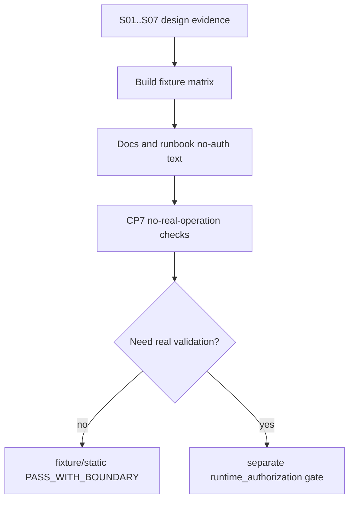

# LLD: CR138-S08 — Docs, Fixtures, CP7 Guardrails, and Authorization Runbook

## 0. 上游设计依据

| 来源 | 路径 / ID | 被本 LLD 消费的内容 |
|---|---|---|
| S01..S07 LLD | all CR138 design evidence | 合同、接口、失败路径、不授权项 |
| FEAT-11 / FEAT-12 TASKS | feature task plans | docs / tests / guardrail task mapping |
| FEAT-07 TEST-PLAN | runtime authorization safety | no-real-operation counters / deny-default |
| CP4 result | `process/checks/CP4-CR138-STORY-DAG-PARALLEL-SAFETY.md` | CP4 PASS 与 no-authorization boundary |

## 1. Goal

设计 CR138 文档、fixture、CP7 guardrails 和后续 runtime_authorization runbook 模板，确保 CP5/CP6/CP7/CP8 期间不会把设计或 fixture 能力误写成真实 runtime 授权。

## 2. Requirements（Functional / Non-Functional）

### 2.1 Functional

- FR-01：文档明确 CP4/CP5/CP6/CP7 默认不授权真实 runtime。
- FR-02：fixture 覆盖 Runner/Gateway/Safety/OMS 的 happy、blocked、degraded、manual_takeover。
- FR-03：no-real-operation counters 覆盖 QMT runtime、account、market、order、submit/cancel、NAS、provider/lake/catalog、Git remote。
- FR-04：runtime_authorization gate 模板包含 action scope、运行窗口、脱敏、回滚和审计。

### 2.2 Non-Functional

- 审计：所有授权边界有路径证据。
- 可维护：docs 与 tests 引用同一禁止项枚举。
- 安全：文档不得给出真实凭据示例。

## 3. 模块拆分与职责

| 模块 / 文件组 | 职责 | 说明 |
|---|---|---|
| `docs/USER-MANUAL.md` / QMT runbook | 更新 CR138 运营边界 | 不写授权式操作步骤 |
| `process/docs/quality/TEST-MATRIX-CR138.md` | fixture / scenario / Story / test matrix | 可新建 |
| `tests/test_cr138_docs_fixtures_authorization_runbook.py` | docs no-auth claims / fixture matrix test | 不运行 QMT |
| `process/checks/*` | CP7 no-real-operation evidence | 后续 QA 消费 |

## 4. 代码结构与文件影响范围

| 动作 | 文件路径 | 变更内容 |
|---|---|---|
| 修改 / 创建 | `docs/QMT-C-S-BRIDGE-RUNBOOK.md` 或后续 CR138 runbook | 写不授权项和按需授权模板 |
| 创建 | `process/docs/quality/TEST-MATRIX-CR138.md` | Story -> scenario -> fixture mapping |
| 创建 | `tests/test_cr138_docs_fixtures_authorization_runbook.py` | 文档声明和 no-real-op counters 测试 |
| 修改 | `docs/USER-MANUAL.md` | 必要时增加 CR138 operational boundary 摘要 |

## 5. 数据模型与持久化设计

| 对象 / 字段 | 类型 | 约束 | 说明 |
|---|---|---|---|
| `RuntimeAuthorizationRequestTemplate` | YAML / markdown table | action_scope、time_window、redaction、rollback、audit | 后续门禁模板 |
| `NoRealOperationEvidence` | JSON / markdown | operation、expected_count、actual_count、evidence_ref | CP7 消费 |
| `FixtureMatrixRow` | markdown table | story_id、scenario、fixture、assertion | 无真实数据 |

无新增业务持久化；只新增文档 / fixture / 检查证据。

## 6. API / Interface 设计

| 接口 / 入口 | 输入 | 输出 | 调用方 | 说明 |
|---|---|---|---|---|
| `validate_no_real_operation_docs` | docs paths | pass/fail | tests | 文档不含授权误导 |
| `fixture_matrix_check` | TEST-MATRIX-CR138 | coverage result | CP7 | 覆盖 S01..S07 |
| `runtime_authorization_template` | action scope request | gate draft fields | user / host | 不自动授权 |

## 7. 核心处理流程

## 8. 技术设计细节

- 文档必须使用“需要后续授权”而不是“当前可执行”。
- fixture matrix 不包含真实 account id、symbol holdings、orders、fills、raw logs。
- runtime_authorization 模板必须把 readonly、market_readonly、order_write、simulation、live 分开。
- CP7 若仅 fixture/static，不得声明 runtime verified。

## 9. 安全与性能设计

| 维度 | 设计措施 | 验证方式 |
|---|---|---|
| 安全 | forbidden phrase / secret pattern scan | docs tests |
| 可追溯 | Story -> fixture -> no-real-op counter | TEST-MATRIX |
| 性能 | 静态扫描，不触发 runtime | pytest |

## 10. 测试设计

| 测试场景 | 前置条件 | 操作 | 预期结果 | 验证方式 |
|---|---|---|---|---|
| docs no auth | docs present | scan | no runtime authorization claims | unit |
| fixture coverage | matrix present | parse | S01..S07 covered | unit |
| counters zero | CP7 evidence fixture | check | all forbidden ops count=0 | unit |
| auth template complete | template present | parse | scope/window/redaction/rollback/audit fields | unit |

## 11. 实施步骤

| TASK-ID | 动作 | 目标文件 | 详细描述 | 对应测试 |
|---|---|---|---|---|
| CR138-S08-T01 | 创建 | `process/docs/quality/TEST-MATRIX-CR138.md` | 写 Story/fixture/no-real-op matrix | fixture coverage |
| CR138-S08-T02 | 修改 / 创建 | docs runbook | 写不授权项和按需授权模板 | docs no auth |
| CR138-S08-T03 | 创建 | `tests/test_cr138_docs_fixtures_authorization_runbook.py` | 文档与 counters 测试 | 全部 |

## 12. 风险、难点与预研建议

### 12.1 实现灰区与取舍记录

| Clarification ID | 问题 | 选项与推荐 | 决策 / 答案 | 影响面 | 证据 | 重访条件 |
|---|---|---|---|---|---|---|
| LCQ-CR138-S08-01 | 文档是否给出真实验证步骤 | 推荐：只给 authorization gate 模板，不给可执行真实步骤 | no-runtime | docs / QA | CP4 | 用户请求真实验证授权时重访 |

| 风险 / 难点 | 影响 | 缓解措施 / 预研建议 |
|---|---|---|
| 文档误授权 | 高风险 | phrase scan + CP5 / CP7 明确不授权项 |

### OPEN / Spike 跟踪

| ID | 类型 | 问题 | 下一动作 | 责任方 |
|---|---|---|---|---|
| N/A | N/A | 无阻断 OPEN / Spike | N/A | N/A |

## 13. 回滚与发布策略

- 发布方式：S01..S07 实现设计确认后，S08 作为 docs / fixture / QA 收口。
- 回滚触发条件：文档含真实授权、凭据示例或 runtime-ready claim。
- 回滚动作：移除 CR138 docs/runbook 变更，保留 CP5 设计证据并重提 S08。

## 14. Definition of Done

- [x] 文档、fixture、CP7 no-real-op、runtime_authorization 模板均有接口和测试。
- [x] S08 保持 full-lld；无阻断 OPEN。
- [x] CP5 前不授权真实运行。

## 人工确认区

本 LLD 待 CR138 CP5 批次统一确认；确认不授权真实运行，只允许后续在受控实现中生成文档、fixture 和 guardrail。
