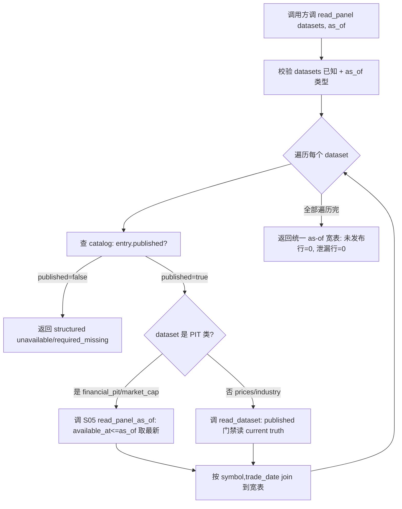

# LLD: CR139-S06 — R1 统一 panel reader

> 本 LLD 是 CR-139 Wave1 STRUCTURAL-P0 的 c 类范围扩展 Story 设计证据。它新增 `read_panel(datasets, as_of)` 多表 as-of 聚合函数，复用既有 `read_dataset` published 门禁，输出价格×财务×估值×行业统一 as-of 宽表。本 LLD 是设计证据，不含实现；CP5 全量人工确认 + Wave1 基线门（REQ-247）满足后才允许实现。

## 0. 上游设计依据

| 来源 | 路径 / ID | 被本 LLD 消费的内容 |
|---|---|---|
| companion HLD | `process/docs/design/HLD-STRATEGY-DATA-FOUNDATION.md` v0.2 | §5 读侧 panel reader R1；§9 架构图 PR→DD→ML；§10 读侧模块（`readers.py:2728 read_dataset` published 门禁、新增 `read_panel_as_of`/`read_panel` 聚合）；§12.2 读侧四道 P0 防线（多表 as-of join）；§17 lld_policy c=full-lld |
| ADR | `process/docs/design/ARCHITECTURE-DECISION-STRATEGY-DATA-FOUNDATION.md` v0.2 | D7 四组门禁 CP3 必过；Wave1 基线门 REQ-247；AGA-1 A1（读写同属 FEAT-02，文件所有权代价 CP5 读写冲突）；R1 跨边界 owner=FEAT-02 读侧 |
| FEATURE-DESIGN-MATRIX | `docs/design/FEATURE-DESIGN-MATRIX.md` v1.13 | REQ-214 (FEAT-02 读侧/03, c, full-lld)；R1→V3→R2 顺序（HLD Gotchas#4） |
| 既有 HLD 契约 | `process/HLD-DATA-LAKE.md` v0.8 §17.7.1/§14 | `read_dataset` published 门禁合同、available_at_rule、PIT 语义（a 类消费边界，不重复设计） |
| handoff | `process/context/DATA-LAKE-REMEDIATION-HANDOFF.md` v0.7 §3.3 R1 | 代码触点：`readers.py:2728` 复用、新增 panel 聚合 |
| DEVELOPMENT-PLAN | `process/DEVELOPMENT-PLAN-CR139.yaml` | readers_py merge_order S05→S06→S07→S09→S25→S27→S28→S13→S16→S36（S06 第 2 位）；LCQ-02 函数切片 + merge_order 串行；baseline_gate_rule |

## 1. 问题定义与目标

### 1.1 问题陈述

数据湖 catalog 已登记 17 个 dataset，字段底子良好（prices=OHLCV+adj_factor+available_at；financial_pit 带 ann_date/report_period/available_at；market_cap 带 pe/pb/ps+available_at），但读侧没有"多表 as-of join"的统一入口：`read_canonical`（`readers.py:2691`）只认 prices，`read_dataset`（`readers.py:2728`）虽已存在 published 门禁（`:2778 if not entry.published`）但只返回单 dataset。回测/ML 要做"价格×财务×估值×行业"按同一 as_of 拼宽表时，只能各自调 reader 手工 merge，导致：①PIT 过滤不一致（部分表未按 available_at<=as_of 过滤）；②published 门禁被绕过（部分表读 candidate 而非 current truth）；③ML 被迫旁路走 `--data-dir`/`load_local_frames`（FD-48 违规）。

### 1.2 价值

`read_panel(datasets, as_of)` 作为回测/ML 的**统一可信读入口**：一次调用返回多 dataset 在同一 as_of 的 as-of 宽表，复用 `read_dataset` published 门禁（未发布行=0）与 S05 PIT as-of 过滤（未来数据泄漏=0），消除"各自调 reader 手工 merge"导致的前视/版本漂移/旁路。它是 R2（ML 接入 lake 废除旁路）和 V3（feature 层）的读路径前置（HLD Gotchas#4：R1→V3→R2）。

### 1.3 目标（量化验收条件）

| 目标 ID | 目标 | 量化成功标准（可验证） |
|---|---|---|
| G-S06-1 | 多表 as-of join | `read_panel(datasets=["prices","financial_pit","market_cap","industry_classification"], as_of=T)` 返回单一 DataFrame，含 4 类字段且全部按 `available_at <= T` 取最新；调用方手工 merge 路径在该函数覆盖的 dataset 组合上调用次数=0 |
| G-S06-2 | published 门禁复用 | `read_panel` 内部走 `read_dataset` published 门禁（`readers.py:2778`），未发布 dataset/分区返回结构化 `unavailable`/`required_missing`，未发布行=0 |
| G-S06-3 | PIT 过滤复用 | 对 financial_pit/market_cap 等 PIT dataset，复用 S05 `read_panel_as_of` 的 `available_at <= as_of` 过滤；构造"未来财报"用例 `read_panel(as_of<T_announce)` 断言该财报行不出现（泄漏行=0） |
| G-S06-4 | 跨边界契约 | `read_panel` owner=FEAT-02 读侧；FEAT-03 ML（S10 R2/S11 V3）只读消费，不反向修改 reader；FD-46..53 违规次数=0 |
| G-S06-5 | 基线门 | S06 实现前 S01/S02/S03 已 verified（REQ-247）；S06 实现后 T7 黄金值可对 panel reader 输出做归因对比 |

## 2. 模块拆分与文件影响范围

### 2.1 文件影响

| 文件 | 切片 | merge_order 位 | 所有权动作 |
|---|---|---|---|
| `market_data/readers.py` | 新增 `read_panel(datasets, as_of, ...)` 聚合函数 + `read_panel_as_of`（与 S05 切片相邻） | readers_py merge_order 第 2 位（S05→**S06**→S07→...） | 新增函数，不修改 `read_dataset`（`:2728`）/`read_canonical`（`:2691`）既有合同；复用 `read_dataset` published 门禁 |

> readers.py 是冲突最密集文件（10 Story 触及）。LCQ-02 已 resolved：函数切片 + merge_order 串行合并。S06 切片边界 = 新增 `read_panel` 聚合函数，**不修改** S05 的 `read_panel_as_of` 单表 PIT 函数、S07 的去重层、S09 的兼容回退。S06 调用 S05 的 PIT 过滤能力（contract 依赖），调用 `read_dataset` 的 published 门禁（既有合同），自身只负责"多表 as-of join 聚合"。

### 2.2 模块职责

| 模块 / 函数 | 职责 | 本 Story 是否新增/修改 |
|---|---|---|
| `read_panel(datasets, as_of, ...)` | 多 dataset as-of 聚合入口：遍历 datasets，对每个 dataset 调 published 读路径，按 as_of 做 PIT 过滤 + 取最新，按 (symbol, trade_date) join 成宽表 | **新增** |
| `read_panel_as_of(dataset, as_of, ...)` | 单 dataset PIT as-of 读（S05 交付） | 不修改（S05 contract 依赖，S06 调用） |
| `read_dataset(dataset, ...)` | 通用单 dataset 读 + published 门禁（`readers.py:2728`/`:2778`） | 不修改（既有合同，a 类消费边界） |
| `read_canonical(...)` | prices 专用 fast reader（`readers.py:2691`） | 不修改（既有合同） |
| catalog `pit_status` / `published` 字段 | published 门禁 + PIT 标记（`catalog.py:56` published / `:59` pit_status） | 不修改（S04/S05/既有合同消费） |

## 3. 数据模型 / schema 变更

### 3.1 schema 变更

**无 schema 变更**。`read_panel` 是读侧聚合函数，不写 lake、不改 parquet schema、不新增 dataset。它消费既有 dataset 的既有字段：
- `prices`：`symbol, trade_date, open/high/low/close/volume/amount, adj_factor, available_at`
- `financial_pit`：`symbol, ann_date, report_period, available_at, <财务字段>`
- `market_cap`：`symbol, trade_date, pe/pb/ps/turnover, available_at`
- `industry_classification`：`symbol, effective_date, industry_code, available_at, pit_status`

### 3.2 输出宽表契约

`read_panel` 输出单一 pandas DataFrame，schema 由 `datasets` 参数决定，字段命名采用 `<dataset>__<field>` 前缀避免冲突（如 `prices__close`、`financial_pit__net_profit`、`market_cap__pe`、`industry_classification__industry_code`），index 为 `(symbol, trade_date)` 或按 as_of 物化的 (symbol) × as_of 行。每个字段必须可追溯到 source dataset + source_run_id + available_at。

### 3.3 异粒度 as-of / forward-fill 物化算法（CP5 冻结，不再留 CP6）

> CP5 评审要求：financial_pit 等异粒度数据的 forward-fill / as-of 物化策略是 R1 统一面板读接口的**核心语义**，直接影响 ML 特征、T7 黄金值和回测复现，不是普通实现细节，CP5 前必须冻结默认算法。以下算法在 CP5 冻结，实现必须遵循，偏离需 CR/重访。

**默认物化算法（frozen）**：

1. **面板骨架生成**：按 `symbol × trade_calendar` 生成面板骨架行。trade_calendar 来自 `trade_calendar` dataset（已登记），非各 dataset 自有日期。每个 as_of date 是 trade_calendar 上的一个交易日。
2. **逐 dataset as-of 取最新**：对每个 dataset，在每个 as_of date，只选 `available_at <= as_of` 的**最新一条**记录（按 `available_at` 降序取首）。`available_at` 缺失的行不参与（输出 `required_missing`，见失败路径）。
3. **不得跨公告可见性边界填充**：financial_pit 的 `available_at` 是公告可见时点。一个 report_period 的财报在 `available_at` 之后才可见，`available_at` 之前不得填充（即使同 symbol 有更早 report_period 的记录，也不得用更晚 report_period 的值回填更早 as_of）。即 as-of 是"截止 as_of 已公开的最新值"，不是"已知最新 report_period 的值"。
4. **forward-fill 语义**：`available_at <= as_of` 取最新后，该值在后续 as_of date 持续有效，直到下一个 `available_at <= as_of'` 的更新出现（标准 as-of forward-fill）。但**仅在同一 symbol 内 forward-fill，不跨 symbol**；**不在 `available_at` 边界前填充**（规则 3）。
5. **缺失输出 reason/coverage**：若某 (symbol, as_of) 在某 dataset 无 `available_at <= as_of` 的记录，输出该字段为 `null` 并在 `panel_coverage` 元数据标注 `reason ∈ {no_data_yet, not_listed, delisted, pit_filtered}` + coverage 比率。不得静默填充 0 或前一个 symbol 的值。
6. **report_period / effective_date 约束**：financial_pit 带 `report_period`（财报期）与 `available_at`（公告日）。as-of 以 `available_at` 为准（PIT），不以 `report_period` 为准（report_period 是财报归属期，早于公告日，用它会前视）。若 dataset 有 `effective_date`（如行业分类生效日），同样按 `effective_date <= as_of` 取最新。
7. **价格 dataset 特殊处理**：prices 是日频，每个 trade_date 一行，as_of 取 `trade_date <= as_of` 的最新交易日（非 forward-fill 跨多日，除非 as_of 是非交易日则取最近前一交易日）。

**冻结约束**：
- 实现必须按上述 7 条算法，不得在 CP6 自行选择物化策略。
- 算法影响黄金值归因：`panel_join_row_count`（S02 §3.3 MetricSpec）依赖此算法的确定性输出。
- 偏离需 CR（重访条件：异粒度 dataset 新增 / as-of 语义争议 / 黄金值归因 ambiguous_rate > 5%）。
- Gotcha#3（异粒度物化）已实质性记录此风险，现升级为冻结算法。

### 3.4 持久化设计

**无持久化**。`read_panel` 是纯读函数，不写 lake、不缓存（缓存归 V3 feature 层 / R3 DuckDB 候选，非本 Story 范围）。如全量加载撑不住，由 R3 DuckDB 只读 adapter（S13，Wave2）承接，本 Story 不引入 DuckDB 依赖。

## 4. 接口契约

### 4.1 函数签名（设计契约，实现时在切片内冻结）

```python
def read_panel(
    datasets: list[str],
    as_of: str | pd.Timestamp,
    *,
    symbols: list[str] | None = None,
    start_date: str | None = None,
    end_date: str | None = None,
    adjustment_policy: str = "qfq",  # 复权口径，单 run 不得混用（CR-017 契约）
    columns: dict[str, list[str]] | None = None,  # 按 dataset 列裁剪（R4 过渡期）
    catalog: Catalog | None = None,
    lake_layout: LakeLayout | None = None,
) -> pd.DataFrame:
    """
    多 dataset as-of 统一 panel reader。
    - 复用 read_dataset published 门禁：未发布 dataset/分区返回 structured unavailable/required_missing
    - 复用 S05 PIT as-of 过滤：financial_pit/market_cap 等按 available_at <= as_of 取最新
    - 输出 (symbol, trade_date) 索引的统一 as-of 宽表，字段前缀 <dataset>__<field>
    - 未发布行 = 0；未来数据泄漏行 = 0
    Raises / returns:
    - dataset 未 published: 返回 structured UnavailableResult（不 raise，消费方可降级）
    - dataset 不存在: raise UnknownDatasetError
    - PIT 字段缺失 available_at: 返回 required_missing，不静默用当前快照
    """
```

### 4.2 与相邻 Story 的契约方向

| 相邻对象 | 契约方向 | 时机 / 触发 | 输入 / 输出 | 降级 / 失败 |
|---|---|---|---|---|
| S04 V1 published pointer / read selector | S06 **消费** S04（read-only） | `read_panel` 读 catalog current pointer 判断 dataset 是否 published | catalog entry `published`/`published_at`/`current_pointer` | 未 published → structured `unavailable`，不读 candidate |
| S05 C1 PIT as-of reader | S06 **消费** S05（read-only） | `read_panel` 对 PIT dataset 调 `read_panel_as_of` 做 `available_at <= as_of` 过滤 | PIT 过滤后的单 dataset DataFrame | PIT 字段缺 available_at → `required_missing` |
| `read_dataset`（既有合同） | S06 **复用**（read-only） | `read_panel` 对非 PIT dataset（如 prices）调 `read_dataset` 走 published 门禁 | published 单 dataset DataFrame | 未发布 → `read_dataset` 既已返回 unavailable，S06 透传 |
| S07 C2b 读层去重 | S07 **消费** S06 读路径（后续） | S07 去重层嵌入 `read_dataset` 出口按 source_run_id 取最新，S06 调 `read_dataset` 时自动受益 | — | S07 未实现前 S06 输出可能含重复键（C2a 已画像），S06 不自行去重 |
| S10 R2 ML 接入 / S11 V3 feature 层 | FEAT-03 **消费** S06（read-only，跨边界） | ML 实验 / feature 计算调 `read_panel` 替代 `--data-dir`/`load_local_frames` | panel DataFrame | ML 不得反向修改 reader（FD-48）；R1→V3→R2 顺序 |
| S13 R3 DuckDB adapter（Wave2） | S13 后续**替换** S06 底层读路径 | S13 实现后 `read_panel` 底层可切到 DuckDB 只读，接口不变 | — | S13 未实现前走 pandas/pyarrow |

### 4.3 调用方同步修改范围

- **本 Story 不修改任何调用方**。`read_panel` 是新增入口，既有 `read_canonical`/`read_dataset` 调用方不受影响。
- ML 旁路废除（R2/S10）是独立 Story，本 Story 只交付 `read_panel` 入口供 R2 消费，不修改 `experiments/run_experiment_*.py`。

## 5. 关键流程（含 Wave1 基线门时序）

### 5.1 Wave1 基线门时序（REQ-247，必须遵循）

```
S01 T8 清册 → S02 T7 黄金值 → S03 C2a 画像  〔基线冻结三步，必须 verified〕
        ↓ (REQ-247 硬依赖：基线冻结后才能开始结构性变更)
S04 V1 published pointer / read selector  〔四道防线：冻结快照〕
        ↓ (contract 依赖：S05 消费 S04 published selector)
S05 C1 PIT as-of reader  〔四道防线：PIT 强制〕
        ↓ (contract 依赖：S06 消费 S05 PIT 过滤 + S04 published 门禁)
S06 R1 统一 panel reader  〔四道防线：多表 as-of join〕← 本 Story
        ↓ (contract 依赖：S07 消费 S06 读路径)
S07 C2b 读层去重  〔四道防线：去重唯一〕
        ↓
S08 N1 分区治理（deferred-execution，物理迁移后置到基线冻结之后）
```

**S06 实现前置**：S01/S02/S03 verified（基线门）+ S04 verified（published selector 契约）+ S05 verified（PIT as-of 契约）+ CP5 全量人工确认。**S06 实现后**：T7 黄金值（S02）必须能对 `read_panel` 输出做归因对比（结构修复 vs 历史数据变化），否则基线门失败。

### 5.2 read_panel 调用流程



### 5.3 异常路径

- dataset 未 published → 该 dataset 列返回 structured `unavailable`，不阻断其他 dataset（除非调用方要求 `strict=True`，默认 lenient）。
- dataset 不存在 → raise `UnknownDatasetError`（不应静默）。
- PIT dataset 缺 `available_at` → 返回 `required_missing`，不静默用当前快照伪装 PIT（HLD-DATA-LAKE §14.4 / §17.7.1 契约）。
- 复权口径混用 → fail fast（CR-017 单 run 口径 gate）。

## 6. 异常处理与失败路径

| 失败场景 | 前置校验 | 失败行为 | 回退 / 降级 |
|---|---|---|---|
| dataset 未 published | 查 catalog `entry.published`（`:56`/published gate `:2778`） | 返回 structured `unavailable`/`required_missing` | 调用方降级到 `proxy_baseline` 或 blocked claim，不读 candidate |
| dataset 不在 catalog | catalog 查询返回 unknown | raise `UnknownDatasetError` | 调用方修 datasets 参数，不静默跳过 |
| PIT 字段缺 `available_at` | S05 PIT 过滤前置校验 | 返回 `required_missing`，对应字段列全 NaN + missing reason | 不用当前快照伪装 PIT；HLD §14.4 契约 |
| 复权口径混用 | 单 run adjustment_policy 校验（CR-017） | fail fast，raise `AdjustmentPolicyConflictError` | 调用方指定单一 adjustment_policy |
| 全量加载内存不足 | 无（本 Story 不解决） | raise `MemoryError` 或返回 partial | 由 R3 DuckDB adapter（S13, Wave2）承接，本 Story 不引入 DuckDB |
| catalog 缺 current pointer | 查 `current_pointer` 为空 | 返回 `unavailable`（pointer 未固定） | 等待 S04 published pointer 前移（本 Story 不前移 pointer） |

## 7. 测试设计

### 7.1 fixture / 测试入口

- 测试文件：`tests/test_cr139_panel_reader.py`（新增，独占）
- 验证命令：`uv run --python 3.11 pytest -q tests/test_cr139_panel_reader.py`
- fixture：合成 catalog + 合成 parquet（prices/financial_pit/market_cap/industry_classification 各一小份），不读真实 lake、不联网

### 7.2 测试用例（与验收条件一一对应）

| 用例 ID | 场景 | 断言 | 对应目标 |
|---|---|---|---|
| T-S06-01 | 多表 as-of join 正确性 | `read_panel(["prices","financial_pit","market_cap","industry_classification"], as_of=T)` 返回宽表含 4 类字段，按 available_at<=T 取最新 | G-S06-1 |
| T-S06-02 | published 门禁阻断未发布 | catalog 标记某 dataset `published=false` 时，`read_panel` 该 dataset 列返回 `unavailable`，未发布行=0 | G-S06-2 |
| T-S06-03 | PIT 过滤阻断未来财报 | financial_pit 有 `available_at=T+5` 的财报，`read_panel(as_of=T)` 断言该行不出现（泄漏行=0） | G-S06-3 |
| T-S06-04 | 跨 dataset 字段前缀无冲突 | 宽表列名 `prices__close` / `financial_pit__net_profit` / `market_cap__pe` / `industry_classification__industry_code` 无重名 | G-S06-1 |
| T-S06-05 | unknown dataset 报错 | `read_panel(["nonexistent"], T)` raise `UnknownDatasetError` | 异常路径 |
| T-S06-06 | 复权口径混用 fail fast | 同一 `read_panel` 调用传入混合 adjustment_policy → raise | CR-017 契约 |
| T-S06-07 | published 缺失 current pointer | catalog 无 current pointer → `unavailable`，不读 candidate | G-S06-2 / S04 契约 |

### 7.3 与 T2/T3 正确性回归（S29）的关系

S29（T2+T3 PIT/去重正确性回归测试）消费 S05 + S07，其中 PIT 断言用例会复用 `read_panel_as_of`/`read_panel` 的 PIT 过滤路径。本 Story 只交付 `read_panel` 入口的单元 fixture，全量 PIT/去重回归归 S29。

## 8. 实施步骤（最小实现切片）

> CP5 全量人工确认 + Wave1 基线门（S01/S02/S03/S04/S05 verified）满足后才开始实现。每切片独立可验证。

| Slice ID | 动作 | 文件切片 | 验证 | 依赖 |
|---|---|---|---|---|
| S06-S1 | 新增 `read_panel` 函数骨架 + 入参校验 + catalog published 查询复用 | `readers.py` 新增函数 | T-S06-01/02/05 静态 + fixture | S04/S05 verified |
| S06-S2 | 接入 S05 `read_panel_as_of` 做 PIT 过滤 + `read_dataset` 做 published 读 | `readers.py`（同切片内） | T-S06-03/07 fixture | S06-S1 |
| S06-S3 | 多表 as-of join 聚合 + 字段前缀 + 复权口径 gate | `readers.py`（同切片内） | T-S06-04/06 fixture | S06-S2 |
| S06-S4 | 测试文件 `tests/test_cr139_panel_reader.py` | 新测试文件 | 全部用例 PASS | S06-S3 |

每切片完成后记录局部验证结果（fixture PASS / 契约映射），CP6 时汇总。

## 9. 风险与应对

| 风险 ID | 风险 | 级别 | 应对 |
|---|---|---|---|
| R-S06-1 | readers.py 10 Story 串行合并，S06 切片与 S05/S07 边界不清 | 中 | LCQ-02 已 resolved：函数切片 + merge_order S05→S06→S07；S06 只新增 `read_panel`，不改 S05 `read_panel_as_of` / S07 去重层；CP5 review 时确认函数级边界 |
| R-S06-2 | 全量加载内存不足（38 run_id 分区 × 多 dataset） | 中 | 本 Story 不解决，由 R3 DuckDB adapter（S13, Wave2）承接；过渡期 `columns` 参数支持列裁剪（R4）；S07 去重层落地后重复键减少 |
| R-S06-3 | catalog.py 文件所有权：S06 可能读 catalog.pit_status/published，与 S04/S33/S39 merge_order 协调 | 低 | S06 只**读** catalog 既有字段（`published`/`pit_status`/`current_pointer`，已验证 `:56`/`:59`/`:256`），不写 catalog；与 S04（write pointer）/S33（M1 定主）/S39（M4 审计链）无写冲突 |
| R-S06-4 | 跨边界 FEAT-03 ML 反向修改 reader | 中 | 跨边界契约：owner=FEAT-02 读侧，FEAT-03 只读消费（FD-46..53）；R2（S10）只调 `read_panel` 不改 reader |
| R-S06-5 | 基线门时序被绕过（S06 在 S01/S02/S03 verified 前实现） | 高 | REQ-247 硬依赖；dev_gate 标注；CP5/CP6 校验 S01/S02/S03/S04/S05 verified 状态 |
| R-S06-6 | published 门禁被绕过（读 candidate 当 truth） | 高 | 复用 `read_dataset` 既有门禁（`:2778`，已验证）；SM-27 非法转换阻断；HLD Gotchas#1 |

## 10. 发布与回滚策略

- **发布**：S06 是读侧新增函数，无数据写入、无 schema 变更、无 catalog pointer 前移。发布 = 代码合入 + fixture 测试 PASS + CP6/CP7 通过。无独立"发布动作"。
- **回滚**：`read_panel` 是新增入口，回滚 = revert 代码合入。既有 `read_canonical`/`read_dataset` 调用方不受影响，回滚无副作用。
- **不授权**：published pointer 前移执行 / 真实 lake 写入 / 物理分区迁移 / runtime（REQ-248）。S06 是纯读，不触发任何写操作。

## 11. 平台差异检查

| 维度 | 当前平台 | 适配说明 | N/A 理由 |
|---|---|---|---|
| 数据湖存储 | parquet（`data/lake/` 软链外部存储，已 gitignore） | `read_panel` 读 parquet，不依赖存储位置 | — |
| DuckDB | 护栏已写（`duckdb_query.py`），adapter 空，`pyproject.toml` 无依赖 | **本 Story 不引入 DuckDB 依赖**（D4，CP5 批准才引入，归 S13 Wave2） | S06 走 pandas/pyarrow，DuckDB 接入是 S13 范围 |
| 读引擎 | `read_canonical`（prices 专用）+ `read_dataset`（通用，published 门禁 `:2778`） | `read_panel` 复用 `read_dataset`，不改 `read_canonical` | — |
| Python 环境 | uv 管理 | 测试命令 `uv run --python 3.11 pytest` | — |

## 12. 设计契约映射

| 契约来源 | 章节 / ID | 本 LLD 落点 |
|---|---|---|
| HLD §5 读侧 panel reader R1 | §5 推荐方案 | §1.2/§2/§4 |
| HLD §9 架构图 PR→DD→ML | §9 | §4.2 跨边界契约 |
| HLD §10 读侧模块（`readers.py:2728 read_dataset` published 门禁、新增 `read_panel_as_of`/`read_panel`） | §10 | §2.1/§2.2/§4.1 |
| HLD §12.2 读侧四道 P0 防线（多表 as-of join） | §12.2 | §1.3 G-S06-1 |
| HLD §17 lld_policy c=full-lld | §17 | frontmatter lld_policy |
| HLD Gotchas#1（validate pass ≠ published current truth） | §Gotchas#1 | §6 R-S06-6 / §4.2 S04 契约 |
| HLD Gotchas#4（R1→V3→R2 顺序） | §Gotchas#4 | §4.2 S10/S11 消费 |
| ADR D7 四组门禁 CP3 必过 | D7 | §1.3 G-S06-1/2/3 |
| ADR Wave1 基线门 REQ-247 | Wave1 基线门 | §5.1 时序 / R-S06-5 |
| ADR AGA-1 A1（读写同属 FEAT-02，文件所有权代价） | AGA-1 | §2.1 readers.py merge_order / R-S06-1 |
| REQ-214 R1 统一 panel reader | REQ-214 | §1.3 全部目标 |
| REQ-247 Wave1 基线门 | REQ-247 | §5.1 |
| REQ-248 不授权范围 | REQ-248 | §10 不授权 / frontmatter |
| REQ-249 既有合同闭环非新建 | REQ-249 | §0/§2.2 复用 read_dataset 既有合同 |
| HLD-DATA-LAKE §17.7.1（写入时序与读写边界） | §17.7.1 | §4.2/§6 PIT 缺 available_at → required_missing |
| HLD-DATA-LAKE §14（available_at_rule / PIT universe） | §14 | §4.1/§5.3 PIT 语义 |
| DEVELOPMENT-PLAN readers_py merge_order S05→S06→S07 | merge_order | §2.1 / R-S06-1 |
| DEVELOPMENT-PLAN LCQ-02（函数切片 + merge_order 串行） | LCQ-02 | §2.1 切片边界 |

## 13. Gotchas

> 实质性 Gotchas，非占位（规则 9）。

1. **`read_panel` 不是"新建一个 reader 从零读 parquet"，而是"复用 `read_dataset` published 门禁 + S05 PIT 过滤 + 多表 join 聚合"**：常见坑是新写一个 glob-concat 读全部分区，绕过 published 门禁（FD-47 违规）和 PIT 过滤。`read_panel` 必须调 `read_dataset`（published 门禁 `:2778`）和 `read_panel_as_of`（S05 PIT），自身只做 join。若发现 `read_panel` 内部直接 glob parquet，是契约违规。

2. **published 门禁的"未发布行=0"是硬断言，不是 best-effort**：catalog 17/17 `published=false` 是当前现状（handoff §1.3.1）。`read_panel` 在 S04 published pointer 前移执行（不授权，本 Story 不前移）之前，对所有 dataset 返回 `unavailable` 是**正确行为**，不是 bug。测试 fixture 必须构造 `published=true` 的 catalog entry 才能验证 join 路径，不能假设真实 lake 已 published。

3. **多表 as-of join 的 (symbol, trade_date) 对齐有陷阱**：prices 是 `trade_date` 粒度，financial_pit 是 `ann_date`/`report_period` 粒度（需 forward-fill 到 trade_date），industry_classification 是 `effective_date` 粒度。join 时必须按 as_of 物化每个 dataset 到统一 (symbol, trade_date) 网格，不能直接 pandas merge 否则粒度错配。这是 c 类范围扩展的核心难点。

4. **跨边界 FEAT-03 ML 消费是"只读"，但 R2（S10）废除旁路依赖 R1+V3 就位**：HLD Gotchas#4 明确 R1→V3→R2 顺序。若 CP5/CP6 把 R2 排在 R1/V3 之前，ML 会无路可走（旁路被废但 lake 入口未就位）。S06 必须在 S10/S11 之前 verified。

5. **readers.py merge_order 串行是 AGA-1 A1 的已知代价**：S06 在 readers_py merge_order 第 2 位（S05→S06→S07→...），不能与 S05/S07 并行开发。LCQ-02 已 resolved 采用函数切片 + merge_order 串行。若 CP6 发现 S06 与 S07 切片冲突，按 merge_order 串行解决，不并行抢写。

6. **catalog.py 文件所有权门控**：S06 读 catalog 的 `published`/`pit_status`/`current_pointer` 字段（已验证 `:56`/`:59`/`:256`），但 catalog.py merge_order 是 S04→S33→S39（S06 不在列）。S06 只读不写 catalog，无写冲突；但若实现时发现需要"物化 pit_status 值"（写 catalog），必须升级为 file-conflict 依赖或拆出，不能自行写 catalog.py。这是 open_item。

7. **复权口径单 run gate（CR-017）在 panel 层强制**：`read_panel` 的 `adjustment_policy` 参数必须单值，同一 `read_panel` 调用混用 raw/qfq/hfq 必须 fail fast。prices + financial_pit 拼宽表时，prices 用 qfq 但 financial_pit 无复权概念，不能因此放任 prices 口径漂移。

## 14. open_items / tier / shared_fragments

### open_items

| ID | 问题 | 状态 | 影响 | 重访条件 |
|---|---|---|---|---|
| O-S06-1 | ~~异粒度 forward-fill/as-of 物化策略需 CP6 冻结~~ **RESOLVED 2026-06-28**：默认物化算法 7 条已在 §3.3 冻结（symbol×trade_calendar 骨架 / available_at<=as_of 取最新 / 不跨公告可见性边界填充 / 同 symbol 内 forward-fill / 缺失输出 reason+coverage / report_period 不作 as-of 依据 / prices 取最近前一交易日），实现必须遵循，偏离需 CR | RESOLVED | §3.3（原 §4.1/§5.2/§13 Gotcha#3） | 偏离需 CR |
| O-S06-2 | ~~catalog.py "物化 pit_status" 边界~~ **RESOLVED 2026-06-28（CP5 评审升级为 CP6 硬门禁）**：S06 对 `catalog.py` 是**只读**（仅读 `published`/`pit_status`/`current_pointer` 既有字段做 panel 聚合判定），**严禁写 catalog.py**。handoff §3.2 C1 提到的"catalog.py 物化 pit_status"属 S33（M1 catalog 主从）/ S05 范畴，不在 S06。若实现时需写 catalog，必须拆到 S33 或独立切片，走 file-conflict 依赖与 S04/S33 串行。CP6 实现门禁校验 S06 的 catalog.py 写操作计数=0，违反阻断。与 S05 CP6 硬门禁一致。 | RESOLVED（CP6 硬门禁） | §2.1/§13 Gotcha#6 / R-S06-3 | 偏离需 CR；写 catalog 须拆 S33/独立切片 |

### tier

- `tier: L`（c 类范围扩展，跨模块契约，四道 P0 防线之一，但复用既有 `read_dataset` 合同，非纯新建）

### shared_fragments

- `shared_fragments: []`（无跨 Story 共享设计片段；S06 消费 S04/S05 契约但无共享 LLD 片段）

### 重访条件

- 若 R3 DuckDB adapter（S13）落地后 `read_panel` 底层读路径切换，需回访 §4.1 接口契约（接口不变，底层切 DuckDB）。
- 若 AGA-1 升级为 A3（读写拆 FEAT-02R），`read_panel` 所有权可能迁移，需回访 §2.1/§4.2 跨边界。
- 若 ML feature 规模/在线 serving 触发 DEF-139-01 切换独立 feature store，`read_panel` 作为 feature 层读入口的定位需回访（HLD Gotchas#4 / AGA-3 C2 切换条件）。
