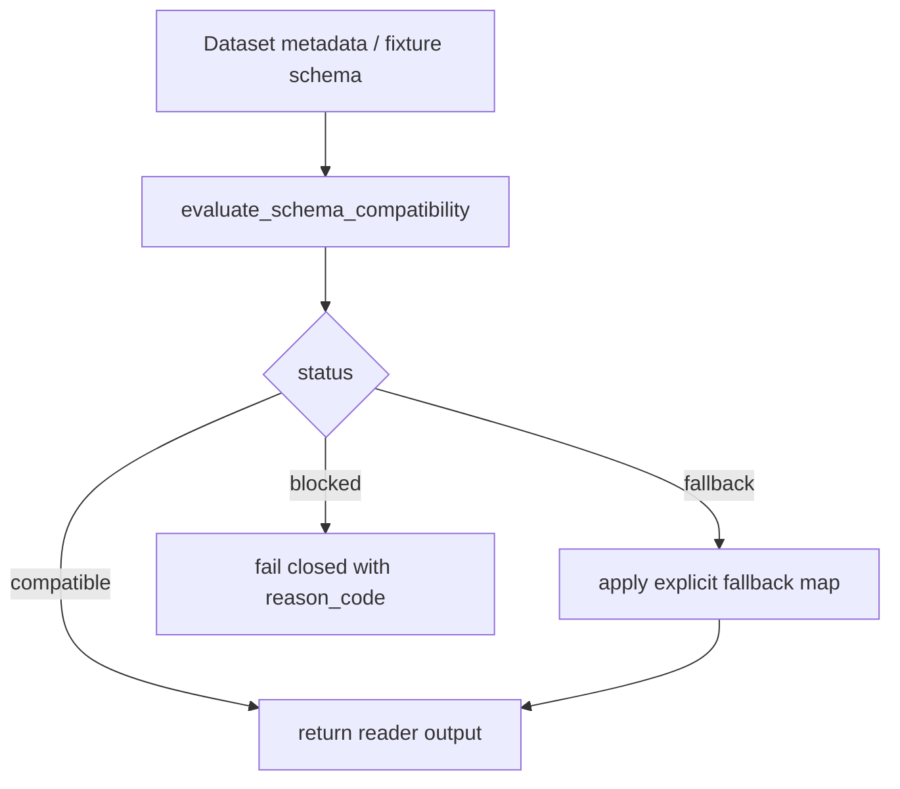

# LLD: CR139-S09 — V4 schema 演进+实盘契约冻结

本文档是 `CR139-W2-DATA-CONTRACTS` 批次的 full LLD 设计证据。它只授权后续在正式 CP5 通过后进入实现设计，不授权 runtime、真实 lake 写入、provider catalog 写入、published pointer advance execution 或物理分区迁移执行。

## 0. 上游设计依据

| 来源 | 路径 / ID | 被本 LLD 消费的内容 |
|---|---|---|
| HLD | `process/docs/design/HLD-STRATEGY-DATA-FOUNDATION.md` | Wave2 先冻结数据契约；V4 是模拟盘前置；parquet 仍为存储事实，DuckDB 只读消费。 |
| ADR | `process/docs/design/ARCHITECTURE-DECISION-STRATEGY-DATA-FOUNDATION.md` | CP3 已确认 FEAT-02 写侧/读侧分层同属，ML feature 层只读消费 lake 契约。 |
| Feature Matrix | `docs/design/FEATURE-DESIGN-MATRIX.md` v1.13 REQ-220 | `lld_policy.required_level=full-lld`；owner=FEAT-02/03；范围扩展类。 |
| Development Plan | `process/DEVELOPMENT-PLAN-CR139.yaml` | `readers.py` merge order：S05 -> S06 -> S07 -> S09；S09 只做兼容回退切片。 |
| Context Capsule | `process/context/CP5-CR139-W2-DATA-CONTRACTS-LLD-CONTEXT.yaml` | 批次不授权边界、S09 full-lld 要求、后续 S14/S22/S30/S31/S32/S33/S34/S39 依赖。 |

## 1. Goal

在 `engine/contracts.py` 中冻结 V4 schema evolution contract，并在 `market_data/readers.py` 中设计 reader 兼容回退规则，使下游模拟盘、ML feature、readiness gate 和 run evidence 消费方可以判断 schema 变更是否兼容、何时阻断以及如何读取旧版本数据。

## 2. Requirements（Functional / Non-Functional）

### 2.1 Functional

- 定义 `SchemaContractFreeze`，至少包含 `contract_version`、`status`、`compatible_from`、`breaking_changes`、`allowed_reader_fallbacks`、`frozen_at`、`owner_feature`。
- 定义 schema 变更分级：`compatible_additive`、`compatible_metadata_only`、`reader_fallback_required`、`breaking_blocked`。
- reader 在读取 dataset metadata 或 fixture manifest 时必须能判断当前 dataset 是否满足 V4 contract。
- 对 `reader_fallback_required`，reader 只能使用显式 fallback map，不能静默吞掉字段缺失、类型漂移或主键变化。
- 对 `breaking_blocked`，reader 必须 fail closed，并输出可追踪原因，不得继续伪造兼容。
- downstream contract 必须声明 FEAT-03、FEAT-11、FEAT-06 消费方只读消费，不反向改写 lake schema。

### 2.2 Non-Functional

- static/fixture-only：CP5/CP6/CP7 默认只允许 fixture 和静态验证。
- 兼容性可追溯：每个 fallback 必须有来源版本、目标版本、字段映射和测试覆盖。
- 无真实 lake 写入：本 Story 不创建、迁移或重写真实 parquet 分区。
- 无 provider catalog 写入：catalog/pointer 发布由 S33/S14 另行设计，本 Story 不执行。
- 失败优先：无法证明兼容时默认阻断，而不是降级成功。

## 3. 模块拆分与职责

| 模块 / 文件组 | 职责 | 说明 |
|---|---|---|
| `engine/contracts.py` | 定义 V4 schema contract、变更分级和 downstream 消费契约 | 写侧/读侧共享的稳定类型入口；不依赖 reader 实现。 |
| `market_data/readers.py` | 在 read path 中消费 contract，执行兼容性判定和显式 fallback | 位于 S05/S06/S07 后；不得覆盖 S25/S27/S28/S13/S16/S36 后续读侧工作。 |
| `tests/test_cr139_schema_contract_freeze.py` | 覆盖 contract 分级、fallback 和 fail-closed 场景 | 使用 fixture/static metadata，不读真实 lake。 |

## 4. 代码结构与文件影响范围

| 动作 | 文件路径 | 变更内容 |
|---|---|---|
| 修改 | `engine/contracts.py` | 新增 V4 schema contract 数据类/TypedDict、变更分级枚举、兼容性判定 helper。 |
| 修改 | `market_data/readers.py` | 在 reader 入口加入可选 schema contract 校验、fallback map 消费和阻断错误。 |
| 创建 | `tests/test_cr139_schema_contract_freeze.py` | 新增 fixture metadata 与 reader fallback 单测。 |

不修改真实数据目录、不生成 provider catalog、不推进 published pointer、不执行物理分区迁移。

## 5. 数据模型与持久化设计

| 对象 / 字段 | 类型 | 约束 | 说明 |
|---|---|---|---|
| `SchemaContractFreeze.contract_version` | `str` | 必填，固定格式 `v4` 或后续 `v4.x` | 标识当前冻结契约。 |
| `SchemaContractFreeze.status` | `Literal["draft","frozen","superseded"]` | 模拟盘前必须为 `frozen` | `draft` 不允许进入正式 simulation gate。 |
| `SchemaContractFreeze.compatible_from` | `list[str]` | 可为空；版本号必须可排序 | 允许 reader 兼容读取的旧 contract 版本。 |
| `SchemaContractFreeze.breaking_changes` | `list[str]` | 每项需包含字段或规则 ID | 任何命中项默认 fail closed。 |
| `SchemaContractFreeze.allowed_reader_fallbacks` | `dict[str, FallbackRule]` | fallback key 必须有测试 | 字段 rename、默认值、派生字段等显式映射。 |
| `SchemaCompatibilityResult.status` | `Literal["compatible","fallback","blocked"]` | 必填 | reader 的机器判定结果。 |

持久化范围：本 Story 只设计 contract 对象和 fixture metadata schema；不写真实 lake，不迁移既有 parquet。

## 6. API / Interface 设计

| 接口 / 入口 | 输入 | 输出 | 调用方 | 说明 |
|---|---|---|---|---|
| `class SchemaContractFreeze` | contract fields | typed contract object | writer/readers/tests | 放在 `engine/contracts.py`，作为 V4 契约冻结入口。 |
| `class SchemaCompatibilityResult` | dataset schema + contract | status/reasons/fallbacks | `market_data/readers.py` | 用于 reader fail closed 与审计。 |
| `class SchemaChangeKind` | enum value | change category | tests/writer helper | 分级 schema 变更。 |
| `evaluate_schema_compatibility(dataset_schema, contract)` | fixture or metadata schema | `SchemaCompatibilityResult` | reader | 不访问真实 lake，只消费传入 metadata。 |
| `apply_reader_fallback(frame, result)` | in-memory frame + fallback rules | normalized frame | reader | 仅在 `status=fallback` 且 fallback 显式登记时可用。 |

## 7. 核心处理流程

1. writer 或 fixture metadata 声明 dataset schema version、字段类型、主键和 contract version。
2. reader 读取 metadata 后调用 `evaluate_schema_compatibility`。
3. 若结果为 `compatible`，reader 正常返回。
4. 若结果为 `fallback`，reader 只应用 `allowed_reader_fallbacks` 中声明的字段映射、默认值或派生规则。
5. 若结果为 `blocked`，reader 抛出带 `contract_version`、`dataset_version`、`reason_code` 的异常。
6. 下游 FEAT-03/06/11 只消费 reader 输出和 compatibility result，不修改 contract。

## 8. 技术设计细节

- 关键规则：新增可选字段可归类为 `compatible_additive`；字段类型变化、主键变化、时间语义变化默认 `breaking_blocked`，除非 fallback map 显式声明并测试。
- 依赖选择：复用现有 Python typing/dataclass 或项目既有 contract 风格；不引入新运行时服务。
- 兼容性处理：旧 dataset 可通过 fixture metadata 声明 `contract_version`，reader 只允许从 `compatible_from` 中的版本进入 fallback。
- 错误语义：阻断错误必须携带 dataset、contract version、reason code 和建议 owner。
- 图示类型：本 LLD 使用流程图，因为存在 compatible/fallback/blocked 三分支。

## 9. 安全与性能设计

| 维度 | 设计措施 | 验证方式 |
|---|---|---|
| 安全 | 默认 fail closed；禁止 runtime、凭据、真实 lake 写入和 provider catalog 写入 | checker/单测确认禁止路径不被调用；fixture-only。 |
| 数据一致性 | 所有 fallback 必须显式登记、可审计、可测试 | 单测覆盖 100% schema 变更分类。 |
| 性能 | schema compatibility 对 metadata 执行，避免对全量数据扫描 | 单测使用小 fixture，验证不会触发真实数据目录遍历。 |
| 可维护性 | contract 与 reader 分离；downstream 只读消费 | 接口测试确认 FEAT-03/06/11 不反向写 contract。 |

## 10. 测试设计

| 测试场景 | 前置条件 | 操作 | 预期结果 | 验证方式 |
|---|---|---|---|---|
| compatible additive schema | fixture metadata 新增可选字段 | 调用 `evaluate_schema_compatibility` | `status=compatible` | `uv run --python 3.11 pytest -q tests/test_cr139_schema_contract_freeze.py` |
| fallback required schema | fixture metadata 缺旧字段但 fallback map 登记 | 调用 reader fallback | 输出字段符合 V4 contract，fallback reason 可追踪 | 同上 |
| breaking schema blocked | fixture metadata 主键或时间字段变更 | 调用 reader | 抛出阻断错误，未返回伪兼容数据 | 同上 |
| frozen gate | `SchemaContractFreeze.status=draft` | 模拟 simulation precheck | gate fail closed | 同上 |
| no real write | 测试 monkeypatch 禁止 lake/catalog/pointer 写入口 | 执行全部 S09 tests | 无写入口调用 | 同上 |

## 11. 实施步骤

| TASK-ID | 动作 | 目标文件 | 详细描述 | 对应测试 |
|---|---|---|---|---|
| TASK-CR139-S09-01 | 修改 | `engine/contracts.py` | 新增 contract/fallback/result 类型和 schema change enum。 | compatible/fallback/breaking tests |
| TASK-CR139-S09-02 | 修改 | `engine/contracts.py` | 新增 compatibility evaluation helper，默认 fail closed。 | breaking schema blocked |
| TASK-CR139-S09-03 | 修改 | `market_data/readers.py` | 在 reader metadata 路径消费 compatibility result 和 fallback map。 | fallback required schema |
| TASK-CR139-S09-04 | 创建 | `tests/test_cr139_schema_contract_freeze.py` | 新增 fixture-only 测试，覆盖所有变更分类和禁止写路径。 | 全部 S09 tests |

## 12. 风险、难点与预研建议

### 12.1 实现灰区与取舍记录

| Clarification ID | 问题 | 选项与推荐 | 决策 / 答案 | 影响面 | 证据 | 重访条件 |
|---|---|---|---|---|---|---|
| LCQ-CR139-S09-01 | V4 是否直接写真实 lake schema registry？ | 推荐：不写，只用 fixture/static metadata 和代码 contract；备选：另走 runtime/data-write gate。 | resolved-by-user：本批禁止真实 lake 写入和 provider catalog 写入。 | 安全 / 数据一致性 / CP5 范围 | `process/context/CP5-CR139-W2-DATA-CONTRACTS-LLD-CONTEXT.yaml#authorization_boundary` | 用户另行发起 scoped runtime_authorization。 |

| 风险 / 难点 | 影响 | 缓解措施 / 预研建议 |
|---|---|---|
| fallback 过宽导致错误数据被读成兼容 | 下游 ML/simulation 误用 | fallback 必须白名单、带 reason code、单测覆盖。 |
| S09 抢占后续 readers.py Story 范围 | merge 冲突和职责漂移 | S09 只做 schema compatibility 切片，列裁剪、PIT、read audit 留给后续 Story。 |
| contract frozen 被误解为实现已完成 | 误进 CP6 | `confirmed=false`，正式 CP5 未通过前不得实现。 |

### OPEN / Spike 跟踪

| ID | 类型（OPEN / Spike） | 问题 | 下一动作 | 责任方 |
|---|---|---|---|---|
| O-CR139-S09-01 | OPEN | 无阻断 OPEN；真实 schema registry 写入不在本批范围 | 若需要真实 registry，创建独立 runtime/data-write authorization | host-orchestrator |

## 13. 回滚与发布策略

- 发布方式：正式 CP5 通过后，以代码实现和 fixture/static tests 进入 CP6；仍不执行真实 lake 写入。
- 回滚触发条件：reader 兼容性误判、fallback 未测试、阻断错误缺少 reason code、或 S09 触碰后续 Story 范围。
- 回滚动作：撤回 S09 reader integration，保留 `engine/contracts.py` 类型草案为未消费状态；恢复 reader 到 S07 verified 后状态；重新打开 CP5 design clarification。

## 14. Definition of Done

- [ ] 14 个章节全部填写完成。
- [ ] `engine/contracts.py` 与 `market_data/readers.py` 文件影响范围明确。
- [ ] schema change 分类覆盖 compatible/fallback/blocked 三类。
- [ ] reader fallback 与阻断路径均有 fixture/static tests。
- [ ] 不读取凭据、不启动 runtime、不写真实 lake、不写 provider catalog、不推进 pointer、不执行物理迁移。
- [ ] `confirmed=false` 时不进入实现。
- [ ] CP5 per-story implementability precheck 通过后，才能进入正式批次 CP5 人工确认。

## 人工确认区

> **CP5 — Story 设计证据可实现性门**
> 本 LLD 需要与 S14/S22/S30/S31/S32/S33/S34/S39 technical-note 和 per-story precheck 一起进入 `CR139-W2-DATA-CONTRACTS` 正式 CP5 批次确认。

**CP5 checklist 摘要**：

| # | 检查项 | 状态 | 证据 |
|---|---|---|---|
| 1 | LLD 覆盖 AC | 待检查 | 第 2 / 10 / 14 节 |
| 2 | 与 HLD / ADR 一致 | 待检查 | 第 0 / 8 / 12 节 |
| 3 | 文件影响范围明确 | 待检查 | 第 4 / 11 节 |
| 4 | 接口契约完整 | 待检查 | 第 6 节 |
| 5 | 测试与 dev_gate 可计算 | 待检查 | 第 10 / 14 节 |
| 6 | clarification queue 已收敛 | 待检查 | 第 12.1 节 |

**人工审查结果回填**：

- 结论：`approved | changes_requested | rejected`
- 审查人：
- 审查时间：
- 修改意见：
- 风险接受项：
