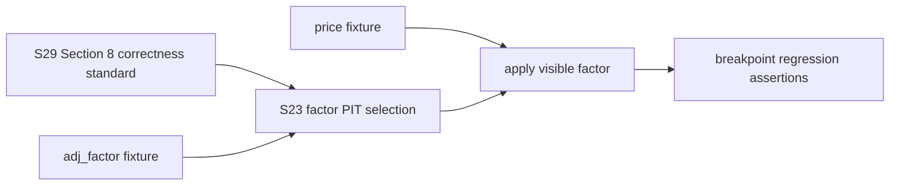

# LLD: CR139-S23 — X1 adjustment factor PIT validation

> 本文件是 CR139 Backlog-A2 的 CP5 full-lld 设计证据。它引用 S29 correctness standard，不重新定义 PIT/dedup 验收口径。
> 本文件不授权实现、真实 lake 写入、catalog/manifest 写入、pointer advance、NAS/provider/runtime/Git 操作。

## 修订记录

| 版本 | 日期 | 修订人 | 变更要点 |
|---|---|---|---|
| 1.0 | 2026-06-30 | host-orchestrator | 首版 S23 full-lld；引用 S29 correctness standard；设计 adjustment-factor PIT fixture、corporate-action availability boundary、breakpoint regression、normalization.py 切片保护。 |

## 0. 上游设计依据

| 来源 | 路径 / ID | 被本 LLD 消费的内容 |
|---|---|---|
| Story card | `process/stories/CR139-S23-adjustment-factor-pit.md` | REQ-229、full-lld、输出文件、依赖 S05、normalization.py 复权切片。 |
| S29 standard | `process/stories/CR139-S29-pit-dedup-correctness-tests-LLD.md#8-correctness-standard` | PIT future-row invisibility, visible-row selection, duplicate uniqueness, fixture/static boundary. |
| A0 gap analysis | `process/checks/CR139-BACKLOG-A0-GAP-ANALYSIS-2026-06-30.md` | Gate B/W3 adj_factor evidence is reusable baseline but cannot close PIT correctness. |
| Requirements | `process/REQUIREMENTS.md` REQ-229 | Ex-dividend event PIT application; adjustment factor timing correctness; breakpoint regression. |
| Feature Matrix | `docs/design/FEATURE-DESIGN-MATRIX.md` v1.13 | REQ-229 belongs to FEAT-02 write side, d1, full-lld. |
| HLD/ADR | companion HLD v0.2 / ADR v0.2 | FEAT-02 write/read separation, no production write authorization, existing published current-truth baseline. |
| Gate B evidence | `process/checks/CR139-W2-GATEB-BATCH2-ADJ_FACTOR-WRITE-EXECUTION-2026-06-29.md` | Existing `adj_factor` data hygiene/current baseline; must not be invalidated by S23. |

## 1. Goal

Design adjustment-factor PIT behavior and regression tests so corporate-action/adjustment rows only affect adjusted prices when they are available at or before the reader `as_of` time.

The implementation should preserve the Gate B-verified `adj_factor` write path while adding explicit fixture/static PIT validation for adjustment-factor application and breakpoint behavior.

## 2. Requirements

### 2.1 Functional

| ID | Requirement | Design response |
|---|---|---|
| REQ-229-A | Ex-dividend/corporate-action events are applied according to PIT availability. | Add adjustment-factor PIT fixture where future factor is excluded for `as_of=T` and visible factor is applied. |
| REQ-229-B | Adjustment factor timing is correct. | Use S29 STD-S29-PIT-01/02: no row with `available_at > as_of` can affect adjusted output. |
| REQ-229-C | Breakpoint regression passes. | Add before/after breakpoint fixture with exact adjusted close/open values. |
| A0-S23-PROTECT | Preserve Gate B `adj_factor` baseline. | Do not mutate production lake, catalog, manifest, pointer, canonical paths, or active `adj_factor` data. |

### 2.2 Non-Functional

| NFR | Design response |
|---|---|
| Read/write boundary | CP6 default is fixture/static. Any real lake write or re-normalization is out of scope without explicit authorization. |
| Deterministic math | Use small numeric fixtures with exact factors and expected adjusted prices. |
| Compatibility | Existing `adj_factor` normalization and `prices` adjustment behavior must keep current schemas/columns. |
| Traceability | S23 tests cite S29 standard IDs and REQ-229. |

## 3. Modules And Responsibilities

| Module / file group | Responsibility | Notes |
|---|---|---|
| `market_data/normalization.py` | Existing adjustment factor and price adjustment normalization slice. | S23 may add helper behavior only inside the adjustment-factor PIT slice; must preserve Gate B data-path behavior. |
| `tests/test_cr139_adjustment_factor_pit.py` | S23-specific PIT application and breakpoint regression tests. | New test file recommended to avoid mixing with S29 standard tests. |
| S29 test files | Correctness standard owner. | S23 references S29 Section 8 but does not duplicate S29 test scope. |

## 4. Code Structure And File Impact

| Action | File path | Change content |
|---|---|---|
| Modify | `market_data/normalization.py` | If needed, add a pure helper for selecting/applying adjustment factors by `available_at <= as_of` or expose existing behavior for testability. Preserve existing `_normalize_adj_factor_rows`, `_load_adj_factor_lookup`, and canonical write semantics unless tests prove a narrow fix is required. |
| Create | `tests/test_cr139_adjustment_factor_pit.py` | Adds S23-specific adjustment-factor PIT fixture and breakpoint regression. |
| No change by design | Gate B evidence/data paths | Existing CR139 canonical/current `adj_factor` baseline is evidence only; no mutation. |

## 5. Data Model And Persistence

No new persistent schema or migration.

| Object / field | Type | Constraint | Notes |
|---|---|---|---|
| `adj_factor` row | fixture row | `trade_date`, `symbol`, `adj_factor`, `adjustment_policy`, `available_at` | Future factor must not affect as-of output. |
| price row | fixture row | `trade_date`, `symbol`, OHLC, `adjustment_policy`, `available_at` | Adjusted fields are calculated from selected factor. |
| breakpoint fixture | pandas frame / pure fixture | factor changes across event date | Expected adjusted values exact. |

Production persistence remains unchanged; tests use in-memory or `tmp_path` fixtures only.

## 6. API / Interface Design

| Interface / entry | Input | Output | Caller | Test mapping |
|---|---|---|---|---|
| existing `_normalize_adj_factor_rows` | raw adj_factor rows | canonical adj_factor frame | S23 tests indirectly or directly if stable | T-S23-PIT-01 |
| existing `_load_adj_factor_lookup` or narrow helper | adj_factor fixture records | lookup keyed by `(trade_date, symbol)` | S23 tests | T-S23-PIT-02 |
| optional pure helper `select_pit_adj_factor` | factor rows, `as_of`, keys | selected visible factor rows | S23 implementation if needed | T-S23-PIT-01/02 |
| price normalization path | price rows + factor lookup | adjusted OHLC fields | S23 breakpoint regression | T-S23-BREAK-01 |

If CP6 needs a new helper, it must be pure, deterministic, and test-only safe; it must not write lake/catalog/manifest/pointer surfaces.

## 7. Core Flow

1. Build adjustment factor fixture with:
   - visible factor: `available_at <= as_of`;
   - future factor: `available_at > as_of`;
   - fixed symbol/trade date and adjustment policy.
2. Build price fixture around the adjustment breakpoint.
3. Apply or select PIT-visible factor according to S29 STD-S29-PIT-01/02.
4. Calculate adjusted OHLC values.
5. Assert:
   - future factor does not affect `as_of=T`;
   - visible factor produces exact adjusted values;
   - breakpoint before/after expected values match.
6. Record that no production surface was touched.

## 8. Technical Design Details

| Design rule | Detail |
|---|---|
| S29 reference | S23 must cite `STD-S29-PIT-01`, `STD-S29-PIT-02`, and `STD-S29-BOUNDARY-01`. |
| Future factor exclusion | Factor rows with `available_at > as_of` are not eligible for adjustment at `as_of`. |
| Visible factor selection | If multiple eligible factors exist for a key, select the latest eligible factor by `available_at`, with deterministic tie-breaking by source/run order only if needed. |
| Breakpoint regression | Use exact expected values, e.g. raw close `10.0` with factor `1.2` yields adjusted close `12.0`; future factor `1.5` must not produce `15.0` before available. |
| Gate B protection | Do not change candidate/current data files or active catalog/manifest. If a behavior fix changes `normalization.py`, tests must use fixture inputs and preserve existing column contracts. |

## 9. Security And Performance

| Dimension | Design measure | Verification |
|---|---|---|
| Security | No credential/provider/NAS/runtime/trading/Git access. | CP6/CP7 operation counts. |
| Data safety | Fixture-only; no active lake/catalog/manifest/pointer mutation. | Tests use `tmp_path` or in-memory frames. |
| Performance | Small frames; pure filtering and arithmetic. | Unit tests only; no full-lake read. |
| Compatibility | Existing adj_factor canonical columns preserved. | Regression tests for existing normalization behavior if touched. |

## 10. Test Design

| Test ID | Test scenario | Precondition | Operation | Expected result | Verification |
|---|---|---|---|---|---|
| T-S23-PIT-01 | Future factor does not apply before available. | Factor `1.5` has `available_at=2026-01-06`; as_of is `2026-01-05`. | Select/apply factor to price row. | Adjusted value does not equal future-factor output. | `tests/test_cr139_adjustment_factor_pit.py`. |
| T-S23-PIT-02 | Visible factor applies at or before as_of. | Factor `1.2` has `available_at=2026-01-04`; as_of is `2026-01-05`. | Select/apply factor. | Adjusted value equals exact visible-factor output. | Same test file. |
| T-S23-BREAK-01 | Breakpoint regression across factor change. | Price rows before/after corporate-action breakpoint. | Apply PIT factor by row date/as_of. | Exact before/after adjusted values match expected table. | Same test file. |
| T-S23-BOUNDARY-01 | Gate B baseline protected. | Test uses fixture data only. | Run tests. | No lake/catalog/manifest/pointer/provider/NAS/runtime/Git operation. | CP6/CP7 evidence. |
| T-S23-S29-LINK-01 | S23 cites S29 standard. | S29 LLD exists. | CP5 precheck scans S23 LLD. | References to Section 8 and STD-S29-* present. | CP5 precheck. |

## 11. Implementation Steps

| TASK-ID | Action | Target file | Detail | Corresponding tests |
|---|---|---|---|---|
| TASK-S23-01 | Create | `tests/test_cr139_adjustment_factor_pit.py` | Add future/visible factor fixture and breakpoint expected values. | T-S23-PIT-01/02, T-S23-BREAK-01 |
| TASK-S23-02 | Modify if needed | `market_data/normalization.py` | Add/adjust pure PIT factor selection helper only if current behavior cannot satisfy tests. | T-S23-PIT-01/02 |
| TASK-S23-03 | Verify | targeted pytest | Run S23 + S29 tests together. | All S23/S29 tests |
| TASK-S23-04 | Record | CP6/CP7 evidence | Record no forbidden operations and Gate B baseline protection. | T-S23-BOUNDARY-01 |

## 12. Risks, Difficulties, And Research

### 12.1 Clarification And Tradeoff Log

| Clarification ID | Question | Options and recommendation | Decision / answer | Impact | Evidence | Revisit condition |
|---|---|---|---|---|---|---|
| LCQ-S23-01 | Should S23 mutate the existing Gate B `adj_factor` data or only add fixture/static PIT validation? | Recommendation: fixture/static only. Alternative: re-run real normalization. | Fixture/static only; real write remains unauthorized. | Preserves W2/W3 current truth and avoids new data risk. | User boundary + A0. | Revisit only with explicit write authorization. |
| LCQ-S23-02 | Should S23 define its own PIT standard? | Recommendation: no, cite S29 Section 8. Alternative: duplicate standard in S23. | Cite S29 Section 8. | Prevents divergent CP5 acceptance. | User review note accepted. | Revisit only if S29 standard changes. |

| Risk / difficulty | Impact | Mitigation |
|---|---|---|
| Existing normalization path lacks an as-of parameter. | May require a small pure helper instead of changing production write flow. | Add helper with fixture tests; do not write production data. |
| Accidentally changing Gate B-verified canonical behavior. | Could invalidate W2/W3 evidence. | Preserve existing schemas and write path; any behavior change is fixture-scoped and reviewed. |
| Numeric assertion ambiguity around adjustment policy. | Flaky or unclear expected values. | Use exact qfq-style multiplier fixtures and document formula in tests. |

### OPEN / Spike Tracking

| ID | Type | Question | Next action | Owner |
|---|---|---|---|---|
| N/A | N/A | No blocking open item. | N/A | N/A |

## 13. Rollback And Release Strategy

- Release mode: fixture/static correctness addition plus optional pure helper.
- Rollback trigger: helper changes production write semantics unexpectedly or tests require real data.
- Rollback action: revert S23 helper/test changes and reopen S23 CP5; no data rollback needed because no production data write is authorized.
- Deployment impact: no runtime behavior change until CP6 implementation is merged and CP7 passes.

## 14. Definition Of Done

- [ ] S23 LLD has 14 sections and is ready for CP5 review.
- [ ] S23 explicitly references S29 Section 8 and STD-S29-* IDs.
- [ ] Test design covers future factor exclusion, visible factor application, and breakpoint regression.
- [ ] Gate B `adj_factor` baseline protection is explicit.
- [ ] No production lake/catalog/manifest/pointer/NAS/provider/runtime/Git operation is authorized.

## CP5 Checklist Summary

| # | Check | Status | Evidence |
|---|---|---|---|
| 1 | LLD covers AC | PASS | Sections 2, 8, 10 |
| 2 | HLD/ADR consistent | PASS | Sections 0, 3, 9 |
| 3 | File impact clear | PASS | Section 4 |
| 4 | Interface contracts complete | PASS | Section 6 |
| 5 | Tests and dev_gate calculable | PASS | Sections 10, 14 |
| 6 | S29 standard cited | PASS | Sections 0, 8, 10 |
| 7 | Clarification queue converged | PASS | Section 12.1 |

## Human Confirmation Area

- CP5 conclusion: `pending`
- Reviewer:
- Reviewed at:
- Notes:
