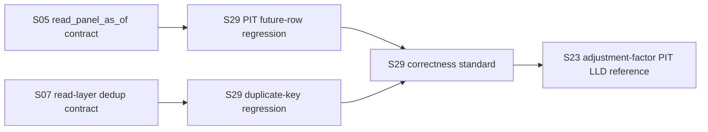

# LLD: CR139-S29 — T2+T3 PIT/dedup correctness tests

> 本文件是 CR139 Backlog-A1 的 CP5 full-lld 设计证据。它先固化 PIT/dedup correctness standard，S23 必须引用本文第 8 节。
> 本文件不授权实现、真实 lake 写入、catalog/manifest 写入、pointer advance、NAS/provider/runtime/Git 操作。

## 修订记录

| 版本 | 日期 | 修订人 | 变更要点 |
|---|---|---|---|
| 1.0 | 2026-06-30 | host-orchestrator | 首版 S29 full-lld；定义 future-financial-report PIT fixture、duplicate-key dedup fixture、测试边界、correctness standard 与 S23 引用契约。 |

## 0. 上游设计依据

| 来源 | 路径 / ID | 被本 LLD 消费的内容 |
|---|---|---|
| Story card | `process/stories/CR139-S29-pit-dedup-correctness-tests.md` | REQ-226/227、full-lld、输出文件、依赖 S05/S07、fixture/static 验证边界。 |
| A0 gap analysis | `process/checks/CR139-BACKLOG-A0-GAP-ANALYSIS-2026-06-30.md` | S29 必须先定义 correctness standard；新测试不能重写 S05/S07 既有测试。 |
| Requirements | `process/REQUIREMENTS.md` REQ-226/227 | T2: future financial report as-of read must not leak; T3: duplicate key read result must be unique. |
| Feature Matrix | `docs/design/FEATURE-DESIGN-MATRIX.md` v1.13 | REQ-226/227 属 FEAT-02 读侧，类别 c，full-lld。 |
| HLD | `process/docs/design/HLD-STRATEGY-DATA-FOUNDATION.md` v0.2 | FEAT-02 读侧 PIT/as-of reader、read-layer dedup、读侧安全门禁链。 |
| ADR | `process/docs/design/ARCHITECTURE-DECISION-STRATEGY-DATA-FOUNDATION.md` v0.2 | D2 写侧/读侧分离；D7 数据/研究/ML/交易生产门禁；REQ-248 不授权范围。 |
| Upstream tests | `tests/test_cr139_pit_as_of_reader.py`, `tests/test_cr139_read_layer_dedup.py` | S05/S07 predecessor contracts; S29 adds combined regression acceptance, not a rewrite. |

## 1. Goal

Create two explicit CR139 regression test files:

- `tests/test_cr139_pit_correctness.py`
- `tests/test_cr139_dedup_correctness.py`

These tests define the PIT/dedup correctness standard for Backlog-A. S23 must use this standard when validating adjustment-factor PIT and breakpoint behavior.

## 2. Requirements

### 2.1 Functional

| ID | Requirement | Design response |
|---|---|---|
| REQ-226 | Future financial report fixture is not visible to an as-of reader before `available_at`. | Add a fixture with one past row and one future row for the same symbol/report key. Assert as-of read at `T` excludes `available_at > T` and returns no leaked future value. |
| REQ-227 | Duplicate `(symbol, trade_date)` fixture is unique after dedup read. | Add a fixture with repeated `(symbol, trade_date)` across runs and assert post-read group count `>1` is zero. |
| A0-S29-STD | Define correctness standard before S23. | Section 8 is normative for S23 and CP5 precheck must verify S23 cites it. |

### 2.2 Non-Functional

| NFR | Design response |
|---|---|
| Read-only | Tests use tmp_path and in-memory/fixture lake only; no production lake, catalog, manifest, pointer, NAS, provider, runtime, or Git operation. |
| Deterministic | Fixtures use fixed dates, run IDs, values, and explicit `available_at`; assertions are exact counts/values. |
| Regression focused | New tests only cover explicit S29 acceptance and do not duplicate the full S05/S07 test matrix. |
| Fast local verification | Target commands run with `uv run --python 3.11 pytest -q tests/test_cr139_pit_correctness.py tests/test_cr139_dedup_correctness.py`. |

## 3. Modules And Responsibilities

| Module / file group | Responsibility | Notes |
|---|---|---|
| `tests/test_cr139_pit_correctness.py` | S29 T2 regression test for future financial report leakage. | Owns only S29 acceptance fixture; may reuse `read_panel_as_of` or a small helper wrapping `ReaderResult`. |
| `tests/test_cr139_dedup_correctness.py` | S29 T3 regression test for duplicate-key uniqueness after read-layer dedup. | Owns only S29 acceptance fixture; may reuse `read_dataset`/`read_canonical` fixture patterns from S07. |
| `market_data/readers.py` | Existing PIT/as-of and dedup behavior under test. | No S29 code changes planned unless CP6 discovers missing exported behavior. |
| `market_data/catalog.py` / `market_data/lake_layout.py` | Fixture catalog and temp lake setup. | Test-only use; no production catalog writes. |

## 4. Code Structure And File Impact

| Action | File path | Change content |
|---|---|---|
| Create | `tests/test_cr139_pit_correctness.py` | Adds future-financial-report fixture and as-of leakage assertions. |
| Create | `tests/test_cr139_dedup_correctness.py` | Adds duplicate-key fixture and uniqueness assertions. |
| No change by design | `market_data/readers.py` | S29 tests existing behavior; any behavior fix discovered during CP6 must remain in S29/S23 approved scope or create design delta. |
| No change by design | lake/catalog/manifest/pointer surfaces | No production write or pointer mutation. |

## 5. Data Model And Persistence

No new persistent data model.

| Object / field | Type | Constraint | Notes |
|---|---|---|---|
| future financial fixture row | pandas row / parquet fixture | `available_at > as_of` | Must be excluded by as-of read. |
| visible financial fixture row | pandas row / parquet fixture | `available_at <= as_of` | May be returned and used as control row. |
| duplicate key fixture | pandas row / parquet fixture | duplicate `(symbol, trade_date)` across at least two runs | Read result must have duplicate group count = 0. |
| fixture catalog entry | `CatalogEntry` | `published=True`, `quality_status=pass`, explicit run refs | Lives only in `tmp_path` catalog for test. |

No migration, no production lake writes, no active catalog or manifest mutation.

## 6. API / Interface Design

| Interface / entry | Input | Output | Caller | Test mapping |
|---|---|---|---|---|
| `read_panel_as_of(dataset, lake_or_reader, as_of=...)` | dataset, temp lake or fixture reader, as_of date | `ReaderResult` with frame/status/issues | S29 PIT test | T-S29-PIT-01/02 |
| `read_dataset(DATASET_PRICES, lake)` | temp lake with duplicate price runs | `ReaderResult` with deduped frame | S29 dedup test | T-S29-DEDUP-01 |
| helper `_duplicate_key_count(frame)` | DataFrame | integer duplicate group count | S29 dedup test | T-S29-DEDUP-01 |

Every interface above is read-only from the production system perspective. Fixture catalog writes are local `tmp_path` test setup only.

## 7. Core Flow

1. Build a `tmp_path` fixture or in-memory `ReaderResult` with fixed rows.
2. For PIT:
   - include a visible row with `available_at <= as_of`;
   - include a future row with `available_at > as_of`;
   - call `read_panel_as_of`;
   - assert future value/symbol/report key does not appear.
3. For dedup:
   - create two or more `run_id=*` partitions with duplicate `(symbol, trade_date)`;
   - publish a fixture catalog current run;
   - call `read_dataset`;
   - assert duplicate group count = 0 and retained row is deterministic.
4. Assert no production surface is touched by checking all paths are under `tmp_path` and no inspected source function performs catalog/pointer writes in the read helper.

## 8. Correctness Standard

This section is normative for Backlog-A1/A2 and must be cited by S23.

| Standard ID | Rule | Required assertion |
|---|---|---|
| STD-S29-PIT-01 | A row whose `available_at` is later than the reader `as_of` / decision time is invisible to the read result. | Returned frame contains 0 rows with the future row's unique marker; if no rows are visible, status must be `required_missing` or an empty available frame with explicit issue, not silent fallback to current truth. |
| STD-S29-PIT-02 | When both visible and future rows exist for the same entity, the visible row is selected and the future row is excluded. | Returned value equals the row with max `available_at <= as_of`, and never equals a value from `available_at > as_of`. |
| STD-S29-DEDUP-01 | After the public read path returns a frame for a dedup-governed dataset, duplicate groups by natural key are zero. | `groupby(keys).size().gt(1).sum() == 0`. For prices, keys are `("symbol", "trade_date")`. |
| STD-S29-DEDUP-02 | Duplicate resolution is deterministic. | A fixed fixture with two runs always retains the expected current/latest row. |
| STD-S29-BOUNDARY-01 | Test fixtures are local and static. | No production lake, active catalog, active manifest, pointer, NAS, provider, runtime, credential, or Git remote operation count is permitted. |

S23 must satisfy the PIT half of this standard for adjustment-factor application:

- ex-dividend/corporate-action rows with `available_at > as_of` must not affect adjusted prices at `as_of`;
- rows with `available_at <= as_of` may affect adjusted prices;
- breakpoint regression must assert before/after factor behavior with exact numeric expectations;
- duplicate adjustment-factor rows must follow the same deterministic uniqueness rule when S23 adds S23-specific fixtures.

## 9. Security And Performance

| Dimension | Design measure | Verification |
|---|---|---|
| Security | No credential read, provider fetch, NAS, runtime, trading, or Git remote action. | CP5/CP6 operation counts remain zero for forbidden surfaces. |
| Data safety | Only `tmp_path` fixture files are written by tests. | Test setup path assertions; no lake root from env. |
| Performance | Small fixture frames: O(rows) filtering/dedup; no full active-lake load. | Unit tests complete locally; no benchmark required. |
| Auditability | Test names encode PIT/dedup intent and trace to REQ-226/227. | CP7 report links tests to S29. |

## 10. Test Design

| Test ID | Test scenario | Precondition | Operation | Expected result | Verification |
|---|---|---|---|---|---|
| T-S29-PIT-01 | Future financial row is not visible. | Fixture has row `available_at=2026-01-06`; `as_of=2026-01-05`. | Call `read_panel_as_of`. | Future row marker absent; no leaked value. | `tests/test_cr139_pit_correctness.py`. |
| T-S29-PIT-02 | Latest visible row is retained. | Same symbol has visible row `available_at=2026-01-04` and future row `2026-01-06`. | Call `read_panel_as_of`. | Returned value is visible row. | `tests/test_cr139_pit_correctness.py`. |
| T-S29-DEDUP-01 | Duplicate price key returns unique result. | Fixture lake has repeated `(symbol, trade_date)` across two or three runs. | Call `read_dataset(DATASET_PRICES, lake)`. | Duplicate key group count = 0. | `tests/test_cr139_dedup_correctness.py`. |
| T-S29-DEDUP-02 | Dedup retained row is deterministic. | Fixture catalog points to current/latest run. | Call `read_dataset`. | Expected current/latest run value retained. | `tests/test_cr139_dedup_correctness.py`. |
| T-S29-BOUNDARY-01 | No production surface write. | Test source inspected or tmp_path only. | Run tests. | No active catalog/manifest/pointer/provider/NAS/runtime/Git operation. | CP6/CP7 evidence. |

## 11. Implementation Steps

| TASK-ID | Action | Target file | Detail | Corresponding tests |
|---|---|---|---|---|
| TASK-S29-01 | Create | `tests/test_cr139_pit_correctness.py` | Add fixture helper and T-S29-PIT-01/02. | T-S29-PIT-01/02 |
| TASK-S29-02 | Create | `tests/test_cr139_dedup_correctness.py` | Add tmp lake/catalog fixture and T-S29-DEDUP-01/02. | T-S29-DEDUP-01/02 |
| TASK-S29-03 | Verify | no production code file | Run targeted pytest command. | All S29 tests |
| TASK-S29-04 | Record | CP6/CP7 evidence files | Record operation counts and no-write boundary. | T-S29-BOUNDARY-01 |

## 12. Risks, Difficulties, And Research

### 12.1 Clarification And Tradeoff Log

| Clarification ID | Question | Options and recommendation | Decision / answer | Impact | Evidence | Revisit condition |
|---|---|---|---|---|---|---|
| LCQ-S29-01 | Should S29 reuse S05/S07 existing tests or create explicit S29 tests? | Recommendation: create explicit S29 tests while reusing fixture patterns. Alternative: mark existing tests as equivalent. | Create explicit tests. | Avoids overstating W1 coverage and gives S23 a stable standard. | A0 gap analysis. | Revisit only if CP6 proves tests are exact duplicates. |

| Risk / difficulty | Impact | Mitigation |
|---|---|---|
| Duplicating S05/S07 tests | Inflates regression suite without new coverage. | S29 tests must use explicit future-financial-report and combined duplicate-key acceptance; CP5 precheck checks boundary. |
| Current code may already pass all tests | S29 still required as regression standard. | Treat tests as formal acceptance evidence, not proof of new behavior. |
| S23 may cite S29 before S29 implementation exists | CP5 ambiguity. | S23 cites Section 8 standard, not CP6 test result; CP6 later executes both. |

### OPEN / Spike Tracking

| ID | Type | Question | Next action | Owner |
|---|---|---|---|---|
| N/A | N/A | No blocking open item. | N/A | N/A |

## 13. Rollback And Release Strategy

- Release mode: test-only local regression addition.
- Rollback trigger: S29 tests duplicate existing tests without new assertions, or require production data access.
- Rollback action: remove new test files and reopen S29 CP5 design; no data rollback needed.
- Deployment impact: none until CP6 implementation and CP7 verification pass; no user-facing runtime behavior change by S29 alone.

## 14. Definition Of Done

- [ ] S29 LLD has 14 sections and is ready for CP5 review.
- [ ] Section 8 correctness standard exists and is stable enough for S23 to cite.
- [ ] `tests/test_cr139_pit_correctness.py` boundary is distinct from `tests/test_cr139_pit_as_of_reader.py`.
- [ ] `tests/test_cr139_dedup_correctness.py` boundary is distinct from `tests/test_cr139_read_layer_dedup.py`.
- [ ] Targeted pytest command is defined.
- [ ] No production lake/catalog/manifest/pointer/NAS/provider/runtime/Git operation is authorized.

## CP5 Checklist Summary

| # | Check | Status | Evidence |
|---|---|---|---|
| 1 | LLD covers AC | PASS | Sections 2, 8, 10 |
| 2 | HLD/ADR consistent | PASS | Sections 0, 3, 9 |
| 3 | File impact clear | PASS | Section 4 |
| 4 | Interface contracts complete | PASS | Section 6 |
| 5 | Tests and dev_gate calculable | PASS | Sections 10, 14 |
| 6 | Clarification queue converged | PASS | Section 12.1 |

## Human Confirmation Area

- CP5 conclusion: `pending`
- Reviewer:
- Reviewed at:
- Notes:
