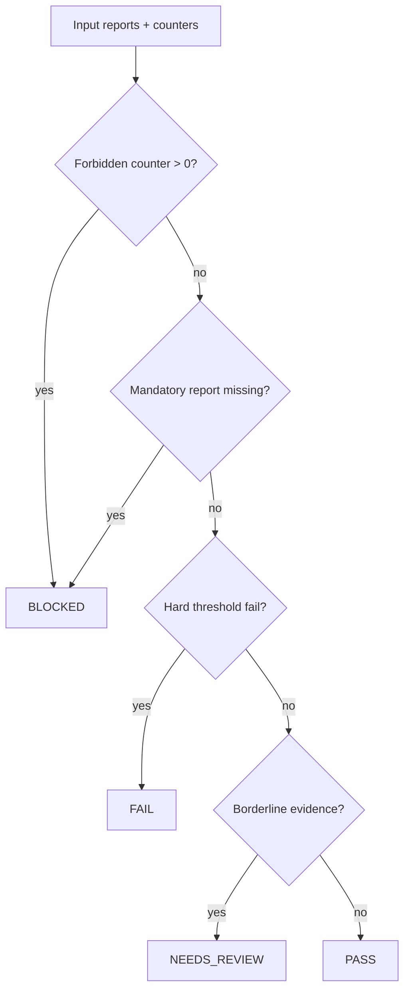

# LLD: CR151-S02 — Gate Evaluator And Fail-Closed Rules

## 0. 上游设计依据

| 来源 | 路径 / ID | 被本 LLD 消费的内容 |
|---|---|---|
| Story dependency | `process/stories/CR151-S01-statistical-report-contracts-LLD.md` | report contracts, validation helpers, status enum |
| HLD | `process/docs/design/HLD-CR151-STRATEGY-ADMISSION-STATISTICAL-GATE.md` | four-state status model and mandatory-missing BLOCKED rule |
| ADR | `process/docs/design/ARCHITECTURE-DECISION-CR151-STRATEGY-ADMISSION-STATISTICAL-GATE.md` | fail-closed model and static validation boundary |
| Feature TEST-PLAN | `docs/features/factor-research-loop/TEST-PLAN.md` | PASS/FAIL/NEEDS_REVIEW/BLOCKED fixture requirements |

## 1. Goal

Implement deterministic aggregate gate evaluation over CR151 report contracts so missing mandatory evidence and forbidden operations fail closed.

## 2. Requirements（Functional / Non-Functional）

### 2.1 Functional

- Evaluate mandatory reports: multiple testing, robust stats, walk-forward/OOS and overfit risk.
- Return `BLOCKED` when mandatory evidence is missing or forbidden operation counters are nonzero.
- Return `FAIL` when evidence exists and hard thresholds fail.
- Return `NEEDS_REVIEW` for available but borderline evidence.
- Return `PASS` only when all mandatory reports pass thresholds and no forbidden operation is present.

### 2.2 Non-Functional

- Deterministic fixture-only evaluation.
- No network, env, filesystem scan, runtime adapter or external framework dependency.
- Status precedence must be explicit and testable.
- Threshold defaults must be visible and overrideable by local config object / function arguments, not hidden globals.

## 3. 模块拆分与职责

| 模块 / 文件组 | 职责 | 说明 |
|---|---|---|
| `engine/strategy_admission_statistical_gate.py` | evaluator, threshold policy, status precedence | Extends S01 module after contract skeleton exists. |
| `tests/test_cr151_strategy_admission_statistical_gate.py` | status precedence and fail-closed fixtures | Extends S01 test file; S02 merge owner for evaluator tests. |

## 4. 代码结构与文件影响范围

| 动作 | 文件路径 | 变更内容 |
|---|---|---|
| 修改 | `engine/strategy_admission_statistical_gate.py` | Add threshold dataclass, evaluator function and status aggregation. |
| 修改 | `tests/test_cr151_strategy_admission_statistical_gate.py` | Add fixture tests for all four statuses and precedence rules. |

## 5. 数据模型与持久化设计

No persistence is introduced.

| 对象 / 字段 | 类型 | 约束 | 说明 |
|---|---|---|---|
| `StatisticalGateThresholds` | dataclass | `fdr_alpha`, `min_robust_t`, `max_p_value`, `min_oos_pass_rate`, `max_pbo`, `min_dsr`, `min_sample_count` | Defaults are local and explicit. |
| `operation_counts` | dict[str, int] | forbidden keys must remain 0 | Keys include credential/lake/NAS/provider/QMT/runtime/broker/external_framework/git_remote. |
| `blocked_reasons` | list[str] | non-empty if status BLOCKED | Missing mandatory report or forbidden operation reason. |
| `needs_review_reasons` | list[str] | non-empty if status NEEDS_REVIEW | Borderline sample or threshold ambiguity. |

## 6. API / Interface 设计

| 接口 / 入口 | 输入 | 输出 | 调用方 | 说明 |
|---|---|---|---|---|
| `evaluate_strategy_admission_statistical_gate(...)` | optional Wave A reports, thresholds, operation_counts, report_refs | `StrategyAdmissionStatisticalGate` | S03 linkage, tests, evidence writers | Central aggregate evaluator. |
| `default_statistical_gate_thresholds()` | none | `StatisticalGateThresholds` | tests / callers | Provides deterministic defaults. |
| `forbidden_operation_counts_zero(operation_counts)` | dict[str, int] | list[str] issues | evaluator | Never performs operations; only checks counters. |

## 7. 核心处理流程

1. Normalize thresholds to explicit defaults.
2. Validate forbidden operation counters.
3. Validate presence and shape of mandatory Wave A reports using S01 helpers.
4. If any forbidden operation or mandatory missing issue exists, return `BLOCKED`.
5. Evaluate hard thresholds; any hard failure returns `FAIL`.
6. Evaluate borderline review thresholds; any review issue returns `NEEDS_REVIEW`.
7. Return `PASS` and include report refs.

## 8. 技术设计细节

- Status precedence: `BLOCKED > FAIL > NEEDS_REVIEW > PASS`.
- Mandatory reports: multiple testing, robust stats, walk-forward/OOS and overfit risk.
- Suggested default thresholds for local fixture semantics: `fdr_alpha=0.05`, `min_robust_t=2.0`, `max_p_value=0.05`, `min_oos_pass_rate=0.67`, `max_pbo=0.2`, `min_dsr=0.0`, `min_sample_count=30`.
- `min_oos_pass_rate=0.67` is deliberately stricter than a bare 50% fold majority so an obviously curve-fit fixture cannot pass by winning only half the folds. It is still a fixture/static default, not a production turnover recommendation; production thresholds belong to CR154 / later real-data reliability gates.
- Operation counters are evidence fields, not triggers to inspect systems.

## 9. 安全与性能设计

| 维度 | 设计措施 | 验证方式 |
|---|---|---|
| 安全 | Evaluator only consumes passed-in report objects and counters. | Tests pass without `.env` or external IO. |
| Fail-closed | Missing mandatory evidence and forbidden counters return BLOCKED before threshold checks. | Dedicated precedence tests. |
| 性能 | O(number of reports + fold metrics). | Tiny fixture tests; no benchmark needed. |

## 10. 测试设计

| 测试场景 | 前置条件 | 操作 | 预期结果 | 验证方式 |
|---|---|---|---|---|
| PASS path | all reports pass thresholds, counters zero | evaluate | status PASS | pytest |
| Missing walk-forward | no OOS report | evaluate | status BLOCKED, blocked reason present | pytest |
| Forbidden credential counter | credential_read=1 | evaluate | status BLOCKED before threshold checks | pytest |
| Hard FDR failure | adjusted p-values fail | evaluate | status FAIL | pytest |
| Hard OOS failure | fold pass rate below `min_oos_pass_rate=0.67` | evaluate | status FAIL | pytest |
| Borderline small sample | sample_count below preferred threshold but present | evaluate | status NEEDS_REVIEW | pytest |
| Precedence | forbidden counter plus hard fail | evaluate | status BLOCKED | pytest |

## 11. 实施步骤

| TASK-ID | 动作 | 目标文件 | 详细描述 | 对应测试 |
|---|---|---|---|---|
| CR151-S02-T01 | 修改 | `engine/strategy_admission_statistical_gate.py` | Add threshold dataclass and default factory. | threshold default test |
| CR151-S02-T02 | 修改 | `engine/strategy_admission_statistical_gate.py` | Add forbidden counter validation. | forbidden counter BLOCKED test |
| CR151-S02-T03 | 修改 | `engine/strategy_admission_statistical_gate.py` | Add aggregate evaluator with explicit precedence. | all status tests |
| CR151-S02-T04 | 修改 | `tests/test_cr151_strategy_admission_statistical_gate.py` | Add four-state fixture coverage and precedence checks. | all S02 tests |

## 12. 风险、难点与预研建议

### 12.1 实现灰区与取舍记录

| Clarification ID | 问题 | 选项与推荐 | 决策 / 答案 | 影响面 | 证据 | 重访条件 |
|---|---|---|---|---|---|---|
| N/A | Threshold defaults are fixture defaults, not production policy. | Use explicit local defaults and CP8 wording. | Resolved by static-only boundary. | Tests / release wording | ADR-CR151-004 | If user asks for production turnover. |

| 风险 / 难点 | 影响 | 缓解措施 / 预研建议 |
|---|---|---|
| Borderline status abused to hide missing evidence | False readiness | Precedence makes mandatory missing BLOCKED; tests enforce. |
| Thresholds interpreted as production recommendations | Misleading release | S04 release wording states fixture/static only. |

### OPEN / Spike 跟踪

| ID | 类型（OPEN / Spike） | 问题 | 下一动作 | 责任方 |
|---|---|---|---|---|
| N/A | OPEN | No open item. | N/A | N/A |

## 13. 回滚与发布策略

- 发布方式：merge after CP5 approval and S01 contract implementation.
- 回滚触发条件：status precedence conflicts with CP3 decision or tests prove ambiguity.
- 回滚动作：revert evaluator changes while preserving S01 report contracts, then reopen CP5 design evidence.

## 14. Definition of Done

- [ ] Evaluator returns all four statuses under fixtures.
- [ ] Mandatory missing and forbidden operations produce `BLOCKED`.
- [ ] Status precedence is tested.
- [ ] Threshold defaults are explicit and local.
- [ ] No runtime or external IO is introduced.

## 人工确认区

**CP5 — Story 设计证据可实现性门**

| # | 检查项 | 状态 | 证据 |
|---|---|---|---|
| 1 | LLD 覆盖 AC | pending | 第 2 / 10 / 14 节 |
| 2 | 与 HLD / ADR 一致 | pending | 第 0 / 8 / 12 节 |
| 3 | 文件影响范围明确 | pending | 第 4 / 11 节 |
| 4 | 接口契约完整 | pending | 第 6 节 |
| 5 | 测试与 dev_gate 可计算 | pending | 第 10 / 14 节 |
| 6 | clarification queue 已收敛 | pending | 第 12.1 节 |

**人工审查结果回填**：

- 结论：`pending`
- 审查人：
- 审查时间：
- 修改意见：
- 风险接受项：
