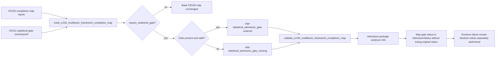

# LLD: CR151-S03 — Admission And Completion Linkage

## 0. 上游设计依据

| 来源 | 路径 / ID | 被本 LLD 消费的内容 |
|---|---|---|
| Story dependency | `process/stories/CR151-S01-statistical-report-contracts-LLD.md` | statistical gate object and report refs |
| Story dependency | `process/stories/CR151-S02-gate-evaluator-fail-closed-rules-LLD.md` | aggregate status semantics |
| HLD | `process/docs/design/HLD-CR151-STRATEGY-ADMISSION-STATISTICAL-GATE.md` | Flow 2 linkage into admission chain |
| ADR | `process/docs/design/ARCHITECTURE-DECISION-CR151-STRATEGY-ADMISSION-STATISTICAL-GATE.md` | statistical PASS must not become runtime readiness |
| CR150 evidence | `process/evidence/CR150-MULTIFACTOR-FRAMEWORK-COMPLETION-MAP.index.json` | completion map history and static-only boundary |

## 1. Goal

Connect the CR151 statistical gate summary/ref into existing multifactor completion and admission surfaces without rewriting CR150 history or expanding runtime authorization.

## 2. Requirements（Functional / Non-Functional）

### 2.1 Functional

- Add an optional statistical gate ref/status to the CR151 linkage path or existing completion map helper.
- Add `statistical_admission_gate_missing` or equivalent linkage gap when gate evidence is absent.
- Allow `StrategyAdmissionPackage` or equivalent admission summary to carry statistical gate refs and blocked reasons.
- Preserve existing no-real-operation and runtime-blocked semantics.

### 2.2 Non-Functional

- Backward compatible with existing CR150 tests.
- No source of truth migration or real data access.
- Minimal edits to existing broad CR150 files.
- Release wording remains static-only.

## 3. 模块拆分与职责

| 模块 / 文件组 | 职责 | 说明 |
|---|---|---|
| `engine/mature_multifactor_research.py` | Completion map / linkage helper update | S03 owns any CR150 map-compatible change. |
| `engine/strategy_admission_package.py` | Statistical gate summary/ref and status mapping into existing `AdmissionStatus` | Existing `StrategyAdmissionPackage.admission_status` already uses `engine.admission_contracts.AdmissionStatus`; S03 must preserve that enum and keep the CR151 four-state status as separate evidence. |
| `tests/test_cr150_multifactor_framework_completion.py` | Regression for current completion map behavior | Must prove existing static-only CR150 assumptions remain intact. |
| `tests/test_cr151_strategy_admission_statistical_gate.py` | CR151 linkage fixture | Adds gate present/missing cases. |

## 4. 代码结构与文件影响范围

| 动作 | 文件路径 | 变更内容 |
|---|---|---|
| 修改 | `engine/mature_multifactor_research.py` | Extend `build_cr150_multifactor_framework_completion_map`, `validate_cr150_multifactor_framework_completion_map` and `_cr150_linkage_gaps` for optional CR151 statistical gate linkage. |
| 修改 | `engine/strategy_admission_package.py` | Add deterministic statistical gate evidence/ref support and explicit status mapping without replacing existing `AdmissionStatus`. |
| 修改 | `tests/test_cr150_multifactor_framework_completion.py` | Add regression that CR150 metadata linkage remains valid and static-only. |
| 修改 | `tests/test_cr151_strategy_admission_statistical_gate.py` | Add linkage present/missing tests. |

## 5. 数据模型与持久化设计

No persistent storage is introduced. Linkage remains metadata/evidence references only.

| 对象 / 字段 | 类型 | 约束 | 说明 |
|---|---|---|---|
| `statistical_gate_ref` | str or null | optional evidence ref | Points to CR151 statistical gate evidence/report. |
| `statistical_gate_status` | str | one of S02 statuses: `PASS`, `FAIL`, `NEEDS_REVIEW`, `BLOCKED` | Preserved separately from existing `AdmissionStatus`; never silently coerced. |
| `admission_status` mapping | `AdmissionStatus` | `PASS -> PASS`, `FAIL -> FAIL`, `NEEDS_REVIEW -> WARN`, `BLOCKED -> BLOCKED` | Mapping is used only for existing `StrategyAdmissionPackage.admission_status`; original statistical status remains in `statistical_gate_summary.status`. |
| `statistical_admission_gate_missing` | linkage gap code | emitted when gate required but missing | Must not be hidden as pass. |
| `statistical_gate_summary` | mapping | `ref`, `status`, `report_refs`, `blocked_reasons`, `needs_review_reasons` | Nested metadata summary carried in completion/admission evidence; no runtime authorization. |
| `blocked_claims` | list[str] | existing style | Can include statistical gate blocked reason. |

## 6. API / Interface 设计

| 接口 / 入口 | 输入 | 输出 | 调用方 | 说明 |
|---|---|---|---|---|
| `build_cr150_multifactor_framework_completion_map(..., statistical_gate_summary=None, require_statistical_gate=False)` | existing CR150 inputs + optional CR151 statistical gate summary | completion map with CR150 base nodes, optional `statistical_admission_gate` node, ref and gap | tests, evidence builders | Real source function is `engine.mature_multifactor_research.build_cr150_multifactor_framework_completion_map`. Default `require_statistical_gate=False` must preserve CR150 behavior. |
| `validate_cr150_multifactor_framework_completion_map(completion_map)` | completion map | tuple of validation issues | tests, CP7 evidence validation | Must accept the base CR150 node order and the CR151-extended node order; must validate status vs linkage gaps using the actual node order/hash input. |
| `_cr150_linkage_gaps(nodes, operations)` | nodes + operation counters | tuple of gap dicts | builder / tests | Must emit stable `statistical_admission_gate_missing` when the required `statistical_admission_gate` node is missing or not PASS, and must keep existing required-node / operation-counter gaps. |
| `map_statistical_gate_status_to_admission_status(status)` | `PASS/FAIL/NEEDS_REVIEW/BLOCKED` | `AdmissionStatus.PASS/FAIL/WARN/BLOCKED` | `engine.strategy_admission_package` helper / tests | Explicitly maps S02 status to existing package enum while preserving original statistical status in evidence. |
| `attach_statistical_gate_to_admission_package(package, statistical_gate_summary)` | existing package + gate summary | package dict/dataclass with evidence ref, mapped admission status and preserved statistical summary | tests / evidence builders | Must not overwrite runtime authorization flags or allowed claims. |

## 7. 核心处理流程

1. Existing CR150 completion map is built by `build_cr150_multifactor_framework_completion_map` from factor/run/panel/label/signal/portfolio/backtest/report/cost/risk/admission nodes.
2. If `require_statistical_gate=False`, behavior remains compatible with the CR150 base map.
3. If `require_statistical_gate=True` and `statistical_gate_summary` is provided, add a required `statistical_admission_gate` node/ref and preserve `statistical_gate_summary.status`.
4. If `require_statistical_gate=True` and gate summary/ref is missing or not PASS, `_cr150_linkage_gaps` emits `statistical_admission_gate_missing`.
5. `validate_cr150_multifactor_framework_completion_map` validates the base or extended node order and status/gap consistency.
6. Admission package consumes the gate ref/status as evidence only; `StrategyAdmissionStatisticalGate.status` maps to existing `AdmissionStatus` only through the explicit mapping table.
7. Runtime readiness and no-real-operation claims remain unchanged.

## 8. 技术设计细节

- Use the real source function names verified before CP5: `build_cr150_multifactor_framework_completion_map`, `validate_cr150_multifactor_framework_completion_map`, and `_cr150_linkage_gaps`.
- Do not replace `StrategyAdmissionPackage.admission_status`; it remains `engine.admission_contracts.AdmissionStatus`.
- Preserve original `StrategyAdmissionStatisticalGate.status` in `statistical_gate_summary.status`; mapped `AdmissionStatus` is only the existing package-level compatibility surface.
- Mapping table: `PASS -> AdmissionStatus.PASS`, `FAIL -> AdmissionStatus.FAIL`, `NEEDS_REVIEW -> AdmissionStatus.WARN`, `BLOCKED -> AdmissionStatus.BLOCKED`.
- Default `require_statistical_gate=False` preserves CR150 base behavior and historical CP8 evidence.
- `require_statistical_gate=True` is used by CR151 linkage tests/evidence to make a missing statistical gate a real linkage gap.
- `nodes` continue to represent asset inventory; `linkage_gaps` remains the gap-count view.
- CR150 CP8 release decision is historical evidence and must not be edited by this story.

## 9. 安全与性能设计

| 维度 | 设计措施 | 验证方式 |
|---|---|---|
| 安全 | Only metadata refs/status are added; no real IO. | no-real-operation tests and static-only wording. |
| Backward compatibility | Existing CR150 completion test still passes. | `tests/test_cr150_multifactor_framework_completion.py` |
| Performance | Adds constant-size metadata fields. | Unit tests sufficient. |

## 10. 测试设计

| 测试场景 | 前置条件 | 操作 | 预期结果 | 验证方式 |
|---|---|---|---|---|
| Gate present linkage | CR150 fixtures + gate PASS ref | build map/package | statistical gate node/ref present, no runtime claim | pytest |
| Gate missing linkage | CR151 requires gate but no ref | build map/package | `statistical_admission_gate_missing` gap present | pytest |
| Gate BLOCKED propagates | gate status BLOCKED | attach to package | blocked reason preserved | pytest |
| Status mapping | each S02 status | map to AdmissionStatus | PASS->PASS, FAIL->FAIL, NEEDS_REVIEW->WARN, BLOCKED->BLOCKED and original status preserved | pytest |
| Validator extended order | CR151 extended map | validate | no node-order issue when statistical gate node exists; status/gap consistency enforced | pytest |
| CR150 regression | existing CR150 fixture | run existing completion test | historical static-only assumptions still pass | pytest |

## 11. 实施步骤

| TASK-ID | 动作 | 目标文件 | 详细描述 | 对应测试 |
|---|---|---|---|---|
| CR151-S03-T01 | 修改 | `engine/mature_multifactor_research.py` | Extend `build_cr150_multifactor_framework_completion_map` with `statistical_gate_summary=None` and `require_statistical_gate=False`; preserve base CR150 behavior by default. | CR150 regression; gate present/missing tests |
| CR151-S03-T02 | 修改 | `engine/mature_multifactor_research.py` | Update `validate_cr150_multifactor_framework_completion_map` to validate base or CR151-extended node order and status/gap consistency. | validator extended order test |
| CR151-S03-T03 | 修改 | `engine/mature_multifactor_research.py` | Update `_cr150_linkage_gaps` to emit stable `statistical_admission_gate_missing` for the required statistical gate node. | missing gate gap test |
| CR151-S03-T04 | 修改 | `engine/strategy_admission_package.py` | Add explicit S02 status -> `AdmissionStatus` mapping and preserve original statistical status in evidence summary. | status mapping test |
| CR151-S03-T05 | 修改 | `tests/test_cr150_multifactor_framework_completion.py` | Add CR150 regression guard and CR151 linkage gap check if shared fixture lives here. | CR150 regression |
| CR151-S03-T06 | 修改 | `tests/test_cr151_strategy_admission_statistical_gate.py` | Add CR151 linkage tests with gate present/missing and status mapping. | CR151 linkage tests |

## 12. 风险、难点与预研建议

### 12.1 实现灰区与取舍记录

| Clarification ID | 问题 | 选项与推荐 | 决策 / 答案 | 影响面 | 证据 | 重访条件 |
|---|---|---|---|---|---|---|
| LCQ-CR151-S03-01 | Which real CR150 completion-map function must be extended? | Recommendation: extend `build_cr150_multifactor_framework_completion_map` and its paired validator/gap helpers; do not use placeholder names. | Resolved by source inspection before CP5. | Interface / tests / file owner | `engine/mature_multifactor_research.py` function names | If implementation discovers signature incompatibility. |
| LCQ-CR151-S03-02 | How should S02 `StrategyAdmissionStatisticalGate.status` map to existing `AdmissionStatus`? | Recommendation: keep original statistical status as separate evidence, and map only package-level status: PASS->PASS, FAIL->FAIL, NEEDS_REVIEW->WARN, BLOCKED->BLOCKED. Alternative: introduce a parallel package enum. | Resolved in this LLD; no user decision required because it preserves existing package enum. | Interface / package compatibility / tests | `engine/admission_contracts.AdmissionStatus` | If future package schema version supports native statistical status enum. |

| 风险 / 难点 | 影响 | 缓解措施 / 预研建议 |
|---|---|---|
| Accidentally changing CR150 historical release semantics | Audit regression | Add explicit regression test and do not edit CR150 CP8 artifacts. |
| Existing broad file has unrelated user changes | Merge conflict | Read files before implementation and preserve unrelated changes. |
| Statistical PASS misread as runtime readiness | Safety issue | Keep runtime claims blocked and assert no runtime-ready field changes. |

### OPEN / Spike 跟踪

| ID | 类型（OPEN / Spike） | 问题 | 下一动作 | 责任方 |
|---|---|---|---|---|
| N/A | OPEN | No open item. | N/A | N/A |

## 13. 回滚与发布策略

- 发布方式：merge after CP5 and after S01/S02 pass implementation tests.
- 回滚触发条件：CR150 regression fails, runtime claim changes, or package schema conflict is found.
- 回滚动作：remove linkage helper/fields and keep standalone statistical gate module; reopen CP5 if anchor changes.

## 14. Definition of Done

- [ ] Statistical gate present/missing linkage is test-covered.
- [ ] `statistical_admission_gate_missing` or equivalent gap exists when required evidence is absent.
- [ ] CR150 completion regression remains green.
- [ ] Runtime readiness remains unauthorized.
- [ ] No historical CR150 CP8 artifact is edited.

## 人工确认区

**CP5 — Story 设计证据可实现性门**

| # | 检查项 | 状态 | 证据 |
|---|---|---|---|
| 1 | LLD 覆盖 AC | pending | 第 2 / 10 / 14 节 |
| 2 | 与 HLD / ADR 一致 | pending | 第 0 / 8 / 12 节 |
| 3 | 文件影响范围明确 | pending | 第 4 / 11 节 |
| 4 | 接口契约完整 | pending | 第 6 节 |
| 5 | 测试与 dev_gate 可计算 | pending | 第 10 / 14 节 |
| 6 | clarification queue 已收敛 | pending | 第 12.1 节 |

**人工审查结果回填**：

- 结论：`pending`
- 审查人：
- 审查时间：
- 修改意见：
- 风险接受项：
