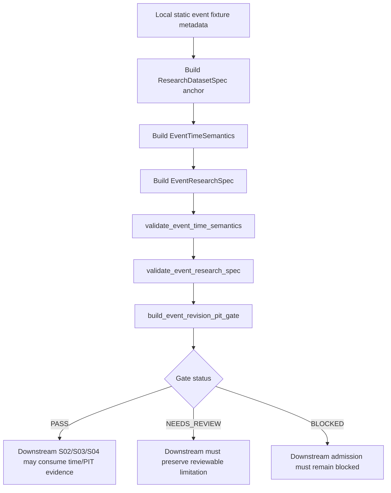

# LLD: CR153-S01 — Event Research Time Semantics and PIT Revision Gate

## 0. 上游设计依据

| 来源 | 路径 / ID | 被本 LLD 消费的内容 |
|---|---|---|
| CP5 Context | `process/context/CP5-CR153-EVENT-DRIVEN-STRATEGY-E2E-CONTEXT.yaml` | S01 owner scope、full-lld 输出路径、`event_available_at > decision_time` 必须 `BLOCKED`、不得从 occurred/announced 推断 available、local/static/fixture-only 授权边界。 |
| Story Card | `process/stories/CR153-S01-event-research-time-pit-contracts.md` | Story 目标、验收标准、文件所有权、`lld_policy.required_level=full-lld`、无前置 Story 依赖。 |
| HLD | `process/docs/design/HLD-EVENT-DRIVEN-STRATEGY-E2E-FRAMEWORK.md` | Event time semantics、`EventRevisionPITGate`、metadata-only contract extension、no-store/no-runtime 边界、UC-60 / EV-GAP-6 traceability。 |
| ADR | `process/docs/design/ARCHITECTURE-DECISION-EVENT-DRIVEN-STRATEGY-E2E-FRAMEWORK.md` | ADR-CR153-002 metadata is not store/catalog/registry write；ADR-CR153-003 extend existing research anchors；ADR-CR153-004 deterministic fixture-only validation。 |
| Story Backlog | `process/STORY-BACKLOG-CR153.md` | S01 acceptance criteria、S01/S02/S03 shared test ownership顺序、S01 冻结 time/PIT fields 后供下游消费。 |
| Development Plan | `process/DEVELOPMENT-PLAN-CR153.yaml` | Wave `CR153-W1-EVENT-PIT`、CP5 前不允许实现、验证命令、禁止真实 feed/listener/lake/NAS/provider/runtime/broker/credential/store/catalog/registry/order flow。 |
| Feature Matrix | `process/docs/design/FEATURE-DESIGN-MATRIX.md` | FEAT-03 归属、CR153 first-wave / later-wave 边界、S01 full-lld 判定、`event_available_at > decision_time` 明确为 CP5 focus。 |
| Existing source anchor | `engine/research_production_contracts.py` | `ResearchDatasetSpec`、`FeatureAvailabilityContract`、`ResearchDatasetSnapshotSpec`、metadata-only dataclass / validator / `to_dict()` / issue tuple 风格。 |
| Reference LLD | `process/stories/CR152-S01-pit-feature-label-contracts-LLD.md` | 同类 PIT / leakage contract 的 LLD 结构、companion object 策略、reserved capability 不冒充实现的写法。 |

## 1. Goal

为 CR153 事件驱动策略 first wave 定义 metadata-only 的 `EventResearchSpec`、`EventTimeSemantics` 与 `EventRevisionPITGate`，把事件身份、事件类型、实体键、事件三时间语义、`decision_time`、revision policy 和 PIT 可用性校验固化为可序列化、可静态验证、可被下游 Story 消费的研究契约。

本 Story 完成后，下游 S02/S03/S04/S05 只能消费 S01 输出的 event identity、time semantics 与 PIT/revision issue/status，不得重新定义 availability 推断规则或绕过 `event_available_at > decision_time` 的 fail-closed 行为。

## 2. Requirements（Functional / Non-Functional）

### 2.1 Functional

- 定义 `EventTimeSemantics`，显式包含 `event_occurred_at`、`event_announced_at`、`event_available_at`、`decision_time` 四个字段。
- 定义 `EventResearchSpec`，作为 `ResearchDatasetSpec` 的 event companion contract，包含 event identity、event type、entity key、source snapshot refs、revision policy ref、time semantics、operation counters 和 schema version。
- 定义 `EventRevisionPITGate`，表达 PIT/revision 校验结果、status、issues、revision refs 和 no-inference evidence。
- 校验 `event_available_at` 为必填；缺失时返回 `BLOCKED` issue，不允许从 `event_occurred_at` 或 `event_announced_at` 推断。
- 校验 `event_available_at > decision_time` 时返回 `BLOCKED`，issue code 固定为 `event_available_after_decision_time`。
- 校验 `revision_policy_ref` 缺失时返回 `NEEDS_REVIEW` 或 `BLOCKED`；本 LLD 推荐默认 `BLOCKED`，只有字段显式写入 `revision_policy_na_reason` 且 CP5 人工接受时才降为 `NEEDS_REVIEW`。
- 校验 source snapshot / revision refs 不得使用 `latest`、`current`、`mutable` 等 catalog-current-truth 语义。
- 暴露 JSON-safe `to_dict()`，并提供 mapping normalizer，支持测试 fixture 用 dict 输入验证。
- 保留下游可消费的 issue payload：`code`、`status`、`field`、`message`、`evidence_ref`、`remediation`。
- 在测试中覆盖至少一个 ordered-time passing fixture 和一个 look-ahead negative fixture。

### 2.2 Non-Functional

- Metadata-only：不得读真实 lake、NAS、provider、credential、catalog current truth 或 event feed。
- Side-effect free：不得创建、更新、发布、注册、上传、同步、持久化或 mutate event store/catalog/registry/model registry。
- Runtime-free：不得启动 listener、QMT、MiniQMT、xtquant、gateway、simulation、paper、live、broker 或 order flow。
- Deterministic：所有 validator 输出稳定 tuple/dict，不依赖系统时间、网络、文件系统状态或随机数。
- Backward compatible：不得破坏现有 `ResearchDatasetSpec` / `FeatureAvailabilityContract` 构造与验证行为；优先新增 companion objects。
- JSON-safe：所有时间字段以 ISO 字符串或可由 `datetime.fromisoformat()` 解析的字符串进入 `to_dict()`，不返回不可序列化对象。

## 3. 模块拆分与职责

| 模块 / 文件组 | 职责 | 说明 |
|---|---|---|
| `engine/research_production_contracts.py` | 定义事件研究 companion dataclass、validator、mapping normalizer、operation counter helpers 和 `__all__` export。 | S01 primary owner。必须靠近 `ResearchDatasetSpec` / `FeatureAvailabilityContract`，避免产生平行研究框架。 |
| `tests/research/test_event_driven_strategy_e2e_contracts.py` | 覆盖 S01 event time/PIT/revision fixture。 | S01 与 S02/S03/S04 共享测试文件，但 S01 只拥有 event identity、time semantics、revision PIT 基础用例。 |
| 下游 S02/S03/S04/S05 | 消费 S01 的 `EventResearchSpec`、`EventTimeSemantics` 和 `EventRevisionPITGate` 结果。 | 不在本 Story 实现；S01 仅定义接口与字段冻结点。 |

### S01 与下游边界

| 边界项 | S01 拥有 | 下游不得重定义 |
|---|---|---|
| Event identity | `event_id`、`event_type`、`entity_id`、`entity_id_field`、`source_snapshot_refs` | 不得引入另一套 event id / entity key 必填规则。 |
| Time semantics | `event_occurred_at`、`event_announced_at`、`event_available_at`、`decision_time` | 不得从 occurred/announced 推断 available。 |
| PIT/revision gate | availability vs decision-time、revision policy、revision refs、issue/status | 不得把 S01 `BLOCKED` 降级为 PASS。 |
| Operation counters | event/feed/store/catalog/runtime/order 禁止操作计数 | 下游可追加自身 counters，但不得忽略 S01 非零 counter。 |

## 4. 代码结构与文件影响范围

| 动作 | 文件路径 | 变更内容 |
|---|---|---|
| 修改 | `engine/research_production_contracts.py` | 新增 `EVENT_RESEARCH_SPEC_SCHEMA`、`EVENT_TIME_SEMANTICS_SCHEMA`、`EVENT_REVISION_PIT_GATE_SCHEMA`、`CR153_EVENT_FORBIDDEN_OPERATION_COUNTERS` 常量；新增 `EventTimeSemantics`、`EventResearchSpec`、`EventRevisionPITGate` dataclass；新增 `validate_event_time_semantics()`、`validate_event_research_spec()`、`build_event_revision_pit_gate()`、`event_research_spec_from_mapping()` 和私有 normalizer；更新 `__all__`。 |
| 创建 | `tests/research/test_event_driven_strategy_e2e_contracts.py` | 新增 S01 静态 fixture 测试：序列化、passing PIT gate、available-after-decision `BLOCKED`、missing availability `BLOCKED`、missing revision policy enforcement、forbidden operation counter `BLOCKED`、no inference from occurred/announced。若其他 CR153 Story 已创建该文件，实现阶段只追加 S01 owner 分区，不覆盖他人用例。 |

本 LLD 不授权修改源码或测试；上述文件影响范围仅供 CP5 批量确认后 CP6 实现使用。

## 5. 数据模型与持久化设计

无新增持久化、无数据库 schema、无 event store/catalog/registry 写入。所有对象均为内存 metadata contract，可序列化为 JSON-safe dict。

| 对象 / 字段 | 类型 | 约束 | 说明 |
|---|---|---|---|
| `EventTimeSemantics.schema_version` | `str` | 默认 `event_time_semantics_v1` | 便于 evidence index / downstream gate 标识版本。 |
| `EventTimeSemantics.event_occurred_at` | `str` | 必填；可解析为日期/时间；不得替代 available。 | 事件实际发生时间，例如公告涉及的财报期或事件日。 |
| `EventTimeSemantics.event_announced_at` | `str` | 必填；可解析为日期/时间；不得替代 available。 | 事件公告时间；公告不等于研究系统可获得时间。 |
| `EventTimeSemantics.event_available_at` | `str` | 必填；可解析；必须 `<= decision_time`。 | 事件数据对研究决策可用的最早时间；缺失即 `BLOCKED`。 |
| `EventTimeSemantics.decision_time` | `str` | 必填；可解析。 | 研究/信号决策时间。 |
| `EventTimeSemantics.timezone` | `str` | 可选，默认 `UTC`；不得为空字符串。 | 只作为元数据，不做交易日历换算。 |
| `EventTimeSemantics.calendar_ref` | `str` | 可选；若存在不得为 `current/latest`。 | 本 Story 不实现真实 calendar lookup。 |
| `EventResearchSpec.schema_version` | `str` | 默认 `event_research_spec_v1` | Event companion contract version。 |
| `EventResearchSpec.spec_id` | `str` | 必填；稳定 id。 | S01 event spec id。 |
| `EventResearchSpec.research_dataset_spec_id` | `str` | 必填；必须引用既有 `ResearchDatasetSpec.spec_id`。 | 遵守 ADR-CR153-003，不替代 research dataset anchor。 |
| `EventResearchSpec.event_id` | `str` | 必填；不得包含 `latest/current`。 | 单事件或事件族 fixture 的稳定 id。 |
| `EventResearchSpec.event_type` | `str` | 必填。 | 例如 earnings、policy、corporate_action；不触发 provider fetch。 |
| `EventResearchSpec.entity_id` | `str` | 必填。 | 事件主体，例如 symbol / issuer / industry。 |
| `EventResearchSpec.entity_id_field` | `str` | 必填，默认 `symbol`。 | 与 dataset primary key 对齐。 |
| `EventResearchSpec.source_snapshot_refs` | `tuple[str, ...]` | 必填；每项必须是静态 ref；不得为 catalog current truth。 | 只记录快照引用，不读取快照。 |
| `EventResearchSpec.revision_policy_ref` | `str` | 推荐必填；缺失默认 `BLOCKED`。 | 说明 revision policy 的静态证据引用。 |
| `EventResearchSpec.revision_source_refs` | `tuple[str, ...]` | 可选；若 revision policy 要求则必填。 | 只做 metadata ref。 |
| `EventResearchSpec.revision_policy_na_reason` | `str` | 可选；仅当 CP5 接受 N/A 时允许降级 `NEEDS_REVIEW`。 | 不得空泛写 N/A；必须说明事件源不可修订或 fixture 约束。 |
| `EventResearchSpec.time_semantics` | `EventTimeSemantics` | 必填。 | S01 核心时间语义。 |
| `EventResearchSpec.operation_counts` | `Mapping[str, int]` | 所有 forbidden counters 必须为 0。 | 非零返回 `BLOCKED`。 |
| `EventRevisionPITGate.status` | `str` | `PASS / NEEDS_REVIEW / BLOCKED` | S01 不产出 `FAIL`，因为本层只证明 PIT 可用性；语义失败统一 fail-closed `BLOCKED`。 |
| `EventRevisionPITGate.issues` | `tuple[Mapping[str, Any], ...]` | JSON-safe；包含 issue code 与 status。 | 下游 S04 event admission gate 消费。 |
| `EventRevisionPITGate.event_research_spec_id` | `str` | 必填。 | 连接回 `EventResearchSpec.spec_id`。 |
| `EventRevisionPITGate.revision_policy_ref` | `str` | 与 spec 对齐。 | 用于 CP7 evidence trace。 |
| `EventRevisionPITGate.operation_counts` | `Mapping[str, int]` | 全 0。 | 证明 validation side-effect free。 |

### Forbidden Operation Counters

`CR153_EVENT_FORBIDDEN_OPERATION_COUNTERS` 必须覆盖并扩展既有 `FORBIDDEN_OPERATION_COUNTERS`，至少包含：

| Counter | 触发含义 | 期望 |
|---|---|---|
| `real_event_feed_read` | 读取真实 event feed / provider 返回。 | 必须为 0。 |
| `live_listener_started` | 启动 listener、subscribe、poll。 | 必须为 0。 |
| `real_lake_access` | 真实 lake 读写。 | 必须为 0。 |
| `nas_access` | NAS 读写、同步、恢复、元数据修改。 | 必须为 0。 |
| `provider_fetch` | provider fetch / API 调用。 | 必须为 0。 |
| `credential_read` | `.env`、token、secret、account、session 读取。 | 必须为 0。 |
| `event_store_write` | event store row 写入或 mutate。 | 必须为 0。 |
| `catalog_pointer_mutation` | catalog current pointer 写入或 set_current。 | 必须为 0。 |
| `registry_write` | model/event/metadata registry write。 | 必须为 0。 |
| `runtime_started` | QMT/MiniQMT/xtquant/gateway/simulation/paper/live 启动。 | 必须为 0。 |
| `broker_or_order_flow` | broker query / submit / cancel / order flow。 | 必须为 0。 |

## 6. API / Interface 设计

| 接口 / 入口 | 输入 | 输出 | 调用方 | 说明 |
|---|---|---|---|---|
| `EventTimeSemantics.to_dict()` | `EventTimeSemantics` instance | JSON-safe dict | Tests, evidence serialization, downstream S02/S03/S04 | 必须包含四个 time 字段；不补默认 availability。 |
| `EventResearchSpec.to_dict()` | `EventResearchSpec` instance | JSON-safe dict | Tests, S02/S03/S04, return/evidence assembly | 嵌套 `time_semantics.to_dict()`，tuple 转 list，operation counts 转 dict。 |
| `EventRevisionPITGate.to_dict()` | `EventRevisionPITGate` instance | JSON-safe dict | S04 admission gate, S05 evidence wording | 输出 status、issues、refs、operation_counts。 |
| `event_research_spec_from_mapping(data)` | `Mapping[str, Any]` | `EventResearchSpec` | Tests, future fixture loaders | 只做结构归一化，不读外部文件。 |
| `validate_event_time_semantics(time_semantics)` | dataclass 或 mapping | `tuple[dict[str, Any], ...]` | `validate_event_research_spec()`、tests | 校验必填、可解析、distinctness、availability vs decision。 |
| `validate_event_research_spec(spec, *, research_dataset_spec=None)` | dataclass 或 mapping；可选 `ResearchDatasetSpec` anchor | `tuple[dict[str, Any], ...]` | Tests, S04 admission gate | 聚合 identity、source refs、revision policy、time semantics、forbidden counters 和 anchor mismatch issues。 |
| `build_event_revision_pit_gate(spec, *, research_dataset_spec=None)` | dataclass 或 mapping；可选 `ResearchDatasetSpec` anchor | `EventRevisionPITGate` | S04 admission gate, tests | 将 issue severity 映射到 `PASS / NEEDS_REVIEW / BLOCKED`。 |

### Status Mapping

| 条件 | Issue code | Gate status |
|---|---|---|
| 无 issue | N/A | `PASS` |
| `event_available_at` 缺失 | `event_available_at_missing` | `BLOCKED` |
| `decision_time` 缺失 | `event_decision_time_missing` | `BLOCKED` |
| 任一时间不可解析 | `event_time_unparseable` | `BLOCKED` |
| `event_available_at > decision_time` | `event_available_after_decision_time` | `BLOCKED` |
| `event_available_at` 由 occurred/announced 推断或缺少独立 evidence | `event_available_at_inference_forbidden` | `BLOCKED` |
| `revision_policy_ref` 缺失且无 CP5-accepted N/A reason | `event_revision_policy_missing` | `BLOCKED` |
| `revision_policy_ref` 缺失但存在明确 `revision_policy_na_reason` | `event_revision_policy_needs_review` | `NEEDS_REVIEW` |
| 任一 forbidden operation counter 非零 | `event_forbidden_operation_counter_nonzero` | `BLOCKED` |
| source / revision ref 含 latest/current/mutable | `event_mutable_source_ref_forbidden` | `BLOCKED` |

## 7. 核心处理流程



处理步骤：

1. 调用方构造既有 `ResearchDatasetSpec`，作为研究 dataset anchor；S01 不修改该对象的既有语义。
2. 调用方构造 `EventTimeSemantics`，必须提供 occurred、announced、available 与 decision 四个字段。
3. 调用方构造 `EventResearchSpec`，引用 `ResearchDatasetSpec.spec_id`、event identity、source snapshot refs 与 revision policy refs。
4. `validate_event_time_semantics()` 先检查四个字段是否存在、是否可解析，并检查 `event_available_at <= decision_time`。
5. `validate_event_research_spec()` 追加 identity、source refs、revision policy、operation counters 与可选 anchor 一致性校验。
6. `build_event_revision_pit_gate()` 把 issues 转为 gate status：任一 `BLOCKED` issue 使 gate `BLOCKED`；只有 reviewable issue 且无 blocked issue 时为 `NEEDS_REVIEW`；无 issue 时为 `PASS`。
7. 下游 S02/S03/S04/S05 只消费 gate/status/issues，不重新解释 availability 或 revision policy。

### 异常路径

| 异常 | 处理 | 下游义务 |
|---|---|---|
| availability 缺失 | `BLOCKED`，不得 fallback 到 announced / occurred。 | S04 admission gate 必须阻断。 |
| available after decision | `BLOCKED`。 | S02/S03 不得计算 method/risk PASS；S04 必须阻断。 |
| revision policy 缺失 | 默认 `BLOCKED`；有明确 N/A reason 时 `NEEDS_REVIEW`。 | S04 不得把 `NEEDS_REVIEW` 升级为 PASS。 |
| forbidden counter 非零 | `BLOCKED`。 | S05 release/evidence wording 必须保留 no-real-op violation。 |

## 8. 技术设计细节

- **dataclass 风格**：沿用 `engine/research_production_contracts.py` 中 `@dataclass(frozen=True, slots=True)`、`to_dict()`、mapping normalizer、tuple issues 的实现风格。
- **时间解析**：复用或扩展现有 `_parse_date()`。若实现需要区分日内时间，可新增 `_parse_datetime()`，支持 ISO 8601 与 `YYYYMMDD`；比较时按 datetime 优先，date-only 统一为当日零点。不得调用交易日历、真实 feed 或系统当前时间。
- **availability 独立性**：`event_available_at` 必须作为独立字段存在。即使 `event_announced_at <= decision_time`，只要 `event_available_at` 缺失仍返回 `event_available_at_missing` 与 `event_available_at_inference_forbidden`。
- **revision policy enforcement**：默认 fail-closed。`revision_policy_na_reason` 只允许把缺失 revision policy 从 `BLOCKED` 降为 `NEEDS_REVIEW`，且 issue 必须保留，供 CP5/CP7 审查。
- **mutable ref 检查**：source/revision refs 只做字符串启发式 guard，命中 `latest`、`current`、`mutable`、`set_current`、`catalog://current` 等词返回 `BLOCKED`；不连接 catalog。
- **operation counters**：新增 normalizer 应返回所有 CR153 forbidden counters 的整数值；未知 counter 可保留或忽略，但已定义 counters 非零必须 issue。
- **status 字符串**：本 Story 可使用大写 `PASS / NEEDS_REVIEW / BLOCKED`，便于 S04 映射到 CR151/CR152 shared four-state adapter。若现有模块使用小写 `STATUS_PASS` / `STATUS_BLOCKED`，实现时可保留本对象大写并在 adapter 层处理，避免污染旧 research audit status。
- **`FAIL` 不在 S01 使用**：S01 是 PIT/revision precondition gate；时间泄露、缺失或禁止操作不是统计失败，而是研究证据不可用，应 `BLOCKED`。
- **不新增真实 IO 抽象**：不得为了未来 feed/listener 预留 provider interface、store writer、catalog client、registry client、broker client 或 credential resolver。

## 9. 安全与性能设计

| 维度 | 设计措施 | 验证方式 |
|---|---|---|
| 授权边界 | 只接收调用方传入的 metadata；不读取 `.env`、credential、lake、NAS、provider、feed、catalog current truth。 | 单元测试断言 operation counters 全 0；静态审查无 feed/listen/fetch/write/publish/register/order 入口。 |
| Store / Registry 安全 | 仅记录 `source_snapshot_refs` / `revision_source_refs` 字符串；禁止 event store/catalog/registry write。 | forbidden counter 非零 fixture 返回 `BLOCKED`；mutable ref fixture 返回 `BLOCKED`。 |
| Runtime / Trading 安全 | 不提供 runtime/broker/order API；operation counters 覆盖 runtime/order flow。 | 测试非零 `broker_or_order_flow` / `runtime_started` 返回 `BLOCKED`。 |
| PIT 安全 | availability 独立必填，available after decision fail closed。 | positive / negative time fixture。 |
| 性能 | O(字段数 + refs 数 + counters 数) 的纯 metadata 校验。 | 不需要 benchmark；测试只验证确定性与无 IO。 |
| 兼容性 | 新增 companion object，不改变 `ResearchDatasetSpec` 现有构造参数和 validator 返回。 | 现有 research production contract 测试应继续通过；CR153 新测试单独覆盖新对象。 |

## 10. 测试设计

| 测试场景 | 前置条件 | 操作 | 预期结果 | 验证方式 |
|---|---|---|---|---|
| Event time semantics serializes | 构造四个时间字段完整的 `EventTimeSemantics` | 调用 `to_dict()` | dict 包含 `event_occurred_at`、`event_announced_at`、`event_available_at`、`decision_time`，无 datetime 对象 | `pytest` |
| Event research spec serializes | 构造 `ResearchDatasetSpec` anchor 与 valid `EventResearchSpec` | 调用 `to_dict()` | source refs / revision refs 为 list，time semantics 嵌套 JSON-safe | `pytest` |
| Passing PIT gate | `event_available_at <= decision_time`，revision policy/ref 完整，forbidden counters 全 0 | 调用 `build_event_revision_pit_gate()` | status `PASS`，issues 为空，operation counters 全 0 | `pytest` |
| Available after decision blocked | `event_available_at > decision_time` | 调用 `validate_event_time_semantics()` / gate builder | issue `event_available_after_decision_time`，status `BLOCKED` | `pytest` |
| Missing availability blocked | `event_occurred_at` 与 `event_announced_at` 存在但 `event_available_at` 为空 | 调用 validator | issue `event_available_at_missing` 和 `event_available_at_inference_forbidden`，status `BLOCKED` | `pytest` |
| Announced before decision cannot substitute availability | `event_announced_at <= decision_time` 但 `event_available_at` 缺失 | 调用 gate builder | 仍为 `BLOCKED`，证明不可推断 available | `pytest` |
| Missing revision policy default blocked | `revision_policy_ref` 为空且无 `revision_policy_na_reason` | 调用 `validate_event_research_spec()` | issue `event_revision_policy_missing`，status `BLOCKED` | `pytest` |
| Revision policy N/A needs review | `revision_policy_ref` 为空但 `revision_policy_na_reason` 明确 | 调用 gate builder | issue `event_revision_policy_needs_review`，status `NEEDS_REVIEW` | `pytest` |
| Mutable source ref blocked | `source_snapshot_refs=("catalog://current/events",)` | 调用 validator | issue `event_mutable_source_ref_forbidden`，status `BLOCKED` | `pytest` |
| Forbidden operation counter blocked | `operation_counts={"real_event_feed_read": 1}` | 调用 validator / gate builder | issue `event_forbidden_operation_counter_nonzero`，status `BLOCKED` | `pytest` |
| Anchor mismatch blocked | 可选传入 `ResearchDatasetSpec`，但 `research_dataset_spec_id` 不一致 | 调用 `validate_event_research_spec(spec, research_dataset_spec=anchor)` | issue `event_research_dataset_spec_id_mismatch`，status `BLOCKED` | `pytest` |

建议 CP6 局部验证入口：

```bash
uv run --python 3.11 pytest -q tests/research/test_event_driven_strategy_e2e_contracts.py
uv run --python 3.11 pytest -q tests/research/test_ml_strategy_e2e_contracts.py
```

第二条用于回归 `engine/research_production_contracts.py` 既有 CR152 companion contracts，防止新增 CR153 对象破坏同文件现有导出与 validator。

## 11. 实施步骤

| TASK-ID | 动作 | 目标文件 | 详细描述 | 对应测试 |
|---|---|---|---|---|
| CR153-S01-T01 | 修改 | `engine/research_production_contracts.py` | 新增 CR153 event schema/version/status/forbidden counter 常量，并扩展 operation counter normalizer。 | forbidden operation counter blocked |
| CR153-S01-T02 | 修改 | `engine/research_production_contracts.py` | 新增 `EventTimeSemantics` dataclass、`to_dict()`、mapping normalizer 和 `validate_event_time_semantics()`。 | serialization、available-after-decision、missing availability、announced cannot substitute availability |
| CR153-S01-T03 | 修改 | `engine/research_production_contracts.py` | 新增 `EventResearchSpec` dataclass、`event_research_spec_from_mapping()` 和 anchor/source/ref/revision/operation counter validation。 | event spec serialization、mutable source ref、missing revision policy、anchor mismatch |
| CR153-S01-T04 | 修改 | `engine/research_production_contracts.py` | 新增 `EventRevisionPITGate` dataclass 与 `build_event_revision_pit_gate()` status aggregation；更新 `__all__`。 | passing PIT gate、blocked / needs review status mapping |
| CR153-S01-T05 | 创建 | `tests/research/test_event_driven_strategy_e2e_contracts.py` | 新增 S01 fixture helpers 和 time/PIT/revision gate 单元测试；若文件已由其他 Story 创建，则只追加 S01 分区。 | 全部 S01 测试场景 |

## 12. 风险、难点与预研建议

### 12.1 实现灰区与取舍记录

| Clarification ID | 问题 | 选项与推荐 | 决策 / 答案 | 影响面 | 证据 | 重访条件 |
|---|---|---|---|---|---|---|
| N/A | `event_available_at` 是否可由 `event_announced_at` 或 `event_occurred_at` 推断？ | 推荐：不可推断，缺失即 `BLOCKED`。备选：公告时间可作为默认 available，但会引入 look-ahead / 数据接入延迟误读。 | 已由 CP5 context 和 HLD gotcha 固化为不可推断；无需新增 LCQ。 | 接口 / 测试 / 下游 gate / 证据 wording | `CP5-FOCUS-CR153-001`、HLD §16 Gotcha 1 | 若未来 CR 引入真实 feed ingestion timestamp，可新增独立字段，但仍不得回推历史 availability。 |
| N/A | 缺失 revision policy 应为 `NEEDS_REVIEW` 还是 `BLOCKED`？ | 推荐：默认 `BLOCKED`；仅有明确 `revision_policy_na_reason` 且 CP5 接受时 `NEEDS_REVIEW`。备选：全部 `NEEDS_REVIEW`，但会让 PIT 可用性证据过弱。 | 本 LLD 固化推荐方案；不阻塞 LLD。 | 接口 / 测试 / S04 admission status | Story AC、HLD Flow 2、CP5 focus | 若 CP5 人工要求更宽松，可调整为全 `NEEDS_REVIEW`，但 S04 不得升为 PASS。 |
| N/A | 是否需要真实 event feed/listener 证明 availability？ | 推荐：不需要且不授权；只用 deterministic local fixtures。备选：小规模 provider fetch，但超出 CR153 授权。 | 已由 CP2/CP3/ADR 确认 local/static/fixture-only。 | 安全 / 权限 / 测试 / 发布 wording | ADR-CR153-004、Development Plan authorization boundary | 后续真实 feed 验证必须另起 runtime/data authorization gate 或正式 CR。 |

| 风险 / 难点 | 影响 | 缓解措施 / 预研建议 |
|---|---|---|
| Availability 被实现为 announced/occurred fallback | 造成 look-ahead 或错误 PASS | validator 明确缺失 available 时同时返回 missing 与 inference-forbidden issues；测试覆盖 announced-before-decision 仍 blocked。 |
| Revision policy 缺失被静默接受 | 下游 admission 误判 PIT 完整 | 默认 `BLOCKED`，N/A 也必须 `NEEDS_REVIEW` 并保留 issue。 |
| S01 修改 `ResearchDatasetSpec` 造成旧测试破坏 | 影响 CR147/CR152 既有研究合同 | 使用 companion object，不改现有 constructor；CP6 回归 CR152 ML tests。 |
| Event metadata 被误解为 event store/catalog readiness | 发布与验证声明越界 | operation counters、mutable ref guard 与 LLD/CP7 wording 明确 no-store/no-runtime。 |
| S01/S02/S03 共享测试文件并行写入冲突 | 并行 agent 互相覆盖测试 | CP6 实现按 merge order：S01 先创建/冻结 time/PIT 分区；后续 Story 追加自身分区，不重写 S01 fixture。 |

### OPEN / Spike 跟踪

| ID | 类型（OPEN / Spike） | 问题 | 下一动作 | 责任方 |
|---|---|---|---|---|
| N/A | OPEN | 无阻断 LLD 的开放问题。 | N/A | N/A |

## 13. 回滚与发布策略

- 发布方式：CP5 全量设计证据确认后，S01 在 Wave `CR153-W1-EVENT-PIT` 中以本地源码变更和静态 pytest fixture 发布到仓库；不发布 event feed、store、catalog、registry、runtime 或 broker 能力。
- 回滚触发条件：新增 event companion contracts 破坏既有 `ResearchDatasetSpec` / CR152 ML tests；validator 无法稳定表达 `event_available_at > decision_time`；CP7 发现 availability 推断或禁止操作越界。
- 回滚动作：删除或停用 `EventTimeSemantics`、`EventResearchSpec`、`EventRevisionPITGate`、相关 validators / exports 和 S01 测试分区；保留 LLD/CP evidence 中的失败记录，不迁移数据，因为无持久化。
- 兼容策略：新增对象为 opt-in companion contract；旧调用方不导入不受影响。
- 发布声明：只能声明“local/static fixture contract semantics pass”；不得声明真实事件 feed coverage、真实 alpha、生产 readiness、paper/live/broker readiness 或 event store/catalog/model registry publication。

## 14. Definition of Done

- [ ] `EventTimeSemantics` 存在并序列化 `event_occurred_at`、`event_announced_at`、`event_available_at`、`decision_time`。
- [ ] `EventResearchSpec` 存在并引用 `ResearchDatasetSpec` anchor、event identity、source snapshot refs、revision policy refs 和 operation counters。
- [ ] `EventRevisionPITGate` 存在并输出 `PASS / NEEDS_REVIEW / BLOCKED`、issues、refs 和 JSON-safe dict。
- [ ] `event_available_at > decision_time` 返回 `BLOCKED`，issue code 为 `event_available_after_decision_time`。
- [ ] 缺失 `event_available_at` 返回 `BLOCKED`，且测试证明不能从 occurred/announced 推断 available。
- [ ] 缺失 revision policy 默认 `BLOCKED`；显式 N/A reason 仅允许 `NEEDS_REVIEW`，不得 PASS。
- [ ] source/revision refs 中 mutable/current/latest 语义返回 `BLOCKED`。
- [ ] 任一 CR153 forbidden operation counter 非零返回 `BLOCKED`。
- [ ] 至少一个 passing fixture 和一个 look-ahead negative fixture 已覆盖。
- [ ] 未新增真实 feed/listener/lake/NAS/provider/runtime/broker/credential/store/catalog/registry/order flow。
- [ ] 现有 research production / ML companion contract 回归测试未被破坏。
- [ ] CP5 全量设计证据确认前不进入实现。

## 人工确认区

> **CP5 — Story 设计证据可实现性门**
> host-orchestrator 收齐 CR153 S01-S04 full LLD 与 S05 technical-note 后，统一生成 CP5 batch checkpoint 并发起人工确认。本文档 `confirmed=false` 时不得进入 CP6 实现。

**CP5 checklist 摘要**：

| # | 检查项 | 状态 | 证据 |
|---|---|---|---|
| 1 | LLD 覆盖 AC | 待检查 | 第 2 / 10 / 14 节 |
| 2 | 与 HLD / ADR 一致 | 待检查 | 第 0 / 3 / 8 / 12 节 |
| 3 | 文件影响范围明确 | 待检查 | 第 4 / 11 节 |
| 4 | 接口契约完整 | 待检查 | 第 5 / 6 节 |
| 5 | 测试与 dev_gate 可计算 | 待检查 | 第 10 / 14 节 |
| 6 | clarification queue 已收敛 | 待检查 | 第 12.1 节 |
| 7 | no-feed/no-store/no-runtime 边界明确 | 待检查 | 第 2 / 5 / 9 / 13 节 |

**人工确认回复**：

请直接回复以下任一整行：

```text
approve
修改: <具体修改点>
reject
```

- `approve`：LLD 设计合理，纳入 CR153 CP5 全量设计证据确认。
- `修改: <具体修改点>`：指出具体修改点后由 meta-dev 更新重提。
- `reject`：设计方向有根本问题，需重新设计。

**人工审查结果回填**：

- 结论：`approved | changes_requested | rejected`
- 审查人：
- 审查时间：
- 修改意见：
- 风险接受项：
