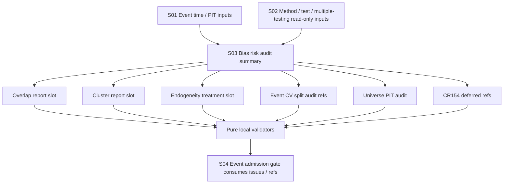

# LLD: CR153-S03 — Cluster, Endogeneity, CV and Universe PIT Audit Slots

> 本 LLD 仅定义 CR153 first-wave 的 bias / CV / universe PIT audit slot、状态、引用和 N/A 理由。它不实现完整 robust variance、two-way clustering、PSM / IV / matching、full CV、survivorship-free universe gate、capacity / impact / regime / reconciliation governance。

## 0. 上游设计依据

| 来源 | 路径 / ID | 被本 LLD 消费的内容 |
|---|---|---|
| CP5 context | `process/context/CP5-CR153-EVENT-DRIVEN-STRATEGY-E2E-CONTEXT.yaml` | S03 owner scope、shared field partition、local/static/fixture-only authorization boundary、CP5-FOCUS-CR153-005。 |
| Story card | `process/stories/CR153-S03-event-bias-risk-audit-slots.md` | Acceptance Criteria、File Ownership、full-lld 要求、只拥有 overlap / cluster / endogeneity / event CV / universe PIT 字段。 |
| HLD | `process/docs/design/HLD-EVENT-DRIVEN-STRATEGY-E2E-FRAMEWORK.md` | EV-GAP-3 / 4 / 8 / 9 覆盖方式、CR154 dependency、no feed / no runtime / no store 边界。 |
| ADR | `process/docs/design/ARCHITECTURE-DECISION-EVENT-DRIVEN-STRATEGY-E2E-FRAMEWORK.md` | ADR-CR153-004 deterministic fixture-only validation；ADR-CR153-005 CR154 owns full cross-strategy reliability governance。 |
| Story backlog | `process/STORY-BACKLOG-CR153-EVENT-DRIVEN-STRATEGY-E2E.md` | S03 scope、DAG、file ownership summary、deferred limitations。 |
| Development plan | `process/DEVELOPMENT-PLAN-CR153-EVENT-DRIVEN-STRATEGY-E2E.yaml` | Wave `CR153-W3-BIAS-RISK-SLOTS`、merge order、authorization boundary、deferred later-wave list。 |
| Feature Matrix | `process/docs/design/FEATURE-DESIGN-MATRIX.md` | CR153 S03 `full-lld` policy、first-wave slot-only / later-wave boundary。 |
| CP4 result | `process/checks/CP4-CR153-STORY-DAG-PARALLEL-SAFETY.result.json` | CP4 PASS、S02/S03 field ownership partition as CP5 blocker、implementation not authorized。 |
| S01 dependency | `CR153-S01-event-research-time-pit-contracts` | Event identity, three-time semantics and PIT/revision fields consumed as upstream inputs; S03 does not redefine them. |
| S02 dependency | `CR153-S02-event-study-method-test-slots` | Method / test family / multiple-testing fields consumed as read-only inputs; S03 does not redefine them. |

## 1. Goal

Define event bias and reliability audit slots in `engine/event_strategy_contracts.py` plus static fixture validation in `tests/research/test_event_driven_strategy_e2e_contracts.py`, so overlap / cluster / endogeneity, event CV split audit, universe PIT audit and CR154 deferred risks remain machine-visible without expanding CR153 into full reliability-governance implementation.

## 2. Requirements（Functional / Non-Functional）

### 2.1 Functional

- Define an `overlap_report_slot` that records overlap / event-window interaction evidence through `status`, refs and `n/a_reason`.
- Define a `cluster_report_slot` that records issuer / entity / date / event-type clustering evidence through `status`, refs and `n/a_reason`.
- Define an `endogeneity_treatment_slot` that records self-selection / endogenous event treatment evidence through `status`, refs and `n/a_reason`.
- Define `event_cv_split_audit_refs` for walk-forward / OOS / purged-embargo evidence references, while full event CV governance remains deferred to CR154.
- Define `universe_pit_audit` for survivorship-free universe evidence visibility, while full survivorship gate remains deferred to CR154.
- Define deferred reliability refs for `capacity`, `impact`, `regime` and `reconciliation`, each carrying status, ref and N/A / deferred reason.
- Preserve S02 method / test family / multiple-testing fields as read-only inputs; S03 must not redefine or mutate them.
- Provide deterministic static fixtures that prove required slots are present, missing mandatory refs fail closed or require review per slot status, and deferred CR154 risks cannot be silently marked complete.

### 2.2 Non-Functional

- Local/static/fixture-only. No real feed, listener, lake, NAS, provider, credential, store, catalog, registry, runtime, broker or order-flow operation is authorized.
- Slot validation must be deterministic and JSON-serializable; no stochastic resampling, no external statistics library and no real data dependency.
- Slot statuses must be explicit and machine-readable: `present`, `not_applicable`, `deferred_cr154`, `needs_review`, `blocked`.
- Missing required evidence must not be represented as PASS-equivalent; it must produce `blocked` or `needs_review`.
- Design must be compatible with S04 event admission gate aggregation without implying feed, runtime, paper, live, broker or trading readiness.

## 3. 模块拆分与职责

| 模块 / 文件组 | 职责 | 说明 |
|---|---|---|
| `engine/event_strategy_contracts.py` | Define S03 slot data contracts, status semantics and pure validators for bias / CV / universe PIT audit refs. | Shared with S02, but field ownership is partitioned. S02 fields are read-only inputs for S03. |
| `tests/research/test_event_driven_strategy_e2e_contracts.py` | Add deterministic positive / negative static fixtures for S03 slots and ownership boundaries. | Shared test file; S03 test cases must not assert or redefine S02 method/test/multiple-testing schema beyond read-only fixture inputs. |
| S04 event gate consumer | Consume S03 slot summaries as evidence inputs for event admission gate status. | S04 owns aggregation and package linkage; S03 only exposes slot status and refs. |
| CR154 follow-up governance | Own full CV, survivorship, capacity, impact, regime and reconciliation implementation. | S03 emits deferred refs and reasons only. |

### Shared Field Partition

| Shared surface | S02 owned fields | S03 owned fields | S03 rule |
|---|---|---|---|
| `engine/event_strategy_contracts.py` | `EventStudyMethodSpec`, `estimation_window`, `event_window`, `normal_return_model`, `return_horizon`, CAR / BHAR / calendar-time method slots. | `overlap_report_slot`, `cluster_report_slot`, `endogeneity_treatment_slot`, `event_cv_split_audit_refs`, `universe_pit_audit`, `capacity_deferred_ref`, `impact_deferred_ref`, `regime_deferred_ref`, `reconciliation_deferred_ref`. | Treat S02 method fields as read-only constructor / validator inputs when needed for consistency checks; do not redefine types or validation rules. |
| `engine/event_strategy_contracts.py` | `EventStudyTestReport` test family slots, `multiple_testing_or_data_snooping_slot`, `family_id`, `tested_window_count`, `correction_method`, `adjusted_p_value`. | Bias / CV / universe PIT audit slots and CR154 deferred refs only. | S03 validators may check that S02 report ref exists as an upstream evidence ref, but must not inspect or change correction algorithms. |
| `tests/research/test_event_driven_strategy_e2e_contracts.py` | Positive / negative fixtures for method, test family and multiple-testing fields. | Positive / negative fixtures for overlap, cluster, endogeneity, CV split refs, universe PIT audit and deferred refs. | S03 tests may include minimal S02 fixture values to build a complete event study fixture, but assertions must target S03-owned fields only. |

## 4. 代码结构与文件影响范围

| 动作 | 文件路径 | 变更内容 |
|---|---|---|
| 修改 | `engine/event_strategy_contracts.py` | Add S03 slot constants / dataclasses or typed mappings for bias, event CV, universe PIT and CR154 deferred refs; add pure validators for required `status`, refs and `n/a_reason` semantics. |
| 修改 | `tests/research/test_event_driven_strategy_e2e_contracts.py` | Add static S03 fixtures and tests for complete slot evidence, missing refs, N/A reason, deferred CR154 reason and S02 read-only field partition. |

No source implementation is authorized until CP5 approves the full CR153 design evidence batch. This LLD only specifies future implementation shape.

## 5. 数据模型与持久化设计

No persistence is introduced. All objects are in-memory contracts or JSON-safe mappings used by local static fixtures.

| 对象 / 字段 | 类型 | 约束 | 说明 |
|---|---|---|---|
| `EventAuditSlotStatus` | str enum / constants | Allowed values: `present`, `not_applicable`, `deferred_cr154`, `needs_review`, `blocked`. | Local status vocabulary for S03 slot validation. S04 may map these into admission `PASS / FAIL / NEEDS_REVIEW / BLOCKED`. |
| `EventEvidenceRef` | dataclass or mapping | `ref_id`, `kind`, `path_or_id`, `description` required; no real provider / lake / store path required. | Static reference only; not a store/catalog/registry pointer. |
| `EventBiasAuditSlot` | dataclass or mapping | `slot_name`, `status`, `evidence_refs`, `n_a_reason`, `deferred_to`, `limitations` fields. | Generic shape for overlap, cluster and endogeneity slots. |
| `overlap_report_slot` | `EventBiasAuditSlot` | `status=present` requires at least one `evidence_ref`; `status=not_applicable` requires `n_a_reason`; `status=deferred_cr154` requires `deferred_to=CR154`. | Represents event-window overlap evidence visibility, not variance correction implementation. |
| `cluster_report_slot` | `EventBiasAuditSlot` | Same base constraints; may include `cluster_dimensions` such as entity, date, event type. | Represents cluster evidence visibility, not cluster robust variance or two-way clustering implementation. |
| `endogeneity_treatment_slot` | `EventBiasAuditSlot` | Same base constraints; may include `treatment_family` values like `documented_n_a`, `deferred_matching`, `deferred_iv`, `deferred_psm`, `deferred_heckman`. | Represents self-selection treatment visibility, not PSM / IV / matching / Heckman algorithm implementation. |
| `EventCVSplitAuditRefs` | dataclass or mapping | `status`, `split_audit_refs`, `n_a_reason`, `deferred_to`, `limitations`. | Records refs for walk-forward / OOS / purged-embargo evidence; full event CV governance deferred. |
| `UniversePITAuditSlot` | dataclass or mapping | `status`, `universe_snapshot_refs`, `pit_policy_ref`, `n_a_reason`, `deferred_to`, `limitations`. | Records survivorship-free universe evidence visibility; full survivorship gate deferred. |
| `EventReliabilityDeferredRef` | dataclass or mapping | `risk_area`, `status=deferred_cr154`, `deferred_to`, `n_a_reason`, `follow_up_ref`. | Used for capacity, impact, regime and reconciliation deferred refs. |
| `EventBiasRiskAuditSummary` | dataclass or mapping | Includes all S03 slots plus `issues` and `operation_counts`. | Optional aggregate summary consumed by S04; no admission status ownership. |
| `operation_counts` | mapping | forbidden operation counters must be zero. | Counters cover feed/listener/lake/NAS/provider/runtime/broker/store/catalog/registry/order operations. |

## 6. API / Interface 设计

| 接口 / 入口 | 输入 | 输出 | 调用方 | 说明 |
|---|---|---|---|---|
| `validate_event_bias_audit_slot(slot)` | one `EventBiasAuditSlot` or mapping | tuple/list of validation issues | S03 tests, S04 precheck | Validates status/ref/n_a/deferred semantics for overlap, cluster or endogeneity slots. |
| `validate_event_cv_split_audit_refs(audit_refs)` | `EventCVSplitAuditRefs` or mapping | tuple/list of validation issues | S03 tests, S04 precheck | Validates split audit refs are explicit or deferred/N/A reason is present. Does not run full CV. |
| `validate_universe_pit_audit(audit)` | `UniversePITAuditSlot` or mapping | tuple/list of validation issues | S03 tests, S04 precheck | Validates universe PIT evidence visibility. Does not prove survivorship-free universe completion. |
| `validate_event_reliability_deferred_refs(refs)` | list of `EventReliabilityDeferredRef` | tuple/list of validation issues | S03 tests, S04 precheck, S05 wording | Ensures capacity / impact / regime / reconciliation remain visible as CR154 deferred refs. |
| `validate_event_bias_risk_audit_summary(summary)` | S03 summary with slots and counters | tuple/list of validation issues | S04 gate evaluator | Ensures all S03-owned slot families are present and forbidden counters are zero. |

Each interface above must be covered in §10 tests. These interfaces are pure local validators; they must not perform network, filesystem lake/NAS, provider, catalog, registry, runtime, broker or credential operations.

## 7. 核心处理流程

1. S01 provides event identity, time semantics and PIT/revision fields as already-frozen upstream inputs.
2. S02 provides method / test family / multiple-testing evidence as read-only upstream inputs.
3. S03 builds overlap, cluster and endogeneity slots with explicit `status`, `evidence_refs`, `n_a_reason`, `deferred_to` and `limitations`.
4. S03 builds `event_cv_split_audit_refs` with split evidence refs or explicit CR154 deferred / N/A reason.
5. S03 builds `universe_pit_audit` with universe snapshot / PIT policy refs or explicit CR154 deferred / N/A reason.
6. S03 builds capacity / impact / regime / reconciliation deferred refs with `status=deferred_cr154`.
7. Validators classify missing slot families or invalid status/ref combinations as issues:
   - missing mandatory slot family: `blocked`
   - `present` without refs: `blocked`
   - `not_applicable` without `n_a_reason`: `blocked`
   - `deferred_cr154` without `deferred_to=CR154` and follow-up reason: `blocked`
   - complete but review-only evidence: `needs_review`
8. S04 consumes S03 validation issues and summary refs when aggregating event gate status. S03 does not set event admission PASS/FAIL.



## 8. 技术设计细节

- Status/ref rule:
  - `present` requires one or more local static evidence refs.
  - `not_applicable` requires a concrete `n_a_reason`.
  - `deferred_cr154` requires `deferred_to="CR154"` plus a reason that states which full governance work is deferred.
  - `needs_review` requires a reason and evidence refs or limitations explaining why human / later design review is needed.
  - `blocked` is emitted by validators when required slot families or status/ref combinations are incomplete.
- Overlap / cluster boundary:
  - Store event-overlap and cluster-evidence visibility only.
  - Do not implement cluster robust variance, two-way clustering, bootstrap variance, event-window covariance estimation or any full statistical correction.
- Endogeneity boundary:
  - Store self-selection treatment status and refs only.
  - Do not implement PSM, IV, matching, Heckman, RDD or causal inference estimators.
- Event CV boundary:
  - Store split audit refs only.
  - Do not generate folds, run walk-forward, run OOS, run purged-embargo CV or calculate PBO / DSR.
- Universe PIT boundary:
  - Store universe PIT audit refs only.
  - Do not reconstruct survivorship-free universe history or enforce a full survivorship gate.
- Deferred refs:
  - Capacity, impact, regime and reconciliation must be represented as `deferred_cr154` unless a future CP5-approved Story changes ownership.
  - A deferred ref is not an N/A dismissal; it is a visible residual-risk handoff.
- S02 read-only contract:
  - S03 may accept S02 method/test/multiple-testing identifiers as contextual refs.
  - S03 must not redefine `EventStudyMethodSpec`, `EventStudyTestReport`, `multiple_testing_or_data_snooping_slot`, correction method fields or p-value fields.
- JSON safety:
  - Use primitive strings, lists and mappings or dataclasses that serialize cleanly.
  - Evidence refs must not require opening real files outside repo fixture scope.

## 9. 安全与性能设计

| 维度 | 设计措施 | 验证方式 |
|---|---|---|
| Runtime safety | Validators are pure local/static functions and only inspect passed mappings / dataclasses. | Tests assert forbidden operation counters remain zero and no runtime-ready wording appears in S03 assertions. |
| Data safety | No real lake, NAS, provider, feed, listener, credential, store, catalog or registry access. | Static tests use inline fixtures only. |
| Trading safety | S03 slots cannot create signal, target, order intent, broker request or order flow. | Test fixture includes broker/order counters at zero; any nonzero counter yields blocked issue. |
| Scope safety | Deferred CR154 risks must remain visible and cannot be silently omitted. | Tests require capacity / impact / regime / reconciliation deferred refs. |
| Performance | Slot validators operate on small lists and mappings; expected complexity is O(n) over slot/ref count. | Unit tests use small deterministic fixtures. |
| Determinism | No random split generation, resampling, external framework or clock-dependent behavior. | Fixture assertions are stable and require explicit timestamp / ref strings. |

## 10. 测试设计

| 测试场景 | 前置条件 | 操作 | 预期结果 | 验证方式 |
|---|---|---|---|---|
| Complete S03 audit slots pass structural validation | Static fixture includes overlap, cluster, endogeneity, CV split refs, universe PIT audit and CR154 deferred refs. | Call `validate_event_bias_risk_audit_summary`. | No `blocked` issue; all S03 slot families are present. | `uv run --python 3.11 pytest -q tests/research/test_event_driven_strategy_e2e_contracts.py` |
| `present` overlap slot without refs is blocked | `overlap_report_slot.status=present`, `evidence_refs=[]`. | Call `validate_event_bias_audit_slot`. | Issue severity/status `blocked`; message identifies missing refs. | pytest |
| Cluster slot can be explicit N/A only with reason | `cluster_report_slot.status=not_applicable`. | Validate with and without `n_a_reason`. | Missing reason blocked; concrete reason accepted structurally. | pytest |
| Endogeneity algorithm remains deferred | `endogeneity_treatment_slot.status=deferred_cr154`, reason names PSM / IV / matching as later work. | Call `validate_event_bias_audit_slot`. | Structural validation passes; no algorithm implementation is invoked. | pytest |
| Event CV stores split audit refs only | Fixture includes `event_cv_split_audit_refs` with static refs. | Call `validate_event_cv_split_audit_refs`. | Refs accepted; no fold generation or CV run occurs. | pytest |
| Missing event CV ref requires N/A or CR154 deferred reason | `event_cv_split_audit_refs` has no refs and no reason. | Call validator. | Blocked issue. | pytest |
| Universe PIT audit visible but not complete gate | Fixture includes `universe_pit_audit.status=deferred_cr154`. | Call `validate_universe_pit_audit`. | Validation requires `deferred_to=CR154` and limitation text; does not claim survivorship-free gate completion. | pytest |
| Deferred risk refs cannot be omitted | Summary omits capacity / impact / regime / reconciliation refs. | Call `validate_event_reliability_deferred_refs`. | Blocked issue for each omitted risk area. | pytest |
| S02 fields remain read-only | Fixture includes minimal S02 method/test/multiple-testing fields. | Run S03 validators. | S03 assertions only inspect S03-owned slots and do not redefine S02 schema. | pytest |
| Forbidden operation counter nonzero blocks summary | Fixture sets provider / feed / broker / registry counter > 0. | Call `validate_event_bias_risk_audit_summary`. | Blocked issue; no external operation is attempted. | pytest |

## 11. 实施步骤

| TASK-ID | 动作 | 目标文件 | 详细描述 | 对应测试 |
|---|---|---|---|---|
| CR153-S03-T01 | 修改 | `engine/event_strategy_contracts.py` | Add `EventAuditSlotStatus`, evidence-ref shape and generic bias audit slot contract for overlap, cluster and endogeneity. | Complete slots, present-without-ref, N/A reason tests. |
| CR153-S03-T02 | 修改 | `engine/event_strategy_contracts.py` | Add `EventCVSplitAuditRefs`, `UniversePITAuditSlot` and `EventReliabilityDeferredRef` contracts. | CV ref, universe PIT and deferred risk tests. |
| CR153-S03-T03 | 修改 | `engine/event_strategy_contracts.py` | Add pure validators for bias slots, CV refs, universe PIT audit, deferred refs and aggregate S03 summary; ensure forbidden operation counters block. | Validator and forbidden counter tests. |
| CR153-S03-T04 | 修改 | `tests/research/test_event_driven_strategy_e2e_contracts.py` | Add positive S03 static fixture that includes read-only S02 context fields and all S03 slot families. | Complete slots and S02 read-only tests. |
| CR153-S03-T05 | 修改 | `tests/research/test_event_driven_strategy_e2e_contracts.py` | Add negative fixtures for missing refs, missing N/A reason, omitted deferred refs and nonzero forbidden counters. | Negative validation tests. |

Every TASK-ID maps to S03-owned fields only. Any implementation need to modify S02 method/test/multiple-testing contracts must stop and return to CP5 design review because it violates the field partition.

## 12. 风险、难点与预研建议

### 12.1 实现灰区与取舍记录

| Clarification ID | 问题 | 选项与推荐 | 决策 / 答案 | 影响面 | 证据 | 重访条件 |
|---|---|---|---|---|---|---|
| N/A | 是否需要向用户澄清 S03 是否实现 full CV、survivorship、cluster robust variance 或 PSM / IV？ | 推荐：不提问，按 CP3 / CP4 已确认边界处理为 slot/status/ref/n/a reason only。备选：扩大 CR153 实现完整治理，但需新 CR / 重新 CP5。 | 已由 CP3 / CP4 证据解决：完整治理归 CR154 或后续 CR。 | 接口 / 文件 owner / 测试 / 安全 / 跨 Story 契约。 | HLD §3 / §11 / §14、ADR-CR153-005、Development Plan `deferred_later_wave`、CP4 result CP4-CR153-07。 | 若用户要求 CR153 直接证明生产级 reliability 或真实 event E2E，必须创建 CR 或回到 CP2/CP3。 |

| 风险 / 难点 | 影响 | 缓解措施 / 预研建议 |
|---|---|---|
| Slot presence 被误读为完整统计治理 | CP7/CP8 可能错误宣称 full CV、survivorship-free universe 或 cluster robust variance 已完成。 | 字段命名、status 和 release wording 必须包含 `deferred_cr154` / limitation；S05 消费该限制。 |
| S02/S03 共享文件导致字段 ownership 混淆 | 实现可能重复定义 method/test/multiple-testing 或 bias fields。 | 本 LLD §3 固化 shared field partition；S03 tests 只断言 S03 fields；任何 S02 schema 修改需停回 CP5。 |
| `not_applicable` 被滥用为跳过风险 | 已知 EV-GAP 风险可能不可见。 | `not_applicable` 必须有具体 `n_a_reason`；无理由 blocked；capacity / impact / regime / reconciliation 默认使用 `deferred_cr154` 而不是 N/A。 |
| Deferred refs 缺 follow-up target | CR154 handoff 不可追踪。 | `deferred_to=CR154` 和 `follow_up_ref` / reason 为必填；测试覆盖缺失场景。 |
| Forbidden operation counters 被遗漏 | 静态验证可能被误扩展为真实 feed/runtime 验证。 | S03 summary 必须携带或消费 forbidden operation counters；非零计数 blocked。 |

### OPEN / Spike 跟踪

| ID | 类型（OPEN / Spike） | 问题 | 下一动作 | 责任方 |
|---|---|---|---|---|
| N/A | OPEN | 无阻断 OPEN / Spike。 | N/A | N/A |

## 13. 回滚与发布策略

- 发布方式：随 CR153 CP5 统一设计证据确认后进入后续 CP6 实现；CP6 仅允许本地静态源码与 fixture 测试变更。
- 回滚触发条件：
  - CP5 认为 S02/S03 field ownership 仍重叠。
  - CP6 发现实现必须重定义 S02 method/test/multiple-testing 字段。
  - CP6 发现需要真实 feed/listener/lake/NAS/provider/runtime/broker/store/catalog/registry/order-flow 操作。
  - CP7 发现 slot wording 被误读为完整 CR154 governance。
- 回滚动作：
  - 移除 S03 新增 slot contracts / validators / tests。
  - 保留 S02 method/test/multiple-testing contracts 不变。
  - 不执行数据迁移、store cleanup、catalog rollback、registry rollback或 runtime cleanup，因为 S03 不引入持久化或外部操作。
- 后续发布声明：S03 只能声明 static fixture contract semantics；不能声明 real event feed、real alpha、production readiness、full reliability readiness 或 trading readiness。

## 14. Definition of Done

- [ ] `engine/event_strategy_contracts.py` 中 S03-owned overlap / cluster / endogeneity slots 存在，并包含 `status`、refs、`n_a_reason` / deferred reason。
- [ ] `event_cv_split_audit_refs` 存在，并只记录 split audit refs；未实现 full walk-forward / OOS / purged-embargo CV governance。
- [ ] `universe_pit_audit` 存在，并只记录 universe PIT audit refs；未声明 survivorship-free universe gate 完成。
- [ ] Capacity / impact / regime / reconciliation 以 CR154 deferred refs 形式可机器读取，不能被静默省略或标记完成。
- [ ] S03 validators 对 missing refs、missing N/A reason、missing deferred refs 和 nonzero forbidden operation counters 产生 blocked issue。
- [ ] `tests/research/test_event_driven_strategy_e2e_contracts.py` 覆盖 positive fixture、negative fixture、S02 read-only partition 和 no-real-operation counters。
- [ ] S03 实现未修改、重定义或拥有 S02 的 `EventStudyMethodSpec`、test family slots、`multiple_testing_or_data_snooping_slot`、`family_id`、`tested_window_count`、`correction_method`、`adjusted_p_value`。
- [ ] 所有验证均为 local/static/fixture-only；无真实 feed/listener/lake/NAS/provider/runtime/broker/credential/store/catalog/registry/order-flow 依赖。
- [ ] S04 可消费 S03 summary / issues / refs，但 admission gate status aggregation 仍由 S04 拥有。
- [ ] CP5 人工确认前不进入实现；`confirmed=false` 时本 LLD 仅作为待审设计证据。

## 人工确认区

> **CP5 — Story 设计证据可实现性门**
> host-orchestrator 收齐 CR153 全部目标 Story 的 LLD / technical-note、CP5 自动预检和 CP5 batch checkpoint 后，统一发起人工确认。当前 LLD 不单独授权实现。

**CP5 checklist 摘要**：

| # | 检查项 | 状态 | 证据 |
|---|---|---|---|
| 1 | LLD 覆盖 S03 AC | 待检查 | 第 2 / 5 / 10 / 14 节 |
| 2 | 与 HLD / ADR 的 slot-only、CR154 deferred、fixture-only 边界一致 | 待检查 | 第 0 / 8 / 9 / 12 节 |
| 3 | 文件影响范围明确且不越过 S03 owner | 待检查 | 第 3 / 4 / 11 节 |
| 4 | S02/S03 shared field partition 明确 | 待检查 | 第 3 节 shared field partition、第 10 节 S02 read-only test |
| 5 | 接口契约完整且测试可追踪 | 待检查 | 第 6 / 10 节 |
| 6 | clarification queue 无阻断项 | 待检查 | 第 12.1 节 |

**人工确认回复**：

请直接回复以下任一整行：

```text
approve
修改: <具体修改点>
reject
```

- `approve`：LLD 设计合理，允许在 CR153 全量 CP5 通过、依赖门控与文件所有权满足后进入实现。
- `修改: <具体修改点>`：指出具体修改点后由 meta-dev 更新重提。
- `reject`：设计方向有根本问题，需重新设计。

**人工审查结果回填**：

- 结论：`pending`
- 审查人：
- 审查时间：
- 修改意见：
- 风险接受项：
