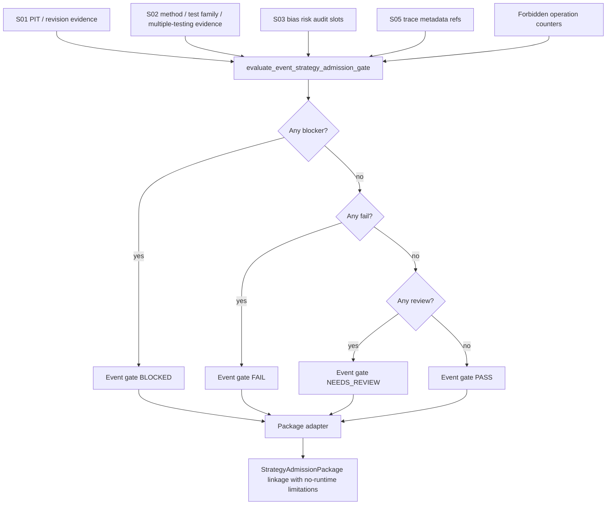

# LLD: CR153-S04 — Event Admission Gate and Shared Status Adapter

> 本 LLD 只定义 CR153 事件驱动策略 first-wave 的 local/static/fixture-only admission gate 与 package linkage。它不授权真实 event feed、listener、lake、NAS、provider、runtime、broker、credential、store、catalog、registry 或 order flow。Event gate `PASS` 只表示静态事件证据链满足本 Story 的合同条件，绝不等于 feed/runtime/paper/live/broker/trading readiness。

## 0. 上游设计依据

| 来源 | 路径 / ID | 被本 LLD 消费的内容 |
|---|---|---|
| CP5 Context | `process/context/CP5-CR153-EVENT-DRIVEN-STRATEGY-E2E-CONTEXT.yaml` | S04 owner scope、CP5 attention item、local/static/fixture-only 授权边界、S01-S03 依赖和输出路径。 |
| Story | `process/stories/CR153-S04-event-admission-gate-adapter.md` | 目标、验收标准、文件所有权、依赖 Story、full-lld 要求和 no-runtime 声明。 |
| HLD | `process/docs/design/HLD-EVENT-DRIVEN-STRATEGY-E2E-FRAMEWORK.md` | Event-specific admission gate、shared four-state adapter、StrategyAdmissionPackage linkage、forbidden operation counters、metadata no-store/no-runtime 边界。 |
| ADR | `process/docs/design/ARCHITECTURE-DECISION-EVENT-DRIVEN-STRATEGY-E2E-FRAMEWORK.md` | ADR-CR153-001 event-specific gate + shared adapter；ADR-CR153-002 metadata is not store/catalog/registry；ADR-CR153-004 deterministic fixture-only validation。 |
| Story Backlog | `process/STORY-BACKLOG-CR153-EVENT-DRIVEN-STRATEGY-E2E.md` | S04 Wave、DAG、acceptance criteria、file ownership、S05 downstream dependency。 |
| Development Plan | `process/DEVELOPMENT-PLAN-CR153-EVENT-DRIVEN-STRATEGY-E2E.yaml` | `CR153-W4-EVENT-GATE` entry conditions、primary files、merge order、validation command and forbidden operations。 |
| Existing package source | `engine/strategy_admission_package.py` | `AdmissionStatus` package semantics、blocked reasons、not-authorized counters、CR151/CR152 attach helper pattern。 |
| CR151 gate source | `engine/strategy_admission_statistical_gate.py` | `PASS / FAIL / NEEDS_REVIEW / BLOCKED` gate status style and forbidden counter fail-closed pattern。 |
| CR152 gate source | `engine/ml_strategy_admission_gate.py` | Gate summary fields: `gate_present`、`gate_required`、`gate_status`、`gate_ref`、`blocked_reasons`、`needs_review_reasons`、`evidence_refs`、`operation_counts`。 |
| CR152 LLD shape | `process/stories/CR152-S04-ml-admission-gate-adapter-LLD.md` | shared adapter / package linkage 章节形态；本 LLD 扩展为事件证据和 CR153 safety 边界。 |

## 1. Goal

创建 `EventStrategyAdmissionGate` 及其 shared status adapter，聚合 S01-S03 事件证据、trace evidence 和 forbidden operation counters，将事件 gate 的 `PASS / FAIL / NEEDS_REVIEW / BLOCKED` 四态安全连接到 `StrategyAdmissionPackage`，并明确 event gate `PASS` 只表示本地静态证据链通过，不构成真实 feed、runtime、paper、live、broker 或交易 readiness。

## 2. Requirements（Functional / Non-Functional）

### 2.1 Functional

- 定义事件专用 `EventAdmissionGateStatus`，值域固定为 `PASS`、`FAIL`、`NEEDS_REVIEW`、`BLOCKED`，不得新增同义拼写。
- 定义 `EventAdmissionGateIssue`，承载 `code`、`message`、`source`、`field`、`severity`、`evidence_ref`、`unlock_condition`。
- 定义 `EventStrategyAdmissionGate`，输出事件 gate summary：`status`、`gate_present`、`gate_required`、`gate_ref`、`blocked_reasons`、`needs_review_reasons`、`evidence_refs`、`operation_counts`、`limitations`。
- 定义 `evaluate_event_strategy_admission_gate(...)` 纯函数，输入 S01 PIT/revision、S02 method/test/multiple-testing、S03 bias risk audit、S05 trace metadata refs 和 operation counters，输出 `EventStrategyAdmissionGate`。
- 缺少 mandatory PIT、method、test family、multiple-testing 或 trace evidence 必须返回 `BLOCKED`。
- 任一 forbidden operation counter 非 0 必须返回 `BLOCKED`；无法转换为整数的 counter 值按违规处理。
- 已有证据完整但出现明确语义失败时返回 `FAIL`，例如 event study status 明确失败、trace status 明确失败或上游 slot 以 `severity=fail` 报告失败。
- 证据完整但存在需要人工复核且不属于 blocker/fail 的风险时返回 `NEEDS_REVIEW`，例如 cluster/endogeneity/CV/universe slot 只有 review limitation 且带有 evidence/ref/n/a reason。
- 全部 mandatory evidence 完整、forbidden counters 均为 0、无 fail/review issue 时返回 `PASS`。
- 定义 `event_gate_summary(...)` 或等价 `to_dict()` 输出，稳定暴露 `gate_present`、`gate_required`、`gate_status`、`gate_ref`、`blocked_reasons`。
- 在 `engine/strategy_admission_package.py` 中新增 event gate package linkage helper，复用 CR151/CR152 adapter 风格，写入 `event_gate_summary`、`event_gate_present`、`event_gate_required`、`event_gate_status`、`event_gate_ref`、`event_gate_blocked_reasons` 和 evidence refs。
- Event gate adapter 必须把 `NEEDS_REVIEW` 映射为 package 层 `AdmissionStatus.WARN`，未知状态必须 fail-closed 映射为 `AdmissionStatus.BLOCKED`。
- Package linkage 不得修改 `not_qmt_authorization`、`not_simulation_authorization`、`not_live_authorization`、`not_broker_order` 等 runtime authorization flags。
- Package linkage 必须保留和追加 `blocked_claims` / `limitations`，明确 `event_gate_pass_not_runtime_ready`、`no_real_event_feed`、`no_event_store_or_registry_publication`。

### 2.2 Non-Functional

- 所有 S04 逻辑必须是 local/static/fixture-only；不得读取真实 lake、NAS、provider、credential、catalog current truth 或 event feed。
- 不得启动 listener、runtime、QMT/MiniQMT/xtquant/gateway、simulation、paper、live、broker 或 order flow。
- 不得写 event store、feature store、label store、prediction store、model store、model registry、catalog pointer 或任何 production current truth。
- Gate evaluation 必须是确定性纯 metadata evaluation：相同输入产生相同状态、相同 issue 顺序和相同 evidence refs。
- 状态优先级必须固定：`BLOCKED > FAIL > NEEDS_REVIEW > PASS`。
- Event gate schema 独立于 CR151 statistical report schema 和 CR152 ML report schema；只复用 shared status semantics 和 package adapter pattern。
- 错误暴露必须 machine-visible：缺字段、非 0 counter、未知 status、未授权 claim 都需要结构化 issue，而不是仅写文本 limitation。
- 性能目标为 O(n) 扫描 evidence items / counters；不引入网络、磁盘扫描或大数据处理。

## 3. 模块拆分与职责

| 模块 / 文件组 | 职责 | 说明 |
|---|---|---|
| `engine/event_strategy_admission_gate.py` | 新增事件 gate status、issue、gate dataclass、counter normalizer、evidence validator、四态 evaluator 和 summary helper。 | S04 主产物；不包含 S01-S03 领域对象定义，只消费它们的 mapping / dataclass `to_dict()` 输出。 |
| `engine/strategy_admission_package.py` | 新增 event gate -> package linkage helper 和 event status -> `AdmissionStatus` adapter。 | 复用 CR151/CR152 attach helper 模式；不得改写 package builder 的 runtime authorization 语义。 |
| `tests/research/test_event_driven_strategy_e2e_contracts.py` | 新增 S04 fixture tests：四态、缺 mandatory evidence、forbidden counters、package linkage、PASS claim boundary。 | 该测试文件由 CR153 多 Story 共享；S04 只拥有 event gate / adapter / package linkage 断言。 |
| S01 evidence inputs | `EventRevisionPITGate` / event PIT summary。 | S04 只消费 `status`、`gate_ref`、`evidence_refs`、`blocked_reasons`、`needs_review_reasons`；不重新定义 time/PIT 字段。 |
| S02 evidence inputs | `EventStudyMethodSpec` / `EventStudyTestReport` / `multiple_testing_or_data_snooping_slot` summary。 | S04 只检查 mandatory presence 和 status/issue，不实现 Patell/BMP/bootstrap/White/Hansen/PBO/DSR 算法。 |
| S03 evidence inputs | overlap、cluster、endogeneity、event CV split audit、universe PIT audit summaries。 | S04 只消费风险 slot status/refs/n/a reason；完整 CV/survivorship/capacity governance 仍属 CR154/deferred。 |
| S05 trace metadata inputs | event -> signal -> target/order-intent trace refs。 | S04 gate 必须要求 trace evidence 存在；不创建真实 order flow。 |

## 4. 代码结构与文件影响范围

| 动作 | 文件路径 | 变更内容 |
|---|---|---|
| 创建 | `engine/event_strategy_admission_gate.py` | 新增 `EVENT_ADMISSION_GATE_SCHEMA`、`EVENT_FORBIDDEN_OPERATION_COUNTERS`、`EventAdmissionGateStatus`、`EventAdmissionGateIssue`、`EventStrategyAdmissionGate`、`evaluate_event_strategy_admission_gate()`、`event_gate_summary()`、counter/evidence helper。 |
| 修改 | `engine/strategy_admission_package.py` | 新增 `MF_ADMISSION_EVENT_GATE_BLOCKED` 或等价 reason code、`map_event_gate_status_to_admission_status()`、`attach_event_gate_to_admission_package()`、event gate refs helper；不得改变既有 builder 默认 runtime flags。 |
| 修改 | `tests/research/test_event_driven_strategy_e2e_contracts.py` | 新增 S04 测试：`PASS` fixture、missing PIT/method/test family/multiple-testing/trace -> `BLOCKED`、forbidden counter -> `BLOCKED`、semantic fail -> `FAIL`、review limitation -> `NEEDS_REVIEW`、package linkage 和 no-runtime claims。 |

本 Story 不修改 `engine/event_strategy_contracts.py` 中 S01-S03 字段所有权；如 CP6 发现 S01-S03 输入对象尚未提供所需 summary 字段，只能通过 mapping 消费既有字段或停止回到 CP5，不得在 S04 范围内重定义上游字段。

## 5. 数据模型与持久化设计

无新增持久化、无数据库、无 event store、无 catalog / registry 写入。所有对象都是 Python metadata contract / dataclass / mapping，用于本地 fixture 和静态验证。

| 对象 / 字段 | 类型 | 约束 | 说明 |
|---|---|---|---|
| `EVENT_ADMISSION_GATE_SCHEMA` | `str` | 固定值建议 `event_strategy_admission_gate_v1` | 用于 summary/schema 断言。 |
| `EventAdmissionGateStatus` | `str Enum` | `PASS`、`FAIL`、`NEEDS_REVIEW`、`BLOCKED` | Event gate 层四态；package 层仍使用 `AdmissionStatus`。 |
| `EventAdmissionGateIssue.code` | `str` | 非空；稳定 snake_case | 示例：`event_gate_pit_evidence_missing`、`event_gate_forbidden_operation_nonzero`。 |
| `EventAdmissionGateIssue.severity` | `str` | `blocker`、`fail`、`review` | `blocker -> BLOCKED`、`fail -> FAIL`、`review -> NEEDS_REVIEW`。 |
| `EventAdmissionGateIssue.source` | `str` | 非空 | `pit_gate`、`method_spec`、`test_family`、`multiple_testing_or_data_snooping_slot`、`trace_evidence`、`operation_counts` 等。 |
| `EventStrategyAdmissionGate.status` | `EventAdmissionGateStatus` | 状态优先级固定 | `BLOCKED > FAIL > NEEDS_REVIEW > PASS`。 |
| `EventStrategyAdmissionGate.gate_present` | `bool` | 默认 `True` | Package linkage 使用；缺 gate 时 adapter fail-closed。 |
| `EventStrategyAdmissionGate.gate_required` | `bool` | 默认 `True` | CR153 S04 gate 是 required gate；除非后续 CR 修改，不得设为 false 绕过。 |
| `EventStrategyAdmissionGate.gate_ref` | `str` | 推荐非空 | 可由显式参数或 evidence refs 推导为稳定引用；缺失不单独 BLOCKED，但会进入 review 或 blocked reason，按实现测试固定。 |
| `EventStrategyAdmissionGate.blocked_reasons` | `tuple[EventAdmissionGateIssue, ...]` | blocker/fail issue 可进入该列表 | 与 CR152 风格一致，`FAIL` issue 可同时进入 package blocked reason 以阻止错误声明。 |
| `EventStrategyAdmissionGate.needs_review_reasons` | `tuple[EventAdmissionGateIssue, ...]` | review issue | 不应混入 blocker。 |
| `EventStrategyAdmissionGate.evidence_refs` | `tuple[str, ...]` | 去重保序，空字符串过滤 | 收集 PIT/method/test/multiple-testing/bias/trace refs。 |
| `EventStrategyAdmissionGate.operation_counts` | `Mapping[str, int]` | 规范化为完整 counter 字段，非整数按 1 处理 | 任一值非 0 -> `BLOCKED`。 |
| `EventStrategyAdmissionGate.limitations` | `tuple[str, ...]` | 必含 no-runtime/no-feed/no-store 声明 | 即使 `PASS` 也必须保留限制。 |
| `EVENT_FORBIDDEN_OPERATION_COUNTERS` | `tuple[str, ...]` | 至少覆盖本节列出的 forbidden operations | 允许并入现有 `FORBIDDEN_OPERATION_COUNTERS`，但必须包含 event-specific 字段。 |

`EVENT_FORBIDDEN_OPERATION_COUNTERS` 必须至少包含：

- `credential_read`
- `real_lake_read`
- `real_lake_write`
- `nas_access`
- `nas_read`
- `nas_write`
- `nas_sync_or_write`
- `provider_fetch`
- `real_event_feed`
- `live_event_listener`
- `event_store_write`
- `catalog_pointer_mutation`
- `model_registry_write`
- `feature_store_write`
- `label_store_write`
- `prediction_store_write`
- `runtime_operation`
- `qmt_runtime`
- `miniqmt_runtime`
- `xtquant_runtime`
- `gateway_start`
- `simulation_or_live_run`
- `paper_trading_run`
- `broker_access`
- `account_query`
- `real_order`
- `order_submit`
- `order_cancel`
- `trading_operation`
- `external_framework_run`
- `git_remote_write`

## 6. API / Interface 设计

| 接口 / 入口 | 输入 | 输出 | 调用方 | 说明 |
|---|---|---|---|---|
| `evaluate_event_strategy_admission_gate(*, pit_gate, method_spec, test_report, multiple_testing_slot, bias_risk_audit=None, trace_evidence=None, operation_counts=None, gate_required=True, gate_ref="")` | S01-S03/S05 summary mappings 或 dataclass；counter mapping | `EventStrategyAdmissionGate` | tests；future package builder / handoff | 纯 metadata evaluation；不读文件、不查 provider、不运行 runtime。 |
| `event_gate_summary(gate)` | `EventStrategyAdmissionGate` 或 mapping | `dict[str, Any]` | package adapter；tests；evidence index writer | 输出 `schema_version`、`gate_present`、`gate_required`、`gate_status`、`status`、`gate_ref`、`blocked_reasons`、`needs_review_reasons`、`evidence_refs`、`operation_counts`、`limitations`。 |
| `validate_event_gate_operation_counters(counters)` | mapping / `None` | `tuple[EventAdmissionGateIssue, ...]` | evaluator | 规范化 forbidden counters；任何非 0 或非法值生成 blocker issue。 |
| `map_event_gate_status_to_admission_status(status)` | event gate status / str / Enum | `AdmissionStatus` | `engine/strategy_admission_package.py` | `PASS -> pass`、`FAIL -> fail`、`NEEDS_REVIEW -> warn`、`BLOCKED/unknown -> blocked`。 |
| `attach_event_gate_to_admission_package(package, event_gate_summary)` | `StrategyAdmissionPackage` 或 mapping；event summary | JSON-safe package dict | tests；future package composition | 追加 event gate fields、evidence refs、blocked reasons、limitations；不改变 runtime auth flags。 |

本节接口必须在第 10 节测试设计中逐项覆盖。接口错误模型如下：

| 条件 | Event gate status | Package status impact | 结构化暴露 |
|---|---|---|---|
| 缺 PIT / revision evidence | `BLOCKED` | 至少 `blocked` | `event_gate_pit_evidence_missing` |
| 缺 method evidence | `BLOCKED` | 至少 `blocked` | `event_gate_method_evidence_missing` |
| 缺 test family evidence | `BLOCKED` | 至少 `blocked` | `event_gate_test_family_evidence_missing` |
| 缺 multiple-testing / data-snooping slot | `BLOCKED` | 至少 `blocked` | `event_gate_multiple_testing_evidence_missing` |
| 缺 trace evidence | `BLOCKED` | 至少 `blocked` | `event_gate_trace_evidence_missing` |
| 任一 forbidden counter 非 0 | `BLOCKED` | 至少 `blocked` | `event_gate_forbidden_operation_nonzero`，field 为 counter 名 |
| 上游 status 为 `FAIL` / `failed` | `FAIL`，除非已有 blocker | 至少 `fail` | `event_gate_input_status_fail` |
| 上游 status 为 `NEEDS_REVIEW` / `review` | `NEEDS_REVIEW`，除非已有 blocker/fail | 至少 `warn` | `event_gate_input_status_needs_review` |
| 未知 status | `BLOCKED` | 至少 `blocked` | `event_gate_unknown_input_status` |

## 7. 核心处理流程

1. 调用方以显式参数传入 S01 `pit_gate`、S02 `method_spec`、S02 `test_report`、S02 `multiple_testing_slot`、S03 `bias_risk_audit`、S05 `trace_evidence` 和 `operation_counts`。
2. Evaluator 将 dataclass / mapping 统一转换为 JSON-safe mapping；转换失败或空对象保留为空 mapping，不抛出外部依赖异常。
3. Evaluator 规范化 forbidden operation counters，字段覆盖 `EVENT_FORBIDDEN_OPERATION_COUNTERS` 和输入中的额外字段；非法值按 1 处理。
4. 任一 counter 非 0 时追加 blocker issue，source 为 `operation_counts`，field 为 counter 名。
5. Evaluator 检查 mandatory evidence presence：PIT、method、test family、multiple-testing、trace evidence 缺失或空 mapping 均追加 blocker issue。
6. Evaluator 检查每个 mandatory evidence 的 status / issues：`BLOCKED` 追加 blocker，`FAIL` 追加 fail，`NEEDS_REVIEW` 追加 review，未知 status 追加 blocker。
7. Evaluator 只消费 S03 bias/risk slots 的 status/ref/issue，不要求 CR154 deferred slots 完成；缺少 S03 风险 slot 的 exact enforcement 由 S03 设计决定，若 S03 summary 标记 blocker 则 S04 保持 blocker。
8. Evaluator 收集 evidence refs：`gate_ref`、`evidence_ref`、`ref`、`report_ref`、`trace_ref`、`evidence_refs`，去重保序。
9. 状态聚合：存在 blocker -> `BLOCKED`；否则存在 fail -> `FAIL`；否则存在 review -> `NEEDS_REVIEW`；否则 `PASS`。
10. `EventStrategyAdmissionGate.to_dict()` / `event_gate_summary()` 输出四态 summary 和 limitation，始终带 no-runtime/no-feed/no-store 声明。
11. Package adapter 读取 event summary，映射到 `AdmissionStatus`，并与当前 package status 取更严重状态。
12. Package adapter 追加 `event_gate_summary`、`event_gate_present`、`event_gate_required`、`event_gate_status`、`event_gate_ref`、event evidence refs、blocked reasons 和 limitations。
13. Package adapter 若 event gate 非 `PASS`，追加 `MF_ADMISSION_EVENT_GATE_BLOCKED` 或等价 blocked reason；若 event gate `PASS`，仍追加 limitations 和 blocked claims，声明 `PASS` 不授权 runtime/trading/feed/store。
14. Package adapter 返回 JSON-safe dict，不启动任何 runtime，不写任何 store，不读取任何外部数据。



## 8. 技术设计细节

- 关键算法 / 规则：
  - 状态优先级固定为 `BLOCKED > FAIL > NEEDS_REVIEW > PASS`。
  - Mandatory evidence list 固定为 `pit_gate`、`method_spec`、`test_report.test_family` 或等价 test family summary、`multiple_testing_or_data_snooping_slot`、`trace_evidence`。
  - 缺 mandatory evidence 一律 `BLOCKED`，不得降级为 `NEEDS_REVIEW`。
  - Forbidden operation counter 非 0 一律 `BLOCKED`，不得被 evidence `PASS` 抵消。
  - Event gate `PASS` 只能说明 local/static/fixture contract semantics pass；package limitations 必须继续阻断 runtime/trading/readiness claims。
- 依赖选择与复用点：
  - 使用 `engine.serialization.json_safe` / `as_mapping` 风格进行 JSON-safe 输出；若实现时已有共享 helper 可复用，保持无副作用。
  - `engine/strategy_admission_package.py` 复用 `map_statistical_gate_status_to_admission_status()` 和 `map_ml_gate_status_to_admission_status()` 的映射习惯：`NEEDS_REVIEW -> AdmissionStatus.WARN`，unknown -> `BLOCKED`。
  - `attach_event_gate_to_admission_package()` 复用 CR151/CR152 attach helper 的模式：输入 package dict，输出 JSON-safe package dict，不修改原对象。
- 兼容性处理：
  - S01-S03 并行 LLD/实现可能使用 dataclass 或 mapping；S04 接口必须接受两者，并优先调用 `to_dict()`。
  - 若上游字段名为 `status` 或 `gate_status`，S04 都必须识别；输出必须同时包含 `status` 和 `gate_status`。
  - Package 层字段使用 event-specific 前缀，避免覆盖 CR152 的通用 `gate_status`：`event_gate_status` 是 S04 canonical linkage field；若为了兼容需要写通用 `gate_status`，不得覆盖已有 ML/statistical gate 字段。
  - `blocked_reasons` 可能是 dataclass、mapping 或字符串；S04 输出统一为 dict payload。
- 图示类型选择：本 Story 跨 event gate、package adapter 和上游 evidence summaries，已在第 7 节使用流程图。
- Package linkage 字段定义：

| 字段 | 写入位置 | 说明 |
|---|---|---|
| `event_gate_summary` | package payload top-level | 完整 event gate summary。 |
| `event_gate_present` | package payload top-level | `bool(summary.gate_present)`，缺 summary 时 false 并 BLOCKED。 |
| `event_gate_required` | package payload top-level | `bool(summary.gate_required)`，CR153 默认为 true。 |
| `event_gate_status` | package payload top-level | `PASS / FAIL / NEEDS_REVIEW / BLOCKED`。 |
| `event_gate_ref` | package payload top-level | event gate ref 或 summary ref。 |
| `event_gate_blocked_reasons` | package payload top-level | Event gate blocker/fail payloads。 |
| `evidence_refs` | existing package field | 追加 event refs，去重保序。 |
| `blocked_reasons` | existing package field | Event gate 非 PASS 时追加 package-level reason；unknown / missing summary 也追加。 |
| `limitations` | existing package field | 追加 no-feed/no-runtime/no-store/no-readiness 限制。 |

## 9. 安全与性能设计

| 维度 | 设计措施 | 验证方式 |
|---|---|---|
| 授权边界 | S04 只消费传入 metadata，不读取真实 feed/listener/lake/NAS/provider/credential/catalog/registry/runtime/broker。 | 测试只构造内存 fixture；代码审查确认无 IO / network / credential import。 |
| Runtime safety | `PASS` 不移除 `not_qmt_authorization`、`not_simulation_authorization`、`not_live_authorization`、`not_broker_order`，并追加 no-runtime limitations。 | Package linkage test 断言 runtime flags 仍为 true，blocked claims 仍包含 runtime/trading 类声明。 |
| Store/catalog safety | Forbidden counters 覆盖 event store、catalog pointer、registry、store writes；非 0 -> `BLOCKED`。 | `event_store_write=1`、`catalog_pointer_mutation=1`、`model_registry_write=1` fixture 均返回 `BLOCKED`。 |
| Credential safety | `credential_read` counter 非 0 -> `BLOCKED`；实现不得读取 `.env`。 | Counter fixture + import/code review。 |
| Determinism | 证据和 issue 统一按固定顺序扫描，refs 去重保序。 | Snapshot-style dict assertions 或精确字段断言。 |
| Error exposure | 缺 mandatory evidence、unknown status、counter violation 全部结构化 issue。 | pytest 断言 issue code/source/field。 |
| 性能 | O(n) 扫描 counters、issues 和 refs；不做文件系统递归或外部数据处理。 | 单元测试覆盖小型 fixture；无需性能基准。 |

## 10. 测试设计

| 测试场景 | 前置条件 | 操作 | 预期结果 | 验证方式 |
|---|---|---|---|---|
| `evaluate_event_strategy_admission_gate` PASS | PIT、method、test family、multiple-testing、trace evidence 完整；S03 slots 无 blocker；counters 全 0。 | 调用 evaluator。 | `status == PASS`，`gate_present=True`，`gate_required=True`，limitations 包含 no-runtime/no-feed/no-store。 | `uv run --python 3.11 pytest -q tests/research/test_event_driven_strategy_e2e_contracts.py` |
| 缺 PIT evidence | `pit_gate=None` 或空 mapping。 | 调用 evaluator。 | `status == BLOCKED`，issue code 为 `event_gate_pit_evidence_missing`。 | pytest |
| 缺 method evidence | `method_spec=None` 或空 mapping。 | 调用 evaluator。 | `status == BLOCKED`，issue code 为 `event_gate_method_evidence_missing`。 | pytest |
| 缺 test family evidence | `test_report` 缺 test family slot。 | 调用 evaluator。 | `status == BLOCKED`，issue code 为 `event_gate_test_family_evidence_missing`。 | pytest |
| 缺 multiple-testing / data-snooping slot | `multiple_testing_slot=None` 或空 mapping。 | 调用 evaluator。 | `status == BLOCKED`，issue code 为 `event_gate_multiple_testing_evidence_missing`。 | pytest |
| 缺 trace evidence | `trace_evidence=None` 或空 mapping。 | 调用 evaluator。 | `status == BLOCKED`，issue code 为 `event_gate_trace_evidence_missing`。 | pytest |
| Forbidden counter 非 0 | `provider_fetch=1` 或 `event_store_write=1` 或 `real_order=1`。 | 调用 evaluator。 | `status == BLOCKED`，issue source `operation_counts`，field 为 counter 名。 | pytest |
| 非整数 counter | counter 值为 `"bad"`。 | 调用 evaluator。 | 该 counter 按违规处理，`status == BLOCKED`。 | pytest |
| Known semantic failure | mandatory evidence 完整，但某一输入 status 为 `FAIL` 或 issue severity 为 `fail`。 | 调用 evaluator。 | 无 blocker 时 `status == FAIL`。 | pytest |
| Review-only issue | mandatory evidence 完整，只有 review severity issue。 | 调用 evaluator。 | `status == NEEDS_REVIEW`，package adapter 映射为 `AdmissionStatus.WARN`。 | pytest |
| Unknown status fail-closed | 上游输入 status 为未识别值。 | 调用 evaluator。 | `status == BLOCKED`，issue code 为 `event_gate_unknown_input_status`。 | pytest |
| Summary shape | 构造任意 gate。 | 调用 `event_gate_summary()`。 | 输出含 `schema_version`、`gate_present`、`gate_required`、`gate_status`、`status`、`gate_ref`、`blocked_reasons`、`needs_review_reasons`、`evidence_refs`、`operation_counts`。 | pytest |
| Status adapter | 分别传入四态和 unknown。 | 调用 `map_event_gate_status_to_admission_status()`。 | `PASS->pass`、`FAIL->fail`、`NEEDS_REVIEW->warn`、`BLOCKED/unknown->blocked`。 | pytest |
| Package linkage PASS 不授权 runtime | 现有 package + PASS event summary。 | 调用 `attach_event_gate_to_admission_package()`。 | `event_gate_status == PASS`，runtime flags 仍为 true，limitations 包含 no-runtime，blocked claims 不被清空。 | pytest |
| Package linkage non-PASS 降级 | 现有 package + `FAIL` / `NEEDS_REVIEW` / `BLOCKED` summary。 | 调用 adapter。 | package `admission_status` 取更严重状态；追加 event blocked reason / review limitation / refs。 | pytest |

## 11. 实施步骤

| TASK-ID | 动作 | 目标文件 | 详细描述 | 对应测试 |
|---|---|---|---|---|
| CR153-S04-T01 | 创建 | `engine/event_strategy_admission_gate.py` | 定义 schema、forbidden counters、`EventAdmissionGateStatus`、`EventAdmissionGateIssue`、`EventStrategyAdmissionGate` 和 `to_dict()` / JSON-safe helpers。 | Summary shape、PASS fixture。 |
| CR153-S04-T02 | 创建 | `engine/event_strategy_admission_gate.py` | 实现 `validate_event_gate_operation_counters()`，覆盖 event feed/listener/store/catalog/registry/runtime/broker/order/credential counters；非 0 或非法值 -> blocker issue。 | Forbidden counter 非 0、非整数 counter。 |
| CR153-S04-T03 | 创建 | `engine/event_strategy_admission_gate.py` | 实现 mandatory evidence presence/status validator，缺 PIT/method/test family/multiple-testing/trace -> `BLOCKED`；unknown status -> `BLOCKED`。 | 缺 mandatory evidence、unknown status。 |
| CR153-S04-T04 | 创建 | `engine/event_strategy_admission_gate.py` | 实现 `evaluate_event_strategy_admission_gate()` 聚合四态、收集 refs、生成 limitations。 | PASS、FAIL、NEEDS_REVIEW、BLOCKED 状态矩阵。 |
| CR153-S04-T05 | 创建 | `engine/event_strategy_admission_gate.py` | 实现 `event_gate_summary()`，兼容 dataclass 和 mapping 输入，输出稳定 package adapter payload。 | Summary shape。 |
| CR153-S04-T06 | 修改 | `engine/strategy_admission_package.py` | 新增 event gate reason code、`map_event_gate_status_to_admission_status()`、event refs helper 和 `attach_event_gate_to_admission_package()`；不得改变 builder 默认 runtime authorization flags。 | Status adapter、package linkage PASS/non-PASS。 |
| CR153-S04-T07 | 修改 | `tests/research/test_event_driven_strategy_e2e_contracts.py` | 添加 S04 gate/evaluator fixtures 和 adapter tests；只断言 S04-owned event gate/package fields，不重定义 S01-S03 owner fields。 | 全部 S04 test scenarios。 |

每个文件影响项均由至少一个 TASK 覆盖；S04 不拥有 `engine/event_strategy_contracts.py` 的 method/test/bias field 定义，不得在本 Story 中新增上游字段。

## 12. 风险、难点与预研建议

### 12.1 实现灰区与取舍记录

| Clarification ID | 问题 | 选项与推荐 | 决策 / 答案 | 影响面 | 证据 | 重访条件 |
|---|---|---|---|---|---|---|
| N/A | 当前 S04 无阻断性实现灰区。 | 推荐按 HLD/ADR 已确认的 event-specific gate + shared adapter 实施；不新增用户决策。 | 已由 CP3 HLD/ADR 和 Story AC 约束收敛。 | 接口 / 测试 / 安全 / 跨 Story 契约 | HLD ADR-CR153-001、ADR-CR153-004；Story AC；CP5 context focus item CP5-FOCUS-CR153-003。 | 若 CP6 发现 S01-S03 summary 字段无法表达 mandatory evidence 或 package adapter 会覆盖既有 gate 字段，停止并回到 CP5 设计澄清。 |

| 风险 / 难点 | 影响 | 缓解措施 / 预研建议 |
|---|---|---|
| Event gate `PASS` 被误读为 feed/runtime/trading readiness | 可能产生未授权 runtime、broker 或交易声明。 | Package adapter 必须保留 runtime authorization blockers；limitations 和 blocked claims 显式写 `event_gate_pass_not_runtime_ready`。 |
| S01-S03 evidence summary 字段尚未最终实现 | S04 evaluator 可能无法直接消费上游对象。 | S04 接口接受 mapping/dataclass，按 `status/gate_status`、refs、issues 消费；若 mandatory evidence 无法识别，fail-closed 到 `BLOCKED` 或回 CP5。 |
| `StrategyAdmissionPackage` 已存在 CR151/CR152 linkage 字段 | 直接覆盖通用 `gate_status` 可能破坏既有 gate。 | S04 使用 `event_gate_*` 前缀；通用字段只读或保持不覆盖。 |
| Unknown status 被默认 PASS | 会隐藏上游 evidence 失败。 | Unknown status 必须结构化 issue 并 `BLOCKED`。 |
| Forbidden counters 列表不完整 | 可能漏掉 event store / listener / broker 等未授权操作。 | `EVENT_FORBIDDEN_OPERATION_COUNTERS` 必须覆盖 HLD/ADR 和 development plan 的 forbidden operations；测试至少覆盖 provider、event store、broker/order、credential。 |
| S05 trace evidence 尚未实现 | S04 mandatory trace check 可能先导致 `BLOCKED`。 | 这是预期 fail-closed 行为；S05 技术说明应提供 trace metadata refs，S04 不降级。 |

### OPEN / Spike 跟踪

| ID | 类型（OPEN / Spike） | 问题 | 下一动作 | 责任方 |
|---|---|---|---|---|
| N/A | OPEN | 无阻断性 OPEN。 | N/A | N/A |

## 13. 回滚与发布策略

- 发布方式：随 CR153 CP5 批量设计证据人工确认后进入 Wave `CR153-W4-EVENT-GATE` 实现；CP6 只允许本地源码和 fixture tests，不允许真实运行验证。
- 回滚触发条件：
  - Event gate adapter 覆盖或破坏 CR151/CR152 package linkage。
  - `PASS` 输出被 package 或 release wording 解释为 feed/runtime/paper/live/broker/trading readiness。
  - Forbidden counter 非 0 未 `BLOCKED`。
  - 缺 PIT/method/test family/multiple-testing/trace evidence 未 `BLOCKED`。
- 回滚动作：
  - 删除 `engine/event_strategy_admission_gate.py`。
  - 从 `engine/strategy_admission_package.py` 移除 `attach_event_gate_to_admission_package()`、event status adapter 和 event-specific reason code / helper。
  - 从 `tests/research/test_event_driven_strategy_e2e_contracts.py` 移除 S04-only tests。
  - 不需要数据迁移、store cleanup、catalog rollback 或 registry rollback，因为本 Story 不写持久化或外部系统。

## 14. Definition of Done

- [ ] `engine/event_strategy_admission_gate.py` 存在并只做 local/static/fixture-only metadata evaluation。
- [ ] `EventAdmissionGateStatus` 固定为 `PASS / FAIL / NEEDS_REVIEW / BLOCKED`。
- [ ] `evaluate_event_strategy_admission_gate()` 对缺 PIT、method、test family、multiple-testing、trace evidence 全部返回 `BLOCKED`。
- [ ] 任一 forbidden operation counter 非 0 或非法值返回 `BLOCKED`。
- [ ] Known semantic failure 返回 `FAIL`，review-only issue 返回 `NEEDS_REVIEW`，完整静态证据返回 `PASS`。
- [ ] `event_gate_summary()` 输出 `gate_present`、`gate_required`、`gate_status`、`gate_ref`、`blocked_reasons`、`needs_review_reasons`、`evidence_refs` 和 `operation_counts`。
- [ ] `engine/strategy_admission_package.py` 新增 event gate adapter，且 `NEEDS_REVIEW -> AdmissionStatus.WARN`、unknown -> `AdmissionStatus.BLOCKED`。
- [ ] Package linkage 记录 `event_gate_present`、`event_gate_required`、`event_gate_status`、`event_gate_ref`、`event_gate_blocked_reasons`，并追加 event evidence refs。
- [ ] Package linkage 不改变 runtime authorization flags，不清除 runtime/trading/feed/store blocked claims。
- [ ] Tests 覆盖四态矩阵、mandatory evidence 缺失、forbidden counters、package linkage 和 PASS no-readiness boundary。
- [ ] 实现和测试均不读取 `.env`、credential、真实 lake/NAS/provider/feed/catalog/registry/runtime/broker，不写任何 store/catalog/registry。
- [ ] CP6 汇报明确：Event gate `PASS` 绝不等于 feed/runtime/paper/live/broker/trading readiness。

## 人工确认区

> **CP5 — Story 设计证据可实现性门**
> 本 LLD 需纳入 `process/checkpoints/CP5-CR153-EVENT-DRIVEN-STRATEGY-E2E-LLD-BATCH.md` 统一人工确认。`confirmed=false` 时不得进入实现；即使 CP5 通过，仍需满足 S01-S03 依赖、Wave 和文件所有权门控。

**CP5 checklist 摘要**：

| # | 检查项 | 状态 | 证据 |
|---|---|---|---|
| 1 | LLD 覆盖 AC | 待检查 | 第 2 / 6 / 10 / 14 节 |
| 2 | 与 HLD / ADR 一致 | 待检查 | 第 0 / 3 / 8 / 12 节 |
| 3 | 文件影响范围明确 | 待检查 | 第 4 / 11 节 |
| 4 | 接口契约完整 | 待检查 | 第 5 / 6 / 8 节 |
| 5 | 测试与 dev_gate 可计算 | 待检查 | 第 10 / 14 节 |
| 6 | clarification queue 已收敛 | 待检查 | 第 12.1 节：无阻断性 OPEN |
| 7 | local/static/fixture-only 边界明确 | 待检查 | 第 2.2 / 9 / 13 / 14 节 |
| 8 | Event gate PASS 不等于 runtime readiness | 待检查 | 第 1 / 2 / 8 / 9 / 14 节 |

**人工确认回复**：

请直接回复以下任一整行：

```text
approve
修改: <具体修改点>
reject
```

- `approve`：LLD 设计合理，可纳入 CR153 CP5 批量设计证据确认。
- `修改: <具体修改点>`：指出具体修改点后由 meta-dev 更新重提。
- `reject`：设计方向有根本问题，需重新设计。

**人工审查结果回填**：

- 结论：`pending`
- 审查人：
- 审查时间：
- 修改意见：
- 风险接受项：
