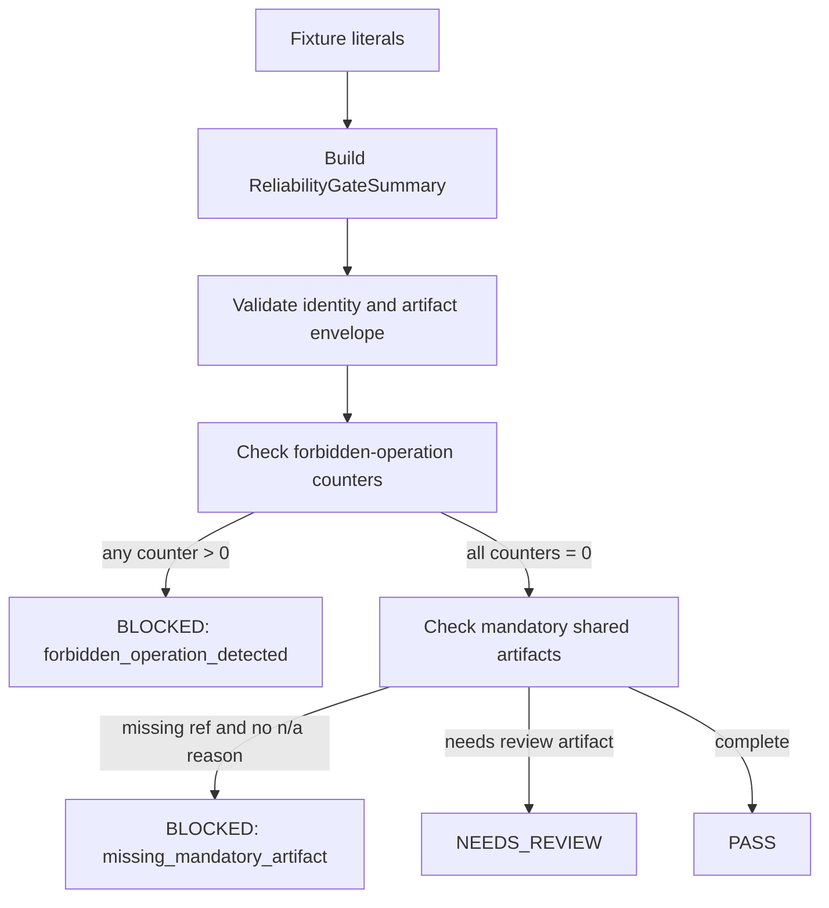

# LLD: CR154-S01 - Shared Gate Contract and First Runnable Fixture Skeleton

> This LLD is design evidence only. It does not authorize source implementation, test implementation, real data access, runtime access, broker access, credentials, store/catalog/registry writes or publish operations.

## 0. 上游设计依据

| 来源 | 路径 / ID | 被本 LLD 消费的内容 |
|---|---|---|
| HLD | `process/docs/design/HLD-CROSS-STRATEGY-PRODUCTION-RELIABILITY-GATES.md` | Shared contract plus strategy adapters, six-gate architecture, four-state status, artifact refs, blocked claims, release-blocking reason, no-runtime boundary, UC/REQ traceability. |
| ADR | `process/docs/design/ARCHITECTURE-DECISION-CROSS-STRATEGY-PRODUCTION-RELIABILITY-GATES.md` | ADR-CR154-001 shared contract/adapters, ADR-CR154-002 explicit statistical artifact refs, ADR-CR154-006 no-runtime/no-real-data boundary. |
| Feature Matrix | `process/docs/design/FEATURE-DESIGN-MATRIX.md` | FEAT-15 S01 is `full-lld`; S01 must own fixture schema and first runnable fixture so Phase A is not an empty shell. |
| Feature DESIGN | `process/docs/features/cross-strategy-reliability-gates/DESIGN.md` | Mandatory shared field families: gate identity, status, evidence refs, blocked claims, release blocking and forbidden operation counters. |
| Feature TEST-PLAN | `process/docs/features/cross-strategy-reliability-gates/TEST-PLAN.md` | Shared fixture skeleton must cover minimal PASS, missing artifact BLOCKED, NEEDS_REVIEW and forbidden-operation counter BLOCKED. |
| Feature TASKS | `process/docs/features/cross-strategy-reliability-gates/TASKS.md` | `CR154-T01` designs shared gate summary, artifact ref and blocked-claim schema. |
| Development Plan | `process/DEVELOPMENT-PLAN-CR154-CROSS-STRATEGY-RELIABILITY-GATES.yaml` | S01 is Wave 1, merge owner for shared schema, and prerequisite for S02-S06 LLD consumption. |

## 1. Goal

Create the shared CR154 reliability gate contract and first runnable fixture schema that all later gate stories consume. The design defines typed schema names, JSON-safe serialization shape, deterministic fixture cases and fail-closed behavior for forbidden operations and missing mandatory evidence while preserving the local/static/fixture-only boundary.

## 2. Requirements（Functional / Non-Functional）

### 2.1 Functional

- Define a shared status vocabulary: `PASS`, `FAIL`, `NEEDS_REVIEW`, `BLOCKED`.
- Define artifact-level `n/a-with-reason` without adding a fifth gate status.
- Define gate identity fields: `gate_id`, `gate_name`, `strategy_class`, `release_profile`, `risk_level`, `evidence_completeness`.
- Define structured `ArtifactRef` records with `artifact_type`, `ref`, `source_cr`, `owner_gate`, `status` and optional `n/a_reason`.
- Define `BlockedClaim` records with claim id, reason, source gate, release wording impact and unlock condition.
- Define `release_blocking_reason` as a structured object, not free text only.
- Define forbidden-operation counters for lake, NAS, provider, QMT/runtime, broker, credential, feed, order, reconciliation, store, catalog, registry and publish surfaces.
- Define strategy-family adapter placeholders for `multifactor`, `ml` and `event_driven` without implementing gate-specific adapter rules owned by S02-S07.
- Define a first runnable fixture schema with concrete fixture cases: `shared_minimal_pass`, `shared_missing_evidence_blocked`, `shared_needs_review`, `shared_forbidden_operation_blocked`.

### 2.2 Non-Functional

- Serialization must be JSON-safe and deterministic for fixture assertions.
- Missing mandatory shared fields must fail closed during local validation.
- The contract must not read `.env`, credentials, lake, NAS, provider, QMT, runtime, broker, feed, order, reconciliation, store, catalog, registry or publish destinations.
- The fixture schema must be extensible by S02-S07 without changing S01 base object names.
- Existing CR151/CR152/CR153 artifacts are consumed as refs only; S01 does not weaken their previous semantics.

## 3. 模块拆分与职责

| 模块 / 文件组 | 职责 | 说明 |
|---|---|---|
| Shared status and enums | Define `ReliabilityGateStatus`, `StrategyClass`, `ReleaseProfile`, `RiskLevel`, `EvidenceCompleteness`, `GateMode` and `ForbiddenOperationSurface`. | S01 owns base enum names and serialization values. S07 later owns tier resolver policy over these values. |
| Artifact and blocked-claim schema | Define `ArtifactRef`, `NAWithReason`, `BlockedClaim`, `ReleaseBlockingReason`. | Gate-specific stories may add allowed `artifact_type` values but must reuse this envelope. |
| Gate summary schema | Define `ReliabilityGateSummary` and `CrossStrategyReliabilityReport`. | Summary carries shared fields and a `gate_artifacts` map keyed by gate id. |
| Adapter placeholder schema | Define `StrategyAdapterInput` and `StrategyAdapterSummary` placeholders. | S02-S07 fill gate-specific mapping; S01 only reserves stable shape and strategy family keys. |
| Fixture schema | Define `ReliabilityGateFixtureCase` and first fixture cases. | First runnable fixture is local/static data embedded in tests or fixture literals; no external files are required by this Story. |

## 4. 代码结构与文件影响范围

| 动作 | 文件路径 | 变更内容 |
|---|---|---|
| 创建 | `engine/cross_strategy_reliability_gates.py` | Add shared enums and dataclass-style contracts for status, artifact refs, blocked claims, release blocking, forbidden counters, gate summary, report and fixture case definitions. |
| 修改 | `tests/research/test_cross_strategy_reliability_gates.py` | Add first runnable shared contract fixture tests for PASS, missing evidence BLOCKED, NEEDS_REVIEW and forbidden operation BLOCKED. |

No implementation is performed by this LLD. The file paths above are future CP6 targets after full CP5 confirmation.

## 5. 数据模型与持久化设计

No persistence layer, database table, catalog pointer or registry record is added. All objects are in-memory contract objects serialized to JSON-safe dictionaries for fixture/static validation.

| 对象 / 字段 | 类型 | 约束 | 说明 |
|---|---|---|---|
| `ReliabilityGateStatus` | enum string | One of `PASS`, `FAIL`, `NEEDS_REVIEW`, `BLOCKED`. | Gate-level status only. `n/a-with-reason` is represented at artifact level. |
| `StrategyClass` | enum string | `multifactor`, `ml`, `event_driven`, `hybrid`, `unknown`. | `unknown` must be fail-closed by policy consumers. |
| `ReleaseProfile` | enum string | `exploratory`, `admission_package`, `candidate_release`, `release_readiness`, `production_like`, `simulation_readiness`, `paper`, `live`, `trading`, `unknown`. | S07 owns tier mapping. S01 provides stable values. |
| `RiskLevel` | enum string | `low`, `medium`, `medium_high`, `high`, `critical`, `unknown`. | Unknown risk must not silently pass. |
| `EvidenceCompleteness` | enum string | `complete`, `partial`, `missing_mandatory`, `not_applicable_with_reason`, `unknown`. | Shared field used by S07 tier resolver. |
| `NAWithReason.reason` | string | Required when an artifact is not applicable. Empty string invalid. | The literal policy term is `n/a-with-reason`; object stores reason and owner. |
| `ArtifactRef.artifact_type` | string | Non-empty stable slug. | S02-S07 own gate-specific values. |
| `ArtifactRef.ref` | string or null | Required unless `n/a_reason` is present. Must be local/static ref string, not live URI requiring access. | Examples: `fixture://cr154/shared/minimal-pass/statistical-summary`. |
| `ArtifactRef.source_cr` | string | Optional but required for CR151/152/153 adapter refs. | Supports audit lineage. |
| `ArtifactRef.owner_gate` | string | Required; one of `gate_1_statistical`, `gate_2_cv`, `gate_3_pit_universe`, `gate_4_capacity_impact`, `gate_5_regime_attribution_reconciliation`, `gate_6_admission_policy`, `shared`. | Prevents hidden owner drift. |
| `ArtifactRef.status` | `ReliabilityGateStatus` | Required. | Artifact can be `BLOCKED` even when overall report waits on policy evaluation. |
| `BlockedClaim.claim_id` | string | Required stable slug. | Example: `production_ready`, `survivorship_free`, `capacity_scalable`. |
| `BlockedClaim.reason` | string | Required non-empty. | Human readable reason. |
| `BlockedClaim.source_gate` | string | Required. | Maps claim blocker to gate owner. |
| `BlockedClaim.release_wording_impact` | string | Required. | Text/slug describing wording that must be prohibited. |
| `BlockedClaim.unlock_condition` | string | Required. | Defines evidence needed to unblock. |
| `ReleaseBlockingReason.reason_id` | string | Required when any release-blocking mode/status exists. | Machine-readable id. |
| `ReleaseBlockingReason.message` | string | Required when reason exists. | Human-readable summary. |
| `ForbiddenOperationCounters` | mapping surface -> int | All configured surfaces default to `0`; any value > 0 forces `BLOCKED`. | Surfaces include lake, NAS, provider, QMT/runtime, broker, credential, feed, order, reconciliation, store, catalog, registry, publish. |
| `ReliabilityGateSummary.gate_id` | string | Required. | Gate summaries are keyed by stable gate id. |
| `CrossStrategyReliabilityReport.gate_summaries` | list/map | At least one gate or shared summary in S01 fixtures. | Later gates extend this list. |
| `ReliabilityGateFixtureCase.expected_status` | `ReliabilityGateStatus` | Required. | First runnable fixture asserts shared evaluator output. |

## 6. API / Interface 设计

| 接口 / 入口 | 输入 | 输出 | 调用方 | 说明 |
|---|---|---|---|---|
| `artifact_ref_to_dict(ref)` | `ArtifactRef` | JSON-safe `dict` | Tests, later evidence index renderers | Must preserve `n/a_reason` and omit no required field silently. |
| `blocked_claim_to_dict(claim)` | `BlockedClaim` | JSON-safe `dict` | Tests, admission summary consumers | Used by release wording assertions. |
| `build_shared_gate_summary(...)` | Gate identity, artifact refs, blocked claims, forbidden counters | `ReliabilityGateSummary` | S01 fixtures, S02-S07 later stories | Does not evaluate gate-specific statistical/CV/PIT/capacity policy. |
| `evaluate_shared_contract(summary)` | `ReliabilityGateSummary` | `ReliabilityGateStatus` plus optional `ReleaseBlockingReason` | Shared fixture tests, later S07 policy resolver | S01 evaluation covers generic missing mandatory artifacts and forbidden counters only. |
| `fixture_cases_shared_contract()` | none | list of `ReliabilityGateFixtureCase` | Test module | Returns first runnable fixture cases. No external data access. |

Each interface above has a matching test row in section 10.

## 7. 核心处理流程

1. Fixture creates a `ReliabilityGateSummary` using only literal local/static objects.
2. Shared validation checks required identity fields, artifact envelope validity and blocked-claim envelope validity.
3. Shared validation sums forbidden-operation counters.
4. If any forbidden counter is nonzero, status becomes `BLOCKED` and `release_blocking_reason.reason_id` is `forbidden_operation_detected`.
5. If a required artifact placeholder is missing or has neither `ref` nor `n/a_reason`, status becomes `BLOCKED` and a blocked claim is produced or preserved.
6. If artifacts are present but at least one artifact status is `NEEDS_REVIEW`, summary status becomes `NEEDS_REVIEW` unless a `BLOCKED` condition already exists.
7. Otherwise a complete minimal shared summary can be `PASS`.

## 8. 技术设计细节

- Key rule: gate-level status is four-state only; `n/a-with-reason` is a property of artifact refs and slot objects.
- Key rule: nonzero forbidden-operation counters override all other evidence and produce `BLOCKED`.
- Key rule: `BLOCKED` has precedence over `FAIL`, `NEEDS_REVIEW` and `PASS`; `FAIL` is reserved for explicit negative local/static evidence, while `BLOCKED` is used for missing mandatory evidence, forbidden operations or unauthorized release mode.
- Dependency reuse: use Python standard library dataclass/enum typing only unless existing project patterns require otherwise during implementation. No new dependencies are needed.
- Compatibility: adapter placeholders store CR151/152/153 evidence as refs; S01 does not import or execute those upstream modules.
- Serialization: `to_dict` output must be stable by field name and avoid object reprs, datetime objects or filesystem reads.
- Fixture strategy: fixture cases are built as literal Python objects or dictionaries in the test file so the first runnable fixture can execute without repository data files.

## 9. 安全与性能设计

| 维度 | 设计措施 | 验证方式 |
|---|---|---|
| Safety | Contract exposes forbidden-operation counters and blocks any nonzero lake/NAS/provider/runtime/broker/credential/feed/order/reconciliation/store/catalog/registry/publish counter. | `shared_forbidden_operation_blocked` fixture asserts `BLOCKED` and release-blocking reason. |
| Credential boundary | No API accepts credential values or `.env` paths. Refs are opaque local/static strings. | Static review of interface signatures and fixture literals. |
| Runtime boundary | No interface opens files, network, broker sessions, provider clients, event feeds, catalog registries or external frameworks. | CP6 tests use pure object construction only. |
| Performance | Validation is O(number of artifacts + blocked claims + counters). | Fixture tests assert deterministic behavior over small local literals; no benchmark required. |
| Maintainability | Gate-specific fields extend `ArtifactRef` and `gate_summaries` instead of changing shared envelope. | S02-S07 LLDs consume S01 schema and add named gate sections. |

## 10. 测试设计

| 测试场景 | 前置条件 | 操作 | 预期结果 | 验证方式 |
|---|---|---|---|---|
| `shared_minimal_pass` | Local literal summary has required identity, one shared artifact ref, zero forbidden counters and no blocked claims. | Build summary and call `evaluate_shared_contract`. | Status `PASS`; `release_blocking_reason` absent; serialization includes stable identity fields. | `uv run --python 3.11 pytest -q tests/research/test_cross_strategy_reliability_gates.py -k shared_minimal_pass` after CP5/CP6 authorization. |
| `shared_missing_evidence_blocked` | Required artifact slot has neither `ref` nor `n/a_reason`. | Evaluate shared contract. | Status `BLOCKED`; blocked claim includes `missing_mandatory_artifact`; release-blocking reason exists. | Fixture unit test. |
| `shared_needs_review` | Artifact envelope is valid but one artifact status is `NEEDS_REVIEW`. | Evaluate shared contract. | Status `NEEDS_REVIEW`; no forbidden-operation reason. | Fixture unit test. |
| `shared_forbidden_operation_blocked` | Forbidden counter such as `provider_fetch` or `broker_access` is `1`. | Evaluate shared contract. | Status `BLOCKED`; `release_blocking_reason.reason_id=forbidden_operation_detected`; blocked claim forbids release-like wording. | Fixture unit test. |
| `artifact_ref_to_dict_preserves_na_reason` | Artifact uses `n/a_reason` and no `ref`. | Serialize artifact. | Output includes explicit reason and owner; no silent omission. | Fixture unit test. |
| `blocked_claim_to_dict_release_wording` | Blocked claim has release wording impact and unlock condition. | Serialize claim. | Output contains claim id, reason, source gate, wording impact and unlock condition. | Fixture unit test. |

## 11. 实施步骤

| TASK-ID | 动作 | 目标文件 | 详细描述 | 对应测试 |
|---|---|---|---|---|
| CR154-T01-01 | 创建 | `engine/cross_strategy_reliability_gates.py` | Define shared enums and dataclass-style schema for statuses, strategy/release/risk values, `ArtifactRef`, `BlockedClaim`, `ReleaseBlockingReason`, `ForbiddenOperationCounters`, `ReliabilityGateSummary`, `CrossStrategyReliabilityReport` and `ReliabilityGateFixtureCase`. | Serialization and enum validation tests. |
| CR154-T01-02 | 创建 | `engine/cross_strategy_reliability_gates.py` | Implement JSON-safe serializers and shared contract validation/evaluation for required envelope fields, missing mandatory artifact refs and forbidden-operation counters. | `shared_missing_evidence_blocked`, `shared_forbidden_operation_blocked`. |
| CR154-T01-03 | 修改 | `tests/research/test_cross_strategy_reliability_gates.py` | Add first runnable fixture cases: minimal PASS, missing evidence BLOCKED, NEEDS_REVIEW and forbidden-operation BLOCKED. | All shared fixture tests. |
| CR154-T01-04 | 修改 | `tests/research/test_cross_strategy_reliability_gates.py` | Assert no fixture requires `.env`, lake/NAS/provider/runtime/broker/feed/store/catalog/registry access by using literal in-memory objects only. | Static fixture construction review and test import path. |

## 12. 风险、难点与预研建议

### 12.1 实现灰区与取舍记录

| Clarification ID | 问题 | 选项与推荐 | 决策 / 答案 | 影响面 | 证据 | 重访条件 |
|---|---|---|---|---|---|---|
| N/A | No blocking user clarification is required for S01. | Recommended: proceed with S01-owned shared envelope and first runnable fixture. Alternative: defer fixture schema to gate stories; rejected because CP4 requires S01 to avoid empty Phase A. | Adopt recommended design for CP5 review. | Interface / file owner / tests / cross Story contract. | Feature Matrix FEAT-15 S01 row; Feature TEST-PLAN shared fixture skeleton row; Development Plan CP5-FOCUS-CR154-001. | Revisit only if CP5 rejects S01 ownership of base fixture schema. |

| 风险 / 难点 | 影响 | 缓解措施 / 预研建议 |
|---|---|---|
| Shared schema overreaches into gate-specific policy. | S02-S07 could lose clear ownership. | S01 defines only envelope, generic missing evidence behavior and forbidden counters; gate-specific artifacts and thresholds remain in later Story LLDs. |
| `n/a-with-reason` is mistaken for a gate status. | Status model may drift from HLD/ADR. | Keep four-state gate enum; represent N/A only as artifact-level reason object. |
| First fixture is too weak to be runnable. | CP5 focus item fails. | Include four concrete fixture cases and expected statuses in this LLD. |
| Forbidden-operation counters become cosmetic. | Unauthorized operation might not block release. | Any nonzero counter has highest precedence and produces `BLOCKED`. |

### OPEN / Spike 跟踪

| ID | 类型（OPEN / Spike） | 问题 | 下一动作 | 责任方 |
|---|---|---|---|---|
| N/A | OPEN | No S01 OPEN or Spike items. | N/A | N/A |

## 13. 回滚与发布策略

- 发布方式: after CP5 confirmation and CP6 implementation, expose S01 as a local/static Python contract and fixture tests only. It does not publish artifacts externally.
- Rollback trigger: CP6 tests show schema breaks downstream S02-S07 consumption, forbidden-operation precedence is incorrect, or fixture schema cannot represent required gate-specific cases.
- Rollback action: keep enum names and shared envelope stable where possible; revert only S01-added contract fields/tests before downstream gate implementation merges. If schema changes are required after S02-S07 consume it, route through host-orchestrator for CP5 design merge rather than ad hoc edits.
- Release wording: S01 cannot claim production readiness, runtime readiness, broker readiness, real data validation or trading authorization.

## 14. Definition of Done

- [ ] Shared four-state status enum exists and excludes `n/a-with-reason`.
- [ ] Artifact-level N/A is represented as explicit reason and owner.
- [ ] `ArtifactRef`, `BlockedClaim`, `ReleaseBlockingReason`, forbidden counters and gate summary schema are implemented.
- [ ] First runnable fixture cases cover PASS, missing evidence BLOCKED, NEEDS_REVIEW and forbidden-operation BLOCKED.
- [ ] Forbidden-operation counters block release-like claims when nonzero.
- [ ] Adapter placeholders exist for multifactor, ML and event-driven strategy families.
- [ ] No real lake/NAS/provider/QMT/runtime/broker/credential/feed/order/reconciliation/store/catalog/registry/publish operation is introduced.
- [ ] `confirmed=false` remains until CP5 batch approval.

## 人工确认区

> CP5 must review this S01 LLD together with the full CR154 LLD batch. Approval of this document allows later implementation planning only after all batch gates, dependency gates and file ownership gates pass.

**CP5 checklist 摘要**：

| # | 检查项 | 状态 | 证据 |
|---|---|---|---|
| 1 | LLD 覆盖 AC | 待检查 | Sections 2, 5, 10, 14. |
| 2 | 与 HLD / ADR 一致 | 待检查 | Sections 0, 3, 8, 9. |
| 3 | 文件影响范围明确 | 待检查 | Sections 4 and 11. |
| 4 | 接口契约完整 | 待检查 | Section 6. |
| 5 | 测试与 dev_gate 可计算 | 待检查 | Sections 10 and 14. |
| 6 | clarification queue 已收敛 | 待检查 | Section 12.1: no blocking LCQ. |

**人工审查结果回填**：

- 结论：`approved | changes_requested | rejected`
- 审查人：
- 审查时间：
- 修改意见：
- 风险接受项：
