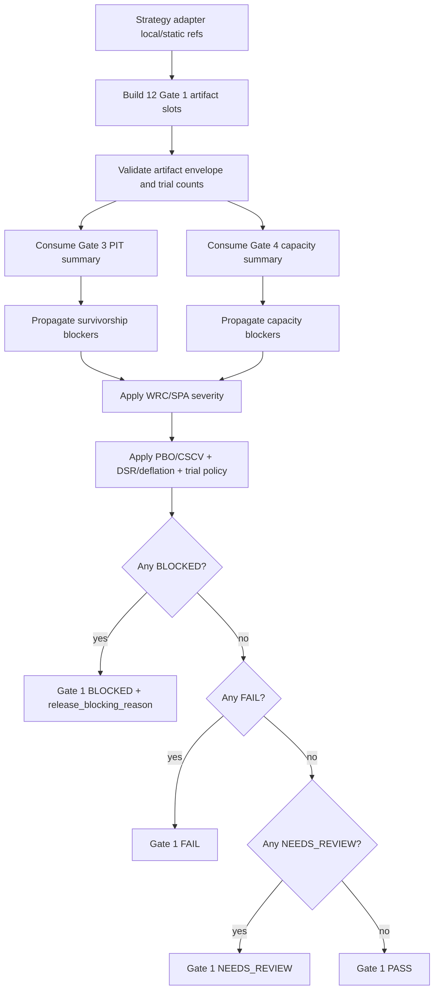

# LLD: CR154-S02 - Gate 1 Statistical Artifacts and Trap Severity Policy

> This LLD is design evidence only. It does not authorize source implementation, test implementation, real statistical calibration, real model training, lake/provider access, runtime access, broker access, credentials, store/catalog/registry writes or publish operations.

## 0. 上游设计依据

| 来源 | 路径 / ID | 被本 LLD 消费的内容 |
|---|---|---|
| Story dependency | `process/stories/CR154-S01-shared-gate-contract-fixture-skeleton-LLD.md` | Shared four-state status, artifact ref envelope, blocked claim model, release-blocking reason, forbidden-operation counters and first runnable fixture schema. |
| HLD | `process/docs/design/HLD-CROSS-STRATEGY-PRODUCTION-RELIABILITY-GATES.md` | Gate 1 minimum artifact contract, WRC/SPA severity follow-through, Gate 3/4 propagation hook, tier table, strategy-specific N/A policy and no-runtime boundary. |
| ADR | `process/docs/design/ARCHITECTURE-DECISION-CROSS-STRATEGY-PRODUCTION-RELIABILITY-GATES.md` | ADR-CR154-002 explicit statistical artifact model; ADR-CR154-005 admission tier table; ADR-CR154-006 no-runtime/no-real-data boundary. |
| Feature Matrix | `process/docs/design/FEATURE-DESIGN-MATRIX.md` | S02 is `full-lld`; LLD must split multifactor/ML/event-driven adapter subtasks and cover FT-CR154-CP5-001/002/003. |
| Feature DESIGN | `process/docs/features/cross-strategy-reliability-gates/DESIGN.md` | S02 owns Gate 1 evidence policy and must define severity, threshold/config ownership and propagation behavior. |
| Feature TEST-PLAN | `process/docs/features/cross-strategy-reliability-gates/TEST-PLAN.md` | Statistical fixture group must cover complete 12-slot evidence, missing WRC/SPA, missing PBO/DSR, invalid trial count and Gate 3/4 propagation. |
| Feature TASKS | `process/docs/features/cross-strategy-reliability-gates/TASKS.md` | `CR154-T02` designs Gate 1 statistical artifact model, severity mapping and adapter subtasks. |
| Development Plan | `process/DEVELOPMENT-PLAN-CR154.yaml` | S02 is Wave 2 critical path after S01 and shares future module/test files with S01. |

## 1. Goal

Design Gate 1 as an auditable statistical reliability artifact policy rather than a generic backtest trap label. The design freezes 12 artifact slots, WRC/SPA severity mapping, PBO/DSR/trial policy, Gate 3/4 propagation rules and strategy-family adapter subtasks for multifactor, ML and event-driven strategies.

## 2. Requirements（Functional / Non-Functional）

### 2.1 Functional

- Define exactly 12 Gate 1 artifact slots:
  1. `multiple_testing_correction_refs`
  2. `fdr_bh_refs`
  3. `white_reality_check_or_hansen_spa_refs`
  4. `pbo_or_cscv_refs`
  5. `dsr_or_sharpe_ic_deflation_refs`
  6. `trial_count_and_effective_trials`
  7. `oos_split_refs`
  8. `purge_embargo_refs`
  9. `survivorship_audit_refs`
  10. `impact_capacity_refs`
  11. `blocked_claims`
  12. `release_blocking_reason`
- Define Gate 1 artifact refs using the S01 `ArtifactRef` envelope.
- Define WRC/SPA or equivalent data-snooping correction severity by release profile and claim type.
- Define PBO/CSCV, DSR/Sharpe/IC deflation and trial count policy without performing real calibration.
- Define Gate 3 and Gate 4 propagation: PIT/survivorship or capacity/impact blockers must populate Gate 1 refs, blocked claims and release-blocking reason.
- Define adapter subtasks for multifactor, ML and event-driven strategy families.
- Define fixture cases for complete evidence, missing WRC/SPA, missing PBO/DSR, invalid trial counts and Gate 3/4 propagation.

### 2.2 Non-Functional

- Gate 1 must fail closed for release-blocking profiles when mandatory statistical evidence is missing.
- `n/a-with-reason` is allowed only when release wording does not claim the corresponding reliability property or when strategy-specific applicability rules allow it.
- No real data fetch, real model training, empirical calibration, external framework execution, lake/NAS/provider/runtime/broker/feed/store/catalog/registry operation or publish action is allowed.
- The design must preserve CR151/CR152/CR153 compatibility by consuming upstream evidence as refs, not re-running upstream algorithms.
- Numeric thresholds must be deterministic config/default policy values for first-wave fixture validation, not claims of empirical calibration.

## 3. 模块拆分与职责

| 模块 / 文件组 | 职责 | 说明 |
|---|---|---|
| Gate 1 artifact schema | Define `StatisticalReliabilityArtifacts` as the structured holder for the 12 slots. | Uses S01 `ArtifactRef`, `BlockedClaim` and `ReleaseBlockingReason`; no persistence. |
| Gate 1 policy evaluator | Evaluate missing/invalid statistical artifacts into `PASS`, `FAIL`, `NEEDS_REVIEW` or `BLOCKED`. | S02 owns Gate 1 severity only; S07 later resolves overall admission tier. |
| WRC/SPA severity table | Map missing WRC/SPA or equivalent correction to status by release profile and claim type. | Implements FT-CR154-CP5-001. |
| PBO/DSR/trial policy | Define required fields, default thresholds and validation behavior for PBO/CSCV, DSR/deflation and trial counts. | Implements FT-CR154-CP5-003 for S02-owned statistical thresholds. |
| Cross-gate propagation adapter | Convert Gate 3/4 blocked states into Gate 1 refs, blocked claims and release-blocking reason. | Implements FT-CR154-CP5-002 together with S04/S05 later. |
| Strategy-family adapters | Define subtask mapping for multifactor, ML and event-driven evidence refs. | S02 defines Gate 1 mapping only; S03-S06 own other gates. |
| Gate 1 fixture cases | Extend S01 fixture schema with statistical reliability cases. | Uses local/static literals only. |

## 4. 代码结构与文件影响范围

| 动作 | 文件路径 | 变更内容 |
|---|---|---|
| 修改 | `engine/cross_strategy_reliability_gates.py` | Add Gate 1 artifact slot schema, severity policy constants, PBO/DSR/trial default policy, Gate 3/4 propagation helper and strategy-family adapter mapping stubs. |
| 修改 | `tests/research/test_cross_strategy_reliability_gates.py` | Add Gate 1 fixture tests for all 12 slots, WRC/SPA severity, PBO/DSR/trial policy and Gate 3/4 propagation. |

No implementation is performed by this LLD. The file paths above are future CP6 targets after full CP5 confirmation.

## 5. 数据模型与持久化设计

No persistence layer, database table, catalog pointer, model registry entry, feature store entry or event store entry is added. All Gate 1 artifacts are local/static contract objects.

| 对象 / 字段 | 类型 | 约束 | 说明 |
|---|---|---|---|
| `StatisticalReliabilityArtifacts.multiple_testing_correction_refs` | list[`ArtifactRef`] | Required when any significance/performance-family claim is made. | Must include family id, tested hypothesis count and correction method in the referenced artifact payload or ref metadata. |
| `fdr_bh_refs` | list[`ArtifactRef`] or `NAWithReason` | Required for FDR/significance claims; N/A allowed for non-significance release wording. | Benjamini-Hochberg or equivalent FDR correction refs. |
| `white_reality_check_or_hansen_spa_refs` | list[`ArtifactRef`] or `NAWithReason` | Severity governed by table in section 8. | White Reality Check, Hansen SPA or equivalent data-snooping correction. |
| `pbo_or_cscv_refs` | list[`ArtifactRef`] or `NAWithReason` | Required for T1+ candidate/release profiles making performance robustness claims; T2 blocks if missing. | PBO/CSCV report or staged approximation refs. |
| `dsr_or_sharpe_ic_deflation_refs` | list[`ArtifactRef`] or `NAWithReason` | Required when Sharpe/IC/selection-bias-adjusted claims are made. | DSR, Sharpe deflation, IC deflation or equivalent. |
| `trial_count_and_effective_trials.raw_trial_count` | int | Required when PBO/DSR/deflation is active; must be >= 1. | Total tried configurations/hypotheses. |
| `trial_count_and_effective_trials.effective_trial_count` | float | Required when PBO/DSR/deflation is active; must be >= 1 and <= raw count unless approximation reason exists. | Effective independent trials. |
| `trial_count_and_effective_trials.provenance_ref` | `ArtifactRef` | Required for active trial policy. | Points to local/static trial-count evidence. |
| `oos_split_refs` | list[`ArtifactRef`] or `NAWithReason` | Missing blocks OOS-proven/production-like wording. | Train/validation/test, rolling OOS or walk-forward split refs. |
| `purge_embargo_refs` | list[`ArtifactRef`] or `NAWithReason` | Required for ML and event windows when labels/events overlap; N/A requires reason for non-overlap. | Gate 1 consumes ref; S03 owns detailed CV governance. |
| `survivorship_audit_refs` | list[`ArtifactRef`] or propagated blocker | Required for survivorship-free/full-history claims. | Gate 3 `BLOCKED` must appear here as propagated `ArtifactRef` status or blocked claim. |
| `impact_capacity_refs` | list[`ArtifactRef`] or propagated blocker | Required for capacity/scalable wording. | Gate 4 `BLOCKED` must appear here as propagated `ArtifactRef` status or blocked claim. |
| `blocked_claims` | list[`BlockedClaim`] | Always present; empty allowed only when evidence proves no blocked claims for current release profile. | Includes Gate 1 and propagated Gate 3/4 blockers. |
| `release_blocking_reason` | `ReleaseBlockingReason` or null | Required whenever Gate 1 status is `BLOCKED` or release profile is release-blocking and mandatory evidence is incomplete. | Machine + human reason. |
| `Gate1SeverityPolicy.release_profile` | `ReleaseProfile` | Required. | Uses S01 release profile enum. |
| `Gate1SeverityPolicy.claim_type` | enum string | `no_significance_claim`, `statistical_significance`, `performance_robustness`, `production_like`, `capacity_or_survivorship`. | Determines WRC/SPA and PBO/DSR requirements. |

## 6. API / Interface 设计

| 接口 / 入口 | 输入 | 输出 | 调用方 | 说明 |
|---|---|---|---|---|
| `build_gate1_artifacts(...)` | 12 slot values using S01 schemas | `StatisticalReliabilityArtifacts` | Gate 1 fixtures, later adapters | Validates slot presence and artifact envelope shape. |
| `evaluate_gate1_statistical_reliability(artifacts, strategy_class, release_profile, claim_types)` | Gate 1 artifacts, strategy class, release profile and claim types | `ReliabilityGateSummary` | CR154 Gate 1 tests, later S07 tier resolver | Returns four-state status, blocked claims and release-blocking reason. |
| `severity_for_missing_wrc_spa(release_profile, claim_type)` | release profile and claim type | `ReliabilityGateStatus` | Gate 1 evaluator tests | Implements WRC/SPA severity table. |
| `validate_pbo_dsr_trial_policy(artifacts, claim_types)` | Gate 1 artifacts and claims | validation result / blocked claims | Gate 1 evaluator | Checks PBO/CSCV, DSR/deflation and trial count constraints. |
| `propagate_gate3_gate4_blockers(gate3_summary, gate4_summary, gate1_artifacts)` | Gate 3/4 summaries and Gate 1 artifacts | updated Gate 1 artifacts and blocked claims | S04/S05 integration tests, Gate 1 fixture tests | Does not evaluate Gate 3/4 policy; only consumes their summary statuses. |
| `map_multifactor_gate1_refs(cr151_summary)` | CR151 local/static summary ref object | Gate 1 slot refs | Multifactor adapter | Adapter subtask placeholder; no CR151 algorithm execution. |
| `map_ml_gate1_refs(cr152_summary)` | CR152 local/static summary ref object | Gate 1 slot refs | ML adapter | Adapter subtask placeholder; no training or registry access. |
| `map_event_gate1_refs(cr153_summary)` | CR153 local/static summary ref object | Gate 1 slot refs | Event adapter | Adapter subtask placeholder; no feed/listener/event store access. |

Each interface above has at least one corresponding test row in section 10.

## 7. 核心处理流程

1. Strategy adapter maps upstream CR151/CR152/CR153 local/static summary refs into the 12 Gate 1 slots.
2. Gate 1 builder validates the S01 artifact envelope and trial count structure.
3. Propagation helper consumes Gate 3 and Gate 4 summaries when present.
4. Gate 3 `BLOCKED` or `FAIL` adds/updates `survivorship_audit_refs`, blocked claims and release-blocking reason.
5. Gate 4 `BLOCKED` or `FAIL` adds/updates `impact_capacity_refs`, blocked claims and release-blocking reason.
6. Gate 1 evaluator applies WRC/SPA severity by release profile and claim type.
7. Gate 1 evaluator applies PBO/CSCV, DSR/deflation and trial count policy.
8. `BLOCKED` dominates, then `FAIL`, then `NEEDS_REVIEW`, then `PASS`.
9. The evaluator returns a S01 `ReliabilityGateSummary` for `gate_1_statistical`.

## 8. 技术设计细节

### 8.1 WRC/SPA Severity Table

| Release Profile | Claim Type | Missing WRC/SPA or Equivalent | Required Output |
|---|---|---|---|
| `exploratory` | `no_significance_claim` | Allowed only with explicit `n/a-with-reason`. | `NEEDS_REVIEW` if N/A reason exists; `BLOCKED` if omitted silently. |
| `exploratory` | `statistical_significance` or `performance_robustness` | Not acceptable for the claim. | `NEEDS_REVIEW`; block the specific significance/robustness wording. |
| `admission_package` / `candidate_release` | `no_significance_claim` | Allowed with explicit blocked claims. | `NEEDS_REVIEW`; blocked claims must forbid significance/OOS-proven wording. |
| `admission_package` / `candidate_release` | `statistical_significance` | Missing data-snooping correction conflicts with claim. | `BLOCKED`; release-blocking reason `missing_data_snooping_correction`. |
| `admission_package` / `candidate_release` | `performance_robustness` | Missing WRC/SPA/equivalent weakens robustness. | `BLOCKED` unless claim is removed and blocked claims are present. |
| `release_readiness` / `production_like` / `simulation_readiness` | any performance or reliability claim | Missing WRC/SPA/equivalent is not acceptable. | `BLOCKED`. |
| `paper` / `live` / `trading` | any | CR154 does not authorize runtime/trading profiles. | `BLOCKED` with `not_authorized_by_cr154`. |
| `unknown` | any | Cannot classify severity. | `BLOCKED` until S07 classifies profile. |

Equivalent data-snooping correction must be represented as an `ArtifactRef` with `artifact_type="data_snooping_correction_equivalent"` and a non-empty method rationale in local/static metadata. Free-text "equivalent" without rationale is invalid.

### 8.2 PBO / DSR / Trial Policy

| Policy Item | Default First-Wave Rule | Failure Status |
|---|---|---|
| `pbo_or_cscv_refs` present for T1+ performance robustness claims | Required. Missing may be `NEEDS_REVIEW` only for exploratory or non-claim wording with blocked claims. | `BLOCKED` for candidate/release profiles claiming robustness. |
| `dsr_or_sharpe_ic_deflation_refs` present for Sharpe/IC claims | Required when Sharpe, IC, t-stat or selected-best-performance wording is used. | `BLOCKED` for missing evidence under active claim. |
| `raw_trial_count` | Integer >= 1 when PBO/DSR active. | `BLOCKED` if missing, zero or negative. |
| `effective_trial_count` | Numeric >= 1 and <= `raw_trial_count`; if greater, requires approximation reason and `NEEDS_REVIEW` minimum. | `BLOCKED` for invalid absent reason; `NEEDS_REVIEW` with reason. |
| Threshold calibration | No empirical calibration in first wave. Defaults are validation-shape policies only. | N/A; future calibration requires separate CR. |
| Threshold ownership | S02 owns statistical default/config keys; S07 may consume risk level and release profile when resolving tier. | N/A. |

Default config key names for future implementation:

- `gate1.require_pbo_for_candidate_release = true`
- `gate1.require_dsr_for_sharpe_or_ic_claim = true`
- `gate1.min_raw_trial_count_when_deflated = 1`
- `gate1.min_effective_trial_count_when_deflated = 1.0`
- `gate1.allow_exploratory_wrc_spa_na_with_blocked_claims = true`

### 8.3 Gate 3 / Gate 4 Propagation

| Source Gate | Source Status | Gate 1 Slot Impact | Blocked Claim | Release Blocking |
|---|---|---|---|---|
| Gate 3 PIT universe | `BLOCKED` | Add or update `survivorship_audit_refs` with propagated `ArtifactRef.status=BLOCKED`. | Add `survivorship_free`, `full_history_pit`, `production_ready_universe` as applicable. | Required for T1+ if claim depends on PIT/survivorship; always required for T2. |
| Gate 3 PIT universe | `NEEDS_REVIEW` | Add `survivorship_audit_refs` with `NEEDS_REVIEW`. | Block survivorship-free wording unless accepted by later policy. | `NEEDS_REVIEW` unless T2 profile makes it blocking. |
| Gate 4 capacity/impact | `BLOCKED` | Add or update `impact_capacity_refs` with propagated `ArtifactRef.status=BLOCKED`. | Add `capacity_scalable`, `market_impact_adjusted`, `production_capacity_ready` as applicable. | Required for capacity/scalable/release-like wording. |
| Gate 4 capacity/impact | `NEEDS_REVIEW` | Add `impact_capacity_refs` with `NEEDS_REVIEW`. | Block scalable/capacity wording pending review. | `NEEDS_REVIEW` unless T2 profile makes it blocking. |

Propagation must preserve source gate id, source reason id and source evidence ref so Gate 1 does not appear clean when another gate blocks a statistical reliability claim.

### 8.4 Strategy-Family Adapter Subtasks

| Adapter Subtask | Inputs | Gate 1 Slot Mapping | N/A Policy | Not Authorized |
|---|---|---|---|---|
| `CR154-T02-MF-01` multifactor adapter | CR151 statistical gate summary refs. | Multiple testing, FDR/BH, PBO/CSCV, DSR/deflation, trial count, OOS refs. | ML-only fields are not part of Gate 1 unless hybrid strategy declares ML method. Purge/embargo may be N/A only when no overlapping label/window logic exists. | No CR151 rerun, no real factor data read, no lake/provider access. |
| `CR154-T02-ML-01` ML adapter | CR152 PIT feature/label, purged/embargo split, training/model metadata refs. | Trial count, OOS refs, purge/embargo, PBO/CSCV, DSR/deflation, data-snooping correction refs where performance selection claims exist. | Triple-barrier/meta-labeling/feature-importance remain CR152/follow-up when not active; missing active method must become blocked claim, not silent N/A. | No training, no prediction store, no model registry write. |
| `CR154-T02-EV-01` event-driven adapter | CR153 event study method/test refs and multiple-testing/data-snooping slot. | Multiple testing, WRC/SPA/equivalent, OOS/event window refs, purge/embargo when windows overlap, survivorship refs via Gate 3. | Event-specific methods are active for event strategies; non-event equivalents require rationale. | No event feed, listener, event store, broker/order runtime. |

## 9. 安全与性能设计

| 维度 | 设计措施 | 验证方式 |
|---|---|---|
| Safety | Consume only local/static refs and S01 forbidden-operation counters. Any runtime/trading profile remains blocked by CR154 boundary. | Gate 1 tests use literal refs; forbidden operation tests inherited from S01. |
| Statistical overclaim prevention | Missing WRC/SPA, PBO/DSR or trial evidence blocks or downgrades claims by severity table. | Fixture tests for missing WRC/SPA, missing PBO/DSR and invalid trial counts. |
| Cross-gate consistency | Gate 3/4 blockers propagate into Gate 1 slots, blocked claims and release-blocking reason. | Propagation fixture cases. |
| Performance | Gate 1 validation is deterministic O(number of refs + blocked claims). | No benchmark required; fixture tests cover bounded static objects. |
| Compatibility | Upstream CR151/152/153 evidence is referenced, not recomputed. | Adapter fixture tests assert source CR refs are preserved. |

## 10. 测试设计

| 测试场景 | 前置条件 | 操作 | 预期结果 | 验证方式 |
|---|---|---|---|---|
| `gate1_complete_12_slot_pass` | All 12 slots present; mandatory refs valid; zero forbidden counters; no propagated blockers. | Build Gate 1 artifacts and evaluate. | `PASS`; no release-blocking reason; empty or nonblocking blocked claims according to fixture. | `uv run --python 3.11 pytest -q tests/research/test_cross_strategy_reliability_gates.py -k gate1_complete_12_slot_pass` after CP5/CP6 authorization. |
| `gate1_missing_wrc_spa_exploratory_needs_review` | Exploratory profile, no significance claim, explicit N/A reason for WRC/SPA. | Evaluate severity. | `NEEDS_REVIEW`; blocked claims forbid significance/robustness wording. | Fixture unit test. |
| `gate1_missing_wrc_spa_candidate_significance_blocked` | Candidate release profile with statistical significance claim and missing WRC/SPA/equivalent. | Evaluate severity. | `BLOCKED`; reason `missing_data_snooping_correction`. | Fixture unit test. |
| `gate1_missing_pbo_candidate_blocked` | Candidate/release profile claims performance robustness; no PBO/CSCV ref or N/A policy. | Validate PBO policy. | `BLOCKED`; blocked claim forbids robustness/release-like wording. | Fixture unit test. |
| `gate1_missing_dsr_for_sharpe_ic_blocked` | Sharpe/IC claim exists; DSR/deflation ref missing. | Validate DSR policy. | `BLOCKED`; blocked claim forbids Sharpe/IC reliability wording. | Fixture unit test. |
| `gate1_invalid_trial_count_blocked` | PBO/DSR active but raw trial count is 0 or effective count missing. | Validate trial policy. | `BLOCKED`; release-blocking reason `invalid_trial_count_policy`. | Fixture unit test. |
| `gate1_effective_trials_gt_raw_needs_review_with_reason` | Effective trials exceeds raw trials but approximation reason exists. | Validate trial policy. | Minimum `NEEDS_REVIEW`; blocked claims require review before release-like wording. | Fixture unit test. |
| `gate1_gate3_blocked_propagates_survivorship` | Gate 3 summary is `BLOCKED`. | Call propagation helper then evaluate Gate 1. | `survivorship_audit_refs` includes propagated `BLOCKED`; blocked claims include survivorship/free-history claims; release-blocking reason present for T1+/T2. | Fixture unit test. |
| `gate1_gate4_blocked_propagates_capacity` | Gate 4 summary is `BLOCKED`. | Call propagation helper then evaluate Gate 1. | `impact_capacity_refs` includes propagated `BLOCKED`; blocked claims include capacity/scalable claims; release-blocking reason present for capacity/release-like wording. | Fixture unit test. |
| `gate1_multifactor_adapter_maps_cr151_refs` | CR151 summary ref fixture exists as local literal. | Map multifactor refs. | Slots populated for multiple testing/FDR/PBO/DSR/trials/OOS as applicable; no real data read. | Adapter fixture test. |
| `gate1_ml_adapter_maps_cr152_refs` | CR152 summary ref fixture exists as local literal. | Map ML refs. | Purge/embargo and trial refs are preserved; no training or registry access. | Adapter fixture test. |
| `gate1_event_adapter_maps_cr153_refs` | CR153 summary ref fixture exists as local literal. | Map event refs. | Event data-snooping/multiple-testing refs are preserved; no feed/listener/store access. | Adapter fixture test. |

## 11. 实施步骤

| TASK-ID | 动作 | 目标文件 | 详细描述 | 对应测试 |
|---|---|---|---|---|
| CR154-T02-01 | 修改 | `engine/cross_strategy_reliability_gates.py` | Define `StatisticalReliabilityArtifacts`, `TrialCountAndEffectiveTrials`, Gate 1 claim type constants and 12 slot field names. | `gate1_complete_12_slot_pass`. |
| CR154-T02-02 | 修改 | `engine/cross_strategy_reliability_gates.py` | Implement WRC/SPA severity table and `severity_for_missing_wrc_spa`. | WRC/SPA missing severity tests. |
| CR154-T02-03 | 修改 | `engine/cross_strategy_reliability_gates.py` | Implement PBO/CSCV, DSR/deflation and trial count validation policy with deterministic first-wave defaults/config keys. | PBO/DSR/trial tests. |
| CR154-T02-04 | 修改 | `engine/cross_strategy_reliability_gates.py` | Implement Gate 3/4 propagation helper for `survivorship_audit_refs`, `impact_capacity_refs`, blocked claims and release-blocking reason. | Gate 3/4 propagation tests. |
| CR154-T02-05 | 修改 | `engine/cross_strategy_reliability_gates.py` | Add multifactor, ML and event-driven Gate 1 adapter mapping stubs that consume local/static upstream summary refs only. | Adapter mapping tests. |
| CR154-T02-06 | 修改 | `tests/research/test_cross_strategy_reliability_gates.py` | Add Gate 1 positive, negative and propagation fixture cases listed in section 10. | All Gate 1 tests. |

## 12. 风险、难点与预研建议

### 12.1 实现灰区与取舍记录

| Clarification ID | 问题 | 选项与推荐 | 决策 / 答案 | 影响面 | 证据 | 重访条件 |
|---|---|---|---|---|---|---|
| N/A | No blocking user clarification is required for S02. | Recommended: use deterministic first-wave defaults/config keys for PBO/DSR/trial validation and mark empirical calibration as future CR. Alternative: request exact empirical thresholds now; rejected because HLD marks numeric thresholds as CP5 defaults/config/N/A policy, not real calibration. | Adopt recommended design for CP5 review. | Interface / tests / safety / cross Story contract. | HLD FT-CR154-CP5-003; Feature DESIGN Follow-Through Hooks; Development Plan CP5-FOCUS-CR154-002/003. | Revisit if CP5 reviewer requires different default/config ownership before implementation. |

| 风险 / 难点 | 影响 | 缓解措施 / 预研建议 |
|---|---|---|
| WRC/SPA missing severity is too permissive. | Strategy could overclaim robustness. | Candidate/release and production-like profiles are `BLOCKED` for active significance/performance claims; exploratory only gets `NEEDS_REVIEW` with blocked wording. |
| Threshold defaults are mistaken for empirical calibration. | Users may infer real statistical proof. | LLD states defaults are validation-shape policy only; real calibration requires later CR and authorization. |
| Gate 3/4 propagation duplicates S04/S05 ownership. | File ownership and policy boundaries may conflict. | S02 only consumes Gate 3/4 summary statuses and propagates refs/claims; S04/S05 own PIT/capacity policy details. |
| Adapter stubs accidentally run upstream computations. | Violates no-runtime/no-real-data boundary. | Adapter subtasks consume local/static refs only; no CR151/152/153 algorithm execution. |
| 12-slot model becomes optional by omission. | CP3 artifact requirement fails. | `StatisticalReliabilityArtifacts` must expose all 12 fields; N/A requires explicit reason. |

### OPEN / Spike 跟踪

| ID | 类型（OPEN / Spike） | 问题 | 下一动作 | 责任方 |
|---|---|---|---|---|
| N/A | OPEN | No S02 OPEN or Spike items. | N/A | N/A |

## 13. 回滚与发布策略

- 发布方式: after CP5 confirmation and CP6 implementation, Gate 1 is delivered as local/static contract and fixture tests within the shared CR154 reliability gate module.
- Rollback trigger: CP6 tests show WRC/SPA severity conflicts with HLD tier table, PBO/DSR/trial policy blocks allowed exploratory wording, or propagation misrepresents Gate 3/4 source ownership.
- Rollback action: revert Gate 1 evaluator and tests to the last CP5-approved S01 shared schema; keep the 12 slot names stable unless host-orchestrator routes a CP5 design update.
- Compatibility rollback: if adapter mappings break CR151/152/153 compatibility, disable the specific adapter mapping while retaining Gate 1 slots and blocked claims.
- Release wording: Gate 1 PASS must not claim real performance proof, production readiness, runtime readiness, paper/live/trading readiness, broker readiness, real TCA, real data validation or publish authorization.

## 14. Definition of Done

- [ ] All 12 statistical reliability artifact slots exist and are serialized through the S01 artifact envelope.
- [ ] WRC/SPA or equivalent data-snooping correction severity is implemented by release profile and claim type.
- [ ] PBO/CSCV, DSR/Sharpe/IC deflation and trial count policy is deterministic and fixture-testable.
- [ ] Gate 3/4 `BLOCKED` and `NEEDS_REVIEW` states propagate into Gate 1 refs, blocked claims and release-blocking reason.
- [ ] Multifactor, ML and event-driven adapter subtasks consume only local/static refs.
- [ ] Positive, negative and propagation fixtures from section 10 are implemented.
- [ ] No real lake/NAS/provider/QMT/runtime/broker/credential/feed/order/reconciliation/store/catalog/registry/publish operation is introduced.
- [ ] `confirmed=false` remains until CP5 batch approval.

## 人工确认区

> CP5 must review this S02 LLD together with the full CR154 LLD batch. Approval of this document allows later implementation planning only after all batch gates, dependency gates and file ownership gates pass.

**CP5 checklist 摘要**：

| # | 检查项 | 状态 | 证据 |
|---|---|---|---|
| 1 | LLD 覆盖 AC | 待检查 | Sections 2, 5, 8, 10, 14. |
| 2 | 与 HLD / ADR 一致 | 待检查 | Sections 0, 3, 8, 12. |
| 3 | 文件影响范围明确 | 待检查 | Sections 4 and 11. |
| 4 | 接口契约完整 | 待检查 | Section 6. |
| 5 | 测试与 dev_gate 可计算 | 待检查 | Sections 10 and 14. |
| 6 | clarification queue 已收敛 | 待检查 | Section 12.1: no blocking LCQ. |

**人工审查结果回填**：

- 结论：`approved | changes_requested | rejected`
- 审查人：
- 审查时间：
- 修改意见：
- 风险接受项：
