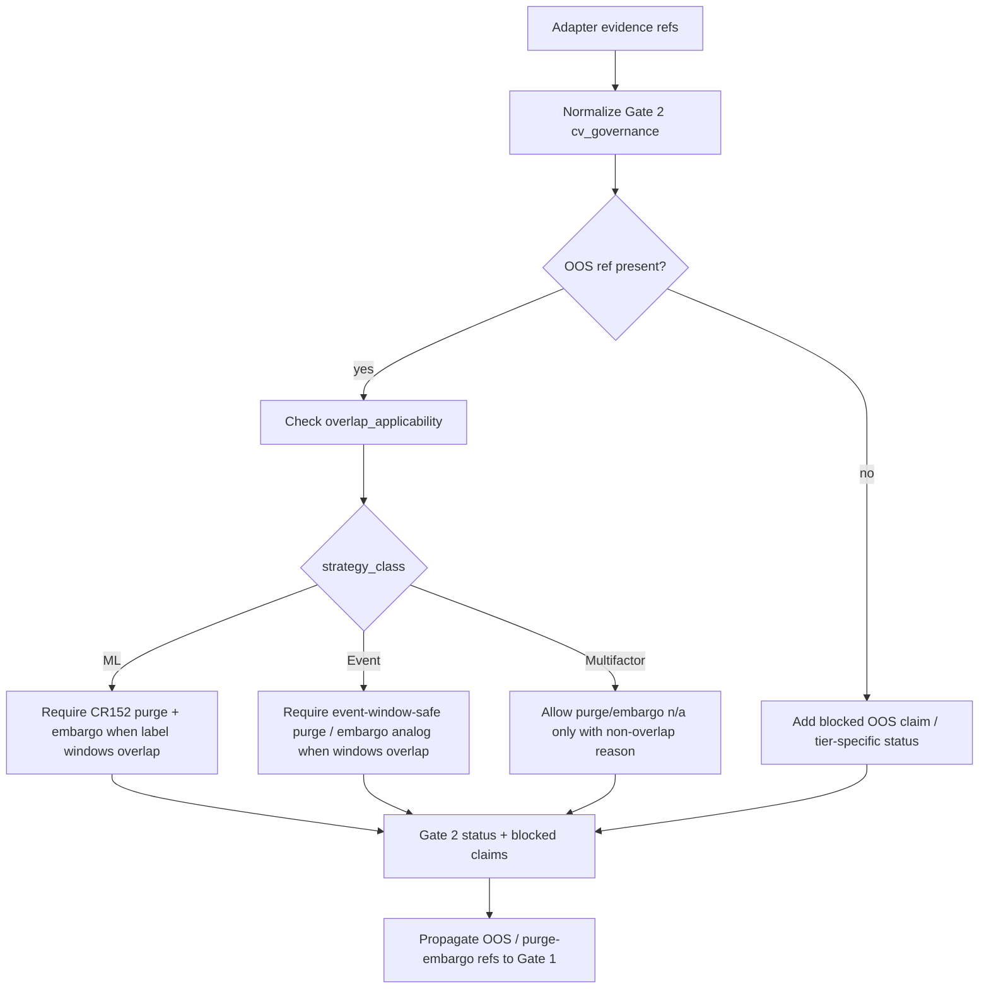

# LLD: CR154-S03 - Gate 2 Cross-Strategy CV Governance

> This document is CP5 design evidence only. It does not authorize source implementation, test implementation, real training, real data access, provider access, runtime execution, broker/feed/reconciliation/store/catalog/registry access, publishing, or credential / `.env` reads.

## 0. 上游设计依据

| 来源 | 路径 / ID | 被本 LLD 消费的内容 |
|---|---|---|
| Story | `process/stories/CR154-S03-cross-strategy-cv-governance.md` | Scope, acceptance criteria, file ownership and authorization boundary for Gate 2. |
| HLD | `process/docs/design/HLD-CROSS-STRATEGY-PRODUCTION-RELIABILITY-GATES.md` | Gate 2 field semantics, tier table, strategy-specific n/a policy, no-runtime boundary and UC/REQ traceability. |
| ADR | `process/docs/design/ARCHITECTURE-DECISION-CROSS-STRATEGY-PRODUCTION-RELIABILITY-GATES.md` | Shared contract plus adapters, explicit statistical artifact model, no-runtime boundary and ML-only n/a decision. |
| Feature Matrix | `process/docs/design/FEATURE-DESIGN-MATRIX.md` | CR154-S03 full-lld policy and warning not to force CR152 ML-only CV semantics onto multifactor / event strategies. |
| Feature DESIGN | `process/docs/features/cross-strategy-reliability-gates/DESIGN.md` | FEAT-15 boundary, shared contract shape, Gate 2 requirement and failure paths. |
| Feature TEST-PLAN | `process/docs/features/cross-strategy-reliability-gates/TEST-PLAN.md` | Required Gate 2 fixture cases: pass, missing OOS, missing purge/embargo and strategy-specific n/a. |
| Feature TASKS | `process/docs/features/cross-strategy-reliability-gates/TASKS.md` | `CR154-T03` design task and future implementation file anchors. |
| Development Plan | `process/DEVELOPMENT-PLAN-CR154.yaml` | Wave W2 dependency on S01, shared file ownership, max parallel LLD and no implementation authorization. |

## 1. Goal

Define Gate 2 as a shared walk-forward / OOS / purged-embargo governance contract that can evaluate multifactor, ML and event-driven strategy evidence through adapters without turning the CR152 ML purged-embargo fixture semantics into a mandatory shape for every strategy family.

The output of this Story is a precise design for fields, adapter mappings, fail-closed behavior and fixture coverage in `engine/cross_strategy_reliability_gates.py` and `tests/research/test_cross_strategy_reliability_gates.py`. No source or test code is implemented in this CP5 task.

## 2. Requirements（Functional / Non-Functional）

### 2.1 Functional

- Gate 2 MUST expose a shared `cv_governance` section under the CR154 reliability gate summary.
- Gate 2 MUST represent split evidence through refs rather than embedding real data or running validation against real datasets.
- Gate 2 MUST support three strategy classes: `multifactor`, `ml` and `event-driven`.
- Gate 2 MUST distinguish common OOS / walk-forward governance from strategy-specific purge and embargo applicability.
- Gate 2 MUST consume CR152 ML CV evidence as one adapter input for ML strategies.
- Gate 2 MUST NOT require multifactor strategies to provide ML label-window-specific purge/embargo fields when no overlapping label/event window exists.
- Gate 2 MUST NOT require event-driven strategies to mimic ML fold semantics; event adapters may express event-window overlap, cluster/overlap grouping and event CV audit refs.
- Missing OOS evidence MUST block production-like / OOS-proven claims unless S07 tier policy explicitly permits `NEEDS_REVIEW` or `n/a-with-reason`.
- Missing purge/embargo evidence MUST be `BLOCKED` for ML strategies with overlapping labels, and MUST be `BLOCKED` for event strategies with overlapping event windows unless a structured n/a reason proves non-overlap.
- Gate 2 MUST populate `blocked_claims` and `release_blocking_reason` through the shared S01 contract when missing evidence affects release wording.
- Gate 2 MUST provide refs that Gate 1 can consume as `oos_split_refs` and `purge_embargo_refs`.

### 2.2 Non-Functional

- Safety: implementation MUST remain local/static/fixture-only and MUST NOT read `.env`, credentials, lake, NAS, providers, runtime systems, broker, feed, store, catalog or registry.
- Auditability: every omitted split, OOS, purge or embargo artifact MUST be represented as an explicit `n/a-with-reason`, `NEEDS_REVIEW` or `BLOCKED`; silent omission is invalid.
- Compatibility: existing CR151, CR152 and CR153 evidence remains source evidence; CR154 defines shared release governance and does not rewrite historical Story conclusions.
- Determinism: status derivation MUST be pure and fixture-driven with no wall-clock, random, network or filesystem data discovery side effects.
- Extensibility: future strategy adapters MAY add more strategy-specific refs, but they MUST map into the shared Gate 2 fields before release wording can consume them.

## 3. 模块拆分与职责

| 模块 / 文件组 | 职责 | 说明 |
|---|---|---|
| `engine/cross_strategy_reliability_gates.py` | Define Gate 2 field model, adapter mapping helpers and deterministic policy evaluation for split/OOS/purge/embargo evidence. | S03 owns the Gate 2 section only. S01 owns base summary/status/ref/blocked-claim schema. S07 owns tier resolver and final release mode. |
| `tests/research/test_cross_strategy_reliability_gates.py` | Add fixture cases proving Gate 2 pass, missing OOS, missing purge/embargo and strategy-specific n/a behavior. | Test implementation is future CP6 work; this LLD defines the planned cases. |
| CR151 adapter boundary | Provide multifactor evidence refs such as walk-forward/OOS split refs and optional purge/embargo n/a reasons. | CR154 does not weaken CR151 statistical gate behavior. |
| CR152 adapter boundary | Consume ML purged/embargo CV evidence as ML-specific adapter input. | CR152 semantics are mandatory for ML only when labels/windows overlap; they are not copied onto non-ML strategies. |
| CR153 adapter boundary | Consume event CV split audit refs and event-window overlap semantics. | Event strategies may require purge/embargo analogs for overlapping event windows without becoming ML fold contracts. |
| Gate 1 propagation boundary | Receive Gate 2 refs and blocked outcomes as `oos_split_refs`, `purge_embargo_refs`, blocked claims and release reasons. | Cross-gate propagation is coordinated with S02; S03 supplies the source fields and status. |

## 4. 代码结构与文件影响范围

| 动作 | 文件路径 | 变更内容 |
|---|---|---|
| 修改 | `engine/cross_strategy_reliability_gates.py` | Add the Gate 2 `cv_governance` data section, strategy-specific adapter mapping rules, status derivation and blocked-claim generation hooks. |
| 修改 | `tests/research/test_cross_strategy_reliability_gates.py` | Add Gate 2 fixture cases for pass, missing OOS, missing purge/embargo, ML-specific evidence consumption and non-ML n/a behavior. |

No other source files, test files, real data files, environment files or runtime configuration files are in scope for S03.

## 5. 数据模型与持久化设计

No persistent storage, catalog pointer, registry entry, lake dataset, NAS artifact or provider-backed state is added. The model is in-memory / serialized fixture data only.

| 对象 / 字段 | 类型 | 约束 | 说明 |
|---|---|---|---|
| `cv_governance` | object / mapping | Required Gate 2 section when reliability gates are evaluated. | Nested under the shared CR154 gate summary from S01. |
| `strategy_class` | enum | `multifactor`, `ml`, `event-driven`; unknown handled by S07 fail-closed tier policy. | S03 uses this for adapter applicability. |
| `split_policy_ref` | evidence ref or `n/a-with-reason` | Required for admission / release-like profiles unless tier policy allows explicit n/a. | Points to a split policy artifact, not real data. |
| `walk_forward_ref` | evidence ref or `n/a-with-reason` | Required when walk-forward / rolling validation is claimed. | Supports REQ-079 rolling validation expectations. |
| `oos_ref` | evidence ref or `BLOCKED` | Missing OOS blocks OOS-proven or production-like wording. | Propagates to Gate 1 `oos_split_refs`. |
| `oos_window` | object | Must include deterministic `start`, `end` or fixture-safe labels when present. | No real dataset range discovery is allowed. |
| `purge_window` | object or `n/a-with-reason` | Required for ML overlapping label windows; required for event overlapping windows; optional for non-overlap with reason. | Must not be inferred from real labels/events. |
| `embargo_gap` | object or `n/a-with-reason` | Same applicability as `purge_window`. | Expressed as fixture/static metadata only. |
| `overlap_applicability` | enum | `overlapping-label-window`, `overlapping-event-window`, `non-overlapping-deterministic`, `unknown`. | Prevents applying ML-only purge/embargo rules to every strategy. |
| `split_leakage_status` | enum | `PASS`, `FAIL`, `NEEDS_REVIEW`, `BLOCKED`. Artifact-level n/a is represented as `n/a-with-reason`. | Shared status language from S01. |
| `n/a_reason` | string | Required whenever a strategy-specific field is not applicable. Empty reason is invalid. | Used for multifactor/event non-ML cases. |
| `blocked_claims` | list | Required when missing or failed Gate 2 evidence restricts wording. | Claims include OOS-proven, leakage-safe, production-like and release-ready wording as applicable. |
| `release_blocking_reason` | string / ref | Required when Gate 2 is release-blocking. | Final mode is resolved by S07. |

## 6. API / Interface 设计

| 接口 / 入口 | 输入 | 输出 | 调用方 | 说明 |
|---|---|---|---|---|
| `evaluate_cv_governance(...)` | Shared gate context from S01, `strategy_class`, release profile / tier inputs from S07, adapter evidence refs. | Gate 2 `cv_governance` status, artifact refs, blocked claims and release-blocking reason candidate. | CR154 shared gate evaluator. | Pure function; no data or runtime access. Tested by S03 fixture cases. |
| `map_multifactor_cv_evidence(...)` | CR151 / multifactor split refs, OOS refs, optional non-overlap n/a reason. | Shared Gate 2 evidence object. | Multifactor adapter. | Must not require ML label folds or CR152-only purge semantics when no overlapping label/event window exists. |
| `map_ml_cv_evidence(...)` | CR152 purged/embargo split policy, fold refs, label-window overlap metadata, OOS refs. | Shared Gate 2 evidence object with active purge/embargo requirements. | ML adapter. | CR152 evidence is consumed as ML-specific input; missing active purge/embargo blocks leakage-safe claims. |
| `map_event_cv_evidence(...)` | CR153 event CV split audit refs, event-window overlap metadata, event study refs or n/a reason. | Shared Gate 2 evidence object. | Event-driven adapter. | Event overlap semantics may require purge/embargo analogs but do not require ML fold naming. |
| Gate 1 propagation hook | Gate 2 `oos_ref`, `purge_window`, `embargo_gap`, status and blocked claims. | Gate 1 `oos_split_refs`, `purge_embargo_refs`, blocked claims and release reason inputs. | S02 Gate 1 evaluator. | Contract-level handoff only; exact merge behavior is coordinated in S02. |

Each interface above has at least one planned test entry in section 10.

## 7. 核心处理流程

1. Receive strategy class, release profile / tier context and adapter evidence from the shared CR154 gate evaluator.
2. Normalize adapter input into `cv_governance` fields without reading external data.
3. Validate that `split_policy_ref` and `oos_ref` are present, or convert absence to `n/a-with-reason`, `NEEDS_REVIEW` or `BLOCKED` according to S07 tier policy.
4. Determine purge/embargo applicability from explicit `overlap_applicability`, not from inferred strategy type alone.
5. For `ml` plus `overlapping-label-window`, require `purge_window` and `embargo_gap`; missing evidence is `BLOCKED`.
6. For `event-driven` plus `overlapping-event-window`, require event-window-safe purge/embargo analog refs or block leakage-safe claims.
7. For `multifactor` or deterministic non-overlapping strategies, allow `n/a-with-reason` for purge/embargo, but reject empty or generic n/a.
8. Emit Gate 2 status, refs, blocked claims and release-blocking reason candidate.
9. Provide Gate 2 refs to Gate 1 propagation so statistical reliability can show OOS and purge/embargo evidence or missing-evidence blockers.

## 8. 技术设计细节

- Key rule: `strategy_class` selects adapter mapping, but `overlap_applicability` selects purge/embargo enforcement. This prevents the ML-only CR152 fold contract from becoming a universal requirement.
- `oos_ref` is shared and stricter than purge/embargo: a strategy cannot claim OOS-proven, production-like or release-ready reliability without OOS evidence or explicit tier-allowed blocked wording.
- `purge_window` and `embargo_gap` are mandatory for ML when labels overlap. This directly consumes CR152 evidence for ML strategies.
- Event strategies use event-time / event-window overlap semantics. They may produce refs such as event CV split audits or embargo-like gaps, but the shared contract should not require ML fold names.
- Multifactor strategies may use rolling walk-forward and OOS split refs without purge/embargo if the factor construction and return window are declared non-overlapping. The n/a reason must identify the non-overlap basis.
- `unknown` overlap applicability is not silently accepted. It becomes `NEEDS_REVIEW` or `BLOCKED` based on S07 tier and release wording.
- Blocked claim IDs should be deterministic and source-gate qualified, for example `gate2.oos_proven_claim_blocked`, `gate2.leakage_safe_claim_blocked`, `gate2.production_like_claim_blocked`.
- Gate 2 must not define PBO/CSCV/DSR thresholds. Those remain S02/S07 responsibilities; Gate 2 only supplies split/OOS/purge/embargo evidence refs.
- Diagram type: flowchart, because the main complexity is branching validation by evidence presence and applicability.

## 9. 安全与性能设计

| 维度 | 设计措施 | 验证方式 |
|---|---|---|
| Safety | Gate 2 accepts only explicit in-memory / fixture refs and forbidden-operation counters from S01. It does not read real data, `.env`, credentials, lake, NAS, providers, runtime, broker, feed, store, catalog or registry. | Static review plus fixture tests asserting forbidden operation counters remain zero and nonzero counters are `BLOCKED` through shared behavior. |
| Authorization | Any attempt to add runtime or data discovery to Gate 2 is out of scope and must become a separate authorization CR. | CP6/CP7 should inspect touched files and test commands for forbidden access. |
| Compatibility | Adapter mapping preserves CR151/CR152/CR153 source semantics and does not delete or reinterpret existing evidence fields. | Regression fixtures consume representative CR151/CR152/CR153-shaped static evidence. |
| Performance | Evaluation is O(number of evidence refs) and pure; fixture lists are expected small. | Unit tests can use deterministic fixture sizes; no benchmark is required for first wave. |
| Observability | Every status reason carries source gate and artifact ref / n/a reason. | Fixture assertions inspect blocked claims and release-blocking reason candidates. |

## 10. 测试设计

| 测试场景 | 前置条件 | 操作 | 预期结果 | 验证方式 |
|---|---|---|---|---|
| Gate 2 pass with walk-forward and OOS refs | Static fixture includes `split_policy_ref`, `walk_forward_ref`, `oos_ref`, valid overlap applicability and required purge/embargo or n/a reason. | Call `evaluate_cv_governance(...)`. | `split_leakage_status=PASS`; no Gate 2 blocked claims. | `tests/research/test_cross_strategy_reliability_gates.py` Gate 2 pass case. |
| Missing OOS blocks OOS-proven claim | Fixture omits `oos_ref` for an admission / production-like profile. | Evaluate Gate 2. | OOS-proven and production-like claims are blocked; status is tier-appropriate `BLOCKED` or `NEEDS_REVIEW` only if S07 allows. | Unit fixture assertion on `blocked_claims` and `release_blocking_reason`. |
| ML overlapping labels require CR152 purge/embargo refs | Fixture has `strategy_class=ml`, `overlap_applicability=overlapping-label-window`, and missing `purge_window` or `embargo_gap`. | Evaluate ML adapter then Gate 2. | Gate 2 blocks leakage-safe / production-like wording and propagates missing `purge_embargo_refs` to Gate 1. | Adapter + policy fixture. |
| ML CR152 evidence consumed successfully | Fixture includes CR152-like purged/embargo split refs and OOS split refs. | Map through `map_ml_cv_evidence(...)`. | Shared Gate 2 object uses CR152 refs without changing CR152 ownership. | Adapter fixture checks source refs and `source_cr=CR152`. |
| Multifactor non-overlap n/a accepted | Fixture has `strategy_class=multifactor`, OOS refs present, `overlap_applicability=non-overlapping-deterministic`, purge/embargo as `n/a-with-reason`. | Evaluate Gate 2. | Purge/embargo n/a is accepted; no ML-only field is required. | Unit fixture assertion. |
| Multifactor generic n/a rejected | Fixture uses empty or generic n/a reason for purge/embargo. | Evaluate Gate 2. | Status becomes `NEEDS_REVIEW` or `BLOCKED`; blocked claim explains missing concrete non-overlap reason. | Negative fixture. |
| Event overlapping windows require event-safe gap refs | Fixture has `strategy_class=event-driven`, overlapping event windows and missing event CV / embargo analog refs. | Evaluate event adapter then Gate 2. | Leakage-safe and production-like event claims are blocked. | Event adapter fixture. |
| Unknown overlap applicability fails closed | Fixture has `overlap_applicability=unknown` with release-like profile. | Evaluate Gate 2. | Unknown applicability blocks or needs review per S07; no silent PASS. | Gate policy fixture. |
| Gate 1 propagation receives Gate 2 blockers | Gate 2 fixture produces missing OOS or purge/embargo blocked state. | Invoke Gate 1 propagation hook in shared evaluator fixture. | Gate 1 contains `oos_split_refs` / `purge_embargo_refs` missing evidence and corresponding blocked claims. | Cross-gate fixture coordinated with S02. |
| Forbidden operation counter blocks | Fixture contains nonzero forbidden operation counter from shared skeleton. | Evaluate Gate 2 through shared evaluator. | Result is `BLOCKED` regardless of split refs. | Shared safety regression fixture. |

## 11. 实施步骤

| TASK-ID | 动作 | 目标文件 | 详细描述 | 对应测试 |
|---|---|---|---|---|
| CR154-T03-01 | 修改 | `engine/cross_strategy_reliability_gates.py` | Add Gate 2 `cv_governance` fields for split policy, walk-forward, OOS, purge, embargo, overlap applicability, status, n/a reason and blocked claims. | Gate 2 pass; missing OOS; unknown overlap applicability. |
| CR154-T03-02 | 修改 | `engine/cross_strategy_reliability_gates.py` | Add multifactor adapter mapping that accepts OOS / walk-forward refs and only accepts purge/embargo n/a with concrete non-overlap reason. | Multifactor non-overlap n/a accepted; generic n/a rejected. |
| CR154-T03-03 | 修改 | `engine/cross_strategy_reliability_gates.py` | Add ML adapter mapping that consumes CR152 purged/embargo evidence as ML-specific input and blocks missing active purge/embargo for overlapping labels. | ML overlapping labels require refs; ML CR152 evidence consumed successfully. |
| CR154-T03-04 | 修改 | `engine/cross_strategy_reliability_gates.py` | Add event-driven adapter mapping for event CV split audit refs and overlapping event-window purge/embargo analog enforcement. | Event overlapping windows require event-safe gap refs. |
| CR154-T03-05 | 修改 | `engine/cross_strategy_reliability_gates.py` | Add Gate 1 propagation hook payload for OOS and purge/embargo refs, blocked claims and release-blocking reason candidates. | Gate 1 propagation receives Gate 2 blockers. |
| CR154-T03-06 | 修改 | `tests/research/test_cross_strategy_reliability_gates.py` | Add deterministic static fixtures for Gate 2 pass, missing OOS, missing purge/embargo, strategy-specific n/a and forbidden operation counter. | All S03 test scenarios. |

Every file impact item in section 4 is covered by at least one TASK-ID.

## 12. 风险、难点与预研建议

### 12.1 实现灰区与取舍记录

No blocking LCQ is required for this Story. The HLD, ADR, Feature DESIGN and Story card already provide the governing decisions:

- Use shared contract plus strategy-specific adapters.
- Consume CR152 purged-embargo CV evidence only as ML adapter input.
- Allow strategy-specific `n/a-with-reason` for non-ML purge/embargo when concrete non-overlap is declared.
- Keep validation local/static/fixture-only.

| Clarification ID | 问题 | 选项与推荐 | 决策 / 答案 | 影响面 | 证据 | 重访条件 |
|---|---|---|---|---|---|---|
| N/A | No blocking implementation gray area. | N/A | Use approved HLD/ADR defaults. | Interface / tests / cross Story contract. | HLD §7 Gate 2, HLD §10, ADR Strategy-Specific N/A Decision, Feature DESIGN Gate 2 requirement. | Revisit if CP5 reviewer rejects strategy-specific n/a policy or S01 changes shared status/ref shape. |

| 风险 / 难点 | 影响 | 缓解措施 / 预研建议 |
|---|---|---|
| Accidentally treating CR152 ML CV as universal | Multifactor/event strategies could be falsely blocked or forced into meaningless ML fields. | Adapter mapping must separate shared OOS governance from overlap-specific purge/embargo enforcement. |
| Weak n/a reasons becoming bypasses | Strategies could omit leakage controls while still passing. | Empty or generic n/a reasons are invalid; release-like profiles remain blocked unless S07 explicitly permits review state. |
| S02/S03 propagation mismatch | Gate 1 may show clean statistical refs while Gate 2 is blocked. | S03 emits deterministic propagation payload; S02 owns corresponding Gate 1 fixture. |
| Tier policy not yet implemented | Severity might drift between `NEEDS_REVIEW` and `BLOCKED`. | S03 records reason candidates and delegates final release mode to S07. Unknown / production-like should fail closed by default. |

### OPEN / Spike 跟踪

| ID | 类型（OPEN / Spike） | 问题 | 下一动作 | 责任方 |
|---|---|---|---|---|
| N/A | N/A | No OPEN / Spike for S03 CP5 design. | N/A | N/A |

## 13. 回滚与发布策略

- Release approach: deliver as part of the unified CR154 CP5 design-evidence batch. Implementation may start only after all target Story design evidence is confirmed and Wave / file-ownership gates permit it.
- Rollback trigger: CP5 reviewer rejects Gate 2 adapter mapping, S01 changes the shared status/ref contract incompatibly, or S07 changes tier policy in a way that invalidates S03 severity assumptions.
- Rollback action: keep this LLD unconfirmed, revise Gate 2 fields / mappings, and resubmit through CP5. No source rollback is needed because this task does not implement source or tests.
- Runtime / data release: not applicable. CR154 S03 never authorizes real data, real training, provider access, runtime, broker/feed/reconciliation/store/catalog/registry access or publish.

## 14. Definition of Done

- [x] 14 sections are filled for the S03 full LLD.
- [x] Gate 2 shared CV fields are defined.
- [x] Multifactor, ML and event-driven adapter mappings are explicitly separated.
- [x] CR152 ML CV evidence is consumed as ML-specific input and not imposed on non-ML strategies.
- [x] Missing OOS and missing purge/embargo fail-closed / n/a behavior is specified.
- [x] File impact scope is limited to `engine/cross_strategy_reliability_gates.py` and `tests/research/test_cross_strategy_reliability_gates.py`.
- [x] Test scenarios cover pass, missing OOS, missing purge/embargo and strategy-specific n/a.
- [x] Security boundary forbids `.env`, credentials, real lake/NAS/provider/runtime/broker/feed/store/catalog/registry access and publish.
- [x] No OPEN / LCQ blocks this LLD.
- [x] `confirmed=false`; implementation is not authorized before unified CP5 approval.

## 人工确认区

> **CP5 - Story Design Evidence Implementability Gate**
> host-orchestrator should include this LLD in the unified CR154 CP5 batch. Approval of this document alone does not authorize implementation until the whole batch is confirmed and Wave / dependency / file ownership gates are satisfied.

**CP5 checklist 摘要**：

| # | 检查项 | 状态 | 证据 |
|---|---|---|---|
| 1 | LLD 覆盖 AC | ready-for-review | Sections 2, 5, 8, 10, 14. |
| 2 | 与 HLD / ADR 一致 | ready-for-review | Sections 0, 3, 8, 12. |
| 3 | 文件影响范围明确 | ready-for-review | Sections 4 and 11. |
| 4 | 接口契约完整 | ready-for-review | Section 6. |
| 5 | 测试与 dev_gate 可计算 | ready-for-review | Section 10. |
| 6 | clarification queue 已收敛 | ready-for-review | Section 12.1: no LCQ / OPEN. |

**人工审查结果回填**：

- 结论：`approved | changes_requested | rejected`
- 审查人：
- 审查时间：
- 修改意见：
- 风险接受项：
