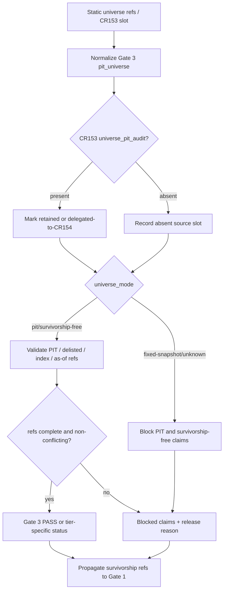

# LLD: CR154-S04 - Gate 3 PIT Universe and Survivorship Gate

> This document is CP5 design evidence only. It does not authorize source implementation, test implementation, real universe construction, provider fetch, lake/NAS read/write, runtime execution, broker/feed/reconciliation/store/catalog/registry access, publishing, or credential / `.env` reads.

## 0. 上游设计依据

| 来源 | 路径 / ID | 被本 LLD 消费的内容 |
|---|---|---|
| Story | `process/stories/CR154-S04-pit-universe-survivorship-gate.md` | Scope, acceptance criteria, file ownership and no-real-universe boundary. |
| HLD | `process/docs/design/HLD-CROSS-STRATEGY-PRODUCTION-RELIABILITY-GATES.md` | Gate 3 fields, CR153 `universe_pit_audit` compatibility lifecycle, tier table and no-runtime boundary. |
| ADR | `process/docs/design/ARCHITECTURE-DECISION-CROSS-STRATEGY-PRODUCTION-RELIABILITY-GATES.md` | ADR-CR154-003 CR153 slot compatibility, shared PIT ownership and first-wave no-deletion rule. |
| Feature Matrix | `process/docs/design/FEATURE-DESIGN-MATRIX.md` | CR154-S04 full-lld policy and first-wave requirement to retain CR153 slot as delegated source. |
| Feature DESIGN | `process/docs/features/cross-strategy-reliability-gates/DESIGN.md` | FEAT-15 Gate 3 requirement and integration contract with CR153 event gate. |
| Feature TEST-PLAN | `process/docs/features/cross-strategy-reliability-gates/TEST-PLAN.md` | Required Gate 3 fixture cases: PIT pass, non-PIT blocked, CR153 slot delegated and CR153 slot absent blocked claim. |
| Feature TASKS | `process/docs/features/cross-strategy-reliability-gates/TASKS.md` | `CR154-T04` design task and future implementation file anchors. |
| Development Plan | `process/DEVELOPMENT-PLAN-CR154.yaml` | Wave W2 dependency on S01, file ownership, shared merge rule and no implementation authorization. |

## 1. Goal

Define Gate 3 as the shared PIT universe and survivorship-free release gate for CR154, including the lifecycle of CR153 `universe_pit_audit` as retained source evidence, delegated-to-CR154 compatibility slot and later-deprecation candidate.

The design must block survivorship-free, full-history, production-like and release-ready universe claims when PIT / survivorship evidence is missing or non-PIT, while preserving the first-wave rule that CR154 does not build, fetch, read, write or publish real universe data and does not delete the CR153 slot.

## 2. Requirements（Functional / Non-Functional）

### 2.1 Functional

- Gate 3 MUST expose a shared `pit_universe` / `survivorship_gate` section under the CR154 reliability gate summary.
- Gate 3 MUST represent PIT universe evidence as explicit refs and statuses, not as live universe construction or real data validation.
- Gate 3 MUST define `universe_mode` values covering `pit`, `survivorship-free`, `fixed-snapshot`, `unknown` and artifact-level `n/a-with-reason`.
- Gate 3 MUST include source refs for PIT universe, available-at / as-of audit, delisted inclusion and index membership PIT evidence when applicable.
- Gate 3 MUST preserve CR153 `universe_pit_audit` as a first-wave source/adapter slot.
- Gate 3 MUST allow CR153 to mark that slot `delegated-to-CR154` when the CR154 summary is present.
- Gate 3 MUST define a later-deprecation path for the CR153 slot, but first-wave CR154 MUST NOT delete it or remove its semantics.
- Missing or non-PIT universe evidence MUST block survivorship-free, full-history and production-like claims.
- Gate 3 blocked states MUST propagate into Gate 1 as `survivorship_audit_refs`, `blocked_claims` and `release_blocking_reason` inputs.
- If CR153 `universe_pit_audit` and CR154 Gate 3 disagree, CR154 owns release wording; the CR153 slot remains as conflicting source evidence and release-like claims are blocked until resolved.

### 2.2 Non-Functional

- Safety: implementation MUST remain local/static/fixture-only and MUST NOT read `.env`, credentials, real lake, NAS, provider, runtime, broker, feed, store, catalog or registry.
- Compatibility: CR153 first-wave event strategy semantics remain source evidence; no first-wave deletion, renaming-away or silent deprecation is allowed.
- Auditability: missing universe evidence, non-PIT universe mode and CR153/CR154 conflicts MUST become explicit blocked claims or release-blocking reasons.
- Determinism: the evaluator MUST use fixture/static refs and MUST NOT discover symbols, constituents, delisting events or index members from real data.
- Extensibility: later CRs MAY build real PIT universe validation or deprecate CR153 local slot only after separate authorization and migration evidence.

## 3. 模块拆分与职责

| 模块 / 文件组 | 职责 | 说明 |
|---|---|---|
| `engine/cross_strategy_reliability_gates.py` | Define Gate 3 field model, PIT/survivorship status evaluation, blocked claims, conflict handling and Gate 1 propagation payload. | S04 owns the shared Gate 3 release semantics. S01 owns base schema. S07 owns final tier mode. |
| `engine/event_strategy_contracts.py` | Compatibility reference only: keep CR153 `universe_pit_audit` slot semantics available for adapter/source refs. | S04 does not delete this slot in CR154 first wave. Any later deprecation needs a new CR and migration evidence. |
| `tests/research/test_cross_strategy_reliability_gates.py` | Add Gate 3 fixture cases for PIT pass, non-PIT blocked, CR153 delegated source and CR153 absent/conflict blockers. | Test implementation is future CP6 work; this LLD defines planned cases. |
| CR153 event adapter boundary | Provide `universe_pit_audit` as retained source evidence and optional `delegated-to-CR154` lifecycle marker. | CR153 owns event-specific source ref; CR154 owns shared release-blocking wording. |
| Gate 1 propagation boundary | Receive Gate 3 survivorship audit status, refs and blockers. | Coordinated with S02 cross-gate propagation expectations. |
| Admission / wording boundary | Consume Gate 3 blocked claims for T1/T2/T3 wording. | S07/S08 own final tier resolution and wording; S04 provides deterministic reasons. |

## 4. 代码结构与文件影响范围

| 动作 | 文件路径 | 变更内容 |
|---|---|---|
| 修改 | `engine/cross_strategy_reliability_gates.py` | Add Gate 3 PIT universe / survivorship-free section, CR153 source-slot lifecycle mapping, status derivation, conflict handling and blocked-claim generation hooks. |
| 修改 | `engine/event_strategy_contracts.py` | Compatibility reference only after CP5: retain or annotate `universe_pit_audit` source slot semantics so CR154 can consume it; no deletion in first wave. |
| 修改 | `tests/research/test_cross_strategy_reliability_gates.py` | Add Gate 3 fixture cases for PIT pass, non-PIT blocked, CR153 delegated source, CR153 absent source and CR153/CR154 conflict. |

No real universe data files, lake paths, provider connectors, catalog pointers, registry entries, runtime configuration, environment files or credentials are in scope for S04.

## 5. 数据模型与持久化设计

No persistent storage, real universe dataset, lake table, NAS artifact, provider-backed object, catalog pointer or registry entry is added. The model is in-memory / serialized fixture data only.

| 对象 / 字段 | 类型 | 约束 | 说明 |
|---|---|---|---|
| `pit_universe` | object / mapping | Required Gate 3 section when reliability gates evaluate universe claims. | Nested under shared CR154 gate summary from S01. |
| `universe_mode` | enum | `pit`, `survivorship-free`, `fixed-snapshot`, `unknown`; artifact-level n/a uses `n/a-with-reason`. | `fixed-snapshot` cannot support PIT/survivorship-free claims by itself. |
| `universe_pit_ref` | evidence ref or missing-evidence marker | Required for PIT / survivorship-free / production-like claims. | May point to CR153 `universe_pit_audit` source slot in first wave. |
| `universe_pit_audit_lifecycle` | enum | `retained`, `delegated-to-CR154`, `later-deprecation`. | Lifecycle of the CR153 slot, not a deletion command. |
| `available_at_audit_ref` | evidence ref or `n/a-with-reason` | Required when available-at / as-of timing is part of the universe claim. | Ref only; no real data read. |
| `as_of_policy_ref` | evidence ref or `n/a-with-reason` | Required when as-of membership semantics are claimed. | Supports PIT decision-time semantics. |
| `delisted_inclusion_ref` | evidence ref or blocker | Required for survivorship-free claims involving historical stock universes. | Missing ref blocks survivorship-free wording. |
| `index_member_pit_ref` | evidence ref or `n/a-with-reason` | Required when benchmark or universe claims depend on index membership. | No index constituent fetch is authorized. |
| `survivorship_bias_status` | enum | `PASS`, `FAIL`, `NEEDS_REVIEW`, `BLOCKED`; artifact-level n/a requires reason. | Shared status vocabulary from S01. |
| `cr153_slot_status` | enum | `absent`, `present-source`, `delegated-to-CR154`, `conflict`, `later-deprecation-candidate`. | Represents compatibility lifecycle without deleting CR153 field. |
| `blocked_claims` | list | Required when universe evidence blocks claims. | At minimum covers survivorship-free, full-history, PIT, production-like and release-ready claims as applicable. |
| `release_blocking_reason` | string / ref | Required whenever Gate 3 is release-blocking. | Final release mode resolved by S07. |

## 6. API / Interface 设计

| 接口 / 入口 | 输入 | 输出 | 调用方 | 说明 |
|---|---|---|---|---|
| `evaluate_pit_universe_gate(...)` | Shared gate context from S01, release profile / tier inputs from S07, universe refs and optional CR153 source slot. | Gate 3 status, PIT/survivorship refs, blocked claims, conflict markers and release-blocking reason candidate. | CR154 shared gate evaluator. | Pure function; no real universe construction or read. Tested by S04 fixtures. |
| `map_cr153_universe_pit_audit(...)` | CR153 `universe_pit_audit` source slot, lifecycle marker and event strategy context. | Gate 3 `universe_pit_ref`, `cr153_slot_status` and source metadata. | Event-driven adapter. | Retains CR153 slot as source evidence and allows `delegated-to-CR154`. |
| `derive_survivorship_blocked_claims(...)` | `universe_mode`, PIT refs, delisted/index refs, conflict status and tier context. | Deterministic blocked claim list and release-blocking reason candidate. | Gate 3 evaluator / S07 wording consumer. | Blocks claims instead of silently downgrading universe evidence. |
| Gate 1 propagation hook | Gate 3 status, `universe_pit_ref`, `delisted_inclusion_ref`, `index_member_pit_ref`, blocked claims and conflict reason. | Gate 1 `survivorship_audit_refs`, blocked claims and release-blocking reason inputs. | S02 Gate 1 evaluator. | Contract-level handoff only; exact aggregation is coordinated in S02. |
| CR153 compatibility marker | Existing CR153 slot plus CR154 summary presence. | `retained` or `delegated-to-CR154`; later `later-deprecation` only in future CR. | CR153 compatibility consumer. | First wave cannot delete CR153 slot. |

Each interface above has at least one planned test entry in section 10.

## 7. 核心处理流程

1. Receive static universe evidence refs and optional CR153 `universe_pit_audit` source slot.
2. Normalize the CR153 slot into Gate 3 source metadata, retaining its first-wave semantics.
3. Determine `universe_mode` from explicit fixture/static metadata only.
4. Validate `universe_pit_ref`, available-at / as-of refs, delisted inclusion refs and index membership refs based on the claims being made.
5. If `universe_mode` is `pit` or `survivorship-free` and required refs are present, emit `PASS` or tier-specific status.
6. If `universe_mode` is `fixed-snapshot`, `unknown`, missing or conflicting with the claimed wording, emit blocked claims for survivorship-free / full-history / production-like wording.
7. If CR153 slot is absent, retain absence as evidence and block PIT/survivorship-free event claims unless another explicit PIT source ref is present.
8. If CR153 slot conflicts with CR154 Gate 3, CR154 owns release wording, blocks release-like claims and records CR153 as conflicting evidence.
9. Propagate survivorship audit refs and blockers to Gate 1 so the statistical reliability gate cannot appear clean while universe evidence is blocked.

## 8. 技术设计细节

- First-wave CR153 lifecycle states:
  - `retained`: CR153 `universe_pit_audit` exists and remains event-specific source evidence.
  - `delegated-to-CR154`: CR153 slot points to or is represented by CR154 Gate 3 for shared release wording; CR153 does not make an independent conflicting PIT policy decision.
  - `later-deprecation`: documentation-only candidate state for a future CR after migration evidence proves all CR153 consumers use CR154. It is not active deletion in CR154 first wave.
- CR154 owns shared Gate 3 release-blocking wording. CR153 owns event-specific source ref semantics.
- First wave forbids deleting, renaming-away or making CR153 `universe_pit_audit` unreachable. `engine/event_strategy_contracts.py` is compatibility reference only.
- `fixed-snapshot` may be valid for some exploratory analysis, but it cannot support `pit`, `survivorship-free`, `full-history-ready`, `production-like` or `release-ready` claims without blocked wording.
- `unknown` universe mode is fail-closed for release-like profiles.
- Missing `delisted_inclusion_ref` blocks survivorship-free claims because excluding delisted / removed securities is a classic survivorship-bias path.
- Missing `index_member_pit_ref` blocks index-member PIT claims where benchmark or universe membership depends on index constituents.
- CR153/CR154 conflicts are not resolved by choosing the more optimistic status. They produce a blocking reason until the source evidence is reconciled.
- Gate 3 supplies `survivorship_audit_refs` to Gate 1 propagation. S02 owns the full Gate 1 aggregation, but S04 owns the source status and claim blockers.
- Diagram type: flowchart, because the lifecycle and failure paths branch by source slot presence and universe mode.

## 9. 安全与性能设计

| 维度 | 设计措施 | 验证方式 |
|---|---|---|
| Safety | Gate 3 consumes only explicit static refs. It never constructs, fetches, reads, writes, publishes or validates real universe data. | Static review plus fixture tests; CP6/CP7 command review must show no `.env`, lake, NAS, provider, runtime, broker, feed, store, catalog or registry access. |
| Compatibility | CR153 `universe_pit_audit` remains retained/delegated source evidence in first wave; no deletion is allowed. | Fixture asserts CR153 delegated source is preserved; file diff review ensures no first-wave deletion. |
| Auditability | Non-PIT, missing, absent and conflicting universe evidence produces blocked claims and source-gate-qualified reasons. | Fixture assertions inspect `blocked_claims`, `cr153_slot_status` and `release_blocking_reason`. |
| Performance | Evaluation is pure and O(number of static refs). | No benchmark required; deterministic unit fixture is enough. |
| Authorization | Later real PIT universe construction or CR153 slot deprecation requires a separate CR / human gate. | CP5/CP6 scope review and LLD DoD. |

## 10. 测试设计

| 测试场景 | 前置条件 | 操作 | 预期结果 | 验证方式 |
|---|---|---|---|---|
| PIT universe pass | Static fixture includes `universe_mode=pit`, `universe_pit_ref`, as-of / available-at ref and required delisted/index refs for claimed wording. | Call `evaluate_pit_universe_gate(...)`. | `survivorship_bias_status=PASS`; no Gate 3 blocked claims. | `tests/research/test_cross_strategy_reliability_gates.py` Gate 3 pass case. |
| Non-PIT fixed snapshot blocked | Fixture has `universe_mode=fixed-snapshot` while release wording claims PIT / survivorship-free readiness. | Evaluate Gate 3. | PIT, survivorship-free and production-like universe claims are blocked. | Unit fixture assertion on `blocked_claims`. |
| Unknown universe mode fail-closed | Fixture has `universe_mode=unknown` for admission / release-like profile. | Evaluate Gate 3. | Status is `BLOCKED` or tier-specific fail-closed result; no silent PASS. | Negative fixture. |
| Missing `universe_pit_ref` blocks survivorship-free claims | Fixture omits PIT source ref while making survivorship-free / full-history claim. | Evaluate Gate 3. | `survivorship_bias_status=BLOCKED`; release reason names missing PIT universe ref. | Unit fixture assertion. |
| Missing delisted inclusion ref blocks survivorship-free wording | Fixture has PIT ref but no delisted / removed security inclusion evidence for historical universe claim. | Evaluate Gate 3. | Survivorship-free claim is blocked or needs review only where S07 permits; reason is explicit. | Negative fixture. |
| CR153 slot delegated to CR154 | Fixture includes CR153 `universe_pit_audit` source slot and CR154 summary presence. | Map through `map_cr153_universe_pit_audit(...)`. | `cr153_slot_status=delegated-to-CR154`; CR153 source ref is retained; Gate 3 owns release wording. | Adapter fixture. |
| CR153 slot absent with no alternate PIT source | Event-driven fixture omits `universe_pit_audit` and alternate PIT source. | Evaluate event adapter and Gate 3. | Event PIT/survivorship-free claims are blocked; absence is recorded as source evidence. | Event adapter negative fixture. |
| CR153/CR154 conflict blocks release-like claims | Fixture has CR153 source indicating PIT pass but CR154 Gate 3 normalized refs indicate non-PIT / missing required ref, or vice versa. | Evaluate Gate 3. | `cr153_slot_status=conflict`; CR154 release wording blocks release-like claims and records conflict. | Conflict fixture. |
| Gate 1 propagation receives survivorship blockers | Gate 3 fixture produces non-PIT or missing evidence blocked state. | Invoke Gate 1 propagation hook in shared evaluator fixture. | Gate 1 includes `survivorship_audit_refs` and blocked claims; statistical reliability cannot appear clean. | Cross-gate fixture coordinated with S02. |
| Forbidden operation counter blocks | Fixture contains nonzero forbidden operation counter from shared skeleton. | Evaluate Gate 3 through shared evaluator. | Result is `BLOCKED` regardless of universe refs. | Shared safety regression fixture. |

## 11. 实施步骤

| TASK-ID | 动作 | 目标文件 | 详细描述 | 对应测试 |
|---|---|---|---|---|
| CR154-T04-01 | 修改 | `engine/cross_strategy_reliability_gates.py` | Add Gate 3 `pit_universe` fields for universe mode, PIT refs, as-of / available-at refs, delisted / index membership refs, status, CR153 lifecycle and blocked claims. | PIT universe pass; non-PIT fixed snapshot blocked; missing PIT ref. |
| CR154-T04-02 | 修改 | `engine/cross_strategy_reliability_gates.py` | Add `map_cr153_universe_pit_audit(...)` or equivalent adapter mapping that marks CR153 source slot `retained` / `delegated-to-CR154` / `conflict` without deleting it. | CR153 slot delegated; CR153 slot absent; CR153/CR154 conflict. |
| CR154-T04-03 | 修改 | `engine/cross_strategy_reliability_gates.py` | Add deterministic blocked-claim derivation for PIT, survivorship-free, full-history, production-like and release-ready universe wording. | Non-PIT blocked; missing delisted inclusion; unknown universe mode. |
| CR154-T04-04 | 修改 | `engine/cross_strategy_reliability_gates.py` | Add Gate 1 propagation payload for `survivorship_audit_refs`, missing evidence and conflict blockers. | Gate 1 propagation receives survivorship blockers. |
| CR154-T04-05 | 修改 | `engine/event_strategy_contracts.py` | Retain / annotate CR153 `universe_pit_audit` compatibility semantics as source evidence for CR154; do not delete the slot in first wave. | CR153 slot delegated; compatibility review. |
| CR154-T04-06 | 修改 | `tests/research/test_cross_strategy_reliability_gates.py` | Add deterministic static fixtures for PIT pass, non-PIT blocked, CR153 delegated source, absent source, conflict and forbidden operation counter. | All S04 test scenarios. |

Every file impact item in section 4 is covered by at least one TASK-ID.

## 12. 风险、难点与预研建议

### 12.1 实现灰区与取舍记录

No blocking LCQ is required for this Story. The HLD, ADR, Feature DESIGN and Story card already decide the required lifecycle and first-wave boundary:

- CR153 `universe_pit_audit` is retained as first-wave source evidence.
- CR153 may delegate shared release wording to CR154.
- Later deprecation is only a future lifecycle candidate and is forbidden as a first-wave deletion.
- CR154 first wave does not build, fetch, read, write or publish real universe data.

| Clarification ID | 问题 | 选项与推荐 | 决策 / 答案 | 影响面 | 证据 | 重访条件 |
|---|---|---|---|---|---|---|
| N/A | No blocking implementation gray area. | N/A | Use approved HLD/ADR defaults. | Interface / files / tests / compatibility / cross Story contract. | HLD §9, ADR-CR154-003, Feature DESIGN Gate 3 requirement, Story S04 acceptance criteria. | Revisit if CP5 reviewer authorizes CR153 slot deletion or real universe validation, which would require a new CR / authorization gate. |

| 风险 / 难点 | 影响 | 缓解措施 / 预研建议 |
|---|---|---|
| First-wave CR153 slot deletion by accident | Breaks CR153 compatibility and violates HLD/ADR. | Treat `engine/event_strategy_contracts.py` as compatibility reference only; S04 forbids deletion in first wave. |
| Fixture PIT refs mistaken for real universe proof | Release wording could overclaim production readiness. | Blocked / allowed wording must state refs are static fixture evidence only; real universe validation requires future authorization. |
| CR153/CR154 duplicate owner conflict | Users may see contradictory PIT status. | CR154 owns shared release wording; CR153 remains source evidence; conflict blocks release-like claims. |
| Gate 3 blocker not visible in Gate 1 | Statistical gate could appear clean despite survivorship risk. | S04 emits propagation payload; S02 fixture must assert Gate 1 receives survivorship blockers. |
| Later-deprecation state misused as immediate deletion | First wave could silently remove compatibility. | `later-deprecation` is documentation-only candidate until future migration evidence and CR approval. |

### OPEN / Spike 跟踪

| ID | 类型（OPEN / Spike） | 问题 | 下一动作 | 责任方 |
|---|---|---|---|---|
| N/A | N/A | No OPEN / Spike for S04 CP5 design. | N/A | N/A |

## 13. 回滚与发布策略

- Release approach: deliver as part of the unified CR154 CP5 design-evidence batch. Implementation may start only after all target Story design evidence is confirmed and Wave / dependency / file ownership gates permit it.
- Rollback trigger: CP5 reviewer rejects CR153 lifecycle semantics, S01 changes shared status/ref shape incompatibly, S02 changes Gate 1 survivorship propagation contract, or S07 changes tier policy in a way that invalidates S04 blocker assumptions.
- Rollback action: keep this LLD unconfirmed, revise Gate 3 lifecycle / fields / propagation, and resubmit through CP5. No source rollback is needed because this task does not implement source or tests.
- CR153 slot rollback: if future implementation accidentally deletes or weakens `universe_pit_audit`, revert only that S04-scoped change before CP6; first wave must retain the slot.
- Runtime / data release: not applicable. CR154 S04 never authorizes real universe construction, provider fetch, lake/NAS read/write, runtime, broker/feed/reconciliation/store/catalog/registry access or publish.

## 14. Definition of Done

- [x] 14 sections are filled for the S04 full LLD.
- [x] Gate 3 PIT universe and survivorship-free fields are defined.
- [x] CR153 `universe_pit_audit` lifecycle covers `retained`, `delegated-to-CR154` and `later-deprecation`.
- [x] First-wave deletion of CR153 slot is forbidden.
- [x] No real universe construction, fetch, read, write or publish is authorized.
- [x] Missing / non-PIT universe evidence blocks survivorship-free, full-history and production-like claims.
- [x] Gate 1 survivorship propagation is specified.
- [x] File impact scope is limited to `engine/cross_strategy_reliability_gates.py`, `engine/event_strategy_contracts.py` compatibility reference and `tests/research/test_cross_strategy_reliability_gates.py`.
- [x] Test scenarios cover PIT pass, non-PIT blocked, CR153 delegated source, absent source and conflict.
- [x] Security boundary forbids `.env`, credentials, real lake/NAS/provider/runtime/broker/feed/store/catalog/registry access and publish.
- [x] No OPEN / LCQ blocks this LLD.
- [x] `confirmed=false`; implementation is not authorized before unified CP5 approval.

## 人工确认区

> **CP5 - Story Design Evidence Implementability Gate**
> host-orchestrator should include this LLD in the unified CR154 CP5 batch. Approval of this document alone does not authorize implementation until the whole batch is confirmed and Wave / dependency / file ownership gates are satisfied.

**CP5 checklist 摘要**：

| # | 检查项 | 状态 | 证据 |
|---|---|---|---|
| 1 | LLD 覆盖 AC | ready-for-review | Sections 2, 5, 8, 10, 14. |
| 2 | 与 HLD / ADR 一致 | ready-for-review | Sections 0, 3, 8, 12. |
| 3 | 文件影响范围明确 | ready-for-review | Sections 4 and 11. |
| 4 | 接口契约完整 | ready-for-review | Section 6. |
| 5 | 测试与 dev_gate 可计算 | ready-for-review | Section 10. |
| 6 | clarification queue 已收敛 | ready-for-review | Section 12.1: no LCQ / OPEN. |

**人工审查结果回填**：

- 结论：`approved | changes_requested | rejected`
- 审查人：
- 审查时间：
- 修改意见：
- 风险接受项：
