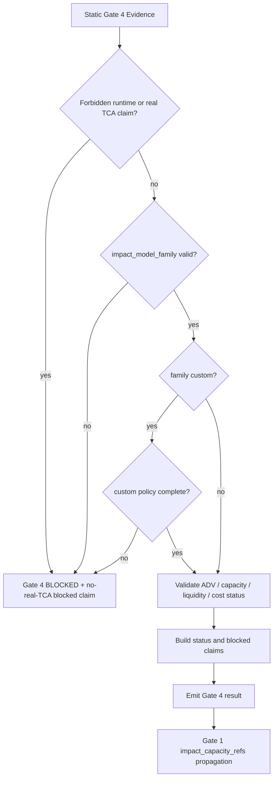

# LLD: CR154-S05 — Gate 4 Capacity, Impact and Liquidity Contract

## 0. 上游设计依据

| 来源 | 路径 / ID | 被本 LLD 消费的内容 |
|---|---|---|
| Story | `process/stories/CR154-S05-capacity-impact-liquidity-contract.md` | ADV participation、capacity dollars、liquidity sizing refs、cost-underestimation status、impact enum、no-real-TCA 边界、文件所有权。 |
| HLD | `process/docs/design/HLD-CROSS-STRATEGY-PRODUCTION-RELIABILITY-GATES.md` | Gate 4 字段语义、`custom` impact model 约束、Gate 6 tier wording、REQ-077 / REQ-136 映射、FT-CR154-CP5-002/003 follow-through hooks。 |
| ADR | `process/docs/design/ARCHITECTURE-DECISION-CROSS-STRATEGY-PRODUCTION-RELIABILITY-GATES.md` | ADR-CR154-004 controlled `impact_model_family` enum and no real TCA；ADR-CR154-006 no-runtime/no-real-data boundary。 |
| Feature Matrix | `process/docs/design/FEATURE-DESIGN-MATRIX.md` | CR154-S05 属于 FEAT-15，`lld_policy.required_level=full-lld`，CP5 需审查 S05 设计证据。 |
| Feature DESIGN | `process/docs/features/cross-strategy-reliability-gates/DESIGN.md` | Gate 4 必须定义 ADV participation、capacity dollars、cost-underestimation status、liquidity sizing refs、impact enum 和 Gate 3/4 到 Gate 1 的 propagation。 |
| Feature TEST-PLAN | `process/docs/features/cross-strategy-reliability-gates/TEST-PLAN.md` | S05 fixture 必须覆盖 allowed enum、custom rationale、invalid enum、cost-underestimation blocked、no-real-TCA wording。 |
| Feature TASKS | `process/docs/features/cross-strategy-reliability-gates/TASKS.md` | `CR154-T05` 是本 Story 的设计任务；未来实现候选文件是 `engine/cross_strategy_reliability_gates.py` 与 `tests/research/test_cross_strategy_reliability_gates.py`。 |
| Development Plan | `process/DEVELOPMENT-PLAN-CR154.yaml` | W2 gate policies 可并行 LLD；实现阶段 shared file 合并必须串行；不授权源码实现、测试实现或真实数据/runtime/broker/TCA。 |

## 1. Goal

为 CR154 Gate 4 定义可实现的 capacity、market impact 与 liquidity sizing 合同，使多因子、ML、事件驱动策略可以用统一字段表达 ADV participation、capacity dollars、impact model family、liquidity sizing、cost underestimation 和 blocked claims，同时明确 first wave 只提供 local/static/fixture-only 证据，不声明真实 TCA、真实执行回放、真实订单簿、真实 fill 或 broker 校准。

## 2. Requirements（Functional / Non-Functional）

### 2.1 Functional

- 定义 Gate 4 evidence section，包含 `adv_participation_ref`、`adv_participation_status`、`capacity_dollars_ref`、`capacity_dollars_status`、`liquidity_sizing_refs`、`liquidity_sizing_status`、`cost_underestimation_status`、`impact_model_family`、`impact_model_ref`、`no_real_tca_claim`、`blocked_claims`、`release_blocking_reason`。
- `impact_model_family` 必须是受控枚举：`square_root`、`almgren_chriss`、`gatheral`、`custom`、`n/a-with-reason`。
- `custom` 必须携带 `custom_model_name`、`method_rationale`、`input_refs`、`validation_boundary`、`release_wording_limit`；缺一即无效。
- `n/a-with-reason` 必须携带 `n/a_reason`、`claim_limit` 与 owner/trigger；不能用空字符串或泛化文本绕过容量/影响证据。
- 缺少 ADV participation、capacity dollars 或 liquidity sizing evidence 时，必须按 release profile 映射为 `NEEDS_REVIEW` 或 `BLOCKED`，并写入 blocked claims，至少阻断 `scalable_capacity_claim`、`production_capacity_claim`、`real_tca_claim`、`execution_ready_claim`。
- Gate 4 `BLOCKED` 必须可传播到 Gate 1 `impact_capacity_refs`、Gate 1 `blocked_claims` 与共享 `release_blocking_reason`；传播机制由 S02/S05/S07 合并实现时对齐，但本 Story 必须定义 Gate 4 输出契约。
- `no_real_tca_claim` 必须为 true 或等价显式声明；若 evidence 试图表达真实 TCA、broker fill、order book、execution replay 或 runtime calibration，Gate 4 必须 `BLOCKED`。
- 未来实现只读取调用方传入的静态 fixture/metadata 对象，不访问 lake、NAS、provider、runtime、broker、feed、store、catalog、registry 或凭据。

### 2.2 Non-Functional

- 安全：禁止读取 `.env`、凭据、真实 lake/NAS/provider/runtime/broker/feed/store/catalog/registry；禁止真实 TCA 或交易就绪声明。
- 可审计：所有缺失证据必须变成结构化 status、n/a reason、blocked claim 或 release-blocking reason，不能静默省略。
- 兼容：不替换 CR151/CR152/CR153 已有 gate 结论；只新增 CR154 shared reliability summary 的 Gate 4 section。
- 可测试：每个接口规则都必须能用 local/static fixture 覆盖，不依赖真实市场数据或外部服务。
- 可扩展：允许未来授权 CR 增加真实 TCA 校准，但 first wave 字段必须通过 `no_real_tca_claim` 与 wording limit 隔离。

## 3. 模块拆分与职责

| 模块 / 文件组 | 职责 | 说明 |
|---|---|---|
| `engine/cross_strategy_reliability_gates.py` Gate 4 data contracts | 定义 capacity/impact/liquidity evidence 对象、impact enum、custom policy、status/blocked claim 映射。 | 本 Story 只拥有 Gate 4 section；S01 拥有共享 skeleton，S02 拥有 Gate 1 artifact 汇总，S07 拥有 tier resolver。 |
| `engine/cross_strategy_reliability_gates.py` Gate 4 evaluator helpers | 校验 enum、refs、n/a reason、custom 必填字段、no-real-TCA 边界，并输出 Gate 4 status。 | 不访问外部数据；只处理已传入的 dict/dataclass/fixture。 |
| `tests/research/test_cross_strategy_reliability_gates.py` Gate 4 fixture cases | 覆盖 enum、custom、invalid enum、missing refs、cost-underestimation、no-real-TCA wording 与 forbidden operation counter。 | 测试实现不在 CP5 设计阶段写入，CP6 后按本 LLD 实现。 |
| CR154 shared gate summary | 消费 Gate 4 status、blocked claims 与 release-blocking reason。 | 由 S01/S07 合并实现；本 Story 定义 Gate 4 输出字段和传播输入。 |

## 4. 代码结构与文件影响范围

| 动作 | 文件路径 | 变更内容 |
|---|---|---|
| 修改 | `engine/cross_strategy_reliability_gates.py` | 增加 Gate 4 capacity/impact/liquidity evidence contract、`ImpactModelFamily` enum、custom validation、n/a validation、Gate 4 status evaluation、blocked claim creation 和 no-real-TCA guard。 |
| 修改 | `tests/research/test_cross_strategy_reliability_gates.py` | 增加 Gate 4 fixture tests：枚举合法值、非法值、custom 缺字段、missing capacity refs、cost underestimation blocked、no-real-TCA wording、Gate 4 blocked claim 输出。 |

## 5. 数据模型与持久化设计

无新增持久化变更；本 Story 只定义内存对象 / JSON-safe fixture contract。

| 对象 / 字段 | 类型 | 约束 | 说明 |
|---|---|---|---|
| `ImpactModelFamily` | enum / literal string | `square_root`、`almgren_chriss`、`gatheral`、`custom`、`n/a-with-reason` | 禁止 free text；序列化值必须稳定。 |
| `EvidenceRef` | shared object from S01 | `artifact_type`、`ref`、`source_cr`、`owner_gate`、`status`、`n/a_reason` | Gate 4 使用 S01 shared ref shape；本 Story不重定义 shared base。 |
| `adv_participation_ref` | `EvidenceRef | None` | 缺失时必须产生 status 和 blocked claim，或明确 `n/a-with-reason`。 | 表达 ADV participation assumption evidence，不证明真实 ADV。 |
| `adv_participation_status` | status enum | `PASS`、`FAIL`、`NEEDS_REVIEW`、`BLOCKED`、artifact-level `n/a-with-reason` | 缺少证据且有 capacity/scalable claim 时不得 PASS。 |
| `capacity_dollars_ref` | `EvidenceRef | None` | 可为 estimate ref 或 `n/a-with-reason`，不能宣称真实容量校准。 | 表达 capacity dollars estimate evidence。 |
| `capacity_dollars_status` | status enum | 同上 | 生产/scale wording 缺失时 `BLOCKED`。 |
| `liquidity_sizing_refs` | list of `EvidenceRef` | 空列表必须带 reason；每个 ref 标明 liquidity metric scope。 | 可包含 turnover、ADV、position size、holding period 或 strategy-defined sizing refs。 |
| `liquidity_sizing_status` | status enum | 同上 | 汇总 liquidity sizing evidence 完整性。 |
| `cost_underestimation_status` | status enum | `PASS` 表示 evidence 未低估或 claim 已限制；`NEEDS_REVIEW`/`BLOCKED` 表示 commission/tax/slippage-only 可能低估。 | 不能把 commission/tax/slippage-only 当作真实 market impact。 |
| `impact_model_family` | `ImpactModelFamily` | 必填；`n/a-with-reason` 需要 reason。 | HLD/ADR 受控 enum。 |
| `impact_model_ref` | `EvidenceRef | None` | `square_root`/`almgren_chriss`/`gatheral`/`custom` 时必填；`n/a-with-reason` 时可空但需 reason。 | 指向模型参数/config/fixture evidence。 |
| `custom_model_policy` | object | `custom_model_name`、`method_rationale`、`input_refs`、`validation_boundary`、`release_wording_limit` 全必填。 | 仅 `custom` 使用；仍不证明真实 TCA。 |
| `no_real_tca_claim` | bool / statement | first wave 必须为 true 或等价声明；false/缺失为 `BLOCKED`。 | 释放措辞边界字段。 |
| `blocked_claims` | list | 每个 claim 包含 id、reason、source_gate、release wording impact、unlock condition。 | 至少覆盖 capacity/scalability/real-TCA/execution-ready overclaims。 |
| `release_blocking_reason` | string / ref | Gate 4 release-blocking 时必填。 | 供 Gate 6 和 admission summary 消费。 |

## 6. API / Interface 设计

| 接口 / 入口 | 输入 | 输出 | 调用方 | 说明 |
|---|---|---|---|---|
| `ImpactModelFamily` serialization | raw string | enum value or validation error | Gate 4 evaluator、fixture loader | 仅允许 5 个枚举值；测试 T-G4-01/T-G4-02 覆盖。 |
| `validate_gate4_capacity_impact(evidence, policy_context)` | Gate 4 evidence object；strategy class、release profile、claim set | Gate 4 result: status、refs、blocked claims、release_blocking_reason | shared gate evaluator / S07 tier resolver | 本 Story 的核心 contract；不访问外部系统；测试 T-G4-03 到 T-G4-08 覆盖。 |
| `validate_custom_impact_model(custom_policy)` | custom fields | PASS or validation error / blocked reason | Gate 4 evaluator | `custom` 专用；测试 T-G4-03 覆盖。 |
| `build_gate4_blocked_claims(gate4_result, policy_context)` | Gate 4 status + claims requested | blocked claim list | Gate 1 propagation、Gate 6 wording | 输出给 S02/S07 消费；测试 T-G4-06/T-G4-07 覆盖。 |
| `gate4_to_gate1_impact_capacity_ref(gate4_result)` | Gate 4 result | Gate 1 `impact_capacity_refs` compatible summary | Gate 1 artifact aggregation | S02 最终拥有 Gate 1 汇总；本接口定义 S05 输出形状；测试 T-G4-08 覆盖。 |

## 7. 核心处理流程

1. 接收调用方提供的 static Gate 4 evidence 与 policy context；如果出现 forbidden operation marker 或 runtime/broker/TCA claim，立即标记 `BLOCKED`。
2. 校验 `impact_model_family` 是否属于受控枚举；非法值产生 validation failure 与 blocked claim。
3. 若 family 为 `custom`，校验 custom policy 的五个必填字段；缺失时 `BLOCKED`。
4. 若 family 为 `n/a-with-reason`，校验 `n/a_reason`、claim limit 与 owner/trigger；缺失 reason 时 `BLOCKED` 或 `NEEDS_REVIEW`，由 release profile 决定。
5. 校验 ADV participation、capacity dollars、liquidity sizing refs 与 cost-underestimation status；按 claim set 和 tier context 生成 Gate 4 status。
6. 将缺失或不足 evidence 转为 blocked claims，并设置 `release_blocking_reason`。
7. 生成 Gate 1 可消费的 `impact_capacity_refs` summary，保证 Gate 4 `BLOCKED` 不会在 Gate 1 中显示为 clean。



## 8. 技术设计细节

- 关键规则：
  - `impact_model_family` 使用 literal/enum，不允许自由文本、大小写漂移或 alias。
  - `square_root`、`almgren_chriss`、`gatheral` 表示采用该 model family 的 static contract，不表示参数经过真实市场或交易执行校准。
  - `custom` 是受控扩展，不是绕过路径；必须写清 model name、method rationale、input refs、validation boundary 和 release wording limit。
  - `n/a-with-reason` 只在 claim set 不请求 capacity/scalable/real-TCA/execution-ready wording，或 tier policy 显式允许时可通过；否则产生 blocked claim。
  - `cost_underestimation_status` 必须阻止把 commission/tax/slippage-only evidence 包装成完整 market impact 或 real TCA。
  - `no_real_tca_claim` 缺失、false 或 wording 与之矛盾时 Gate 4 直接 `BLOCKED`。
- 依赖选择与复用点：
  - 复用 S01 shared status、evidence ref、blocked claim、forbidden operation counter。
  - 输出 `impact_capacity_refs` 给 S02 Gate 1 artifact aggregation；不在本 Story 实现 Gate 1 汇总规则。
  - 输出 status/reasons 给 S07 tier resolver；不在本 Story实现 tier table。
- 兼容性处理：
  - 对 CR151/CR152/CR153 adapters，只要求它们提供 Gate 4 evidence refs 或 `n/a-with-reason`；不要求策略自身实现真实 TCA。
  - 对已有 admission package，只新增 summary/blocked wording，不改变历史 gate result 的语义。
- 图示类型选择：流程图；异常分支涉及 forbidden operation、invalid enum、custom 缺字段和 no-real-TCA overclaim。

## 9. 安全与性能设计

| 维度 | 设计措施 | 验证方式 |
|---|---|---|
| 安全 | 函数仅消费传入对象；禁止读取 `.env`、凭据、真实 lake/NAS/provider/runtime/broker/feed/store/catalog/registry；forbidden operation counter 非零即 `BLOCKED`。 | Fixture 构造 forbidden marker，断言 Gate 4 `BLOCKED` 且 wording 包含 no-real-TCA boundary。 |
| 安全 | `no_real_tca_claim` 强制存在；任何真实 TCA、broker fill、order book、execution replay、runtime calibration wording 都进入 blocked claims。 | no-real-TCA wording fixture。 |
| 性能 | Gate 4 validation 是 O(number of refs + blocked claims) 的纯内存校验。 | 单元测试不需要性能基准；保持无 IO。 |
| 可维护性 | enum、custom policy、blocked claim id 使用集中常量，避免测试与实现字符串漂移。 | enum round-trip 和 invalid enum tests。 |

## 10. 测试设计

| 测试场景 | 前置条件 | 操作 | 预期结果 | 验证方式 |
|---|---|---|---|---|
| T-G4-01 allowed impact enum | fixture 分别提供 `square_root`、`almgren_chriss`、`gatheral`、`custom`、`n/a-with-reason` | 调用 `validate_gate4_capacity_impact` | 所有合法 enum 可序列化；除 custom/n/a 特殊规则外不因 enum 自身失败。 | `tests/research/test_cross_strategy_reliability_gates.py` |
| T-G4-02 invalid impact enum | fixture 提供 free text 或大小写错误 | 调用 enum parser/evaluator | 结果 `BLOCKED` 或 validation error；blocked claim 指向 invalid impact model family。 | 同上 |
| T-G4-03 custom policy complete/invalid | custom fixture 分别完整和缺少 `validation_boundary` | 调用 `validate_custom_impact_model` | 完整 custom 通过 static contract；缺字段 `BLOCKED`。 | 同上 |
| T-G4-04 n/a reason required | `impact_model_family=n/a-with-reason` 且无 reason | 调用 Gate 4 evaluator | 缺 reason 不得 PASS；按 release profile `NEEDS_REVIEW` 或 `BLOCKED`。 | 同上 |
| T-G4-05 missing ADV/capacity/liquidity refs | release profile 请求 capacity/scalable wording，但 refs 缺失 | 调用 Gate 4 evaluator | 输出 blocked claims：`scalable_capacity_claim`、`production_capacity_claim`。 | 同上 |
| T-G4-06 cost-underestimation blocked | 仅有 commission/tax/slippage evidence，却请求 market-impact/TCA wording | 调用 Gate 4 evaluator | `cost_underestimation_status=BLOCKED`，blocked claim 阻止真实成本充分性声明。 | 同上 |
| T-G4-07 no-real-TCA wording | evidence 含真实 TCA、broker fill 或 execution replay claim | 调用 Gate 4 evaluator | `BLOCKED`，`no_real_tca_claim` violation，release wording 不得称真实 TCA。 | 同上 |
| T-G4-08 Gate 4 to Gate 1 propagation | Gate 4 status 为 `BLOCKED` | 调用 `gate4_to_gate1_impact_capacity_ref` | Gate 1 兼容 summary 包含 Gate 4 blocked status、ref/reason 和 blocked claim，不显示 clean。 | 同上；S02 集成时复用。 |

## 11. 实施步骤

| TASK-ID | 动作 | 目标文件 | 详细描述 | 对应测试 |
|---|---|---|---|---|
| CR154-T05-01 | 修改 | `engine/cross_strategy_reliability_gates.py` | 增加 `ImpactModelFamily` 受控 enum / literal constants，并保证 JSON-safe serialization。 | T-G4-01、T-G4-02 |
| CR154-T05-02 | 修改 | `engine/cross_strategy_reliability_gates.py` | 增加 Gate 4 evidence contract 字段：ADV、capacity dollars、liquidity sizing refs、cost-underestimation、impact model、no-real-TCA。 | T-G4-04、T-G4-05、T-G4-06 |
| CR154-T05-03 | 修改 | `engine/cross_strategy_reliability_gates.py` | 增加 `custom` policy validation，要求 five required fields。 | T-G4-03 |
| CR154-T05-04 | 修改 | `engine/cross_strategy_reliability_gates.py` | 增加 `validate_gate4_capacity_impact`，输出 status、blocked claims、release blocking reason。 | T-G4-04、T-G4-05、T-G4-06、T-G4-07 |
| CR154-T05-05 | 修改 | `engine/cross_strategy_reliability_gates.py` | 增加 Gate 4 到 Gate 1 `impact_capacity_refs` 的输出 adapter，不实现 Gate 1 汇总所有权。 | T-G4-08 |
| CR154-T05-06 | 修改 | `tests/research/test_cross_strategy_reliability_gates.py` | 增加 Gate 4 local/static fixture tests；禁止真实 market data、TCA、broker、runtime IO。 | T-G4-01 到 T-G4-08 |

## 12. 风险、难点与预研建议

### 12.1 实现灰区与取舍记录

| Clarification ID | 问题 | 选项与推荐 | 决策 / 答案 | 影响面 | 证据 | 重访条件 |
|---|---|---|---|---|---|---|
| N/A | 无需新增 LCQ。Story、HLD、ADR 和 Feature DESIGN 已明确 enum、no-real-TCA 与 fixture-only 边界。 | 推荐按 HLD/ADR 执行；不新增用户决策项。 | 已按上游确认设计执行。 | 接口 / 测试 / 安全 / 跨 Story 契约 | HLD Gate 4、ADR-CR154-004、Feature DESIGN Gate-specific requirements。 | 若 CP5 reviewer 要求具体 numeric capacity threshold，则转给 S07/S05 配置策略或后续 CR。 |

| 风险 / 难点 | 影响 | 缓解措施 / 预研建议 |
|---|---|---|
| `custom` 变成逃逸口 | 可绕过受控 enum 和 TCA 边界。 | 强制 five required fields；custom 仍必须写 release wording limit 和 no-real-TCA。 |
| 静态 capacity refs 被误读为真实 TCA | 造成生产/交易 readiness overclaim。 | `no_real_tca_claim` 必填，真实 TCA wording 直接 blocked。 |
| Gate 4 blocked state 未传播到 Gate 1 | Gate 1 统计 artifact 可能显示 clean，违反 FT-CR154-CP5-002。 | 本 Story输出 Gate 1-compatible `impact_capacity_refs`；S02 集成 fixture 必须验证传播。 |
| 数值阈值未校准 | first wave 无法证明真实 capacity。 | 本 Story只定义 contract 与 status；阈值 defaults/config ownership 由 S05/S07 实现阶段按 CP5 决策固化，真实校准另走授权 CR。 |

### OPEN / Spike 跟踪

| ID | 类型（OPEN / Spike） | 问题 | 下一动作 | 责任方 |
|---|---|---|---|---|
| N/A | OPEN | 无阻断 OPEN。 | N/A | N/A |

## 13. 回滚与发布策略

- 发布方式：CP5 仅发布设计证据；CP6 后实现以 local/static fixture contract 进入代码，不发布真实 TCA、runtime 或 trading capability。
- 回滚触发条件：CP5 审查拒绝 Gate 4 enum/custom/no-real-TCA 设计；CP6/CP7 发现 Gate 4 允许 overclaim、非法 enum 或真实 IO。
- 回滚动作：撤回 Gate 4 新字段和 evaluator；保留 S01 shared skeleton；将 Gate 4 summary 降级为 blocked/unavailable，并在 release wording 中阻断 capacity、scalable、real-TCA 和 execution-ready claims。

## 14. Definition of Done

- [ ] `ImpactModelFamily` enum 只允许 `square_root`、`almgren_chriss`、`gatheral`、`custom`、`n/a-with-reason`。
- [ ] Gate 4 contract 明确 ADV participation、capacity dollars、liquidity sizing refs、cost-underestimation status、impact model refs、custom policy 和 `no_real_tca_claim`。
- [ ] 缺失或不足 evidence 能产生 `NEEDS_REVIEW` / `BLOCKED`、blocked claims 与 release-blocking reason。
- [ ] `custom` policy 缺字段不能通过。
- [ ] Gate 4 `BLOCKED` 可传播到 Gate 1 `impact_capacity_refs`。
- [ ] 测试设计覆盖 allowed enum、invalid enum、custom、n/a reason、missing refs、cost underestimation、no-real-TCA wording。
- [ ] 不读取 `.env`、凭据、真实 lake/NAS/provider/runtime/broker/feed/store/catalog/registry。
- [ ] `confirmed=false` 时不进入实现。

## 人工确认区

> **CP5 — Story 设计证据可实现性门**
> 本 LLD 必须纳入 `process/checkpoints/CP5-CR154-CROSS-STRATEGY-PRODUCTION-RELIABILITY-GATES-LLD-BATCH.md` 统一审查。用户统一确认全部 CR154 目标 Story 设计证据前，不得进入实现。

**CP5 checklist 摘要**：

| # | 检查项 | 状态 | 证据 |
|---|---|---|---|
| 1 | LLD 覆盖 AC | 待检查 | 第 2 / 5 / 10 / 14 节 |
| 2 | 与 HLD / ADR 一致 | 待检查 | 第 0 / 8 / 12 节 |
| 3 | 文件影响范围明确 | 待检查 | 第 4 / 11 节 |
| 4 | 接口契约完整 | 待检查 | 第 6 节 |
| 5 | 测试与 dev_gate 可计算 | 待检查 | 第 10 / 14 节 |
| 6 | clarification queue 已收敛 | 待检查 | 第 12.1 节 |

**人工确认回复**：

请直接回复以下任一整行：

```text
approve
修改: <具体修改点>
reject
```

**人工审查结果回填**：

- 结论：`approved | changes_requested | rejected`
- 审查人：
- 审查时间：
- 修改意见：
- 风险接受项：
