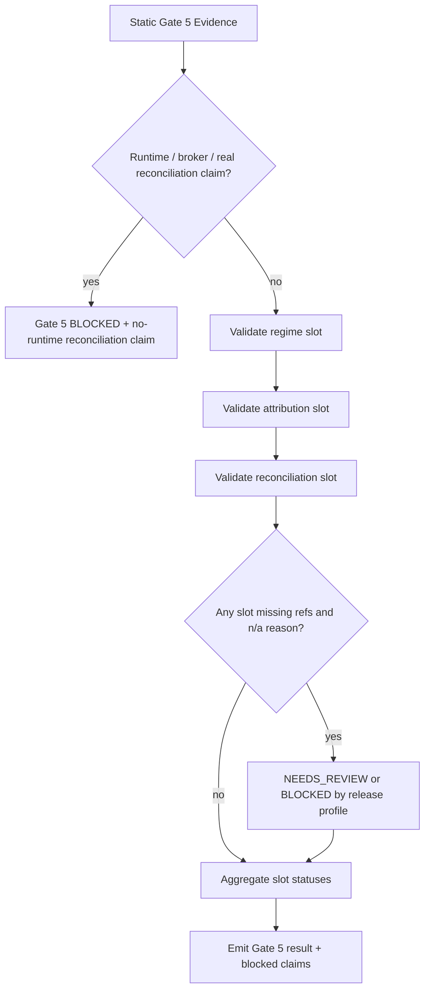

# LLD: CR154-S06 — Gate 5 Regime, Attribution and Reconciliation Slots

## 0. 上游设计依据

| 来源 | 路径 / ID | 被本 LLD 消费的内容 |
|---|---|---|
| Story | `process/stories/CR154-S06-regime-attribution-reconciliation-slots.md` | Gate 5 必须是显式 Story，覆盖 regime、attribution、reconciliation slots、`n/a-with-reason`、release wording limits。 |
| HLD | `process/docs/design/HLD-CROSS-STRATEGY-PRODUCTION-RELIABILITY-GATES.md` | Gate 5 slot 表、no-runtime reconciliation boundary、T2 Gate 5 slots refs/n/a policy、UC-60 / REQ-181 trace。 |
| ADR | `process/docs/design/ARCHITECTURE-DECISION-CROSS-STRATEGY-PRODUCTION-RELIABILITY-GATES.md` | ADR-CR154-006 no-runtime/no-real-data boundary；shared contract + adapters decision。 |
| Feature Matrix | `process/docs/design/FEATURE-DESIGN-MATRIX.md` | CR154-S06 属于 FEAT-15，`lld_policy.required_level=full-lld`，CP4 review 要求 Gate 5 显式 Story。 |
| Feature DESIGN | `process/docs/features/cross-strategy-reliability-gates/DESIGN.md` | Gate 5 必须定义 structured slots、refs、status、`n/a-with-reason`，不得做 runtime/broker reconciliation。 |
| Feature TEST-PLAN | `process/docs/features/cross-strategy-reliability-gates/TEST-PLAN.md` | S06 fixture 必须覆盖 slot pass、slot n/a-with-reason、missing reason blocked/review、no runtime reconciliation claim。 |
| Feature TASKS | `process/docs/features/cross-strategy-reliability-gates/TASKS.md` | `CR154-T06` 是本 Story 的设计任务，输出 full LLD with slot/status/ref/n/a validation。 |
| Development Plan | `process/DEVELOPMENT-PLAN-CR154-CROSS-STRATEGY-RELIABILITY-GATES.yaml` | W2 gate policies 可并行 LLD；实现阶段 shared file 合并必须串行；不授权真实 reconciliation、broker、feed、runtime 或测试实现。 |

## 1. Goal

为 CR154 Gate 5 定义 regime、attribution、reconciliation 三类 machine-visible slot/status/ref/n/a 合同，使策略 admission summary 能表达这些证据的存在、缺失、不适用和 release wording 影响，同时明确 first wave 不执行真实 regime model training、真实 production PnL attribution、真实 broker/account/order/cash/position reconciliation 或 live-vs-offline reconciliation。

## 2. Requirements（Functional / Non-Functional）

### 2.1 Functional

- 定义 Gate 5 section，包含 `regime_slots`、`attribution_slots`、`reconciliation_slots`、Gate 5 aggregate status、blocked claims 和 release-blocking reason。
- 每个 slot 必须符合统一形态：`slot_id`、`slot_type`、`status`、`refs`、`n/a_reason`、`limitations`、`owner`、`claim_limit`、`last_review_ref`。
- `slot_type` 第一波固定为 `regime`、`attribution`、`reconciliation`；未来扩展必须另走 Story/CR。
- Regime slots 必须至少支持 `regime_policy_ref`、`regime_split_ref`、`regime_status`、`limitations`、`n/a_reason`；不训练或调用真实 regime service。
- Attribution slots 必须至少支持 `attribution_model_ref`、`factor_attribution_refs`、`event_attribution_refs`、`portfolio_attribution_refs`、`attribution_status`、`limitations`、`n/a_reason`；不声明真实 broker/fill-based PnL attribution。
- Reconciliation slots 必须至少支持 `reconciliation_scope`、`offline_vs_live_ref`、`position_cash_ref`、`break_workflow_ref`、`reconciliation_status`、`limitations`、`n/a_reason`；不查询 broker/account/order/cash/position，也不做真实 live-vs-offline reconciliation。
- slot omission without reason invalid：任何 mandatory slot 缺失且无 `n/a-with-reason` 必须映射到 `NEEDS_REVIEW` 或 `BLOCKED`，由 release profile/tier 决定。
- 任何 wording 声称 runtime、broker、paper/live、real reconciliation readiness，必须产生 blocked claim。
- Gate 5 不得隐藏在 S08 compatibility wording；它必须输出独立 section 供 S07 tier resolver 和 admission summary 消费。

### 2.2 Non-Functional

- 安全：禁止 `.env`、凭据、真实 lake/NAS/provider/QMT/runtime/broker/feed/order/reconciliation/store/catalog/registry/publish 访问。
- 可审计：slot 缺失、n/a、limitations 与 blocked claims 必须结构化记录。
- 可兼容：CR151/CR152/CR153 adapters 可以提供 refs 或 n/a reasons；缺失不应静默消失。
- 可测试：所有 validation 通过 local/static fixture 完成，不需要真实 runtime 或 broker。
- 反过度声明：Gate 5 PASS 只表示 slot contract 完整，不表示 production regime model、PnL attribution 或 reconciliation ready。

## 3. 模块拆分与职责

| 模块 / 文件组 | 职责 | 说明 |
|---|---|---|
| `engine/cross_strategy_reliability_gates.py` Gate 5 slot contracts | 定义 slot base shape、slot type、status/ref/n/a/limitations fields 和 aggregate Gate 5 result。 | 复用 S01 shared status/ref/blocked claim；本 Story拥有 Gate 5字段。 |
| `engine/cross_strategy_reliability_gates.py` Gate 5 evaluator helpers | 校验三类 slots 的 required fields、n/a reason、missing reason、no-runtime reconciliation boundary。 | 不访问外部系统，只消费传入对象。 |
| `tests/research/test_cross_strategy_reliability_gates.py` Gate 5 fixture cases | 覆盖 slot pass、slot n/a、missing reason、runtime/broker reconciliation overclaim。 | 测试实现不在 CP5 阶段写入。 |
| Admission summary / tier resolver consumer | 消费 Gate 5 status、blocked claims、release-blocking reason。 | S07 拥有 tier resolver；本 Story定义输出契约。 |

## 4. 代码结构与文件影响范围

| 动作 | 文件路径 | 变更内容 |
|---|---|---|
| 修改 | `engine/cross_strategy_reliability_gates.py` | 增加 Gate 5 slot/status/ref/n/a contract、slot validation、aggregate status、blocked claim mapping、no-runtime/broker reconciliation guard。 |
| 修改 | `tests/research/test_cross_strategy_reliability_gates.py` | 增加 Gate 5 fixture tests：slot pass、n/a-with-reason、missing reason blocked/review、runtime/broker reconciliation claim blocked。 |

## 5. 数据模型与持久化设计

无新增持久化变更；本 Story 只定义内存对象 / JSON-safe fixture contract。

| 对象 / 字段 | 类型 | 约束 | 说明 |
|---|---|---|---|
| `Gate5SlotType` | enum / literal string | `regime`、`attribution`、`reconciliation` | 第一波固定三类；禁止 free text。 |
| `Gate5SlotStatus` | status enum | `PASS`、`FAIL`、`NEEDS_REVIEW`、`BLOCKED`、artifact-level `n/a-with-reason` | 与 S01 shared status 对齐。 |
| `Gate5EvidenceSlot` | object | `slot_id`、`slot_type`、`status`、`refs`、`n/a_reason`、`limitations`、`owner`、`claim_limit`、`last_review_ref` | 三类 slot 共享 base shape。 |
| `regime_policy_ref` | `EvidenceRef | None` | regime slot active 时必填；n/a 时必须说明不适用原因。 | 指向 regime policy/design evidence，不表示真实训练。 |
| `regime_split_ref` | `EvidenceRef | None` | active regime evaluation 时必填；否则 n/a reason。 | 表达 regime split evidence。 |
| `attribution_model_ref` | `EvidenceRef | None` | active attribution claim 时必填。 | 指向 attribution model/config evidence，不代表真实 broker PnL。 |
| `factor_attribution_refs` | list of `EvidenceRef` | multifactor 或 factor-based claim 使用；无则 n/a reason。 | 允许多因子 adapter 提供。 |
| `event_attribution_refs` | list of `EvidenceRef` | event strategy attribution claim 使用；无则 n/a reason。 | 允许 CR153 adapter 提供。 |
| `portfolio_attribution_refs` | list of `EvidenceRef` | portfolio-level attribution claim 使用；无则 n/a reason。 | 不读取真实 portfolio account。 |
| `reconciliation_scope` | enum/list/string | active reconciliation slot 必填；可值示例：`offline-vs-live`、`position-cash`、`break-workflow`、`n/a-with-reason`。 | scope 是合同描述，不触发真实 reconciliation。 |
| `offline_vs_live_ref` | `EvidenceRef | None` | 若声明 offline/live 对账证据则必填；first wave 通常 n/a。 | 不表示真实 live run。 |
| `position_cash_ref` | `EvidenceRef | None` | 若声明 position/cash 对账证据则必填；first wave 通常 n/a。 | 不查询 broker/account。 |
| `break_workflow_ref` | `EvidenceRef | None` | 若声明 break workflow evidence 则必填。 | 可以是静态流程/fixture ref。 |
| `no_runtime_reconciliation_claim` | bool / statement | first wave 必须为 true 或等价声明；false/缺失为 `BLOCKED`。 | 防止真实 runtime/broker reconciliation claim。 |
| `blocked_claims` | list | claim id、reason、source_gate、release wording impact、unlock condition。 | 至少覆盖 runtime reconciliation、broker ready、paper/live ready、production attribution overclaim。 |
| `release_blocking_reason` | string / ref | Gate 5 release-blocking 时必填。 | 供 Gate 6 和 admission summary 消费。 |

## 6. API / Interface 设计

| 接口 / 入口 | 输入 | 输出 | 调用方 | 说明 |
|---|---|---|---|---|
| `Gate5SlotType` serialization | raw string | enum value or validation error | Gate 5 evaluator、fixture loader | 仅允许 `regime`、`attribution`、`reconciliation`；测试 T-G5-01 覆盖。 |
| `validate_gate5_slots(gate5_evidence, policy_context)` | Gate 5 evidence object；strategy class、release profile、claim set | Gate 5 result: aggregate status、slot statuses、blocked claims、release_blocking_reason | shared gate evaluator / S07 tier resolver | 核心入口；纯内存 static validation；测试 T-G5-02 到 T-G5-06 覆盖。 |
| `validate_regime_slot(slot, policy_context)` | regime slot object | slot status / validation error | Gate 5 evaluator | 校验 policy/split refs 或 n/a reason；测试 T-G5-02/T-G5-03。 |
| `validate_attribution_slot(slot, policy_context)` | attribution slot object | slot status / validation error | Gate 5 evaluator | 校验 attribution refs、limitations、no broker PnL wording；测试 T-G5-02/T-G5-04。 |
| `validate_reconciliation_slot(slot, policy_context)` | reconciliation slot object | slot status / validation error | Gate 5 evaluator | 校验 scope/ref/n/a 和 no-runtime/broker boundary；测试 T-G5-02/T-G5-05/T-G5-06。 |
| `build_gate5_blocked_claims(gate5_result, policy_context)` | Gate 5 status + requested claims | blocked claim list | Gate 6 wording / admission summary | 统一输出 blocked wording；测试 T-G5-05/T-G5-06。 |

## 7. 核心处理流程

1. 接收调用方提供的 static Gate 5 evidence 与 policy context。
2. 校验 evidence 中没有 runtime/broker/feed/account/order/cash/position 查询、真实 reconciliation 或 paper/live readiness claim；若存在，立即 `BLOCKED`。
3. 按 `slot_type` 校验 regime、attribution、reconciliation slots；slot type 非法或缺失为 validation failure。
4. 对每个 mandatory slot，要求 refs 或 `n/a-with-reason`；缺少 reason 时按 release profile 产生 `NEEDS_REVIEW` 或 `BLOCKED`。
5. 聚合 slot statuses：任一 `BLOCKED` 导致 Gate 5 aggregate `BLOCKED`；任一 `NEEDS_REVIEW` 且无 blocked 则 aggregate `NEEDS_REVIEW`；全部 pass/n/a with accepted reason 才可 pass/review-cleared。
6. 输出 blocked claims 和 release-blocking reason，供 S07 tier resolver 与 admission summary 使用。



## 8. 技术设计细节

- 关键规则：
  - Gate 5 是独立 section，不得只在 S08 release wording 中以文本说明替代。
  - slot omission without reason invalid；空 list、空 string、null refs 都必须有 `n/a_reason`、`claim_limit` 和 owner/trigger。
  - Regime PASS 仅表示 regime evidence slot 完整，不表示真实 regime model training、live regime service 或 production regime detection。
  - Attribution PASS 仅表示 attribution slot evidence 完整，不表示真实 broker/fill/cash/PnL attribution。
  - Reconciliation PASS 仅表示 slot contract 完整或 n/a reason accepted，不表示真实 broker/account/order/cash/position reconciliation。
  - T2 production-like wording 要求 Gate 5 slots 有 refs 或 n/a reasons；T3 paper/live/trading/runtime profile 在 CR154 内仍 release-blocking/not-authorized。
- 依赖选择与复用点：
  - 复用 S01 shared evidence ref、status、blocked claim。
  - S07 使用 Gate 5 aggregate status 做 tier resolution；本 Story不实现 tier table。
  - S08 使用 Gate 5 blocked wording 做 release/process evidence wording；本 Story输出 structured facts。
- 兼容性处理：
  - CR151/CR152/CR153 adapters 可以只提供适用 slot；非适用 slot 必须显式 n/a。
  - CR153 event strategy 可提供 event attribution refs；但 event feed/listener/runtime reconciliation 仍不授权。
- 图示类型选择：流程图；Gate 5 的异常分支涉及三类 slot、missing n/a reason 和 no-runtime reconciliation boundary。

## 9. 安全与性能设计

| 维度 | 设计措施 | 验证方式 |
|---|---|---|
| 安全 | Gate 5 evaluator 只消费传入对象；禁止读取 `.env`、凭据、真实 lake/NAS/provider/QMT/runtime/broker/feed/order/reconciliation/store/catalog/registry。 | no-runtime fixture 和 forbidden operation counter fixture。 |
| 安全 | `no_runtime_reconciliation_claim` 强制存在；任何 broker/account/order/cash/position/live-vs-offline runtime claim 都 `BLOCKED`。 | T-G5-06。 |
| 性能 | Slot validation 是 O(number of slots + refs + blocked claims) 的纯内存校验。 | 单元测试保持无 IO。 |
| 可维护性 | 三类 slot 使用同一 base shape，避免 regime/attribution/reconciliation 字段漂移。 | slot serialization tests。 |

## 10. 测试设计

| 测试场景 | 前置条件 | 操作 | 预期结果 | 验证方式 |
|---|---|---|---|---|
| T-G5-01 slot type validation | fixture 提供合法和非法 `slot_type` | 调用 `Gate5SlotType` parser / evaluator | 合法三类通过；非法 free text validation failure。 | `tests/research/test_cross_strategy_reliability_gates.py` |
| T-G5-02 slot pass | regime、attribution、reconciliation slots 均有 refs、limitations、owner、claim_limit | 调用 `validate_gate5_slots` | aggregate status 不因缺字段失败；blocked claims 为空或只含外部 gate claim。 | 同上 |
| T-G5-03 n/a-with-reason accepted | 某 slot 不适用但提供 reason、claim_limit、owner、trigger | 调用 `validate_gate5_slots` | slot 记录 `n/a-with-reason`，不静默省略。 | 同上 |
| T-G5-04 missing reason invalid | mandatory attribution slot 缺 refs 且无 n/a reason | 调用 `validate_gate5_slots` | 按 release profile `NEEDS_REVIEW` 或 `BLOCKED`；输出 release wording impact。 | 同上 |
| T-G5-05 reconciliation missing/overclaim | reconciliation slot 缺 scope/ref/reason 或请求 paper/live readiness | 调用 reconciliation validator | 缺 reason 不得 PASS；paper/live readiness claim blocked。 | 同上 |
| T-G5-06 no runtime/broker reconciliation claim | fixture 声称 broker account/cash/position reconciliation 或 real live-vs-offline reconciliation | 调用 `validate_gate5_slots` | Gate 5 `BLOCKED`，blocked claim 指向 no-runtime reconciliation boundary。 | 同上 |
| T-G5-07 admission summary consumption | Gate 5 aggregate `BLOCKED` | 构造 shared summary / S07 consumer fixture | Admission summary 带 Gate 5 blocked claims；不得显示 runtime/broker ready。 | 同上；S07 集成时复用。 |

## 11. 实施步骤

| TASK-ID | 动作 | 目标文件 | 详细描述 | 对应测试 |
|---|---|---|---|---|
| CR154-T06-01 | 修改 | `engine/cross_strategy_reliability_gates.py` | 增加 `Gate5SlotType` 和 Gate 5 base slot contract，固定 `regime`、`attribution`、`reconciliation`。 | T-G5-01 |
| CR154-T06-02 | 修改 | `engine/cross_strategy_reliability_gates.py` | 增加 regime slot fields 和 `validate_regime_slot`。 | T-G5-02、T-G5-03 |
| CR154-T06-03 | 修改 | `engine/cross_strategy_reliability_gates.py` | 增加 attribution slot fields 和 `validate_attribution_slot`。 | T-G5-02、T-G5-04 |
| CR154-T06-04 | 修改 | `engine/cross_strategy_reliability_gates.py` | 增加 reconciliation slot fields、`no_runtime_reconciliation_claim` 和 `validate_reconciliation_slot`。 | T-G5-05、T-G5-06 |
| CR154-T06-05 | 修改 | `engine/cross_strategy_reliability_gates.py` | 增加 `validate_gate5_slots` aggregate evaluator 和 `build_gate5_blocked_claims`。 | T-G5-02 到 T-G5-07 |
| CR154-T06-06 | 修改 | `tests/research/test_cross_strategy_reliability_gates.py` | 增加 Gate 5 local/static fixture tests；禁止真实 runtime/broker/reconciliation IO。 | T-G5-01 到 T-G5-07 |

## 12. 风险、难点与预研建议

### 12.1 实现灰区与取舍记录

| Clarification ID | 问题 | 选项与推荐 | 决策 / 答案 | 影响面 | 证据 | 重访条件 |
|---|---|---|---|---|---|---|
| N/A | 无需新增 LCQ。Story、HLD、ADR 和 Feature DESIGN 已明确 Gate 5 必须为 explicit slot/status/ref/n/a contract，并禁止 runtime/broker reconciliation claim。 | 推荐按 HLD/ADR 执行；不新增用户决策项。 | 已按上游确认设计执行。 | 接口 / 测试 / 安全 / 跨 Story 契约 | HLD Gate 5、ADR-CR154-006、Feature DESIGN Story Split Decisions。 | 若 CP5 reviewer 要求新增第四类 slot，需转 CR 或 Story 变更，不在本 Story 自行扩展。 |

| 风险 / 难点 | 影响 | 缓解措施 / 预研建议 |
|---|---|---|
| Gate 5 被实现成文案而不是结构化合同 | 无法被 S07 tier resolver 或 CP7 fixture 验证。 | 本 LLD 要求独立 Gate 5 section、slot base shape 和 aggregate status。 |
| PASS 被误读为真实 reconciliation readiness | 可能越过 no-runtime/no-broker 边界。 | `no_runtime_reconciliation_claim` 必填；runtime/broker wording 直接 blocked。 |
| n/a 被用作静默省略 | 缺失 evidence 无法审计。 | 每个 n/a 必须有 reason、claim_limit、owner、trigger。 |
| 多策略 slot 适用性不同 | 可能错误阻断非适用策略。 | 使用 explicit `n/a-with-reason`，由 strategy adapter 提供适用性说明。 |

### OPEN / Spike 跟踪

| ID | 类型（OPEN / Spike） | 问题 | 下一动作 | 责任方 |
|---|---|---|---|---|
| N/A | OPEN | 无阻断 OPEN。 | N/A | N/A |

## 13. 回滚与发布策略

- 发布方式：CP5 仅发布设计证据；CP6 后实现以 local/static fixture contract 进入代码，不发布真实 runtime、broker、paper/live 或 reconciliation capability。
- 回滚触发条件：CP5 审查拒绝 Gate 5 slot contract；CP6/CP7 发现 Gate 5 允许 runtime/broker overclaim 或 slot omission silently passes。
- 回滚动作：撤回 Gate 5 evaluator/fields；保留 S01 shared skeleton；将 Gate 5 summary 降级为 unavailable/blocked，并在 release wording 中阻断 regime-ready、production attribution、broker reconciliation、paper/live readiness claims。

## 14. Definition of Done

- [ ] Gate 5 显式存在为 independent section，不隐藏在 S08 compatibility wording。
- [ ] Slot base shape 包含 `slot_id`、`slot_type`、`status`、`refs`、`n/a_reason`、`limitations`、`owner`、`claim_limit`、`last_review_ref`。
- [ ] Regime slot 覆盖 `regime_policy_ref`、`regime_split_ref`、status、limitations、n/a reason。
- [ ] Attribution slot 覆盖 attribution model、factor/event/portfolio attribution refs、status、limitations、n/a reason。
- [ ] Reconciliation slot 覆盖 scope、offline-vs-live ref、position/cash ref、break workflow ref、status、limitations、n/a reason。
- [ ] Missing slot reason 不能静默通过；按 tier/profile 映射 `NEEDS_REVIEW` 或 `BLOCKED`。
- [ ] 真实 runtime/broker/account/order/cash/position reconciliation claim 必须 `BLOCKED`。
- [ ] 测试设计覆盖 slot pass、n/a-with-reason、missing reason、no-runtime reconciliation claim。
- [ ] 不读取 `.env`、凭据、真实 lake/NAS/provider/runtime/broker/feed/store/catalog/registry。
- [ ] `confirmed=false` 时不进入实现。

## 人工确认区

> **CP5 — Story 设计证据可实现性门**
> 本 LLD 必须纳入 `process/checkpoints/CP5-CR154-CROSS-STRATEGY-PRODUCTION-RELIABILITY-GATES-LLD-BATCH.md` 统一审查。用户统一确认全部 CR154 目标 Story 设计证据前，不得进入实现。

**CP5 checklist 摘要**：

| # | 检查项 | 状态 | 证据 |
|---|---|---|---|
| 1 | LLD 覆盖 AC | 待检查 | 第 2 / 5 / 10 / 14 节 |
| 2 | 与 HLD / ADR 一致 | 待检查 | 第 0 / 8 / 12 节 |
| 3 | 文件影响范围明确 | 待检查 | 第 4 / 11 节 |
| 4 | 接口契约完整 | 待检查 | 第 6 节 |
| 5 | 测试与 dev_gate 可计算 | 待检查 | 第 10 / 14 节 |
| 6 | clarification queue 已收敛 | 待检查 | 第 12.1 节 |

**人工确认回复**：

请直接回复以下任一整行：

```text
approve
修改: <具体修改点>
reject
```

**人工审查结果回填**：

- 结论：`approved | changes_requested | rejected`
- 审查人：
- 审查时间：
- 修改意见：
- 风险接受项：
