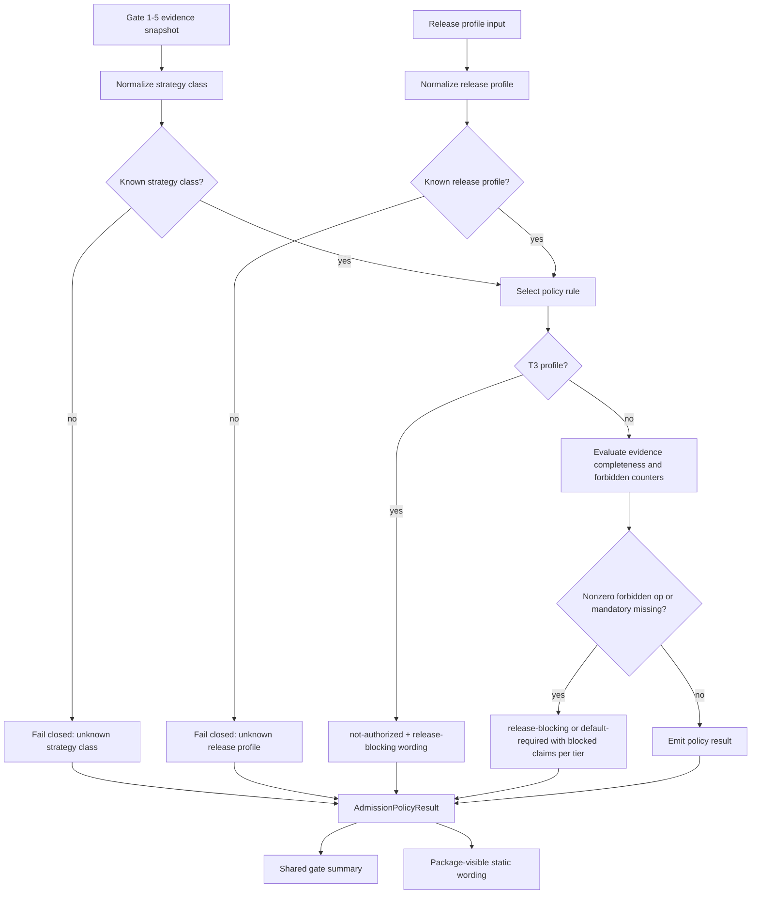

# LLD: CR154-S07 - Gate 6 Admission Default Policy Tier Resolution

> 本 LLD 是 CP5 设计证据，`confirmed=false`。它不授权源码实现、测试实现、真实数据访问、runtime、paper/live/trading、broker、feed、store、catalog、registry 或 publish。

## 0. 上游设计依据

| 来源 | 路径 / ID | 被本 LLD 消费的内容 |
|---|---|---|
| HLD | `process/docs/design/HLD-CROSS-STRATEGY-PRODUCTION-RELIABILITY-GATES.md` | §7 Gate 6、§8 T0/T1/T2/T3 tier table、unknown profile fail-closed、Gate PASS 不等于 runtime/trading readiness。 |
| ADR | `process/docs/design/ARCHITECTURE-DECISION-CROSS-STRATEGY-PRODUCTION-RELIABILITY-GATES.md` | ADR-CR154-005 admission default policy tier table；ADR-CR154-006 no-runtime/no-real-data boundary。 |
| Feature Matrix | `process/docs/design/FEATURE-DESIGN-MATRIX.md` | CR154-S07 为 FEAT-15 / FEAT-07 full-lld；需定义 config/function 边界、fallback 和 per-strategy override。 |
| Feature DESIGN | `process/docs/features/cross-strategy-reliability-gates/DESIGN.md` | Gate 6 admission default policy、unknown profile fail-closed、release wording compatibility。 |
| Feature TEST-PLAN | `process/docs/features/cross-strategy-reliability-gates/TEST-PLAN.md` | S07 fixture cases：T0 opt-in、T1 default-required、T2 release-blocking、T3 not-authorized、unknown fail-closed。 |
| Feature TASKS | `process/docs/features/cross-strategy-reliability-gates/TASKS.md` | CR154-T07：Design Gate 6 admission tier resolver and release wording。 |
| Development Plan | `process/DEVELOPMENT-PLAN-CR154-CROSS-STRATEGY-RELIABILITY-GATES.yaml` | W3 depends on S02-S06；same-file merge rule assigns S07 admission tier resolver after S02-S06。 |

## 1. Goal

Create the Gate 6 design for a deterministic admission tier resolver that maps shared reliability gate evidence, strategy class and release profile into one policy result: `opt-in`, `default-required`, `release-blocking` or `not-authorized`, with fail-closed behavior for unknown profiles and explicit wording that a Gate PASS is never paper/live/trading/broker/runtime readiness.

## 2. Requirements（Functional / Non-Functional）

### 2.1 Functional

- Define the resolver shape as a hybrid of static configuration plus a pure resolver function:
  - static config owns tier table rows, release profile aliases, strategy-specific override rows and wording templates;
  - resolver function owns normalization, precedence, fallback, fail-closed behavior and policy output assembly.
- Cover HLD T0/T1/T2/T3 rules:
  - T0: exploratory / research-note; low risk; partial evidence allowed; gate mode `opt-in`.
  - T1: admission-package / candidate-release; strategy-specific default-required rules for multifactor, ML and event-driven.
  - T2: release-readiness / production-like wording / simulation-readiness claim; high risk; gate mode `release-blocking`.
  - T3: paper / live / trading / runtime; critical risk; result must be `not-authorized` inside CR154 and release-blocking in downstream wording.
- Unknown or uncovered release profile must fail closed until classified. The resolver must emit a blocked result with a machine-visible reason and must not silently coerce to T0.
- Per-strategy overrides must be explicit and narrower than the default tier table. Supported first-wave strategy classes are `multifactor`, `ml`, `event-driven` and `hybrid`.
- Fallback rules must be deterministic:
  - missing strategy class -> classify as `unknown-strategy-class` and fail closed;
  - unknown release profile -> classify as `unknown-release-profile` and fail closed;
  - known strategy class with no strategy-specific override -> use `any` tier row if present;
  - missing mandatory Gate 1-5 status under T2/T3 -> block release wording;
  - nonzero forbidden operation counter -> block regardless of tier.
- Release wording must preserve the HLD claim boundary:
  - Gate PASS means only local/static/fixture contract semantics pass;
  - Gate PASS does not imply paper readiness, live readiness, trading readiness, broker readiness, runtime authorization, real data validation, true TCA, feed operation or publish readiness.
- StrategyAdmissionPackage integration is summary-only: future implementation may attach Gate 6 summary and blocked claims, but must not add runtime authority or trigger release execution.

### 2.2 Non-Functional

- Deterministic: same normalized inputs must produce the same tier result and wording.
- Auditable: every fallback, override and blocked claim must include source tier row, reason code and unlock condition.
- Local/static/fixture-only: no `.env`, credentials, real lake/NAS/provider/QMT/runtime/broker/feed/order/reconciliation/store/catalog/registry/publish access.
- Backward compatible: existing CR151/CR152/CR153 package-visible behavior may consume summary wording but must not be silently reclassified as runtime-ready.
- Config reviewable: default rows and overrides must be inspectable without reading runtime state.

## 3. 模块拆分与职责

| 模块 / 文件组 | 职责 | 说明 |
|---|---|---|
| `engine/cross_strategy_reliability_gates.py` | Own Gate 6 policy types, default config, resolver function and policy output section. | S07 owns admission tier resolver section after S02-S06 gate status semantics are merged. |
| `engine/strategy_admission_package.py` | Future summary attachment only. | Consumes Gate 6 result as display/metadata; does not evaluate real readiness and does not authorize runtime. |
| `tests/research/test_cross_strategy_reliability_gates.py` | Tier resolver fixtures. | Must cover T0/T1/T2/T3, unknown profile fail-closed, per-strategy override and forbidden operation counter. |
| `tests/research/test_strategy_admission_package.py` | Admission package compatibility fixtures. | Must prove Gate 6 summary wording does not change package into paper/live/trading/broker readiness. |

## 4. 代码结构与文件影响范围

| 动作 | 文件路径 | 变更内容 |
|---|---|---|
| 修改 | `engine/cross_strategy_reliability_gates.py` | Add Gate 6 tier config objects, policy mode constants, release profile aliases, resolver function and result serialization fields. |
| 修改 | `engine/strategy_admission_package.py` | Attach CR154 reliability policy summary and blocked claims only after CP5 approval; keep runtime/trading readiness fields unchanged. |
| 修改 | `tests/research/test_cross_strategy_reliability_gates.py` | Add fixture-only tests for tier resolution, unknown profile fail-closed, per-strategy overrides and fallback rules. |
| 修改 | `tests/research/test_strategy_admission_package.py` | Add compatibility fixtures proving package-visible wording remains static/fixture-only and no paper/live/trading readiness is implied. |

No deletion is planned. No S07 implementation may start until CP5 all-story design evidence is confirmed.

## 5. 数据模型与持久化设计

No persistent storage is added. All objects are in-memory/static contract objects and JSON-safe summaries for future return/evidence artifacts.

| 对象 / 字段 | 类型 | 约束 | 说明 |
|---|---|---|---|
| `AdmissionPolicyTier` | enum/string | `T0`, `T1`, `T2`, `T3`, `UNKNOWN` | `UNKNOWN` is internal fail-closed classification, not an allowed release tier. |
| `AdmissionGateMode` | enum/string | `opt-in`, `default-required`, `release-blocking`, `not-authorized` | `not-authorized` is used for T3 paper/live/trading/runtime inside CR154. |
| `ReleaseProfile` | enum/string | `exploratory`, `research-note`, `admission-package`, `candidate-release`, `release-readiness`, `production-like`, `simulation-readiness`, `paper`, `live`, `trading`, `runtime` | Aliases must normalize before resolution. Unknown aliases fail closed. |
| `StrategyClass` | enum/string | `multifactor`, `ml`, `event-driven`, `hybrid`, `unknown` | Unknown fails closed; hybrid must declare active adapters. |
| `AdmissionPolicyRule` | record | tier, strategy class selector, release profile selector, risk level, evidence requirement, gate mode, exceptions, wording | Static config row derived from HLD §8. |
| `AdmissionPolicyOverride` | record | strategy class, release profile selector, override fields, rationale, owner, expiry/revisit trigger | More specific than default row; cannot weaken T3. |
| `GateEvidenceSnapshot` | record | Gate 1-5 statuses, artifact completeness flags, blocked claims, forbidden operation counters | Consumed from S02-S06 contracts after merge. |
| `AdmissionPolicyResult` | record | tier, gate mode, release wording, blocked claims, release blocking reason, fallback reason, source rule id, readiness disclaimers | Returned to shared gate summary and package summary. |

## 6. API / Interface 设计

| 接口 / 入口 | 输入 | 输出 | 调用方 | 说明 |
|---|---|---|---|---|
| `resolve_admission_policy(...)` | `strategy_class`, `release_profile`, `gate_evidence`, optional `policy_config`, optional `strategy_overrides` | `AdmissionPolicyResult` | Shared reliability gate aggregator | Pure function; no I/O; unknown profile fails closed. |
| `normalize_release_profile(value)` | raw profile string or enum | normalized release profile or `unknown-release-profile` reason | Resolver | Handles aliases; no fuzzy matching that could turn unknown into T0. |
| `select_policy_rule(strategy_class, release_profile, config, overrides)` | normalized class/profile plus config | matching rule and source id | Resolver | Precedence: T3 hard rule, exact strategy override, exact default row, `any` default row, fail-closed unknown. |
| `render_release_wording(policy_result, blocked_claims)` | policy result and blocked claims | user-visible wording plus machine reason codes | Gate summary / package summary | Must include no paper/live/trading/broker/runtime readiness disclaimer. |
| `attach_reliability_policy_summary(...)` | admission package draft and `AdmissionPolicyResult` | package-visible static summary | `strategy_admission_package` consumer | Future integration only; must not set runtime readiness fields. |

Every interface above maps to tests in §10.

## 7. 核心处理流程

1. Read only already-assembled static gate evidence passed by callers.
2. Normalize strategy class and release profile through explicit mappings.
3. Fail closed on unknown strategy class or release profile.
4. Apply T3 hard rule before any per-strategy override.
5. Select exact strategy override, then default tier row, then `any` row; if none matches, fail closed.
6. Evaluate Gate 1-5 evidence completeness only through S02-S06 contract fields.
7. Combine resolver result with blocked claims and readiness disclaimers.
8. Return a JSON-safe result for fixture verification and package summary attachment.

## 8. 技术设计细节

- Resolver form: hybrid.
  - Config-only is rejected because fallback precedence and forbidden operation counters need executable policy logic.
  - Function-only is rejected because HLD tier table and per-strategy overrides must remain reviewable and fixture-addressable.
  - Hybrid is selected: static config for policy rows and pure resolver function for deterministic evaluation.
- T0 rule:
  - release profiles: `exploratory`, `research-note`;
  - gate mode: `opt-in`;
  - allowed only with wording that blocks production, scalable, OOS-proven, survivorship-free and readiness claims.
- T1 rules:
  - multifactor: requires CR151 statistical refs; PIT/capacity gaps may be `NEEDS_REVIEW` only when wording blocks those claims;
  - ML: requires PIT feature/label, purge/embargo and trial count refs; triple-barrier/meta-labeling/feature-importance may be deferred only when not active method scope;
  - event-driven: requires event time semantics and event gate refs; CR153 `universe_pit_audit` may remain source/delegated ref if CR154 summary owns shared status.
- T2 rule:
  - release profiles: `release-readiness`, `production-like`, `simulation-readiness`;
  - gate mode: `release-blocking`;
  - all mandatory Gate 1-4 evidence complete and Gate 5 refs or n/a reasons required;
  - human risk acceptance can preserve blocked claims but cannot erase no-runtime/no-trading disclaimer.
- T3 rule:
  - release profiles: `paper`, `live`, `trading`, `runtime`;
  - gate mode: `not-authorized` with release-blocking downstream wording;
  - no exception inside CR154; requires separate runtime/data/trading authorization CR.
- Unknown release profile:
  - result tier: `UNKNOWN`;
  - gate mode: `release-blocking`;
  - reason code: `unknown_release_profile_fail_closed`;
  - wording: "Release profile is not classified by CR154; reliability wording is blocked until host-orchestrator classifies the profile."
- Per-strategy override:
  - override cannot weaken `T3`;
  - override must carry owner, rationale and revisit trigger;
  - override must be tested by exact profile and strategy family.
- Release wording:
  - every PASS/default-required/release-blocking result includes `fixture_static_only=true`;
  - wording must explicitly say no paper/live/trading/broker/runtime readiness;
  - `allowed_claims` and `blocked_claims` must remain separate.

## 9. 安全与性能设计

| 维度 | 设计措施 | 验证方式 |
|---|---|---|
| 安全 | Resolver accepts only in-memory/static input and must not read `.env`, credentials, lake/NAS, provider, QMT, runtime, feed, broker, store, catalog, registry or publish surfaces. | Static review plus fixture tests with forbidden operation counters. |
| Authorization | T3 always `not-authorized` inside CR154; any real operation requires separate authorization gate or formal CR. | T3 fixture and package wording fixture. |
| Compatibility | Package integration attaches summary only and must not mutate existing runtime readiness or release execution fields. | `test_strategy_admission_package.py` compatibility fixture. |
| Performance | Resolver is table lookup plus small blocked-claim merge; no external I/O and no data scan. | Unit tests should run as local fixture-only tests. |
| Auditability | Result records source rule id, fallback reason and unlock condition. | Snapshot/fixture assertions on reason codes. |

## 10. 测试设计

| 测试场景 | 前置条件 | 操作 | 预期结果 | 验证方式 |
|---|---|---|---|---|
| T0 exploratory opt-in | Partial gate evidence and blocked claims present | Resolve `strategy_class=multifactor`, `release_profile=exploratory` | `tier=T0`, `gate_mode=opt-in`, blocked production/scalable/OOS/survivorship-free claims retained | `tests/research/test_cross_strategy_reliability_gates.py` |
| T1 multifactor default-required | CR151 statistical refs present; PIT/capacity gaps include blocked claims | Resolve `multifactor`, `candidate-release` | `tier=T1`, `gate_mode=default-required`, missing gates restrict allowed claims | Same |
| T1 ML default-required with ML-only deferred | PIT feature/label and purge/embargo refs present; feature importance not active | Resolve `ml`, `admission-package` | `tier=T1`, ML-only deferred fields do not block non-active method claims; no model promotion wording | Same |
| T1 event-driven default-required | Event time refs present; CR153 universe slot delegated to CR154 | Resolve `event-driven`, `candidate-release` | `tier=T1`, feed/runtime not authorized wording present | Same |
| T2 release-readiness blocked on mandatory missing | Gate 1-4 mandatory evidence incomplete | Resolve any strategy with `release-readiness` | `tier=T2`, `gate_mode=release-blocking`, release blocking reason includes missing evidence | Same |
| T3 paper/live/trading/runtime not authorized | Any local/static evidence, even complete | Resolve `paper`, `live`, `trading` and `runtime` profiles | `gate_mode=not-authorized`; blocked wording says CR154 does not authorize runtime/trading | Same |
| Unknown release profile fail-closed | Profile `shadow-prod` or other unclassified string | Resolve profile | `tier=UNKNOWN`, `gate_mode=release-blocking`, reason `unknown_release_profile_fail_closed` | Same |
| Per-strategy override precedence | Exact override exists for `hybrid` candidate-release | Resolve hybrid profile | Override row selected, source rule id recorded; T3 cannot be weakened | Same |
| Forbidden operation counter blocks | Gate evidence reports nonzero broker/feed/store/publish counter | Resolve T0/T1/T2 | Result includes `BLOCKED` or release-blocking reason per hard safety rule | Same |
| Package summary no overclaim | Admission package receives `AdmissionPolicyResult` | Attach summary | Package-visible summary includes static/fixture-only disclaimer and does not set paper/live/trading/broker readiness | `tests/research/test_strategy_admission_package.py` |

## 11. 实施步骤

| TASK-ID | 动作 | 目标文件 | 详细描述 | 对应测试 |
|---|---|---|---|---|
| CR154-T07-01 | 修改 | `engine/cross_strategy_reliability_gates.py` | Define `AdmissionPolicyTier`, `AdmissionGateMode`, release profile aliases and default HLD §8 rule table. | T0/T1/T2/T3 fixture cases |
| CR154-T07-02 | 修改 | `engine/cross_strategy_reliability_gates.py` | Implement pure `resolve_admission_policy` hybrid resolver using static config plus deterministic fallback precedence. | Unknown profile, override, forbidden counter fixtures |
| CR154-T07-03 | 修改 | `engine/cross_strategy_reliability_gates.py` | Add release wording rendering with readiness disclaimers and source reason codes. | Release wording fixtures |
| CR154-T07-04 | 修改 | `engine/strategy_admission_package.py` | Attach policy summary only; preserve no runtime/trading readiness semantics. | Package compatibility fixture |
| CR154-T07-05 | 修改 | `tests/research/test_cross_strategy_reliability_gates.py` | Add tier resolver fixture matrix. | S07 test group |
| CR154-T07-06 | 修改 | `tests/research/test_strategy_admission_package.py` | Add package-visible wording compatibility fixture. | S07 integration fixture |

## 12. 风险、难点与预研建议

### 12.1 实现灰区与取舍记录

| Clarification ID | 问题 | 选项与推荐 | 决策 / 答案 | 影响面 | 证据 | 重访条件 |
|---|---|---|---|---|---|---|
| N/A | No user-facing LCQ is required for S07 in this design pass. | 推荐 hybrid resolver: static config owns table/overrides, pure function owns fallback and result assembly. 备选 config-only loses executable fallback clarity; function-only hides policy rows from CP5 review. | Adopt hybrid in LLD; host-orchestrator can challenge during CP5 batch if desired. | 接口 / 测试 / 文档 / 跨 Story 契约 | HLD §8, ADR-CR154-005, Feature DESIGN Gate 6 requirement. | Revisit if S02-S06 final status contracts cannot provide `GateEvidenceSnapshot`. |

| 风险 / 难点 | 影响 | 缓解措施 / 预研建议 |
|---|---|---|
| S02-S06 status field names may differ from this LLD's conceptual `GateEvidenceSnapshot`. | Implementation could need field adapter glue. | Host-orchestrator CP5 merge resolved the conceptual snapshot to S01 `ReliabilityGateSummary` / `CrossStrategyReliabilityReport` plus S02-S06 gate-specific sections keyed by stable gate ids. |
| Per-strategy override could weaken release blocking. | Overclaim or bypass risk. | T3 hard rule has highest precedence; overrides require owner/rationale/revisit trigger and fixture coverage. |
| Unknown release profile accidentally treated as exploratory. | Unsafe default and misleading release wording. | Unknown profile uses explicit fail-closed reason and fixture test. |
| Package-visible summary could be mistaken for runtime readiness. | User may infer paper/live/trading authorization. | Summary wording always includes static/fixture-only disclaimer and no broker/runtime readiness claim. |

### OPEN / Spike 跟踪

| ID | 类型（OPEN / Spike） | 问题 | 下一动作 | 责任方 |
|---|---|---|---|---|
| O-S07-01 | RESOLVED | S07 consumes Gate 1-5 status/evidence field names that are owned by S02-S06 and may be drafted by other agents. | Host-orchestrator CP5 merge adopts S01 `ReliabilityGateSummary` / `CrossStrategyReliabilityReport` as the common envelope and consumes S02-S06 sections by stable gate ids: `gate_1_statistical`, `gate_2_cv`, `gate_3_pit_universe`, `gate_4_capacity_impact`, `gate_5_regime_attribution_reconciliation`. | host-orchestrator |

## 13. 回滚与发布策略

- 发布方式：No production release in this Story. After CP5 approval and CP6 implementation, S07 can only contribute local/static/fixture evidence and package-visible wording.
- 回滚触发条件：
  - resolver output changes existing package semantics beyond adding static reliability summary;
  - unknown profile does not fail closed;
  - T3 can be overridden;
  - wording implies paper/live/trading/broker/runtime readiness.
- 回滚动作：
  - remove Gate 6 summary attachment from `StrategyAdmissionPackage`;
  - keep shared gate evidence fields but force admission policy result to fail closed;
  - revert strategy override row and keep default HLD §8 config.

## 14. Definition of Done

- [ ] S07 LLD is included in CR154 CP5 all-story design evidence with `confirmed=false`.
- [ ] Hybrid resolver design is explicit: static config plus pure function.
- [ ] T0/T1/T2/T3 rules are represented with release wording.
- [ ] Unknown release profile and unknown strategy class fail closed.
- [ ] Per-strategy override and fallback precedence are documented and testable.
- [ ] Gate PASS wording explicitly does not imply paper/live/trading/broker/runtime readiness.
- [ ] `StrategyAdmissionPackage` integration is summary-only.
- [ ] Fixture-only tests are planned for resolver and package wording.
- [x] O-S07-01 is merged as a CP5 batch coordination item.

## 人工确认区

> **CP5 - Story 设计证据可实现性门**
> host-orchestrator 收齐 CR154 S01-S08 全部设计证据后，统一生成 CP5 batch review。用户统一确认前，本 Story 不进入实现。

**CP5 checklist 摘要**：

| # | 检查项 | 状态 | 证据 |
|---|---|---|---|
| 1 | LLD 覆盖 AC | 待检查 | §2 / §8 / §10 / §14 |
| 2 | 与 HLD / ADR 一致 | 待检查 | §0 / §8 / §13 |
| 3 | 文件影响范围明确 | 待检查 | §4 / §11 |
| 4 | 接口契约完整 | 待检查 | §6 |
| 5 | 测试与 dev_gate 可计算 | 待检查 | §10 / §14 |
| 6 | clarification queue 已收敛 | 待检查 | §12.1 |

**人工审查结果回填**：

- 结论：`approved | changes_requested | rejected`
- 审查人：
- 审查时间：
- 修改意见：
- 风险接受项：
